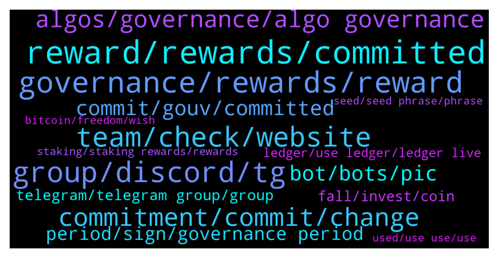

# **@algorand**
 ## Analysis for **2021-12-26** - **2022-01-02**.

---

## 📊 **Basic Stats**

**n_messages_sent**: 2213

---

---

## 🔝 **Top keywords and related messages**

1. **reward, rewards, committed**

    @cryptocoque 🍷 --- *I have 2 questions: 1) i put 100algo for gouvernance to the 2d period: how many rewards i will get? 2) how will be informed for sessions votes? Thanks* **--->** [TG Discussion](https://t.me/algorand/328276)

    @Adders28 --- *You can change it once you get rewards.* **--->** [TG Discussion](https://t.me/algorand/328564)

    @Jillani1256 --- *If this is it only then no benefit to get reward like this after 1quarter* **--->** [TG Discussion](https://t.me/algorand/328232)

    @hostodi --- *Opportunities in the ecosystem exist ofc but I meant protocol rewards* **--->** [TG Discussion](https://t.me/algorand/324946)

    @Crypt0Playa --- *Funny reading so many posts of people complaining about rewards. It's free. Talk about lack of appreciation and gratitude.* **--->** [TG Discussion](https://t.me/algorand/328318)

    @Tiny_Philosopher_784 --- *I think once holding rewards disappear, they might do it then* **--->** [TG Discussion](https://t.me/algorand/325856)

2. **governance, rewards, reward**

    @MackDenver --- *Check out the link below. The distribution of the governance reward will start from January 1 to January 5  https://algorand.foundation/news/key-dates-algorand-governance* **--->** [TG Discussion](https://t.me/algorand/328149)

    @MackDenver --- *Hey Gourab,  Governance rewards will be distributed in Q3 of 2022.* **--->** [TG Discussion](https://t.me/algorand/326734)

    @dotcosmo --- *when are governance rewards released? 31 dec?* **--->** [TG Discussion](https://t.me/algorand/323949)

    @MMulder432 --- *Do we need to claim the governance rewards manually or are they going to be dropped in your wallet in January?* **--->** [TG Discussion](https://t.me/algorand/326134)

    @Tiny_Philosopher_784 --- *The concept for rewards via governance lasts until 2030, and possibly beyond. So... it's 8+ years.* **--->** [TG Discussion](https://t.me/algorand/325927)

    @MackDenver --- *You will receive governance reward after December 31.* **--->** [TG Discussion](https://t.me/algorand/327836)

3. **group, discord, tg**

    @MackDenver --- *You should join the Spanish group  https://t.me/algorand_es* **--->** [TG Discussion](https://t.me/algorand/325289)

    @MackDenver --- *You can reach out to our discord about it  https://discord.com/invite/Pe8rwyPvKp* **--->** [TG Discussion](https://t.me/algorand/327091)

    @evio19x --- *I want to know more about this group* **--->** [TG Discussion](https://t.me/algorand/323905)

    @Chocoim --- *I was talking about that group* **--->** [TG Discussion](https://t.me/algorand/324694)

    @Kongkongstalk --- *Is there other official group for different languages？* **--->** [TG Discussion](https://t.me/algorand/323971)

    @Chompy --- *It says this group isn't available?* **--->** [TG Discussion](https://t.me/algorand/327774)

4. **team, check, website**

    @MackDenver --- *You can check the link below to find them  https://www.algorand.com/ecosystem/use-cases* **--->** [TG Discussion](https://t.me/algorand/325704)

    @MackDenver --- *We will take a look at them, Justin. Thank you* **--->** [TG Discussion](https://t.me/algorand/326633)

    @mlats4 --- *is there a website where i can see each of their TVL’s?* **--->** [TG Discussion](https://t.me/algorand/326132)

    @NightAlgorand --- *Hi there, you can check this out https://algorand.foundation/news/2nd-governance-period* **--->** [TG Discussion](https://t.me/algorand/327534)

    @MackDenver --- *I will check in with the team. You can also try contacting Swingby team* **--->** [TG Discussion](https://t.me/algorand/327780)

    @angelo9007 --- *I will let the team know* **--->** [TG Discussion](https://t.me/algorand/325283)

5. **commitment, commit, change**

    @NightAlgorand --- *As long as it's within the commitment period given.* **--->** [TG Discussion](https://t.me/algorand/328588)

    @idontknowwhattouseforusername --- *you know why i input a wrong number of commitment? because of the trailing zeros. the other day i input 10000, it turns out to be 100, and i did not take a further look because i was in the middle of sleep.   just now, i changed the commitment and found that 10000 input is actually 10000, not 100 any more.* **--->** [TG Discussion](https://t.me/algorand/326592)

    @hostodi --- *You can change now. Just commit again with a different amount* **--->** [TG Discussion](https://t.me/algorand/325594)

    @MackDenver --- *Hey there, the button for changing your commit should be made available soon* **--->** [TG Discussion](https://t.me/algorand/325780)

    @idontknowwhattouseforusername --- *no, i don't think so. if they won't hear us, they won't fix the issue i had yesterday, which , one can not update the commitment. it got fixed sometime just now* **--->** [TG Discussion](https://t.me/algorand/326588)

    @idontknowwhattouseforusername --- *You can update your commitment before the registration window ends* **--->** [TG Discussion](https://t.me/algorand/326053)

6. **algos, governance, algo governance**

    @Malvo --- *Greetings  has it reach the time to recommit your Algos for governance* **--->** [TG Discussion](https://t.me/algorand/325628)

    @Tiny_Philosopher_784 --- *And how many algos successfully remain in governance for 3 months* **--->** [TG Discussion](https://t.me/algorand/325934)

    @MackDenver --- *If you have kept ALGO committed for the first governance period, it is also committed for this round too.* **--->** [TG Discussion](https://t.me/algorand/326548)

    @bogieman8 --- *@daysandbox_boo are the algos locked for Governor? If so, how long?  What’s the minimum needed for governo?* **--->** [TG Discussion](https://t.me/algorand/325907)

    @MackDenver --- *Yes, these ALGOs will be distributed to all participants of the second governance period.* **--->** [TG Discussion](https://t.me/algorand/326985)

    @RalphCraig --- *Waiting for the end of the current governance period. My Algo is all locked up.* **--->** [TG Discussion](https://t.me/algorand/323825)

7. **commit, gouv, committed**

    @MackDenver --- *You had to commit your Algo during the signing period.* **--->** [TG Discussion](https://t.me/algorand/328763)

    @CD_1966 --- *Can we trade our committed algo?* **--->** [TG Discussion](https://t.me/algorand/328177)

    @yogeshroy --- *How to calculate 1 algo commitment round 1* **--->** [TG Discussion](https://t.me/algorand/328671)

    @Bastien --- *Hello, I just commited Algo to gouvernance 2. But just saw that I need to keep committed until 31 Dec for gouv #1. Did I made a mistake ?* **--->** [TG Discussion](https://t.me/algorand/325814)

    @Borosniper77 --- *Yes but I dont want to commit my algo until I receive my rewards from gov 1 then I know how much I will get to commit* **--->** [TG Discussion](https://t.me/algorand/328563)

    @mcmaxims --- *6k per period? thats too much I assume around 1k algo per 30k committed algo per period* **--->** [TG Discussion](https://t.me/algorand/327120)

8. **bot, bots, pic**

    @riqua21 --- *I know but I was wondering if race does play into perceptions about an account being a bot.  I'm sure it does but it's unconscious* **--->** [TG Discussion](https://t.me/algorand/325172)

    @mrlovin --- *Why each bot takes profile pictures of Chinese woman?* **--->** [TG Discussion](https://t.me/algorand/325154)

    @mrlovin --- *If each not would have a picture of a white women but behave like a bot I would also doubt accounts which have such pictures  The same for black man and so on  Nothing racist here* **--->** [TG Discussion](https://t.me/algorand/325169)

    @mrlovin --- *But if you see a Chinese women texting „hi“ it becomes obvious that it is a bot   If they would have a bot as profile pic I wouldn’t think so  Because a bot never says he is one* **--->** [TG Discussion](https://t.me/algorand/325157)

    @B-EZ --- *Seriously Asian's .. Wtf is wrong with u* **--->** [TG Discussion](https://t.me/algorand/323941)

    @mcmaxims --- *I do not get the purpose of these bots. They are not shilling anything and provide no apparent benefit to the one who runs them. What is their aim?* **--->** [TG Discussion](https://t.me/algorand/324260)

9. **period, sign, governance period**

    @MackDenver --- *Algorand governance period 2 sign up is ongoing at the moment.* **--->** [TG Discussion](https://t.me/algorand/326967)

    @MackDenver --- *It will start on January 1, you can already sign up for the next governance phase via the governance website* **--->** [TG Discussion](https://t.me/algorand/328237)

    @MackDenver --- *Hello Juan, The sign up is ongoing for the second governance period.* **--->** [TG Discussion](https://t.me/algorand/328729)

    @MackDenver --- *Governance period sign up is ongoing.* **--->** [TG Discussion](https://t.me/algorand/328424)

    @MackDenver --- *Sign up for second governance period is ongoing.* **--->** [TG Discussion](https://t.me/algorand/326741)

    @$ --- *This message is sign up period for governance 2#* **--->** [TG Discussion](https://t.me/algorand/325475)

10. **telegram, telegram group, group**

    @MackDenver --- *We are aware of them. You can report the group to Telegram and help us shut it down.* **--->** [TG Discussion](https://t.me/algorand/324798)

    @Martin --- *Thanks, do they have a telegram ?* **--->** [TG Discussion](https://t.me/algorand/324349)

    @BBeniek --- *Do we have maybe a telegram group or any other channels where people can exchange their algo coins research and knowledge?* **--->** [TG Discussion](https://t.me/algorand/325708)

    @daniel_falso --- *Hi admin... Who care abaut turkish telegram group... Lots of bullshit..   So many investor leaving.. I m also...* **--->** [TG Discussion](https://t.me/algorand/324530)

    @patrick_crypto --- *Not an official group but you might try @algorand_price I have an automatic translator set up so assuming you have your language set in Telegram, it should automatically translate to/from  your native language and the channel’s set language (English)* **--->** [TG Discussion](https://t.me/algorand/325287)

    @Real_Noonlord --- *Hello, i have a question. Official algorand Turkish group is full of spam and admin is getting paid for nothing. He seldomly shares some tweets and goes away. Also group is full of spambots and it is not maintained well.* **--->** [TG Discussion](https://t.me/algorand/325281)

11. **fall, invest, coin**

    @Alma --- *The market still has room to fall and has not yet bottomed out. You can reduce your position appropriately to reduce risk* **--->** [TG Discussion](https://t.me/algorand/323896)

    @Alma --- *This round of diving many copycat coins can no longer fluctuate. Although you have lost, now you need to change your trading strategies, the market still has to fall, even if you stop We haven't seen the bottom yet. You can reduce your exposure appropriately* **--->** [TG Discussion](https://t.me/algorand/324499)

    @thena_beger --- *This is a good tech coin, we can hit $5 by the month's end* **--->** [TG Discussion](https://t.me/algorand/328657)

    @Catherine08 --- *You won’t get rich if you invest where everyone else has invested.* **--->** [TG Discussion](https://t.me/algorand/325125)

    @Alma --- *Thank you for your approval. Now it is time to change the trading strategy. Instead of blindly following the trend of investment, it is better to stop losses in time, recover losses, trade in both directions, hedge risks, and maximize profits* **--->** [TG Discussion](https://t.me/algorand/323882)

    @Nazah --- *Btc down but this coin in looking great, I love it* **--->** [TG Discussion](https://t.me/algorand/327562)

12. **ledger, use ledger, ledger live**

    @Chris --- *thank you mack for a fast response, is there any link i can use to do step by step to do the process with my ledger?* **--->** [TG Discussion](https://t.me/algorand/326031)

    @farnoudnik --- *But there is no note section in ledger wallet* **--->** [TG Discussion](https://t.me/algorand/328715)

    @MackDenver --- *Can you please use My Algo Wallet since you are facing problem with Ledger?* **--->** [TG Discussion](https://t.me/algorand/328717)

    @AlgoDad --- *Go to https://wallet.myalgo.com/ and connect your ledger device.* **--->** [TG Discussion](https://t.me/algorand/328724)

    @Borosniper77 --- *You can link your ledger via my algo app* **--->** [TG Discussion](https://t.me/algorand/328740)

    @farnoudnik --- *Thank you Mack , I prefer to use ledger because it's more secure for me* **--->** [TG Discussion](https://t.me/algorand/328720)

13. **staking, staking rewards, rewards**

    @Wurzelbear --- *Will the staking rewards go up again or stay that low?* **--->** [TG Discussion](https://t.me/algorand/325409)

    @MJayCrypto --- *How come I don't get any staking rewards in the last months on my Algorand wallet? Has something changed?* **--->** [TG Discussion](https://t.me/algorand/325609)

    @smokeymon --- *Was the staking reward % decreased in December?* **--->** [TG Discussion](https://t.me/algorand/327864)

    @jakaaaas --- *why is the staking APR very low* **--->** [TG Discussion](https://t.me/algorand/325723)

    @MackDenver --- *It is the yearly reward. The staking APY was reduced. You can participate in the governance, commit your ALGO for a higher APY* **--->** [TG Discussion](https://t.me/algorand/325789)

    @earlyearner --- *Just wondering, what do you get for staking as a govonour?* **--->** [TG Discussion](https://t.me/algorand/328550)

14. **bitcoin, freedom, wish**

    @BO881N --- *But if you want to start crypto means you’re ready for the risk to gain or loose* **--->** [TG Discussion](https://t.me/algorand/323883)

    @Tiny_Philosopher_784 --- *Me? No, not paid.   It's just the cycle. Crypto is starting to move into nyse cyclicals.   I'm sure nobody sees it, because zoom out doesnt compute. Only if you claim to be stupid, because only dumb ones think there is no historical data to look at. History never repeats itself. Humans arent creatures of habit... they never repeat the same actions ever. When you think people wont do the same things, they never do.* **--->** [TG Discussion](https://t.me/algorand/324110)

    @Tiny_Philosopher_784 --- *It took years for anything to catch on, and now you're mad because you missed a bunch of pumps? How do you feel about all the pumps you missed before you got into crypto... you must be pretty mad about that. Darn fiat...* **--->** [TG Discussion](https://t.me/algorand/324669)

    @eXtremeV --- *Yes works fine and the best solution to store cryptos* **--->** [TG Discussion](https://t.me/algorand/327501)

    @Tiny_Philosopher_784 --- *Nodes don't pay like they do on other blockchains* **--->** [TG Discussion](https://t.me/algorand/325850)

    @Pablo_cast --- *I was out of crypto for many years and I fell here and I'm ok with it* **--->** [TG Discussion](https://t.me/algorand/327974)

15. **used, use use, use**

    @Nakibruce --- *If noone uses it it goes away* **--->** [TG Discussion](https://t.me/algorand/324169)

    @Pablo_cast --- *Once I wrote critic but word was citric* **--->** [TG Discussion](https://t.me/algorand/327007)

    @yunusp24 --- *even though i don't use it* **--->** [TG Discussion](https://t.me/algorand/327652)

    @Nakibruce --- *Now its how people use it* **--->** [TG Discussion](https://t.me/algorand/324155)

    @Chocoim --- *I used it to make a point* **--->** [TG Discussion](https://t.me/algorand/325044)

    @AgenteBanderas --- *Actually, I haven't used it in a while* **--->** [TG Discussion](https://t.me/algorand/325394)

