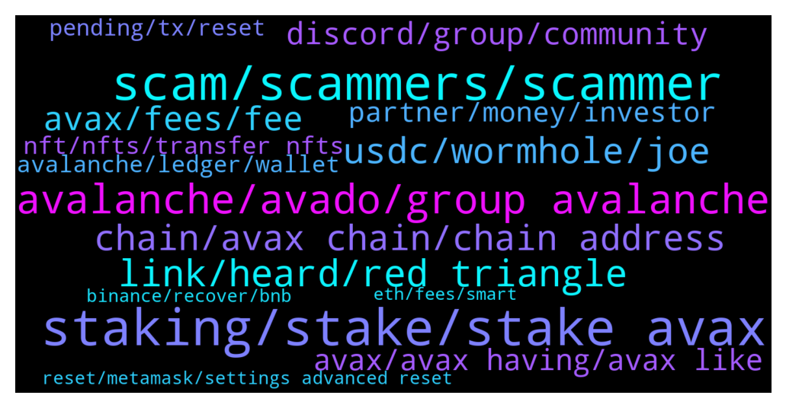

# **@avalancheavax**
 ## Analysis for **2021-12-26** - **2022-01-02**.

---

## 📊 **Basic Stats**

**n_messages_sent**: 1449

---

---

## 🔝 **Top keywords and related messages**

1. **staking, stake, stake avax**

    @PeppyCrypto --- *Where are people staking avax at ?* **--->** [TG Discussion](https://t.me/avalancheavax/315542)

    @Chef --- *Is avax possible to stake and if so on wich platform* **--->** [TG Discussion](https://t.me/avalancheavax/318217)

    @metad3pt --- *Avaware Launchpad Event is Live! https://avaware.network/launchpad - Stake AVE earn EMBR. cheers.* **--->** [TG Discussion](https://t.me/avalancheavax/315526)

    @NoGivenUp --- *It s at the moment on P one, cause I wanted to stake but it doesn't let me do it* **--->** [TG Discussion](https://t.me/avalancheavax/317463)

    @retiredcoin --- *not really on yieldyak de-staking from some pools, some takes about 0.08avax which is hefty* **--->** [TG Discussion](https://t.me/avalancheavax/317554)

    @Nikki7363 --- *Anybody knows if i redeemed my staking  before maturity date on binance so should I get holding period days interest* **--->** [TG Discussion](https://t.me/avalancheavax/317742)

2. **scam, scammers, scammer**

    @benwst --- *some scammer use your name and your profile pic and dm me* **--->** [TG Discussion](https://t.me/avalancheavax/316254)

    @ramziakram --- *they can maybe contact google regarding scammy ad on google promoting fake website* **--->** [TG Discussion](https://t.me/avalancheavax/316008)

    @modulor_stf --- *My god. I’m getting spamed with scams to help me out with my wallet “issue” - it is crazy how many bots here lol* **--->** [TG Discussion](https://t.me/avalancheavax/315423)

    @JimWelder --- *How do scams even work? Do you just ask enough people to deposit coins into your wallet?* **--->** [TG Discussion](https://t.me/avalancheavax/315515)

    @Nicolas_A --- *Are you just trying to get as many dm from scammers as possible or really need help ? You can just contact me if you need help no need to pay lol* **--->** [TG Discussion](https://t.me/avalancheavax/317522)

    @Yoopez --- *don't worry, soon they will stop their shitty cashgrabs. I've found their real identities :). They will regret all their soft scam* **--->** [TG Discussion](https://t.me/avalancheavax/318632)

3. **avalanche, avado, group avalanche**

    @Rocco --- *Hi Guys Is there an legit Defi 2.0 project on the avalanche chain?* **--->** [TG Discussion](https://t.me/avalancheavax/318388)

    @Nicolas_A --- *List of projects ? Everyone is pretty much working on Avalanche related stuff* **--->** [TG Discussion](https://t.me/avalancheavax/318189)

    @Eagle'sEye® --- *Glad to be in group - I am on the top Avalanche admirer.* **--->** [TG Discussion](https://t.me/avalancheavax/316199)

    @bestcoderna --- *Join us for our Avalanche Weekly Wrap-up https://twitter.com/i/spaces/1lDxLLOEwezxm* **--->** [TG Discussion](https://t.me/avalancheavax/318935)

    @key_requirements --- *https://medium.com/@Studio_73/all-hands-on-deck-this-battlecruiser-is-operational-goliath-online-target-locked-a615dc07c7c  Get white listed for air drops. Participate for tokens, etc etc! Excited to be part of the Avalanche network!* **--->** [TG Discussion](https://t.me/avalancheavax/316910)

    @bestcoderna --- *Join us for our Avalanche Weekly Wrapup https://twitter.com/i/spaces/1ypKdEeNXaaGW* **--->** [TG Discussion](https://t.me/avalancheavax/317191)

4. **link, heard, red triangle**

    @Defi_Senpai --- *Wow… cool, a link to their website or TG if you have … Thanks* **--->** [TG Discussion](https://t.me/avalancheavax/315566)

    @FutureTiger --- *that's what i thought.. thanx for confirming!* **--->** [TG Discussion](https://t.me/avalancheavax/318723)

    @metamaskalt --- *Maybe you can take a look at MERD* **--->** [TG Discussion](https://t.me/avalancheavax/317964)

    @Nicolas_A --- *Don’t know but it played a large role in its creation from what I understood* **--->** [TG Discussion](https://t.me/avalancheavax/317167)

    @don_wonton --- *Let me know if you still need the link* **--->** [TG Discussion](https://t.me/avalancheavax/316417)

    @mcored --- *They told me once that it does not* **--->** [TG Discussion](https://t.me/avalancheavax/315906)

5. **usdc, wormhole, joe**

    @manilabear --- *My usdc Its not showing up on trader joe if I click usdc or usdc.e but Its showing up on snowtrace as usd coin (wormhole)* **--->** [TG Discussion](https://t.me/avalancheavax/317697)

    @FutureTiger --- *Ah yes, Daniele, he was recommended on Banter, by Ran I think, or maybe Ellio Trades... probably both, and many more :)* **--->** [TG Discussion](https://t.me/avalancheavax/318522)

    @Andwonski --- *Can someone enlighten me on usdc and usdc.e* **--->** [TG Discussion](https://t.me/avalancheavax/317796)

    @TheSEOdude --- *even real USDT isn't that safe , haha* **--->** [TG Discussion](https://t.me/avalancheavax/317956)

    @TheSEOdude --- *Many - AUSD ,usdt.e, USDC.e , dai.e, mim* **--->** [TG Discussion](https://t.me/avalancheavax/317936)

    @Andwonski --- *I thought usdc.e was the bridged version for use on avax. If there is native usdc now what is the point in having both* **--->** [TG Discussion](https://t.me/avalancheavax/317797)

6. **chain, avax chain, chain address**

    @bull2021 --- *Thanks. Any tutorial on how to make the MetaMask -> P Chain.   Btw I got hit up by 5 people claiming to be from AVAX support :)* **--->** [TG Discussion](https://t.me/avalancheavax/315593)

    @FutureTiger --- *Hullo chaps, when withdrawing AVAX from gateIO, I am offered 2 Chains, AVAX chain and AVAX C-Chain. The fee for AVAX chain is small but AVAX C-Chain is very expensive. Is it safe to send AVAX from Gate to Metamask using AVAX Chain? If it is not safe, perhaps I should buy TIME on gateIO itself, and then send TIME to MM using AVAX C-Chain. For some mysterious reason the fee is small when withdrawing TIME from Gate using AVAX C-Chain !* **--->** [TG Discussion](https://t.me/avalancheavax/318702)

    @Nicolas_A --- *Never used them. It should show it on this page https://ascendex.com/en/assets/assets-recharge/AVAX If it gives you a deposit address starting with 0x it will be C chain if it gives you a X-avax1 address it will be X chain* **--->** [TG Discussion](https://t.me/avalancheavax/317449)

    @proletarij --- *Hello, I would like to withdraw AVAX from Bitrue. should I use the X-chain or C-chain address? Does anyone have experience there? Thanks.* **--->** [TG Discussion](https://t.me/avalancheavax/317922)

    @coctail_Bae --- *Hi there, I’m new to avax and c chain, I’m mostly playing on bsc I would like to know what’s the equivalent of poocoin on the avax chain? Thanks* **--->** [TG Discussion](https://t.me/avalancheavax/316870)

    @NoGivenUp --- *I don't have enough avax where would I leave it into? I means which chain would you recommend? It s on P chain at the moment* **--->** [TG Discussion](https://t.me/avalancheavax/317473)

7. **avax, fees, fee**

    @alexbwork --- *If we wanna see avax in top 5 my assuming the fees must be lowered* **--->** [TG Discussion](https://t.me/avalancheavax/317536)

    @Alex --- *AVAX had a 2 billion mkt cap at the time of sale. With the vesting schedule unknown (being unlocked right now as u assume) it can be over 10 percent at this moment.* **--->** [TG Discussion](https://t.me/avalancheavax/317433)

    @alrko616 --- *so. what are avax feees? say you want to transfer 100 worth of avax* **--->** [TG Discussion](https://t.me/avalancheavax/317720)

    @Nicolas_A --- *Around 10% paid out in avax* **--->** [TG Discussion](https://t.me/avalancheavax/317470)

    @algomator --- *kk, will troubleshoot elsewhere. How are average Avalaunch returns? Good?* **--->** [TG Discussion](https://t.me/avalancheavax/315898)

    @ericds1 --- *How does subnets accrue value to Avax token fees?* **--->** [TG Discussion](https://t.me/avalancheavax/316116)

8. **discord, group, community**

    @defikeyser --- *Yeah I’m not sure what is the build guild on discord* **--->** [TG Discussion](https://t.me/avalancheavax/316419)

    @JayMCrypto --- *If you can't find anyone here, proceed to discord mate a lot of devs there  https://discord.com/invite/RwXY7P6* **--->** [TG Discussion](https://t.me/avalancheavax/319049)

    @oathtobarbatos --- *I don't think so, honestly. But, there's a Discord server for builders and devs, you should give it a try!* **--->** [TG Discussion](https://t.me/avalancheavax/317839)

    @Rugpull_Prevention --- *The build guild on Discord is a good place to make connections* **--->** [TG Discussion](https://t.me/avalancheavax/316413)

    @Islam --- *Gah - got it confused with discord, must be hell trying to do community management across 6 different platforms* **--->** [TG Discussion](https://t.me/avalancheavax/318810)

    @officaldotoracle --- *Discord opens in 1 hour and 40 min first 50 to get in. Get wl i think it is a good opportunity* **--->** [TG Discussion](https://t.me/avalancheavax/318060)

9. **avax, avax having, avax like**

    @VatsalS33 --- *Good to see fellow Indian Avax maxis :)* **--->** [TG Discussion](https://t.me/avalancheavax/317093)

    @hossein_barati_93 --- *Thank you very much But I mean good news for avax* **--->** [TG Discussion](https://t.me/avalancheavax/318429)

    @elizabeth_baker --- *I'm holding Avax long term. Sorry I don't feel your pain ☺* **--->** [TG Discussion](https://t.me/avalancheavax/317736)

    @alexbwork --- *I like everytgin about AVAX and I’m really a big fan of ecosystem and etc but these fees are really will became a problem with growing* **--->** [TG Discussion](https://t.me/avalancheavax/317541)

    @Juanleobi --- *I guess, Colony ($CLY) is one of the best innovative idea in AVAX ecosystem; 🥳🥳🥳* **--->** [TG Discussion](https://t.me/avalancheavax/317957)

    @berzctnky --- *https://twitter.com/coinmarketcap/status/1473286657759715328?s=21  vote for avax please* **--->** [TG Discussion](https://t.me/avalancheavax/316476)

10. **partner, money, investor**

    @Albert --- *Is that an investment advice? 😂* **--->** [TG Discussion](https://t.me/avalancheavax/316077)

    @Aileen198801 --- *It’s not, but I only have this portfolio at the moment* **--->** [TG Discussion](https://t.me/avalancheavax/316078)

    @J.Walton --- *Please who knows how to invest right now* **--->** [TG Discussion](https://t.me/avalancheavax/318434)

    @Rohit1803 --- *My friend also looking for investor partner* **--->** [TG Discussion](https://t.me/avalancheavax/317240)

    @R0H1T0 --- *You are investor my friend need investor* **--->** [TG Discussion](https://t.me/avalancheavax/318148)

    @Alex --- *Not only is it disingenuous to your early investors, it has become borderline a pnd* **--->** [TG Discussion](https://t.me/avalancheavax/317399)

11. **nft, nfts, transfer nfts**

    @Nicolas_A --- *Use a marketplace to interact with your NFT such as Nftrade* **--->** [TG Discussion](https://t.me/avalancheavax/316320)

    @acharacteristic --- *https://go.kalao.io/firat/ guys check out this nft collection emin changed his pfp too* **--->** [TG Discussion](https://t.me/avalancheavax/317555)

    @THEREALTWENTEMINING --- *metamask mobile is better suited for this though. the NFTs should appear under 'Collectibles' in MetaMask Mobile.* **--->** [TG Discussion](https://t.me/avalancheavax/316324)

    @Nicolas_A --- *Kalao / NFtrade are 2 marketplaces* **--->** [TG Discussion](https://t.me/avalancheavax/319044)

    @polpol99 --- *Ok, thanks. Didn't see that function on NFT Trade. But Kalao has it* **--->** [TG Discussion](https://t.me/avalancheavax/316331)

    @oldangusred --- *Hi! Can I share here an NFT initiative for charity? Thank you!* **--->** [TG Discussion](https://t.me/avalancheavax/317211)

12. **avalanche, ledger, wallet**

    @modulor_stf --- *Hey guys. Anyone here recently set up a ledger to work with avalanche via MetaMask? I* **--->** [TG Discussion](https://t.me/avalancheavax/315412)

    @Carlos --- *Can I use my seed phrase of avalanche wallet on MetaMask Sr.?* **--->** [TG Discussion](https://t.me/avalancheavax/318586)

    @Nicolas_A --- *Install the Ethereum app to use Avalanche C chain with Metamask* **--->** [TG Discussion](https://t.me/avalancheavax/315415)

    @hiteshpahwa --- *Does capitalisation of wallet address matters in smart contracts in avalanche?* **--->** [TG Discussion](https://t.me/avalancheavax/318195)

    @Nicolas_A --- *Yes but that’s with every crypto wallet not specific to Avalanche* **--->** [TG Discussion](https://t.me/avalancheavax/316506)

    @sri3003 --- *Is avalanche wallet on metamask a c-chain wallet* **--->** [TG Discussion](https://t.me/avalancheavax/318276)

13. **reset, metamask, settings advanced reset**

    @Nicolas_A --- *Try to reset Metamask perhaps. Try another token* **--->** [TG Discussion](https://t.me/avalancheavax/316842)

    @polpol99 --- *https://metamask.zendesk.com/hc/en-us/articles/360058961911-How-do-I-send-receive-or-cash-out-an-NFT-   "Currently, this functionality should only be attempted in MetaMask Mobile"* **--->** [TG Discussion](https://t.me/avalancheavax/316327)

    @Nicolas_A --- *Sometimes resetting Metamask helps. Settings > Advanced > Reset. Not sure what issue you have* **--->** [TG Discussion](https://t.me/avalancheavax/317662)

    @oathtobarbatos --- *Try resetting your Metamask wallet, there has been an issue with Metamask and you might have to reset your profile. Settings > Advanced > Reset profile* **--->** [TG Discussion](https://t.me/avalancheavax/316701)

    @Nicolas_A --- *Never heard of this error. Have you tried resetting Metamask ? Settings > Advanced > Reset* **--->** [TG Discussion](https://t.me/avalancheavax/316651)

    @Nicolas_A --- *Reset Metamask : settings > advanced > reset* **--->** [TG Discussion](https://t.me/avalancheavax/315918)

14. **binance, recover, bnb**

    @w4zii --- *Hi.  Can anyone help.  I had some BNB in my avax c chain on metamask and sent it to binance but to  the erc20 network. I know a newbie mistake.  The transaction says completed, but obviously the BnB doesn't show up on binance.   Is there any way to recover the BnB?* **--->** [TG Discussion](https://t.me/avalancheavax/318990)

    @scanty12 --- *I sent a token(spell) from MetaMask which happens to be on fantom network to Binance through Avax c chain network, the transaction is successful but I didn’t get the token in my Binance* **--->** [TG Discussion](https://t.me/avalancheavax/317095)

    @Nicolas_A --- *Not sure how it works with Binance. Ask their support* **--->** [TG Discussion](https://t.me/avalancheavax/317759)

    @rusakova_8 --- *I transferred from Coinlist to Binance* **--->** [TG Discussion](https://t.me/avalancheavax/317613)

    @aleonardo83 --- *it's the address that Binance provides when you select "Deposit" in your wallet* **--->** [TG Discussion](https://t.me/avalancheavax/315801)

    @Nicolas_A --- *I don't think Binance supports Spell deposits* **--->** [TG Discussion](https://t.me/avalancheavax/317119)

15. **pending, tx, reset**

    @algomator --- *Tx is still stuck as "pending" in metamask and not showing on explorer. When I go to cancel or "speed up" it says insufficient funds even though there is plenty.* **--->** [TG Discussion](https://t.me/avalancheavax/315916)

    @don_wonton --- *How long? If it’s been stuck for more than a few minutes it’s a Metamask issue and you might have to reset your profile. Settings > advanced > reset profile (it just clears the history and pending transactions)* **--->** [TG Discussion](https://t.me/avalancheavax/316408)

    @Nicolas_A --- *A few seconds if it’s still pending it means either you have to reset Metamask or the gas price is too low* **--->** [TG Discussion](https://t.me/avalancheavax/316608)

    @yisus --- *I am trying to make a trade, but it only appears pending for hours and nothing happens anymore, if someone knows something thank you!* **--->** [TG Discussion](https://t.me/avalancheavax/315802)

    @KOKKI3 --- *Whole network is fooked now. Having multiple tx in queue* **--->** [TG Discussion](https://t.me/avalancheavax/315788)

    @onepn --- *Can't go to the next step in pending.  Am I the only one like this?* **--->** [TG Discussion](https://t.me/avalancheavax/316530)

