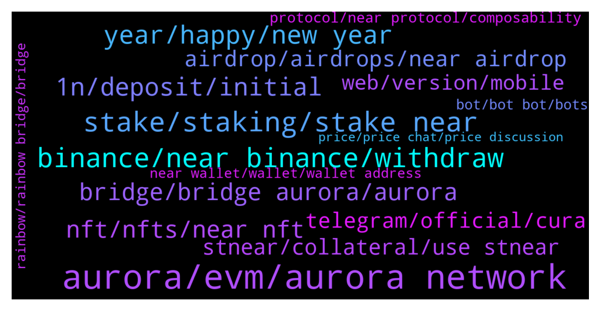

# **@cryptonear**
 ## Analysis for **2021-12-26** - **2022-01-02**.

---

## 📊 **Basic Stats**

**n_messages_sent**: 4202

---

---

## 🔝 **Top keywords and related messages**

1. **aurora, evm, aurora network**

    @xerophyte --- *so is aurora like C chain, and near is like x chain, then i should be on the aurora for defi?* **--->** [TG Discussion](https://t.me/cryptonear/250859)

    @haidang87dotcom --- *Hello all. Anyone know how Near get the benefit as Aurora growth? Please explain or give me some docs, thanks!* **--->** [TG Discussion](https://t.me/cryptonear/252848)

    @kv9990 --- *For adding aurora network to MetaMask ,here's the process https://t.me/cryptonear/195500* **--->** [TG Discussion](https://t.me/cryptonear/252465)

    @kv9990 --- *Check adding this configs Network Name: Aurora New RPC URL: https://mainnet.aurora.dev Chain ID: 1313161554 Symbol: ETH Block Explorer URL: https://explorer.mainnet.aurora.dev* **--->** [TG Discussion](https://t.me/cryptonear/253096)

    @larry_lang --- *To add the network manually, go to MetaMask networks, choose Custom RPC and enter the following settings: Network Name: Aurora Mainnet New RPC URL: https://mainnet.aurora.dev Chain ID: 1313161554 Symbol: ETH Block Explorer URL: https://explorer.mainnet.aurora.dev* **--->** [TG Discussion](https://t.me/cryptonear/246767)

    @iforbusiness2 --- *In addition to this I suggest you to conect with aurora here - https://t.me/auroraisnear for your appropriate reply 😊@marko_eth* **--->** [TG Discussion](https://t.me/cryptonear/256900)

2. **stake, staking, stake near**

    @Kripto_Raptor --- *it's non custodial brilliant staking solution* **--->** [TG Discussion](https://t.me/cryptonear/246489)

    @Chad_Capital --- *don't see it on the near wallet sit staking list, wouldn't it be better to pick one from there?* **--->** [TG Discussion](https://t.me/cryptonear/250649)

    @Aflatoon123 --- *4 to 5 people are shilling it.* **--->** [TG Discussion](https://t.me/cryptonear/244895)

    @davidroram --- *yes...not...LP...just straight...stake X get more X* **--->** [TG Discussion](https://t.me/cryptonear/250242)

    @sathviknarayan --- *Is staking available in near protocol* **--->** [TG Discussion](https://t.me/cryptonear/256631)

    @alanshoresh --- *I've been staking near for long, not sure if there's aridrops for stakers.* **--->** [TG Discussion](https://t.me/cryptonear/252302)

3. **binance, near binance, withdraw**

    @SidMh --- *I am trying to create near wallet. But binance and kucoin withdrawl are not working for hours.  Can someone give me 0.1 near to funding wallet address?* **--->** [TG Discussion](https://t.me/cryptonear/252613)

    @TJ --- *Is there any way I can deposit NEAR to my NEAR wallet for now? I usually use Binance but now the network is suspended* **--->** [TG Discussion](https://t.me/cryptonear/251345)

    @paperdawg --- *Hi, if im sending NEAR from binance to binance what network should i use? ERC20?* **--->** [TG Discussion](https://t.me/cryptonear/249486)

    @bekzody --- *Can Binance help me in this situation?* **--->** [TG Discussion](https://t.me/cryptonear/245232)

    @bailey_12 --- *https://twitter.com/binance/status/1476373583647682563  Check this out. They have a promotion to stake Near on binance* **--->** [TG Discussion](https://t.me/cryptonear/257619)

    @Thorsten --- *Hello, tbh I just entered because I was having problems with transferring NEAR from my binance account to my (new) NEAR wallet, so I wanted to find some support, so I joined the channel. But I could fix the problem before writing something here, still I decided to stay so I could get to know this project a little bit better* **--->** [TG Discussion](https://t.me/cryptonear/253022)

4. **year, happy, new year**

    @kenjay60 --- *Happy New year to you all guys* **--->** [TG Discussion](https://t.me/cryptonear/257524)

    @NEARverse_xd --- *Happy New Year to all Nearians💸* **--->** [TG Discussion](https://t.me/cryptonear/256600)

    @ShmagPolyp --- *Hello peoples. New to the group and just wanted to say happy new year to you all 🎉🥂* **--->** [TG Discussion](https://t.me/cryptonear/257464)

    @cuongdcc --- *happy a NEAR new year 😉* **--->** [TG Discussion](https://t.me/cryptonear/257229)

    @lxydeep --- *Happy New year Near Fam 🌟* **--->** [TG Discussion](https://t.me/cryptonear/257331)

    @NEARverse_xd --- *Hello, happy new year to you too bro🙌* **--->** [TG Discussion](https://t.me/cryptonear/257348)

5. **1n, deposit, initial**

    @minhBui28 --- *when create near wallet, I need to deposit 0.1 NEAR, is this true?* **--->** [TG Discussion](https://t.me/cryptonear/255683)

    @Diligentmart --- *Submit a manual deposit. Meet the minimum initial deposit by sending at least 0.1 NEAR to the single-use funding address below. please what does this mean after creating near wallet??* **--->** [TG Discussion](https://t.me/cryptonear/256253)

    @Kripto_Raptor --- *send 0.1N from your exchange first* **--->** [TG Discussion](https://t.me/cryptonear/258350)

    @iforbusiness2 --- *welcome, I guess your understood why it is worthy to deposit 0.1n on the time of wallet creation 😄😄😄* **--->** [TG Discussion](https://t.me/cryptonear/257947)

    @Kripto_Raptor --- *you will be needing 0.1N initial deposit to activate your wallet, funds will be used to cover storage and transfer fees* **--->** [TG Discussion](https://t.me/cryptonear/245992)

    @Aflatoon123 --- *You can forward me your funding address. I will send 0.1 near* **--->** [TG Discussion](https://t.me/cryptonear/252623)

6. **nft, nfts, near nft**

    @htmk_htmk --- *How did u giys get these special nft* **--->** [TG Discussion](https://t.me/cryptonear/245388)

    @larry_lang --- *https://twitter.com/NEAR_Blockchain/status/1476597987501654026 for artists and NFT-savy people u might wanna loook at this NFT design contest^^* **--->** [TG Discussion](https://t.me/cryptonear/256515)

    @bailey_12 --- *Haha, When I received my first salaries, I was planning to use all of it to buy that NFTs. But @guatopori stopped me tho.* **--->** [TG Discussion](https://t.me/cryptonear/251198)

    @baximargik --- *NEAR NFT WEEK | ISSUE 15  December 13 - December 19  15th issue of NEAR NFT WEEK covering the highlights of our NFT communities is out now!   🔗 https://twitter.com/NEARNFTWEEK/status/1472970706430406659?s=20* **--->** [TG Discussion](https://t.me/cryptonear/246235)

    @baximargik --- *NEAR NFT WEEK | ISSUE 16 December 20 - December 26  16th issue of NEAR NFT WEEK covering the highlights of our NFT communities is out now!   🔗 https://twitter.com/NEARNFTWEEK/status/1475518649444274185* **--->** [TG Discussion](https://t.me/cryptonear/254643)

    @naveenkandwal --- *The Clan DAO is Collecting ART #NFT - If you are an Artist and looking to share your NFT to a collector.  - Check this tweet  https://twitter.com/theclanDAO/status/1474125419414790152 - Use tag #art2adNEAR to connect 🤝 with the Clan DAO* **--->** [TG Discussion](https://t.me/cryptonear/251788)

7. **bridge, bridge aurora, aurora**

    @nino706 --- *hello, how do we turn atUST to UST to bridge to Terra ?* **--->** [TG Discussion](https://t.me/cryptonear/252792)

    @GK033 --- *Is it easy to bridge to aurora and use platforms there? I have been reading about Tri and think I want some* **--->** [TG Discussion](https://t.me/cryptonear/246752)

    @LDavila30 --- *Hello guys, there's some way to bridge my near to aurora? I'm a bit confused about it 🧐* **--->** [TG Discussion](https://t.me/cryptonear/247938)

    @larry_lang --- *yeah i think stNEAR bridging is possible- but just a head up stNEAR is not yet tradeable on Aurora network so it's best keeping it here* **--->** [TG Discussion](https://t.me/cryptonear/246777)

    @DanAlvarez79 --- *This is a little messy but it’ll work  Swap for atUST on Trisolaris and bridge from aurora to terra via allbridge  Then bridge from terra to binance via terra bridge   Then swap from UST on pancakeswap for usdt and bridge to matic via Anyswap* **--->** [TG Discussion](https://t.me/cryptonear/253483)

    @iGero --- *all bridges uses aurora, not near blockchain?* **--->** [TG Discussion](https://t.me/cryptonear/257213)

8. **airdrop, airdrops, near airdrop**

    @nipper1234 --- *Can we stake near somewhere?Any airdrops on near?* **--->** [TG Discussion](https://t.me/cryptonear/248891)

    @Kaiguy69 --- *If trisolaris is doing airdrop then that means empyrean has to be legit right?* **--->** [TG Discussion](https://t.me/cryptonear/253691)

    @Kripto_Raptor --- *participate in AMA's, Airdrops, don't miss important events* **--->** [TG Discussion](https://t.me/cryptonear/247621)

    @FritzWagner --- *Yep, and they still havent distribute the airdrop yet* **--->** [TG Discussion](https://t.me/cryptonear/256223)

    @Adebabss --- *Good evening guys  Concerning the near  coinmarket cap airdrop please is creating wallet compulsory?   I submitted the questions without creating the wallet* **--->** [TG Discussion](https://t.me/cryptonear/253508)

    @GHOSTT6751 --- *Where can I see the results and winners of the near airdrop on coinmarketcap?* **--->** [TG Discussion](https://t.me/cryptonear/258857)

9. **stnear, collateral, use stnear**

    @ClaudioAC --- *Now for stNEAR being used on DeFi DApps* **--->** [TG Discussion](https://t.me/cryptonear/245787)

    @ClaudioAC --- *we think GameFi can use stNEAR* **--->** [TG Discussion](https://t.me/cryptonear/245725)

    @ClaudioAC --- *Also we want to help DApps and Platforms that use stNEAR* **--->** [TG Discussion](https://t.me/cryptonear/245810)

    @ClaudioAC --- *to discuss how GameFi could be developed with stNEAR as a digital asset* **--->** [TG Discussion](https://t.me/cryptonear/245562)

    @Kripto_Raptor --- *wow! stNear has so many usecases and being able to use it as a collateral shows the great architecture and marketing of Metpool, congratulations guys!* **--->** [TG Discussion](https://t.me/cryptonear/245565)

    @fiolalala --- *https://near.oin.finance/Vault/    Is this website used to mortgage your stnear and borrow USDO stable currency? When the value of stnear falls beyond a certain price, the collateral stNear will be liquidated, right?* **--->** [TG Discussion](https://t.me/cryptonear/254760)

10. **telegram, official, cura**

    @xerophyte --- *but man new to these telegram channels .. there are lots of scammer* **--->** [TG Discussion](https://t.me/cryptonear/251021)

    @Zedrone --- *Hi all!  Is there a Near News Channel on Telegram?* **--->** [TG Discussion](https://t.me/cryptonear/248512)

    @Bruno_Caldass --- *Is there any Brazilian telegram group (Brazil)?  Existe algum grupo de telegram brasileiro(Brasil)?* **--->** [TG Discussion](https://t.me/cryptonear/258366)

    @Zedrone --- *Any other useful Telegram groups? :)* **--->** [TG Discussion](https://t.me/cryptonear/248558)

    @Kripto_Raptor --- *this is the Near Protocol Official Telegram sir* **--->** [TG Discussion](https://t.me/cryptonear/249364)

    @rimberjack --- *are we all sticking around the telegram chat* **--->** [TG Discussion](https://t.me/cryptonear/248642)

11. **web, version, mobile**

    @Ak47fantom --- *It doesn't have a mobile version. I only use my mobile . I don't have a pc* **--->** [TG Discussion](https://t.me/cryptonear/248668)

    @thanano46 --- *Hahaha . .. nothing much sir .. you know mobile phones are really frustrating sometimes.. using 24*7 ..full addicted to it... It's 5 am over here and i haven't slept till yet..  Using mobile and watching youtube 🥶🥶* **--->** [TG Discussion](https://t.me/cryptonear/253579)

    @NEARverse_xd --- *Why only pc? You can use web version in your android device too.* **--->** [TG Discussion](https://t.me/cryptonear/248723)

    @Ak47fantom --- *It's on the play store . There is no app for it* **--->** [TG Discussion](https://t.me/cryptonear/248732)

    @larry_lang --- *pls use the PC version the  phone metamask gonna take gas fee for some reason@@* **--->** [TG Discussion](https://t.me/cryptonear/253043)

    @larry_lang --- *i mean u are using an mobile version right now soooo* **--->** [TG Discussion](https://t.me/cryptonear/253081)

12. **protocol, near protocol, composability**

    @ItsMeJo2021 --- *Near protocol already have smartcontracts ?* **--->** [TG Discussion](https://t.me/cryptonear/246961)

    @Darius_Nearinsider --- *Do u know ProphetOne is now a validator on NEARProtocol* **--->** [TG Discussion](https://t.me/cryptonear/255539)

    @ItsMeJo2021 --- *And near protocol already provide smartcontracts right on its own ? Or dos aurora build the smartcontracts for Near protocol?* **--->** [TG Discussion](https://t.me/cryptonear/246971)

    @bekzody --- *how can I be a validator for NEAR Protocol?* **--->** [TG Discussion](https://t.me/cryptonear/258204)

    @Abraham --- *Pls am new to near protocol pls can some one enlighten me on it* **--->** [TG Discussion](https://t.me/cryptonear/255063)

    @FritzWagner --- *hehe NEAR Protocol is just amazing =) low fees, instant, scalable, and full of lovely members* **--->** [TG Discussion](https://t.me/cryptonear/257316)

13. **bot, bot bot, bots**

    @pavelgordok --- *I can't work with this bot lol* **--->** [TG Discussion](https://t.me/cryptonear/252230)

    @SteveBarns --- *No sanket is not a bot lol* **--->** [TG Discussion](https://t.me/cryptonear/248485)

    @thanano46 --- *Why you bot always set profile pictures of ladies??* **--->** [TG Discussion](https://t.me/cryptonear/247632)

    @kv9990 --- *Hey ma'am are you a bot?  👀* **--->** [TG Discussion](https://t.me/cryptonear/245368)

    @Kripto_Raptor --- *it's so obvious isn't it :D programmed by same guy -60 iq* **--->** [TG Discussion](https://t.me/cryptonear/247634)

    @thanano46 --- *Yes bot.. it's a good time to buy an iPhone.* **--->** [TG Discussion](https://t.me/cryptonear/244623)

14. **near wallet, wallet, wallet address**

    @Williak --- *How to make near wallet in indo?* **--->** [TG Discussion](https://t.me/cryptonear/252135)

    @larry_lang --- *here is a NEAR wallet creation tutorial that you might need: https://near.org/blog/getting-started-with-the-near-wallet/ but after wallet is done u are good to go* **--->** [TG Discussion](https://t.me/cryptonear/254999)

    @LifeMachine4 --- *is it normal to have to "import existing account" each time one wants to check one's near wallet at https://wallet.near.org ? Or is there supposed to be a general sign-in option?* **--->** [TG Discussion](https://t.me/cryptonear/252685)

    @xGemsHunter --- *any hack to get in... from bsc metamask.. created my near wallet as well.. got my .near ID :)* **--->** [TG Discussion](https://t.me/cryptonear/246351)

    @bailey_12 --- *this is not a Near wallet address, this doesn't exist on Near network.* **--->** [TG Discussion](https://t.me/cryptonear/251364)

    @larry_lang --- *https://near.org/blog/getting-started-with-the-near-wallet/ also here is a guide on how to create a NEAR wallet for u^^* **--->** [TG Discussion](https://t.me/cryptonear/253974)

15. **rainbow, rainbow bridge, bridge**

    @iGero --- *can you give me some bridges links?* **--->** [TG Discussion](https://t.me/cryptonear/257203)

    @Kripto_Raptor --- *i haven't used it yet sir, please use rainbowbridge then* **--->** [TG Discussion](https://t.me/cryptonear/257285)

    @larry_lang --- *also u might wanna ask more question about bridging in the rainbow bridge channel: https://t.me/auroraisnear* **--->** [TG Discussion](https://t.me/cryptonear/258827)

    @kv9990 --- *Yes you can bridge directly using Rainbow Bridge. Process is same as bridging from eth to near ,guide   It'll come unwrapped* **--->** [TG Discussion](https://t.me/cryptonear/251435)

    @Kripto_Raptor --- *no you can't you need to use bridges* **--->** [TG Discussion](https://t.me/cryptonear/257202)

    @kv9990 --- *Guide for Rainbow bridge :) https://twitter.com/finance_ref/status/1433241716526485511  It takes time to bridge from ETH to NEAR and will need a second confirmation after few hours!* **--->** [TG Discussion](https://t.me/cryptonear/251326)

