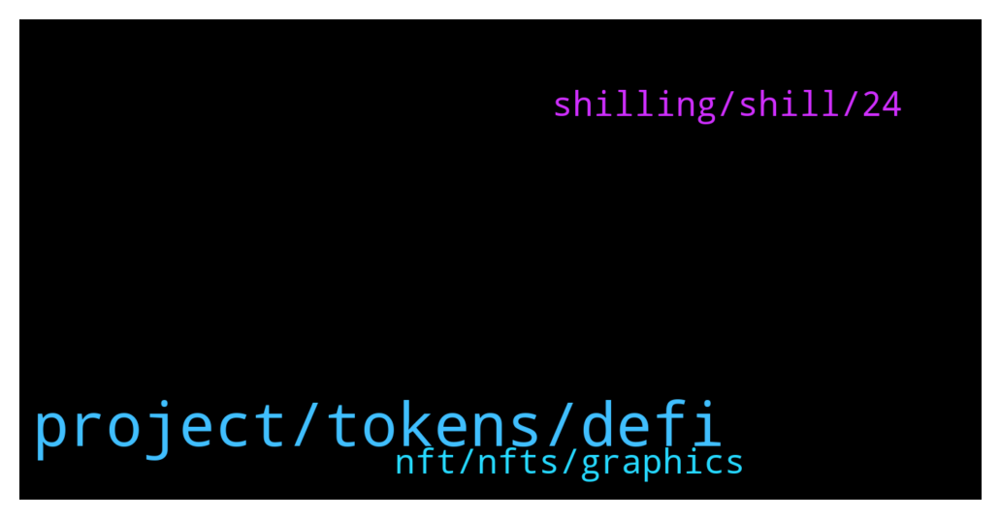

# **@de_fi**
 ## Analysis for **2021-12-26** - **2022-01-02**.

---

## 📊 **Basic Stats**

**n_messages_sent**: 120

---

---

## 🔝 **Top keywords and related messages**

1. **project, tokens, defi**

    @AndryZ212 --- *Hey some advice, many projects seem to be having their own Defi these days.* **--->** [TG Discussion](https://t.me/de_fi/232855)

    @Vincent See --- *https://www.youtube.com/watch?v=jXKPTovVO90 How to make own listed coins* **--->** [TG Discussion](https://t.me/de_fi/232910)

    @cryptld --- *If you're interested in DeFi then you have to check out $TXL, the native token of the Tixl ecosystem and the Autobahn Network! I bet you'd love what the team is building. You should look look into Tixl's Cross Chain Bridge v2.0.* **--->** [TG Discussion](https://t.me/de_fi/232284)

    @David --- *Please if you have a project that would soon launch please drop* **--->** [TG Discussion](https://t.me/de_fi/232091)

    @Crypto_Christopher --- *I don't think that was a big deal or even something bad* **--->** [TG Discussion](https://t.me/de_fi/232157)

    @Mill_007 --- *Nothing big but what they were doing was controversial* **--->** [TG Discussion](https://t.me/de_fi/232156)

2. **nft, nfts, graphics**

    @BoulevardLP --- *What'd you mean "Nfts"?...like you make NFT graphics?* **--->** [TG Discussion](https://t.me/de_fi/232860)

    @Charlesmason001 --- *I'm a professional graphics designer and a website developer. I make logos, gifs, poocoin ads, TG stickers, banner, Nfts, flyers.* **--->** [TG Discussion](https://t.me/de_fi/232851)

    @ankitsingh076 --- *🔥NoLossClub Giveaway Event🔥  We are giving $100 worth of NFT to 100 random persons. Just Follow 2 simple steps: 1) Follow us on twitter. https://twitter.com/nolossclub 2) Join our Discord group. https://discord.gg/rs862d6wsA  You can burn the NFT anytime and Claim the reward.* **--->** [TG Discussion](https://t.me/de_fi/232096)

    @Raja_MBZ --- *This is me - comment your address and you'll get a free NFT (probably on Polygon) and a POAP.* **--->** [TG Discussion](https://t.me/de_fi/232888)

    @BoulevardLP --- *My point's that making the NFT graphics is different from hashing and linking that to a smart contract blockchain.* **--->** [TG Discussion](https://t.me/de_fi/232863)

    @BoulevardLP --- *...because against what most people think, NFTs are beyond the graphics, and are smart contracts based on the blockchain where their value is derived from...* **--->** [TG Discussion](https://t.me/de_fi/232862)

3. **shilling, shill, 24**

    @dereksilva --- *No shilling allowed. Information and news only.* **--->** [TG Discussion](https://t.me/de_fi/232132)

    @Ayesha --- *Does anyone have actual conversations here or just shill?* **--->** [TG Discussion](https://t.me/de_fi/232124)

    @Ayesha --- *Yeah. I'm asking because it's usually just shilling* **--->** [TG Discussion](https://t.me/de_fi/232135)

    @Crypto_Christopher --- *Hhaahah so that's not gonna bi shilling then?* **--->** [TG Discussion](https://t.me/de_fi/232127)

    @xnatasx --- *This looks a lot like an odd shill.* **--->** [TG Discussion](https://t.me/de_fi/232543)

    @Mill_007 --- *I'm sure a shill is coming about KYC project or smth lol* **--->** [TG Discussion](https://t.me/de_fi/232122)

