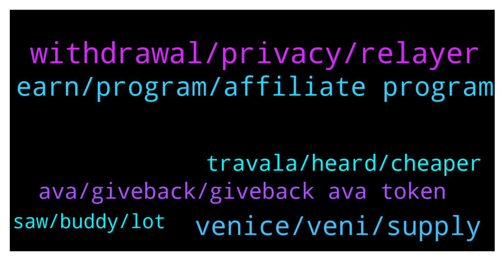

# **@defisearchpublic**
 ## Analysis for **2021-12-26** - **2022-01-02**.

---

## 📊 **Basic Stats**

**n_messages_sent**: 79

---

---

## 🔝 **Top keywords and related messages**

1. **withdrawal, privacy, relayer**

    @Venedixt0 --- *Monsoon improves transaction privacy by breaking the on chain links between sources and destination.* **--->** [TG Discussion](https://t.me/defisearchpublic/240662)

    @Fred©orpuz --- *Is there a chance to compromise the protocol and leak some info of the depositors, bro?* **--->** [TG Discussion](https://t.me/defisearchpublic/240671)

    @Fred©orpuz --- *This will make all your transaction private, bro.* **--->** [TG Discussion](https://t.me/defisearchpublic/240656)

    @Regor --- *Is it safe to use a relayer?* **--->** [TG Discussion](https://t.me/defisearchpublic/240669)

    @blake --- *that's right you can also exchange now on  changeNow io* **--->** [TG Discussion](https://t.me/defisearchpublic/240762)

    @Venedixt0 --- *No. Monsoon is a decentralized protocol base on zero knowledge proofs.* **--->** [TG Discussion](https://t.me/defisearchpublic/240672)

2. **venice, veni, supply**

    @jaelquin01 --- *This amount is a non-inflationary fixed supply set at launch. 10% of the $VENI supply was distributed at the genesis event to Venice liquidity providers and stakers. The remaining 90% is distributed over the course of four years.* **--->** [TG Discussion](https://t.me/defisearchpublic/240694)

    @jaelquin01 --- *If you both want to check the beta test of Venice. Just search Testnet. Venice. Finance* **--->** [TG Discussion](https://t.me/defisearchpublic/240700)

    @jaelquin01 --- *It was designed to be under Venice DAO Governance to maintain stability* **--->** [TG Discussion](https://t.me/defisearchpublic/240690)

    @carajulierey01 --- *Are you seeing that as for long term?* **--->** [TG Discussion](https://t.me/defisearchpublic/240688)

    @carajulierey01 --- *Thanks Jael! This is a big help for me because  doing my research of this. It seems you know alot of info of Venice* **--->** [TG Discussion](https://t.me/defisearchpublic/240702)

    @Cronos Early Ape --- *@Irukandji_financial is based entire liquidity burned 🧐🧐* **--->** [TG Discussion](https://t.me/defisearchpublic/240717)

3. **earn, program, affiliate program**

    @athaliah --- *all you need is a social media acct. you don't need to be an influencer too you just need to make the people use your link to book flights or accommodation to earn the 5% commission ..* **--->** [TG Discussion](https://t.me/defisearchpublic/240790)

    @raver --- *ow okay so in affiliate program i will also earn the 5% on their fisrt booking.* **--->** [TG Discussion](https://t.me/defisearchpublic/240787)

    @athaliah --- *yeah but in affiliate program you will earn 5% commission on every booking that is made with your link ..* **--->** [TG Discussion](https://t.me/defisearchpublic/240784)

    @athaliah --- *just one time after they registered and make their first booking ..* **--->** [TG Discussion](https://t.me/defisearchpublic/240786)

    @jenicaannbin01 --- *Oh. You really invest you time. Good. You'll become millionaire of you know the process of the project and how it works. You'll know how to pla the game* **--->** [TG Discussion](https://t.me/defisearchpublic/240704)

    @raver --- *alright that's the difference between the two .. how can i earn commission what do i need to do ?* **--->** [TG Discussion](https://t.me/defisearchpublic/240789)

4. **ava, giveback, giveback ava token**

    @raver --- *ow it's still okay coz i can still have AVA even i don't purchase coz i will have giveback on AVA token.* **--->** [TG Discussion](https://t.me/defisearchpublic/240776)

    @athaliah --- *AVA is a multi chain token based on Binance Chain, Binance Smart Chain and Ethereum blockchain.* **--->** [TG Discussion](https://t.me/defisearchpublic/240765)

    @raver --- *in invite program how many times can i get the $25 worth of AVA ?* **--->** [TG Discussion](https://t.me/defisearchpublic/240785)

    @athaliah --- *yeah but you can still have giveback on AVA token whatever payment method you make.* **--->** [TG Discussion](https://t.me/defisearchpublic/240774)

    @raver --- *how can i have discounts ?* **--->** [TG Discussion](https://t.me/defisearchpublic/240768)

    @athaliah --- *the invite program ☺️ if you invite someone and get registered and make an eligible booking both of you will get $25 worth of AVA . isn't cool ?* **--->** [TG Discussion](https://t.me/defisearchpublic/240779)

5. **travala, heard, cheaper**

    @athaliah --- *you wouldn't be dissapointed on travala it's not just cheaper but also giving discounts and rewards.* **--->** [TG Discussion](https://t.me/defisearchpublic/240767)

    @athaliah --- *if you want to trade sell or buy travala AVA you can exchange on Binance KuCoin or gate io* **--->** [TG Discussion](https://t.me/defisearchpublic/240757)

    @raver --- *hey is Dtravel part of travala ?* **--->** [TG Discussion](https://t.me/defisearchpublic/240769)

    @raver --- *bilated merry Christmas Everyone ☺️ what do you guys think about travala ?* **--->** [TG Discussion](https://t.me/defisearchpublic/240750)

    @raver --- *alright .. i've been searching for a booking platform that's not expensive and i heard this travala ..* **--->** [TG Discussion](https://t.me/defisearchpublic/240766)

    @blake --- *they are partners to itegrate the TRVL token on travala .. so now you can pay with TRVL on travala* **--->** [TG Discussion](https://t.me/defisearchpublic/240770)

6. **saw, buddy, lot**

    @jaelquin01 --- *Hehe. Thanks but not really. I just attended those previous AMA that's why* **--->** [TG Discussion](https://t.me/defisearchpublic/240703)

    @jenicaannbin01 --- *I just saw this on one of the AMA group* **--->** [TG Discussion](https://t.me/defisearchpublic/240685)

    @Venedixt0 --- *Right, buddy. You know it too?* **--->** [TG Discussion](https://t.me/defisearchpublic/240657)

    @athaliah --- *hahaha i did that too 😂😂* **--->** [TG Discussion](https://t.me/defisearchpublic/240783)

    @jaelquin01 --- *Yep. Heehe. Thanks for the kind words* **--->** [TG Discussion](https://t.me/defisearchpublic/240705)

    @raver --- *thanks a lot mate i have learned a lot about it ☺️* **--->** [TG Discussion](https://t.me/defisearchpublic/240792)

