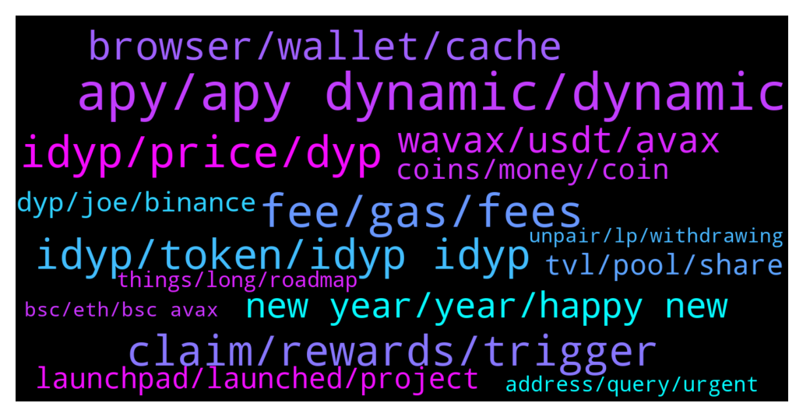

# **@dypfinance**
 ## Analysis for **2021-12-26** - **2022-01-02**.

---

## 📊 **Basic Stats**

**n_messages_sent**: 1496

---

---

## 🔝 **Top keywords and related messages**

1. **apy, apy dynamic, dynamic**

    @hemanrock --- *if iDYP, DYP, AVAX goes down, APY goes down. If iDYP, DYP, AVAX goes up, APY goes UP.* **--->** [TG Discussion](https://t.me/dypfinance/233693)

    @Cryptomommi --- *Ok...but the APY is so low..shouldn't any go up if people withdrawing?* **--->** [TG Discussion](https://t.me/dypfinance/232642)

    @hemanrock --- *%share, APY is dynamic and you can also check more on internet how yield farming works.* **--->** [TG Discussion](https://t.me/dypfinance/233683)

    @Og_of_Satoshi --- *Firstly if yourself the maintainer of the project does know about how his project works, that gives a zero ground to attack me of having zero knowledge, you are using the same jargons it looks like u have rote learned it  Secondly I am mathematian and let me teach how a simple direct proportion   works. if the Apy is based on price as you say and not on the total deposit dyp. If price fell bay 50% the apy should fell by 50% making it 110% not 67* **--->** [TG Discussion](https://t.me/dypfinance/231569)

    @timdyp --- *If you continue with this language, you will be banned. It is 100% decentralized, the APY is dynamic, it means it can go up or down. The APY can go up or down based on DYP, iDYP, and BNB price (if we talk about the BSC pools).* **--->** [TG Discussion](https://t.me/dypfinance/231554)

    @hemanrock --- *APY is dynamic. When more users deposit, it can be decreased.* **--->** [TG Discussion](https://t.me/dypfinance/234967)

2. **fee, gas, fees**

    @DhoniMSD516 --- *Here are some example https://t.me/dypfinance/229892 but again it depends on current gas fees so the fees cna be lower or more than in examples* **--->** [TG Discussion](https://t.me/dypfinance/232895)

    @DhoniMSD516 --- *Hey it depends on ETH network fees, so keep a track on that, also you will be charged less than what is shown on metamask* **--->** [TG Discussion](https://t.me/dypfinance/232892)

    @hemanrock --- *However it depends on ETH network, no one can handle gas price.* **--->** [TG Discussion](https://t.me/dypfinance/232261)

    @Abulsagga --- *guys when i approve staking it asks for 200+ just for gas fees is that logical* **--->** [TG Discussion](https://t.me/dypfinance/234058)

    @Mike_Hodl --- *I have approved it first but when I try to deposit it gives me the error* **--->** [TG Discussion](https://t.me/dypfinance/234566)

    @Skipper_IM --- *And why fee is so huge? ERC-20 transaction can be 15-40 $. And fe can be 300-450 $ ???* **--->** [TG Discussion](https://t.me/dypfinance/232262)

3. **idyp, price, dyp**

    @timdyp --- *No, you did not. It was clearly stated in all the articles regarding the new pools, plus discussed a couple of times here. DYP is no longer used for rewards, DYP is just a type of rewards like ETH, BNB, AVAX. What does it mean? It means you get the rewards in iDYP and the price of iDYP is converted to DYP based on market value. So based on iDYP and DYP price, you can see 100 DYP today and 150 or 50 DYP tomorrow. If the rewards are not claimed, they can go up or down.* **--->** [TG Discussion](https://t.me/dypfinance/231546)

    @DhoniMSD516 --- *2H ago 2553 iDYP swapped for rewards and earned 8 ETH paid to LP's https://etherscan.io/tx/0x90be798fc54cf216239c1cbeec7e925ff497bffb2b2a4a8ad03737d6299fa409  2 days ago 1655 iDYP swapped for rewards and earned 4 ETH paid to LP's https://etherscan.io/tx/0x86b47e7bced976d8c631ad502bf5dbe23dd3a3273d958bc4885bf0f8f6653ecc  so you can see today more iDYP swapped which means more ETH paid* **--->** [TG Discussion](https://t.me/dypfinance/234898)

    @DhoniMSD516 --- *You can check iDYP price here https://info.pangolin.exchange/#/pair/0x66eecc97203704d9e2db4a431cb0e9ce92539d5a* **--->** [TG Discussion](https://t.me/dypfinance/234015)

    @Og_of_Satoshi --- *It says 16 dyp not usd* **--->** [TG Discussion](https://t.me/dypfinance/231526)

    @memiamang --- *If i get reward by dyp then number of dyp must be increased day by day* **--->** [TG Discussion](https://t.me/dypfinance/233133)

    @Mrbadboy2 --- *We can't look at dyp price* **--->** [TG Discussion](https://t.me/dypfinance/234707)

4. **claim, rewards, trigger**

    @iamJubi --- *The time someone claimed was 1 hour earlier before the two days  reward, so the distributed reward was only for 1 day.   previous claim: 2 days 8 hours ago: https://etherscan.io/tx/0x1b2799eba2b219ffbccef83844e45c02b824693b0a6064e2852da9f6c9fc8894  Latest claim 9 hours ago: https://etherscan.io/tx/0x9cd8afcdf4156d880ddcb969cab380571655bb183692963201b61d8a49b53612* **--->** [TG Discussion](https://t.me/dypfinance/231793)

    @DhoniMSD516 --- *On PC/Desktop you can hover on claim button to see tiem for next rewards* **--->** [TG Discussion](https://t.me/dypfinance/231589)

    @Cricascar --- *Yes ,that is what I'm saying if you don't claim at the same hour you lose rewards right* **--->** [TG Discussion](https://t.me/dypfinance/232404)

    @Cricascar --- *One question ❓ When the claim button says you are free ... But don't claim at that moment, let say 12 hours later, the rewards should be greater than what it shows right? But is not the case so I don't understand this part.   I put my situation, yesterday 10 pm UTC I could claim but done it today 12 hours later and I received the amount showed, so next time I can claim is tomorrow but the rewards from yesterday 10pm UTC to today 10 am UTC I have no rewards? Thank you* **--->** [TG Discussion](https://t.me/dypfinance/232402)

    @thurlo79 --- *Hey guys it’s been just over 24 hrs since my last claim …   New rewards not in yet is this normal ?* **--->** [TG Discussion](https://t.me/dypfinance/234650)

    @Cryptomommi --- *Hello...newbie question...are rewards updated 1 time a day? Is there any particular time to check new rewards. I need to stop obsessively checking and get other stuff done haha.* **--->** [TG Discussion](https://t.me/dypfinance/231582)

5. **idyp, token, idyp idyp**

    @Sir_Crys_alot --- *Can someone explain like I am five why iDYP is bleeding so hard? Do we have to find a base, because like I see it it's only a background token so if many people use the protocol it should be stable at some point. Or not?* **--->** [TG Discussion](https://t.me/dypfinance/232630)

    @j2021000 --- *How can i buy idyp? Do idyp has pottential than dyp?* **--->** [TG Discussion](https://t.me/dypfinance/231502)

    @metajb7274 --- *anyone remember dyp snapshot event? drop idyp to dyp holder? hows it going on ?* **--->** [TG Discussion](https://t.me/dypfinance/231626)

    @seyedbnd --- *Is idyp a scam or is it related to dyp?!!* **--->** [TG Discussion](https://t.me/dypfinance/234578)

    @DhoniMSD516 --- *The bot will delete, yes as said we have two tokens DYP which is 1 year old and iDYP which is 1 Month old* **--->** [TG Discussion](https://t.me/dypfinance/234870)

    @DhoniMSD516 --- *iDYP is our new token which is being used in new strategies of farming, staking and buyback more utilities for iDYP will be coming through moving forward* **--->** [TG Discussion](https://t.me/dypfinance/234021)

6. **browser, wallet, cache**

    @HumbleFutures --- *my wallet is not connecting on brave browser* **--->** [TG Discussion](https://t.me/dypfinance/234169)

    @Paul --- *ok found that....got a tg from a Jubi Lee also asking if i was able to connect my external wallet but blocked that.* **--->** [TG Discussion](https://t.me/dypfinance/232067)

    @DhoniMSD516 --- *Nope works fine on my end* **--->** [TG Discussion](https://t.me/dypfinance/234158)

    @DhoniMSD516 --- *Hey I just tested with Metamsk + Brave and it connected successfully* **--->** [TG Discussion](https://t.me/dypfinance/234172)

    @HumbleFutures --- *Im still getting errors on both mobile and desktop* **--->** [TG Discussion](https://t.me/dypfinance/234173)

    @DhoniMSD516 --- *Ok but I have no issues here is from mobile* **--->** [TG Discussion](https://t.me/dypfinance/234180)

7. **wavax, usdt, avax**

    @DhoniMSD516 --- *Hey nope the WAVAX earned will not be changed if you don't claim* **--->** [TG Discussion](https://t.me/dypfinance/233630)

    @sinaht --- *I want to deposit wavax in farm v2 but i ge the error message “avax c-chain is not enough to pay for the miners* **--->** [TG Discussion](https://t.me/dypfinance/233248)

    @Stormhaven8472 --- *If I stake with Wavax i get wavax as well? Love hearing that* **--->** [TG Discussion](https://t.me/dypfinance/233489)

    @ringLeader96 --- *Hey y’all, I tried withdrawing my WAVAX from the no Lock farming pool, and I ended up getting less than I put in? I put it in 1 WAVAX and got 0.7 when I withdrew, could someone explain this to me?* **--->** [TG Discussion](https://t.me/dypfinance/234715)

    @Skipper_IM --- *Can you give me advice? Where can I exchange WAVAX? SHould it be bridge to AVAX first?* **--->** [TG Discussion](https://t.me/dypfinance/233187)

    @sinaht --- *You mean i have to have avax too in addition to wavax?* **--->** [TG Discussion](https://t.me/dypfinance/233252)

8. **new year, year, happy new**

    @Manuel --- *Thanks Tim, and I am happy with All the work you and the team is doing. Keep moving mountains* **--->** [TG Discussion](https://t.me/dypfinance/232812)

    @timdyp --- *Happy New Year #DYPians family🥳🎉 A huge thank you for coming along for the ride.  Looking forward to 2022!  👉https://twitter.com/dypfinance/status/1476946094156353597* **--->** [TG Discussion](https://t.me/dypfinance/235783)

    @appliepietrade --- *excellent. Thanks Jubi. You guys are great. I am very new to this. I learnt lots of stuff from you guys. Appreciated very much! Happy New Year!* **--->** [TG Discussion](https://t.me/dypfinance/235937)

    @Eugej --- *Well said Bro...let me look for ways to soothe my wife and mum who I had promised so much based on the fact that I was going to be smiling this Xmas...No offence to anyone but mehn  when I look at wife and mom hopeful faces...I just had to vent... Have a great Xmas all* **--->** [TG Discussion](https://t.me/dypfinance/232856)

    @Vl_investor --- *Guys, these are very cool cats, I really liked it, congratulations, great fellows* **--->** [TG Discussion](https://t.me/dypfinance/234258)

    @StillHodlTulips --- *awesome, thanks. Have a great new year in advance!* **--->** [TG Discussion](https://t.me/dypfinance/235775)

9. **launchpad, launched, project**

    @Vl_investor --- *With the listing, it is clear that nothing can depend on you, and the launchpad, according to you, should have been released like 5 days ago, where is it? what's happened? people want to know!* **--->** [TG Discussion](https://t.me/dypfinance/233559)

    @DhoniMSD516 --- *Hey launchpad is planned for this week, please stay tuned for further details* **--->** [TG Discussion](https://t.me/dypfinance/231816)

    @finaldust --- *Would the launchpad be planned for this week? It is getting to holiday.* **--->** [TG Discussion](https://t.me/dypfinance/232776)

    @profit984 --- *so this last week will have launchpad, matic farm, and listing for sure?* **--->** [TG Discussion](https://t.me/dypfinance/233903)

    @BullishForeverr --- *when launchpad is going to live* **--->** [TG Discussion](https://t.me/dypfinance/236025)

    @hemanrock --- *Launchpad is coming soon and 1st project will be in January* **--->** [TG Discussion](https://t.me/dypfinance/235255)

10. **tvl, pool, share**

    @Fbm_Alpha --- *Hi every one  I see the amount of  BSC TVL v2 is reducing day by day. Does it make any trouble with our money?* **--->** [TG Discussion](https://t.me/dypfinance/232760)

    @chunshern90 --- *Why TVL and "My Share" keep going down?* **--->** [TG Discussion](https://t.me/dypfinance/235636)

    @Sir_Crys_alot --- *People do not withdraw much but the diposits bleed with iDYP so the TVL Drops* **--->** [TG Discussion](https://t.me/dypfinance/232657)

    @QTMiner --- *TVL could be goin down due to the whole crypto market taking a dip* **--->** [TG Discussion](https://t.me/dypfinance/235641)

    @LovelySuman86 --- *TVL also get reduced in V2* **--->** [TG Discussion](https://t.me/dypfinance/232921)

    @LovelySuman86 --- *Yes TVL also decreased to more then  half* **--->** [TG Discussion](https://t.me/dypfinance/232979)

11. **coins, money, coin**

    @joesonm --- *If she’s moaning about losing £2* **--->** [TG Discussion](https://t.me/dypfinance/232693)

    @EaiLyya13848847444 --- *Is there any discussion about cryptocurrencies? Share and learn from each other and grow together* **--->** [TG Discussion](https://t.me/dypfinance/232005)

    @Vaughanrg --- *That's great this coin is looking very bullish over these last 7 days* **--->** [TG Discussion](https://t.me/dypfinance/232013)

    @Bekirr1 --- *I don't shoot anyway so that there is no permanent loss. My question is why is my investment not going up when the market is going up? You always give the same fudge answers* **--->** [TG Discussion](https://t.me/dypfinance/232363)

    @nobodyffff --- *and this is the result. You guys should educate and warn the investors regarding the inflation imo* **--->** [TG Discussion](https://t.me/dypfinance/234030)

    @captain_protein --- *And, hard though it may be to hear, most likely investing more into crypto than you really should be.* **--->** [TG Discussion](https://t.me/dypfinance/232610)

12. **dyp, joe, binance**

    @hemanrock --- *https://t.me/dypfinance/229271  please check this to know more about DYP and its features.  there are also various video tutorials and ex FARM on BSC:   https://www.youtube.com/watch?v=2pOUmRTMN1o&t=304s* **--->** [TG Discussion](https://t.me/dypfinance/235263)

    @DhoniMSD516 --- *Hey you can start reading about DYP and the features we are offering here https://t.me/dypfinance/229271* **--->** [TG Discussion](https://t.me/dypfinance/234667)

    @hemanrock --- *Please check this to know more about DYP and its products https://t.me/dypfinance/229271* **--->** [TG Discussion](https://t.me/dypfinance/233409)

    @DhoniMSD516 --- *Hey you are in DYP project channel and you can read about DYP and the features we are offering here  https://t.me/dypfinance/229271* **--->** [TG Discussion](https://t.me/dypfinance/232432)

    @DhoniMSD516 --- *Hey welcome you can start reading about DYP here :)  https://t.me/dypfinance/229271* **--->** [TG Discussion](https://t.me/dypfinance/233060)

    @hemanrock --- *please check more about DYP and its products from here https://t.me/dypfinance/229271* **--->** [TG Discussion](https://t.me/dypfinance/233227)

13. **things, long, roadmap**

    @Og_of_Satoshi --- *If u don't know just say it  Stop making things up* **--->** [TG Discussion](https://t.me/dypfinance/231537)

    @Vl_investor --- *No, you can't deviate too much from the roadmap* **--->** [TG Discussion](https://t.me/dypfinance/233569)

    @ALTrntrKID --- *hi any chance of going back to 1usd?* **--->** [TG Discussion](https://t.me/dypfinance/234427)

    @DhoniMSD516 --- *For sure yes please read through these features  https://t.me/dypfinance/229271* **--->** [TG Discussion](https://t.me/dypfinance/234557)

    @Stormhaven8472 --- *Any rough estimate when we should expect it* **--->** [TG Discussion](https://t.me/dypfinance/233912)

    @shinigamikami --- *I know but sometimes pushing one of the things on roadmap down and launching others can be a good strategic move* **--->** [TG Discussion](https://t.me/dypfinance/233570)

14. **address, query, urgent**

    @KW --- *Hi Dhoni - did u just msg me ?* **--->** [TG Discussion](https://t.me/dypfinance/233971)

    @Life_is_love_La_la_la_la_la --- *Sorry. Please ignore my last paragraph as I see you have responded on this* **--->** [TG Discussion](https://t.me/dypfinance/232535)

    @rachel_xt_agents --- *can i send direct on dm?* **--->** [TG Discussion](https://t.me/dypfinance/236002)

    @DhoniMSD516 --- *Hey pls dm me your wallet address* **--->** [TG Discussion](https://t.me/dypfinance/235079)

    @DhoniMSD516 --- *Please dm me your wallet address* **--->** [TG Discussion](https://t.me/dypfinance/231847)

    @DhoniMSD516 --- *Hey you can PM me if is urgent :)* **--->** [TG Discussion](https://t.me/dypfinance/232821)

15. **bsc, eth, bsc avax**

    @DhoniMSD516 --- *Hey we are available on ETH, BSC and AVAX chains So if you want to use BSC with Metamask yes you can do it.* **--->** [TG Discussion](https://t.me/dypfinance/235399)

    @DhoniMSD516 --- *Hey you need to follow this route BSC-ETH-AVAX because there is no direct bsc to avax bridge* **--->** [TG Discussion](https://t.me/dypfinance/233296)

    @ABBBBBAB_Go --- *what is the relationship between bsc and eth？* **--->** [TG Discussion](https://t.me/dypfinance/234474)

    @hemanrock --- *you can check more from here https://dyp.finance/ in FARMS/BUYBACK/STAKE on ETH/BSC/AVAX networks* **--->** [TG Discussion](https://t.me/dypfinance/234379)

    @DhoniMSD516 --- *BSC: https://app-bsc.dyp.finance/staking-stats AVAX: https://app-avax.dyp.finance/staking-stats ETH: https://app.dyp.finance/staking-stats-new These are the links* **--->** [TG Discussion](https://t.me/dypfinance/236020)

    @Paul --- *Just set up Avax chain in Mask ... just wondering before i use...are fees somewhat comparable to Bsc?* **--->** [TG Discussion](https://t.me/dypfinance/232069)

