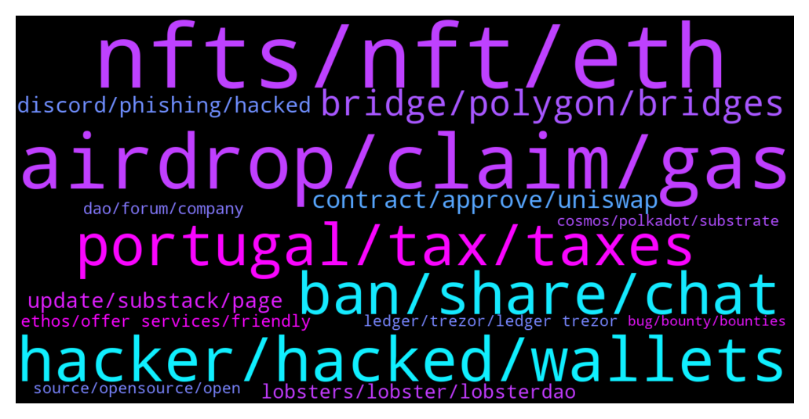

# **@lobsters_chat**
 ## Analysis for **2021-12-26** - **2022-01-02**.

---

## 📊 **Basic Stats**

**n_messages_sent**: 1792

---

---

## 🔝 **Top keywords and related messages**

1. **nfts, nft, eth**

    @michaelams --- *But why didn't they transfer the NFTs first?* **--->** [TG Discussion](https://t.me/lobsters_chat/308925)

    @freshaspect --- *He has moved all the NFTs to safety right?* **--->** [TG Discussion](https://t.me/lobsters_chat/308904)

    @michaelams --- *Can't figure it out myself: he didn't fuck with hidden NFTs, seed words not shared or accessible, didn't approve anything except legit NFTs he bought/sould/minted. New to NFTs, didn't buy a Ledger yet...* **--->** [TG Discussion](https://t.me/lobsters_chat/308899)

    @mdzor --- *https://twitter.com/cap10bad/status/1476900859460169732 sharing as I see that no one has mentioned it. It seems like doodle were the target yesterday and now there are more NFTs targeted. OS seems to have an exploit where a canceled offer may still be purchased 🤔* **--->** [TG Discussion](https://t.me/lobsters_chat/312061)

    @PmRiviere --- *Thanks for shilling my claws but this claim is as unsubstantiated as it gets. How are NFTs any good at anti-Sybil?* **--->** [TG Discussion](https://t.me/lobsters_chat/312037)

    @michaelams --- *So you mean they waited on purpose with the NFTs to get extra ETH out? Sick* **--->** [TG Discussion](https://t.me/lobsters_chat/308919)

2. **airdrop, claim, gas**

    @zegdathetkan --- *Can someone help me understand what is the point of recent airdrops like GAS and SOS? it occurs to me they are airdropping before they have a working platform, why? what is the point? is this just a marketing stunt? is this somehow a scheme to make money by somebody? who is providing the liquidity?* **--->** [TG Discussion](https://t.me/lobsters_chat/311331)

    @Sp33dyTT --- *Hey guys there is apparently airdrop ongoing for wasted gas can anyone smarter with solidity knowledge have a look at smart contract? http://Gasdao.org* **--->** [TG Discussion](https://t.me/lobsters_chat/311276)

    @banteg --- *is there any project behind sos or is it just an airdrop?* **--->** [TG Discussion](https://t.me/lobsters_chat/310500)

    @SD107 --- *Any communities the devs doing the airdrop decide I guess* **--->** [TG Discussion](https://t.me/lobsters_chat/312054)

    @whiterun --- *how opendao airdrop works? i see it doesn't use merkle proof.* **--->** [TG Discussion](https://t.me/lobsters_chat/310488)

    @ethnoweth --- *Thanks @k06aa ser for creating this. We were planning to do an airdrop to reward early real world asset adopters. this is super helpful for us to design our upcoming airdrop. save us a bunch of time* **--->** [TG Discussion](https://t.me/lobsters_chat/311621)

3. **hacker, hacked, wallets**

    @infomorph --- *Either people who "rolled their own" cryptography, or used faulty libraries with bad sources of randomness, most likely. A particularly sneaky blackhat could make a wallet that _very rarely_ reuses a nonce...get wide enough adoption, and even rare collisions will generate a steady stream of hackable accounts. This is one of many reasons why it's very important that wallets be open source (even then, could be hard to detect...see that random number generation standard the NSA backdoored for example).* **--->** [TG Discussion](https://t.me/lobsters_chat/311242)

    @farm42 --- *TLDR: One guy’s MetaMask was hacked via infected smart sex toy (dildo). Never plug unknown devices to your working machine.  https://twitter.com/officer_cia/status/1475521089002475528?s=21* **--->** [TG Discussion](https://t.me/lobsters_chat/310949)

    @SpikeSpiege1 --- *Anyone know where the hacker actually took the tokens from? Team wallet? Bridge? Etc https://bitcoinist.com/hacker-exploits-vulnerability-on-polygon/* **--->** [TG Discussion](https://t.me/lobsters_chat/311857)

    @michaelams --- *He can't access his wallet now, but will do it once he can. Needs ETH in there first too, haha* **--->** [TG Discussion](https://t.me/lobsters_chat/308908)

    @Georgeraven --- *I struggle to understand the grim finance hack maybe I am missing something specific about their protocol* **--->** [TG Discussion](https://t.me/lobsters_chat/309021)

    @rata0x --- *I have friends at Bitfinex, lf anyone can help them to trace stolen 117k btc, they are willing to pay around a billion dollars.* **--->** [TG Discussion](https://t.me/lobsters_chat/311530)

4. **portugal, tax, taxes**

    @vintash --- *Portugal will probably cease to be a tax haven* **--->** [TG Discussion](https://t.me/lobsters_chat/311360)

    @vintash --- *Here's good news from Portugal too (taxes for crypto) https://eco.sapo.pt/2021/12/21/bloco-de-esquerda-propoe-alargar-irs-as-criptomoedas/* **--->** [TG Discussion](https://t.me/lobsters_chat/311354)

    @Justsomebodi --- *The Netherlands only taxes 3% capital gains, only on declaration. So pretty good imho* **--->** [TG Discussion](https://t.me/lobsters_chat/311387)

    @olivier27 --- *Dubai and Singapore are the only true crypto tax havens* **--->** [TG Discussion](https://t.me/lobsters_chat/311382)

    @TygaKim --- *korea no more metamask Portugal will probably cease to be a tax haven* **--->** [TG Discussion](https://t.me/lobsters_chat/311378)

    @olivier27 --- *There are many rules to comply with, varying per canton and not completely tax free although lower than most countries tbf* **--->** [TG Discussion](https://t.me/lobsters_chat/311388)

5. **ban, share, chat**

    @yic_alex --- *You should remove both sides then. It's annoying to read half of those convos with no reference point all the time. (Not ban but remove the exchange)* **--->** [TG Discussion](https://t.me/lobsters_chat/309767)

    @samkazemian --- *It’s literally not on our end. We tried to be friends but they are literally the only project on the entire planet that seems to be hostile to us for no reason. So we have no choice. As you can see, we didn’t do anything to them. We’re friends with literally everyone.* **--->** [TG Discussion](https://t.me/lobsters_chat/309799)

    @adrianleb --- *messages were deleted because it was just another shill of the project which you're also just shilling in your channel, the ban was because you didn't stop there* **--->** [TG Discussion](https://t.me/lobsters_chat/311845)

    @ivangbi --- *NGMI u lost money rekt!!! Nah welcome to shit art, collection chat is @lobsterdao* **--->** [TG Discussion](https://t.me/lobsters_chat/309195)

    @paulogouveia --- *everytime I come here you're ending a conversation, no joke lol* **--->** [TG Discussion](https://t.me/lobsters_chat/311886)

    @YoSoyCarlos --- *FYI this is def a troll post* **--->** [TG Discussion](https://t.me/lobsters_chat/310954)

6. **bridge, polygon, bridges**

    @tobaias --- *Not that I know of, polygon has one:  https://wallet.polygon.technology/swap/* **--->** [TG Discussion](https://t.me/lobsters_chat/310353)

    @Cuter0x --- *Also, do You know what's the "bridge" section difference compared to the "router" one?* **--->** [TG Discussion](https://t.me/lobsters_chat/310613)

    @vPEPO --- *Polygon we already have a solution: https://docs.polygon.technology/docs/develop/l1-l2-communication/fx-portal/* **--->** [TG Discussion](https://t.me/lobsters_chat/309179)

    @zhongfu --- *have you tried stable.anyswap.exchange instead, or their new site (I think) http://app.multichain.org* **--->** [TG Discussion](https://t.me/lobsters_chat/310611)

    @IndexCap --- *Issue with angle is that there no liquidity for angle on polygon* **--->** [TG Discussion](https://t.me/lobsters_chat/310082)

    @ncerovac --- *Don't know if this is fun, but we are building yield agregato at polygon https://twitter.com/tesseract_fi?t=0GBgCnZq16Lwm7JNcm2f8Q&s=09* **--->** [TG Discussion](https://t.me/lobsters_chat/310474)

7. **contract, approve, uniswap**

    @SpikeSpiege1 --- *Like how the only change they made to uniswap code was adding in a small fee that goes to ambiguous dev wallet that isn't in uniswap code.* **--->** [TG Discussion](https://t.me/lobsters_chat/311143)

    @corp399 --- *https://etherscan.io/address/0xab5801a7d398351b8be11c439e05c5b3259aec9b#tokentxns  2022 looks like scam, but how did they do this?  If dev insert a specific code into the contract, can dev move the token without the wallet owner's approve?* **--->** [TG Discussion](https://t.me/lobsters_chat/311631)

    @tufuntu --- *In uniswap v2, why didn't they use IERC20 instead of selector?  https://github.com/Uniswap/v2-core/blob/master/contracts/UniswapV2Pair.sol#L45  Anybody has an idea?* **--->** [TG Discussion](https://t.me/lobsters_chat/310940)

    @ChiTimesChi --- *Some tokens have ERC-2612 permits implemented, so you can sign an approval off-chain (thus potentially enabling gasless trades). Ivan's most favorite token supports that iirc.* **--->** [TG Discussion](https://t.me/lobsters_chat/310358)

    @johan_ct --- *anyone knows how to create a filter for event, Im trying to create a filter for uniswap router address' swapExactEthForTokens' but the contract abi list it as a function and not an event* **--->** [TG Discussion](https://t.me/lobsters_chat/309464)

    @farm42 --- *Gn! Spotted a pretty awesome strategic management research on how Uniswap became No1 DEX:  http://www.questjournals.org/jrbm/papers/vol9-issue1/2/A0901020111.pdf  Great retrospective IMO* **--->** [TG Discussion](https://t.me/lobsters_chat/309012)

8. **discord, phishing, hacked**

    @pjsm1508 --- *monkey kingdom discord hacked 1.3M lost  https://solscan.io/account/HuiYfmAceFkmhu3yP8t3a6VMYfw3VSX2Ymqqj9M2k9ib#solTransfers* **--->** [TG Discussion](https://t.me/lobsters_chat/309568)

    @LilMoonLamboX3 --- *bro its genius, just build the discord up and flip it to a real project for big money* **--->** [TG Discussion](https://t.me/lobsters_chat/309325)

    @LilMoonLamboX3 --- *knew they shoulda sold the discord lol* **--->** [TG Discussion](https://t.me/lobsters_chat/309584)

    @phil_muhbags --- *I know   60 million dollar rug pulls and no one blinks an eye  A discord mod quits and everyone loses their minds.* **--->** [TG Discussion](https://t.me/lobsters_chat/309896)

    @spreek --- *What is meant by a discord being hacked? Like admin accounts compromised and them posting phishing links or what?* **--->** [TG Discussion](https://t.me/lobsters_chat/309571)

    @LilMoonLamboX3 --- *nobody in the discord loses money since you never launched anything* **--->** [TG Discussion](https://t.me/lobsters_chat/309326)

9. **update, substack, page**

    @ivangbi --- *Had this 3 weeks ago, just did it again after that. Weird UI glitch I guess [?]* **--->** [TG Discussion](https://t.me/lobsters_chat/309857)

    @admnrqst --- *Hi, which CMS are you using?* **--->** [TG Discussion](https://t.me/lobsters_chat/309690)

    @michael_p3711 --- *Thanks, this is the best update ive had since it happened* **--->** [TG Discussion](https://t.me/lobsters_chat/309899)

    @blockminded --- *I think Illuvium might be using Unreal, if not, it's using Unity* **--->** [TG Discussion](https://t.me/lobsters_chat/311189)

    @Alphamint --- *i can't even see on the site if they're actually serving my content, there's no logs or anything* **--->** [TG Discussion](https://t.me/lobsters_chat/309061)

    @ivangbi --- *ah thank u, and sometimes the button started being grey for no reason last few weeks* **--->** [TG Discussion](https://t.me/lobsters_chat/310203)

10. **lobsters, lobster, lobsterdao**

    @ncerovac --- *Anton making epic dunes these days https://twitter.com/k06a/status/1475492168433287171?t=DOxk3kW9NxKTuvi8rHEANg&s=19  @ivangbi can we ask politely to help us with lobster dune?* **--->** [TG Discussion](https://t.me/lobsters_chat/311608)

    @goeth121 --- *How's the process look like to open an AMA with Lobster DAO? We have made a proposal here https://github.com/lobster-dao/overview/issues/50* **--->** [TG Discussion](https://t.me/lobsters_chat/309961)

    @SpikeSpiege1 --- *You stating a hypothetical where lobsters is used as some kind of anti-sybil mechanism. I assume ppl would know that it was one and act accordingly* **--->** [TG Discussion](https://t.me/lobsters_chat/312047)

    @ivangbi --- *What a chad! @ncerovac @farm42 @etartakovsky we need to gib the ser a lobster* **--->** [TG Discussion](https://t.me/lobsters_chat/311771)

    @LilMoonLamboX3 --- *imagine the shithousery if solana ever airdropped lobsters* **--->** [TG Discussion](https://t.me/lobsters_chat/309920)

    @tech_digger --- *I bet you are a shrimp, sir?* **--->** [TG Discussion](https://t.me/lobsters_chat/309198)

11. **dao, forum, company**

    @jefftt --- *anyone know where i can find a list of DAO tooling? e.g. coordinape* **--->** [TG Discussion](https://t.me/lobsters_chat/309685)

    @ivangbi --- *Only after a DAO vote though ** **--->** [TG Discussion](https://t.me/lobsters_chat/309267)

    @kuzzel --- *In the interest of freeing @ivangbi of further moderation, would you be game of putting together your questions/points together and sharing them with me?  Sounds like I'd be doing everyone a favor if I just wrote a long form response via blog post, that people could just link to to get fully informed on the perspectives. That way it's less conversational and more 'here are the options and tradeoffs, you take the risk you think best fellow founders/DAO community members'.  Happy to write it with you if you're game* **--->** [TG Discussion](https://t.me/lobsters_chat/311565)

    @river0x --- *DAOs are going to need good infrastructure. Whoever can figure that out as well as good DAO to DAO communication skills are going to be well suited for the next year - my addition* **--->** [TG Discussion](https://t.me/lobsters_chat/310734)

    @zemm_NFT --- *Create dao for OS community, since OS won’t do it* **--->** [TG Discussion](https://t.me/lobsters_chat/310296)

    @zemm_NFT --- *Is SOS a vampire dao attack on OS* **--->** [TG Discussion](https://t.me/lobsters_chat/310295)

12. **ethos, offer services, friendly**

    @warylow --- *I get coal.  https://twitter.com/juliankoh/status/1473917141061873664?s=21 I have noticed that I have completely ignored my LinkedIn for almost the entirety of this year, I have a hard time imagining that identity management is really going to take hold in crypto the way it does in traditional* **--->** [TG Discussion](https://t.me/lobsters_chat/310246)

    @bout3fiddy --- *So: keep separate machine for crypto, dont download nonsense in there.* **--->** [TG Discussion](https://t.me/lobsters_chat/309091)

    @Don_Luv --- *Looking at this but don’t see how it’s crypto friendly. Are there some integrations I failed to see, or does it allow you to pay in crypto (just saw USD and EUR pricing)* **--->** [TG Discussion](https://t.me/lobsters_chat/311600)

    @RobAnon --- *Always go open source. Crypto ethos* **--->** [TG Discussion](https://t.me/lobsters_chat/309293)

    @Sp33dyTT --- *I think its just because they all still has no clue what to do with crypto in general, hence different countries think up some crazy ideas depending on their hivemind in governance process 😂* **--->** [TG Discussion](https://t.me/lobsters_chat/311404)

    @lefterisjp --- *The "Crypto ethos" is a bit of a too loaded phrase. Whose ethos? Who is crypto? etc.* **--->** [TG Discussion](https://t.me/lobsters_chat/309304)

13. **source, opensource, open**

    @elie55 --- *Hey, want to get peoples thought on opensource. You have a split in crypto where half the tools are open and half are closed. Eg opensea could be opensource but isn’t. And uniswap is.  We’re considering open sourcing ourselves and would love to hear some of the pitfalls of taking that approach and giving away our “ip”* **--->** [TG Discussion](https://t.me/lobsters_chat/309210)

    @bensams0 --- *if you stay closed source, the biggest way you retain value is by hoping nobody implements something better. if you go open source, your only way to retain value is bizdev/partnerships.  one of these things might be more sustainable than the other for your product* **--->** [TG Discussion](https://t.me/lobsters_chat/309219)

    @FiveBoroughs --- *Generally speaking opensource backends, close source UIs/frontends will satisfy most of the community and make you composable while protecting from low effort clones* **--->** [TG Discussion](https://t.me/lobsters_chat/309284)

    @lefterisjp --- *oh I am with you. My entire being is in opensource as evidenced by the project I founded and work on. Just trying to not alienate people who may not agree with my view but who are also in our field* **--->** [TG Discussion](https://t.me/lobsters_chat/309315)

    @lefterisjp --- *I personally prefer opensource to source available but can understand somene doing source available but non-permissive license.* **--->** [TG Discussion](https://t.me/lobsters_chat/309303)

    @lefterisjp --- *That is not opensource. It's source available. I kind of wish we could find a better name for the 2 different things.* **--->** [TG Discussion](https://t.me/lobsters_chat/309301)

14. **ledger, trezor, ledger trezor**

    @raoufbenhar --- *What’s your guys favorite/best hardware wallet? Aside from ledger* **--->** [TG Discussion](https://t.me/lobsters_chat/310842)

    @tufuntu --- *if we keep all in ledger, then all safe?* **--->** [TG Discussion](https://t.me/lobsters_chat/309114)

    @mogglet --- *ledger nano s is still the best, I bought 2 nano x and both died upon arrival ( battery dead). Ledger team if you were here please fix asappp !* **--->** [TG Discussion](https://t.me/lobsters_chat/310859)

    @yic_alex --- *Tbh it does not make much sense to not use Ledger/Trezor if you don't want to run into compatibility issues / lack of apps. It does not pay off to go for the non market leaders with those kind of things in my experience, especially when even those already kinda suck.* **--->** [TG Discussion](https://t.me/lobsters_chat/310854)

    @raoufbenhar --- *Even if it’s not the most simplest thing, I’m sure folks would be willing to pay top dollar for an upgrade over ledger/trezor* **--->** [TG Discussion](https://t.me/lobsters_chat/310887)

    @zeThrouzz --- *my ledger screen died after 1 year, impossible to read it, the green color completely faded.* **--->** [TG Discussion](https://t.me/lobsters_chat/310867)

15. **cosmos, polkadot, substrate**

    @Swader --- *No, Cosmos is very much a chain, a hub bridging other chains.* **--->** [TG Discussion](https://t.me/lobsters_chat/312104)

    @Cat_Graphy --- *If L1’s are built on Cosmos SDKs, do the community view cosmos as a layer 0 or remain as a layer 1? Or is there no direct link between Cosmos SDK and Cosmos itself?* **--->** [TG Discussion](https://t.me/lobsters_chat/310918)

    @Swader --- *Substrate is the framework on which Polkadot and Kusama are built, yes.* **--->** [TG Discussion](https://t.me/lobsters_chat/312099)

    @svenblockchain --- *I think all cosmos chains are independent, but interoperable.* **--->** [TG Discussion](https://t.me/lobsters_chat/310919)

    @cryptoq11 --- *Cosmos Hub it’s just one hub in Cosmos Ecosystem.* **--->** [TG Discussion](https://t.me/lobsters_chat/310920)

    @apindy --- *All Cosmos chains are sovereign and can run their own validator set. They are however connected via IBC* **--->** [TG Discussion](https://t.me/lobsters_chat/310921)

