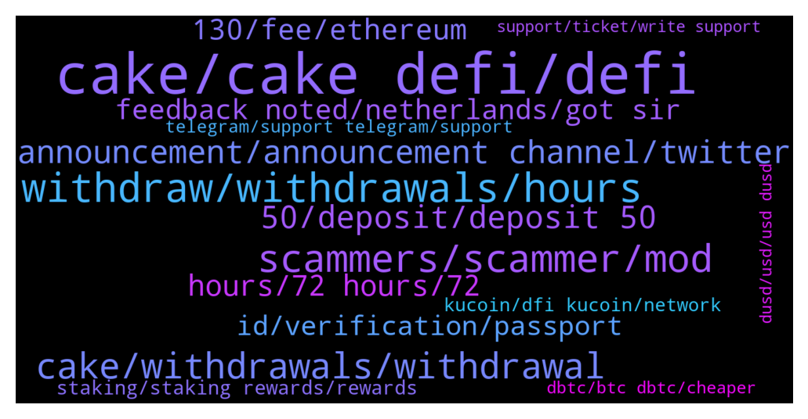

# **@CakeDeFi_EN**
 ## Analysis for **2022-01-02** - **2022-01-09**.

---

## 📊 **Basic Stats**

**n_messages_sent**: 1884

---

---

## 🔝 **Top keywords and related messages**

1. **cake, cake defi, defi**

    @BerndMack --- *This channel is about Cakedefi, not a sharing platform for scammer screenshots. Just check out the regular announcements in the channel: https://t.me/CakeDeFi_EN/159396* **--->** [TG Discussion](https://t.me/CakeDeFi_EN/159482)

    @moneydelics --- *Hey, Priya! I made a step by step tutorial for Cake DeFi new users. Hope it helps 😊  https://m.youtube.com/watch?v=D_98N4jx0fo&feature=youtu.be* **--->** [TG Discussion](https://t.me/CakeDeFi_EN/159145)

    @qweigand --- *also, I really like cake, but this group is the absolute worst when it comes to scammers, if i send a message in this group, there is a 100% chance some "support" scammer will contact me instantly* **--->** [TG Discussion](https://t.me/CakeDeFi_EN/159635)

    @Davidd523 --- *this is about cake wtf, "REQUEST OF THE PROJECT TEAM" so i asking when it will be ON againb* **--->** [TG Discussion](https://t.me/CakeDeFi_EN/159622)

    @ThePins49 --- *Hello everyone, nice to be present. I have just register to cake defi.* **--->** [TG Discussion](https://t.me/CakeDeFi_EN/160743)

    @Birol --- *Hi , I forgot my e-mail and cake password. what should I do?* **--->** [TG Discussion](https://t.me/CakeDeFi_EN/160702)

2. **withdraw, withdrawals, hours**

    @iAden_94 --- *Was it same day withdrawals? I’m withdrawing to a whitelisted address but still have not receive any notifications* **--->** [TG Discussion](https://t.me/CakeDeFi_EN/162155)

    @AIex_78 --- *Some News? My LM withdraw pending aince 9 hours.* **--->** [TG Discussion](https://t.me/CakeDeFi_EN/159305)

    @KBerger --- *Thats not true. Every of my withdrawels needed more than 24 hours. Maybe they are to big to do it automatic. But it sucks anyway. Should be good if i can decide to set up my security Level lower to have faster payout* **--->** [TG Discussion](https://t.me/CakeDeFi_EN/159196)

    @Alex --- *Are noraml BTC (non-wrapped) withdraws being processed? I submitted one ~24 hours ago and it's still in process. Normally takes minutes.* **--->** [TG Discussion](https://t.me/CakeDeFi_EN/159014)

    @Kassius84 --- *I can understand that well 😂😃  But be patient, most withdrawals are processed in under 60 minutes.  Only very few need the maximum time of 72 hours.* **--->** [TG Discussion](https://t.me/CakeDeFi_EN/159192)

    @dmytro_gera --- *Hello. I have a problem with withdrawing money. Any admin here who can help me?* **--->** [TG Discussion](https://t.me/CakeDeFi_EN/158601)

3. **scammers, scammer, mod**

    @FreeMerman --- *Yesterday another modo deleated my printscreen of a scammer :/ saying that it is not the place for that 🤷well I'll leave it here if I see that you're around.* **--->** [TG Discussion](https://t.me/CakeDeFi_EN/160689)

    @super33max --- *Scammer are getting smarter and smarter.  This is just an idea: Why moderators don’t put their username in their photo? (Like a water mark)  So, when scammer write you, you can click on their profile and see the mismatch between the username and the username written in the photo.* **--->** [TG Discussion](https://t.me/CakeDeFi_EN/162323)

    @Cosmic88 --- *many scammers messaged me as well* **--->** [TG Discussion](https://t.me/CakeDeFi_EN/156910)

    @BerndMack --- *after this message you will be contacted by scammers. take care!* **--->** [TG Discussion](https://t.me/CakeDeFi_EN/157190)

    @GionB --- *Please REMOVE this Scammer!!! All fucking bastards!! Its for sure nothing wrong with my wallet 🤬🤬🤬☝️☝️☝️☝️* **--->** [TG Discussion](https://t.me/CakeDeFi_EN/162410)

    @Thomas --- *Got dmed by a scammer named Lisa* **--->** [TG Discussion](https://t.me/CakeDeFi_EN/157251)

4. **cake, withdrawals, withdrawal**

    @weng --- *72 hours including sat and sun, it says 'around the clock'. My fund has been stalled for 72hours now , its ridiculous that how slow the withdrawal process from cake can be, freaking frustrating* **--->** [TG Discussion](https://t.me/CakeDeFi_EN/159319)

    @Kassius84 --- *How do you know it's not true? All my withdrawals were made in less 1h. 🤷 I don't know the average time for withdrawals on Cake.* **--->** [TG Discussion](https://t.me/CakeDeFi_EN/159199)

    @MaveJ --- *Hi - chain is running. Why does not cake open deposits/withdrawals?* **--->** [TG Discussion](https://t.me/CakeDeFi_EN/159463)

    @emrexdxd --- *@DmgBautista selamun alaikum bro, when money transactions come back? i need to pay electricity tomorrow. all my money in cake app. help me pls.  kind regards and alaikuma asallaum* **--->** [TG Discussion](https://t.me/CakeDeFi_EN/159997)

    @Yehuda --- *Do you planning to do an easier way to withdraw money from cake?* **--->** [TG Discussion](https://t.me/CakeDeFi_EN/160997)

    @Michael_Schredl --- *I am talking about Deposits - but if the withdrawal on Cake is complete, you have to ask the Exchange* **--->** [TG Discussion](https://t.me/CakeDeFi_EN/162446)

5. **announcement, announcement channel, twitter**

    @fabioandreatta --- *We announced this the 2nd of January for the first time* **--->** [TG Discussion](https://t.me/CakeDeFi_EN/161954)

    @AivernT --- *No worries man, i rather have healthy discussions and engagement than silence from the community. This is a community as everyone seems to be saying after all right? Yet whenever there are any concerns or questions the answer is always "that's how it is. We cant do anything". And while that may be true, a reply like that without any further information is not gonna inspire confidence. Mind you, im speaking entirely from my own experience here, and im in both cake and defichain's tele and discord groups. Out of respect that you took the time to reply, i'll share my thoughts about why i feel this way.  1. I think we fundamentally agree about the exchanges, so there's nth to add here.  2. Well, on paper and "technically", they are unrelated, but if you're telling me that Julian doesnt have a massive influence in the direction of the project then i have to say you're being disingenuous. Take first twitter discussion that took place during the atomic swap issue. If julian was so far removed, why was he the only one who spoke then and why was he behaving like a CEO of both cake and defichain? Why was he the only one to lay out all the possible options? Because he was the smartest and most articulate person in the entire community? If that is the case then no amount of "decentralization" can disassociate him from the project. Look, i dont really care that he heads everything, but i feel like the community is holding him too high on the pedestal, and having DMOR on him, i cant say i fully trust that he has the best intentions for the project and i feel like people throw the term decentralization like it's some utopia when in actual fact it is absolutely not. BUT THIS IS PURELY MY PERSONAL OPINION. If i get killed for this then this place has become more of a cult than i realized lol.  All that said, i still believe this project has quite a long, maybe 2yr run way at least. I have no faith in the road to 50, but i think the road to 20 is doable. Again, this is my own personal view, but the way the community is running this, im not convinced it will be a massive success. I quite like this interpretation of decentralized finance and tokenized assets, but i have very little faith in julian and the rest of the team and how they are running everything. Smart technical ppl for sure, but that alone isnt enough to drive adoption.  My own investment in this project is a reflection of that. Im still here for the ride and if it happens i will cash out at $20.  I really appreciate you taking the time to reply, if everyone was like you and not just defensive everytime people had question, the project would get alot more adoption, but what a pity.* **--->** [TG Discussion](https://t.me/CakeDeFi_EN/161543)

    @DmgBautista --- *Please check and subscribe our announcement channels to be up to with the latest news.* **--->** [TG Discussion](https://t.me/CakeDeFi_EN/159082)

    @rupchan99 --- *Hello admin  Please tell me refferal ending time there is no mention it* **--->** [TG Discussion](https://t.me/CakeDeFi_EN/160998)

    @fabioandreatta --- *There will be a Twitter Space in around 5 hours where this is discussed* **--->** [TG Discussion](https://t.me/CakeDeFi_EN/159654)

    @fabioandreatta --- *DeFiChain Twitter Space - Atomic Swap Discussion  Live on Twitter - Right now  https://twitter.com/i/spaces/1MYGNnDAyeRGw?s=20* **--->** [TG Discussion](https://t.me/CakeDeFi_EN/161246)

6. **50, deposit, deposit 50**

    @Thomas --- *If not, then you don’t get the full 30$, only 10$ if I’m not wrong and about the deposit. It doesn’t need to be in one deposit, you need a wallet value of minimum 50$* **--->** [TG Discussion](https://t.me/CakeDeFi_EN/158078)

    @andreasisaak --- *$30 if you deposit at least 50$* **--->** [TG Discussion](https://t.me/CakeDeFi_EN/157866)

    @Aliusman98 --- *if first deposit of 50$....so akumulation 50$ + 35$ this is real ?* **--->** [TG Discussion](https://t.me/CakeDeFi_EN/159692)

    @Michael_Schredl --- *Did you already deposit 50 USD?* **--->** [TG Discussion](https://t.me/CakeDeFi_EN/157821)

    @Tyaslevesely --- *Thanks Daniel, ive not deposited yet so wanted to know if i need to deposit 25 or 50 to get the bonus now* **--->** [TG Discussion](https://t.me/CakeDeFi_EN/159738)

    @hellobyebye --- *i did, i also made a deposit of >50usd* **--->** [TG Discussion](https://t.me/CakeDeFi_EN/157978)

7. **hours, 72 hours, 72**

    @Michael_Schredl --- *They can take up to 72 hours* **--->** [TG Discussion](https://t.me/CakeDeFi_EN/160337)

    @Michael_Schredl --- *Yes, it can take up to 24 hours* **--->** [TG Discussion](https://t.me/CakeDeFi_EN/159900)

    @Sebastian --- *Is it possible, that it takes weeks? 🤯* **--->** [TG Discussion](https://t.me/CakeDeFi_EN/161634)

    @Marcel --- *How many days we have to wait?* **--->** [TG Discussion](https://t.me/CakeDeFi_EN/159714)

    @Reggie --- *Do you know how long it might take?* **--->** [TG Discussion](https://t.me/CakeDeFi_EN/162073)

    @Michael_Schredl --- *https://t.me/CakeDeFi_EN_announcements/344 It can take up to 72 hours* **--->** [TG Discussion](https://t.me/CakeDeFi_EN/157559)

8. **130, fee, ethereum**

    @falconheavy --- *is there a $130 address creation fees for USDT?* **--->** [TG Discussion](https://t.me/CakeDeFi_EN/157665)

    @iAden_94 --- *Ok cool. I just saw all the ERC20 addresses cost $130 now 🤯 Wasn’t it like $20 or $30?* **--->** [TG Discussion](https://t.me/CakeDeFi_EN/161491)

    @007 --- *Minors fee that Ethereum charges all liquid minors no matter the platform they mine from I hope you understand that* **--->** [TG Discussion](https://t.me/CakeDeFi_EN/157967)

    @Kassius84 --- *There is a one time deposit fee for Ethereum. It's caused by the high fees for creating a smart contract address in the Ethereum Network. Further deposits based on the Ethereum Network are free of charge on Cake side 😃* **--->** [TG Discussion](https://t.me/CakeDeFi_EN/157937)

    @Kassius84 --- *One time fee for creating an Ethereum / ERC20 wallet on Cake. Further deposits are free.* **--->** [TG Discussion](https://t.me/CakeDeFi_EN/157086)

    @Michael_Schredl --- *Yes, that is a one time fee* **--->** [TG Discussion](https://t.me/CakeDeFi_EN/157666)

9. **feedback noted, netherlands, got sir**

    @Cryptoziano --- *Thank you for this :). I must do more research* **--->** [TG Discussion](https://t.me/CakeDeFi_EN/161230)

    @Piotr --- *Okay, thank you very much for information* **--->** [TG Discussion](https://t.me/CakeDeFi_EN/162572)

    @Matt95x --- *Thank you so much for the answer.* **--->** [TG Discussion](https://t.me/CakeDeFi_EN/161811)

    @resinio --- *And thanks for your info and time!* **--->** [TG Discussion](https://t.me/CakeDeFi_EN/158978)

    @fabioandreatta --- *Thank you for your feedback. Noted* **--->** [TG Discussion](https://t.me/CakeDeFi_EN/161050)

    @fabioandreatta --- *Thank you for your Feedback. Noted!* **--->** [TG Discussion](https://t.me/CakeDeFi_EN/159067)

10. **id, verification, passport**

    @dmunasco --- *I want to verified with national ID, but  my national ID is lifetime use, no expired date. How to do?* **--->** [TG Discussion](https://t.me/CakeDeFi_EN/157113)

    @Nith --- *Thanks for the reply ,but I don't have passport will they accept aadhar?(Rejection reason was not valid ID I had give PAN)* **--->** [TG Discussion](https://t.me/CakeDeFi_EN/160597)

    @Opti_Mystik --- *Having trouble with identity verification. My document keep being denied. Please help* **--->** [TG Discussion](https://t.me/CakeDeFi_EN/160153)

    @Investor_1983 --- *We need a little more help from you to get your account ready. Your identity verification was rejected for the following reasons. Please enter your expiry date exactly as it is written in your identity document. (1) Please Remove Alias Name. Kindly re-upload the correct necessary documents in your profile.* **--->** [TG Discussion](https://t.me/CakeDeFi_EN/159136)

    @RevoMediaCCO --- *I live at a house, so all my info are the street and the number of it, i put all the information from my id on the adress and i get rejected because i didn't put all the necessary information* **--->** [TG Discussion](https://t.me/CakeDeFi_EN/160792)

    @apvenkat24 --- *Use your passport as ID…in the rejection reason they should have mentioned what to do further* **--->** [TG Discussion](https://t.me/CakeDeFi_EN/160596)

11. **staking, staking rewards, rewards**

    @Stephan --- *Hi all, a quick question: If Liquidity Mining yields higher APY than Staking, why should I bother staking if I can get higher returns on LM? What are the downsides to LM?* **--->** [TG Discussion](https://t.me/CakeDeFi_EN/161007)

    @mikkelseg --- *Will these affect value of my staking profit* **--->** [TG Discussion](https://t.me/CakeDeFi_EN/157154)

    @Michael_Schredl --- *That is not staking, that is Liquidity mining - take a look at https://app.cakedefi.com/liquidity-mining* **--->** [TG Discussion](https://t.me/CakeDeFi_EN/160930)

    @skiatwongrr --- *Does anyone know the difference between staking and liquidity pool?* **--->** [TG Discussion](https://t.me/CakeDeFi_EN/161610)

    @Michael_Schredl --- *Yes, that are two complete different things. With Staking you can help the Network, Liquidity Pools are needed for a DEX* **--->** [TG Discussion](https://t.me/CakeDeFi_EN/161612)

    @Sander --- *Quick question about staking. I thought staking rewards should be fairly stable in terms of dfi rewards. But it's changing quite significantly, the last 12 almost half of what's common. Would anyone be able to explain this? Is it related to the dBTC issue? (I don't see how it would)* **--->** [TG Discussion](https://t.me/CakeDeFi_EN/161542)

12. **kucoin, dfi kucoin, network**

    @papai699 --- *Are the nodes updated? Cannot transfer on DFI network from Kucoin* **--->** [TG Discussion](https://t.me/CakeDeFi_EN/159439)

    @Michael_Schredl --- *Yes, but you have to wait for your DFI until Kucoin opens again* **--->** [TG Discussion](https://t.me/CakeDeFi_EN/160646)

    @sgabade --- *I deposited dfi from kucoin i didn't pay that, when did that 130 started* **--->** [TG Discussion](https://t.me/CakeDeFi_EN/158874)

    @Reggie --- *Any updates on the kucoin wallet maintenance?* **--->** [TG Discussion](https://t.me/CakeDeFi_EN/162024)

    @cybearir --- *asking if i would wanna send some DFI from kucoin what network do i choose* **--->** [TG Discussion](https://t.me/CakeDeFi_EN/162395)

    @kirkburni --- *Hi. What option should I choose to withdraw to kucoin? Defi Network? Eth network? Please* **--->** [TG Discussion](https://t.me/CakeDeFi_EN/156962)

13. **telegram, support telegram, support**

    @gilldog --- *Not everyone is checking the Telegram announcements daily. Something this major needed a banner on the platform or BTC deposits blocked.* **--->** [TG Discussion](https://t.me/CakeDeFi_EN/161958)

    @Michael_Schredl --- *No, there is no official Support on Telegram* **--->** [TG Discussion](https://t.me/CakeDeFi_EN/161628)

    @James --- *Anyone know why I can't get get in the defichain telegram?* **--->** [TG Discussion](https://t.me/CakeDeFi_EN/158271)

    @jumbolin --- *That’s great but I’ve come to cake through FB and had no idea bout Telegramm Channel thus couldn’t have known. I wish I’d known before for it’d saved me the fees.* **--->** [TG Discussion](https://t.me/CakeDeFi_EN/161532)

    @DmgBautista --- *Sorry, had to go to translator to understand what you were saying. I believe you are Turkish? I am sorry but I dont understand turkish language. But from what the translator showed, you seem to need to make a withdrawal.   Cake has withdrawals for DFI and BTC suspended temporarily due to the bug detected on Defichain and also, other withdrawals of other tokens may take extra time since the network is still going through upgrades.   I dint think today will be possible yet to make withdraws. You best chance will be probably to contact Cakr support, as there is no official support on telegram, mods cannot influence that.   Be aware of scammers by the way, as they may try to impersonate community members or mods, and the kind of request you made is the perfect target for them to contact you pretending to help. If anyone contacts you directly, please just block and report. Any DM, from whoever may be  is against the community rules and must be considered always as a scam attempt. Cake official channels and support are the only ones where communications should flow. Best regards!* **--->** [TG Discussion](https://t.me/CakeDeFi_EN/160019)

    @Kassius84 --- *Normaly the support will anwser Tickets within 24h. The is no other way. No official support via Telegram. If someone sends you a DM an claims he is from the Cake DeFi support team, block them. It's scam. Support is only possible via ticket.* **--->** [TG Discussion](https://t.me/CakeDeFi_EN/162570)

14. **dbtc, btc dbtc, cheaper**

    @fabioandreatta --- *Yes, everything is working. Only dBTC is affected* **--->** [TG Discussion](https://t.me/CakeDeFi_EN/162033)

    @<UNK> --- *why so long? market crash and dbtc is stuck* **--->** [TG Discussion](https://t.me/CakeDeFi_EN/161412)

    @MaveJ --- *Holy shit. dBTC is heavily dumping in DEX. All my dBTC are losing severe value* **--->** [TG Discussion](https://t.me/CakeDeFi_EN/159081)

    @MaveJ --- *What a mess. But dBtC are safe and still correlated to Btc? I have paid for them and in btc terms.* **--->** [TG Discussion](https://t.me/CakeDeFi_EN/159077)

    @Dcshel --- *Sit tight and it'll recover soon as this issue is resolved. It's ultimately worth what the market price is for BTC. Just don't sell your dBTC at moment on if even possible, because you'd lock in your loss* **--->** [TG Discussion](https://t.me/CakeDeFi_EN/159093)

    @jumbolin --- *is dBTC currently cheaper s as usual when I swap it with DFI?* **--->** [TG Discussion](https://t.me/CakeDeFi_EN/161806)

15. **dusd, usd, usd dusd**

    @ankurj4 --- *why dusd is expensive? it should not be peg to $1* **--->** [TG Discussion](https://t.me/CakeDeFi_EN/157792)

    @super33max --- *Regarding the DUSD worth $1 USD...  Dumb question. Does this affect me or benefit if I bought DUSD at a higher price?* **--->** [TG Discussion](https://t.me/CakeDeFi_EN/159378)

    @DmgBautista --- *DUSD is the stable coin created to enable the use of tokenized stocks in the Defichain, that Cake uses also in its services. In order to obtain tokenized stocks rewards through LM with them, you always need DUSD, its impossible to perform with DFI. I dont understand therefore why you refer that DUSD does not serve any purpose... Could you be more specific in your observation? Maybe then we can better help :)* **--->** [TG Discussion](https://t.me/CakeDeFi_EN/161205)

    @Michael_Schredl --- *Supply and demand - a lot of people want dUSD right now* **--->** [TG Discussion](https://t.me/CakeDeFi_EN/161596)

    @Cryptoziano --- *Why bother swapping defi to dusd? I recently got cake D5 in December and can't seem to find the reason to ever swap to dusd because I can't do anything with it* **--->** [TG Discussion](https://t.me/CakeDeFi_EN/161185)

    @Spi --- *Hi, is dusd a stablecoin? Why does it have insane apr as opposite to usdt? How do I get it and stake/lend them* **--->** [TG Discussion](https://t.me/CakeDeFi_EN/158397)

