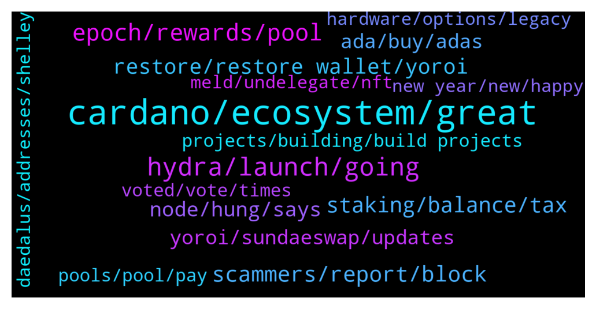

# **@Cardano**
 ## Analysis for **2022-01-02** - **2022-01-09**.

---

## 📊 **Basic Stats**

**n_messages_sent**: 620

---

---

## 🔝 **Top keywords and related messages**

1. **cardano, ecosystem, great**

    @thomas --- *[Forwarded from Cardano Announcements] Hey all! Want to help get more adoption and grow #Cardano? 👀  Please take a moment to vote and potentially get Ada added to bitpay app! ✨  Thanks for all the support! 💪  https://twitter.com/bitpay/status/1458977852230180868?s=21  Direct link to poll: https://gleam.io/1a0mE/bitpay-coin-poll (FYI: You can vote every day!😉)  Would you rather request a feature via the website and ask them for Cardano support? Please visit here and let your voices be heard: https://bitpay.canny.io/feature-request?sort=top* **--->** [TG Discussion](https://t.me/Cardano/763791)

    @Kharlyp --- *I exchange my cardano to lisk and it’s been pending for months now* **--->** [TG Discussion](https://t.me/Cardano/766407)

    @rickazley --- *Hey Cardanians, did you all see a video released by Bankless? They're saying Cardano is a scam and has been paying Youtubers 100% in staking pool rewards.  Source: https://youtu.be/DoAyY1V57RA* **--->** [TG Discussion](https://t.me/Cardano/762913)

    @addcrypto3 --- *It  is very poor from cardano side that private wallet is ready with dapps connector but cardano supported and funded wallet has no timeline yet.* **--->** [TG Discussion](https://t.me/Cardano/767189)

    @Melly014 --- *Where can I stake cardano token* **--->** [TG Discussion](https://t.me/Cardano/765416)

    @CryptoHorsey --- *Hi team,   Any updates on the native Cardano NFTs competition from the Cardano Summit? I've received them in my Terra account but haven't heard much of the next stage/competition.  Any updates would be good!   Thanks! Peter 😊* **--->** [TG Discussion](https://t.me/Cardano/765040)

2. **hydra, launch, going**

    @Jose Leni --- *Hi guys. Any news when hydra is going live mainnet?* **--->** [TG Discussion](https://t.me/Cardano/764038)

    @cryptojack6317 --- *any update on the defi? last I heard its coming sooner than expected* **--->** [TG Discussion](https://t.me/Cardano/764436)

    @apex_pool_spo --- *each defi project will launch when the team is ready to launch, I assume. it seems a few will launch at the end of January.* **--->** [TG Discussion](https://t.me/Cardano/764437)

    @Greg --- *I also know about vyfi going live in about two weeks maybe sooner.* **--->** [TG Discussion](https://t.me/Cardano/764542)

    @kiwicryptoT --- *So yeah, I’m super excited to see a cnt finally on a T1 Cex. Just hoping all the drama today doesn’t distract from that* **--->** [TG Discussion](https://t.me/Cardano/766562)

    @doc_holiday1881 --- *Probably in the new year. It will happen soon 😊 just follow their telegram channel, discord, and Twitter for announcements. They just recently had an AMA talking about the progress they have made. It is looking very good* **--->** [TG Discussion](https://t.me/Cardano/762901)

3. **epoch, rewards, pool**

    @dmitry_stas --- *you'll get rewards if you staked 2 epochs before pool makes a block. the rewards will be distributed to you 2 epochs after pool makes the block* **--->** [TG Discussion](https://t.me/Cardano/763681)

    @apex_pool_spo --- *when you redelegate to another pool, you will start earning rewards from the new pool after 3 full epochs (after the epoch when you redelegated). until then, you will earn rewards from the old stake pool. for example, if you redelegated  during Epoch 311 (which ended about 12 hours ago), you will see the first rewards from the new stake pool at the beginning of Epoch 315.* **--->** [TG Discussion](https://t.me/Cardano/764393)

    @rdalio321 --- *Hey guys, I recently re-delegated to a pool. The rewards for the pool on adapools says "minting" for Epoch 311, does this mean they have not been paid out yet?* **--->** [TG Discussion](https://t.me/Cardano/764391)

    @rdalio321 --- *Ok so if I delegated on 14-Dec then that was E309, shows they minted 1 block then as well* **--->** [TG Discussion](https://t.me/Cardano/764404)

    @aKnTN --- *After Redelegation to a different pool..., do we need to wait again another 3 epochs to get rewards ?* **--->** [TG Discussion](https://t.me/Cardano/764796)

    @Rowdy1219 --- *If a pool mints a block, and you have been staked in that block for over 3 or 4 weeks, do you get rewards when the block is minted?* **--->** [TG Discussion](https://t.me/Cardano/763680)

4. **scammers, report, block**

    @Lgbeano --- *No worries at all. P.s. I will not be sending you a DM if you do receive one from an account looking like mine or anyone else's* **--->** [TG Discussion](https://t.me/Cardano/765884)

    @RVarel --- *I have few thousands and wanted to sell few* **--->** [TG Discussion](https://t.me/Cardano/763645)

    @Albert --- *Well I was looking for an admin couse a couple members of this group are trying to scam me and wanted to report them couse I have pictures. I can't even find the message I sent I guess someone deleted it* **--->** [TG Discussion](https://t.me/Cardano/765726)

    @andy_mt10 --- *Be careful of scammers DM you* **--->** [TG Discussion](https://t.me/Cardano/765979)

    @glitch04 --- *Also if anyone dm's you acting as support block and report them as they are scammers.* **--->** [TG Discussion](https://t.me/Cardano/763396)

    @apex_pool_spo --- *first, don't answer to scammers contacting you with private messages.* **--->** [TG Discussion](https://t.me/Cardano/765471)

5. **staking, balance, tax**

    @Tustyrusty --- *I've spoken to IR about this. They have put a technical doc on Gov.uk I will either treat stake as income or interest on savings or a capital gain based on £0 purchase. I believe all are acceptable. I put exact what I've done in email to accountant. IR will not chastise you if you are genuinely trying to be legit. Worst case they will alter your return which could even be in your favour!* **--->** [TG Discussion](https://t.me/Cardano/763957)

    @JudgeDJ --- *Anyone know how staking is taxed in the UK?  Is it from the point you click claim that you get charged income tax?* **--->** [TG Discussion](https://t.me/Cardano/763913)

    @glitch04 --- *They offer returns based on their own system not the networks native option. Is that a good platform? Sure for many that find it useful but they have different functions. Staking on the network is done with out releasing control of your wallet balance or having lock periods, where as with a platform like Nexo or Celsius you release custody of your assets to them in exchange for interest paid out while they loan your balance (assets) out.* **--->** [TG Discussion](https://t.me/Cardano/764079)

    @zainbachmid --- *can someone explain to me how to stake ada?* **--->** [TG Discussion](https://t.me/Cardano/765729)

    @Rabbitholepools --- *Ok, it might be worth pointing Antho to one such non-branded staking guide then. Could you please help with that?* **--->** [TG Discussion](https://t.me/Cardano/764015)

    @Tustyrusty --- *So you have 10 coins you stake and get 1 coin. Your point of tax is when you cash in that coin* **--->** [TG Discussion](https://t.me/Cardano/763964)

6. **restore, restore wallet, yoroi**

    @RVarel --- *Hi George, nope its not like that I tried your method but its not restoring my wallet on yoroi* **--->** [TG Discussion](https://t.me/Cardano/763604)

    @RVarel --- *I just verified my recovery phrase and its correct inthat Daedalus wallet* **--->** [TG Discussion](https://t.me/Cardano/763623)

    @apex_pool_spo --- *if you are using the same recovery words and select the "restore" option, it will work.* **--->** [TG Discussion](https://t.me/Cardano/763605)

    @sul4x --- *Is this the original yoroi wallet?: https://yoroi-wallet.com* **--->** [TG Discussion](https://t.me/Cardano/764748)

    @simonvenom --- *Guys my deadalus wallets keep disappearing when loading up my deadalus - is this a known issue?* **--->** [TG Discussion](https://t.me/Cardano/767004)

    @nes585 --- *Hey George, I haven't tried to restore my wallet yet. I will give it a go. Do I need to restore my wallet from daedalus, right?* **--->** [TG Discussion](https://t.me/Cardano/762779)

7. **node, hung, says**

    @Julius --- *Must just be one of those days.  Usually it fixes itself after a day or so.  First time getting a crash on closure though.* **--->** [TG Discussion](https://t.me/Cardano/765856)

    @Julius --- *I see. How do i avoid the hung state?  It just says stopping cardano node...* **--->** [TG Discussion](https://t.me/Cardano/765847)

    @glitch04 --- *if you get another node crash try a reboot and see if that helps something might be stuck in the background* **--->** [TG Discussion](https://t.me/Cardano/765860)

    @glitch04 --- *Right but it can still exit in a hung state, if it does that means it was killed before the process was cleanly exited which causes the extended check on startup* **--->** [TG Discussion](https://t.me/Cardano/765844)

    @Julius --- *Sometimes when I launch it starts at 99.6%* **--->** [TG Discussion](https://t.me/Cardano/765829)

    @Julius --- *Then goes away after a while.* **--->** [TG Discussion](https://t.me/Cardano/765843)

8. **yoroi, sundaeswap, updates**

    @sul4x --- *Is "Planetstake 2" a good validator?* **--->** [TG Discussion](https://t.me/Cardano/764776)

    @addcrypto3 --- *What is open source. Yoroi should have use some part transaction fee to enhance their product* **--->** [TG Discussion](https://t.me/Cardano/767199)

    @rdalio321 --- *Oh interesting...those are better? Been using Yoroi a long time* **--->** [TG Discussion](https://t.me/Cardano/764416)

    @trisha231 --- *Please is there a precise delegate to use, to be able to participate in the SundaeSwap ISO* **--->** [TG Discussion](https://t.me/Cardano/765226)

    @rdalio321 --- *I actually unstaked from the previous pool in order to switch from Yoroi to Yoroi/Ledger* **--->** [TG Discussion](https://t.me/Cardano/764410)

    @Paulo_Figueiredo14 --- *Any idea when Sundae will begin the ISO?* **--->** [TG Discussion](https://t.me/Cardano/765027)

9. **ada, buy, adas**

    @sul4x --- *Is there a calculator which shows how much ADA you would get by delegating to a specific validator?* **--->** [TG Discussion](https://t.me/Cardano/764769)

    @apex_pool_spo --- *and if you have more than a few hundreds ADA, you should consider buying a hardware wallet.* **--->** [TG Discussion](https://t.me/Cardano/763628)

    @KN959595 --- *I read something about Liqwid, a project on ADA* **--->** [TG Discussion](https://t.me/Cardano/765810)

    @Chillig. --- *which are actually the current ada addresses that are supported?* **--->** [TG Discussion](https://t.me/Cardano/762894)

    @Giovanni --- *I mean when I want to liquidate my ADAs and convert them into fiat* **--->** [TG Discussion](https://t.me/Cardano/765925)

    @sul4x --- *I delegated to it but I think I got fairly few ADA.* **--->** [TG Discussion](https://t.me/Cardano/764779)

10. **projects, building, build projects**

    @glitch04 --- *Not sure that is the goal, both are on their own path and there is plenty of room for multiple projects in the space* **--->** [TG Discussion](https://t.me/Cardano/767209)

    @glitch04 --- *That's the thing about being opensource others have time to build their own projects while the core focuses on building the core* **--->** [TG Discussion](https://t.me/Cardano/767193)

    @sozaried --- *I agree also, but probably that goes hand in hand with the passion he has for the project.  Probably a CH not caring about attacks and focusing only in developing, would be boring and uninspiring.* **--->** [TG Discussion](https://t.me/Cardano/763182)

    @Block101 --- *The features look cool on Maladex, its whether or not the team delivers. The roadmap doesn't even have dates.  + I don't invest in projects without seeing who's building it.* **--->** [TG Discussion](https://t.me/Cardano/764623)

    @glitch04 --- *Personal opinion if projects worked together they could make it further faster vs trying to be individuals* **--->** [TG Discussion](https://t.me/Cardano/767210)

    @Rabbitholepools --- *That's fair enough. But some development milestones can be discussed.* **--->** [TG Discussion](https://t.me/Cardano/764989)

11. **voted, vote, times**

    @ExInfernis --- *47 hours left. I have voted 37 times. If just everyone here votes at least once until the end we can take the lead.* **--->** [TG Discussion](https://t.me/Cardano/763502)

    @ExInfernis --- *It is shame, we have around 160k votes.* **--->** [TG Discussion](https://t.me/Cardano/764116)

    @doc_holiday1881 --- *I’ve been voting everyday but seems like people aren’t voting. There’s no reason we shouldn’t beat EOS* **--->** [TG Discussion](https://t.me/Cardano/763866)

    @ExInfernis --- *Yeap, I think this group is not very active on voting. Lets do one last vote.* **--->** [TG Discussion](https://t.me/Cardano/763861)

    @ChrisSTR8 --- *Please do support the BitPay poll, we could still win this if enough voted, only 2 days to go* **--->** [TG Discussion](https://t.me/Cardano/763299)

    @ExInfernis --- *We are very close again to be with most votes. Please everyone lets keep voting for just another 3 days and show why cardano blockchain and community is the best in the world.* **--->** [TG Discussion](https://t.me/Cardano/763165)

12. **pools, pool, pay**

    @glitch04 --- *While that is a nice guide this will be the one and only time we ask that you not use it as you advertise the pool within the guide* **--->** [TG Discussion](https://t.me/Cardano/764001)

    @Snowden29 --- *Thanks i see, i dont need select pool project in nexo.. ive been send my Ada in yoroi into nexo, cause  nexo can earn up to 8% in one mounth.. whats better if you Investor?* **--->** [TG Discussion](https://t.me/Cardano/764093)

    @Rabbitholepools --- *There are a number of great pools. There are not many things to avoid, other than pools that are oversaturated or entities which spin new pools all the time* **--->** [TG Discussion](https://t.me/Cardano/764780)

    @Rabbitholepools --- *As far as choosing a stake pool you are better served doing your own resarch* **--->** [TG Discussion](https://t.me/Cardano/764777)

    @Rabbitholepools --- *Try to avoid oversaturated pools. ATM there is a pretty strong debate in favour of small pools, as a means to further decentralize the network. Another argument is posed against entities running multiple pools (often unsuturated pools).   You can use adapools.org and pooltool.io to have a look at current metrics.  Also consider pools in the Cardano Single Pool Alliance, all devoted to decentralization of the network.  If you need further info on pool choice ping us here.   Happy staking 👍* **--->** [TG Discussion](https://t.me/Cardano/764745)

    @glitch04 --- *Right they don't have pools they offer lending products* **--->** [TG Discussion](https://t.me/Cardano/764095)

13. **hardware, options, legacy**

    @glitch04 --- *I would recommend hardware devices for light wallet added security, if you have the means* **--->** [TG Discussion](https://t.me/Cardano/766925)

    @glitch04 --- *Nobody is bound to using any one wallet they are free to choose which wallet/delegation method they prefer* **--->** [TG Discussion](https://t.me/Cardano/764984)

    @Zyroxa --- *the question is why would you want to use a legacy wallet?* **--->** [TG Discussion](https://t.me/Cardano/762942)

    @Zyroxa --- *Yeah but there are certain functions which are not possible with the legacy wallets like staking/delegation.* **--->** [TG Discussion](https://t.me/Cardano/762914)

    @Zyroxa --- *What do you mean exactly? #safety* **--->** [TG Discussion](https://t.me/Cardano/763568)

    @glitch04 --- *You can't typically create a wallet with one device then unlock it with the other* **--->** [TG Discussion](https://t.me/Cardano/765907)

14. **meld, undelegate, nft**

    @apex_pool_spo --- *no, actually it will help you with the NFT from MELD. one step is to Delegate to a community pool, in order to evolve your NFT.* **--->** [TG Discussion](https://t.me/Cardano/763648)

    @RVarel --- *Actually i staked it in a meld pool for meld ispo and since it ended on 8 dec hence was thinking to undelegate and sell few of th. Hope it won’t impact my meld ispo* **--->** [TG Discussion](https://t.me/Cardano/763647)

    @apex_pool_spo --- *you don't need to undelegate for that. you just transfer what you want to sell to the Exchange (or where you want to sell it).* **--->** [TG Discussion](https://t.me/Cardano/763646)

    @RVarel --- *Hi Rick,how to undelegate my ada from stake pool? i only see an option to redelegate* **--->** [TG Discussion](https://t.me/Cardano/763598)

    @apex_pool_spo --- *delegate the wallet to a stake pool (other than MELD).* **--->** [TG Discussion](https://t.me/Cardano/763652)

    @RVarel --- *Hi how to undelegate my ada from stake pool? i only see an option to redelegate* **--->** [TG Discussion](https://t.me/Cardano/763519)

15. **daedalus, addresses, shelley**

    @Julius --- *Aww dang how depressing... daedalus getting slower to launch as time goes by.  Used to connect to the chain relatively quickly in the past...* **--->** [TG Discussion](https://t.me/Cardano/765827)

    @Rabbitholepools --- *Hi Cat welcome to the group👏 Please find some info about Daedalus HW setups here:  https://iohk.zendesk.com/hc/en-us/articles/900004722083-How-to-use-Ledger-and-Trezor-HW-with-Daedalus  https://www.ledger.com/cardano-wallet  I am currently using a Nano S with Daedalus and have no issue.   Please let us know how it goes. Happy staking👏* **--->** [TG Discussion](https://t.me/Cardano/764293)

    @siamstudio --- *I try install Daedalus but I cant need download all blochain* **--->** [TG Discussion](https://t.me/Cardano/765483)

    @ThinkLater --- *Is there an issue with the Daedalus network?* **--->** [TG Discussion](https://t.me/Cardano/766441)

    @aw77jc --- *Hello is there a way to speed up the syncing process in the Daedalus wallet? Been syncing for several days.* **--->** [TG Discussion](https://t.me/Cardano/766000)

    @glitch04 --- *You can file a ticket from the help tab at the top of Daedalus and send the logs on the same tab so they can address the issue in future builds* **--->** [TG Discussion](https://t.me/Cardano/765849)

