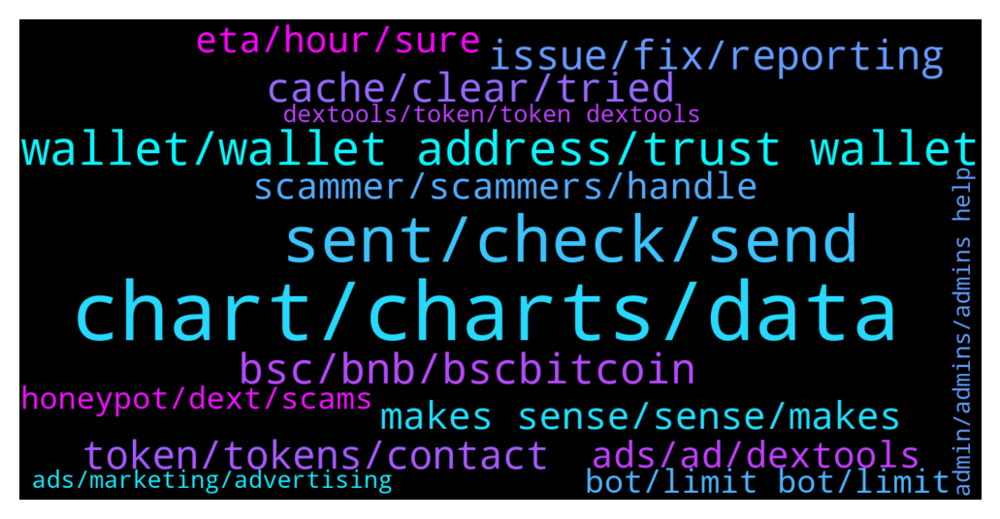

# **@DEXToolsCommunity**
 ## Analysis for **2022-01-02** - **2022-01-09**.

---

## 📊 **Basic Stats**

**n_messages_sent**: 1311

---

---

## 🔝 **Top keywords and related messages**

1. **chart, charts, data**

    @napascual --- *Nothing to fix there. A candle normalization has already been done, those candles just cannot be avoided. That's just blockchain data. You can still stretch the candles to display the chart dates you're interested in.* **--->** [TG Discussion](https://t.me/DEXToolsCommunity/320928)

    @Mojomagick --- *Please can you fix or tell me what the issue is:  The chart for AVT a few times wicks have been removed after a few days. This has happened on several different occassions for a few weeks.  For example yesterday  Price went to $1.82 But today that price was removed from the chart. Even though 2 transactions at that price are still on the transaction log under the chart.  https://www.dextools.io/app/ether/pair-explorer/0xcdff6ddfc9e4807c9927fd58708c2ef3484cc305  @napascual* **--->** [TG Discussion](https://t.me/DEXToolsCommunity/321028)

    @wealthyhobo --- *If you zoom out of the chart you will see a massive red candle way before that current chart. The first green candle you see is the actual day the project was launched* **--->** [TG Discussion](https://t.me/DEXToolsCommunity/320931)

    @wealthyhobo --- *Fix the chart for ANTIS Inu, someone added liquidity before the launch date to sabotage it, and we need that resolved ASAP.* **--->** [TG Discussion](https://t.me/DEXToolsCommunity/320916)

    @Reza --- *Please look at the full chart... There is a big red candle that occurred prior to launching. It's inaccurate and misleading. Please take appropriate action, as this can be detrimental.* **--->** [TG Discussion](https://t.me/DEXToolsCommunity/321044)

    @P C --- *is there an option to view my entry points on the chart in dextool? Also, 'My positions' are not showing any data but will need to fill manually?* **--->** [TG Discussion](https://t.me/DEXToolsCommunity/322632)

2. **sent, check, send**

    @FredericDEXT --- *Dm me the link and I'll check* **--->** [TG Discussion](https://t.me/DEXToolsCommunity/319621)

    @Thesios --- *which I am trying to get an official CPM per zone , But I have not see anything official yet* **--->** [TG Discussion](https://t.me/DEXToolsCommunity/322711)

    @napascual --- *Dm me the trx I'll take a look* **--->** [TG Discussion](https://t.me/DEXToolsCommunity/319256)

    @napascual --- *Hey could you dm me before doing that?* **--->** [TG Discussion](https://t.me/DEXToolsCommunity/322591)

    @genialcronyTAMC6 --- *Thanks can I DM you now?* **--->** [TG Discussion](https://t.me/DEXToolsCommunity/319688)

    @stanes --- *Can you send me some links with with this issue in DM please?* **--->** [TG Discussion](https://t.me/DEXToolsCommunity/322322)

3. **wallet, wallet address, trust wallet**

    @OQuintero --- *But they asking for my wallet address, it’s that correct?* **--->** [TG Discussion](https://t.me/DEXToolsCommunity/322507)

    @napascual --- *There's never been a problem connecting your wallet* **--->** [TG Discussion](https://t.me/DEXToolsCommunity/320603)

    @Birds --- *Wallet Info when linked to Metamask* **--->** [TG Discussion](https://t.me/DEXToolsCommunity/321960)

    @amorris11 --- *https://www.dextools.io/#choose your plan you can also see it here. Please note no admin will dm you asking to connect wallet to verify* **--->** [TG Discussion](https://t.me/DEXToolsCommunity/320749)

    @Ayim --- *Okk av connected with my trust wallet  Am having problem with the transfer* **--->** [TG Discussion](https://t.me/DEXToolsCommunity/322189)

    @stanes --- *Yes you can. But for that you only need to connect your actual wallet (Metamask or other) to the app.* **--->** [TG Discussion](https://t.me/DEXToolsCommunity/322204)

4. **bsc, bnb, bscbitcoin**

    @napascual --- *It should be almost immediate at the time the trx is confirmed, but on bsc there are sometimes delays* **--->** [TG Discussion](https://t.me/DEXToolsCommunity/319232)

    @stanes --- *For the moment yes. BSC soon.* **--->** [TG Discussion](https://t.me/DEXToolsCommunity/322876)

    @TheFlash_11 --- *We are on bsc....so we just have to get all our links in order?* **--->** [TG Discussion](https://t.me/DEXToolsCommunity/319617)

    @spfr236 --- *im only always on bsc and all i told is only valid for bsc* **--->** [TG Discussion](https://t.me/DEXToolsCommunity/323285)

    @challengingmind --- *It is already on bsc i just made a buy order... will have to see if it worked* **--->** [TG Discussion](https://t.me/DEXToolsCommunity/323098)

    @stanes --- *Yep, for BSC you have to be a standard user.* **--->** [TG Discussion](https://t.me/DEXToolsCommunity/321154)

5. **issue, fix, reporting**

    @FredericDEXT --- *We can fix that thanks for reporting* **--->** [TG Discussion](https://t.me/DEXToolsCommunity/318650)

    @napascual --- *Nice, we're looking into that issue closely, we will be changing some cache policies soon to fix that* **--->** [TG Discussion](https://t.me/DEXToolsCommunity/323269)

    @Mojomagick --- *Can this be fixed please ?* **--->** [TG Discussion](https://t.me/DEXToolsCommunity/321098)

    @BlockchainPadawan --- *That has not been effective so far.* **--->** [TG Discussion](https://t.me/DEXToolsCommunity/322174)

    @napascual --- *Hey, we've fixed that yesterday already, added several checks and security. It won't happen again* **--->** [TG Discussion](https://t.me/DEXToolsCommunity/319566)

    @napascual --- *We have that on our backlog* **--->** [TG Discussion](https://t.me/DEXToolsCommunity/318930)

6. **cache, clear, tried**

    @bastardganpunk --- *you might need to clear your cache and try again. but the way you tried to do it is correct* **--->** [TG Discussion](https://t.me/DEXToolsCommunity/322894)

    @bastardganpunk --- *Still not working? Check you have a stable internet connection and your cache cleared. It should work then. Maybe even restarting your computer.* **--->** [TG Discussion](https://t.me/DEXToolsCommunity/321610)

    @napascual --- *First try hard refreshing, no need to clear site data (we don't use cookies). Its usually requested to browsers ignoring web worker updates, thus not forcing a resources refresh* **--->** [TG Discussion](https://t.me/DEXToolsCommunity/323254)

    @stanes --- *What if you refresh the page?* **--->** [TG Discussion](https://t.me/DEXToolsCommunity/322931)

    @bonetky --- *Okay the solution was clear cookies and site data* **--->** [TG Discussion](https://t.me/DEXToolsCommunity/323249)

    @borntochas3 --- *yea it worked after clearing cache and restarting my pc, i had it on for a few weeks now that might be the issue* **--->** [TG Discussion](https://t.me/DEXToolsCommunity/322286)

7. **token, tokens, contact**

    @gumbercules --- *As stated...no action can be taken. That's the data that's been picked up from when the token was launched* **--->** [TG Discussion](https://t.me/DEXToolsCommunity/321045)

    @gumbercules --- *I'm not seeing a verified marking (assuming we're talking about the same token)* **--->** [TG Discussion](https://t.me/DEXToolsCommunity/319109)

    @NoodleSchman --- *How would I go about getting my token listed?* **--->** [TG Discussion](https://t.me/DEXToolsCommunity/323403)

    @chrismagic0 --- *I need support for my token* **--->** [TG Discussion](https://t.me/DEXToolsCommunity/319970)

    @stanes --- *You first need to give the autorisation to the contract to spend your tokens.  You only need to approve it once for each token.* **--->** [TG Discussion](https://t.me/DEXToolsCommunity/322880)

    @stanes --- *Ask them directly please, they should be able to answer you. We are not in charge of this token.* **--->** [TG Discussion](https://t.me/DEXToolsCommunity/319862)

8. **makes sense, sense, makes**

    @Aloys_93 --- *I suggest making that more clearer on website though, if info is there, couldn't find it* **--->** [TG Discussion](https://t.me/DEXToolsCommunity/323200)

    @cactusjimm --- *anyone know answer to this q?* **--->** [TG Discussion](https://t.me/DEXToolsCommunity/322377)

    @Daaann --- *Oh ok thank you, and man one more thing* **--->** [TG Discussion](https://t.me/DEXToolsCommunity/319187)

    @RealCryptoDomus --- *Okay yeah there it is thank you* **--->** [TG Discussion](https://t.me/DEXToolsCommunity/322842)

    @elialearn --- *Great thank  you so much* **--->** [TG Discussion](https://t.me/DEXToolsCommunity/320376)

    @Mojomagick --- *Sorry i must have missed it* **--->** [TG Discussion](https://t.me/DEXToolsCommunity/321101)

9. **scammer, scammers, handle**

    @tatiana211 --- *posible to buy scam? im cant undersand* **--->** [TG Discussion](https://t.me/DEXToolsCommunity/319856)

    @stanes --- *@DinkoChief be careful, it was a scammer handle.* **--->** [TG Discussion](https://t.me/DEXToolsCommunity/321433)

    @smid10 --- *Scammer has hosted his js payload on namecheap* **--->** [TG Discussion](https://t.me/DEXToolsCommunity/319066)

    @stanes --- *Be careful, someone earlier gave you the contact of a scammer. Only use the one above.* **--->** [TG Discussion](https://t.me/DEXToolsCommunity/322850)

    @EricCryptoman --- *we had a security breach, completely our fault, you got scammed, goodbye* **--->** [TG Discussion](https://t.me/DEXToolsCommunity/319580)

    @senzacionale --- *Omg. So many scammers contact me* **--->** [TG Discussion](https://t.me/DEXToolsCommunity/320578)

10. **ads, ad, dextools**

    @Killthezerotoken --- *Hi, how to list dextool banner ad.* **--->** [TG Discussion](https://t.me/DEXToolsCommunity/322604)

    @Thesios --- *I am looking for AD rates on dextools* **--->** [TG Discussion](https://t.me/DEXToolsCommunity/321967)

    @Thesios --- *@napascual I been trying to get info on running ads on dextools for days with no luck* **--->** [TG Discussion](https://t.me/DEXToolsCommunity/322613)

    @币圈 --- *Dextools app get ads fee can purchase dext to burn？* **--->** [TG Discussion](https://t.me/DEXToolsCommunity/319419)

    @bastardganpunk --- *what so you mean by AD rates?* **--->** [TG Discussion](https://t.me/DEXToolsCommunity/321969)

    @OMOONXT1 --- *ppl are selling without any problem as I can see on dextools* **--->** [TG Discussion](https://t.me/DEXToolsCommunity/319860)

11. **eta, hour, sure**

    @hmk18990 --- *yes it's on the way but can't give you an ETA* **--->** [TG Discussion](https://t.me/DEXToolsCommunity/322066)

    @RedPanda94 --- *Not listed yet but wanna be prepared* **--->** [TG Discussion](https://t.me/DEXToolsCommunity/321990)

    @AJ --- *any ETAs please so that I can remind you after that again !* **--->** [TG Discussion](https://t.me/DEXToolsCommunity/320797)

    @stanes --- *It's currently 10 o'clock on January 1st in Spain 😅 but be sure devs will take care of it as soon as they can. Just give them couple hours should be fine.* **--->** [TG Discussion](https://t.me/DEXToolsCommunity/320799)

    @napascual --- *Will be added today as well* **--->** [TG Discussion](https://t.me/DEXToolsCommunity/318858)

    @hmk18990 --- *planned but can't give you an ETA* **--->** [TG Discussion](https://t.me/DEXToolsCommunity/322398)

12. **dextools, token, token dextools**

    @gumbercules --- *DeXTools doesn't list tokens but I will forward to @napascual* **--->** [TG Discussion](https://t.me/DEXToolsCommunity/321030)

    @Terryjunior --- *Hi  Our token got listed on Pancakeswap since the 18th of December and is not appearing on dextools.  People talk about API CALL. PLEASE can you help?  Flashtoken  💥OFFICIAL CONTRACT:   0x311e015e2e255dd14eddc4a2107e39649dc81c5d* **--->** [TG Discussion](https://t.me/DEXToolsCommunity/322694)

    @wwsalpha --- *Hi, how can i list my token in Dextools, and is it possible to list if its still in presale mode?* **--->** [TG Discussion](https://t.me/DEXToolsCommunity/318909)

    @Bladepool --- *Hello all, I made a mistake and send my dextools tokens to the contract.* **--->** [TG Discussion](https://t.me/DEXToolsCommunity/323187)

    @Steve --- *Can someone point me in the right direction?  I'm trying to list a smart chain token on dextools but can't find instructions.  Can you direct me to a link or video? Thanks in advance!* **--->** [TG Discussion](https://t.me/DEXToolsCommunity/322102)

    @voycetokenceo --- *How can I get a token removed from dextools? It is a scam token impersonating my token.* **--->** [TG Discussion](https://t.me/DEXToolsCommunity/318978)

13. **ads, marketing, advertising**

    @vika_proger --- *Hello everyone. How to buy advertising on the site? Write to me in private messages please* **--->** [TG Discussion](https://t.me/DEXToolsCommunity/321531)

    @Crypto_odds --- *Hi I messaged the person in charge of advertising a few days ago can someone please get in contact with me* **--->** [TG Discussion](https://t.me/DEXToolsCommunity/318777)

    @wllindless --- *I'm anxious i want to advertise* **--->** [TG Discussion](https://t.me/DEXToolsCommunity/320554)

    @dazedcrypto --- *how does your advertising work ?* **--->** [TG Discussion](https://t.me/DEXToolsCommunity/321285)

    @NoodleSchman --- *How do i get in contact with someone from marketing?* **--->** [TG Discussion](https://t.me/DEXToolsCommunity/323409)

    @stanes --- *I am official. And I can assure you it's not possible to buy hot spots. But they can buy ads ofc.* **--->** [TG Discussion](https://t.me/DEXToolsCommunity/321712)

14. **honeypot, dext, scams**

    @JoeyDieleman --- *Yeah thats sad, the whole purpose of DexTools if to give you info to not fall for scams, only buys, low score no public contract should give people red flags, of course even then dextools can never be 100% accurate, there will always be a fight between detecting scams and scammers comming up with new things. Please use dextools as intended and always do extra research on top of that. See the socials and check those too (and don'y fall for bots saying all the time the project is awesome and 100x is the only way). But for the tokens you gave, Dextools is pretty clear.* **--->** [TG Discussion](https://t.me/DEXToolsCommunity/321274)

    @VISAFinan --- *Why DEXTools was listed scam coins* **--->** [TG Discussion](https://t.me/DEXToolsCommunity/319355)

    @Katana_Crypto --- *You're right. I'm usually diligent and always warn others. It was new... And I couldn't check it on the usual sites. I don't remember where I saw it, but there was a check next to HONEYPOT SAFE, and I believed it. There were so many others dropping large ETH into it.   Etherscan showed people selling it to Uniswap...through POOL.  I couldn't figure how to do that, though.   Live and learn... The hard way.   Once Dextools notices a scam, do they remove it from the feed? Hate to see others start their New Year of the same as I did. 😭  👋💰🚽* **--->** [TG Discussion](https://t.me/DEXToolsCommunity/321275)

    @Katana_Crypto --- *Two apparent scams promoted on Dextools as safe:  COINBASE DAO  DISCORD DAO    If they aren't scams, why are they impossible to sell?* **--->** [TG Discussion](https://t.me/DEXToolsCommunity/321268)

    @dabbucici --- *@stanes  #1 trending on dextools is a honeypot fake COPY of HoHoHo contract please take it down* **--->** [TG Discussion](https://t.me/DEXToolsCommunity/318577)

    @大可不必 --- *Well, because that project has been banned since its launch. But its twitter said that it had paid dext marketing to advertise the project, so I was very worried about whether it was a scam* **--->** [TG Discussion](https://t.me/DEXToolsCommunity/322347)

15. **bot, limit bot, limit**

    @Blackbird_vlad --- *So yes the problem come from anonymous setting, the bot don't recognize anonymous admin 😭* **--->** [TG Discussion](https://t.me/DEXToolsCommunity/319838)

    @Blackbird_vlad --- *Anyway my problem is that I added pricebot to channel, I try set pair and it keeps saying only admin can do that, but man I'm the admin so what is the problem? Is because we have set anonymous admins?* **--->** [TG Discussion](https://t.me/DEXToolsCommunity/319829)

    @FredericDEXT --- *Maybe, you need to set the bot as admin too* **--->** [TG Discussion](https://t.me/DEXToolsCommunity/319832)

    @RedPanda94 --- *You might have included a word that triggered a bot* **--->** [TG Discussion](https://t.me/DEXToolsCommunity/322016)

    @JosefMarino --- *Before everything worked perfect, please put watchlist on left side, and graphic on left side you could quit, it has no importance, we want to focus on the important things, swapp and limit bot should appear there, please change that* **--->** [TG Discussion](https://t.me/DEXToolsCommunity/318868)

    @JoeyDieleman --- *Indeed because its anonimous, the bot api doesn't show admin permissions so can't know its an admin* **--->** [TG Discussion](https://t.me/DEXToolsCommunity/319869)

