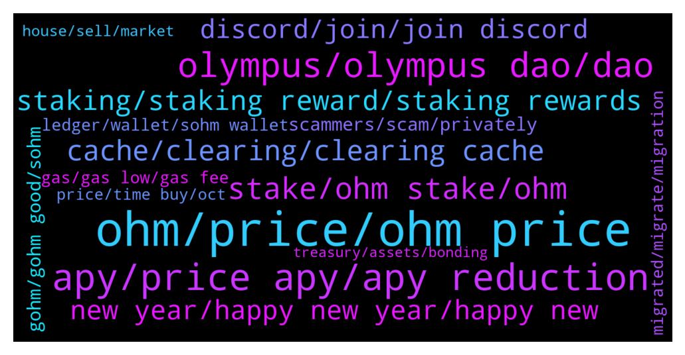

# **@OlympusTG**
 ## Analysis for **2022-01-02** - **2022-01-09**.

---

## 📊 **Basic Stats**

**n_messages_sent**: 5009

---

---

## 🔝 **Top keywords and related messages**

1. **ohm, price, ohm price**

    @theMagicUnicorn --- *rari itself is safe to use, they are a long standing partner with ohm : https://docs.olympusdao.finance/main/partnership/rari-partnership* **--->** [TG Discussion](https://t.me/OlympusTG/142382)

    @theMagicUnicorn --- *a lot of people flock to the instantly attractive high apy for the short term benefit, but the smart ones know that ohm has to be about long term value...people who read about it and educate themselves on it get it* **--->** [TG Discussion](https://t.me/OlympusTG/138783)

    @chittyusername --- *ohm needs to decide what it wants to do bc im about done* **--->** [TG Discussion](https://t.me/OlympusTG/144078)

    @churumbeI --- *Guys just check btcs 7 days percentage loss and check ohm’s, we are good and ready to bounce a lot when green days come back* **--->** [TG Discussion](https://t.me/OlympusTG/144877)

    @Niels --- *Bitcoin lost 17% in the last month and ohm 45…* **--->** [TG Discussion](https://t.me/OlympusTG/144881)

    @stacyd82d --- *Was it a scam. The symbol used had the ohm symbol in the middle* **--->** [TG Discussion](https://t.me/OlympusTG/138312)

2. **apy, price apy, apy reduction**

    @amkuo --- *can you explain halving the APY please, not so familair about it* **--->** [TG Discussion](https://t.me/OlympusTG/136399)

    @CBMallorca --- *Whats going on …? Its falling más falling … apy Isnt Changing …* **--->** [TG Discussion](https://t.me/OlympusTG/136715)

    @AllochkaMeow --- *Hello, can anyone suggest high yield APY projects?🙏* **--->** [TG Discussion](https://t.me/OlympusTG/138118)

    @Ap0l1o --- *Yup, in the next few weeks the apy will gradually drop to around 1k, as per OIP-18 & 63* **--->** [TG Discussion](https://t.me/OlympusTG/142821)

    @vampyren --- *Maybe we should not have done all of it at the same time? like reducing and even talking about apy reduction when price is fast going down and other factors you mention :/* **--->** [TG Discussion](https://t.me/OlympusTG/139812)

    @Antexol --- *@Ap0l1o mate so when do you estimate we will hit 1000% apy? End of January?* **--->** [TG Discussion](https://t.me/OlympusTG/144064)

3. **olympus, olympus dao, dao**

    @Ap0l1o --- *The difference between Olympus and the other DAOs is that Olympus put it’s money to work, always building something more and improving* **--->** [TG Discussion](https://t.me/OlympusTG/138831)

    @Toby --- *Do I just import the Olympus V2?* **--->** [TG Discussion](https://t.me/OlympusTG/137747)

    @s_p_i_r_a_l --- *is there any olympus trading channel?* **--->** [TG Discussion](https://t.me/OlympusTG/144050)

    @Unmask3 --- *I will just hodl both Olympus and Wonderland see how it goes* **--->** [TG Discussion](https://t.me/OlympusTG/140677)

    @Bambamlalah --- *Hello guys being reading about Olympus DAO.  How do I know how much is in the Treasury.* **--->** [TG Discussion](https://t.me/OlympusTG/138711)

    @nfwaple --- *the interest they give should be the same as the Olympus APY 🥲* **--->** [TG Discussion](https://t.me/OlympusTG/142565)

4. **stake, ohm stake, ohm**

    @The_Coin_Collector --- *yes bought ohm with eth. not staked as yet* **--->** [TG Discussion](https://t.me/OlympusTG/136401)

    @jken123456 --- *The ohmdao is for whale only...hahahaha..I'm poor can't stake my 0.1ohm..lol* **--->** [TG Discussion](https://t.me/OlympusTG/136757)

    @Winter_Chemistry --- *alternatively i feel comfortable buying ohm v2 tokens and then stake on dashboard* **--->** [TG Discussion](https://t.me/OlympusTG/139439)

    @Shaun11181977 --- *Hey team. New to the platform. just staked some OHM. Any recommendations as to next steps?* **--->** [TG Discussion](https://t.me/OlympusTG/135878)

    @Robbert --- *So contract of my staked ohm on ethscan is: 0x31932....aee77fbbe. is this correct or do I hold scam coins?* **--->** [TG Discussion](https://t.me/OlympusTG/140462)

    @Mrtnvds --- *So I converted some Bitcoin to Ether on my Ledger Live application. I send that ether to my Metamask wallet that is connected to Olympus DAO. After I swapped it to Ohm on Sushiswap, i wanted to stake (because 3,3 is good yeah i understand). Darn! Not enough Ether left in my Metamask to pay for the gas fee (to stake the Ohms , but I cant swap some Ohm back to Ether because that required a gas fee, which i cant pay!! What did I do wrong, what could I have done better?* **--->** [TG Discussion](https://t.me/OlympusTG/140770)

5. **cache, clearing, clearing cache**

    @Agus --- *Still ok but not that good as it wants to show in the website, just it* **--->** [TG Discussion](https://t.me/OlympusTG/143957)

    @Robbert --- *I will try Firefox browser now* **--->** [TG Discussion](https://t.me/OlympusTG/141490)

    @nfwaple --- *open the website from your PC/desktop instead of using phone, in my experience this might solve the issue* **--->** [TG Discussion](https://t.me/OlympusTG/140471)

    @nfwaple --- *clear cache, disconnect reconnect and try again, if you're using mobile try desktop version* **--->** [TG Discussion](https://t.me/OlympusTG/137641)

    @nfwaple --- *do the basic troubleshoot first, do you see sOHM in your wallet, sometimes it also take awhile to show up on the website, also try clearing cache and using desktop version* **--->** [TG Discussion](https://t.me/OlympusTG/138384)

    @Pulsianhex --- *Clear cache if that is same as blear browser history , i have don done and restarted* **--->** [TG Discussion](https://t.me/OlympusTG/135217)

6. **staking, staking reward, staking rewards**

    @Solomon --- *Please how can I go about in staking* **--->** [TG Discussion](https://t.me/OlympusTG/140838)

    @jken123456 --- *Gas fee for staking is 500$... wtf* **--->** [TG Discussion](https://t.me/OlympusTG/136755)

    @chitangxxx --- *why has the staking gone from the website?* **--->** [TG Discussion](https://t.me/OlympusTG/142916)

    @crypfern --- *Is there a guide for beginners to enter staking?* **--->** [TG Discussion](https://t.me/OlympusTG/136784)

    @kaezer --- *Hey guys i saw about the single staking on the ohm website however it doenst say anything about the lockup period is there one ? And  does the reward get paid out every block?* **--->** [TG Discussion](https://t.me/OlympusTG/135351)

    @DonDaddaa --- *Yea but what if the box is 0 and u still got 15 sohm in staking ? What can u do ?* **--->** [TG Discussion](https://t.me/OlympusTG/143964)

7. **new year, happy new year, happy new**

    @bike4peace --- *lets start the new year with good vibes only and keep on them 😉* **--->** [TG Discussion](https://t.me/OlympusTG/139332)

    @stacyd82d --- *Happy New Year All. Just want to say how great full I am to be a part of this community.* **--->** [TG Discussion](https://t.me/OlympusTG/140151)

    @dragonsaints --- *well see you all in an year unless there is someother change and we need to manually do something 😊* **--->** [TG Discussion](https://t.me/OlympusTG/141029)

    @cdp279 --- *Yo yo Is everyone happier today ?* **--->** [TG Discussion](https://t.me/OlympusTG/141174)

    @FLankarooo --- *Happy new year everyone btw 😁* **--->** [TG Discussion](https://t.me/OlympusTG/139519)

    @Max --- *BTW happy new year everyone 🥳* **--->** [TG Discussion](https://t.me/OlympusTG/139478)

8. **discord, join, join discord**

    @nfwaple --- *best to ask in the Discord, there are more technical people there* **--->** [TG Discussion](https://t.me/OlympusTG/134959)

    @nfwaple --- *no you have to go through Discord* **--->** [TG Discussion](https://t.me/OlympusTG/135539)

    @bike4peace --- *How to enter discord, instructions https://t.me/OlympusTG/46601  ---  Video: Interview with Kairos (OHM youtuber) https://t.me/OlympusTG/50052* **--->** [TG Discussion](https://t.me/OlympusTG/137364)

    @frontmm --- *My discord is currently not working well. Can you tell me how to contact me one-on-one?* **--->** [TG Discussion](https://t.me/OlympusTG/135538)

    @frontmm --- *https://discord.com/invite/olympusdao is this discord URL ?* **--->** [TG Discussion](https://t.me/OlympusTG/135543)

    @Agus --- *Anyone has the discord link? The one I found here doesnt work* **--->** [TG Discussion](https://t.me/OlympusTG/142592)

9. **scammers, scam, privately**

    @brucoo --- *Scammers wont stop, dont stop because someone falls into the trap sadly.* **--->** [TG Discussion](https://t.me/OlympusTG/142491)

    @muzna123 --- *ok...but some said that its scam project is it???* **--->** [TG Discussion](https://t.me/OlympusTG/141468)

    @cdp279 --- *No dude. It’s a scammer. Ignore those bitches* **--->** [TG Discussion](https://t.me/OlympusTG/140246)

    @nfwaple --- *you say that but a lot of people here do get scammed sadly😢😢* **--->** [TG Discussion](https://t.me/OlympusTG/135048)

    @Alex --- *This should bei pinned aswell. The amount of scammers trying is insane in here 🙂👌 i think this is a good sign 😂* **--->** [TG Discussion](https://t.me/OlympusTG/143129)

    @nfwaple --- *do not respond to direct/private messages, they're scammers* **--->** [TG Discussion](https://t.me/OlympusTG/143126)

10. **gohm, gohm good, sohm**

    @Alex --- *so we keep both sohm and gohm* **--->** [TG Discussion](https://t.me/OlympusTG/141383)

    @Chuks --- *How much of sOHM is gohm* **--->** [TG Discussion](https://t.me/OlympusTG/140636)

    @fpietrosanti --- *I do not fully understood what’s the difference in having gOHM vs. sOHM* **--->** [TG Discussion](https://t.me/OlympusTG/138544)

    @WeeBee --- *so what is difference between sOHM and gOHM? why should I buy sOHM and why should I buy gOHM instead?* **--->** [TG Discussion](https://t.me/OlympusTG/143131)

    @cryptojai --- *It's a jungle... But keep the faith!* **--->** [TG Discussion](https://t.me/OlympusTG/137714)

    @Alex --- *is sohm the one I should follow?* **--->** [TG Discussion](https://t.me/OlympusTG/141411)

11. **ledger, wallet, sohm wallet**

    @Ninho --- *How do I see gOHM in trust wallet? Which token do I have to add?* **--->** [TG Discussion](https://t.me/OlympusTG/141241)

    @Alex --- *and gohm is autostacking in my metamask then?* **--->** [TG Discussion](https://t.me/OlympusTG/139552)

    @willyc --- *How do I transfer sohm from trust wallet to gohm please* **--->** [TG Discussion](https://t.me/OlympusTG/137520)

    @paul_cassidy --- *For me it shows just my gohm amount but don’t show the equivalent of sohm in the wallet* **--->** [TG Discussion](https://t.me/OlympusTG/137892)

    @Katey --- *How come my gOHM does not show in my wallet* **--->** [TG Discussion](https://t.me/OlympusTG/138425)

    @nfwaple --- *yes, use hardware wallet like Ledger, create a wallet on your Ledger when you get it then send your gOHM/OHM/sOHM to that new wallet* **--->** [TG Discussion](https://t.me/OlympusTG/140192)

12. **gas, gas low, gas fee**

    @M --- *Waiting for gas fee to come down* **--->** [TG Discussion](https://t.me/OlympusTG/136619)

    @nfwaple --- *https://etherscan.io/gastracker you can check the gas now here, best to wait until gas is lower...* **--->** [TG Discussion](https://t.me/OlympusTG/137139)

    @CryptoCrazy_TR3 --- *Yeah I gave it a look. Not even worth it for me haha. The gas fee is like half of what I earned 🤣* **--->** [TG Discussion](https://t.me/OlympusTG/137114)

    @nfwaple --- *https://etherscan.io/gastracker yea unfortunately one more step to swap, gas is quite high today too, you can check the gas live* **--->** [TG Discussion](https://t.me/OlympusTG/143073)

    @Thomas --- *I believe there may be eventually but no time soon. So plenty of time to wait fir cheap gas for wrapping* **--->** [TG Discussion](https://t.me/OlympusTG/144206)

    @nfwaple --- *wait till gas gets to like 40 - 50 gwei* **--->** [TG Discussion](https://t.me/OlympusTG/141228)

13. **migrated, migrate, migration**

    @fantom2684 --- *tell me h recently glazed sOHM and I'm starting to study. I got such a tweet, does it correspond to reality? how can I migrate to gOHM and at what point? thanks* **--->** [TG Discussion](https://t.me/OlympusTG/143048)

    @Caravaggio --- *For anyone needing a good explination on gOHM migration I suggest this https://youtu.be/3lud0do7MxE* **--->** [TG Discussion](https://t.me/OlympusTG/137998)

    @ZR_CRYPTO --- *you migrated gohm to sohm? it should be vice versa* **--->** [TG Discussion](https://t.me/OlympusTG/137164)

    @A. --- *I read some infos about the migration. I don't understand : will the increasements of gohm be the same over a year as in sOhm? Absolutely no disadvantage to migrate? Please tag me.* **--->** [TG Discussion](https://t.me/OlympusTG/136369)

    @QTmightbehere --- *As far as I know yes as it shows u now as Gohm and cost me to migrate* **--->** [TG Discussion](https://t.me/OlympusTG/142949)

    @Boml3x --- *If i migrate sOhm v1 I get gOhm. This one keeps "earning" rebase but doesn't show. I don't bother with governance or bonding or wjatever. I just stake. So in my case do I leave gOhm as it is or do I need sOhm v2?* **--->** [TG Discussion](https://t.me/OlympusTG/144360)

14. **price, time buy, oct**

    @Cali_millionaire --- *Not happening  Not now  Not ever   This is the time to buy* **--->** [TG Discussion](https://t.me/OlympusTG/138234)

    @Newton --- *Price ever going to go up* **--->** [TG Discussion](https://t.me/OlympusTG/139042)

    @sticks_na_beany --- *Why is the price on blockfolio completely different to the actual price* **--->** [TG Discussion](https://t.me/OlympusTG/135726)

    @stacyd82d --- *I bought in Oct at $800. I’m still ahead by a little* **--->** [TG Discussion](https://t.me/OlympusTG/136719)

    @Art_Huss --- *Why the price keeps going down?? It slipped 72.5% in the past 60 days!!!!!* **--->** [TG Discussion](https://t.me/OlympusTG/139800)

    @cdp279 --- *It think we all need to stop checking the price so much. We all killing ourselves worrying* **--->** [TG Discussion](https://t.me/OlympusTG/144901)

15. **house, sell, market**

    @ccryii --- *Stop panic and selling like crazy* **--->** [TG Discussion](https://t.me/OlympusTG/138459)

    @onehundredsh0tz --- *Gonna have to sell my ass* **--->** [TG Discussion](https://t.me/OlympusTG/145107)

    @hugothehomeless --- *ok i will sell the house tomorrow* **--->** [TG Discussion](https://t.me/OlympusTG/137297)

    @theMagicUnicorn --- *some of us have to sell on the streets 👀* **--->** [TG Discussion](https://t.me/OlympusTG/139338)

    @ccryii --- *If they don’t sell like pussy s yes* **--->** [TG Discussion](https://t.me/OlympusTG/140308)

    @Enjoytaira --- *Why price down if market is quiet days ago?* **--->** [TG Discussion](https://t.me/OlympusTG/135582)

