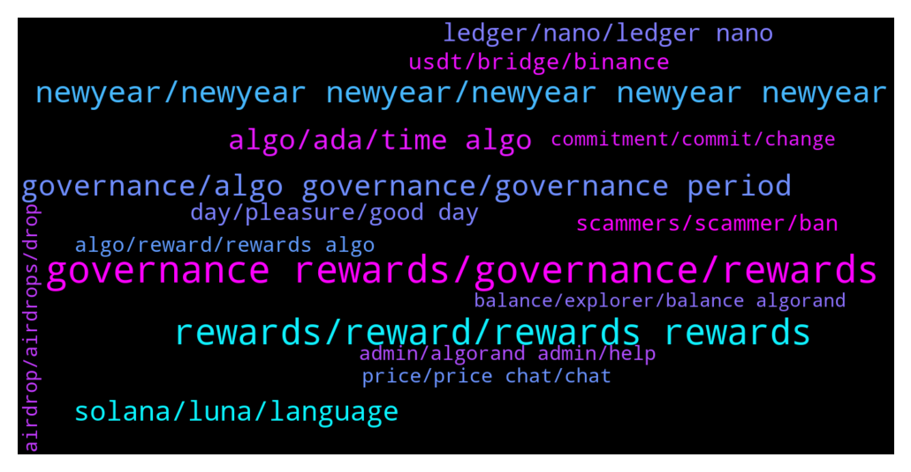

# **@algorand**
 ## Analysis for **2022-01-02** - **2022-01-09**.

---

## 📊 **Basic Stats**

**n_messages_sent**: 2098

---

---

## 🔝 **Top keywords and related messages**

1. **governance rewards, governance, rewards**

    @MackDenver --- *Hey Gourab,  Governance rewards will be distributed in Q3 of 2022.* **--->** [TG Discussion](https://t.me/algorand/326734)

    @Nicksof --- *I read a thread on Reddit that explain how the winning option was better for long term* **--->** [TG Discussion](https://t.me/algorand/329507)

    @Chompy --- *9.27% is the governance awards right? Does this fluctuate or will increase in time? I'm not ready to go governance just yet, I was thinking Q3 for governance* **--->** [TG Discussion](https://t.me/algorand/330620)

    @MackDenver --- *Check out the link below. The distribution of the governance reward will start from January 1 to January 5  https://algorand.foundation/news/key-dates-algorand-governance* **--->** [TG Discussion](https://t.me/algorand/328149)

    @billythepridecat --- *I am ready to committ to governance session 2 but how will my rewards from session 1 get commited if I register now?* **--->** [TG Discussion](https://t.me/algorand/329275)

    @Malvo --- *Admin Any update on the governance rewards* **--->** [TG Discussion](https://t.me/algorand/330323)

2. **rewards, reward, rewards rewards**

    @NightAlgorand --- *Nope, reward will be distributed to your wallet.* **--->** [TG Discussion](https://t.me/algorand/329015)

    @cryptocoque 🍷 --- *I have 2 questions: 1) i put 100algo for gouvernance to the 2d period: how many rewards i will get? 2) how will be informed for sessions votes? Thanks* **--->** [TG Discussion](https://t.me/algorand/328276)

    @MackDenver --- *Hello Lucid, I have already answered it. Please check the rewards FAQ to get better understanding.   https://algorand.foundation/faq#participation-rewards-* **--->** [TG Discussion](https://t.me/algorand/327014)

    @NightAlgorand --- *Hi you can see your rewards https://algoexplorer.io/rewards-calculator* **--->** [TG Discussion](https://t.me/algorand/331037)

    @NightAlgorand --- *Yes, it is the estimated reward.* **--->** [TG Discussion](https://t.me/algorand/329042)

    @VAR_JUAN_NULL --- *then, the rewards are long overdue.* **--->** [TG Discussion](https://t.me/algorand/329266)

3. **newyear, newyear newyear, newyear newyear newyear**

    @MeemBhai --- *Appreciate it's being addressed but I shit my pants 😂* **--->** [TG Discussion](https://t.me/algorand/327658)

    @开心 --- *I'm from China, English is not good* **--->** [TG Discussion](https://t.me/algorand/330944)

    @hope9999999 --- *I mean you request stupid order 😂😂😂* **--->** [TG Discussion](https://t.me/algorand/326578)

    @Annie5212 --- *What you said, I asked you, but you asked me to explain, you are so funny!😢* **--->** [TG Discussion](https://t.me/algorand/328198)

    @EldarDRM --- *My monthly elevator pitch/summary updated. Happy New Year!* **--->** [TG Discussion](https://t.me/algorand/328153)

    @MackDenver --- *We are always hearing your feedback and looking to improve the user experience* **--->** [TG Discussion](https://t.me/algorand/326596)

4. **governance, algo governance, governance period**

    @MackDenver --- *Hello Emeka, Community Governance enables all Algo holders to participate in the decision making process on the growth and development of the Algorand ecosystem. Signup is ongoing for the second governance period. Check out more here: https://algorand.foundation/governance/* **--->** [TG Discussion](https://t.me/algorand/327321)

    @danhtran123 --- *How many algos have you committed to governance period* **--->** [TG Discussion](https://t.me/algorand/329369)

    @MackDenver --- *Yes, these ALGOs will be distributed to all participants of the second governance period.* **--->** [TG Discussion](https://t.me/algorand/326985)

    @MackDenver --- *If you have kept ALGO committed for the first governance period, it is also committed for this round too.* **--->** [TG Discussion](https://t.me/algorand/326548)

    @Malvo --- *Can you commit more Algos if you are already committed for the 2nd governance* **--->** [TG Discussion](https://t.me/algorand/328584)

    @MackDenver --- *12,000,000 $ALGOs will be distributed to all participants for the second governance period. Checkout more here: https://algorand.foundation/faq#participation-rewards-* **--->** [TG Discussion](https://t.me/algorand/326968)

5. **algo, ada, time algo**

    @MuratArkan --- *Why didn't algo intervene in the November 18 manipulation? this date has done great damage to this project. If you want to be a big coin, you will interfere with these manipulations, you will not allow them? Who sold the upgrade at that time? algo should explain it* **--->** [TG Discussion](https://t.me/algorand/330181)

    @KAPIBAYSIDE --- *Explain how I really like both but algo at the moment has more I can do.. USECASES* **--->** [TG Discussion](https://t.me/algorand/326782)

    @Cryptovert223 --- *I'm adding to my portfolio and tossing up between algo and Adam. Does anyone have any recommendations on sites to research algo that they found helpful. Please and thanks* **--->** [TG Discussion](https://t.me/algorand/327139)

    @KAPIBAYSIDE --- *It was more algo related I know I get yeildly  but don't know if I get algo* **--->** [TG Discussion](https://t.me/algorand/326162)

    @A_Striker2k20 --- *guyz i m facing some issue in algo* **--->** [TG Discussion](https://t.me/algorand/331123)

    @MuratArkan --- *Algo is no different from stock. this project is dead.* **--->** [TG Discussion](https://t.me/algorand/330174)

6. **solana, luna, language**

    @Teo --- *Important decision. I kindly ask you for your opinion. Why prefer algo to solana and terra luna today? thank you very much for your availability* **--->** [TG Discussion](https://t.me/algorand/328012)

    @defirlkp --- *why do you think algorand will grow faster? it uses a different development language doesn't it which reduces the pool of available developers compared to evm-based chains using solidity* **--->** [TG Discussion](https://t.me/algorand/327967)

    @enochmarcs --- *hello  please what's the major utility of Algorand? (the website is a bit confusing 🥲)* **--->** [TG Discussion](https://t.me/algorand/329687)

    @DTX234 --- *I don't understand why ETH Is the number 2 whereas much better blockchain technology exist like Algorand...* **--->** [TG Discussion](https://t.me/algorand/327956)

    @defirlkp --- *i'm also looking at the future - all i said is because algorand uses a different language it can only draw from a smaller pool of developers which may slow down work* **--->** [TG Discussion](https://t.me/algorand/327977)

    @bernijw --- *Network Effect. It will take time to develop an ecosystem remotely as huge as Ethereum. Ethereum will stay big, it won't go away, but Algorand will grow much faster. Think about it...Bitcoin is dominant, even though it really can't do anything but store and transfer value (the latter quite slowly), but it has a huge first mover advantage.* **--->** [TG Discussion](https://t.me/algorand/327957)

7. **ledger, nano, ledger nano**

    @TheSondler --- *I have ally ALGOs on my Ledger Nano S. As i seen there in no chance to connect my Wallet-ID with the Governance Programm, because Ladger don't support note section. Also the offical algorand wallet don't support the Nano S :-(* **--->** [TG Discussion](https://t.me/algorand/326713)

    @Edward_York --- *Hello guys anyone having problems committing algos with ledger?* **--->** [TG Discussion](https://t.me/algorand/329400)

    @farnoudnik --- *But there is no note section in ledger wallet* **--->** [TG Discussion](https://t.me/algorand/328715)

    @TinyBit --- *Well that's going to be again 2 days craziness 🤪 for support team, especially when Official Algorand android mobile wallet has still trouble connecting to ledger 🙄* **--->** [TG Discussion](https://t.me/algorand/329334)

    @AlgoDad --- *Go to https://wallet.myalgo.com/ and connect your ledger device.* **--->** [TG Discussion](https://t.me/algorand/328724)

    @MackDenver --- *Can you please use My Algo Wallet since you are facing problem with Ledger?* **--->** [TG Discussion](https://t.me/algorand/328717)

8. **day, pleasure, good day**

    @Mental --- *thank you for your answer, have a good day:)* **--->** [TG Discussion](https://t.me/algorand/330188)

    @Jillani1256 --- *yeah sure i understand the point* **--->** [TG Discussion](https://t.me/algorand/328243)

    @Cryptonigt --- *Lol yea, I was just wasting his time* **--->** [TG Discussion](https://t.me/algorand/330130)

    @NightAlgorand --- *Thank you for your heads up! 🙂* **--->** [TG Discussion](https://t.me/algorand/329310)

    @Paaaarrr --- *Yeah I know. Thanks. Already started. 🤦🏻‍♂️* **--->** [TG Discussion](https://t.me/algorand/329411)

    @NightAlgorand --- *My pleasure 🙂 Have a great day!* **--->** [TG Discussion](https://t.me/algorand/330162)

9. **usdt, bridge, binance**

    @cryptotuna --- *Hi there, when I deposit USDC to algo wallet what Network is erc20 or I can use polygon?* **--->** [TG Discussion](https://t.me/algorand/328429)

    @MackDenver --- *USDC in your Algorand wallet means it is on Algorand blockchain. You have to use algorand blockchain for that.* **--->** [TG Discussion](https://t.me/algorand/328430)

    @Godahavefaithh --- *Bummer. Guess I got to bridge to Eth* **--->** [TG Discussion](https://t.me/algorand/331075)

    @NightAlgorand --- *Yes, you can keep USDC in Algorand chain. It is safe* **--->** [TG Discussion](https://t.me/algorand/330044)

    @EmanuelFortuna --- *You have to use a compatible bridge, at the moment the easiest way is a compatible exchange, like kucoin* **--->** [TG Discussion](https://t.me/algorand/328433)

    @MackDenver --- *There isn't such bridge atm. We will keep you posted when we have the multibridge.* **--->** [TG Discussion](https://t.me/algorand/329132)

10. **scammers, scammer, ban**

    @MackDenver --- *Hi there, please be aware of scammers. Let me know if there is anything I can help you.* **--->** [TG Discussion](https://t.me/algorand/330856)

    @ya_boi_gabagool --- *Here is the app, would like to see admins confirm if it’s legit or just a scam.* **--->** [TG Discussion](https://t.me/algorand/327528)

    @Lord_Shin_Chan_2_O --- *Admins shouldn't respond my messages... But scammers should...😒🤦‍♂ worst sir...😒* **--->** [TG Discussion](https://t.me/algorand/330853)

    @April O'Neil: --- *Scammers are DMing people from within this group experiencing the wallet issue. Be careful guys* **--->** [TG Discussion](https://t.me/algorand/327642)

    @xyzxyzxyzxyzxyzxyzxyzxy --- *Watch out for scammers. They will dm you now. Juat fyi* **--->** [TG Discussion](https://t.me/algorand/330361)

    @MackDenver --- *Thanks for the heads up. I'll ban them. Please be aware of scammers.* **--->** [TG Discussion](https://t.me/algorand/329119)

11. **algo, reward, rewards algo**

    @sravan906 --- *0.3 algo reward 😂😂 lol what is this . Is this a reward* **--->** [TG Discussion](https://t.me/algorand/330393)

    @mhrasel --- *Hmm but they already said if you commit 10 algo you got .45 algo This is holding reward 😁* **--->** [TG Discussion](https://t.me/algorand/328229)

    @eloquentplatypus --- *Doesn't solve the problem. I'd have to do that everytime before sending any algo out no matter how small the rewards.* **--->** [TG Discussion](https://t.me/algorand/330546)

    @eloquentplatypus --- *When I make a withdraw from my Algo wallet it includes rewards e.g. I send 300 ALGO and there are 100 rewards it will send 100 ALGO rewards + 200 ALGO from wallet. This is absurd. A tax nightmare. It's putting me off ALGO.* **--->** [TG Discussion](https://t.me/algorand/330541)

    @yabrisxp --- *I mean, i am still getting rewards in algo wallet.* **--->** [TG Discussion](https://t.me/algorand/326179)

    @KasyWillss --- *I think rewards in Algo wallet, Atomicwallet and others are accrued daily. Depending on your amount of Algo holding* **--->** [TG Discussion](https://t.me/algorand/326855)

12. **admin, algorand admin, help**

    @Malvo --- *Is there a customer support or admin that can help me* **--->** [TG Discussion](https://t.me/algorand/330357)

    @Beni --- *Why is the information in the group so complicated! The administrator should share more useful information with us.* **--->** [TG Discussion](https://t.me/algorand/326235)

    @MackDenver --- *You can DM me with a screenshot.* **--->** [TG Discussion](https://t.me/algorand/328450)

    @Nadir_Ali_CSE --- *i know one fake profile dm me and say i am admin* **--->** [TG Discussion](https://t.me/algorand/326290)

    @Nadir_Ali_CSE --- *but i know admin never dm first* **--->** [TG Discussion](https://t.me/algorand/326291)

    @Tiny_Philosopher_784 --- *You can also DM them. If they have a little lettering in the upper right hand corner of the comment box, they are either admin or people who are considered admin for the group* **--->** [TG Discussion](https://t.me/algorand/326293)

13. **price, price chat, chat**

    @MackDenver --- *There is no official price chat but you can join below   @algorand_price* **--->** [TG Discussion](https://t.me/algorand/326767)

    @KAPIBAYSIDE --- *What's the official  price chat?* **--->** [TG Discussion](https://t.me/algorand/326765)

    @ken_xmas --- *Can we talk about price here?* **--->** [TG Discussion](https://t.me/algorand/330015)

    @nauman --- *Hi  Any Price suggestions for next year ?* **--->** [TG Discussion](https://t.me/algorand/326864)

    @MackDenver --- *You can join the price chat: @algorand_price* **--->** [TG Discussion](https://t.me/algorand/327757)

    @NightAlgorand --- *You can join unofficial price discussion channel https://t.me/algorand_price And you can keep yourself updated from our announcement channel https://t.me/algorand_announcements* **--->** [TG Discussion](https://t.me/algorand/327517)

14. **commitment, commit, change**

    @Wurzelbear --- *Just remember to not cancel your commitment before 3/31* **--->** [TG Discussion](https://t.me/algorand/326208)

    @HU_2103 --- *How much did you commit? And how long* **--->** [TG Discussion](https://t.me/algorand/330011)

    @idontknowwhattouseforusername --- *no, i don't think so. if they won't hear us, they won't fix the issue i had yesterday, which , one can not update the commitment. it got fixed sometime just now* **--->** [TG Discussion](https://t.me/algorand/326588)

    @idontknowwhattouseforusername --- *you know why i input a wrong number of commitment? because of the trailing zeros. the other day i input 10000, it turns out to be 100, and i did not take a further look because i was in the middle of sleep.   just now, i changed the commitment and found that 10000 input is actually 10000, not 100 any more.* **--->** [TG Discussion](https://t.me/algorand/326592)

    @NightAlgorand --- *As long as it's within the commitment period given.* **--->** [TG Discussion](https://t.me/algorand/328588)

    @aleks_qaz --- *I know we have to commit by the 7th* **--->** [TG Discussion](https://t.me/algorand/328779)

15. **airdrop, airdrops, drop**

    @XRP_MARSHALL --- *Airdrop will be airdroped today??? Im i right??* **--->** [TG Discussion](https://t.me/algorand/328608)

    @Samueltumiseh --- *my community is launching our airdrop this week, i want you guys to be part* **--->** [TG Discussion](https://t.me/algorand/329165)

    @MackDenver --- *Dear Algorand community, We would like to inform that there is NO Algorand Airdrop, Giveaway or any related event ongoing at the moment. If someone reaches out to you about this, please report to Telegram and block the user.  Also, please note that, no one from the Algorand team will ever reach out to you first to help you and ask you to verify your wallet, your wallet phrase or complete any transaction.   Please stay safe and secure, thank you 🙏🏻* **--->** [TG Discussion](https://t.me/algorand/327318)

    @NightAlgorand --- *There is no airdrop. Please dont get scam.* **--->** [TG Discussion](https://t.me/algorand/329776)

    @chad --- *There is no airdrop. Do not answer DM's saying there is. Do not reply to any DM's better* **--->** [TG Discussion](https://t.me/algorand/329377)

    @MackDenver --- *Hey Nithi, There is no live airdrop atm.* **--->** [TG Discussion](https://t.me/algorand/328470)

