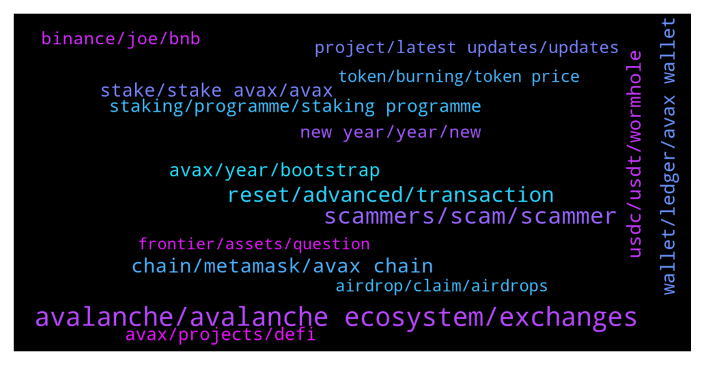

# **@avalancheavax**
 ## Analysis for **2022-01-02** - **2022-01-09**.

---

## 📊 **Basic Stats**

**n_messages_sent**: 1363

---

---

## 🔝 **Top keywords and related messages**

1. **avalanche, avalanche ecosystem, exchanges**

    @Rocco --- *Hi Guys Is there an legit Defi 2.0 project on the avalanche chain?* **--->** [TG Discussion](https://t.me/avalancheavax/318388)

    @clairewilsonxz --- *Avalanche tends to hit a static pump soon that hold more and thank me later* **--->** [TG Discussion](https://t.me/avalancheavax/318357)

    @Nicolas_A --- *They integrated Avalanche. Why not ? ^^* **--->** [TG Discussion](https://t.me/avalancheavax/319633)

    @Nicolas_A --- *List of projects ? Everyone is pretty much working on Avalanche related stuff* **--->** [TG Discussion](https://t.me/avalancheavax/318189)

    @Or4ngeknot --- *Hi, I want to check where/who I should go to for enquiries for PR partnerships for the upcoming Avalanche Spring summit in Barcelona? Have sent emails regarding it a few weeks ago through the official site but with no response. Thank you appreciate the help 🙂🙏* **--->** [TG Discussion](https://t.me/avalancheavax/319573)

    @oathtobarbatos --- *There are plenty of good tutorials in the Avalanche YouTube channel, take a look at it https://www.youtube.com/channel/UCScsLTtz5DCwJodZ8ht9KNA* **--->** [TG Discussion](https://t.me/avalancheavax/319552)

2. **scammers, scam, scammer**

    @Altenna --- *btw scammers these days are really crazy i asked 1 question and i have like 20 pm and 5+ ppl calling me* **--->** [TG Discussion](https://t.me/avalancheavax/319337)

    @sonicblend --- *Best to use the website / app support. Too many scammers around.* **--->** [TG Discussion](https://t.me/avalancheavax/321035)

    @Yoopez --- *don't worry, soon they will stop their shitty cashgrabs. I've found their real identities :). They will regret all their soft scam* **--->** [TG Discussion](https://t.me/avalancheavax/318632)

    @sanse_sebastian --- *I did it on purpose, trying to attract scammers to bam them from groups where I'm admin* **--->** [TG Discussion](https://t.me/avalancheavax/319194)

    @BigRed --- *Is there usually this much scam and spam in this group?* **--->** [TG Discussion](https://t.me/avalancheavax/321108)

    @alrko616 --- *be aware frrom scammers. this is official https://wallet.avax.network/* **--->** [TG Discussion](https://t.me/avalancheavax/319464)

3. **reset, advanced, transaction**

    @Olayinka --- *Are you able to sort out the issue because I’m experiencing the same issue here as a newbie* **--->** [TG Discussion](https://t.me/avalancheavax/318994)

    @oathtobarbatos --- *That is weird, mine works fine.* **--->** [TG Discussion](https://t.me/avalancheavax/319100)

    @BinanceApe --- *Actually it’s each time, can occur multiple times as long as your transfer qualifies* **--->** [TG Discussion](https://t.me/avalancheavax/319416)

    @oathtobarbatos --- *You could try resetting your Metamask account (it won't change your balance)* **--->** [TG Discussion](https://t.me/avalancheavax/318445)

    @oathtobarbatos --- *It didn't work? I told you it was 21000, 25, 25* **--->** [TG Discussion](https://t.me/avalancheavax/318497)

    @Fibbow --- *maybe you sent it over the bridge and it's a wrapped coin you need to add to your wallet to see it? the avalanche scanner should be able to show you the transaction details* **--->** [TG Discussion](https://t.me/avalancheavax/319534)

4. **chain, metamask, avax chain**

    @Tigergold --- *I have always sent AVAX purchased on a CEX to the x chain wallet and then transfeered to C chain before sending to Metamsk to buy defi assets. Can I send direct to Metamask Avalanche address from my CEX?* **--->** [TG Discussion](https://t.me/avalancheavax/319231)

    @sk_hodl --- *Hi… I exported avax from c-chain address to x-chain address. But after exported from c-chain, I rejected the transaction before importing to x-chain.   Now avax is not available in any chain…can anybody help????   👆🏽👆🏽👆🏽👆🏽* **--->** [TG Discussion](https://t.me/avalancheavax/320325)

    @FutureTiger --- *Hullo chaps, when withdrawing AVAX from gateIO, I am offered 2 Chains, AVAX chain and AVAX C-Chain. The fee for AVAX chain is small but AVAX C-Chain is very expensive. Is it safe to send AVAX from Gate to Metamask using AVAX Chain? If it is not safe, perhaps I should buy TIME on gateIO itself, and then send TIME to MM using AVAX C-Chain. For some mysterious reason the fee is small when withdrawing TIME from Gate using AVAX C-Chain !* **--->** [TG Discussion](https://t.me/avalancheavax/318702)

    @FutureTiger --- *I was just about to send some JOE from my gateIO, or some AVAX from my Binance, to my Metamask, in order to convert into AVAX/MEMO/TIME on Wonderland, but then I noticed that on app . wonderland . money I cannot connect to Metamask , nor to wallet . avax . network , so this is all starting to look dreadfully complicated .. any SIMPLE way to get started on Wonderland?* **--->** [TG Discussion](https://t.me/avalancheavax/318465)

    @daboia1 --- *Hello, I accidentally sent some usdc.e from my metamask wallet to my AVAX c-chain Kucoin wallet  Is there any way to get it back?  Any help would be appreciated (and scammers DO NOT dm me, asking for my seed phrase, or to connect my wallet)* **--->** [TG Discussion](https://t.me/avalancheavax/321028)

    @proletarij --- *Hello, I would like to withdraw AVAX from Bitrue. should I use the X-chain or C-chain address? Does anyone have experience there? Thanks.* **--->** [TG Discussion](https://t.me/avalancheavax/317922)

5. **usdc, usdt, wormhole**

    @gmoney202 --- *does anyone know where to swap dai.e to usdt.e without crazy slippage* **--->** [TG Discussion](https://t.me/avalancheavax/319247)

    @Andwolfski --- *Can someone enlighten me on usdc and usdc.e* **--->** [TG Discussion](https://t.me/avalancheavax/317796)

    @TheSEOdude --- *Many - AUSD ,usdt.e, USDC.e , dai.e, mim* **--->** [TG Discussion](https://t.me/avalancheavax/317936)

    @manilabear --- *My usdc Its not showing up on trader joe if I click usdc or usdc.e but Its showing up on snowtrace as usd coin (wormhole)* **--->** [TG Discussion](https://t.me/avalancheavax/317697)

    @TheeSupportBot --- *Who got usdt or eth for swapping dm me with the token you want* **--->** [TG Discussion](https://t.me/avalancheavax/319082)

    @TheSEOdude --- *even real USDT isn't that safe , haha* **--->** [TG Discussion](https://t.me/avalancheavax/317956)

6. **wallet, ledger, avax wallet**

    @TheRealForever --- *Not complaining, but I connected my ledger with wallet.avax and I have 0.1 AVAX. No idea where it's from and there is no history of transfer. It's on C chain within the wallet.* **--->** [TG Discussion](https://t.me/avalancheavax/319373)

    @ihatetomatoesman --- *which hardware wallet fully supports AVAX? only ledger?😔* **--->** [TG Discussion](https://t.me/avalancheavax/317784)

    @CryptoBotje --- *Your ledger has a passphrase. Someone could have the same.* **--->** [TG Discussion](https://t.me/avalancheavax/319387)

    @Pytor07 --- *We have special wallet for the stacking Avax?* **--->** [TG Discussion](https://t.me/avalancheavax/317990)

    @HellenicAng3 --- *Can you have more than one AVAX wallet on your ledger?* **--->** [TG Discussion](https://t.me/avalancheavax/319396)

    @HellenicAng3 --- *multiple addresses means multiple wallets on say your wallet.avax?* **--->** [TG Discussion](https://t.me/avalancheavax/319398)

7. **avax, year, bootstrap**

    @Morei --- *when will AVAX MOOOOOONNNNN ? WHY THE PRICE IS SO BAD* **--->** [TG Discussion](https://t.me/avalancheavax/320986)

    @hossein_barati_93 --- *Thank you very much But I mean good news for avax* **--->** [TG Discussion](https://t.me/avalancheavax/318429)

    @elizabeth_baker --- *I'm holding Avax long term. Sorry I don't feel your pain ☺* **--->** [TG Discussion](https://t.me/avalancheavax/317736)

    @Bebeumaf --- *2022 Starts in Red: AVAX is the Only Top 20 in Green https://cryptonews.net/2963339/?utm_source=CryptoNews&utm_medium=app&utm_campaign=shared* **--->** [TG Discussion](https://t.me/avalancheavax/318998)

    @Desmond --- *Avax is back on its run let’s go* **--->** [TG Discussion](https://t.me/avalancheavax/319089)

    @Hele_beger --- *Avax will take Europe by storm* **--->** [TG Discussion](https://t.me/avalancheavax/320348)

8. **stake, stake avax, avax**

    @Chef --- *Is avax possible to stake and if so on wich platform* **--->** [TG Discussion](https://t.me/avalancheavax/318217)

    @Pieruccinii --- *Hi Guys, which is the best platform to farming or staking AVAX? Thanks in advance* **--->** [TG Discussion](https://t.me/avalancheavax/318100)

    @imissyousomuch1 --- *How can I stake my avax* **--->** [TG Discussion](https://t.me/avalancheavax/318103)

    @ramadhan_tiba --- *Not farm, but stake singlr side , just avax* **--->** [TG Discussion](https://t.me/avalancheavax/320360)

    @AOT 🍉 🍉 --- *Best places to stake avax ?* **--->** [TG Discussion](https://t.me/avalancheavax/321136)

    @ihatetomatoesman --- *where do you guys stake AVAX?* **--->** [TG Discussion](https://t.me/avalancheavax/318554)

9. **staking, programme, staking programme**

    @Toby --- *Guys please tell me more about staking* **--->** [TG Discussion](https://t.me/avalancheavax/317997)

    @Nikki7363 --- *Anybody knows if i redeemed my staking  before maturity date on binance so should I get holding period days interest* **--->** [TG Discussion](https://t.me/avalancheavax/317742)

    @lackmanac --- *Staking programme is very important for any project,?? Can i stake your token,? Do you have any plan of starting staking programme,??* **--->** [TG Discussion](https://t.me/avalancheavax/320058)

    @alrko616 --- *Is there other way of earning apr other than staking* **--->** [TG Discussion](https://t.me/avalancheavax/320893)

    @Martin --- *Hey guys, I got a question regarding staking on P chain:   When I want to delegate and look at the list of validators, the fees change considerably. From about 5% up to 20%. Why is there such a variation, and how do validators choose what fee they will take? And why would anybody stake with anyone who has a 20% if there is plenty of choices for say 5-10% fee?   Yeah, i know, it was more questions than one, but I'd really like to know the mechanics of it...  Thanks in advance for any advice.* **--->** [TG Discussion](https://t.me/avalancheavax/320334)

    @TheYoutubeur --- *Once everybody hops in, you would've doubled your bag by staking.* **--->** [TG Discussion](https://t.me/avalancheavax/320616)

10. **avax, projects, defi**

    @M0ckey --- *Does anyone know of any promising project on the Avax network, focused on P2earn and Nft? I think this segment will be very atractive to different blockchains from now on, just see harmony network pumping after the succesful of p2earn project "Defi Kingdoms".* **--->** [TG Discussion](https://t.me/avalancheavax/320186)

    @jackdboo --- *Anyone here a solidity dev looking for some extra work ? Some projects I know are looking to expand on avax* **--->** [TG Discussion](https://t.me/avalancheavax/319596)

    @pacificnorriswest --- *What new projects to avax we diggin?* **--->** [TG Discussion](https://t.me/avalancheavax/320704)

    @BjornSeal --- *Any new promising project on Avax ?* **--->** [TG Discussion](https://t.me/avalancheavax/320873)

    @Michapraize --- *"Can you show me some groups for finding new upcoming avax projects?"* **--->** [TG Discussion](https://t.me/avalancheavax/319052)

    @daleetguy --- *Hi. Any recommendation on avax defi project i should look at ?* **--->** [TG Discussion](https://t.me/avalancheavax/319898)

11. **new year, year, new**

    @oathtobarbatos --- *Don't worry, it's okay. You're welcome! 👌🏻* **--->** [TG Discussion](https://t.me/avalancheavax/319266)

    @sophia720 --- *You are a great detective, lol🤣* **--->** [TG Discussion](https://t.me/avalancheavax/318089)

    @hossein_barati_93 --- *Don't we have any good news for new year gift?!* **--->** [TG Discussion](https://t.me/avalancheavax/318427)

    @Desk --- *How you’ll be in her heart* **--->** [TG Discussion](https://t.me/avalancheavax/318125)

    @Nicolas_A --- *We are glad to have you :)* **--->** [TG Discussion](https://t.me/avalancheavax/319947)

    @hossein_barati_93 --- *thank you for your reply 🙏🙏🌷🌷* **--->** [TG Discussion](https://t.me/avalancheavax/319158)

12. **binance, joe, bnb**

    @w4zii --- *Hi.  Can anyone help.  I had some BNB in my avax c chain on metamask and sent it to binance but to  the erc20 network. I know a newbie mistake.  The transaction says completed, but obviously the BnB doesn't show up on binance.   Is there any way to recover the BnB?* **--->** [TG Discussion](https://t.me/avalancheavax/318990)

    @COMC3EX --- *That I did - it shows “success” the BNB were transferred but I do not have them in my Binance wallet* **--->** [TG Discussion](https://t.me/avalancheavax/319653)

    @COMC3EX --- *Help needed  Transferred on the avalanche network in my Metamask by accidentally BNB to my Binance account - they never arrived - looks they are lost* **--->** [TG Discussion](https://t.me/avalancheavax/319484)

    @COMC3EX --- *Now I know that - try to find where the BNBs are now to get them back - I made it by mistake on the avalanche network* **--->** [TG Discussion](https://t.me/avalancheavax/319680)

    @Nicolas_A --- *You can’t deposit BNB to Binance from the Avalanche network :/* **--->** [TG Discussion](https://t.me/avalancheavax/319671)

    @Nicolas_A --- *Not sure how it works with Binance. Ask their support* **--->** [TG Discussion](https://t.me/avalancheavax/317759)

13. **project, latest updates, updates**

    @NIm0671 --- *Could you tell us about Unifront SDK support?* **--->** [TG Discussion](https://t.me/avalancheavax/320033)

    @M0ckey --- *Good! I will study these projects, thank you* **--->** [TG Discussion](https://t.me/avalancheavax/320189)

    @rosietowns --- *What is your top 3 things for priorities in 2021? Could you share some plans for the upcoming year?* **--->** [TG Discussion](https://t.me/avalancheavax/320054)

    @AEmre_K --- *What is your 5-year medium-term vision? At the end of this period, where do you imagine @FrontierDotXYZ in the industry?* **--->** [TG Discussion](https://t.me/avalancheavax/320021)

    @JoselynMckinney88 --- *Your project name seems to be very interesting. Does it have any story behind it? Can you share us with the inspiron for approaching to this name?* **--->** [TG Discussion](https://t.me/avalancheavax/320024)

    @brittaney_whipple --- *What are the attractive features in your project? What is the vision and goals in your project that you want to achieve in 2021 and beyond?* **--->** [TG Discussion](https://t.me/avalancheavax/320026)

14. **airdrop, claim, airdrops**

    @bbbernas --- *Is there a public list of the wallets that are eligible actually? This airdrop should happen in about 3-5 months right?* **--->** [TG Discussion](https://t.me/avalancheavax/318683)

    @gastal_r --- *An airdrop is coming for the release* **--->** [TG Discussion](https://t.me/avalancheavax/320707)

    @OsmarFaria --- *I'm waiting for the projects....  the airdrops are fine...* **--->** [TG Discussion](https://t.me/avalancheavax/319012)

    @dougsmith7 --- *Hello, does anyone know where we can find avalanche airdrops* **--->** [TG Discussion](https://t.me/avalancheavax/320632)

    @bbbernas --- *Hi, any news on when this airdrop is happening?* **--->** [TG Discussion](https://t.me/avalancheavax/318682)

    @popson1m --- *Is there anywhere to get airdrop?* **--->** [TG Discussion](https://t.me/avalancheavax/320313)

15. **token, burning, token price**

    @Platemha --- *Is there any way to add a preset trusted list of tokens that can be added to metamask directly* **--->** [TG Discussion](https://t.me/avalancheavax/320829)

    @leMeek86 --- *Do you have a Token Burning plan to increase Token value and attract Investors to invest?* **--->** [TG Discussion](https://t.me/avalancheavax/320088)

    @enavides43 --- *Do you have a Token Burning plan to increase Token value and attract Investors to invest?* **--->** [TG Discussion](https://t.me/avalancheavax/320042)

    @sRineharta --- *Do you have a Token Burning plan to increase Token value and attract Investors to invest?* **--->** [TG Discussion](https://t.me/avalancheavax/320132)

    @rena_mccau --- *Do you have a Token Burning plan to increase Token value and attract Investors to invest?* **--->** [TG Discussion](https://t.me/avalancheavax/320049)

    @alie_valadez1992 --- *Do you have a Token Burning plan to increase Token value and attract Investors to invest?* **--->** [TG Discussion](https://t.me/avalancheavax/320076)

