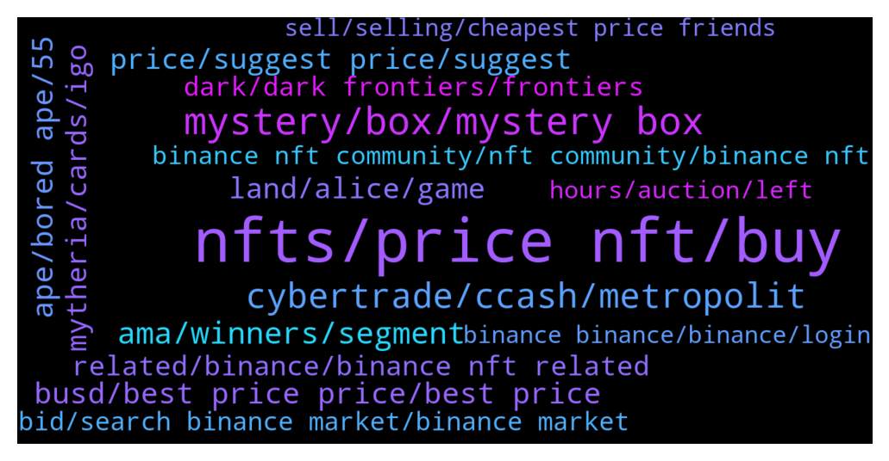

# **@binancenfts**
 ## Analysis for **2022-01-02** - **2022-01-09**.

---

## 📊 **Basic Stats**

**n_messages_sent**: 2654

---

---

## 🔝 **Top keywords and related messages**

1. **nfts, price nft, buy**

    @ebeneshc --- *Low price nft don't miss it my dear friends* **--->** [TG Discussion](https://t.me/binancenfts/423202)

    @DeeSingh0000 --- *Mate I’m not doing it on purpose… I have something called APENFT in my wallet, that’s why I’m asking about it in this group. This group is called NFT, and I’m talking about APENFT  I was trying to find out what it was, maybe an airdropped NFT. But I still don’t know it is and your no help. The community has been trying to help me by answering my questions. But clearly you won’t, your just giving me warnings.   Maybe be more helpful* **--->** [TG Discussion](https://t.me/binancenfts/422010)

    @Je_sus0786 --- *Can this pic be a nft?* **--->** [TG Discussion](https://t.me/binancenfts/422379)

    @Pixelman12 --- *Hello friends, I have a thousand dollars and I want to buy nft. Does anyone have nft?* **--->** [TG Discussion](https://t.me/binancenfts/426238)

    @sophianyc --- *Who needs this unique NFT at $999? DM me for link* **--->** [TG Discussion](https://t.me/binancenfts/424160)

    @KOEMAN32 --- *Do you think its easier mobile or via pc to buy nft igos? I want to buy the card game tomorrow* **--->** [TG Discussion](https://t.me/binancenfts/425304)

2. **mystery, box, mystery box**

    @chicosci19 --- *whats inside that cryptmas mystery box* **--->** [TG Discussion](https://t.me/binancenfts/417880)

    @c_hinmay --- *Even Merry Cryptmas mystery boxes were sold within a second* **--->** [TG Discussion](https://t.me/binancenfts/418409)

    @Fuckingfigter --- *I see that Mystery Box will be available on TheBinanceNFT soon. Can you tell me how to participate in this great event? What are the requirements to participate and will each Mystery box contain super rare NFTs?#CyberTrade* **--->** [TG Discussion](https://t.me/binancenfts/420971)

    @semeerkv --- *Did you want open you can. if you open that mystery box you can get  normal, or Rare or SR or SSR , Any one . After that you list your open mystery box nfts* **--->** [TG Discussion](https://t.me/binancenfts/423817)

    @irfanecruz --- *just type apoki on the search tab and then click Mystery boxes* **--->** [TG Discussion](https://t.me/binancenfts/424691)

    @DeeSingh0000 --- *That’s still awesome for an R… I wish I had some of these mystery boxes for raca* **--->** [TG Discussion](https://t.me/binancenfts/420145)

3. **cybertrade, ccash, metropolit**

    @Vishaljain2 --- *How does Your RPG Game  Positioned to Capitalise the Cyberpunk Style MMO in Real world ?  #Cybertrade* **--->** [TG Discussion](https://t.me/binancenfts/420950)

    @ikaFelicia02 --- *There's many mafia metaverse games hyping in this moment. What's different between CyberTrade and the others? And some people don't like the similarity between Cyber Trade and Cyberpunk 2077 because they say Cyber Trade stole the concept. How's your opinion about them? #CyberTrade* **--->** [TG Discussion](https://t.me/binancenfts/420990)

    @Dinc3 --- *Hi! @DavoQORPOcmo @QORPOBOSS  Cyber Trade is a great game with awesome NFTs in and that’s why I think you will get many crypto audience very soon. However, there are also Non-Crypto Gamers and they may also like Cyber Trade a lot. So, please tell us about your plans of getting the attention of Non Crypto Gamers. How will you attract them?   #CyberTrade* **--->** [TG Discussion](https://t.me/binancenfts/420953)

    @semeerkv --- *Gaming sector is extremely competitive & many platforms had to work very hard to reach their current user numbers. How will the CyberTrade Game team compete with the existing gaming platforms & what extra features will $CCASH offer to attract the gamers from the other platforms? #CyberTrade  @QORPOBOSS @DavoQORPOcmo* **--->** [TG Discussion](https://t.me/binancenfts/420954)

    @QORPOBOSS --- *Open world with high details and action packed gameplay where players will get the chance to earn by playing and building a social live into METROPOLIT. After progressing further in the game the player should start to feel more powerful. This will create the feeling of becoming a hero from zero . Lets join us* **--->** [TG Discussion](https://t.me/binancenfts/421069)

    @Ivan11338 --- *Really interested in game lore📖, will there be some kind of single-player gameplay or your main focus right now is PvP aspect? #CyberTrade* **--->** [TG Discussion](https://t.me/binancenfts/420928)

4. **ama, winners, segment**

    @captainbnb --- *Congratulations  AMA winners  Please DM me within 24 hours for submit your details    NFT KING AMA  @cocoteaaa  @c_hinmay  @rupokcat1  DarkFrontiers  AMA winners  @aleBiT27  @Black4_L* **--->** [TG Discussion](https://t.me/binancenfts/420750)

    @captainbnb --- *Congratulations Mytheria AMA winners  Please Dm me within 24 hours for submit your info.   @Sonersonerx @cocoteaaa @irfanecruz* **--->** [TG Discussion](https://t.me/binancenfts/427022)

    @aleBiT27 --- *@captainbnb Hi bro... News on today's AMA? @lucy2597 & me winner's today.* **--->** [TG Discussion](https://t.me/binancenfts/420260)

    @captainbnb --- *Congratulations CryptoTrade AMA winners   Please DM me within 24 hours for submit your details  @Vishaljain2   @j_hope123  (warning :-  activity suspicious ) @Ivan11338     @semeerkv   @ikaFelicia02* **--->** [TG Discussion](https://t.me/binancenfts/421248)

    @futureIIengineer --- *This campaign winners?  @Dean_Khan @ChibiMaya_bnb @Sahib_BNB @Ribka7* **--->** [TG Discussion](https://t.me/binancenfts/423101)

    @Kenikky --- *Hello Binancians! 🥳   Welcome to a new @Binancenfts #AMA series session (Ask me Anything). Today we give a warm welcome to CyberTrade team  📌 AMA will have three simple segments:   1️⃣  SEGMENT 1: Introduction and interview with CryberTrade team. The host will be asking them a few questions about their project.   2️⃣ SEGMENT 2: Live Q&A AMA with the community. There will be 🎁 GIVEAWAY 🎁 to selected winners who post a question that is answered by the CyberTrade team 🥳* **--->** [TG Discussion](https://t.me/binancenfts/420857)

5. **ape, bored ape, 55**

    @ICE2005 --- *there are other bored ape who sell for 30 eth* **--->** [TG Discussion](https://t.me/binancenfts/427264)

    @Seller767 --- *I wanna invest in monkey , give me advice what will be best before 300$* **--->** [TG Discussion](https://t.me/binancenfts/424374)

    @majorka124 --- *this is the number of this monkey* **--->** [TG Discussion](https://t.me/binancenfts/422985)

    @Seller769 --- *BORED APE #10110▵36╳55 Your chance to buy )* **--->** [TG Discussion](https://t.me/binancenfts/427778)

    @JustinLKW --- *Nice project, I have already bought 2 ape!* **--->** [TG Discussion](https://t.me/binancenfts/422225)

    @Seller767 --- *U think I can buy this ? My max for Ape 400$* **--->** [TG Discussion](https://t.me/binancenfts/424376)

6. **busd, best price price, best price**

    @Vishaljain2 --- *You selling it for 1 Busd ?* **--->** [TG Discussion](https://t.me/binancenfts/416554)

    @HenryKorsunskiy --- *60 busd dm me who want to buy* **--->** [TG Discussion](https://t.me/binancenfts/416547)

    @Mamolaez15 --- *(☞ ಠ_ಠ)☞ 10 busd . DM if you want to buy it* **--->** [TG Discussion](https://t.me/binancenfts/416607)

    @trustintolga --- *Can i sell this for 30-40busd in a month?* **--->** [TG Discussion](https://t.me/binancenfts/417100)

    @TerBand --- *Selling Lucky Doge #289 for 143 BUSD only. Needed to liquidate some assets. :)* **--->** [TG Discussion](https://t.me/binancenfts/423086)

    @tokelyemre --- *min 175 busd in market gooo and buy very cheap* **--->** [TG Discussion](https://t.me/binancenfts/416722)

7. **land, alice, game**

    @anastasiaplane --- *Hi. Mysterious Seed is a companion game accessible from any browser. Alice’s Mysterious Seed includes three fun and intuitive mini-games where you’ll need to water the plant, play sweet tunes to it and fertilize it in order for it to grow and prosper. You will be able to plant your seed and tend to it. If you look after it, it will yield a fruit. This fruit will be valuable in My Neighbor Alice when the game is released.   Important to say that the seeds available to purchase only during limited Alice’s shop opening that we do only 3-4 times a year. Other than that you can obtain seed from Mystery Box, such as the one we will be selling during the next Winter Holiday with Alice NFT sale on Binance https://bit.ly/31xzGqK* **--->** [TG Discussion](https://t.me/binancenfts/426830)

    @QORPOBOSS --- *The economy is mainly driven by land purchases, buildings, and players trading the game assets with each other. There is a marketplace where anyone can create listings of their assets. For creating a listing you have to pay a fee and also pay tax for trading.  Players can make money by progressing in the game, completing side quests, joining various events, fighting in PVP, and mainly out of their own in-game businesses.  Every player that wants to spend some time on your land has to pay you a tax for doing activities on your property.  The owner of the property chooses how high are the taxes for staying on his land and using his services. This all and many more utilities are important for a token growth* **--->** [TG Discussion](https://t.me/binancenfts/421010)

    @Ivar_Boneless3 --- *Do we need to buy land in the Alice game and for what reasons we need to acquire it?* **--->** [TG Discussion](https://t.me/binancenfts/426800)

    @weichong64 --- *@anastasiaplane You did mentioned Mysterious Seed just now, can you explain more about it? Izit a play to earn game? Or just a mini game? And is the app available in IOS and Android?* **--->** [TG Discussion](https://t.me/binancenfts/426774)

    @Oksure88 --- *Whitepaper indicates that the covid-19 and ensuing success of video games publishers have commercially inspired the development of My Neighbor Alice game. How relevant are these trends today?* **--->** [TG Discussion](https://t.me/binancenfts/426764)

    @anastasiaplane --- *Thank you for your great questions. 🤗 Here are some links for all of you who doesn’t know about Alice to check out 🙂  Website: https://www.myneighboralice.com  Mysterious Seed companion game: https://seed.myneighboralice.com. Metaverse Grant Program: https://grant.chromia.com  Telegram: https://t.me/MyNeighborAlice Telegram Announcement: https://t.me/AliceAnnouncements Twitter: https://twitter.com/MyNeighborAlice Linkedin: https://www.linkedin.com/company/my-neighbor-alice/* **--->** [TG Discussion](https://t.me/binancenfts/426678)

8. **price, suggest price, suggest**

    @DeViLLeGND --- *Can anyone buy this u can say ur price anyone suggest the price* **--->** [TG Discussion](https://t.me/binancenfts/416450)

    @Forta0i --- *Can u tell price of this* **--->** [TG Discussion](https://t.me/binancenfts/417984)

    @dohbs --- *100$ i think is a good price* **--->** [TG Discussion](https://t.me/binancenfts/420192)

    @c_hinmay --- *Yes some are selling higher than that... but didn't see anyone buying at that price yet* **--->** [TG Discussion](https://t.me/binancenfts/421112)

    @Forta0i --- *How much can i get for this?* **--->** [TG Discussion](https://t.me/binancenfts/425558)

    @Jad --- *The real price is 10000 and in the Markt the latest price is 7750 go sleep* **--->** [TG Discussion](https://t.me/binancenfts/421215)

9. **mytheria, cards, igo**

    @ahsiT03 --- *I understand that both aesthetics and the concept behind Mytheria is simply phenomenal! Have you considered an ambassador program to help spread the amazing game features of Mytheria around the world? Do you have a referral programme that we can help bring more new users? #Mytheria* **--->** [TG Discussion](https://t.me/binancenfts/424954)

    @keiinhangia --- *Long story short, we want to develop Mytheria into the best digital Trading Card Game in the world, with ultimate fun for all participants, including players and creators.   Check out our trailers:  https://www.youtube.com/watch?v=vd5C-C9tp7E* **--->** [TG Discussion](https://t.me/binancenfts/424852)

    @keiinhangia --- *Mytheria aims to build an ecosystem, in which creators and players can earn from their contribution to developing the game. For example, by creating artworks or composing music, creators get rewarded. On the other hand, players can decided which characters or lores to put into the game. A game by community for community. So the answer to your question is yes, this program is under development, so stay tuned with us. PVP players will surely be available. You can play 2v2 modes or battle royale with 8 other players. In the future, cross platforms will also be available between PC and mobile 👍🏻* **--->** [TG Discussion](https://t.me/binancenfts/424965)

    @Zoii_Khan --- *What role does the community play in the #Mytheria? What have you done and will do to attract people to join #Mytheria and build a thriving community? What was the team's inspiration for designing these characters & Is there any interesting story behind these characters?#Mytheria* **--->** [TG Discussion](https://t.me/binancenfts/424907)

    @keiinhangia --- *IGO on Binance is an important stepping stone and the best choice for the project at this moment because Binance's high standards have shown that they are a serious supporter, and it also means Mytheria has achieved a certain guarantee level. It is an affirmation and support for the development process of the project!* **--->** [TG Discussion](https://t.me/binancenfts/424811)

    @keiinhangia --- *Step 3: Scroll down and find Mytheria IGO event* **--->** [TG Discussion](https://t.me/binancenfts/424840)

10. **related, binance, binance nft related**

    @faruktuna --- *They’re preparing a seperate collection for Binance NFTs. This a cross chain nft project. Instead of a screenshot, this is the trailer of the video.* **--->** [TG Discussion](https://t.me/binancenfts/427885)

    @semeerkv --- *Post here BINANCE nft’S and related only* **--->** [TG Discussion](https://t.me/binancenfts/421683)

    @ThomasLFW --- *Dont forget this campaign, there are many free NFT from Binance NFT* **--->** [TG Discussion](https://t.me/binancenfts/422197)

    @semeerkv --- */report share here BINANCE nft’S and related only . @Sahib_BNB @Dean_khan* **--->** [TG Discussion](https://t.me/binancenfts/418220)

    @faruktuna --- *Why? This a cross chain nft and it will start on Binance too.* **--->** [TG Discussion](https://t.me/binancenfts/427883)

    @chibiguardians --- *not really, many persons I dont know have bought my NFTs on Binance, so happy for that.* **--->** [TG Discussion](https://t.me/binancenfts/425355)

11. **dark, dark frontiers, frontiers**

    @laibuzz --- *Can you introduce Dark Frontiers's investment platform and ecosystem partners? What benefits does this cooperation bring to users? What is the investment basis of this project? #DarkFrontiers* **--->** [TG Discussion](https://t.me/binancenfts/419901)

    @cocoteaaa --- *You've mentioned that Dark Frontiers decided to position like Netflix, how does your project compare to it? Will it also provide a high quality content to every users? #DarkFrontiers* **--->** [TG Discussion](https://t.me/binancenfts/419907)

    @onguvercin --- *Any set up partnerships on Metaverse via Dark Frontier GS? What will be your brand engagement strategy at all? #DarkFrontiers* **--->** [TG Discussion](https://t.me/binancenfts/419881)

    @anhpb --- *Revenue is a key factor for every project to survive and develop. How does Dark Frontiers generate profits and revenue? How was that business model built and working? #DarkFrontiers* **--->** [TG Discussion](https://t.me/binancenfts/419923)

    @SkyKnightMoon --- *Which one of these aspects is important for you?  1 - Empowering Platform Development  2 - Building Community Trust  3 - Expanding Partnership Globally In what order  #DarkFriontiers* **--->** [TG Discussion](https://t.me/binancenfts/419890)

    @Leeminhooz --- *Can you list the attractive features of Dark Frontiers does your project outperform the competition? Does your platform have a unique competitive advantage? In the future, does the project have any other options? #DarkFrontiers* **--->** [TG Discussion](https://t.me/binancenfts/419894)

12. **bid, search binance market, binance market**

    @semeerkv --- *Bid Started Lowest price Search on BINANCE market 👇  BORED APE #10076▵22* **--->** [TG Discussion](https://t.me/binancenfts/420693)

    @semeerkv --- *Current Bid 0.26 BNB . Rare Ape Pace your Bid . Search on Market 👇  Badass Ape #307  ( 5 hours Left End Auctions)* **--->** [TG Discussion](https://t.me/binancenfts/422205)

    @semeerkv --- *Bid Started Cheapest price Search on BINANCE market 👇  Badass Ape #307* **--->** [TG Discussion](https://t.me/binancenfts/420016)

    @semeerkv --- *Start Your Bid Lowest Price Search on BINANCE market 👇  BORED APE #10076▵22* **--->** [TG Discussion](https://t.me/binancenfts/418149)

    @semeerkv --- *Current Bid 44$ Cheapest on market  Search on Binance Market 👇  BORED APE #10076▵22* **--->** [TG Discussion](https://t.me/binancenfts/419483)

    @semeerkv --- *If you want Place your bid cheapest  Search on BINANCE market 👇  Badass Ape #307* **--->** [TG Discussion](https://t.me/binancenfts/418463)

13. **binance nft community, nft community, binance nft**

    @ThomasLFW --- *Actually if people follow us then we regularly organize programs with certain rewards. We very often organize GA campaign and also want to give more and more rewards to the community in near future.   Currently, we do have a 10 NFT to give away to Binance NFT community. The tasks are very simple, just join local community and be active in the group to receive the rewards.    Chance to get free NFT (0.4 BNB per NFT) from LFWxBinance NFT.  This program is only open to Binance NFT community around the world.  📆Time: From now until 19:00 UTC on 2/1/2022  Join now, what are you waiting for?  Step 1: Like, comment and share the post https://twitter.com/Legend_LFW/status/1476425879706550272  Step 2: Join the project's local group, will forward the links here:   Step 3: Share the project with other communities  Step 4: Fill in the following form: https://forms.gle/La3JLCF4tGjhadrM9* **--->** [TG Discussion](https://t.me/binancenfts/421768)

    @Kenikky --- *2022 is going to be huge on Binance NFT, each day the marketplace gets better and better, this Subscription Mechanism is another huge step that we look forward to sharing with you all 😄* **--->** [TG Discussion](https://t.me/binancenfts/424758)

    @Kenikky --- *we will now take a few questions from the Binance NFT community* **--->** [TG Discussion](https://t.me/binancenfts/419861)

    @Kenikky --- *So we will now take some questions from our lovely Binance NFT community* **--->** [TG Discussion](https://t.me/binancenfts/420906)

    @DavoQORPOcmo --- *Thank you Binance NFT community for great AMA and great questions! ⚡️* **--->** [TG Discussion](https://t.me/binancenfts/421021)

    @Motlaq --- *I feel with binance  support the NFT world soon will be all the people joining* **--->** [TG Discussion](https://t.me/binancenfts/424760)

14. **hours, auction, left**

    @semeerkv --- *if one bid is done you cant cancel* **--->** [TG Discussion](https://t.me/binancenfts/417685)

    @Cahbl441 --- *The auction will end in a few hours!🔥* **--->** [TG Discussion](https://t.me/binancenfts/423592)

    @Ramuk_Arvind --- *Bidding open and ends in 5days...✌️✌️✌️✌️* **--->** [TG Discussion](https://t.me/binancenfts/424486)

    @semeerkv --- *Wait for 2 days untill auction will ended* **--->** [TG Discussion](https://t.me/binancenfts/416975)

    @EkoZelen --- *Ending in 24 hours place your bids* **--->** [TG Discussion](https://t.me/binancenfts/425636)

    @aleBiT27 --- *Last hours to end auction ✅* **--->** [TG Discussion](https://t.me/binancenfts/425755)

15. **sell, selling, cheapest price friends**

    @HudaMohammed1 --- *Guys We are not allowed to sell anything here as mentioned* **--->** [TG Discussion](https://t.me/binancenfts/418679)

    @Ashu85955 --- *I want to sell this tell me  what i do next* **--->** [TG Discussion](https://t.me/binancenfts/416972)

    @netsanju --- *I want to sell any one want pm me* **--->** [TG Discussion](https://t.me/binancenfts/416948)

    @baflac --- *I'll sell this. Anyone want or want to make offer ? I'm waiting for* **--->** [TG Discussion](https://t.me/binancenfts/418648)

    @Koshara1997 --- *I sell to whom it is necessary ?* **--->** [TG Discussion](https://t.me/binancenfts/426511)

    @Gheter --- *Good morning everyone! Selling this cutie* **--->** [TG Discussion](https://t.me/binancenfts/427071)

