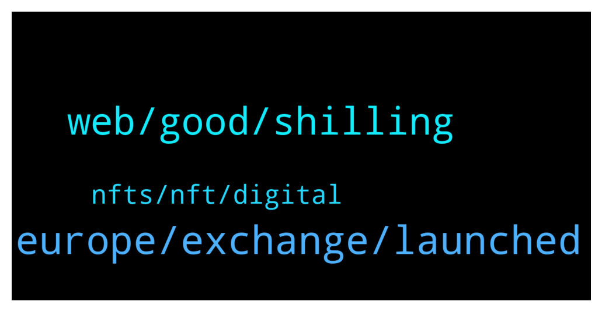

# **@de_fi**
 ## Analysis for **2022-01-02** - **2022-01-09**.

---

## 📊 **Basic Stats**

**n_messages_sent**: 108

---

---

## 🔝 **Top keywords and related messages**

1. **europe, exchange, launched**

    @mikael39 --- *I see. The easiest way to buy crypto in Europe is via Coinbase. It supports $YAY gaming platform* **--->** [TG Discussion](https://t.me/de_fi/232537)

    @mikael39 --- *Of course, Europe is one of the easiest places to buy cryptocurrency.* **--->** [TG Discussion](https://t.me/de_fi/232531)

    @SchneuwlyH --- *this is a legit crypto trading platform with tons and tons of reviews* **--->** [TG Discussion](https://t.me/de_fi/232803)

    @mikael39 --- *In fact, several of the countries in Europe like Portugal, Slovenia and Switzerland are extremely friendly to cryptocurrency* **--->** [TG Discussion](https://t.me/de_fi/232533)

    @mikael39 --- *Hope you will not run away from this. You should buy some Tether usd first for an exchange* **--->** [TG Discussion](https://t.me/de_fi/232539)

    @xnatasx --- *We discourage price speculation here. In it for the tech and freedom.* **--->** [TG Discussion](https://t.me/de_fi/232997)

2. **web, good, shilling**

    @AndryZ212 --- *Hey some advice, many projects seem to be having their own Defi these days.* **--->** [TG Discussion](https://t.me/de_fi/232855)

    @SchneuwlyH --- *A random market crush is not terrible to me. That's why I plan to lock my tokens* **--->** [TG Discussion](https://t.me/de_fi/232536)

    @SchneuwlyH --- *exactly,  the private sale of the AFINS token is starting soon!* **--->** [TG Discussion](https://t.me/de_fi/232809)

    @Charlesmason001 --- *I'm a professional graphics designer and a website developer. I make logos, gifs, poocoin ads, TG stickers, banner, Nfts, flyers.* **--->** [TG Discussion](https://t.me/de_fi/232851)

    @vavaeeu --- *Looking for some cool projects to invest and grow in 2022* **--->** [TG Discussion](https://t.me/de_fi/233592)

    @PeterDelfers --- *How do you find low market cap tokens? What influencer or channel should I follow?* **--->** [TG Discussion](https://t.me/de_fi/232499)

3. **nfts, nft, digital**

    @BoulevardLP --- *What'd you mean "Nfts"?...like you make NFT graphics?* **--->** [TG Discussion](https://t.me/de_fi/232860)

    @Alex --- *Has anyone heard of the crypto fantasy coin?* **--->** [TG Discussion](https://t.me/de_fi/233039)

    @Raja_MBZ --- *This is me - comment your address and you'll get a free NFT (probably on Polygon) and a POAP.* **--->** [TG Discussion](https://t.me/de_fi/232888)

    @BoulevardLP --- *...because against what most people think, NFTs are beyond the graphics, and are smart contracts based on the blockchain where their value is derived from...* **--->** [TG Discussion](https://t.me/de_fi/232862)

    @Charlesmason001 --- *Non-fungible tokens, or NFTs, are pieces of digital content linked to the blockchain, the digital database underpinning cryptocurrencies such as bitcoin and ethereum.* **--->** [TG Discussion](https://t.me/de_fi/232861)

    @BoulevardLP --- *My point's that making the NFT graphics is different from hashing and linking that to a smart contract blockchain.* **--->** [TG Discussion](https://t.me/de_fi/232863)

