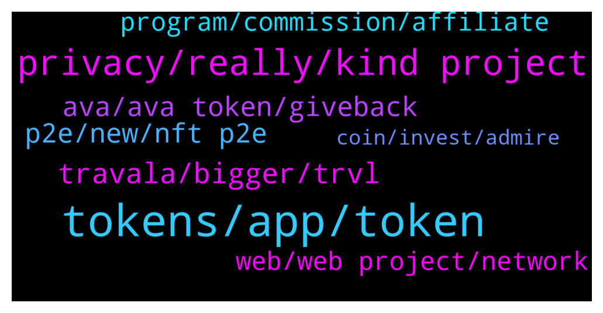

# **@defisearchpublic**
 ## Analysis for **2022-01-02** - **2022-01-09**.

---

## 📊 **Basic Stats**

**n_messages_sent**: 118

---

---

## 🔝 **Top keywords and related messages**

1. **tokens, app, token**

    @mikaztirf --- *you are eligible to vote on which crypto assets should be put on the app next* **--->** [TG Discussion](https://t.me/defisearchpublic/240927)

    @GioFlorin --- *what do you mean token rewards?* **--->** [TG Discussion](https://t.me/defisearchpublic/240913)

    @GioFlorin --- *may I know whats their token first?* **--->** [TG Discussion](https://t.me/defisearchpublic/240929)

    @danizsw --- *it is where you can create your tokens and have the latest news of tokens to be listed* **--->** [TG Discussion](https://t.me/defisearchpublic/240958)

    @mikaztirf --- *those tokens you earn can be stake to participate the governance in the future* **--->** [TG Discussion](https://t.me/defisearchpublic/240922)

    @drwn999 --- *Luna Surges as Token Becomes the ‘Latest Shiny Thing’ in Crypto  Meanwhile let's also check on $FOLO the @AlphaImpact_fi token listed on Uniswap   https://medium.com/alphaimpact/how-to-buy-folo-tokens-crypto-101-8a1605e69a18* **--->** [TG Discussion](https://t.me/defisearchpublic/240847)

2. **privacy, really, kind project**

    @danizsw --- *how does the project works I know its a blockchain lol* **--->** [TG Discussion](https://t.me/defisearchpublic/240973)

    @athaliah --- *it's the leading blockchain based travel booking platform* **--->** [TG Discussion](https://t.me/defisearchpublic/240754)

    @danizsw --- *what kind of project is this?* **--->** [TG Discussion](https://t.me/defisearchpublic/240968)

    @raver --- *blockchain ? where is it listed ?* **--->** [TG Discussion](https://t.me/defisearchpublic/240756)

    @dionieP --- *after governance whats the next option?* **--->** [TG Discussion](https://t.me/defisearchpublic/240923)

    @wenmis01 --- *Got a lot of AMA this January. Really have to find a good project.* **--->** [TG Discussion](https://t.me/defisearchpublic/240876)

3. **travala, bigger, trvl**

    @athaliah --- *you wouldn't be dissapointed on travala it's not just cheaper but also giving discounts and rewards.* **--->** [TG Discussion](https://t.me/defisearchpublic/240767)

    @raver --- *hey is Dtravel part of travala ?* **--->** [TG Discussion](https://t.me/defisearchpublic/240769)

    @raver --- *bilated merry Christmas Everyone ☺️ what do you guys think about travala ?* **--->** [TG Discussion](https://t.me/defisearchpublic/240750)

    @raver --- *alright .. i've been searching for a booking platform that's not expensive and i heard this travala ..* **--->** [TG Discussion](https://t.me/defisearchpublic/240766)

    @athaliah --- *if you want to trade sell or buy travala AVA you can exchange on Binance KuCoin or gate io* **--->** [TG Discussion](https://t.me/defisearchpublic/240757)

    @raver --- *how can i have discounts ?* **--->** [TG Discussion](https://t.me/defisearchpublic/240768)

4. **ava, ava token, giveback**

    @raver --- *ow it's still okay coz i can still have AVA even i don't purchase coz i will have giveback on AVA token.* **--->** [TG Discussion](https://t.me/defisearchpublic/240776)

    @athaliah --- *yeah but you can still have giveback on AVA token whatever payment method you make.* **--->** [TG Discussion](https://t.me/defisearchpublic/240774)

    @athaliah --- *AVA is a multi chain token based on Binance Chain, Binance Smart Chain and Ethereum blockchain.* **--->** [TG Discussion](https://t.me/defisearchpublic/240765)

    @dionieP --- *exactly 😂 everyone loves earning through game* **--->** [TG Discussion](https://t.me/defisearchpublic/240901)

    @raver --- *in invite program how many times can i get the $25 worth of AVA ?* **--->** [TG Discussion](https://t.me/defisearchpublic/240785)

    @athaliah --- *the invite program ☺️ if you invite someone and get registered and make an eligible booking both of you will get $25 worth of AVA . isn't cool ?* **--->** [TG Discussion](https://t.me/defisearchpublic/240779)

5. **p2e, new, nft p2e**

    @mykillandgelo --- *new game turn base p2e, ROI isn't that big but looks good since its freshly released* **--->** [TG Discussion](https://t.me/defisearchpublic/240963)

    @jwongjts --- *yup what p2e you're playing right now?* **--->** [TG Discussion](https://t.me/defisearchpublic/240902)

    @GioFlorin --- *what kind of p2e youre looking my friend?* **--->** [TG Discussion](https://t.me/defisearchpublic/240898)

    @mykillandgelo --- *what are you spotting right now?* **--->** [TG Discussion](https://t.me/defisearchpublic/240960)

    @purestofpure --- *new blockchain releasing its q1 in the next 3 months* **--->** [TG Discussion](https://t.me/defisearchpublic/240967)

    @mykillandgelo --- *any presale happening on that project right now?* **--->** [TG Discussion](https://t.me/defisearchpublic/240969)

6. **program, commission, affiliate**

    @raver --- *ow okay so in affiliate program i will also earn the 5% on their fisrt booking.* **--->** [TG Discussion](https://t.me/defisearchpublic/240787)

    @athaliah --- *just one time after they registered and make their first booking ..* **--->** [TG Discussion](https://t.me/defisearchpublic/240786)

    @athaliah --- *yeah but in affiliate program you will earn 5% commission on every booking that is made with your link ..* **--->** [TG Discussion](https://t.me/defisearchpublic/240784)

    @raver --- *alright that's the difference between the two .. how can i earn commission what do i need to do ?* **--->** [TG Discussion](https://t.me/defisearchpublic/240789)

    @athaliah --- *all you need is a social media acct. you don't need to be an influencer too you just need to make the people use your link to book flights or accommodation to earn the 5% commission ..* **--->** [TG Discussion](https://t.me/defisearchpublic/240790)

    @athaliah --- *no, in affiliate program it's lifetime ..* **--->** [TG Discussion](https://t.me/defisearchpublic/240788)

7. **web, web project, network**

    @purestofpure --- *Nakji Network, a blockchain big data focused startup has completed a capital raise of $8.8 million* **--->** [TG Discussion](https://t.me/defisearchpublic/240970)

    @purestofpure --- *you guys might want to check nakji network* **--->** [TG Discussion](https://t.me/defisearchpublic/240966)

    @danizsw --- *can you tell me the difference about 2.0 and 3.0?* **--->** [TG Discussion](https://t.me/defisearchpublic/240981)

    @mykillandgelo --- *great! I'll check this one since I am also looking for some new web 3.0 project* **--->** [TG Discussion](https://t.me/defisearchpublic/240988)

    @purestofpure --- *2.0 is the most common web like what we are using today* **--->** [TG Discussion](https://t.me/defisearchpublic/240982)

    @danizsw --- *so its another web 3.0 project* **--->** [TG Discussion](https://t.me/defisearchpublic/240980)

8. **coin, invest, admire**

    @mykillandgelo --- *new coin to invest guys suggest it now* **--->** [TG Discussion](https://t.me/defisearchpublic/240953)

    @danizsw --- *how much do I need to invest for that game?* **--->** [TG Discussion](https://t.me/defisearchpublic/240964)

    @Mylesctty --- *I admire the innovation, utility, potential, and enthusiasm put together to create the Stabila coin. Aping on early will be advantageous. Dyor on stabilastb* **--->** [TG Discussion](https://t.me/defisearchpublic/241018)

    @danizsw --- *stable coin and nft is what I am interested right now 😁* **--->** [TG Discussion](https://t.me/defisearchpublic/240961)

    @dionieP --- *anything bro as long as good profit* **--->** [TG Discussion](https://t.me/defisearchpublic/240904)

