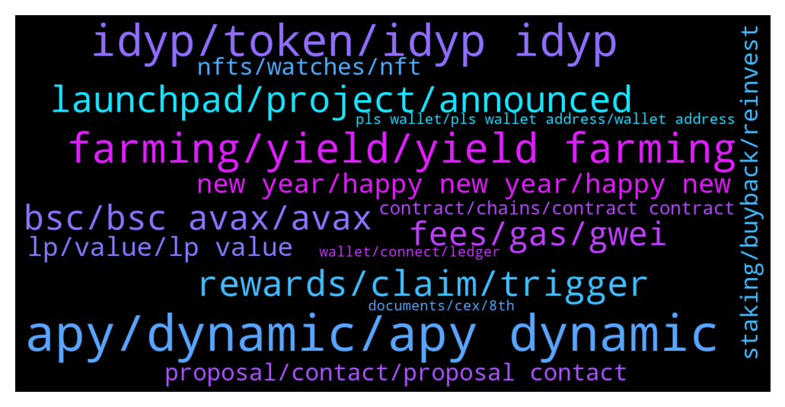

# **@dypfinance**
 ## Analysis for **2022-01-02** - **2022-01-09**.

---

## 📊 **Basic Stats**

**n_messages_sent**: 1387

---

---

## 🔝 **Top keywords and related messages**

1. **apy, dynamic, apy dynamic**

    @hemanrock --- *if iDYP, DYP, AVAX goes down, APY goes down. If iDYP, DYP, AVAX goes up, APY goes UP.* **--->** [TG Discussion](https://t.me/dypfinance/233693)

    @Vl_investor --- *Why does APY STAKE AVAX go down so much by itself?* **--->** [TG Discussion](https://t.me/dypfinance/234966)

    @hemanrock --- *%share, APY is dynamic and you can also check more on internet how yield farming works.* **--->** [TG Discussion](https://t.me/dypfinance/233683)

    @<UNK> --- *I think your math will be correct if 295 percent was the APR not APY* **--->** [TG Discussion](https://t.me/dypfinance/233721)

    @v1ruzz --- *My question too, what would cause increase in APR in general? I remember days ago it had come to same levels but suddenly increased to 600+ (BSC)* **--->** [TG Discussion](https://t.me/dypfinance/236454)

    @iamJubi --- *Hello. Let me check with the team as I am not sure with the right APY last night if it literally halved. But Number of users, TVL on the pool, and price of tokens involved affects the APY change.* **--->** [TG Discussion](https://t.me/dypfinance/236640)

2. **idyp, token, idyp idyp**

    @DhoniMSD516 --- *Both but DYP is main and we have already many utilities around DYP https://t.me/dypfinance/229271 iDYP is launched to help in new farming startegies* **--->** [TG Discussion](https://t.me/dypfinance/234881)

    @joshmayers --- *Is this your token or fake? https://www.coingecko.com/en/coins/idefiyieldprotocol#markets* **--->** [TG Discussion](https://t.me/dypfinance/234257)

    @trader_broi --- *idyp is reward token it can go more down also... Habibi come to DYP 😅* **--->** [TG Discussion](https://t.me/dypfinance/237571)

    @seyedbnd --- *Is idyp a scam or is it related to dyp?!!* **--->** [TG Discussion](https://t.me/dypfinance/234578)

    @DhoniMSD516 --- *iDYP is our new token which is being used in new strategies of farming, staking and buyback more utilities for iDYP will be coming through moving forward* **--->** [TG Discussion](https://t.me/dypfinance/234021)

    @hasan --- *Hi is dyp or idyp better* **--->** [TG Discussion](https://t.me/dypfinance/237181)

3. **farming, yield, yield farming**

    @hemanrock --- *https://www.youtube.com/watch?v=2pOUmRTMN1o&t=304s  please watch this video tutorial for reference (FARMS)   https://dyp.finance/farmv2* **--->** [TG Discussion](https://t.me/dypfinance/235825)

    @Scrawny --- *Go peeps.   I'm not new to crypto but new to yield farming.* **--->** [TG Discussion](https://t.me/dypfinance/238088)

    @Marinecommandoz --- *Is farming here get to do with Ethereum? Admin!* **--->** [TG Discussion](https://t.me/dypfinance/235819)

    @Nazhadi57 --- *Is there any IL for the farms?* **--->** [TG Discussion](https://t.me/dypfinance/237290)

    @Craig --- *I see the option - what's the difference between this and farming, basically?* **--->** [TG Discussion](https://t.me/dypfinance/237480)

    @iamJubi --- *kindly proceed to this link for more details on farm section https://link.medium.com/2nXyI0UkPlb* **--->** [TG Discussion](https://t.me/dypfinance/237292)

4. **launchpad, project, announced**

    @WatermelonNoia --- *Have you had any interest in the launchpad from crypto based projects, and equally have you been approaching crypto based projects to entice them to the launchpad?  @timdyp @DhoniMSD516 @iamJubi* **--->** [TG Discussion](https://t.me/dypfinance/235691)

    @hemanrock --- *Launchpad is coming soon and 1st project will be in January* **--->** [TG Discussion](https://t.me/dypfinance/235255)

    @Nji_jalen --- *Iam waiting a dev of project make a launchpad on dyp.. 😊* **--->** [TG Discussion](https://t.me/dypfinance/238157)

    @DhoniMSD516 --- *Launchpad is announced already first project coming soon this month https://dyp.finance/launchpad* **--->** [TG Discussion](https://t.me/dypfinance/238159)

    @DhoniMSD516 --- *The first project on launchpad will be announced soon can be by Mid Jan* **--->** [TG Discussion](https://t.me/dypfinance/236026)

    @Wen Hsiang --- *When will the first lauchpad be announced?* **--->** [TG Discussion](https://t.me/dypfinance/236697)

5. **rewards, claim, trigger**

    @thurlo79 --- *Do rewards bank up if not claimed daily ?* **--->** [TG Discussion](https://t.me/dypfinance/234544)

    @thurlo79 --- *Do the rewards come at different times of the day ?* **--->** [TG Discussion](https://t.me/dypfinance/234534)

    @thurlo79 --- *Hey guys it’s been just over 24 hrs since my last claim …   New rewards not in yet is this normal ?* **--->** [TG Discussion](https://t.me/dypfinance/234650)

    @markdashaaa --- *@DhoniMSD516 good morning. Here’s a first. I haven’t claimed any of my claimable daily “rewards” because the Eth fees have been insanely high, but I have been “screen shooting” my daily rewards to keep track of my accumulation of rewards and this morning my claimable “rewards”  actually went down meaning they are missing from my account .. can you please explain this?* **--->** [TG Discussion](https://t.me/dypfinance/237401)

    @DhoniMSD516 --- *Hey todays rewards might have included both days rewards* **--->** [TG Discussion](https://t.me/dypfinance/234895)

    @H4S2K --- *when can they be usually redeemed* **--->** [TG Discussion](https://t.me/dypfinance/236653)

6. **bsc, bsc avax, avax**

    @ABBBBBAB_Go --- *what is the relationship between bsc and eth？* **--->** [TG Discussion](https://t.me/dypfinance/234474)

    @DhoniMSD516 --- *Hey we are available on ETH, BSC and AVAX chains So if you want to use BSC with Metamask yes you can do it.* **--->** [TG Discussion](https://t.me/dypfinance/235399)

    @Craig --- *All of them - BSC, ETH and AVAX.* **--->** [TG Discussion](https://t.me/dypfinance/237458)

    @DhoniMSD516 --- *You can buy with. ETH on ETH chain BNB on BSC chain AVAX on AVAX chain* **--->** [TG Discussion](https://t.me/dypfinance/237378)

    @BJevery632 --- *hi guys, noob here.  So this is in Eth mainnet?* **--->** [TG Discussion](https://t.me/dypfinance/237829)

    @DhoniMSD516 --- *BSC: https://app-bsc.dyp.finance/staking-stats AVAX: https://app-avax.dyp.finance/staking-stats ETH: https://app.dyp.finance/staking-stats-new These are the links* **--->** [TG Discussion](https://t.me/dypfinance/236020)

7. **fees, gas, gwei**

    @DhoniMSD516 --- *This is from Metamask estimation and as said this is Max fees that will be charged and that is based on ETH network* **--->** [TG Discussion](https://t.me/dypfinance/237425)

    @DhoniMSD516 --- *Try completing the transaction the actual cost will be less of what is shown the Metamask estimates max fees* **--->** [TG Discussion](https://t.me/dypfinance/237420)

    @appliepietrade --- *how much i will be charge if i click speed up?* **--->** [TG Discussion](https://t.me/dypfinance/235664)

    @DhoniMSD516 --- *The metamask shows Max fees the actual charge will be less, I see that ETH nework is congested the GWEI is ranging upto 200 so this might be reason* **--->** [TG Discussion](https://t.me/dypfinance/237418)

    @DhoniMSD516 --- *Hey the gas fees depends on ETH network you can adjust GWEI as per current trends also the actual fees will be most times leser than what is shown* **--->** [TG Discussion](https://t.me/dypfinance/234059)

    @DhoniMSD516 --- *Hey the fees shown on metamask will be max the actual will be less* **--->** [TG Discussion](https://t.me/dypfinance/235069)

8. **new year, happy new year, happy new**

    @StillHodlTulips --- *awesome, thanks. Have a great new year in advance!* **--->** [TG Discussion](https://t.me/dypfinance/235775)

    @timdyp --- *Happy New Year #DYPians family🥳🎉 A huge thank you for coming along for the ride.  Looking forward to 2022!  👉https://twitter.com/dypfinance/status/1476946094156353597* **--->** [TG Discussion](https://t.me/dypfinance/235783)

    @appliepietrade --- *excellent. Thanks Jubi. You guys are great. I am very new to this. I learnt lots of stuff from you guys. Appreciated very much! Happy New Year!* **--->** [TG Discussion](https://t.me/dypfinance/235937)

    @timdyp --- *You are welcome! Happy New Year!* **--->** [TG Discussion](https://t.me/dypfinance/235777)

    @Vl_investor --- *Congratulations to the team on excellent work, health to all of us and our loved ones🥇🚀🚀🚀* **--->** [TG Discussion](https://t.me/dypfinance/234266)

    @Auguste --- *You are doing a good job! Thank you! @timdyp* **--->** [TG Discussion](https://t.me/dypfinance/235205)

9. **proposal, contact, proposal contact**

    @iamJubi --- *Send your proposal to this email contact@dyp.finance* **--->** [TG Discussion](https://t.me/dypfinance/237827)

    @DhoniMSD516 --- *Hey pls email your proposal to contact@dyp.finance* **--->** [TG Discussion](https://t.me/dypfinance/236000)

    @Crypto_partner1 --- *Hi bro I have a sticker proposal for your project. So whom should I contact?* **--->** [TG Discussion](https://t.me/dypfinance/233973)

    @King 2 --- *Hello everyone, I am happy to be here, I am the founder of an Arab community for cryptocurrency Who is the right person I can contact for my promotional proposal? Thanks.* **--->** [TG Discussion](https://t.me/dypfinance/236990)

    @nobodyffff --- *Where can I see the proposalin question and results?* **--->** [TG Discussion](https://t.me/dypfinance/234033)

    @LawrenceUncharted2 --- *Hi everybody!   Allow me to introduce myself. My name is Lawrence, I am the head of marketing at Uncharted Group. We have been searching for projects which we would like to help to achieve the next level/get more exposure. That’s why we noticed this project. We have a marketing proposal for DeFi Yield Protocol.  Who can I send the proposal?  Please refer me to right person 😀  PS please take a look at our website: uncharted . group & we are a doxxed agency!* **--->** [TG Discussion](https://t.me/dypfinance/236254)

10. **lp, value, lp value**

    @iamJubi --- *you can check dollar value of your LP here https://app-bsc.dyp.finance/staking-stats* **--->** [TG Discussion](https://t.me/dypfinance/235718)

    @DhoniMSD516 --- *If you are asking about knowing USD value of your LP you can find it on Stats page* **--->** [TG Discussion](https://t.me/dypfinance/236017)

    @Jeffzon --- *Why for example, one invests $2000 but the value drops to $1000? If the investment is in BUSD/USDT will I get the original value of investment at the market price when I withdraw my lps?* **--->** [TG Discussion](https://t.me/dypfinance/234062)

    @sinaht --- *I mean what is one lp equal to?* **--->** [TG Discussion](https://t.me/dypfinance/235128)

    @Michelle --- *when I enter the contract I found in the MY STATS it says I have 0 Uni-V2 and I actually have 8 LP* **--->** [TG Discussion](https://t.me/dypfinance/237198)

    @Michelle --- *I AM connected to the right wallet and when I connect I see the MY STATS that tells me the correct amount of LP* **--->** [TG Discussion](https://t.me/dypfinance/237201)

11. **staking, buyback, reinvest**

    @Craig --- *I haven't heard the term "buyback" before in the farming pools I'm in. What is that, exactly?* **--->** [TG Discussion](https://t.me/dypfinance/237473)

    @appliepietrade --- *now let me ask you another question. There is an option for reinvest for the staking reward. I don't quite understand it. Let's say I staked 1000 dyp and i have 10 dyp for the rewards, if I click reinvest, does this 10 dyp add back to the 1000 to get the compound?* **--->** [TG Discussion](https://t.me/dypfinance/235831)

    @robertqin86 --- *I just reinvested so I can answer this qn. Ur stake amt after reinvesting is 1010 dyp. If u are eligible to withdraw after ur lock in period it will also be 1010. Do note that reinvesting will require eth gas fees so do ur own calculations on when is the best time to reinvest.* **--->** [TG Discussion](https://t.me/dypfinance/235832)

    @shinigamikami --- *No, I was talking about a different product “BUYBACK” there your deposit is used to buy 75% iDYP and 25% DYP and they’re staked* **--->** [TG Discussion](https://t.me/dypfinance/237486)

    @chunshern90 --- *same here.. buyback staking make me lost my 30% intial deposit.* **--->** [TG Discussion](https://t.me/dypfinance/233756)

    @DhoniMSD516 --- *The Staking reward you earned is in USD value untill you claim when you click claim this USD value of iDYP is swapped to DYP* **--->** [TG Discussion](https://t.me/dypfinance/233645)

12. **nfts, watches, nft**

    @timdyp --- *Happy Thursday #DYPians😼  Don't forget that the mint will start on January 17, 2022 https://dyp.finance/nft  #NFTs #NFTCommunity #DYP #nftart #watches  👉https://twitter.com/dypfinance/status/1476495462848946179* **--->** [TG Discussion](https://t.me/dypfinance/235466)

    @hemanrock --- *PAW has collection of 10,000 cat NFT s* **--->** [TG Discussion](https://t.me/dypfinance/237233)

    @profit984 --- *Do idyp will have any usecase regarding nft?* **--->** [TG Discussion](https://t.me/dypfinance/237351)

    @timdyp --- *The #NFTs Marketplace together with the Cats and Watches Society collection will come to #Avalanche within two weeks. Metaverse and the Play to Earn #NFT concept will follow shortly!  Learn More👇 https://dyp.finance/nft  👉https://twitter.com/dypfinance/status/1478324493303091201* **--->** [TG Discussion](https://t.me/dypfinance/236775)

    @iamJubi --- *The #NFTs Marketplace together with the Cats and Watches Society collection will come to #Avalanche within two weeks. Metaverse and the Play to Earn #NFT concept will follow shortly!  Learn More👇 https://dyp.finance/nft  👉https://twitter.com/dypfinance/status/1478324493303091201* **--->** [TG Discussion](https://t.me/dypfinance/236976)

    @timdyp --- *#NFTGiveaway time🐱  🔥10 lucky people will get a Cats and Watches Society #NFT which starts minting on January 17, 2022👇 https://dyp.finance/nft  Enter to win: ✅Retweet ✅Tag 3 friends that loves #NFTs ✅Follow @dypfinance ✅Join https://t.me/dypfinance  #NFTCommunity #NFTdrop  👉https://twitter.com/dypfinance/status/1475805248887439360* **--->** [TG Discussion](https://t.me/dypfinance/234750)

13. **contract, chains, contract contract**

    @dung865309 --- *0xbd100d061e120b2c67a24453cf6368e63f1be056 is this the real contract* **--->** [TG Discussion](https://t.me/dypfinance/236867)

    @ABBBBBAB_Go --- *but the contract is the same* **--->** [TG Discussion](https://t.me/dypfinance/234478)

    @chainadoption --- *Hello everyone, I am with Chainadoption, who is the right person to discuss a mutually beneficial partnership? Thanks!* **--->** [TG Discussion](https://t.me/dypfinance/237139)

    @timdyp --- *Hey, more info will be released before contract expiration.* **--->** [TG Discussion](https://t.me/dypfinance/235774)

    @grupHelpboto --- *Do you guys build in 3 Chains?* **--->** [TG Discussion](https://t.me/dypfinance/234848)

    @timdyp --- *Also, the audits for all of our contracts can be found here https://dyp.finance/audit* **--->** [TG Discussion](https://t.me/dypfinance/233739)

14. **pls wallet, pls wallet address, wallet address**

    @KW --- *Hi Dhoni - did u just msg me ?* **--->** [TG Discussion](https://t.me/dypfinance/233971)

    @DhoniMSD516 --- *Hey pls dm me your wallet address* **--->** [TG Discussion](https://t.me/dypfinance/235079)

    @DhoniMSD516 --- *Hey you can dm me if is urgent 😀* **--->** [TG Discussion](https://t.me/dypfinance/234243)

    @DhoniMSD516 --- *Hey can you pls dm me your wallet address* **--->** [TG Discussion](https://t.me/dypfinance/237153)

    @DhoniMSD516 --- *Can you pls dm me your wallet address* **--->** [TG Discussion](https://t.me/dypfinance/236284)

    @iamJubi --- *Hello. Yes you can dm me.* **--->** [TG Discussion](https://t.me/dypfinance/235607)

15. **documents, cex, 8th**

    @DhoniMSD516 --- *We are hopeful listing will be done and again it is in the hands of cex now we provided them all the infos on Dec 8th* **--->** [TG Discussion](https://t.me/dypfinance/233886)

    @Stormhaven8472 --- *Thanks. I noticed the audits were conducted a while back. Any idea when the new audits will be conducted or updated?0* **--->** [TG Discussion](https://t.me/dypfinance/233733)

    @Kent Henry --- *Ok thank you! Do u have any idea when will they resume the subscription period?* **--->** [TG Discussion](https://t.me/dypfinance/233706)

    @finaldust --- *Thanks. Currently there is no fixed date on the launch?* **--->** [TG Discussion](https://t.me/dypfinance/234255)

    @Vl_investor --- *Hi, cex first approved and then requested the documents again? Why did they do that?* **--->** [TG Discussion](https://t.me/dypfinance/236804)

    @DhoniMSD516 --- *After 8th we followed up on 21st Dec and here is the response we got so far they asked for some documents again this morning, everything is in order.* **--->** [TG Discussion](https://t.me/dypfinance/236800)

