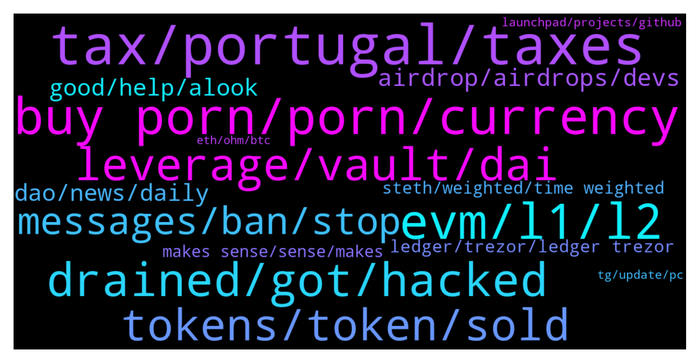

# **@lobsters_chat**
 ## Analysis for **2022-01-02** - **2022-01-09**.

---

## 📊 **Basic Stats**

**n_messages_sent**: 1974

---

---

## 🔝 **Top keywords and related messages**

1. **tax, portugal, taxes**

    @vintash --- *Portugal will probably cease to be a tax haven* **--->** [TG Discussion](https://t.me/lobsters_chat/311360)

    @vintash --- *Here's good news from Portugal too (taxes for crypto) https://eco.sapo.pt/2021/12/21/bloco-de-esquerda-propoe-alargar-irs-as-criptomoedas/* **--->** [TG Discussion](https://t.me/lobsters_chat/311354)

    @Justsomebodi --- *The Netherlands only taxes 3% capital gains, only on declaration. So pretty good imho* **--->** [TG Discussion](https://t.me/lobsters_chat/311387)

    @olivier27 --- *Dubai and Singapore are the only true crypto tax havens* **--->** [TG Discussion](https://t.me/lobsters_chat/311382)

    @TygaKim --- *korea no more metamask Portugal will probably cease to be a tax haven* **--->** [TG Discussion](https://t.me/lobsters_chat/311378)

    @ivangbi --- *Was there any rebuttal to “bitdao is a shell DAO for bybit to avoid taxes and regulatory” or no? If that’s the case, it’s fine, not shitting, just wanna clear it up* **--->** [TG Discussion](https://t.me/lobsters_chat/313414)

2. **buy porn, porn, currency**

    @phil_muhbags --- *>cryptocurrencies are not currencies >Websites are allowing users to pay via crypto   Well...Which one is it?  Why is that people who hate something so much barely do any sort of research. You know if I want to talk shit about something I really dig deep into it.* **--->** [TG Discussion](https://t.me/lobsters_chat/312963)

    @Sp33dyTT --- *I think its just because they all still has no clue what to do with crypto in general, hence different countries think up some crazy ideas depending on their hivemind in governance process 😂* **--->** [TG Discussion](https://t.me/lobsters_chat/311404)

    @Edward_F --- *They are absolutely not afraid to deplatform people as WikiLeaks found out when Mastercard froze them without giving a reason or excuse.* **--->** [TG Discussion](https://t.me/lobsters_chat/313781)

    @Justin --- *how do you know about this. I guess crypto has grown more than I know to be this complex* **--->** [TG Discussion](https://t.me/lobsters_chat/312558)

    @svenblockchain --- *"The cryptocurrency industry, whose business model would seem unrealistic and ham-handed if it was a villain on Captain Planet: they manufacture only POLLUTION, nothing else, and they turn that into money.  They call it a "currency" but the only thing you can do with it is pay ransom after your computer was hacked! You can't even use it to buy porn!  And make no mistake, if you can't use a thing to buy porn, that thing is not a currency."* **--->** [TG Discussion](https://t.me/lobsters_chat/312907)

    @Don_Luv --- *Looking at this but don’t see how it’s crypto friendly. Are there some integrations I failed to see, or does it allow you to pay in crypto (just saw USD and EUR pricing)* **--->** [TG Discussion](https://t.me/lobsters_chat/311600)

3. **evm, l1, l2**

    @yic_alex --- *L1s are competing with Ethereum L2s imho. At least they're selling the same qualities to the end user. I don't think Ethereum can be beaten from an ecosystem / network effect / security POV realistically any time soon.  Ethereum L2s mostly have been building in the background, some don't even have tokens. It will be interesting to see what happens once the marketing is turned up for those.* **--->** [TG Discussion](https://t.me/lobsters_chat/310689)

    @cragslist --- *How? They are completely different platforms. DOT is the highway that interconnects all the different L1's like ETH, SOL. They can't compete. They will be successful in their own pillars* **--->** [TG Discussion](https://t.me/lobsters_chat/310756)

    @Alphamint --- *Q: if you where to sort all the protocols with tokens that are actually of use and aren't L1s by legal risk for the founders starting with less risky, which ones would be in the top 10?  I'm guessing chain link would one of them cus theyrnt touching any money  (Only judging by the type of service they provide,  ignoring that some have legal buffers like no website, DAO decided on activation, foundation in BVI...)* **--->** [TG Discussion](https://t.me/lobsters_chat/311578)

    @Suk4b1y4t --- *Only EVM L1s are competing with ETH L2s* **--->** [TG Discussion](https://t.me/lobsters_chat/310693)

    @foflexity --- *It was more along the lines of “these big name players are doing a disservice to the L1/L2 contenders by diluting their value and extracting all the value by running on every chain possible, pointing out that more benefit comes to the network with the chain specific implementations like pancakeswap and traderjoes* **--->** [TG Discussion](https://t.me/lobsters_chat/311251)

    @foflexity --- *Anyone remember the Twitter feed that discussed the L1/L2 value add comparison between blue chip cross chain dapps and native chain specific ones?  And if so, link? 🙏😅  Example like Uniswap/Sushiswap vs Pancakeswap/TraderJoes, and what brings for value for a L1/L2 network* **--->** [TG Discussion](https://t.me/lobsters_chat/311231)

4. **drained, got, hacked**

    @SpikeSpiege1 --- *Anyone know where the hacker actually took the tokens from? Team wallet? Bridge? Etc https://bitcoinist.com/hacker-exploits-vulnerability-on-polygon/* **--->** [TG Discussion](https://t.me/lobsters_chat/311857)

    @phil_muhbags --- *They signed a message or something. I forget the exact details. However people got their accounts drained* **--->** [TG Discussion](https://t.me/lobsters_chat/313565)

    @svenblockchain --- *7. Scammer gets on a discord call with target. Eventually gets target to screen share. Tells target to open inspect element by pressing ctrl+shift+i. I feel that's not really a hack, unless you count social engineering as a hack.* **--->** [TG Discussion](https://t.me/lobsters_chat/312292)

    @TheKimonoOfBithumb --- *We’re all responsible for “the narrative”, and it’s very valuable that we don’t spread misinformation (especially in this strict “fact or fuck off” group). This is why I’m lashing back at you a little bit. No one gets their wallet drained by signing a message. No one gets their wallet drained by connecting to a dapp. There ARE a bunch of attack vectors/risks, such as getting someone to 1) share their seed phrase, 2) approve spending of one or more tokens to a rogue contract, 3) use a “faulty”/buggy contract that is later exploited and 4) getting tricked into sending tokens.  This is why it’s important to be vigilant whenever you use your wallet. Read and (preferably) understand what you are asked to do.  The distinction between someone falling for a phishing scam and getting their wallet drained because they signed a message is so fundamental that if the latter was possible this group wouldn’t exist, because crypto wouldn’t exist.* **--->** [TG Discussion](https://t.me/lobsters_chat/313602)

    @farm42 --- *Yeah, but theoretically this is a very easy «Bad-USB» attack, very easy to perform. Even with taking original tweet with some skepticism:)   https://twitter.com/crypto_bitlord7/status/1473231965927063553?s=20* **--->** [TG Discussion](https://t.me/lobsters_chat/310953)

    @da0man --- *they could just say it’s to block hackers or smth* **--->** [TG Discussion](https://t.me/lobsters_chat/313784)

5. **leverage, vault, dai**

    @midgetwhale --- *The trading platform works as follows: You open a trade, say $1000 at 10x, you pay $6 (0.06% of volume) in fees that goes to dev, gov fund and referrals. Your position gets opened at say $50000 BTC long. This price gets fed to the smart contract because in the same transaction of your opening you also query 8 chainlink nodes that feed the BTC price to the smart contract from several exchanges. See a random txs here: https://polygonscan.com/tx/0xd46431144843dfe0a4ac8f2797ac89f73c182e64f348c56b31c410f390ad7754  The actual 994 DAI that remain after your initial fees get sent to the trading vault. Once you close your position, say at $50500, the price gets queried again on chain, the smart contract deduces that your underlying went up 1% and that your 10x position thus ended 10% in profit and you are owed 1093.4 DAI. However also on your exit you pay 0.06% in fees (and 0.3% on your collateral to offset some transactions that the vault contract needs to execute on the Quickswap AMM). Thus you pay $9 in fees and receive 1084.4 DAI. If you close the trade in a loss of 1%, 10% with leverage, you receive 885.6 DAI.   You never own the asset that you trade, you never borrow funds for your synthetic leverage and you have no slippage because you do not exchange funds. Everything is just like a ledger entry in the smart contract and the counterparty is directly the trading vault, which acts as a buffer for the token LP. So in essence the real counterparty are the token holders.  The vault gains more and more funds through open collateral, exit fees and net losses of traders accumulating in the vault. When it reaches a treshold value of 110% of what is being staked, a depletion gets now and then triggered and the vault buys some GNS tokens on Quickswap with some of the excess DAI and burns the GNS it aquired. When the vault reaches a treshold value below 100% of what stakers are staking, a refill function gets triggered and the vault mints some GNS tokens and sells them for DAI on Quickswap.  Since the vault holds onto all the exit fees and eventually uses them to buy GNS and burn them, whilst the exit fees are actually promised to LP stakers, the equivalent in exit fees also get minted when LP stakers harvest their rewards.    However the sum of the fees, the losses of the traders and the increase/decrease in open collateral on the platform can be evaluated by just looking at the trading vault. It will be equal to the number of DAI that was depleted from the vault, minus the number of DAI that was refilled into the vault plus the overcollateralization of the vault. Here it is: https://polygonscan.com/token/0x8f3cf7ad23cd3cadbd9735aff958023239c6a063?a=0xd7052ec0fe1fe25b20b7d65f6f3d490fce58804f  You can download the CSV’s and see for yourself. I already did and in the past 13.81 days since this vault is active it made 662665 DAI or 16.47 Million annualized.  But the most important thing is the growth that is possible for this project. No KYC, no slippage, no borrowing fees, low trading fees, more trading pairs than any other on chain project and soon stocks and commodities trading. Yes, I hold GNS.* **--->** [TG Discussion](https://t.me/lobsters_chat/312384)

    @awnyrvan --- *Your observations are very valuable. Been thinking about it. The capital efficient way to do away with CEXes would be to file up liquidity on uniswap kind of spot trading dexes. Isn’t that correct?  Then, for enabling high leverage, run a synthetic platform based on spot dex price feed.  If I try to build my own orderbook at 150x leverage, it would need lot more money supply. Maybe a reason why dydx can only offer upto 30x leverage?* **--->** [TG Discussion](https://t.me/lobsters_chat/312614)

    @strategst --- *As a sandwicher (and devil's advocate of course) I genuinely can't understand traders logic when buying with dexes. When I make a trade through ui I always put the slippage = 0, and it fails 1/10 times (own anecdotal experience), nothing special to make me to increase slippage. Of course high gas should be considered, but for hiding tx with flashbot rpc same high gas values should be used.  As for the fomo, or active trading phase, it is rarely good idea to trade, and if retail puts high slippage they obviously ready to lose money in slippage borders, so can't see any usage cases for such tools.* **--->** [TG Discussion](https://t.me/lobsters_chat/311593)

    @StephanGoss --- *Are there any Dexes out there yet that use owned liquidity? When Ohm launched i assumed that was going to be the core usecase but I'm clearly wrong* **--->** [TG Discussion](https://t.me/lobsters_chat/313267)

    @awnyrvan --- *Found a very nice leverage dex who run it based on synthetics - you can trade the true price of btc/eth etc with upto 150x leverage. The prices are sourced from most liquid CeX/dex through their custom built chain link DONs and I have seen the price on their platform to be the fairest of them all. No scam wicks even during very volatile days* **--->** [TG Discussion](https://t.me/lobsters_chat/312258)

    @awnyrvan --- *Everybody is limited by some books. Point here is capital efficiency.   If all the trades’ PnL are settled by one unified pool, you have significantly increased capital efficiency.  In this specific case, there is a DAI vault (backed by GNS/DAI Lp) that acts as the settlement layer.  And you are right, the max position size is limited as a % of the DAI vault TVL. And for each individual trade, max profit is limited at 10x the base capital used.  Upto 150x leverage is working for 12months now. The stats page shows average leverage used is 57x (which is still higher than what other platforms offer).  You may just want to open a high leverage trade on it for testing and see.  Liquidation: the platform liquidation is run by a cluster of bots who liquidate when a trade is at -90% (the other 10% is paid out to the bots as compensation) At 100x leverage, underlying movement of 0.9% will liquidate you - but someone opening 100x position knowns that already. There is no surprise in terms liquidation price.  And as of now, the platform focuses on offering only the most liquid tokens, obviously to ensure platform safety. You have about 42 cryptos and 10 forex pairs listed there.* **--->** [TG Discussion](https://t.me/lobsters_chat/312623)

6. **tokens, token, sold**

    @SilkCE --- *Legit question @andrecronje Will the tokens only be sellable to a treasury or something hence why no one can buy it only earn it?* **--->** [TG Discussion](https://t.me/lobsters_chat/313235)

    @Sunny --- *Though its incentivised- you earn tokens based on your trading volume leading to wash trading* **--->** [TG Discussion](https://t.me/lobsters_chat/312224)

    @degenerateape21 --- *So example with the btc call options 55k call at the moment. If you deposit 1 btc and price at strike is 60k. You get 0.92 btc back and lost ~8 %* **--->** [TG Discussion](https://t.me/lobsters_chat/312165)

    @tandeloff --- *For downside moves equal to holding btc* **--->** [TG Discussion](https://t.me/lobsters_chat/312208)

    @alexinlife --- *if say you raise X and say that tokens sold are fully redeemable, the token will ofc trade at a premium cos getting X back is the worst case scenario* **--->** [TG Discussion](https://t.me/lobsters_chat/313290)

    @sir_integra_hellsing --- *Did they? I never knew. Just thought they refunded everyone from insurance.* **--->** [TG Discussion](https://t.me/lobsters_chat/311550)

7. **messages, ban, stop**

    @adrianleb --- *messages were deleted because it was just another shill of the project which you're also just shilling in your channel, the ban was because you didn't stop there* **--->** [TG Discussion](https://t.me/lobsters_chat/311845)

    @ivangbi --- *Ok let’s end here. Not gonna have 10K + “happy NY” posts. Enjoy u fucks and back to work in 9 hours.   Sharing foot(d) pics if ok* **--->** [TG Discussion](https://t.me/lobsters_chat/311885)

    @eth2enthusiast --- *still havent gotten banned from gearbox chat but im close!* **--->** [TG Discussion](https://t.me/lobsters_chat/310947)

    @eth2enthusiast --- *lets see if i get kicked here* **--->** [TG Discussion](https://t.me/lobsters_chat/310958)

    @Sunny --- *Ban me if necessary, i understand* **--->** [TG Discussion](https://t.me/lobsters_chat/311906)

    @Joel_john --- *pls stop posting ot content, we'll have to ban you* **--->** [TG Discussion](https://t.me/lobsters_chat/311890)

8. **airdrop, airdrops, devs**

    @ivangbi --- *Will the airdrops even be enough anymore? So much sybiling and so many users now :/ Becomes too diluted* **--->** [TG Discussion](https://t.me/lobsters_chat/312021)

    @zegdathetkan --- *Can someone help me understand what is the point of recent airdrops like GAS and SOS? it occurs to me they are airdropping before they have a working platform, why? what is the point? is this just a marketing stunt? is this somehow a scheme to make money by somebody? who is providing the liquidity?* **--->** [TG Discussion](https://t.me/lobsters_chat/311331)

    @Sp33dyTT --- *Hey guys there is apparently airdrop ongoing for wasted gas can anyone smarter with solidity knowledge have a look at smart contract? http://Gasdao.org* **--->** [TG Discussion](https://t.me/lobsters_chat/311276)

    @SD107 --- *Any communities the devs doing the airdrop decide I guess* **--->** [TG Discussion](https://t.me/lobsters_chat/312054)

    @uni_doggo --- *supposed to be retroactive airdrop based on hours you played* **--->** [TG Discussion](https://t.me/lobsters_chat/311965)

    @a1ek5or --- *im still scared to claim gas airdrop lol* **--->** [TG Discussion](https://t.me/lobsters_chat/311337)

9. **good, help, alook**

    @philippvienna --- *this one is in the works:  https://dune.xyz/kwizzles/LobsterDAO* **--->** [TG Discussion](https://t.me/lobsters_chat/311765)

    @Don_Luv --- *Not sure if you’re looking for a specific one that was mentioned previously, but the one I always recommend to people is https://finematics.com* **--->** [TG Discussion](https://t.me/lobsters_chat/311799)

    @ivangbi --- *And a cool one also from the past: https://llama.airforce/#/curve/utilization* **--->** [TG Discussion](https://t.me/lobsters_chat/312183)

    @Darrenlautf --- *https://twitter.com/PatrickAlphaC/status/1435981334502064131 heres a soldiity one thats pretty good* **--->** [TG Discussion](https://t.me/lobsters_chat/313700)

    @perpetual_losses --- *Not the one I was looking for but it's also a good one. Thanks.* **--->** [TG Discussion](https://t.me/lobsters_chat/311801)

    @Joel_john --- *not yet - been searching for this myself* **--->** [TG Discussion](https://t.me/lobsters_chat/312737)

10. **dao, news, daily**

    @sshshln --- *🎙 Top Crypto Podcasts of December 2021:   https://twitter.com/Paradigm_fund/status/1476240598571048963?s=20* **--->** [TG Discussion](https://t.me/lobsters_chat/311471)

    @Agora --- *are there any newsletters/blogs that do weekly recaps on interesting DAO proposals/discussions?* **--->** [TG Discussion](https://t.me/lobsters_chat/312736)

    @deranzxc --- *iirc paradigm daily has one edit: https://medium.com/paradigm-fund/defi-in-ether-104b-in-defi-bancor-v3-unveiled-zapper-reaches-1m-maus-perpetual-protocol-v2-ea96dace9eaf  delphi has a DAO recap too i think?* **--->** [TG Discussion](https://t.me/lobsters_chat/312740)

    @mempirate --- *Does anyone here know of a news / interesting stuff aggregator for all things defi / ethereum? Something like hacker news* **--->** [TG Discussion](https://t.me/lobsters_chat/310982)

    @kuzzel --- *In the interest of freeing @ivangbi of further moderation, would you be game of putting together your questions/points together and sharing them with me?  Sounds like I'd be doing everyone a favor if I just wrote a long form response via blog post, that people could just link to to get fully informed on the perspectives. That way it's less conversational and more 'here are the options and tradeoffs, you take the risk you think best fellow founders/DAO community members'.  Happy to write it with you if you're game* **--->** [TG Discussion](https://t.me/lobsters_chat/311565)

    @Joel_john --- *1. Hangout here 2. Join a bootcamp programme on the skills side (heard good things about chainshots) 3. Contribute to DAOs to offset costs/time spent 4. Join Darren's daily ape tg for news 5. I have a reading list here - https://www.decentralised.co/the-reading-list/ 6. List of outlets for news - https://community.decentralised.co/c/markets/tools-to-stay-on-top-of-the-market 7. Pick a theme you are passionate about and go deep in it and build a network within it* **--->** [TG Discussion](https://t.me/lobsters_chat/313687)

11. **ledger, trezor, ledger trezor**

    @raoufbenhar --- *What’s your guys favorite/best hardware wallet? Aside from ledger* **--->** [TG Discussion](https://t.me/lobsters_chat/310842)

    @mogglet --- *ledger nano s is still the best, I bought 2 nano x and both died upon arrival ( battery dead). Ledger team if you were here please fix asappp !* **--->** [TG Discussion](https://t.me/lobsters_chat/310859)

    @yic_alex --- *Tbh it does not make much sense to not use Ledger/Trezor if you don't want to run into compatibility issues / lack of apps. It does not pay off to go for the non market leaders with those kind of things in my experience, especially when even those already kinda suck.* **--->** [TG Discussion](https://t.me/lobsters_chat/310854)

    @yic_alex --- *It is not that Ledger and Trezor are bad, they are just confronted with the issue of having to support rapidly changing protocols / networks / browsers (and extensions) without compromising security. I think they have understood (will understand) this and will allocate more resources eventually.* **--->** [TG Discussion](https://t.me/lobsters_chat/310889)

    @DMA1086 --- *Bancor getting more and more attention of protocols for their treasuries* **--->** [TG Discussion](https://t.me/lobsters_chat/311202)

    @batduck73 --- *I don’t like ledger (data breach, bad UX..) but I didn’t find better HD wallet* **--->** [TG Discussion](https://t.me/lobsters_chat/310843)

12. **steth, weighted, time weighted**

    @iuriivv --- *Hi, guys. I am thinking about relatively stable coin which represents time weighted changes in Bitcoin price. Or whatever assets. I think projects like synthetics can do this. So having time interval is long enough we can have a coin which is stable same as FIAT currencies relative to goods prices. The problem to solve here is to have a stable coin without USD and other fiat currencies addiction.    Do you see any problems designing it? #tws* **--->** [TG Discussion](https://t.me/lobsters_chat/313392)

    @iuriivv --- *The question is not about which asset to choose but how to make the peg time weighted.* **--->** [TG Discussion](https://t.me/lobsters_chat/313399)

    @em_dot --- *I think FLOAT is doing just that but wrt time weighted changes in ETH price* **--->** [TG Discussion](https://t.me/lobsters_chat/313396)

    @ivangbi --- *-> time weighted changes in Bitcoin price Wdym, or asking for oracle manipulations?* **--->** [TG Discussion](https://t.me/lobsters_chat/313394)

    @iuriivv --- *time weighted is like kind a Moving average for an assets. So you can buy that moving average directly. If the period of this moving average will be a year or more it can act as a stable coin.* **--->** [TG Discussion](https://t.me/lobsters_chat/313398)

    @sixty10 --- *Yeah I just had a look at the code and couldn't find out exactly, so the comment above makes sense. But these time weighted averages may be made available directly from whatever oracle you are using* **--->** [TG Discussion](https://t.me/lobsters_chat/312790)

13. **makes sense, sense, makes**

    @danrobinson010 --- *It’s right in the whitepaper, https://uniswap.org/whitepaper.pdf* **--->** [TG Discussion](https://t.me/lobsters_chat/312084)

    @zoomeroracle --- *Makes sense, thanks for the clarity* **--->** [TG Discussion](https://t.me/lobsters_chat/312592)

    @Sunny --- *understood - that makes sense. thanks for clarification* **--->** [TG Discussion](https://t.me/lobsters_chat/313507)

    @ivangbi --- *Idk just from my memory, please verify* **--->** [TG Discussion](https://t.me/lobsters_chat/313266)

    @tatai_007 --- *Okay okay, now it makes sense. Thanks.* **--->** [TG Discussion](https://t.me/lobsters_chat/312106)

    @ivangbi --- *Ah okeoke thanks for double-checking, then ye fine. Thx* **--->** [TG Discussion](https://t.me/lobsters_chat/312139)

14. **launchpad, projects, github**

    @bsc500x --- *Our team looking for launchpads similar to (dxsale, unicrypt)* **--->** [TG Discussion](https://t.me/lobsters_chat/314004)

    @bsc500x --- *Thanks for the advice! But what about P2E ? Our game in process, and what best solution for launch ?* **--->** [TG Discussion](https://t.me/lobsters_chat/314024)

    @bsc500x --- *Hi! Can you recommend fully decentralized launchpad  ?* **--->** [TG Discussion](https://t.me/lobsters_chat/314001)

    @bsc500x --- *We look easy way to launch without "apply to IDO" and other bullshit.* **--->** [TG Discussion](https://t.me/lobsters_chat/314019)

    @FiveBoroughs --- *Yes but like most projects you're betting on future not present* **--->** [TG Discussion](https://t.me/lobsters_chat/311996)

    @etartakovsky --- *Sure, make a GitHub issue and a snapshot proposal ser 😂 Proper governance, no exceptions* **--->** [TG Discussion](https://t.me/lobsters_chat/311773)

15. **tg, update, pc**

    @Sunny --- *their TG is bad, they use zendesk* **--->** [TG Discussion](https://t.me/lobsters_chat/313501)

    @emobludd --- *https://synaps.io/#manager mb who knows how to connect it* **--->** [TG Discussion](https://t.me/lobsters_chat/312283)

    @blablabam --- *wonderinig if its somehow connected to this https://themaskdao.org/* **--->** [TG Discussion](https://t.me/lobsters_chat/311049)

    @maximka1001 --- *tks sam, already found on the app* **--->** [TG Discussion](https://t.me/lobsters_chat/313947)

    @hugeshoe --- *Had to update my tg to see this lol* **--->** [TG Discussion](https://t.me/lobsters_chat/311936)

    @alexinlife --- *just update to the latest tg version.* **--->** [TG Discussion](https://t.me/lobsters_chat/313300)

