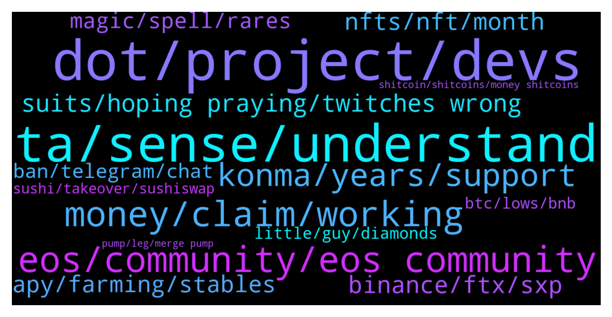

# **@shitpool**
 ## Analysis for **2022-01-02** - **2022-01-09**.

---

## 📊 **Basic Stats**

**n_messages_sent**: 1425

---

---

## 🔝 **Top keywords and related messages**

1. **dot, project, devs**

    @NotTheGodfather --- *Never in my life seen a project with such good fundamentals and solid backing, trip over themselves this badly* **--->** [TG Discussion](https://t.me/shitpool/712676)

    @monkey993 --- *Sounds like the kind of project you should know to steer clear from tbh man* **--->** [TG Discussion](https://t.me/shitpool/715078)

    @wanker007 --- *Dot potential much better tho. As is luna and matic But man already pumped huge. Will wait foe 2022 2023 bear season to schcoop* **--->** [TG Discussion](https://t.me/shitpool/711914)

    @thelostwolf69 --- *Now I can dump more of it into DOT and see it crash* **--->** [TG Discussion](https://t.me/shitpool/713473)

    @nnxwat --- *Hmm bridges without even including any Ren in the lot? Lmao* **--->** [TG Discussion](https://t.me/shitpool/713322)

    @sumtemm --- *Not my preferred type of project leader personally ya* **--->** [TG Discussion](https://t.me/shitpool/714326)

2. **ta, sense, understand**

    @spaceVersity --- *They way you're talking, I'm trying to understand you. You're making sense and yet still putting some words out which I'm still trying to understand* **--->** [TG Discussion](https://t.me/shitpool/713539)

    @MoneroPal --- *It is a mix of subtle and not so subtle trolling and facts* **--->** [TG Discussion](https://t.me/shitpool/713541)

    @MoneroPal --- *If you’re refering to TA, sigh, just the very fact that you’re refering to TA…* **--->** [TG Discussion](https://t.me/shitpool/713509)

    @wanker007 --- *Kidding. I don't touch this trash lol* **--->** [TG Discussion](https://t.me/shitpool/713565)

    @SupreemKai --- *You might not be getting what I’m saying. It’s cool* **--->** [TG Discussion](https://t.me/shitpool/715100)

    @Cosmochi --- *It's bc you personally want to believe.* **--->** [TG Discussion](https://t.me/shitpool/712068)

3. **eos, community, eos community**

    @ddcsov --- *Right so EOS is not a scam, B1 is a scam* **--->** [TG Discussion](https://t.me/shitpool/714275)

    @rmw_90 --- *ahhh dude, we've had plenty of eos fan bois in here and one by one they got blown out and left* **--->** [TG Discussion](https://t.me/shitpool/714279)

    @wojackdegreate --- *“I could have been a millionaire if I didn’t baghold eos since 2017” LOL* **--->** [TG Discussion](https://t.me/shitpool/712474)

    @ddcsov --- *EOS rebrand + new tokenomics model could be moon man* **--->** [TG Discussion](https://t.me/shitpool/714214)

    @michael_ssss --- *B1 is the entity that collected 4 billion dollars. EOS is the “community” with the scraps* **--->** [TG Discussion](https://t.me/shitpool/714271)

    @Horselorde --- *Says every eos holder ever LOL* **--->** [TG Discussion](https://t.me/shitpool/711908)

4. **money, claim, working**

    @sumtemm --- *dont know how you guys still wagey with how much money youve made* **--->** [TG Discussion](https://t.me/shitpool/711938)

    @Gokuhchad --- *I mean, working for yourself is not wagecuck.   I'm only referring to working as employee for someone else.* **--->** [TG Discussion](https://t.me/shitpool/712076)

    @notdao --- *Yeah I'm aware :) though not sure what exactly we're doing together tbh. Must be above my pay grade* **--->** [TG Discussion](https://t.me/shitpool/713247)

    @sumtemm --- *Guess it depends, im p sure some here are already 5/10 millionaires but still work* **--->** [TG Discussion](https://t.me/shitpool/712073)

    @Gokuhchad --- *At some point, being dedicated to full-time job will actually be detriment and negative value if your  net worth could be bettered by just starting an easy business* **--->** [TG Discussion](https://t.me/shitpool/712071)

    @Horselorde --- *Working for yourself is very difficult lol* **--->** [TG Discussion](https://t.me/shitpool/712079)

5. **konma, years, support**

    @da0man --- *one year in crypto is like 10 years on wall st.* **--->** [TG Discussion](https://t.me/shitpool/715177)

    @NotTheGodfather --- *Crypto visa cards backed by cz? Should have been a slam dunk* **--->** [TG Discussion](https://t.me/shitpool/712680)

    @SupreemKai --- *its quite scary what crypto can do to investors reasoning faculties* **--->** [TG Discussion](https://t.me/shitpool/715080)

    @monkey993 --- *Who do you think is the smartest person in crypto?* **--->** [TG Discussion](https://t.me/shitpool/714852)

    @DappGod --- *Konma is a venture that is being built on Blockchain for many different use cases. We have bootstrapped all projects under Konma for 3 years now and it is time to raise funds which we are doing on Project Catalyst Fund 7 by Cardano. We have submitted 7 different proposals under Konma and the funding comes to projects that have the most votes. We have come past all the stages and now we are at the final voting stage and that is where we need your support.   What we are looking for now is your support for voting our project.  *Kindly take a few minutes to read our proposals* https://linktr.ee/KonmaCatalystFund7  *Here is a link to get more details on Konma*  https://linktr.ee/konma  *Get information on how to vote in the link below* -  https://iohk.zendesk.com/hc/en-us/articles/900005679386  *Still need more information?*  We catch up *everyday* at *7:00 PM IST* for a virtual meet called *Konma United*. Come join us, meet new people and know all about Konma and updates https://konmahood.konma.community/posts/19438959?utm_source=manual  Your support would make a huge difference. You can also forward this to your friends and family who might be active in the crypto or blockchain space. Wishing you and your family a very Happy New Year!!* **--->** [TG Discussion](https://t.me/shitpool/713714)

    @Antonioalcantara --- *the vitalik mom is developer and involved in cryptocurrencys wtf* **--->** [TG Discussion](https://t.me/shitpool/715281)

6. **suits, hoping praying, twitches wrong**

    @OppositeRevolution --- *He doesn't understand traditional finance as much as everyone thinks* **--->** [TG Discussion](https://t.me/shitpool/714851)

    @grammi --- *Every buy he’s made since borrowing money or issuing new shares has been horrid* **--->** [TG Discussion](https://t.me/shitpool/714786)

    @kekurikekukaka --- *Prolly something to dump the price. He's like Powell from the Fed, every time he speaks, it dumps.* **--->** [TG Discussion](https://t.me/shitpool/712670)

    @grammi --- *Even saylor should be “ok” for a bit if he gets underwater Bc his loans aren’t due till 2024 iirc* **--->** [TG Discussion](https://t.me/shitpool/715192)

    @grammi --- *I have no clue why, other than ignorance, the reasoning behind him plowing thru every raise or debt sell immediately after his announcement s* **--->** [TG Discussion](https://t.me/shitpool/714792)

    @fololomololo --- *I.e he doesnt need to bootstrap them anymore due to demand for price feeds and services* **--->** [TG Discussion](https://t.me/shitpool/713826)

7. **binance, ftx, sxp**

    @evonMP --- *Surprised it's not on binance, they have kind of big community now* **--->** [TG Discussion](https://t.me/shitpool/713386)

    @kekurikekukaka --- *Today is a very important day for the SXP community. I want to let you know that Binance will now fully acquire Swipe and I am resigning from my capacity as Swipe CEO, Director and Chairman of the Board as well as Head of Binance Card.   I will stay on until a full transition is done and there will no effect on the current products being offered by Swipe and Binance Card in any capacity.* **--->** [TG Discussion](https://t.me/shitpool/712795)

    @wojackdegreate --- *Ftx is cool but both binance and ftx have low af daily withdrawals for non kyc ppl* **--->** [TG Discussion](https://t.me/shitpool/712136)

    @grammi --- *Biggest concern is those leverage longs on bfx ftx etc. that chart mayvune showed is hilarious, everyone keep btfd nonstop* **--->** [TG Discussion](https://t.me/shitpool/715195)

    @sumtemm --- *i remember the days when listing on binance wasnt even bullish* **--->** [TG Discussion](https://t.me/shitpool/712131)

    @wojackdegreate --- *Ahhh nice the binance research reports* **--->** [TG Discussion](https://t.me/shitpool/713105)

8. **nfts, nft, month**

    @Buena_Fiesta --- *who actually makes money with nfts* **--->** [TG Discussion](https://t.me/shitpool/715125)

    @MoneroPal --- *Absolutely, the word NFT in itself is absolutely cringeworthy every lowly wage cuck commoner repeats it yet is clueless about it and takes part in none of it, if they do, it’s at a loss...* **--->** [TG Discussion](https://t.me/shitpool/715128)

    @wojackdegreate --- *NFTs are doing quite well right now* **--->** [TG Discussion](https://t.me/shitpool/715200)

    @Buena_Fiesta --- *i feel like 99% is not making money with buying nfts* **--->** [TG Discussion](https://t.me/shitpool/715126)

    @pizza_dog --- *for all those nftitty holders out there* **--->** [TG Discussion](https://t.me/shitpool/713113)

    @grammi --- *Here’s basically the best looking nft chart u can find for a collection (non 1/1)* **--->** [TG Discussion](https://t.me/shitpool/715209)

9. **apy, farming, stables**

    @AsianFever --- *wow, can i ask you do you actually trust putting serious amounts on there a few 100k or a few mil whatever is significant to you? or do you just yolo farm it with some fraction of real stack* **--->** [TG Discussion](https://t.me/shitpool/714367)

    @yesbutalsono --- *you could farm stables some stables for like 120%* **--->** [TG Discussion](https://t.me/shitpool/713184)

    @OxZilla --- *Most people would be better farming stables for 20%* **--->** [TG Discussion](https://t.me/shitpool/715356)

    @AsianFever --- *@wojackdegreate got any cool stable farms to share for the shitpoolers that have at least some usdt? someone gave me this but i haven`t looked at it yet, https://flexusd.com/* **--->** [TG Discussion](https://t.me/shitpool/714363)

    @R0mster --- *This is what scares me away from farming. You want the best apy but can you really trust the site? These things could rug or bust especially if the ponzi is over and prices crash.* **--->** [TG Discussion](https://t.me/shitpool/714398)

    @pizza_dog --- *They don’t want to lower the apy and they think the dilution isn’t a problem right now. Which doesn’t seem right. At this market cap last month, it was like 8k, now it’s barely holding on to 3.5* **--->** [TG Discussion](https://t.me/shitpool/712548)

10. **magic, spell, rares**

    @sumtemm --- *they couldve been yielding you magic this entire time too* **--->** [TG Discussion](https://t.me/shitpool/714484)

    @sumtemm --- *go to marketplace and check floor prices, some rares lke grins a few k* **--->** [TG Discussion](https://t.me/shitpool/714474)

    @sumtemm --- *$magic with a great daily close after a little pullback   https://www.tradingview.com/x/gdSZS1jH* **--->** [TG Discussion](https://t.me/shitpool/711892)

    @sumtemm --- *Farmed my $magic w treasure nfts* **--->** [TG Discussion](https://t.me/shitpool/715146)

    @sumtemm --- *$magic already back close to ath* **--->** [TG Discussion](https://t.me/shitpool/714444)

    @monkey993 --- *I am sad I shit the bed and reduced $magic position* **--->** [TG Discussion](https://t.me/shitpool/713358)

11. **ban, telegram, chat**

    @R0mster --- *You got banned from Elongoat telegram channel. Now your only outlet is shitpool. I get it. It’s fine. Goodluck sir.* **--->** [TG Discussion](https://t.me/shitpool/715102)

    @yesbutalsono --- *generally curious who and what you follow outside of telegram* **--->** [TG Discussion](https://t.me/shitpool/713162)

    @goldencatpat --- *and no, i will not 'look them up'* **--->** [TG Discussion](https://t.me/shitpool/713537)

    @MoneroPal --- *you have no edge just chats and twitter lol* **--->** [TG Discussion](https://t.me/shitpool/713520)

    @CharliePolite --- *Whoever unbanned this guy… Great job.* **--->** [TG Discussion](https://t.me/shitpool/715149)

    @MoneroPal --- *admins ban this clown @PromiseCosmasward he’s private messaging bullshit scams to shitpool’ers* **--->** [TG Discussion](https://t.me/shitpool/713706)

12. **little, guy, diamonds**

    @michael_ssss --- *He’s at the Heart Attack Grill. They make you wear a hospital gown when you eat there. Also anyone that weighs more than 350 lb eats for free* **--->** [TG Discussion](https://t.me/shitpool/715246)

    @Horselorde --- *How do you know if he’s a strange little man? He could weigh 500lbs and be the life of the party* **--->** [TG Discussion](https://t.me/shitpool/715114)

    @Blazmeen --- *I'm sorry if anyone here likes him but what a load of cringable twaddle.  I seriously doubt that guy could care less about the little man unless they're filling his bags.* **--->** [TG Discussion](https://t.me/shitpool/714323)

    @rocket_fuel --- *why is he wearing a hospital gown* **--->** [TG Discussion](https://t.me/shitpool/715073)

    @MoneroPal --- *Jake wouldn’t look any different if they didn’t.  They’re both just really low class uneducated commoners that got propelled into money and stardom because somone else is making more off of them. Likely will be broke like most, only one I respect in the scene is Canelo Alvarez, doesn’t even belong in the same sentence as them.* **--->** [TG Discussion](https://t.me/shitpool/713968)

    @yesbutalsono --- *i think he means why am i not in the weight room* **--->** [TG Discussion](https://t.me/shitpool/711965)

13. **btc, lows, bnb**

    @reamBay --- *Tf going on with bnb/btc at days high not giving shit about btc* **--->** [TG Discussion](https://t.me/shitpool/712111)

    @i7d6_Ta3z0p --- *https://www.tradingview.com/x/XwBa4sbf Poor TON going down with BTC, at least somebody fat fingered the dip* **--->** [TG Discussion](https://t.me/shitpool/714292)

    @yesbutalsono --- *if btc keeps shitting muh sweet cel will continue up the ratio* **--->** [TG Discussion](https://t.me/shitpool/714259)

    @CharliePolite --- *Dude, btc is simply ranging, let it range and stop donating to the chop.* **--->** [TG Discussion](https://t.me/shitpool/712200)

    @BeAMightyKing --- *Hmm yeah, I guess whoever designed this is a BTC minimalist lol* **--->** [TG Discussion](https://t.me/shitpool/713324)

    @BeAMightyKing --- *I think this is sideways chop, as neither BTC nor ETH has formed lower-lows on a macro scale (since the March 2020 bottom)* **--->** [TG Discussion](https://t.me/shitpool/712814)

14. **sushi, takeover, sushiswap**

    @yesbutalsono --- *we could see sushi there easily* **--->** [TG Discussion](https://t.me/shitpool/712889)

    @yesbutalsono --- *wonder if they will add sushi to the treasury* **--->** [TG Discussion](https://t.me/shitpool/712855)

    @MazzolL --- *I'm trusting your guts, got myself some sushi and spell* **--->** [TG Discussion](https://t.me/shitpool/712856)

    @DajeSempre --- *Sushi will Lauch soon the first DEX with order book based on FTM..* **--->** [TG Discussion](https://t.me/shitpool/714091)

    @Horselorde --- *I’m just waiting til Jan 1st to buy sushi lol* **--->** [TG Discussion](https://t.me/shitpool/712395)

    @yesbutalsono --- *Suga sean shops at one of my dispos* **--->** [TG Discussion](https://t.me/shitpool/713959)

15. **shitcoin, shitcoins, money shitcoins**

    @Dannysparks --- *What's the next Shitcoin to buy* **--->** [TG Discussion](https://t.me/shitpool/715017)

    @sumtemm --- *time for a higher low on my shitcoin!* **--->** [TG Discussion](https://t.me/shitpool/714698)

    @michael_ssss --- *Only pajeets say that phrase. Better not be preparing a wall of text with rocket emojis for a shitcoin investment scam* **--->** [TG Discussion](https://t.me/shitpool/714638)

    @bsbscsgagacgsha --- *who remembers that shitcoin from 2017 bullrun? look at weekly chart, could break out. easy 10x* **--->** [TG Discussion](https://t.me/shitpool/711818)

    @sumtemm --- *nobody is saying this is the top for your shitcoin* **--->** [TG Discussion](https://t.me/shitpool/714570)

    @Shillosevich --- *Yeah proper shitcoin. But still better tokenomics and launch than 99% of stuff being shilled here so worth a look* **--->** [TG Discussion](https://t.me/shitpool/713864)

