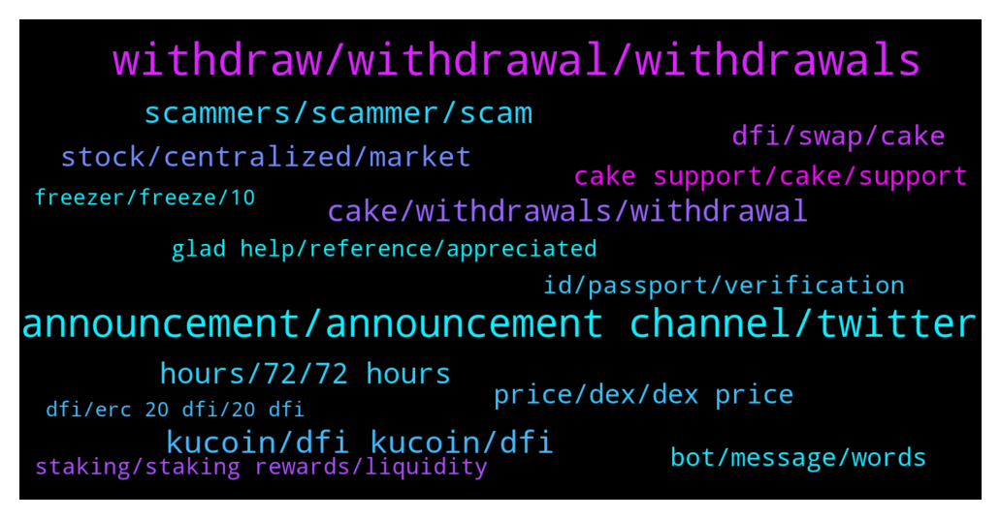

# **@CakeDeFi_EN**
 ## Analysis for **2022-01-09** - **2022-01-16**.

---

## 📊 **Basic Stats**

**n_messages_sent**: 2212

---

---

## 🔝 **Top keywords and related messages**

1. **withdraw, withdrawal, withdrawals**

    @iAden_94 --- *Was it same day withdrawals? I’m withdrawing to a whitelisted address but still have not receive any notifications* **--->** [TG Discussion](https://t.me/CakeDeFi_EN/162155)

    @AIex_78 --- *How long will it take and whats the reason for? Did withdraw, got no message like this here and now Stuck half/half. Oben of the pair still in my wallet, other Part Pending* **--->** [TG Discussion](https://t.me/CakeDeFi_EN/159051)

    @Kassius84 --- *I can understand that well 😂😃  But be patient, most withdrawals are processed in under 60 minutes.  Only very few need the maximum time of 72 hours.* **--->** [TG Discussion](https://t.me/CakeDeFi_EN/159192)

    @AIex_78 --- *Some News? My LM withdraw pending aince 9 hours.* **--->** [TG Discussion](https://t.me/CakeDeFi_EN/159305)

    @KBerger --- *Thats not true. Every of my withdrawels needed more than 24 hours. Maybe they are to big to do it automatic. But it sucks anyway. Should be good if i can decide to set up my security Level lower to have faster payout* **--->** [TG Discussion](https://t.me/CakeDeFi_EN/159196)

    @BillsGate --- *Im trying to figure out why whatever Action I take the only avail funds are the interest earned. I can not seem to touch the actual amount I allocated* **--->** [TG Discussion](https://t.me/CakeDeFi_EN/159576)

2. **announcement, announcement channel, twitter**

    @fabioandreatta --- *We announced this the 2nd of January for the first time* **--->** [TG Discussion](https://t.me/CakeDeFi_EN/161954)

    @BerndMack --- *there is a question on twitter in exactly this direction:  https://twitter.com/cakedefi/status/1480863995322060800* **--->** [TG Discussion](https://t.me/CakeDeFi_EN/163463)

    @AivernT --- *No worries man, i rather have healthy discussions and engagement than silence from the community. This is a community as everyone seems to be saying after all right? Yet whenever there are any concerns or questions the answer is always "that's how it is. We cant do anything". And while that may be true, a reply like that without any further information is not gonna inspire confidence. Mind you, im speaking entirely from my own experience here, and im in both cake and defichain's tele and discord groups. Out of respect that you took the time to reply, i'll share my thoughts about why i feel this way.  1. I think we fundamentally agree about the exchanges, so there's nth to add here.  2. Well, on paper and "technically", they are unrelated, but if you're telling me that Julian doesnt have a massive influence in the direction of the project then i have to say you're being disingenuous. Take first twitter discussion that took place during the atomic swap issue. If julian was so far removed, why was he the only one who spoke then and why was he behaving like a CEO of both cake and defichain? Why was he the only one to lay out all the possible options? Because he was the smartest and most articulate person in the entire community? If that is the case then no amount of "decentralization" can disassociate him from the project. Look, i dont really care that he heads everything, but i feel like the community is holding him too high on the pedestal, and having DMOR on him, i cant say i fully trust that he has the best intentions for the project and i feel like people throw the term decentralization like it's some utopia when in actual fact it is absolutely not. BUT THIS IS PURELY MY PERSONAL OPINION. If i get killed for this then this place has become more of a cult than i realized lol.  All that said, i still believe this project has quite a long, maybe 2yr run way at least. I have no faith in the road to 50, but i think the road to 20 is doable. Again, this is my own personal view, but the way the community is running this, im not convinced it will be a massive success. I quite like this interpretation of decentralized finance and tokenized assets, but i have very little faith in julian and the rest of the team and how they are running everything. Smart technical ppl for sure, but that alone isnt enough to drive adoption.  My own investment in this project is a reflection of that. Im still here for the ride and if it happens i will cash out at $20.  I really appreciate you taking the time to reply, if everyone was like you and not just defensive everytime people had question, the project would get alot more adoption, but what a pity.* **--->** [TG Discussion](https://t.me/CakeDeFi_EN/161543)

    @fabioandreatta --- *There will be a Twitter Space in around 5 hours where this is discussed* **--->** [TG Discussion](https://t.me/CakeDeFi_EN/159654)

    @PeterL1 --- *And nobody is talking about voting which is new to me. Since support say it is maitenance* **--->** [TG Discussion](https://t.me/CakeDeFi_EN/163030)

    @<UNK> --- *Taking own sweet time to vote and blah. Solve it already* **--->** [TG Discussion](https://t.me/CakeDeFi_EN/161430)

3. **kucoin, dfi kucoin, dfi**

    @papai699 --- *Are the nodes updated? Cannot transfer on DFI network from Kucoin* **--->** [TG Discussion](https://t.me/CakeDeFi_EN/159439)

    @Michael_Schredl --- *Yes, but you have to wait for your DFI until Kucoin opens again* **--->** [TG Discussion](https://t.me/CakeDeFi_EN/160646)

    @YunTao --- *I got a network upgrade at kucoin* **--->** [TG Discussion](https://t.me/CakeDeFi_EN/161562)

    @Reggie --- *Kucoin Deposits and withdrawals are back online 🔥* **--->** [TG Discussion](https://t.me/CakeDeFi_EN/164099)

    @KlausLberger --- *You may check it right there https://www.defichain-income.com or on the kucoin website* **--->** [TG Discussion](https://t.me/CakeDeFi_EN/165018)

    @FartingDoggo --- *Kucoin network is under maintainence so u cant send out dfi coins* **--->** [TG Discussion](https://t.me/CakeDeFi_EN/162670)

4. **scammers, scammer, scam**

    @super33max --- *Scammer are getting smarter and smarter.  This is just an idea: Why moderators don’t put their username in their photo? (Like a water mark)  So, when scammer write you, you can click on their profile and see the mismatch between the username and the username written in the photo.* **--->** [TG Discussion](https://t.me/CakeDeFi_EN/162323)

    @GionB --- *Please REMOVE this Scammer!!! All fucking bastards!! Its for sure nothing wrong with my wallet 🤬🤬🤬☝️☝️☝️☝️* **--->** [TG Discussion](https://t.me/CakeDeFi_EN/162410)

    @Kassius84 --- *Watch out for scammers which sends you a direct message.* **--->** [TG Discussion](https://t.me/CakeDeFi_EN/165152)

    @NuckFut --- *The number of scammer's watching this chat and pouncing on anyone with questions is too damn high* **--->** [TG Discussion](https://t.me/CakeDeFi_EN/164553)

    @Javier --- *It is. Thank you. By the way, I was contacted presumably by a scammer because of this issue* **--->** [TG Discussion](https://t.me/CakeDeFi_EN/164237)

    @Kassius84 --- *Did you started the direct conversation or the mod? No Moderator will contact you you first. Be aware of scammers, they will impersonates moderators* **--->** [TG Discussion](https://t.me/CakeDeFi_EN/163107)

5. **cake, withdrawals, withdrawal**

    @DmgBautista --- *I'll try and ask it someone on the backend can check. At Cake, any withdrawal equal or bigger than 10k$ is manually reviewed without exception  but if you inform that it was efectivelly withdraw, then it needs to be seen.   If you wish, you can also make a support ticket for the below email  https://cake.zendesk.com/hc/en-us/requests/new* **--->** [TG Discussion](https://t.me/CakeDeFi_EN/163443)

    @AStron6 --- *I know but trying to skim some arb. I know each withdrawal is manually reviewed, but I think there needs to be a way to have pro cake accounts so this is automated* **--->** [TG Discussion](https://t.me/CakeDeFi_EN/164049)

    @MaveJ --- *Hi - chain is running. Why does not cake open deposits/withdrawals?* **--->** [TG Discussion](https://t.me/CakeDeFi_EN/159463)

    @rupchan99 --- *hello  ad  Diposite and withdrawal are live or not in cakedefi?* **--->** [TG Discussion](https://t.me/CakeDeFi_EN/161002)

    @Michael_Schredl --- *Is the withdrawal finished on Cake?* **--->** [TG Discussion](https://t.me/CakeDeFi_EN/162438)

    @enalettin --- *Maybe this is not the best time to reiterate my past criticism but it is better for the future of cake to make the withdrawals fast, easy and seamless however much cake insists that it is not a cex both withdrawal and deposit timings very important for customers.* **--->** [TG Discussion](https://t.me/CakeDeFi_EN/159066)

6. **hours, 72, 72 hours**

    @Michael_Schredl --- *Yes, it can take up to 24 hours* **--->** [TG Discussion](https://t.me/CakeDeFi_EN/159900)

    @Sebastian --- *Is it possible, that it takes weeks? 🤯* **--->** [TG Discussion](https://t.me/CakeDeFi_EN/161634)

    @Pharamond --- *Yes, but It usually never takes so long* **--->** [TG Discussion](https://t.me/CakeDeFi_EN/163187)

    @Michael_Schredl --- *They can take up to 72 hours* **--->** [TG Discussion](https://t.me/CakeDeFi_EN/160337)

    @Michael_Schredl --- *It can take up to 72 hours* **--->** [TG Discussion](https://t.me/CakeDeFi_EN/163185)

    @Marcel --- *How many days we have to wait?* **--->** [TG Discussion](https://t.me/CakeDeFi_EN/159714)

7. **stock, centralized, market**

    @deeteejay --- *Lots of FUD. Don't panic sell. Whales are accumulating like mad* **--->** [TG Discussion](https://t.me/CakeDeFi_EN/161883)

    @Keymtl --- *I asked the stock market but they directed me to you* **--->** [TG Discussion](https://t.me/CakeDeFi_EN/162447)

    @Michael_Schredl --- *No it would not be, because they can sell Bitcoin anywhere else to the real price - please stop arguing now* **--->** [TG Discussion](https://t.me/CakeDeFi_EN/160466)

    @AStron6 --- *Be greedy when everyone else is fearful. Whole market is red. Look 2- 3 years down the road* **--->** [TG Discussion](https://t.me/CakeDeFi_EN/162342)

    @Mad_Ed0815 --- *Why should people sell?! Only because there was a little hickup?!* **--->** [TG Discussion](https://t.me/CakeDeFi_EN/163733)

    @BrothersKeeper --- *What happened today??? Why this huge dip? Anyone knows?* **--->** [TG Discussion](https://t.me/CakeDeFi_EN/161308)

8. **dfi, swap, cake**

    @rodolfo --- *I´m trying to add to the pair BTC-DFI, but is noy possible on cakedefi ...* **--->** [TG Discussion](https://t.me/CakeDeFi_EN/160474)

    @Jan-Niklas --- *When I will be able to change dfi to BTC on cake?* **--->** [TG Discussion](https://t.me/CakeDeFi_EN/163803)

    @Albert --- *Can I clarify that is my interpretation is correct? If I want to LM dbtc-DFI. The cake is swapping at 1 dfi = 0.00007076dbtc and kucoin is trading at 1dfi= 0.00006328 BTC, is it better to swap using cake?* **--->** [TG Discussion](https://t.me/CakeDeFi_EN/163179)

    @Cam --- *Can you swap btc for usdc (and vice versa) on cake?* **--->** [TG Discussion](https://t.me/CakeDeFi_EN/160782)

    @DmgBautista --- *You can therefore place te swap request and as soon and finished, you'll receive BTC in ypur Cake account. After that, just use therefore normal mode (since you'll have both coin pairs after turning half your DFI into BTC) and join the pool :)* **--->** [TG Discussion](https://t.me/CakeDeFi_EN/164435)

    @Paulius --- *I have tried swaping DFI to BTC. On CakeDefi app.   And i get the message that swaps are only allowed to DFI. So i get rewards in DFI crypto currency, but can not swap DFI to other cryptos.* **--->** [TG Discussion](https://t.me/CakeDeFi_EN/163277)

9. **price, dex, dex price**

    @Kassius84 --- *What are you expecting to happen with your dTSLA Tokens? Price of the Tokens depends on supply and demand of dTSLA on the DeFiChain DEX and is not depending on the price outside DeFiChain.* **--->** [TG Discussion](https://t.me/CakeDeFi_EN/160059)

    @Kassius84 --- *https://www.defichain-value.com/d/-aHOfMT7z/03-stocks?orgId=1 https://www.defichain-analytics.com/vaultsLoans?entry=dTokenPrices  Only during minting, the oracle-price is used. Otherwise the DEX-price depends on supply and demand 👍* **--->** [TG Discussion](https://t.me/CakeDeFi_EN/165297)

    @Kassius84 --- *They have a connection to real stocks while minting of new dTokens. After that, if you buy or providing liquidity, the price only depends on supply and demand on the DeFiChain DEX. Here you can find some more informations https://blog.defichain.com/what-are-decentralised-stock-tokens-and-how-do-they-work/* **--->** [TG Discussion](https://t.me/CakeDeFi_EN/160083)

    @klausnoris --- *Are you referring to a dTSLA-LM-Pool?  Both DEX- and Oracle-Prices are also up: https://www.brandlhuber.de/defichain_charts/TSLA.html* **--->** [TG Discussion](https://t.me/CakeDeFi_EN/160041)

    @Dutch1987 --- *The price on chain will always be a little bit more expensive i guess* **--->** [TG Discussion](https://t.me/CakeDeFi_EN/160064)

    @resinio --- *One question: why is the price of dfi within the cake system not coherent with dex price when it comes to exchange? I was just checking the price vs. dusd, usdc, and I don’t come to 3.58 $ where it is now on the Dex.* **--->** [TG Discussion](https://t.me/CakeDeFi_EN/160415)

10. **cake support, cake, support**

    @Michael_Schredl --- *Wait on the reply of the official Cake Support* **--->** [TG Discussion](https://t.me/CakeDeFi_EN/159706)

    @mirkata001 --- *This is currently disabled without mentioning when it will be enabled if they even plan to enable it! It was the main reason for me to join CAKEDeFi.* **--->** [TG Discussion](https://t.me/CakeDeFi_EN/161171)

    @resinio --- *I am not arguing I am just explaining my view as a customer of cake. If customers opinion doesn’t matter…ok!* **--->** [TG Discussion](https://t.me/CakeDeFi_EN/160469)

    @Michael_Schredl --- *!Support You need to write the Cake Support* **--->** [TG Discussion](https://t.me/CakeDeFi_EN/161786)

    @Ern1980 --- *Nice one.. what if I bought that ampunt on cake?* **--->** [TG Discussion](https://t.me/CakeDeFi_EN/159346)

    @Michael_Schredl --- *I don't know that, you are in the Cake Channel, I can tell you that Cake is working* **--->** [TG Discussion](https://t.me/CakeDeFi_EN/160320)

11. **bot, message, words**

    @zcpmv --- *Omg its so difficult to write in this group, my massages are deleted as soon as I send them* **--->** [TG Discussion](https://t.me/CakeDeFi_EN/162746)

    @DmgBautista --- *If that is the case, I have to give my apologies to @emirrrrrrrrrrrrrrr . I do not wish to be disrespectfull in any way, and if google thranslated something wrong, I give my apologies to both. Anyway, it still does not change the main content of the message. Please always be respectfull towards each other of your fellow community members and take care of each other.   And please, please, never answer any DM* **--->** [TG Discussion](https://t.me/CakeDeFi_EN/160062)

    @willyemannuelwilliams --- *Can we have a list of what not to say* **--->** [TG Discussion](https://t.me/CakeDeFi_EN/164165)

    @enalettin --- *Yes with all due respect I hope you understand how frustrating this for a user i am sure if you were in our position you would feel the same 😉* **--->** [TG Discussion](https://t.me/CakeDeFi_EN/161045)

    @enalettin --- *Yes i know it is the rule ok i accept it. And it is our right to feedback that  just know it it is a very frustrating rule and it works against the customer satisfaction just this.* **--->** [TG Discussion](https://t.me/CakeDeFi_EN/161049)

    @emrexdxd --- *i think he was complimenting you man* **--->** [TG Discussion](https://t.me/CakeDeFi_EN/160051)

12. **id, passport, verification**

    @Investor_1983 --- *We need a little more help from you to get your account ready. Your identity verification was rejected for the following reasons. Please enter your expiry date exactly as it is written in your identity document. (1) Please Remove Alias Name. Kindly re-upload the correct necessary documents in your profile.* **--->** [TG Discussion](https://t.me/CakeDeFi_EN/159136)

    @erdalsutcu --- *I've been trying for a week it says my alias is wrong  I write what it says on my ID card. i can't change my name* **--->** [TG Discussion](https://t.me/CakeDeFi_EN/161261)

    @Opti_Mystik --- *Having trouble with identity verification. My document keep being denied. Please help* **--->** [TG Discussion](https://t.me/CakeDeFi_EN/160153)

    @Nith --- *Hey sorry to disturb,but any Indian users there?  wanted to know what ID they used to get the verification done as mine was rejected .* **--->** [TG Discussion](https://t.me/CakeDeFi_EN/160595)

    @apvenkat24 --- *Use your passport as ID…in the rejection reason they should have mentioned what to do further* **--->** [TG Discussion](https://t.me/CakeDeFi_EN/160596)

    @Nith --- *Thanks for the reply ,but I don't have passport will they accept aadhar?(Rejection reason was not valid ID I had give PAN)* **--->** [TG Discussion](https://t.me/CakeDeFi_EN/160597)

13. **glad help, reference, appreciated**

    @Cryptoziano --- *Thank you for this :). I must do more research* **--->** [TG Discussion](https://t.me/CakeDeFi_EN/161230)

    @yeahright22 --- *Anyway, thank you for your help, im a bit in fear, that is why im askin.🙂* **--->** [TG Discussion](https://t.me/CakeDeFi_EN/163611)

    @fabioandreatta --- *Thank you for your Feedback. Noted!* **--->** [TG Discussion](https://t.me/CakeDeFi_EN/159067)

    @ykoh1797 --- *Thank you so much!! Greatly appreciated* **--->** [TG Discussion](https://t.me/CakeDeFi_EN/164355)

    @DmgBautista --- *Please save this for your future reference :)* **--->** [TG Discussion](https://t.me/CakeDeFi_EN/164019)

    @DmgBautista --- *Always glad to help! Thank you! 👍* **--->** [TG Discussion](https://t.me/CakeDeFi_EN/159151)

14. **staking, staking rewards, liquidity**

    @Sander --- *Quick question about staking. I thought staking rewards should be fairly stable in terms of dfi rewards. But it's changing quite significantly, the last 12 almost half of what's common. Would anyone be able to explain this? Is it related to the dBTC issue? (I don't see how it would)* **--->** [TG Discussion](https://t.me/CakeDeFi_EN/161542)

    @Stephan --- *Hi all, a quick question: If Liquidity Mining yields higher APY than Staking, why should I bother staking if I can get higher returns on LM? What are the downsides to LM?* **--->** [TG Discussion](https://t.me/CakeDeFi_EN/161007)

    @Seraphim_1986 --- *Why the staking-rendite is changing so much in last time. It was 31.9 now 42%? 😅 There are many people who change the offers?* **--->** [TG Discussion](https://t.me/CakeDeFi_EN/160873)

    @Michael_Schredl --- *That is not staking, that is Liquidity mining - take a look at https://app.cakedefi.com/liquidity-mining* **--->** [TG Discussion](https://t.me/CakeDeFi_EN/160930)

    @Michael_Schredl --- *Staking Rewards are dropping 1.65% every ~ 2 weeks - also, more and more users are joining* **--->** [TG Discussion](https://t.me/CakeDeFi_EN/160878)

    @mm_phoenix --- *exactly you get $30 in DFI and another $5 in DFI through learn and earn. The staking yield is currently 39.1% APY. This refers to the number of coins. No one can tell you how much the coins will be worth in 6 months.* **--->** [TG Discussion](https://t.me/CakeDeFi_EN/160621)

15. **freezer, freeze, 10**

    @DmgBautista --- *True story. I have a considerable part of my holdings frozen for 5 and 10 years. And not in panik 🙂* **--->** [TG Discussion](https://t.me/CakeDeFi_EN/160678)

    @FreeMerman --- *Tou gotta have more conviction if you froze for 10 years man...* **--->** [TG Discussion](https://t.me/CakeDeFi_EN/160677)

    @Michael_Schredl --- *Yes, it should show you the time on the Freezer page* **--->** [TG Discussion](https://t.me/CakeDeFi_EN/162715)

    @Michael_Schredl --- *Take a look at the freezer* **--->** [TG Discussion](https://t.me/CakeDeFi_EN/159839)

    @DmgBautista --- *I would say no, freezer is hardcoded, only at the end of the date the holdings will be unfrozen by the blockchain* **--->** [TG Discussion](https://t.me/CakeDeFi_EN/160671)

    @Monihodler --- *my everything is frozen for 120 months* **--->** [TG Discussion](https://t.me/CakeDeFi_EN/160685)

