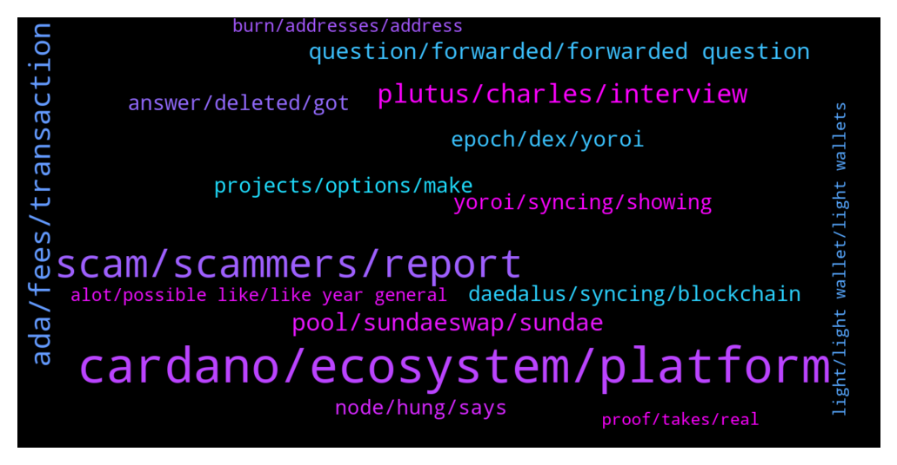

# **@Cardano**
 ## Analysis for **2022-01-09** - **2022-01-16**.

---

## 📊 **Basic Stats**

**n_messages_sent**: 605

---

---

## 🔝 **Top keywords and related messages**

1. **cardano, ecosystem, platform**

    @cryptowolfRSA --- *Good day,  I need some assistance, I need to send my cardano from Binance to Yori. Can anyone walk me through the whole process?* **--->** [TG Discussion](https://t.me/Cardano/765973)

    @Kharlyp --- *I exchange my cardano to lisk and it’s been pending for months now* **--->** [TG Discussion](https://t.me/Cardano/766407)

    @the_boxer12 --- *Cardano overwhelms Ethereum on all of indexes https://twitter.com/cardaofinance/status/1478978919030456321* **--->** [TG Discussion](https://t.me/Cardano/766185)

    @Juanlot --- *hello here you can see the cardano projects https://www.cardanocube.io/* **--->** [TG Discussion](https://t.me/Cardano/766972)

    @veriumfellow --- *Please vote for Ergo my Cardano friends https://twitter.com/nicehashmining/status/1480630789264093191?s=21* **--->** [TG Discussion](https://t.me/Cardano/767968)

    @silbererde1 --- *SNET ecosystem on cardano soon?   https://www.reddit.com/r/cardano/comments/ryd4wa/snetecosystem_on_cardano_soon/?utm_medium=android_app&utm_source=share* **--->** [TG Discussion](https://t.me/Cardano/766699)

2. **scam, scammers, report**

    @apex_pool_spo --- *no, verify at least before saying it's a scam, or don't say anything.* **--->** [TG Discussion](https://t.me/Cardano/767335)

    @Albert --- *Well I was looking for an admin couse a couple members of this group are trying to scam me and wanted to report them couse I have pictures. I can't even find the message I sent I guess someone deleted it* **--->** [TG Discussion](https://t.me/Cardano/765726)

    @yosweetmama --- *Honestly i didnt even check the link, but links are mostly scam so i said this, sorry if its not a scam😂* **--->** [TG Discussion](https://t.me/Cardano/767327)

    @Lgbeano --- *No worries at all. P.s. I will not be sending you a DM if you do receive one from an account looking like mine or anyone else's* **--->** [TG Discussion](https://t.me/Cardano/765884)

    @AB’z --- *Yeah it opened a dm first thn there is a link for the forum.* **--->** [TG Discussion](https://t.me/Cardano/768569)

    @avishai4791 --- *Hello admin can i dm you regarding a problem?* **--->** [TG Discussion](https://t.me/Cardano/769300)

3. **ada, fees, transaction**

    @trustfuland --- *Hello. I want to stake my ADA on Daedalus, do I have to keep it open? Or I can close the program once I have my Ada in there?* **--->** [TG Discussion](https://t.me/Cardano/768828)

    @Alex --- *Any one know any thing about being able to stake and lend Ada at the same time ?* **--->** [TG Discussion](https://t.me/Cardano/767563)

    @ZeusZolta --- *Hello. I need recommendations, where I should hold my ada? Metamask Ledger* **--->** [TG Discussion](https://t.me/Cardano/767751)

    @PipSqueak --- *I think ADA tx fees used fixed at 0.16. I now see it sometimes 0.18, 0.19. Updated for fluctuating fees???* **--->** [TG Discussion](https://t.me/Cardano/767544)

    @FIFTYONE_50 --- *Trying to refresh my memory here regarding the specifics on babel fees but before i dig in again figured i would ask here. When sending a native asset this way does it still require me as the sender to include the minimum amount of ada to move with the asset and the fee is just covered or is it both the minimum and transaction fee?* **--->** [TG Discussion](https://t.me/Cardano/768814)

    @lassikem --- *There is only ‘custom amount’ and ‘send all ada + tokens’* **--->** [TG Discussion](https://t.me/Cardano/768280)

4. **plutus, charles, interview**

    @Scott --- *Fantastic interview! Well worth a watch.* **--->** [TG Discussion](https://t.me/Cardano/768097)

    @full_measure --- *anyone can help me? it seems I failed the validation for the discord of the plutus pioneer program but I'm not a bot 😂* **--->** [TG Discussion](https://t.me/Cardano/767616)

    @mensrea --- *Thanks for clarifying Charles. Understandably he's a private person – maybe it's just the timing because it would be amazing to have him (active on IOG of course) and Well Typed joining forces with MLabs with all the work on Plutonomicon/Plutus optimizations to get these things right. Best to get inputs straight from the original architect in that sense.... at least we have the defi alliance now hopefully converging on best practices. But looking forward to Duncan's return regardless. Surely even the general Haskell community is missing him 👍* **--->** [TG Discussion](https://t.me/Cardano/765050)

    @glitch04 --- *Might try the discord listed above ^* **--->** [TG Discussion](https://t.me/Cardano/767823)

    @Apath00 --- *That was great... Check this one out also https://twitter.com/CardanoConvo/status/1480952160997232650?s=20* **--->** [TG Discussion](https://t.me/Cardano/768138)

    @glitch04 --- *Live chat with Charles AMA on Twitter spaces  https://twitter.com/i/spaces/1OwGWzbpoQpKQ* **--->** [TG Discussion](https://t.me/Cardano/768601)

5. **pool, sundaeswap, sundae**

    @mostudio --- *If you stake using one of the Ada wallets mentioned and add your ada to an official sundaeswap scooper pool, you will also receive sundae tokens.* **--->** [TG Discussion](https://t.me/Cardano/767986)

    @milhk --- *I have already delegated to a staking pool to participate in SundaeSwap ISO. I want to buy more ADA and increase my stake but on the staking pool that I'm currently using, the delegate button is grayed out. Does it mean I cannot participate anymore?* **--->** [TG Discussion](https://t.me/Cardano/765193)

    @trisha231 --- *Please is there a precise delegate to use, to be able to participate in the SundaeSwap ISO* **--->** [TG Discussion](https://t.me/Cardano/765226)

    @milhk --- *Am I too late to participate in SundaeSwap ISO?* **--->** [TG Discussion](https://t.me/Cardano/765182)

    @Paulo_Figueiredo14 --- *Any idea when Sundae will begin the ISO?* **--->** [TG Discussion](https://t.me/Cardano/765027)

    @soup34 --- *If I take my coins from the pool and put them in another pool, will my NFT remain?* **--->** [TG Discussion](https://t.me/Cardano/766798)

6. **question, forwarded, forwarded question**

    @glitch04 --- *Read the link posted directly above your question* **--->** [TG Discussion](https://t.me/Cardano/768484)

    @glitch04 --- *Forwarded the question if I hear back will post the update.* **--->** [TG Discussion](https://t.me/Cardano/765043)

    @apex_pool_spo --- *this does not look like an appology to me: https://t.me/Cardano/767327 and I'm out of the discussion.* **--->** [TG Discussion](https://t.me/Cardano/767338)

    @glitch04 --- *link should direct you to https://forum.cardano.org/* **--->** [TG Discussion](https://t.me/Cardano/768570)

    @yosweetmama --- *It's ridiculous that you're still continuing this discussion. I said something and I apologized for it, if you have a talent for turning back time, tell me your secret, maybe I'll make it up* **--->** [TG Discussion](https://t.me/Cardano/767337)

    @yosweetmama --- *So should i say sorry for 800 times or something?* **--->** [TG Discussion](https://t.me/Cardano/767333)

7. **epoch, dex, yoroi**

    @glitch04 --- *It's not limited to Yoroi at the epoch transition though* **--->** [TG Discussion](https://t.me/Cardano/769449)

    @addcrypto3 --- *When yoroi will be compatible with dapps?* **--->** [TG Discussion](https://t.me/Cardano/767184)

    @frenske1 --- *Not just talking about the epoch Transition time tho, unfortunately.* **--->** [TG Discussion](https://t.me/Cardano/769452)

    @DarfADA --- *I understand you’ve got to claim every epoch, so is it best to time it towards the end of an epoch?* **--->** [TG Discussion](https://t.me/Cardano/769583)

    @glitch04 --- *Yoroi is working on it but in the meantime there are great alternatives being built with even more features* **--->** [TG Discussion](https://t.me/Cardano/769454)

    @Zyroxa --- *I cant even disagree with your statement... its really sad that Yoroi is so behind with the development....* **--->** [TG Discussion](https://t.me/Cardano/769448)

8. **daedalus, syncing, blockchain**

    @aw77jc --- *Hello is there a way to speed up the syncing process in the Daedalus wallet? Been syncing for several days.* **--->** [TG Discussion](https://t.me/Cardano/766000)

    @siamstudio --- *I tried to use the wallet Adalite.io, but it does not display funds as they were before Daedalus. I cant upload all blockchain 🙁* **--->** [TG Discussion](https://t.me/Cardano/765501)

    @siamstudio --- *I try install Daedalus but I cant need download all blochain* **--->** [TG Discussion](https://t.me/Cardano/765483)

    @Julius --- *Aww dang how depressing... daedalus getting slower to launch as time goes by.  Used to connect to the chain relatively quickly in the past...* **--->** [TG Discussion](https://t.me/Cardano/765827)

    @apex_pool_spo --- *Daedalus is only working on PCs and needs to download the whole blockchain. Adalite.io can also restore 12 words wallets. It is an official wallet, but be careful.* **--->** [TG Discussion](https://t.me/Cardano/765484)

    @ThinkLater --- *Is there an issue with the Daedalus network?* **--->** [TG Discussion](https://t.me/Cardano/766441)

9. **projects, options, make**

    @glitch04 --- *Not sure that is the goal, both are on their own path and there is plenty of room for multiple projects in the space* **--->** [TG Discussion](https://t.me/Cardano/767209)

    @glitch04 --- *That's the thing about being opensource others have time to build their own projects while the core focuses on building the core* **--->** [TG Discussion](https://t.me/Cardano/767193)

    @Deji --- *I don't know where they rank them at, but this site has a good list of the projects. https://www.cardanocube.io/* **--->** [TG Discussion](https://t.me/Cardano/768415)

    @glitch04 --- *That will likely arrive when the projects finish their testing and audits different defi platforms will have liquidity options that you can pool and stake not sure which but there are a few projects in the works that have mentioned it* **--->** [TG Discussion](https://t.me/Cardano/767572)

    @glitch04 --- *Projects are independent and will launch on their own schedule however you can already make trades on the available muesliswap platform if so inclined. There will be multiple other options launch in the next 1-6 months or that intend to launch but for more information on their timelines you would have to ask those projects.* **--->** [TG Discussion](https://t.me/Cardano/766482)

    @glitch04 --- *That is a question for those projects each one handles them differently it's best to ask them direct* **--->** [TG Discussion](https://t.me/Cardano/765874)

10. **answer, deleted, got**

    @erictaneric --- *the second sentence got me well 🤣* **--->** [TG Discussion](https://t.me/Cardano/768590)

    @Roland --- *maybe you are and just dont know it* **--->** [TG Discussion](https://t.me/Cardano/767632)

    @emre4215 --- *i have no idea i wish i knew the answer😔* **--->** [TG Discussion](https://t.me/Cardano/766554)

    @Anviant --- *Why did you write it like that? Lol* **--->** [TG Discussion](https://t.me/Cardano/768736)

    @full_measure --- *don't know man, I feel like I'm not 😕* **--->** [TG Discussion](https://t.me/Cardano/767633)

    @EIorpar --- *I am watching you, put your face* **--->** [TG Discussion](https://t.me/Cardano/765952)

11. **yoroi, syncing, showing**

    @BinK18 --- *yoroi is having synchronization issues- as always* **--->** [TG Discussion](https://t.me/Cardano/769469)

    @frenske1 --- *It's unbelievable how bad Yoroi has gotten since Sebastian left. For both wallets I've been waiting 5+ minutes to sync, C's become O's, etc etc etc. Crazy how one-developer ventures have been able to absolutely overclass Yoroi such as cccault, NAMI and Gero wallet. Applause to them* **--->** [TG Discussion](https://t.me/Cardano/769447)

    @gauthamnag --- *Any issue Yorio web wallet not syncing at all , trying since 3 hours it keeps rotating simply* **--->** [TG Discussion](https://t.me/Cardano/769675)

    @EhmReally --- *Yoroi wallet auto disabled by browser because it wanted more permissions* **--->** [TG Discussion](https://t.me/Cardano/768308)

    @MarkMorenz --- *Anyone having issues with yoroi wallet* **--->** [TG Discussion](https://t.me/Cardano/767863)

    @SilentCam --- *Would like to know the reason why Yoroi needs to be able to read and change data on the websites you visit* **--->** [TG Discussion](https://t.me/Cardano/768483)

12. **node, hung, says**

    @glitch04 --- *if you get another node crash try a reboot and see if that helps something might be stuck in the background* **--->** [TG Discussion](https://t.me/Cardano/765860)

    @glitch04 --- *Right but it can still exit in a hung state, if it does that means it was killed before the process was cleanly exited which causes the extended check on startup* **--->** [TG Discussion](https://t.me/Cardano/765844)

    @Julius --- *I see. How do i avoid the hung state?  It just says stopping cardano node...* **--->** [TG Discussion](https://t.me/Cardano/765847)

    @Julius --- *Must just be one of those days.  Usually it fixes itself after a day or so.  First time getting a crash on closure though.* **--->** [TG Discussion](https://t.me/Cardano/765856)

    @glitch04 --- *You can close it however the longer left closed the longer it will take to resync later when you reopen it* **--->** [TG Discussion](https://t.me/Cardano/768898)

    @Julius --- *I guess the progress is what's bothering me.  Not sure if it's hung or not.  Ahh and now I'm penalized from cnft.  Although I guess it was my fault for assuming it would launch smoothly this time around.  Oh...it says node crashed...* **--->** [TG Discussion](https://t.me/Cardano/765853)

13. **alot, possible like, like year general**

    @Мишель --- *It's been too many these last few days for me !* **--->** [TG Discussion](https://t.me/Cardano/768712)

    @orangeboxphoto --- *Hey guys does anyone have a link to when next hfc event will be and what's in that update this quarter* **--->** [TG Discussion](https://t.me/Cardano/767657)

    @kiwicryptoT --- *So yeah, I’m super excited to see a cnt finally on a T1 Cex. Just hoping all the drama today doesn’t distract from that* **--->** [TG Discussion](https://t.me/Cardano/766562)

    @... --- *Screen shot this: next week we Will have alot of announcements. I can deel it* **--->** [TG Discussion](https://t.me/Cardano/766061)

    @retrostakepool --- *There's a lot more coming to their platform too.* **--->** [TG Discussion](https://t.me/Cardano/768966)

    @ExInfernis --- *Still not sure when will start* **--->** [TG Discussion](https://t.me/Cardano/765258)

14. **burn, addresses, address**

    @PipSqueak --- *What if gifting is not an option? I am pointing to NFTs and tokens which are deemed inappropriate. Could be an abusive letter sent to the recipient, etc.* **--->** [TG Discussion](https://t.me/Cardano/765330)

    @glitch04 --- *There are a few created burn addresses but that also burns your own ada that is bound to those transfers..* **--->** [TG Discussion](https://t.me/Cardano/765141)

    @PipSqueak --- *Just a thought, how do we burn tokens we don’t want. I claimed a lot on dripdropz, I am not sure I want to keep all of them as some seem useless. Basically, I know CH is against burning ada but I am thinking in terms of burning things like inappropriate tokens or abusive NFTs.* **--->** [TG Discussion](https://t.me/Cardano/765138)

    @JavierMal --- *Hi guys, quick question: are Yoroi's "used" addresses still valid for sending ADA?* **--->** [TG Discussion](https://t.me/Cardano/766997)

    @Giovanni --- *Do I have to transfer my ADAs to an exchange to sell my ADAs? Can't sell directly from the wallet? Isn't it better to use exchanges directly at this point?* **--->** [TG Discussion](https://t.me/Cardano/765921)

    @glitch04 --- *So gifting them is an option or returning them to the same address but you still will lose some ada along the way* **--->** [TG Discussion](https://t.me/Cardano/765142)

15. **proof, takes, real**

    @Grip9 --- *it should take 3 month! so show us all a proof in 3 month that its realy happening.  do you take the challenge to proof its real?* **--->** [TG Discussion](https://t.me/Cardano/768549)

    @Grip9 --- *"will be" soo its not useing any tracking or proof that it did it for real till to day?* **--->** [TG Discussion](https://t.me/Cardano/768535)

    @glitch04 --- *Just because you assume it takes 3 months does not make that how long the process takes and its only been around 3 days since funding..* **--->** [TG Discussion](https://t.me/Cardano/768551)

    @klausinthehaus --- *agree but unfortunately its not like that* **--->** [TG Discussion](https://t.me/Cardano/767211)

    @apex_pool_spo --- *then don't say it is not easy.* **--->** [TG Discussion](https://t.me/Cardano/766555)

    @apex_pool_spo --- *that's a difficult one, especially if it's for the first child.* **--->** [TG Discussion](https://t.me/Cardano/764877)

