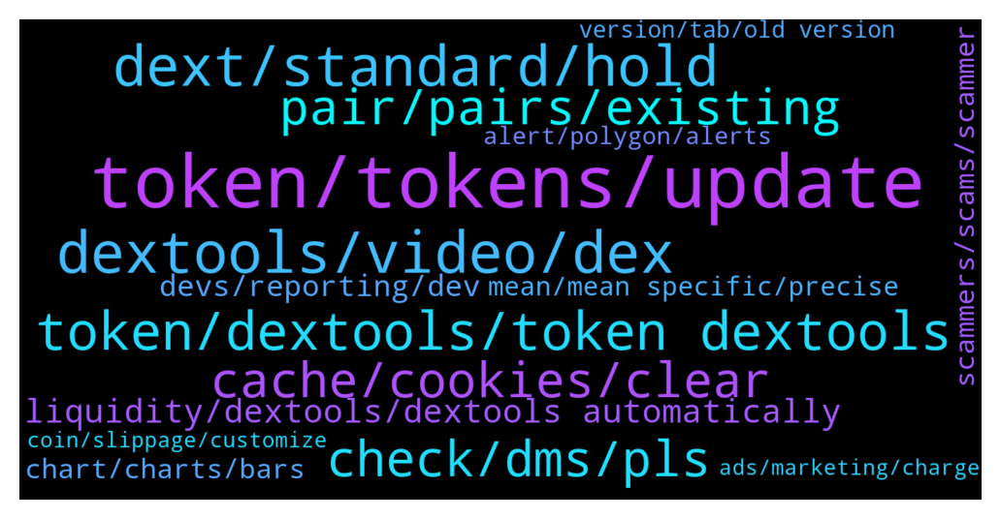

# **@DEXToolsCommunity**
 ## Analysis for **2022-01-09** - **2022-01-16**.

---

## 📊 **Basic Stats**

**n_messages_sent**: 1138

---

---

## 🔝 **Top keywords and related messages**

1. **token, tokens, update**

    @hmk18990 --- *To update Social Information for your token, please update etherscan.io or bscscan.com & update information on coinmarketcap.com and coingecko.com* **--->** [TG Discussion](https://t.me/DEXToolsCommunity/322058)

    @stanes --- *Np, just let few hours for our devs to take care of it.  Others tokens with the same name can't be considered as "fraudulent" because anybody is free to list a token with this name. We never remove anything, we display what is available on the blockchain.  But once your token is live on our website it will be on the first result if it's the one with the most txs.* **--->** [TG Discussion](https://t.me/DEXToolsCommunity/322129)

    @stanes --- *The first 31pt is the socials.  About social Information for your token, please update etherscan.io or bscscan.com or coingecko.com  We pull info from there.* **--->** [TG Discussion](https://t.me/DEXToolsCommunity/323447)

    @Shauno73 --- *Thanks for vid. I'm pretty well versed in this stuff. Since update I've found this issue. Shows wallet address that's connected currently, but does not give me access to the plan that my tokens activate. Strange one, but I'll work it out once I've been able to disconnect and reconnect. That's all it needs. A refreshed connection.* **--->** [TG Discussion](https://t.me/DEXToolsCommunity/322778)

    @grathius --- *Guys, do you know any sites/platforms/applications/scripts/bots/portfolio trackers, etc., where you can watch tokens in this format? if there are resources with changes over the last 2, 3, 4, 5 hours, then it’s generally ideal* **--->** [TG Discussion](https://t.me/DEXToolsCommunity/325346)

    @murej3 --- *Admin please I want to to trend my token on your website* **--->** [TG Discussion](https://t.me/DEXToolsCommunity/325066)

2. **dextools, video, dex**

    @C1T1Z3N --- *Is there any Dextools info on KCC projects? Trying to explore more chains.* **--->** [TG Discussion](https://t.me/DEXToolsCommunity/321795)

    @stanes --- *You should probably step down from trading on DEXs until you understand how things work.  Blaming people for your own lack of research will never help you. Wish you the best 👍* **--->** [TG Discussion](https://t.me/DEXToolsCommunity/322643)

    @imuresan --- *Ok. This is just a test. I just wrote a lengthy feedback on the new look of Dextools and it didn't not get posted.* **--->** [TG Discussion](https://t.me/DEXToolsCommunity/322013)

    @hmk18990 --- *nope I'm %100 direct connection to the outer world (including dextools)* **--->** [TG Discussion](https://t.me/DEXToolsCommunity/322390)

    @stanes --- *Possible yes. Are you part of the team of this DEX?* **--->** [TG Discussion](https://t.me/DEXToolsCommunity/322300)

    @bonetky --- *But Dextools runs very well always, todays was an exception* **--->** [TG Discussion](https://t.me/DEXToolsCommunity/323268)

3. **dext, standard, hold**

    @stanes --- *Hi, not sure what you mean, to access standard membership you need your 1k DEXT to be in one single wallet.* **--->** [TG Discussion](https://t.me/DEXToolsCommunity/325394)

    @AlinCZ --- *guys do i need to do something else beside holding more than 1k DEXT tokens in my wallet to get the benefits of the Standard tier?  because i have more than 1k in my wallet but i still have only 10 favorite pairs* **--->** [TG Discussion](https://t.me/DEXToolsCommunity/323316)

    @zhengshui1977 --- *What are the requirements for a standard member now? The homepage says to pay $100 in DEXT/monthly subscription, -or -1,000 DEXT/hold. It says yes in the app 1. Hold 1.000 DEXT in the wallet 2 - Transfer 278 DEXT from your current wallet to 0x469d342e4f3d9ffbedca2e2ca8ab268a6fe973c3* **--->** [TG Discussion](https://t.me/DEXToolsCommunity/323436)

    @stanes --- *Hi. If you don't have 1k DEXT in your wallet you should have a message telling you how many DEXT you have to send to an address to activate the standard plan.* **--->** [TG Discussion](https://t.me/DEXToolsCommunity/322910)

    @stanes --- *You can hold 1k DEXT or pay the monthly membership. For that, connect your wallet to the app and follow instructions: https://www.dextools.io/app/user/account* **--->** [TG Discussion](https://t.me/DEXToolsCommunity/325005)

    @challengingmind --- *So if you want to buy or sell (limit) we need to use this tool but first have 1k dext in the wallet and send 258 to the wallet as stated on the website    Is this correct ?* **--->** [TG Discussion](https://t.me/DEXToolsCommunity/323078)

4. **token, dextools, token dextools**

    @DEXTOOLS34 --- *I want to trend my token on dextools who can I pm* **--->** [TG Discussion](https://t.me/DEXToolsCommunity/324559)

    @Yokamox --- *How to submit request for update regarding my token ( Jacy ) in dextools?* **--->** [TG Discussion](https://t.me/DEXToolsCommunity/324451)

    @vucky084 --- *Thanks. How I can find our token on dextool as there are lot of fake tokens there* **--->** [TG Discussion](https://t.me/DEXToolsCommunity/323958)

    @Terryjunior --- *Hi  Our token got listed on Pancakeswap since the 18th of December and is not appearing on dextools.  People talk about API CALL. PLEASE can you help?  Flashtoken  💥OFFICIAL CONTRACT:   0x311e015e2e255dd14eddc4a2107e39649dc81c5d* **--->** [TG Discussion](https://t.me/DEXToolsCommunity/322694)

    @CliffordGrows --- *Is there anyone who has a youtube link or info on how to do a dextools pairing for a token? Thank you!* **--->** [TG Discussion](https://t.me/DEXToolsCommunity/322073)

    @Ayim --- *Okk I know  Let me start by asking if i can swap or buy token frm dextool* **--->** [TG Discussion](https://t.me/DEXToolsCommunity/322203)

5. **check, dms, pls**

    @stanes --- *Ahahaha how many of you in this chat + in DM? 😅* **--->** [TG Discussion](https://t.me/DEXToolsCommunity/322275)

    @creatstep --- *Could you check DM? I hope its not too late :)* **--->** [TG Discussion](https://t.me/DEXToolsCommunity/323593)

    @Thesios --- *which I am trying to get an official CPM per zone , But I have not see anything official yet* **--->** [TG Discussion](https://t.me/DEXToolsCommunity/322711)

    @napascual --- *Hey could you dm me before doing that?* **--->** [TG Discussion](https://t.me/DEXToolsCommunity/322591)

    @napascual --- *Feel free to dm me for the original pc issue, we could go through it now* **--->** [TG Discussion](https://t.me/DEXToolsCommunity/322593)

    @stanes --- *Can you send me some links with with this issue in DM please?* **--->** [TG Discussion](https://t.me/DEXToolsCommunity/322322)

6. **cache, cookies, clear**

    @bastardganpunk --- *Still not working? Check you have a stable internet connection and your cache cleared. It should work then. Maybe even restarting your computer.* **--->** [TG Discussion](https://t.me/DEXToolsCommunity/321610)

    @bastardganpunk --- *you might need to clear your cache and try again. but the way you tried to do it is correct* **--->** [TG Discussion](https://t.me/DEXToolsCommunity/322894)

    @wo62gg --- *it said No data to display* **--->** [TG Discussion](https://t.me/DEXToolsCommunity/325128)

    @bonetky --- *Okay, because does not load since a few hours. I can load the rest of webpages* **--->** [TG Discussion](https://t.me/DEXToolsCommunity/323246)

    @hmk18990 --- *nope, you should check your browser settings (may be browser cleaning up cookies on exit) or you should check your antivirus (some antiviruses have settings to cleanup cookies) or you should cleanup cookies manually and try again* **--->** [TG Discussion](https://t.me/DEXToolsCommunity/324988)

    @borntochas3 --- *yea it worked after clearing cache and restarting my pc, i had it on for a few weeks now that might be the issue* **--->** [TG Discussion](https://t.me/DEXToolsCommunity/322286)

7. **pair, pairs, existing**

    @ATX_987 --- *Are you having issues? At least on of your pairs is about 3 hours behind right now (0xb2ba36ee6ba6113a914f3e8812a0df094dec5994)* **--->** [TG Discussion](https://t.me/DEXToolsCommunity/324546)

    @王多鱼 --- *It keeps coming up Pair not found* **--->** [TG Discussion](https://t.me/DEXToolsCommunity/323065)

    @stanes --- *Can you give me the pair address having this issue please?* **--->** [TG Discussion](https://t.me/DEXToolsCommunity/323672)

    @FredericDEXT --- *Ok, brave, and it happens with every pair?* **--->** [TG Discussion](https://t.me/DEXToolsCommunity/323288)

    @stanes --- *Ok, thanks, any specific pair? I don't see any pb with some random ones.* **--->** [TG Discussion](https://t.me/DEXToolsCommunity/324803)

    @nate102 --- *I’ve actually noticed the data bug on a few pairs btw do u want me to send in some?* **--->** [TG Discussion](https://t.me/DEXToolsCommunity/324623)

8. **liquidity, dextools, dextools automatically**

    @stanes --- *Fixed. You can now find your pair on Dextools. Sorry for the delay.* **--->** [TG Discussion](https://t.me/DEXToolsCommunity/322292)

    @jmorfeo --- *on the same project dextscore is different if I see a pair or another ...* **--->** [TG Discussion](https://t.me/DEXToolsCommunity/321782)

    @cryptoshine1206 --- *It shows only for DEXT but not for other pairs* **--->** [TG Discussion](https://t.me/DEXToolsCommunity/323152)

    @stanes --- *Hi. The exact algorithm is undisclosed but it's mainly the number of people watching the pair on Dextools.* **--->** [TG Discussion](https://t.me/DEXToolsCommunity/325511)

    @Tramplr --- *I created a new pair on Quickswap.  Does it have to be certain size to get listed on DexTools? What causes it to get listed?* **--->** [TG Discussion](https://t.me/DEXToolsCommunity/322151)

    @hmk18990 --- *if liq. is added in pancake then you'll see it soon in dextools. did you try to search for your contract in the search bar? (no need to add anything in dextools)* **--->** [TG Discussion](https://t.me/DEXToolsCommunity/322108)

9. **devs, reporting, dev**

    @stanes --- *Ok, forwarding that to the devs rn, thanks for reporting.* **--->** [TG Discussion](https://t.me/DEXToolsCommunity/321553)

    @bastardganpunk --- *thank you, the devs are on it 🙂* **--->** [TG Discussion](https://t.me/DEXToolsCommunity/324634)

    @bastardganpunk --- *devs are checking… something is not correct here 😄* **--->** [TG Discussion](https://t.me/DEXToolsCommunity/324612)

    @bastardganpunk --- *ok, i will forward it to the devs. let’s see what they can do 🙂* **--->** [TG Discussion](https://t.me/DEXToolsCommunity/322364)

    @cactusjimm --- *Hi, did the dev's come back on this one?* **--->** [TG Discussion](https://t.me/DEXToolsCommunity/323774)

    @Elcocote --- *@stanes tell dev that I received notification now. Maybe they have changed something* **--->** [TG Discussion](https://t.me/DEXToolsCommunity/321563)

10. **scammers, scams, scammer**

    @solDevW3 --- *This excuse is unacceptable. You need to be more proactive as to ensure scams are not listed on your platform. This will go very far to help investors in their efforts not to get scammed. This will also help the market and your business fight back against bad actors. Your lame excuse is encouraging the continued listing of these scam projects. I suppose yo will only take action when you’re sued and have to pay a few millions to a class action of investors fed up with this lacks approach to security.* **--->** [TG Discussion](https://t.me/DEXToolsCommunity/322624)

    @stanes --- *@DinkoChief be careful, it was a scammer handle.* **--->** [TG Discussion](https://t.me/DEXToolsCommunity/321433)

    @stanes --- *Please be aware we can't avoid scams being created. We also can't stop smartcontracts doing what they are programmed to do.  We have some ways to alert people of a scam like the "contract details" and the community votes. Can we do more? Yes, we are working on adding more tools to reduce the risk for our users to fall into scams. But be sure there is no way to be secure if you don't DYOR.* **--->** [TG Discussion](https://t.me/DEXToolsCommunity/325424)

    @creatstep --- *Guys, there are so much scammers out there who trying to pretend you . My gosh 🤦‍♂️* **--->** [TG Discussion](https://t.me/DEXToolsCommunity/323599)

    @dazedcrypto --- *Hey! im getting hundreds of messages from scammers telling me they can list me on your site* **--->** [TG Discussion](https://t.me/DEXToolsCommunity/321284)

    @stanes --- *Yeah, we know, this chat is full of scammers. Unfortunately, nothing we can do except warning users. Please report the scammers contacting you, thanks!* **--->** [TG Discussion](https://t.me/DEXToolsCommunity/323415)

11. **chart, charts, bars**

    @Bobolee1 --- *Yes where I have circled. How do I prevent the negatives from appearing on my chart. I think that's my problem* **--->** [TG Discussion](https://t.me/DEXToolsCommunity/322916)

    @mf1495 --- *No charts opening for me since the UI update* **--->** [TG Discussion](https://t.me/DEXToolsCommunity/322433)

    @Bobolee1 --- *My charts displays as a single horizontal line. I have also realized that negative figures are also displayed. How do I make my chart displays as bars?* **--->** [TG Discussion](https://t.me/DEXToolsCommunity/322854)

    @Bobolee1 --- *When I view charts, the bars are all aligned on a vertical straight line. How do I correct this?* **--->** [TG Discussion](https://t.me/DEXToolsCommunity/322318)

    @Flashbang665 --- *hi, any admin online? (f&ckying scammers dont botther me with your dms...)  The save chart functionality doesn't work for me. When I want to load a saved chart, it doesn't list any charts* **--->** [TG Discussion](https://t.me/DEXToolsCommunity/322449)

    @MarkusLangebraun --- *but can’t find chart types inshow examples can anyone tell the difference* **--->** [TG Discussion](https://t.me/DEXToolsCommunity/321233)

12. **mean, mean specific, precise**

    @bastardganpunk --- *what do you mean by that, can you be more specific please?* **--->** [TG Discussion](https://t.me/DEXToolsCommunity/325231)

    @Aloys_93 --- *I suggest making that more clearer on website though, if info is there, couldn't find it* **--->** [TG Discussion](https://t.me/DEXToolsCommunity/323200)

    @cactusjimm --- *anyone know answer to this q?* **--->** [TG Discussion](https://t.me/DEXToolsCommunity/322377)

    @bastardganpunk --- *i think you mean this one? https://www.dextools.io/app/bsc/pair-explorer/0x84d75c398ea09fa8f2b803d6b4b0cdea148e5e9c* **--->** [TG Discussion](https://t.me/DEXToolsCommunity/324827)

    @FredericDEXT --- *Thanks for the info, that helps a lot* **--->** [TG Discussion](https://t.me/DEXToolsCommunity/323291)

    @H0nKl3R --- *Thanks, I cant seem to figure this out.* **--->** [TG Discussion](https://t.me/DEXToolsCommunity/321656)

13. **alert, polygon, alerts**

    @bastardganpunk --- *which alert exactly are you talking about? i’m getting alerts under 1$* **--->** [TG Discussion](https://t.me/DEXToolsCommunity/324221)

    @rpoole69 --- *Just an FYI, the price alert bug hasn't been corrected yet, unless you prefix the alert price with 0. (for amounts under 1$) it will not save, @bastardganpunk could you please let the devs know, thanks!* **--->** [TG Discussion](https://t.me/DEXToolsCommunity/324219)

    @jamesharris279 --- *ethereum, I just try and set the alerts but it never saves* **--->** [TG Discussion](https://t.me/DEXToolsCommunity/321894)

    @stanes --- *Was reported few days ago: if you try to set the  alert without the 0 it doesn't save.* **--->** [TG Discussion](https://t.me/DEXToolsCommunity/324225)

    @zhengshui1977 --- *Thanks a lot, it's all set. Just a question, can the alarm only use USD as the trigger price? I think: 1. Alarm when btrfly/eth >1.1 2. Alarm when btrfly/eth < 1 How to set it up?* **--->** [TG Discussion](https://t.me/DEXToolsCommunity/323473)

    @cactusjimm --- *Thanks for coming back. Any rough ETA on cronos alerts via dextools?* **--->** [TG Discussion](https://t.me/DEXToolsCommunity/323776)

14. **version, tab, old version**

    @KDawgPL --- *had to come in and let you know how disgusting the new UI is. thought u would have changed it by now wtf* **--->** [TG Discussion](https://t.me/DEXToolsCommunity/325253)

    @z123456789zzn --- *How to switch the old version of the interface* **--->** [TG Discussion](https://t.me/DEXToolsCommunity/323807)

    @BitSc0tt --- *last month i had a nice tab. Now there is nothing.* **--->** [TG Discussion](https://t.me/DEXToolsCommunity/324666)

    @BitSc0tt --- *Where is the tab so i can upgrade?* **--->** [TG Discussion](https://t.me/DEXToolsCommunity/324672)

    @mf1495 --- *Is something wrong with the new UI?* **--->** [TG Discussion](https://t.me/DEXToolsCommunity/322434)

    @BitSc0tt --- *You've shown me a picture of the different subscriptions, but is there a tab to click on? how does one upgrade?* **--->** [TG Discussion](https://t.me/DEXToolsCommunity/324676)

15. **ads, marketing, charge**

    @bastardganpunk --- *For ads and marketing please send a DM to @guillermorodriguez78 🙂* **--->** [TG Discussion](https://t.me/DEXToolsCommunity/325302)

    @stanes --- *I am official. And I can assure you it's not possible to buy hot spots. But they can buy ads ofc.* **--->** [TG Discussion](https://t.me/DEXToolsCommunity/321712)

    @vika_proger --- *Hello everyone. How to buy advertising on the site? Write to me in private messages please* **--->** [TG Discussion](https://t.me/DEXToolsCommunity/321531)

    @bastardganpunk --- *oh ok sorry 😄 for ads and marketing please contact @guillermorodriguez78 he’s in charge of that and will answer you asap.   please be aware, no admin will dm you first, be aware of scammers* **--->** [TG Discussion](https://t.me/DEXToolsCommunity/321972)

    @calebdesigns --- *@bastardganpunki am a  graphics designer, I’ve worked with alot of project in the past creating  NFts,stickers,logos, banners, flyers, promotional videos, gifs, memes and i also design website. If you are interested in any  or wants to learn any please kindly message me.* **--->** [TG Discussion](https://t.me/DEXToolsCommunity/325311)

    @Dage --- *I want to advertise on the platform. Who can I contact?* **--->** [TG Discussion](https://t.me/DEXToolsCommunity/324439)

