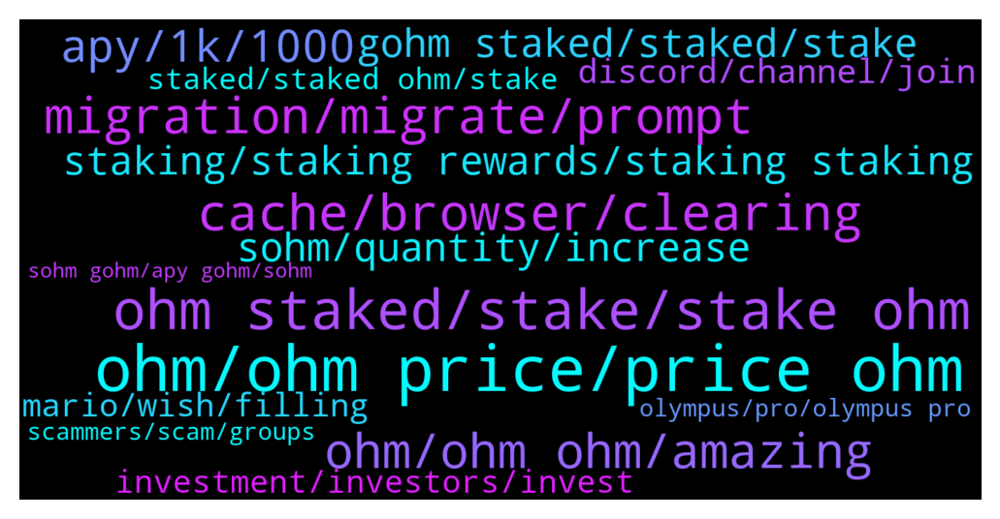

# **@OlympusTG**
 ## Analysis for **2022-01-09** - **2022-01-16**.

---

## 📊 **Basic Stats**

**n_messages_sent**: 5584

---

---

## 🔝 **Top keywords and related messages**

1. **ohm, ohm price, price ohm**

    @mandingo_0 --- *if you look at the price chart since Oct ohm has just been gradually going down, there has not been one bounce. Is this volatility?  Or is it going to continue going down?* **--->** [TG Discussion](https://t.me/OlympusTG/150871)

    @mario_99990 --- *Why time passed ohm in market cap ?* **--->** [TG Discussion](https://t.me/OlympusTG/148585)

    @huangkaoya --- *hello， why ohm's riskfree assets went down rapidly yesterday?* **--->** [TG Discussion](https://t.me/OlympusTG/149267)

    @dolph2043 --- *why is blockfolio reporting wrong OHM price* **--->** [TG Discussion](https://t.me/OlympusTG/150109)

    @Andr3w_1 --- *Just to put that into perspective. I invested into OHM a month ago and some change and price is -63% from when I first bought. My nominal portfolio value is -47٪. The power of compounding makes price irrelevant in the long run.* **--->** [TG Discussion](https://t.me/OlympusTG/148212)

    @cdp279 --- *I think ohm price has had its bottom. If the market remains stable / go up* **--->** [TG Discussion](https://t.me/OlympusTG/141175)

2. **ohm staked, stake, stake ohm**

    @prashantmasih --- *Hi all, my staked ohm is not growing and rewards are not being added. Its staying the same* **--->** [TG Discussion](https://t.me/OlympusTG/148931)

    @Chad --- *Just bought 28.5 OHM and stakes today* **--->** [TG Discussion](https://t.me/OlympusTG/150184)

    @Robbert --- *So contract of my staked ohm on ethscan is: 0x31932....aee77fbbe. is this correct or do I hold scam coins?* **--->** [TG Discussion](https://t.me/OlympusTG/140462)

    @Crypto --- *I want OHM and to be staked on coinbase wallet* **--->** [TG Discussion](https://t.me/OlympusTG/145566)

    @manytopia --- *Why os the dapp asking me to approve OHM to stake if i staked before from same wallet and approved before* **--->** [TG Discussion](https://t.me/OlympusTG/141750)

    @BCdev95 --- *I don’t get it. I wanted to stake more OHMs, but it says i need to pay gas fee again to approve staking while I already paid once.* **--->** [TG Discussion](https://t.me/OlympusTG/145193)

3. **cache, browser, clearing**

    @Robbert --- *I will try Firefox browser now* **--->** [TG Discussion](https://t.me/OlympusTG/141490)

    @Bracin --- *Please help I’m having same issue right now and I tried clearing my cache too* **--->** [TG Discussion](https://t.me/OlympusTG/149515)

    @Ap0l1o --- *try clear cache +  reload* **--->** [TG Discussion](https://t.me/OlympusTG/148910)

    @Ap0l1o --- *The page should connect to metamask. Try clearing the cache or use another browser* **--->** [TG Discussion](https://t.me/OlympusTG/141772)

    @nfwaple --- *are you using metamask to access, if so I think you can go to setting - Advanced - reset* **--->** [TG Discussion](https://t.me/OlympusTG/151868)

    @nfwaple --- *ok, clearing browser cache may also solve the issue* **--->** [TG Discussion](https://t.me/OlympusTG/149582)

4. **migration, migrate, prompt**

    @Ap0l1o --- *not really, you won't see the current amount until you migrate* **--->** [TG Discussion](https://t.me/OlympusTG/144052)

    @nfwaple --- *yes you do, but if you see your balance for unstaking, there is no reason you can't migrate* **--->** [TG Discussion](https://t.me/OlympusTG/141500)

    @nfwaple --- *have you migrated bro? if you haven't been active* **--->** [TG Discussion](https://t.me/OlympusTG/148504)

    @Willow --- *Does everyone absolutely need to migrate to 'complete' migration? Genuinely asking, and I have, but I was just thinking there will always be that one person who hasn't / won't / can't login due to losing metamask access (etc etc)* **--->** [TG Discussion](https://t.me/OlympusTG/145428)

    @Ap0l1o --- *It should be possible even without migration* **--->** [TG Discussion](https://t.me/OlympusTG/140446)

    @nfwaple --- *best to migrate from the website to get 1:1* **--->** [TG Discussion](https://t.me/OlympusTG/143328)

5. **ohm, ohm ohm, amazing**

    @chittyusername --- *ohm needs to decide what it wants to do bc im about done* **--->** [TG Discussion](https://t.me/OlympusTG/144078)

    @Reg --- *Fair question. I'm not an OHM expert by any means. From what I can gather OHM was created by some very smart people and has a decent shot at success. One big factor that I'm not sure about is the community. I don't see people building network/ youtube followings around OHM the way I do around some other successful projects. OHM could really benefit from that as it's future success depends on onboarding new users.* **--->** [TG Discussion](https://t.me/OlympusTG/147738)

    @bike4peace --- *I want you to check this out, as it means a lot to me to be in OHM since very very early and I know many of you think its too late or not that amazing, but family, OHM is KING and the new article of ZEUS is a nice moment, to see what we OHMies achieved last year https://twitter.com/bike4peace_/status/1478455942794596361?s=20* **--->** [TG Discussion](https://t.me/OlympusTG/142241)

    @jianghong --- *If so, we should copy the bottom ohm now* **--->** [TG Discussion](https://t.me/OlympusTG/146999)

    @nfwaple --- *there are people that did OHM content on youtube, we could prolly have ,ore* **--->** [TG Discussion](https://t.me/OlympusTG/147753)

    @nfwaple --- *you have to find the answer yourself, no one has a crystal ball. If you learn more about OHM then you'll figure out* **--->** [TG Discussion](https://t.me/OlympusTG/150877)

6. **apy, 1k, 1000**

    @Ap0l1o --- *Yup, in the next few weeks the apy will gradually drop to around 1k, as per OIP-18 & 63* **--->** [TG Discussion](https://t.me/OlympusTG/142821)

    @OGCryptoo --- *You should consider that the APY is continuously dropping until it reflects what the protocol is actually earning.* **--->** [TG Discussion](https://t.me/OlympusTG/150255)

    @Ap0l1o --- *With the vote of OIP 18 and 63, it has been determined that in order to have longevity, after a certain amount of staked tokens, the APY will reduce to a certain level - at this moment, we are headed towards the 1k APY zone, but if a lot of people unstake, the APY will increase* **--->** [TG Discussion](https://t.me/OlympusTG/146560)

    @frankdowny --- *I hear the APY is going down to 1000%….. is that true?* **--->** [TG Discussion](https://t.me/OlympusTG/143682)

    @Antexol --- *@Ap0l1o mate so when do you estimate we will hit 1000% apy? End of January?* **--->** [TG Discussion](https://t.me/OlympusTG/144064)

    @emadbaig --- *Even if it goes 500% apy, i can get 0.4x in a month. How is it possible? Hope not a scam 😮‍💨* **--->** [TG Discussion](https://t.me/OlympusTG/147893)

7. **staking, staking rewards, staking staking**

    @Solomon --- *Please how can I go about in staking* **--->** [TG Discussion](https://t.me/OlympusTG/140838)

    @Max --- *I mean, Why staking if minting is better?* **--->** [TG Discussion](https://t.me/OlympusTG/145317)

    @maks_dii --- *Then what was the sens of staking ? To loose ? 😂* **--->** [TG Discussion](https://t.me/OlympusTG/147731)

    @Thomas --- *Good entry indeed for high yield compound staking* **--->** [TG Discussion](https://t.me/OlympusTG/147991)

    @eatsandtravels --- *Thanks so much! I just thought I was staking and getting something with the wrong value or no Value in return* **--->** [TG Discussion](https://t.me/OlympusTG/140895)

    @JayJayJayMa --- *If you are staking its not as bad, is it?* **--->** [TG Discussion](https://t.me/OlympusTG/145938)

8. **sohm, quantity, increase**

    @onehundredsh0tz --- *How comes my gohm is not increasing in value* **--->** [TG Discussion](https://t.me/OlympusTG/150608)

    @bananoboi --- *because its a whole change in user experience. you went from sOHM increasing in size and value in your metamask, to gOHM staying the same in your metamask* **--->** [TG Discussion](https://t.me/OlympusTG/140818)

    @DonDaddaa --- *Why does sohm go up but gohm stays the same ?* **--->** [TG Discussion](https://t.me/OlympusTG/143943)

    @Ilyas --- *Does this mean I have5.4 odd sOHM? That makes sense, started with 3* **--->** [TG Discussion](https://t.me/OlympusTG/143870)

    @Ap0l1o --- *Nope, gOhm does not increase in quantity* **--->** [TG Discussion](https://t.me/OlympusTG/146280)

    @nfwaple --- *gOHM does not increase in number, refer to message before, I think it was quite clearly explained* **--->** [TG Discussion](https://t.me/OlympusTG/142957)

9. **gohm staked, staked, stake**

    @samboan --- *So after i buy gohm what do i do? And which is better. To buy gohm or stake manually* **--->** [TG Discussion](https://t.me/OlympusTG/143026)

    @dragonsaints --- *which one is beneficial.. both should be same i guess. but why have two sOhm and gOhm to stake.. ?? i guess i need to re read the paper.. 😊* **--->** [TG Discussion](https://t.me/OlympusTG/141015)

    @nfwaple --- *yes, except the last part, gOHM is already staked, so no need to stake again. Before you do anything, go to the dex and compare the price first. The liquidity on Fantom is not as good as AVAX for example, if you're buying a small amount it's fine. But if you're buying more, AVAX may give you a better rate than fantom* **--->** [TG Discussion](https://t.me/OlympusTG/150383)

    @Djcrypto_23 --- *So If I buy gohm I don't need to go to the website and staked it* **--->** [TG Discussion](https://t.me/OlympusTG/141442)

    @nfwaple --- *what do you mean the non staked part, gOHM is always staked* **--->** [TG Discussion](https://t.me/OlympusTG/141264)

    @nfwaple --- *correct, holding gOHM is enough, no need to stake* **--->** [TG Discussion](https://t.me/OlympusTG/145296)

10. **discord, channel, join**

    @bike4peace --- *Can you share this in our discord please* **--->** [TG Discussion](https://t.me/OlympusTG/149314)

    @nfwaple --- *Yes I just looked it up in the Discord, you're definitely not alone. Best to join the Discord and ask again in case they have any update. You can search the error in the Discord to view related previous messages.* **--->** [TG Discussion](https://t.me/OlympusTG/142028)

    @Agus --- *Anyone has the discord link? The one I found here doesnt work* **--->** [TG Discussion](https://t.me/OlympusTG/142592)

    @cryptonomad2 --- *Can I get a valid link to your Discord server?* **--->** [TG Discussion](https://t.me/OlympusTG/148443)

    @Freedom_Now1 --- *I’m already a member of the Ohm Discord Channel but all the channels within it are still locked for some reason* **--->** [TG Discussion](https://t.me/OlympusTG/147604)

    @Manu --- *Hey guys… I’m trying to join the wonderland discord… could someone send me a link???* **--->** [TG Discussion](https://t.me/OlympusTG/149971)

11. **mario, wish, filling**

    @safuking --- *boys we need to do something,im done filling my bag* **--->** [TG Discussion](https://t.me/OlympusTG/146048)

    @nfwaple --- *Im glad you're asking this question though 🙏* **--->** [TG Discussion](https://t.me/OlympusTG/140944)

    @Ap0l1o --- *Got to have some fun in order to stay sane today 😂* **--->** [TG Discussion](https://t.me/OlympusTG/146348)

    @brendanmkav --- *That’s phenomenal to be fair 🤣* **--->** [TG Discussion](https://t.me/OlympusTG/141723)

    @mario_99990 --- *May be other mario ? 😀😀 Too much mario asking 😀😀* **--->** [TG Discussion](https://t.me/OlympusTG/151186)

    @cdp279 --- *Yo yo Is everyone happier today ?* **--->** [TG Discussion](https://t.me/OlympusTG/141174)

12. **investment, investors, invest**

    @Ap0l1o --- *It seems to me that many still don’t really understand how things work and get over invested and get disappointed when they are not millionaires after a week or month.* **--->** [TG Discussion](https://t.me/OlympusTG/148812)

    @bike4peace --- *you are smart to understand this, many are in for fast money and taking student money from their kids to make x4 in 40 days, but it does not work that way... we need to educate people on wealth creation, rather showing them "how you make x10 in one defi summer."  The youtubers with their paid links and bullshit, ruined the place and its our task now, as educated people, to show them how you play this game with patience and knowledge, instead of greed and speed.* **--->** [TG Discussion](https://t.me/OlympusTG/148213)

    @PeterPi22 --- *Well, it was always a high risk investment guys. We gambled, we lost.* **--->** [TG Discussion](https://t.me/OlympusTG/146147)

    @Baby_Grinch --- *I just joined and even I know not to invest more than you can lose 😂* **--->** [TG Discussion](https://t.me/OlympusTG/147341)

    @Zhang --- *A lot of investors feel sad* **--->** [TG Discussion](https://t.me/OlympusTG/145520)

    @mikhail --- *😂😂😂😂😂😂😂😂😂😂😂😂😂 thank God not that we need investors that don’t understand the concept or the cycle* **--->** [TG Discussion](https://t.me/OlympusTG/146168)

13. **staked, staked ohm, stake**

    @Nostress04 --- *gOHM, it's v2 and already staked.  Don't buy v1, since you'll have to convert it to gOHM, paying network fee for conversion* **--->** [TG Discussion](https://t.me/OlympusTG/143510)

    @nfwaple --- *yes and gOHM is also staked OHM, just in wrapped form* **--->** [TG Discussion](https://t.me/OlympusTG/147642)

    @nfwaple --- *no if you buy ohm v2 you need to stake on the website, if you buy gOHM then it is staked already* **--->** [TG Discussion](https://t.me/OlympusTG/144793)

    @nfwaple --- *Ohm v2 and stake on the website, or buy gohm directly. Gohm is already staked* **--->** [TG Discussion](https://t.me/OlympusTG/147162)

    @nfwaple --- *if you buy OHM you need to stake to gOHM, to get gOHM though, you could have just bought gOHM directly* **--->** [TG Discussion](https://t.me/OlympusTG/147373)

    @Wijzeuil94 --- *Hi guys, I want to check whether I understand this correctly. Say I want to increase my OHM stake in the comings months with a small amount every month, say 300 $ value of gOHM. I currenly have staked OHM (sOHM) on mainnet. I guess what i need to do is:  1. move gOHM from mainnet to Arbitrum 2. stake it again? Or is this done by moving my gOHM to Arbitrum L2. Would I see my sOHM accumulating by just using the bridge synapse dApp to transport gOHM to L2. I think on arbitrum it's called wsOHM. So maybe I need to swap gOHM to swOHM to stake it on L2. 3. buy gOHM on L2, swap it to wsOHM and add it to the stake position.  also if someone has a alink about this that's also fine :) i'll sort it out myself. Thanks guysss* **--->** [TG Discussion](https://t.me/OlympusTG/148016)

14. **olympus, pro, olympus pro**

    @Lisa1000000 --- *Does it makes sense to start with Olympus now as the price is down? (I am new...)* **--->** [TG Discussion](https://t.me/OlympusTG/147107)

    @Drugsmatt --- *is an Olympus fork! So same "ponzenomics" dude* **--->** [TG Discussion](https://t.me/OlympusTG/149543)

    @Unmask3 --- *I will just hodl both Olympus and Wonderland see how it goes* **--->** [TG Discussion](https://t.me/OlympusTG/140677)

    @web3clouds --- *I suppose this question was previously raised, but can someone explain why such a big project like olympus hasnt been listed in T1 cex until now?* **--->** [TG Discussion](https://t.me/OlympusTG/148857)

    @Btd0319 --- *Any other recommended projects similar to Olympus?* **--->** [TG Discussion](https://t.me/OlympusTG/142293)

    @Olympus - Fcuk The Forks --- *exactly. btw can you please pin that last update about olympus Pro.* **--->** [TG Discussion](https://t.me/OlympusTG/150856)

15. **scammers, scam, groups**

    @brucoo --- *Scammers wont stop, dont stop because someone falls into the trap sadly.* **--->** [TG Discussion](https://t.me/OlympusTG/142491)

    @Alex --- *This should bei pinned aswell. The amount of scammers trying is insane in here 🙂👌 i think this is a good sign 😂* **--->** [TG Discussion](https://t.me/OlympusTG/143129)

    @diobosco1 --- *Why would that bait scammers? I dont understand. Thx fir educating me.* **--->** [TG Discussion](https://t.me/OlympusTG/142525)

    @BountyBoris --- *Ok I was horrible to the scammer anyways* **--->** [TG Discussion](https://t.me/OlympusTG/144234)

    @Dave_881010 --- *Real 🤡. 😅 pretty sad when you hear someone got scammed by these ppl* **--->** [TG Discussion](https://t.me/OlympusTG/142560)

    @cdp279 --- *Sounds like a proper scam bro.* **--->** [TG Discussion](https://t.me/OlympusTG/145809)

