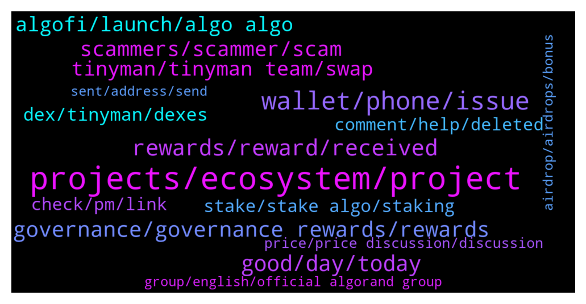

# **@algorand**
 ## Analysis for **2022-01-09** - **2022-01-16**.

---

## 📊 **Basic Stats**

**n_messages_sent**: 1584

---

---

## 🔝 **Top keywords and related messages**

1. **projects, ecosystem, project**

    @teknomachine --- *this are use cases, I asked if is there any project implementing Algorand* **--->** [TG Discussion](https://t.me/algorand/331812)

    @enochmarcs --- *hello  please what's the major utility of Algorand? (the website is a bit confusing 🥲)* **--->** [TG Discussion](https://t.me/algorand/329687)

    @Vytek --- *Algorand Italia 🇮🇹 Algorand fondato da Silvio Micali insieme a un rinomato team di luminari accademici. Algorand sta costruendo un futuro senza confini e definendo lo standard per la tecnologia blockchain. algorand.com  #algo #ita #algoita #algoitalia #algoranditalia https://t.me/AlgorandItalia* **--->** [TG Discussion](https://t.me/algorand/332757)

    @teknomachine --- *I don’t wanna sound negative, I like ALgorand but again I think it does not make sense when based on Proof of stake* **--->** [TG Discussion](https://t.me/algorand/331809)

    @abovyanv --- *here is not the question. If Algorand is not a decentralized blockchain, then let it not be stated in the media.* **--->** [TG Discussion](https://t.me/algorand/331779)

    @NightAlgorand --- *Algorand is not supported on Metamask* **--->** [TG Discussion](https://t.me/algorand/332289)

2. **wallet, phone, issue**

    @KENVO749 --- *Here is my wallet address: VYYBORB7TB6RZV2C2XAL2LOZN3QLZBSEFAAVRO7GD7LGCF5SXXDCWTSEU4 I choose Option B* **--->** [TG Discussion](https://t.me/algorand/331668)

    @MackDenver --- *I got you but it is working fine at my end. This is why I asked you to reinstall the wallet. If it doesn't work, I will forward the issue to the tech team.* **--->** [TG Discussion](https://t.me/algorand/332907)

    @NightAlgorand --- *Hi there, it seems nothing is wrong with the wallet, please try to type your seed exactly the same 🙂* **--->** [TG Discussion](https://t.me/algorand/332401)

    @Cesnili_Kanka --- *Read the top message it's giving you. It saying the service is unreachable. Like their servers are down or something, or your telecom provider is strangling the connection, etc. If it's a legitimate message, and not a local issue, then no matter how many times you reinput your password or install the wallet it will give the same error.* **--->** [TG Discussion](https://t.me/algorand/332906)

    @la_c0sa_n0stra --- *How to setup and Roland wallet* **--->** [TG Discussion](https://t.me/algorand/331476)

    @cityrttg --- *What's problem with login in app Android? Always wrong my password* **--->** [TG Discussion](https://t.me/algorand/332896)

3. **rewards, reward, received**

    @NightAlgorand --- *Nope, reward will be distributed to your wallet.* **--->** [TG Discussion](https://t.me/algorand/329015)

    @NightAlgorand --- *Hi you can see your rewards https://algoexplorer.io/rewards-calculator* **--->** [TG Discussion](https://t.me/algorand/331037)

    @KENVO749 --- *Why has it been 11 days since the end of phase 1 on December 31, 2021, and still has not received the reward? Is the project a scam?* **--->** [TG Discussion](https://t.me/algorand/331656)

    @MackDenver --- *No, it won't be ok. If you do so, you will not get your rewards.* **--->** [TG Discussion](https://t.me/algorand/331990)

    @Cesar --- *Man, if I ser another message regarding gobernance rewards I will shoot myself... 😂* **--->** [TG Discussion](https://t.me/algorand/329230)

    @defirlkp --- *More rewards means more dumping in my experience* **--->** [TG Discussion](https://t.me/algorand/329504)

4. **good, day, today**

    @na --- *Hello everyone, today is another beautiful day* **--->** [TG Discussion](https://t.me/algorand/331653)

    @Irene --- *good afternoon. Friends, how are you doing today?* **--->** [TG Discussion](https://t.me/algorand/331549)

    @MackDenver --- *Hey Maxim,  Glad to see you today. How are you doing?* **--->** [TG Discussion](https://t.me/algorand/332661)

    @Hyper Mental --- *thank you for your answer, have a good day:)* **--->** [TG Discussion](https://t.me/algorand/330188)

    @tonibaz --- *great fudders don't like gentle reminders* **--->** [TG Discussion](https://t.me/algorand/331220)

    @phantompatriot1 --- *Man are we ever getting hammered.* **--->** [TG Discussion](https://t.me/algorand/332479)

5. **governance, governance rewards, rewards**

    @Chompy --- *9.27% is the governance awards right? Does this fluctuate or will increase in time? I'm not ready to go governance just yet, I was thinking Q3 for governance* **--->** [TG Discussion](https://t.me/algorand/330620)

    @jakaaaas --- *dear admin, please share the new gov rewards payout methodology.* **--->** [TG Discussion](https://t.me/algorand/329422)

    @NightAlgorand --- *Are you refer to the participation rewards? it was changed for the governance reward. https://algorand.foundation/news/algorand-governance-rewards-period-2 for more information* **--->** [TG Discussion](https://t.me/algorand/331847)

    @cleitonrasta --- *would that be the rewards for voting for governance?* **--->** [TG Discussion](https://t.me/algorand/329038)

    @MackDenver --- *Hello Vladimir, Everything about the governance and governance related information is available in our website. Here is the details about the governance rewards system: https://algorand.foundation/news/algorand-governance-rewards-period-2* **--->** [TG Discussion](https://t.me/algorand/331577)

    @Malvo --- *Admin Any update on the governance rewards* **--->** [TG Discussion](https://t.me/algorand/330323)

6. **scammers, scammer, scam**

    @A_Striker2k20 --- *i send u the ss . dam he wants to scam me* **--->** [TG Discussion](https://t.me/algorand/331347)

    @xM3Dx --- *So many scammers in this channel, you send a message and receive 5 DMs from scams 🤢* **--->** [TG Discussion](https://t.me/algorand/332097)

    @Lord_Shin_Chan_2_O --- *Admins shouldn't respond my messages... But scammers should...😒🤦‍♂ worst sir...😒* **--->** [TG Discussion](https://t.me/algorand/330853)

    @MackDenver --- *Hi there, please be aware of scammers. Let me know if there is anything I can help you.* **--->** [TG Discussion](https://t.me/algorand/330856)

    @aplszczykowski --- *Are there only checked ids on this list or can there also be duplicate scams? https:// algoexplorer. io / assets* **--->** [TG Discussion](https://t.me/algorand/332745)

    @NightAlgorand --- *Reminder that Admins will never DM you first. Beware of scammers.* **--->** [TG Discussion](https://t.me/algorand/332098)

7. **tinyman, tinyman team, swap**

    @Olami0920 --- *Saw it on my tinyman swap as I log in now* **--->** [TG Discussion](https://t.me/algorand/328844)

    @deadlypuppy --- *Did you get this info from a Tinyman announcement?* **--->** [TG Discussion](https://t.me/algorand/331321)

    @MackDenver --- *Please contact the tinyman team about this  https://t.me/tinymanofficial* **--->** [TG Discussion](https://t.me/algorand/332746)

    @MackDenver --- *Please check in with Tinyman team about this  https://t.me/tinymanofficial* **--->** [TG Discussion](https://t.me/algorand/329981)

    @huliganas79 --- *But tinyman got hacked and it's not operating currently?* **--->** [TG Discussion](https://t.me/algorand/331603)

    @khunpon --- *From pinned message at tinyman official* **--->** [TG Discussion](https://t.me/algorand/329986)

8. **algofi, launch, algo algo**

    @MuratArkan --- *Why didn't algo intervene in the November 18 manipulation? this date has done great damage to this project. If you want to be a big coin, you will interfere with these manipulations, you will not allow them? Who sold the upgrade at that time? algo should explain it* **--->** [TG Discussion](https://t.me/algorand/330181)

    @MackDenver --- *Hey Emi,  If you have heard from the team, you will receive your ALGO.* **--->** [TG Discussion](https://t.me/algorand/330899)

    @csyogeshkumar --- *to get on updates on ALGO* **--->** [TG Discussion](https://t.me/algorand/329900)

    @Martin --- *I hope I don’t get liquidated in Algofi until then* **--->** [TG Discussion](https://t.me/algorand/330290)

    @A_Striker2k20 --- *guyz i m facing some issue in algo* **--->** [TG Discussion](https://t.me/algorand/331123)

    @MuratArkan --- *Algo is no different from stock. this project is dead.* **--->** [TG Discussion](https://t.me/algorand/330174)

9. **dex, tinyman, dexes**

    @KAPIBAYSIDE --- *Is there another dex available though?* **--->** [TG Discussion](https://t.me/algorand/329151)

    @MackDenver --- *There is Timyman however, Tinyman is currently in the repair phase. You will need to wait for it to be fixed. A few other DEXs are already in the works* **--->** [TG Discussion](https://t.me/algorand/332739)

    @Godahavefaithh --- *Is there a Dex on algorand* **--->** [TG Discussion](https://t.me/algorand/331068)

    @Paul --- *There is no way to trade most ASAs at the moment. Everyone should hold until dex is back and ignore price until then* **--->** [TG Discussion](https://t.me/algorand/330286)

    @ragnaroks157 --- *tinyman has been compromise . hence, im looking for alternative DEX to trade . thanks* **--->** [TG Discussion](https://t.me/algorand/331318)

    @MackDenver --- *Hi there, There is already tinyman DEX and other DEXes will be available soon.* **--->** [TG Discussion](https://t.me/algorand/331602)

10. **stake, stake algo, staking**

    @mikamika1987 --- *Hi, where can we stake Algo for best rewards* **--->** [TG Discussion](https://t.me/algorand/331588)

    @MackDenver --- *Hello Ron, You don't have to stake it anywhere. Just hold it in the official ALGO wallet, you will get staking rewards.* **--->** [TG Discussion](https://t.me/algorand/332229)

    @alicancelik88 --- *GM guys, may i kindly ask, whats the best possible way to stake algo? Im doing it currently at Binance, but APYs are pretty low..* **--->** [TG Discussion](https://t.me/algorand/331554)

    @cryptodadpreneur --- *where is the best place to stake algo* **--->** [TG Discussion](https://t.me/algorand/329550)

    @bonisu --- *Quick question, where is the best place to stake algo ? Correct me if I am wrong , but algo wallet is 0.67% ?* **--->** [TG Discussion](https://t.me/algorand/332140)

    @thebigbadwolf1 --- *Hi guys, I hold an algorand wallet but I am unable to stake my algo from there. Thinking of moving it somewhere else. Any suggestions on where to stake?* **--->** [TG Discussion](https://t.me/algorand/331092)

11. **comment, help, deleted**

    @NightAlgorand --- *Hi there, you can go here @algorand_price to have that discussion 🙂* **--->** [TG Discussion](https://t.me/algorand/331556)

    @Rb_71dex --- *this topic should discuss in 2030😏* **--->** [TG Discussion](https://t.me/algorand/331139)

    @Rb_71dex --- *did you even research or just typing rubbish* **--->** [TG Discussion](https://t.me/algorand/331658)

    @SonTrab --- *please explain to me specifically, how can i do it, help me* **--->** [TG Discussion](https://t.me/algorand/332555)

    @Cryptonigt --- *Lol yea, I was just wasting his time* **--->** [TG Discussion](https://t.me/algorand/330130)

    @deadlypuppy --- *Lol sorry I responded to the wrong comment. I was looking at the pictures from the profil right above your second to last comment.* **--->** [TG Discussion](https://t.me/algorand/330243)

12. **check, pm, link**

    @MackDenver --- *You can check the link below to find them  https://www.algorand.com/ecosystem/use-cases* **--->** [TG Discussion](https://t.me/algorand/332247)

    @nadya12042001 --- *I’m having a problem messaging first, if you don’t mind please just text me then I’ll be able to reply* **--->** [TG Discussion](https://t.me/algorand/331233)

    @NightAlgorand --- *Hi @TheCryptoFuture2021 , you can PM me the details 🙂* **--->** [TG Discussion](https://t.me/algorand/330468)

    @NightAlgorand --- *Hi there, I didn't received any message from you yet 🙂* **--->** [TG Discussion](https://t.me/algorand/331288)

    @NightAlgorand --- *Yes please if you can 🙂* **--->** [TG Discussion](https://t.me/algorand/330484)

    @babayaga589 --- *Can you send me the link bro* **--->** [TG Discussion](https://t.me/algorand/330596)

13. **price, price discussion, discussion**

    @NightAlgorand --- *Here is the price discussion group-   https://t.me/algorand_price* **--->** [TG Discussion](https://t.me/algorand/330035)

    @NightAlgorand --- *Please refrain from price discussion here. There is a price discussion group Here is the price discussion group-   https://t.me/algorand_price* **--->** [TG Discussion](https://t.me/algorand/332326)

    @NightAlgorand --- *Please head to price discussion group for price discussion   https://t.me/algorand_price* **--->** [TG Discussion](https://t.me/algorand/330707)

    @NightAlgorand --- *Gentle reminder to take price discussion to @algorand_price* **--->** [TG Discussion](https://t.me/algorand/331219)

    @MackDenver --- *You can use the following group for price discussion  @algorand_price* **--->** [TG Discussion](https://t.me/algorand/331175)

    @Janus_Age --- *is price discussion fine here or is there another group for that* **--->** [TG Discussion](https://t.me/algorand/330768)

14. **sent, address, send**

    @Tiny_Philosopher_784 --- *If you use the wallet app, you'll get a notification saying the tx of 0 algos were sent.* **--->** [TG Discussion](https://t.me/algorand/330430)

    @RalphCraig --- *You may have malware that replaces addresses when you cut and paste.  Try cutting and pasting an Algo address into a notepad and see what happens.  If it occurred without you sending anything perhaps your seed phrase was compromised.  Did you store it electronically at all?  Perhaps as a screenshot?* **--->** [TG Discussion](https://t.me/algorand/332500)

    @kramercrypto --- *If you send yourself a 0 algo tx they will be in your wallet, though* **--->** [TG Discussion](https://t.me/algorand/330545)

    @Grandpa --- *I sent $1000 algo it just show transfer successful but receiver won’t get* **--->** [TG Discussion](https://t.me/algorand/329157)

    @studentoflife --- *I just sent some Yieldly from my algo wallet and it went to a random address i never even typed in. Can someone please help me by looking at my transaction to see whats goig on?* **--->** [TG Discussion](https://t.me/algorand/332433)

    @mlats4 --- *but I have 7.5 algos and it wont let me send more than 6.63, so that is 0.9 algos approximately, so how come?* **--->** [TG Discussion](https://t.me/algorand/332778)

15. **airdrop, airdrops, bonus**

    @exploreBlock --- *Hi community, I m a Algo hodler .. I would like to know where can find the information related to Algo excosystem airdrops* **--->** [TG Discussion](https://t.me/algorand/332103)

    @KENVO749 --- *Actually me and my friend didn't receive our airdrop* **--->** [TG Discussion](https://t.me/algorand/331663)

    @MackDenver --- *We are not doing any airdrop* **--->** [TG Discussion](https://t.me/algorand/330968)

    @MackDenver --- *This is not the right place to talk about BTT airdrop.* **--->** [TG Discussion](https://t.me/algorand/332272)

    @angelo9007 --- *There is no airdrop on-going currently* **--->** [TG Discussion](https://t.me/algorand/332825)

    @chad --- *There is no airdrop. Do not answer DM's saying there is. Do not reply to any DM's better* **--->** [TG Discussion](https://t.me/algorand/329377)

