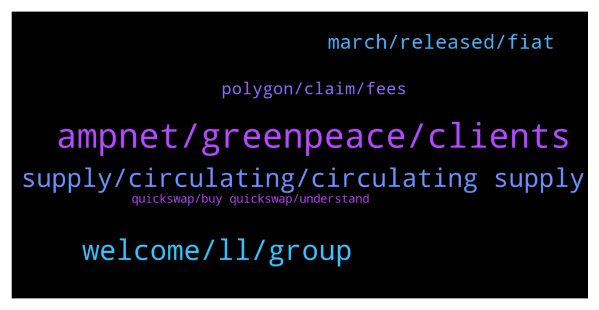

# **@ampnetapxchat**
 ## Analysis for **2022-01-09** - **2022-01-16**.

---

## 📊 **Basic Stats**

**n_messages_sent**: 199

---

---

## 🔝 **Top keywords and related messages**

1. **ampnet, greenpeace, clients**

    @Bob_Fosse --- *That was basically a very long winded statement that reads, “ampnet did nothing wrong, it’s everyone else’s fault”. Just awful (and not surprising).* **--->** [TG Discussion](https://t.me/ampnetapxchat/36017)

    @panos_dim --- *So AMPnet is focused purely in Croatia market?* **--->** [TG Discussion](https://t.me/ampnetapxchat/36550)

    @matejmz --- *I am wondering how you can become a main sponsor of a club with such a large following while being only a small start up with rather bad start. 🤔* **--->** [TG Discussion](https://t.me/ampnetapxchat/36078)

    @Cy --- *what will Biznisport do in this partnership ? I believe they were already involved on previous deals with ampnet.* **--->** [TG Discussion](https://t.me/ampnetapxchat/36377)

    @IncogSen --- *Maybe they already knew about the greenpeace deal falling through behind the scenes* **--->** [TG Discussion](https://t.me/ampnetapxchat/36013)

    @mislavjavor --- *I agree, and the team finds ourselves more than accountable for things in and beyond our control. In the history of our company, there has never been an attitde of - “it must be somebody elses fault”. We should have acted sooner on red flags by Greenpeace, we should have moved on to Ethereum sooner, etc… Trust me when I say that we do not pat ourselves on the back saying “good job, it’s the fault of the clients”. On the other hand - it’s easy to look on things from hindsight - with all the extra information that hindsight provides.   The post was meant as an update to the community, that we are working hard, exploring new business models and new clients and that AAPX will be the token that’s backing these new developments.* **--->** [TG Discussion](https://t.me/ampnetapxchat/36027)

2. **welcome, ll, group**

    @TroopSep --- *Hi @jakovtradingmentor! Thanks for taking care of us! Welcome! 😊* **--->** [TG Discussion](https://t.me/ampnetapxchat/36423)

    @mislavjavor --- *Yes - details still being panned out, don’t want to rush with announcement* **--->** [TG Discussion](https://t.me/ampnetapxchat/36388)

    @matejmz --- *@IncogSen you might like this too 😆* **--->** [TG Discussion](https://t.me/ampnetapxchat/36219)

    @bazzie123 --- *Ok so you failed basically everywhere* **--->** [TG Discussion](https://t.me/ampnetapxchat/36233)

    @tradingjo98 --- *Maybe you wanna tell us some things about you?* **--->** [TG Discussion](https://t.me/ampnetapxchat/36422)

    @Lord of the --- *Dude stop be crybaby it's history now* **--->** [TG Discussion](https://t.me/ampnetapxchat/36014)

3. **supply, circulating, circulating supply**

    @<UNK> --- *This is due to the fact that AAPX unlocks linearly and sites like CMC or CoinGecko have "unlock date" which we cannot use, cuz appx is unlocking every moment instead of a set date  But anyone can check circ. supply/max supply here -  https://claim.ampnet.io/app/dist/index.html* **--->** [TG Discussion](https://t.me/ampnetapxchat/36149)

    @E_Don --- *We need more pairs on Matic. Eth gas fee is crazy  Matic/AAPX. Eth/AAPX* **--->** [TG Discussion](https://t.me/ampnetapxchat/36085)

    @North --- *I really hope so. There are no details on how it benefits AAPX holders yet though which is unfortunate, but at least we have a great partner and some exposure now* **--->** [TG Discussion](https://t.me/ampnetapxchat/36339)

    @<UNK> --- *Here is the aapx network address  https://polygonscan.com/token/0x3fc8bd9b0d8054cbdc174c4ed4b41a95d3c6a427* **--->** [TG Discussion](https://t.me/ampnetapxchat/36087)

    @scemodonore --- *guess aapx will benefit from buybacks but let's wait for the ama later* **--->** [TG Discussion](https://t.me/ampnetapxchat/36341)

    @matejmz --- *Matic/AAPX exists. You can swap ETH to Matic and then swap it for AAPX* **--->** [TG Discussion](https://t.me/ampnetapxchat/36086)

4. **march, released, fiat**

    @PFCBLic --- *Can we put final date and final ammount of released tokens? Mcap wont be correct but it is better than nothing* **--->** [TG Discussion](https://t.me/ampnetapxchat/36153)

    @Hydayashi --- *Will the foobal token be sold for crypto or only for fiat? it doesnt say anywhere...* **--->** [TG Discussion](https://t.me/ampnetapxchat/36382)

    @matejmz --- *How many tokens are going to be sold during this ICO? I only found total supply info.* **--->** [TG Discussion](https://t.me/ampnetapxchat/36373)

    @MarcusVieiraCosta --- *will there be the promised tokens for us that made the cryptobond with Sync?* **--->** [TG Discussion](https://t.me/ampnetapxchat/36114)

    @North --- *That answers partially, thanks. And the fees from VATRENI are collected on each token transaction or some other way?* **--->** [TG Discussion](https://t.me/ampnetapxchat/36384)

    @matejmz --- *Is this token first of its kind in region?* **--->** [TG Discussion](https://t.me/ampnetapxchat/36389)

5. **polygon, claim, fees**

    @<UNK> --- *Sorry that was automatic, use this link to claim tokens 😅 https://claim.ampnet.io/app/dist/index.html* **--->** [TG Discussion](https://t.me/ampnetapxchat/36172)

    @mislavjavor --- *Agreed, for low fees at this time, though - I can recommend the Polygon network* **--->** [TG Discussion](https://t.me/ampnetapxchat/36387)

    @BlinkmothNexus --- *Yeah I know this page. My question was If I can claim with polygon network, not eth mainnet* **--->** [TG Discussion](https://t.me/ampnetapxchat/36173)

    @Tinus_Tussengas_1984 --- *When will the team make it possible to claim pre sale tokens on polygon network to avoid us to pay gas fees?* **--->** [TG Discussion](https://t.me/ampnetapxchat/36488)

    @BlinkmothNexus --- *Sorry but how does the polygon adresse helps me to claim my presale token?* **--->** [TG Discussion](https://t.me/ampnetapxchat/36171)

    @<UNK> --- *You kinda answered to this already, but I'd like to recommend atleast some CEX since ETH is congested all the time. I understand that something like Kucoin is now "pointless" until there is enough progression from this "new start", but there is some smaller CEXes like MEXC or AscendEX where you can get listed quite easily and can have decent userbase & volume* **--->** [TG Discussion](https://t.me/ampnetapxchat/36383)

6. **quickswap, buy quickswap, understand**

    @panos_dim --- *Cool, lowcap, do you guys have any competitors in other chains?* **--->** [TG Discussion](https://t.me/ampnetapxchat/36544)

    @jakovtradingmentor --- *i understand what you're saying, you're asking why quickswap doesnt show up as option in markets tab for cmc when its possible to buy it there, but its most likely because of this* **--->** [TG Discussion](https://t.me/ampnetapxchat/36476)

    @Darkofmadness --- *?? I don't understand what you mean. I know how to buy it in quickswap, that is not the point. I guess I'm not clear enough* **--->** [TG Discussion](https://t.me/ampnetapxchat/36475)

    @Darkofmadness --- *Nah I'm meaning when you check about aapx on CMC, you can't see that you can buy it on quickswap. So the volume isnt good I guess* **--->** [TG Discussion](https://t.me/ampnetapxchat/36471)

    @E_Don --- *Thanks. Tried so many times on quickswap. Only found Weth/AAPX pair.* **--->** [TG Discussion](https://t.me/ampnetapxchat/36088)

