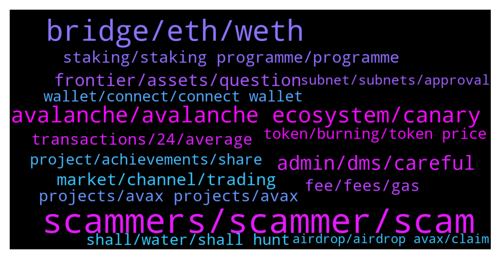

# **@avalancheavax**
 ## Analysis for **2022-01-09** - **2022-01-16**.

---

## 📊 **Basic Stats**

**n_messages_sent**: 1407

---

---

## 🔝 **Top keywords and related messages**

1. **scammers, scammer, scam**

    @jenkk --- *Will you just ignore the scammers make a fake group and pretend they are you and run an airdrop there?* **--->** [TG Discussion](https://t.me/avalancheavax/321997)

    @sonicblend --- *Best to use the website / app support. Too many scammers around.* **--->** [TG Discussion](https://t.me/avalancheavax/321035)

    @Bullseyefomo77 --- *So many scammers contacted me lol* **--->** [TG Discussion](https://t.me/avalancheavax/321669)

    @oathtobarbatos --- *Yes. It's a scam, be careful with that. Report it if possible!* **--->** [TG Discussion](https://t.me/avalancheavax/321731)

    @diov0 --- *anyone programs in solidity? i have a code that aparently is a bot, and i wondering what it really does, since feels like a scam* **--->** [TG Discussion](https://t.me/avalancheavax/321493)

    @Altenna --- *btw scammers these days are really crazy i asked 1 question and i have like 20 pm and 5+ ppl calling me* **--->** [TG Discussion](https://t.me/avalancheavax/319337)

2. **bridge, eth, weth**

    @denis99r5 --- *Hi. Can someone help me with bridge.Avax.network. I try transfer my DAI.e to ETH many times but always failed transactions. I’m already increasing gas fee to 60gwei but same result. Transaction status failed.[out of gas]* **--->** [TG Discussion](https://t.me/avalancheavax/319657)

    @Nicolas_A --- *Did you use the bridge once ?* **--->** [TG Discussion](https://t.me/avalancheavax/319381)

    @BinanceApe --- *Yeah it’s really cool, also if anyone is afraid of ethereum network bridge fees try it. It’s surprisingly extremely cheap compared to other services (about $6-$10 is what I paid yesterday)* **--->** [TG Discussion](https://t.me/avalancheavax/319421)

    @Nicolas_A --- *Yes bridge.avax.network you will receive WETH* **--->** [TG Discussion](https://t.me/avalancheavax/321648)

    @Nicolas_A --- *Yes using the bridge I just mentioned above* **--->** [TG Discussion](https://t.me/avalancheavax/322468)

    @Nicolas_A --- *Not sure. I know Synapse / Celer network give you the right one* **--->** [TG Discussion](https://t.me/avalancheavax/322463)

3. **avalanche, avalanche ecosystem, canary**

    @PatrickSutton --- *ICYMI - John Wu talked Avalanche and the Avalanche Bridge's success on Bloomberg TV yesterday following a JP Morgan report on 2022 being the year of blockchain bridges. Check it out:  https://twitter.com/_PatrickSutton/status/1481283041381302272?s=20* **--->** [TG Discussion](https://t.me/avalancheavax/321902)

    @Nicolas_A --- *They integrated Avalanche. Why not ? ^^* **--->** [TG Discussion](https://t.me/avalancheavax/319633)

    @BinanceApe --- *Is there an alt coin group (reliable) where people discuss avalanche projects?* **--->** [TG Discussion](https://t.me/avalancheavax/322006)

    @Andy_oi1 --- *Not that. I mean if there's a project on Ethereum, and you want to get it listed on Avalanche, you need the bridge and whitelisting from the Avalanche team because you guys control that process. How long does that usually take?* **--->** [TG Discussion](https://t.me/avalancheavax/321230)

    @cryptomaxcrypto --- *Hey! Where can I find avalanche projects that launch today?* **--->** [TG Discussion](https://t.me/avalancheavax/319409)

    @Knoedlspezialist --- *Why is Web3 So Crucial for Avalanche Dapps? https://www.newsbtc.com/news/company/why-is-web3-so-crucial-for-avalanche-dapps/* **--->** [TG Discussion](https://t.me/avalancheavax/319627)

4. **admin, dms, careful**

    @Dante --- *Hello Is there an admin in this group . My swap from metamask still pending for a while.* **--->** [TG Discussion](https://t.me/avalancheavax/321940)

    @JimWelder --- *You'll get some dms shortly they'll offer to help you I'm sure* **--->** [TG Discussion](https://t.me/avalancheavax/320675)

    @CryptoDefiPhoenix --- *Unbelievable the number of people To DM Me* **--->** [TG Discussion](https://t.me/avalancheavax/320262)

    @pupmkin_l --- *I don’t even understand admin do you ?* **--->** [TG Discussion](https://t.me/avalancheavax/321639)

    @Admin --- *Talk to the admin they must have seen your complain see your PM* **--->** [TG Discussion](https://t.me/avalancheavax/320329)

    @Bruno_LGD --- *How many DM's you've got? Lol* **--->** [TG Discussion](https://t.me/avalancheavax/319478)

5. **frontier, assets, question**

    @ravidsrk --- *As of today we have more than 350K users using Frontier across Android and iOS.* **--->** [TG Discussion](https://t.me/avalancheavax/319974)

    @Nicolas_A --- *Fifth question is asked by TekilBilge on Twitter: What I'm wondering is how many people in total are using the #Frontier app right now.* **--->** [TG Discussion](https://t.me/avalancheavax/319972)

    @Nicolas_A --- *The first question comes from Wawan584264433: Can you explain how Frontier works? What are the advantages of its features?* **--->** [TG Discussion](https://t.me/avalancheavax/319956)

    @Nicolas_A --- *Okay question 6 by EPwnage on Twitter:  Can you share more details about the goals that Frontier aim to achieve in the market? Which main products are you focusing at the moment?* **--->** [TG Discussion](https://t.me/avalancheavax/319982)

    @Nicolas_A --- *Last question we take from Twitter comes from AEmreKeless: There are a lot of DeFi and apps available nowadays. Why should I bring my assets to Frontier?* **--->** [TG Discussion](https://t.me/avalancheavax/319994)

    @Nicolas_A --- *Yieldyak / Markr shows you a lot of farms* **--->** [TG Discussion](https://t.me/avalancheavax/320357)

6. **market, channel, trading**

    @don_wonton --- *Keep price chat in the trading rooms https://t.me/avalanche_trading* **--->** [TG Discussion](https://t.me/avalancheavax/319557)

    @Lucy6568 --- *Hi the market looks volatile today* **--->** [TG Discussion](https://t.me/avalancheavax/320933)

    @Nicolas_A --- *@ghostcarapace3 you are in the trading channel please use it and avoid talking about markets here. Thank you* **--->** [TG Discussion](https://t.me/avalancheavax/320380)

    @Cryptoannsm1 --- *I wonder why we complain when the market is down, obviously if you in long term you know what you want tbh it’s awkward if I’m looking for short term gains I’d preferably farm my crypto n stack with my earning into my position.* **--->** [TG Discussion](https://t.me/avalancheavax/321476)

    @Shinycakes --- *Hello could someone please tell the market maker we want flip eth this year? Could you please do something?* **--->** [TG Discussion](https://t.me/avalancheavax/319260)

    @oathtobarbatos --- *Well, you can discuss prices here: https://t.me/avalanche_trading* **--->** [TG Discussion](https://t.me/avalancheavax/319261)

7. **staking, staking programme, programme**

    @lackmanac --- *Staking programme is very important for any project,?? Can i stake your token,? Do you have any plan of starting staking programme,??* **--->** [TG Discussion](https://t.me/avalancheavax/320058)

    @Yekscrypto --- *team is great and token launch still in january.  swap/farm/stake is just some of the features to be launched. pay attention to it* **--->** [TG Discussion](https://t.me/avalancheavax/319902)

    @rogerdefi --- *gm fellow degens!  here's a quick guide on my platypus PTP beta launch staking please like, retweet & follow if you find this helpful. lfg https://twitter.com/rogerclu/status/1481930542283210755* **--->** [TG Discussion](https://t.me/avalancheavax/322291)

    @SLanshe88 --- *Staking programme is very important for any project,?? Can i stake your token,? Do you have any plan of starting staking programme,??* **--->** [TG Discussion](https://t.me/avalancheavax/320140)

    @ssiedow4 --- *'STAKING'' is one of the STRATEGIES to ATTRACT USERS and HOLD Them long term. Does your GREAT PROJECT have plan about Staking??* **--->** [TG Discussion](https://t.me/avalancheavax/320080)

    @roni_parker_78 --- *Staking programme is very important for any project,?? Can i stake your token,? Do you have any plan of starting staking programme,??* **--->** [TG Discussion](https://t.me/avalancheavax/320073)

8. **transactions, 24, average**

    @offorjp --- *That's the average in the last 24hrs  Not the max tps* **--->** [TG Discussion](https://t.me/avalancheavax/321888)

    @JimWelder --- *Oh I read it wrong sorry I need my coffee. So it's 8tps per 24hr period.* **--->** [TG Discussion](https://t.me/avalancheavax/321897)

    @Nicolas_A --- *8 transactions per second on a 24 hour basis is almost 700 000 transactions* **--->** [TG Discussion](https://t.me/avalancheavax/321895)

    @Nicolas_A --- *What the network has been processing not the max it can handle* **--->** [TG Discussion](https://t.me/avalancheavax/321889)

    @JimWelder --- *Shouldn't it be the same? Shouldn't they have 2000tps on avg for a 24 hr period?* **--->** [TG Discussion](https://t.me/avalancheavax/321891)

    @Nicolas_A --- *“In the last 24 hours on average the network processed 8 transactions per second” which is around 700k transactions in total over the last 24 hours* **--->** [TG Discussion](https://t.me/avalancheavax/321899)

9. **projects, avax projects, avax**

    @M0ckey --- *Does anyone know of any promising project on the Avax network, focused on P2earn and Nft? I think this segment will be very atractive to different blockchains from now on, just see harmony network pumping after the succesful of p2earn project "Defi Kingdoms".* **--->** [TG Discussion](https://t.me/avalancheavax/320186)

    @daleetguy --- *Hi. Any recommendation on avax defi project i should look at ?* **--->** [TG Discussion](https://t.me/avalancheavax/319898)

    @Mell19976 --- *Where can I check the upcoming avax projects?* **--->** [TG Discussion](https://t.me/avalancheavax/322135)

    @pacificnorriswest --- *What new projects to avax we diggin?* **--->** [TG Discussion](https://t.me/avalancheavax/320704)

    @BjornSeal --- *Any new promising project on Avax ?* **--->** [TG Discussion](https://t.me/avalancheavax/320873)

    @jackdboo --- *Anyone here a solidity dev looking for some extra work ? Some projects I know are looking to expand on avax* **--->** [TG Discussion](https://t.me/avalancheavax/319596)

10. **fee, fees, gas**

    @alexbwork --- *Maybe make sense but I'm not very experienced how it works but how the poly or other blockchains works with those fees ?* **--->** [TG Discussion](https://t.me/avalancheavax/321703)

    @Nicolas_A --- *If people want to pay more fee it’s their choice I guess ^^ Validators can set the fees so* **--->** [TG Discussion](https://t.me/avalancheavax/320337)

    @<UNK> --- *Anyone could help me just 0.02 fees pls* **--->** [TG Discussion](https://t.me/avalancheavax/321065)

    @Rakage68 --- *how much gas fee in avalanche?* **--->** [TG Discussion](https://t.me/avalancheavax/319302)

    @Olasunkanm --- *It's impossible..... anything ERC -20 always comes with crazy fee* **--->** [TG Discussion](https://t.me/avalancheavax/319395)

    @Nicolas_A --- *No fees price are changed with price and increasing capacity* **--->** [TG Discussion](https://t.me/avalancheavax/321191)

11. **shall, water, shall hunt**

    @oathtobarbatos --- *Hey, take a look at this https://docs.avax.network/learn/avalanche-bridge-faq/* **--->** [TG Discussion](https://t.me/avalancheavax/321645)

    @HellenicAng3 --- *Is there anywhere I can read more on this?* **--->** [TG Discussion](https://t.me/avalancheavax/319411)

    @Nicolas_A --- *You can find them here https://t.me/avalancheavax/321541* **--->** [TG Discussion](https://t.me/avalancheavax/321554)

    @Nicolas_A --- *This article explains it to some degree https://medium.com/vault0x/hd-wallets-structure-and-its-implementation-5897ab3da210* **--->** [TG Discussion](https://t.me/avalancheavax/319413)

    @Nicolas_A --- *It's explained here https://docs.avax.network/learn/platform-overview/  :)* **--->** [TG Discussion](https://t.me/avalancheavax/319639)

    @Nicolas_A --- *Just look at the picture at the beginning of the article* **--->** [TG Discussion](https://t.me/avalancheavax/319641)

12. **wallet, connect, connect wallet**

    @Kowloonjc --- *Thanks Nick! I find wallet but not integrated tool.* **--->** [TG Discussion](https://t.me/avalancheavax/321173)

    @<UNK> --- *checked the website and left. As ı remember website asked for wallet connect but ı commected with empty wallet so ı guess it is okey right?* **--->** [TG Discussion](https://t.me/avalancheavax/321811)

    @nobodyinthere --- *Link? No need to connect wallet in test version, right?* **--->** [TG Discussion](https://t.me/avalancheavax/321766)

    @Squidward --- *Can anyone help me set up a wallet?* **--->** [TG Discussion](https://t.me/avalancheavax/320739)

    @Aziz_2025 --- *Why can't I link the wallet from the phone* **--->** [TG Discussion](https://t.me/avalancheavax/321601)

    @cemil1237 --- *Why didn't you put the DApps browser part in your wallet app? Don't you think this is a must have feature?* **--->** [TG Discussion](https://t.me/avalancheavax/320032)

13. **token, burning, token price**

    @jaemunoz --- *Most people judge a project by its token price. So, what is your plan to maintain the token price? Will there be some kinds of burning/buy-back program?* **--->** [TG Discussion](https://t.me/avalancheavax/320142)

    @alanehoffmann2003 --- *Most people judge a project by its token price. So, what is your plan to maintain the token price? Will there be some kinds of burning/buy-back program?* **--->** [TG Discussion](https://t.me/avalancheavax/320012)

    @oscar_lloyd --- *Do you have any plan for burning tokens in the future to reduce the supply of the token and increase its investment attractiveness?* **--->** [TG Discussion](https://t.me/avalancheavax/320116)

    @Alex_lanham --- *Do you have any plan for burning tokens in the future to reduce the supply of the token and increase its investment attractiveness?* **--->** [TG Discussion](https://t.me/avalancheavax/320014)

    @RenatoHaskell --- *Most people judge a project by its token price. So, what is your plan to maintain the token price? Will there be some kinds of burning/buy-back program?* **--->** [TG Discussion](https://t.me/avalancheavax/320036)

    @Platemha --- *Is there any way to add a preset trusted list of tokens that can be added to metamask directly* **--->** [TG Discussion](https://t.me/avalancheavax/320829)

14. **project, achievements, share**

    @Nicolas_A --- *Nothing to worry about for the next century :)* **--->** [TG Discussion](https://t.me/avalancheavax/320210)

    @AldaJose --- *Are you afraid some day there will be another project with more innovative technology can replace your project ?* **--->** [TG Discussion](https://t.me/avalancheavax/320015)

    @brittaney_whipple --- *What are the attractive features in your project? What is the vision and goals in your project that you want to achieve in 2021 and beyond?* **--->** [TG Discussion](https://t.me/avalancheavax/320026)

    @grossman15 --- *What are the attractive features in your project? What is the vision and goals in your project that you want to achieve in 2021 and beyond?* **--->** [TG Discussion](https://t.me/avalancheavax/320055)

    @rosietowns --- *What is your top 3 things for priorities in 2021? Could you share some plans for the upcoming year?* **--->** [TG Discussion](https://t.me/avalancheavax/320054)

    @kabarron1991 --- *Are you afraid some day there will be another project with more innovative technology can replace your project ?* **--->** [TG Discussion](https://t.me/avalancheavax/320096)

15. **subnet, subnets, approval**

    @Nicolas_A --- *There is no subnet schedule but should probably be more or less ready in this period. A lot of functionalities are already ready* **--->** [TG Discussion](https://t.me/avalancheavax/320682)

    @M --- *Admin, Will subnet project be announced on march?(crypto inno 2022) If not, where can i get some info about subnet schedule?* **--->** [TG Discussion](https://t.me/avalancheavax/320681)

    @DanDK9 --- *Meaning anyone can launch a subnet without approval? Would there be any form of yes/no action required from someone else prior to launching the subnet?* **--->** [TG Discussion](https://t.me/avalancheavax/320867)

    @iwong1 --- *May I ask about schedule of subnet?🤦‍♂🤦‍♂🤦‍♂* **--->** [TG Discussion](https://t.me/avalancheavax/320527)

    @HellenicAng3 --- *I would expect interesting things to happen once subnets are launched.* **--->** [TG Discussion](https://t.me/avalancheavax/321021)

    @itamarcps --- *AVME, not yet running in subnets but we are building prototypes already* **--->** [TG Discussion](https://t.me/avalancheavax/322431)

