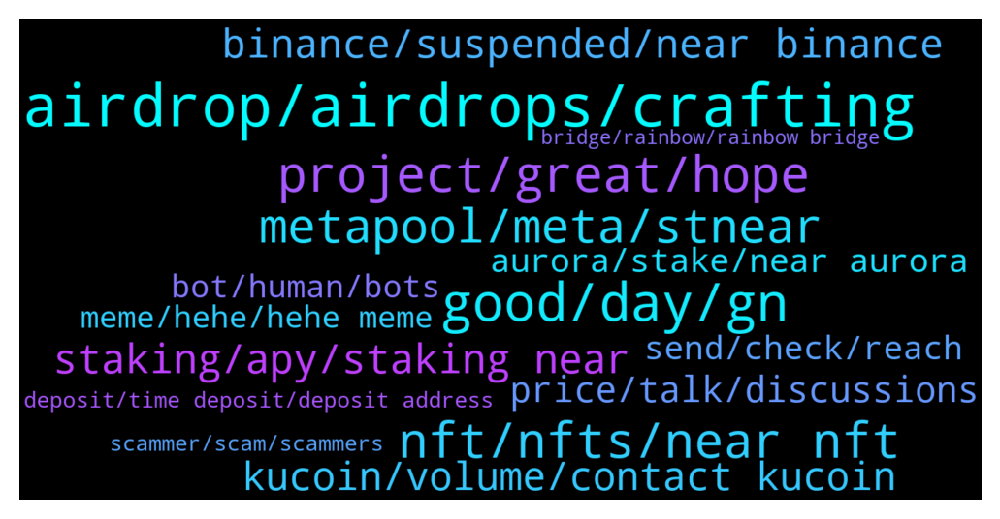

# **@cryptonear**
 ## Analysis for **2022-01-09** - **2022-01-16**.

---

## 📊 **Basic Stats**

**n_messages_sent**: 3695

---

---

## 🔝 **Top keywords and related messages**

1. **airdrop, airdrops, crafting**

    @larry_lang --- *Heyy so we are aware that newcomers are flushing in due to the Crafting Finance Airdrop, will open up the group shortly after this https://twitter.com/CraftingFinance/status/1478667618886291458* **--->** [TG Discussion](https://t.me/cryptonear/261663)

    @iamkemoo --- *I know a trick:  You create a Testnet wallet and then you go to https://testnet.burrow.cash/portfolio (Near Testnet) and test the DApp. With a little luck you get Airdroped some $BRRR when they go live. Then you swap those to $NEAR and et voila..* **--->** [TG Discussion](https://t.me/cryptonear/284794)

    @bailey_12 --- *Hey team,   If you looking for airdrop, do join the podcast for a chance to win an airdrop bois  https://twitter.com/BaileyVu12/status/1479376715252043777* **--->** [TG Discussion](https://t.me/cryptonear/278615)

    @larry_lang --- *hehe at least the crafting finance airdrop has some benefit* **--->** [TG Discussion](https://t.me/cryptonear/274886)

    @noval_2233 --- *Is NEAR doing an airdop ? cause i found one* **--->** [TG Discussion](https://t.me/cryptonear/285842)

    @Ankur205 --- *For crafting Finance Airdrop we have to stake any asset ?* **--->** [TG Discussion](https://t.me/cryptonear/274595)

2. **good, day, gn**

    @SymboliahELENA --- *Not  good, I didn't beat u🤣* **--->** [TG Discussion](https://t.me/cryptonear/280880)

    @bailey_12 --- *hi @Stelcy_Chelsey, long time no see.  Hope you doing all good..* **--->** [TG Discussion](https://t.me/cryptonear/279233)

    @larry_lang --- *Good morning guys^^ wish all of u a productive day^^* **--->** [TG Discussion](https://t.me/cryptonear/260896)

    @FritzWagner --- *Good morning chief, just passing by. ✌* **--->** [TG Discussion](https://t.me/cryptonear/281616)

    @bailey_12 --- *Oh woah, hello .. haha welcome to Near train !!* **--->** [TG Discussion](https://t.me/cryptonear/279703)

    @Dora --- *I'm DORA. Nice to meet you all* **--->** [TG Discussion](https://t.me/cryptonear/284173)

3. **project, great, hope**

    @l_webster --- *So many intigrations to this project* **--->** [TG Discussion](https://t.me/cryptonear/283984)

    @xgspon --- *Best project ever and congratulations !* **--->** [TG Discussion](https://t.me/cryptonear/276478)

    @Maruf14128 --- *Nice project. This project will be big, because it includes a structured, creative, innovative, compact and transparent team. I hope I can be a part of this great project.* **--->** [TG Discussion](https://t.me/cryptonear/266563)

    @larry_lang --- *Yeah i am rooting for that project myself =]]]* **--->** [TG Discussion](https://t.me/cryptonear/280607)

    @bailey_12 --- *Hello,  Please check out my little project :))  https://twitter.com/BaileyVu12/status/1481999812602269700* **--->** [TG Discussion](https://t.me/cryptonear/285800)

    @RNFarm --- *@hai vu  Purpose- simply to explore the workings of the project. I desire to know who makes decisions and the checks and balances in place before before making a long term investment.   The project seems excellent. I agree ownership should be in the hands of the community (at least long term), but transparency is important to ensure that not only consensus order is decentralized but also governance (ie. business decisions and logistics are not made by "unknowns" or an individual group or person)* **--->** [TG Discussion](https://t.me/cryptonear/259375)

4. **nft, nfts, near nft**

    @StephenShimel --- *Polaristoken.io , we also did a nft collection for it. Working on straight utility for Aurora. Currently have LP locker for devs, once we migrate lp to auroraswap we are launching farms then getting work on minter/multisender* **--->** [TG Discussion](https://t.me/cryptonear/259872)

    @Nate_JB --- *What are considered the blue chip PFP NFT's on Near?* **--->** [TG Discussion](https://t.me/cryptonear/260908)

    @O|| (Former) Rekt.Army --- *is there a similar tool for NFTs??* **--->** [TG Discussion](https://t.me/cryptonear/260800)

    @vsx007 --- *@TheGo1denBull I like the expensive NFT in your profile btw ☺️* **--->** [TG Discussion](https://t.me/cryptonear/284700)

    @larry_lang --- *https://paras.id/ u can trade the NFT in this site* **--->** [TG Discussion](https://t.me/cryptonear/281479)

    @iothaP --- *If you read the post, I did not share just one project. It's a discuss all around NEAR NFT ecosystem.  NFT Marketplace on NEAR: paras.id  and mintbase.io  NEAR China NFT Projects Collab with Alibaba: hhs.art  Exciting TenK PFP on NEAR: NEAR misfits: https://misfit.netlify.app/ NEAR tiger academy: https://neartiger.academy/  Many exciting NFT projects is on NEW ECOSYSTEM!!!😍😍* **--->** [TG Discussion](https://t.me/cryptonear/259547)

5. **metapool, meta, stnear**

    @ieatapple --- *Can I check what is this fee allowance? I’ve connected my Wallet to Metapool but I haven’t stake anything yet.* **--->** [TG Discussion](https://t.me/cryptonear/286781)

    @nino706 --- *Where can i stake Near ecxept wallet and metapool?* **--->** [TG Discussion](https://t.me/cryptonear/279012)

    @rahulgoel007 --- *You can stake $Near and earn $Near back (~11% APY) Guide -> https://t.me/cryptonear/154221  On Metapool you can liquid stake $NEAR and get $NEAR(~ 11% APY) + $META {Liquid staking --> Instant Unstake by paying extra fees} Guide--> https://www.producthunt.com/posts/meta-pool  What's $META? Here's the answer! https://twitter.com/Nearius_/status/1431208822895374337?s=19* **--->** [TG Discussion](https://t.me/cryptonear/278695)

    @GeorgePro1 --- *1. MetaPool (https://metapool.app/dapp/mainnet/meta/#)  distributes the tokens proportionally to the validators, so no worries which validator to choose. 2. You still get ~11% APY on your $NEAR, and withdraw NEAR whenever you want without waiting (with fee). 3. On top of that you get MetaPools $META token payed out daily 4. You get stNear which can be used on other DeFi applications such as app.ref.finance* **--->** [TG Discussion](https://t.me/cryptonear/284041)

    @iamkemoo --- *Because  1. MetaPool distributes the staked $NEAR tokens proportionally to the validators, so no worries which validator to choose. 2. You still get ~11% APY on your $NEAR 3. On top of that you get MetaPools $META token payed out daily 4. Liquid unstaking at any time (costs fee)  Guide For Metapool --> https://www.producthunt.com/posts/meta-pool* **--->** [TG Discussion](https://t.me/cryptonear/285674)

    @kv9990 --- *I would suggest to stake on Metapool =))  •It divides your stake into different pools and supports Decentralization  •Provides Liquid Unstaking (means unstaking instantly without waiting 3 days but need to pay 0.3-3% fees or use delayed unstaking)  •Provides $META for staking on metapool  •You'll get stNear to use on different DeFi on NEAR (like lending protocols)(and you won't get $META if you use stNear)  Guide For Metapool --> https://www.producthunt.com/posts/meta-pool  Two Tokens of Metapool Explained https://twitter.com/Nearius_/status/1430916703647526920?s=19* **--->** [TG Discussion](https://t.me/cryptonear/282216)

6. **staking, apy, staking near**

    @a1sunny --- *Thanks for response Sir i mean with just staking i will be eligible for new projects? Or not* **--->** [TG Discussion](https://t.me/cryptonear/278715)

    @a1sunny --- *Any minimum or maximum quantity and date for staking? When will be we get awards/meta* **--->** [TG Discussion](https://t.me/cryptonear/284142)

    @masstahcoiner --- *send all your money to usdt usdc near and others  and do staking defi and so on* **--->** [TG Discussion](https://t.me/cryptonear/284515)

    @BrockAngelo --- *Is there going to be a lockup period for staking?* **--->** [TG Discussion](https://t.me/cryptonear/286072)

    @ieatapple --- *staking rewards will be paid in stNEAR yea?* **--->** [TG Discussion](https://t.me/cryptonear/285213)

    @Ajen --- *Then how could they offer 11 percent staking yield?* **--->** [TG Discussion](https://t.me/cryptonear/281310)

7. **binance, suspended, near binance**

    @PlatypusPunk --- *Near Will be suspended again opn binance I think* **--->** [TG Discussion](https://t.me/cryptonear/281705)

    @PlatypusPunk --- *Now Near is suspended on Binance why* **--->** [TG Discussion](https://t.me/cryptonear/282295)

    @phongcaca0711 --- *i don't know if it is distributed in binance wallet or near wallet* **--->** [TG Discussion](https://t.me/cryptonear/283071)

    @masstahcoiner --- *i bought near on binance  must move to ref finance =)  cannot becouse of binance stupidity agian* **--->** [TG Discussion](https://t.me/cryptonear/284312)

    @isaacmendex --- *Near protocol network is temporarily suspended on binance at the moment* **--->** [TG Discussion](https://t.me/cryptonear/285391)

    @TheGo1denBull --- *Your binance wallet if you gave the correct information when you did this event.* **--->** [TG Discussion](https://t.me/cryptonear/281140)

8. **kucoin, volume, contact kucoin**

    @xMetaCrypt --- *Guys don’t use Kucoin for withdrawals! Taking ages!* **--->** [TG Discussion](https://t.me/cryptonear/284581)

    @A --- *ffs still waiting on kucoin to confirm the tx* **--->** [TG Discussion](https://t.me/cryptonear/286531)

    @xMetaCrypt --- *If that happens I will book a flight to the KuCoin office and ask for compensation 😂* **--->** [TG Discussion](https://t.me/cryptonear/284637)

    @iamkemoo --- *KuCoin had issues as far as I know. Try againg and if it not works contact KuCoin.* **--->** [TG Discussion](https://t.me/cryptonear/287564)

    @abundone8 --- *Sometimes Kucoin takes awhile to transfer out.* **--->** [TG Discussion](https://t.me/cryptonear/286656)

    @vlhai --- *From kucoin: I have received a reply from KuCoin support. The NEAR payouts are in maintenance and not available right now. No idea why withdrawals are offered anyway* **--->** [TG Discussion](https://t.me/cryptonear/287041)

9. **price, talk, discussions**

    @iamkemoo --- *Zoom out. But let's not talk about prices here please. Thx* **--->** [TG Discussion](https://t.me/cryptonear/280796)

    @Kripto_Raptor --- *i think we already told you many times that we dont talk about the price here. please respect the community rules 😉* **--->** [TG Discussion](https://t.me/cryptonear/286615)

    @HODL_R --- *On what and for how much* **--->** [TG Discussion](https://t.me/cryptonear/287451)

    @iamkemoo --- *For price discussion please join our price chat: https://t.me/merchantsofnear* **--->** [TG Discussion](https://t.me/cryptonear/279057)

    @iamkemoo --- *No price discussions here. Please go to our price chat: https://t.me/merchantsofnear* **--->** [TG Discussion](https://t.me/cryptonear/268068)

    @iamkemoo --- *For price discussion please join the unofficial price chat: https://t.me/merchantsofnear* **--->** [TG Discussion](https://t.me/cryptonear/280808)

10. **aurora, stake, near aurora**

    @ieatapple --- *So we are just getting Aurora token for the 100%, no other rewards.* **--->** [TG Discussion](https://t.me/cryptonear/287299)

    @iamkemoo --- *Stake farming allows Validators to distribute more than one token, so you would get more than $AURORA if the Validator choose so. Read the article about stake farming: https://near.org/blog/near-launches-stake-farming-to-unlock-ecosystem-rewards/* **--->** [TG Discussion](https://t.me/cryptonear/287309)

    @bailey_12 --- *Hi, You will receive both $Near and $Aurora as the rewards of your staking  For further question on Aurora, don’t hesitate to join and ask the community on  https://t.me/auroraisnear* **--->** [TG Discussion](https://t.me/cryptonear/286703)

    @GeorgePro1 --- *The reward for this is $Aurora only ($Near spent for Aurora)  Check the apy for this pool: https://forum.aurora.dev/t/aurora-validator-v-2-0-setup/100  How to stake: https://twitter.com/auroraisnear/status/1482052357424775172?s=21* **--->** [TG Discussion](https://t.me/cryptonear/287064)

    @solovey4ik --- *hi all,  can some one tell me , staking near for aurora im just geting aurora or both near + aurora?* **--->** [TG Discussion](https://t.me/cryptonear/286362)

    @ieatapple --- *Just wondering why are people staking for Aurora rewards? What can we do with Aurora ?* **--->** [TG Discussion](https://t.me/cryptonear/286939)

11. **send, check, reach**

    @Taurus990 --- *Can i send you a DM so you can show me how to do this ? I’m new to this crypto thing* **--->** [TG Discussion](https://t.me/cryptonear/260375)

    @de_confluence --- *@iamkemoo HNY. pls check Dm and let pick a date. Thanks.* **--->** [TG Discussion](https://t.me/cryptonear/277737)

    @mv_the_realone --- *I can dm you and send details* **--->** [TG Discussion](https://t.me/cryptonear/285543)

    @larry_lang --- *i though u have send a DM to @Kripto_Raptor* **--->** [TG Discussion](https://t.me/cryptonear/284210)

    @MAJ10 --- *Sent me DM that he is a Near liquidator* **--->** [TG Discussion](https://t.me/cryptonear/287385)

    @iamkemoo --- *Please send me a DM with your problem.* **--->** [TG Discussion](https://t.me/cryptonear/287325)

12. **bot, human, bots**

    @iamkemoo --- *Bots are everywhere my friend, we have to ask these questions sometimes when we are under attack.* **--->** [TG Discussion](https://t.me/cryptonear/262210)

    @Santus_marine --- *Pls apart from Bots...is there anything like GROUP HELP here* **--->** [TG Discussion](https://t.me/cryptonear/261101)

    @FritzWagner --- *Oh, this time the Bot beats me. 😂* **--->** [TG Discussion](https://t.me/cryptonear/260744)

    @Kripto_Raptor --- *hehe. I want to to meet the creator of these bots. Wanna ask why does he code all this irrelevant stuff and make bots post it on chats lol* **--->** [TG Discussion](https://t.me/cryptonear/260748)

    @larry_lang --- *hehe if that happen i would outperformed those bot so hard with my mini-bag power boost=))0* **--->** [TG Discussion](https://t.me/cryptonear/285111)

    @kv9990 --- *Wanna bet it's a bot? 🙃😜* **--->** [TG Discussion](https://t.me/cryptonear/259915)

13. **meme, hehe, hehe meme**

    @larry_lang --- *https://twitter.com/NEARProtocol/status/1481575544407875587 lol this one is huge=)))* **--->** [TG Discussion](https://t.me/cryptonear/284997)

    @larry_lang --- *=))) its just an expression lol* **--->** [TG Discussion](https://t.me/cryptonear/284164)

    @kv9990 --- *I too used to think like this few years back =))))* **--->** [TG Discussion](https://t.me/cryptonear/275863)

    @kv9990 --- *Yeah I'm pretty sure it does =))* **--->** [TG Discussion](https://t.me/cryptonear/260062)

    @larry_lang --- *this is a cost that i might be willing to pay lol=)))* **--->** [TG Discussion](https://t.me/cryptonear/285105)

    @larry_lang --- *was too upset that mine fingers were not fast enough=)))* **--->** [TG Discussion](https://t.me/cryptonear/285089)

14. **deposit, time deposit, deposit address**

    @kv9990 --- *Try here =) https://app.ref.finance/  Check your deposit here. https://app.ref.finance/deposit* **--->** [TG Discussion](https://t.me/cryptonear/283375)

    @kv9990 --- *There's a deposit page on ref :) use it* **--->** [TG Discussion](https://t.me/cryptonear/277829)

    @chota_sa_natasi --- *I am using email but it is still asking for initial deposit.* **--->** [TG Discussion](https://t.me/cryptonear/282131)

    @FritzWagner --- *Hey, you can DM me your one-time deposit address, I will help you. Only this time ;)* **--->** [TG Discussion](https://t.me/cryptonear/286464)

    @kv9990 --- *Withdraw from deposit page, there's a button* **--->** [TG Discussion](https://t.me/cryptonear/277832)

    @isaacmendex --- *After each deposit   The address changes😁* **--->** [TG Discussion](https://t.me/cryptonear/285342)

15. **scammer, scam, scammers**

    @cuongdcc --- *guys, this is scam group, please beware and report: https://t.me/NearProtoc0l* **--->** [TG Discussion](https://t.me/cryptonear/283399)

    @Eoooii --- *Not scammy i asking you straightly for the help* **--->** [TG Discussion](https://t.me/cryptonear/259432)

    @SultanOfStock --- *guys be careful @cryotodev appears to be scammer* **--->** [TG Discussion](https://t.me/cryptonear/282668)

    @FritzWagner --- *Scammers ? Why are they like that ? Hahaha 🤣 can't tell, I can't understand why anyone will decide to harm and steal from others instead of just have fun and being a valuable person, the reward is immense in friends and good moments when you are just nice.* **--->** [TG Discussion](https://t.me/cryptonear/286387)

    @Kripto_Raptor --- *scammers will be everywhere please do this* **--->** [TG Discussion](https://t.me/cryptonear/283502)

    @iforbusiness2 --- *beware of scammers who claim to provide invitation for money ⚠️* **--->** [TG Discussion](https://t.me/cryptonear/260228)

