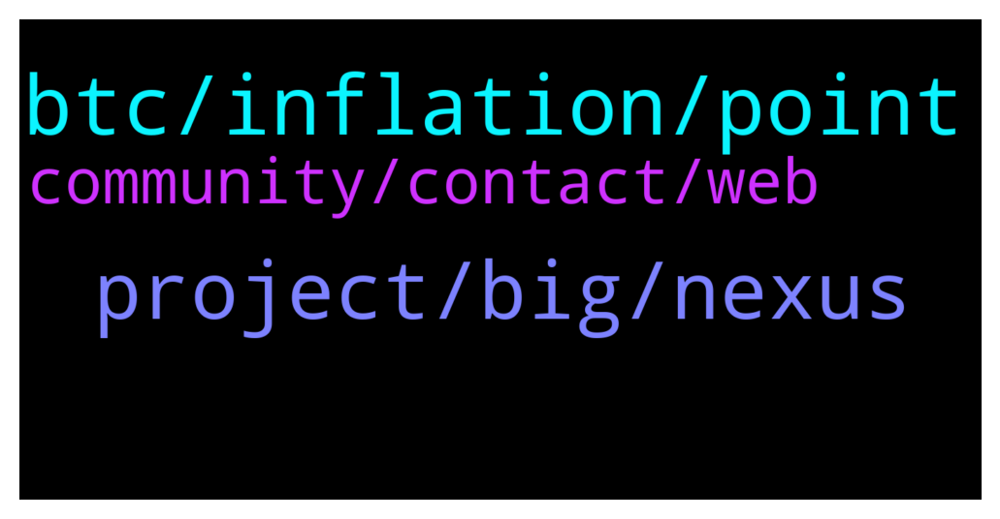

# **@de_fi**
 ## Analysis for **2022-01-09** - **2022-01-16**.

---

## 📊 **Basic Stats**

**n_messages_sent**: 124

---

---

## 🔝 **Top keywords and related messages**

1. **btc, inflation, point**

    @polnyrazyob --- *Can someone explain what is happening with market? I’m holding from 2021 January, I invested 2k in 10 different coins, I have only made 100$ from ETH everything else is like 60% loss.. after a year of holding how come NOTHING has grown* **--->** [TG Discussion](https://t.me/de_fi/233766)

    @xnatasx --- *Yeah, don't think it has to do with gas, but liquidity.* **--->** [TG Discussion](https://t.me/de_fi/233962)

    @Mark --- *Hype is the fastest money to come, as long as in the wind, everything is profitable.* **--->** [TG Discussion](https://t.me/de_fi/233871)

    @xnatasx --- *Btc is the most decentralized. Had the fairest launch. Is the most secure. Is basically free to send over lightning. Has a fixed supply with reducing inflation...* **--->** [TG Discussion](https://t.me/de_fi/233948)

    @Me_Jakob --- *BTC is most decentralised- but governments can control miners, miners can control price. Isn’t it? BTC transactions are quantum vulnerable. It’s just a matter of time when China or whoever else will reach quantum supremacy. And lightning network is just and banking system as big coders says.. Maybe I’m wrong and I need some deeper research, but in comparing BTC with NXS it’s still a lot of things that BTC is missing.* **--->** [TG Discussion](https://t.me/de_fi/233950)

    @xnatasx --- *They don't send erc20 over the lightning network. So must have a pool to be able to allow access to or something* **--->** [TG Discussion](https://t.me/de_fi/233965)

2. **project, big, nexus**

    @vavaeeu --- *Looking for some cool projects to invest and grow in 2022* **--->** [TG Discussion](https://t.me/de_fi/233592)

    @Alex --- *Has anyone heard of the crypto fantasy coin?* **--->** [TG Discussion](https://t.me/de_fi/233039)

    @Meggie --- *Hello, check out this amazing crypto project from Gunzilla Games! It’s my first YouTube video so any feedback or a sub would make my day ☺️  https://youtu.be/LKZQpj0r_kI* **--->** [TG Discussion](https://t.me/de_fi/234378)

    @Me_Jakob --- *Nexus is a scalable, quantum-resistant blockchain securing an uncensorable and free internet through a hack-resistant Operating System. Nexus’ integrated API makes developing decentralized applications (DApps) easy with “no-code” web tools like Bubble. Create tokens and assets (NFTs), design contracts, or use our templates. All our features are available on the public network or a private (hybrid) chain.  I’m just a maxi of $NXS and soon next big update is coming. I wish some of peoples who are familiar with programming or development - take a look on Nexus blockchain and what they are doing. Wish you all the best ❤️  Here you can familiarise with Nexus and it’s features. I hope it will be interesting for you to read:) https://devdocs.nexus-interactions.io* **--->** [TG Discussion](https://t.me/de_fi/233730)

    @EvaJohnson --- *🔸Dear Community Members 🔸  💥Thrilled to announce that Panther Quant's partnership with Black Dog Venture Partners gets recognition in FXFinanceFeeds which is one of the world's premiere interactive electronic trading industry news source! 🚀🔥  https://twitter.com/PantherQuant/status/1477700444767932417?s=20* **--->** [TG Discussion](https://t.me/de_fi/232964)

    @seventh_cadmus --- *1. Where can I buy Enhanced Finance $EFIN?  Answer - Pancake Swap ;  https://pancakeswap.finance/swap?outputCurrency=0x9B908d1953ce21F9D654236e0B51e3f688fd7fD9* **--->** [TG Discussion](https://t.me/de_fi/233890)

3. **community, contact, web**

    @Show Man --- *Hello mate what is this community all about* **--->** [TG Discussion](https://t.me/de_fi/232979)

    @seventh_cadmus --- *Check on us. If you want, love you bye.* **--->** [TG Discussion](https://t.me/de_fi/233616)

    @xnatasx --- *In this chat we are volunteering. But best of luck.* **--->** [TG Discussion](https://t.me/de_fi/233214)

    @seventh_cadmus --- *Hey!!!!!! Don't. I am bad at talking in groups but anyway. I want to talk* **--->** [TG Discussion](https://t.me/de_fi/233612)

    @dnvmck --- *hfe❤️Cryptocurrency CFD Trading❤️Free delivery tips❤️Daily income 200-1000USDT❤️Interested chat me privately❤️Or see my profile contact the main number❤️Please register first: https://qc-ex.com/signup.php?invitecode=4881* **--->** [TG Discussion](https://t.me/de_fi/234364)

    @mariamagenes --- *Hello guys! We are looking for a PM at oasis.app - message me if interested* **--->** [TG Discussion](https://t.me/de_fi/233383)

