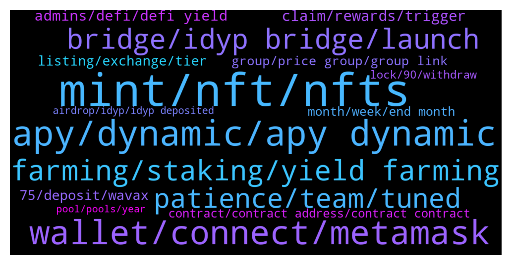

# **@dypfinance**
 ## Analysis for **2022-01-09** - **2022-01-16**.

---

## 📊 **Basic Stats**

**n_messages_sent**: 1225

---

---

## 🔝 **Top keywords and related messages**

1. **mint, nft, nfts**

    @timdyp --- *🔥Join Cats and Watches Society #NFTs Whitelist 🎉One Brand New Rolex Daytona Ceramic 116500LN worth $40k Giveaway  To win the watch: ✅Join dyp.finance/whitelist ✅Mint one #NFT once available ✅Like & Retweet this post ✅Join discord.gg/dypcaws ✅Tag 3 friends  👉https://twitter.com/dypfinance/status/1480623073208549380* **--->** [TG Discussion](https://t.me/dypfinance/238523)

    @timdyp --- *Good morning #DYPians😼  Don't forget to join the whitelist for our upcoming #NFTs collection https://dyp.finance/whitelist  👉https://twitter.com/dypfinance/status/1480822527354101760* **--->** [TG Discussion](https://t.me/dypfinance/238688)

    @timdyp --- *Enter the #Metaverse with Cats and Watches Society #NFTs 💨  Join the Discord to learn more👇 https://discord.gg/dypcaws  👉https://twitter.com/dypfinance/status/1480540581671710729* **--->** [TG Discussion](https://t.me/dypfinance/238447)

    @timdyp --- *The watch is ready to be shipped! 🔥👀* **--->** [TG Discussion](https://t.me/dypfinance/238530)

    @hemanrock --- *PAW has collection of 10,000 cat NFT s* **--->** [TG Discussion](https://t.me/dypfinance/237233)

    @iamJubi --- *Hello. ICO was already done back in 2020. If you are referring to the NFT, there is no exact minting date yet.* **--->** [TG Discussion](https://t.me/dypfinance/239257)

2. **apy, dynamic, apy dynamic**

    @Disguy125 --- *I'm curious what the apy is adjust to?   Would the team be will to airdrop locked LP wallets compensation to help minaret the 85%IL in iDYP.* **--->** [TG Discussion](https://t.me/dypfinance/239123)

    @DhoniMSD516 --- *Hey the rewards you get depend on APY and your pool share %, for no lock due to not enough liquidity only 364 iDYP swapped for rewards rest sent to To be Burned/Disbursed but if tmrw there is enough liquidity all the allotted iDYP will be converted and rewards are shared accordingly* **--->** [TG Discussion](https://t.me/dypfinance/238999)

    @DhoniMSD516 --- *The APY is dynamic it might be low now but can increase in future* **--->** [TG Discussion](https://t.me/dypfinance/236442)

    @Disguy125 --- *Imagine the apy went up to 5000% or something lol* **--->** [TG Discussion](https://t.me/dypfinance/239129)

    @ahuman516 --- *Facts mate, APY is dynamic and no one can from team can change it, consider the scenarios like marketprice people joining the pool etc* **--->** [TG Discussion](https://t.me/dypfinance/236783)

    @D0nkeyKong --- *That the APY goes down is clear, but that the LP token permanently crashes so fast and i have to watch that the money every day by 10% less is shit :(* **--->** [TG Discussion](https://t.me/dypfinance/237001)

3. **wallet, connect, metamask**

    @PerJonsson --- *Hi, Im trying to withdraw from bridge with my ledger on eth chain and having problem with ledger. ”Transaction 80 failed. Please enable blind signing or contract data in eth app settings” I have done that but still problem. It works fine with bsc. Has anyone seen this and fixed it?* **--->** [TG Discussion](https://t.me/dypfinance/237149)

    @timdyp --- *Clear your cookie & cache and try again.* **--->** [TG Discussion](https://t.me/dypfinance/238534)

    @bogdantzr --- *She was asking me to deposit 0.5 eth in the wallet in order for the wallet to connect* **--->** [TG Discussion](https://t.me/dypfinance/238710)

    @hemanrock --- *Please make sure you are well connected to right Wall and right network.* **--->** [TG Discussion](https://t.me/dypfinance/237450)

    @fightinamish --- *Got it reinvested, thank you.  It does a weird thing (especially on iPhone) where you click idyp allocation and it goes to the page for 1-2 seconds and then snaps back to connect wallet.  I can access everything on site through my phone except for idyp.  Then on mac I can get it to work but after multiple attempts.  Nothing major, just an fyi* **--->** [TG Discussion](https://t.me/dypfinance/237452)

    @Aliceasdf --- *But what should I do if I can't connect to the wallet* **--->** [TG Discussion](https://t.me/dypfinance/237622)

4. **farming, staking, yield farming**

    @DhoniMSD516 --- *Hello nope the V1 contracts expired you can check our V2 farms https://dyp.finance/farmv2/bsc* **--->** [TG Discussion](https://t.me/dypfinance/237104)

    @Nazhadi57 --- *Is there any IL for the farms?* **--->** [TG Discussion](https://t.me/dypfinance/237290)

    @mohammadnickeghbal --- *I new in group , how can earn income from defi  daily ? Can guide  me , thanks* **--->** [TG Discussion](https://t.me/dypfinance/237701)

    @<UNK> --- *Can we earn passively by staking this in trust wallet?* **--->** [TG Discussion](https://t.me/dypfinance/237764)

    @hemanrock --- *The staking/Farming works under POS(Proof of stake concept) there are many explanation regarding this already available on Google and Youtube so please check out them.* **--->** [TG Discussion](https://t.me/dypfinance/236392)

    @monstar126 --- *Oh after that how can I cheak my farming* **--->** [TG Discussion](https://t.me/dypfinance/239727)

5. **bridge, idyp bridge, launch**

    @timdyp --- *We need your vote regarding the #iDYP Bridge Launch. Bellow you will find the #iDYP Bridge proposal details and the reasons why the decision should belong to our community👇 https://gov.dyp.finance/proposals/15* **--->** [TG Discussion](https://t.me/dypfinance/238836)

    @DhoniMSD516 --- *Hey Matic expansion is not live yet, if we launched and yes bridge also might be possible* **--->** [TG Discussion](https://t.me/dypfinance/238249)

    @panda_999999 --- *This bridge is too inconvenient, hope it can be improved in the future* **--->** [TG Discussion](https://t.me/dypfinance/237864)

    @tamtamkanto --- *What are the plans for the bridge if the vote is approved? Will the bridge be available immediately?* **--->** [TG Discussion](https://t.me/dypfinance/238881)

    @timdyp --- *Next week we are going to release the #iDYP Bridge  The bridge will create balance between the V2 pools and unique trading opportunities.  #DeFi #Ethereum #BinanceSmartChain #Avalanche  👉https://twitter.com/dypfinance/status/1480172181598396422* **--->** [TG Discussion](https://t.me/dypfinance/238219)

    @Lawrence --- *With the bridge that’s in there control so, same as the NFTs that’s in there control* **--->** [TG Discussion](https://t.me/dypfinance/238154)

6. **patience, team, tuned**

    @iamJubi --- *Rest assured that the team will get your query. hoping for your patience. 🙂* **--->** [TG Discussion](https://t.me/dypfinance/236648)

    @michaelder --- *@iamJubi Hey Jubi just wondering if there has been any feedback from my question early today? Cheers 😀* **--->** [TG Discussion](https://t.me/dypfinance/236719)

    @Jackmambaaa --- *So only thing is patience and trust the process 🙂* **--->** [TG Discussion](https://t.me/dypfinance/237891)

    @Nji_jalen --- *One by one good news will coming. Stay tuned HODLers* **--->** [TG Discussion](https://t.me/dypfinance/238241)

    @DhoniMSD516 --- *Will be very happy to see such feedback Thanks :)* **--->** [TG Discussion](https://t.me/dypfinance/236678)

    @DhoniMSD516 --- *Hey any news will be shared to community please stay tuned :) https://t.me/dypannouncements* **--->** [TG Discussion](https://t.me/dypfinance/237008)

7. **claim, rewards, trigger**

    @v1ruzz --- *So you mean they need to be claimed everyday or they are lost is it* **--->** [TG Discussion](https://t.me/dypfinance/238960)

    @StalkerUkt --- *Because I have stack since 4 mouth and I can’t claim nothing* **--->** [TG Discussion](https://t.me/dypfinance/236283)

    @H4S2K --- *when can they be usually redeemed* **--->** [TG Discussion](https://t.me/dypfinance/236653)

    @DhoniMSD516 --- *Hey the WBNB rewards will be shown when claim trigger happened so just hover on Claim and see time for next rewards and if it says feel free to claim trigger the claim* **--->** [TG Discussion](https://t.me/dypfinance/239062)

    @hemanrock --- *Rewards will be updated every 24H and after someone or you trigger the claim, but nothing to worry even if rewards are not shown lets say for 7 days on 8th day if claim trigger happens you get all 8 days rewards* **--->** [TG Discussion](https://t.me/dypfinance/237759)

    @DhoniMSD516 --- *Rewards will be updated every 24H and after someone or you trigger the claim, but nothing to worry even if rewards are not shown lets say for 7 days on 8th day if claim trigger happens you get all 8 days rewards* **--->** [TG Discussion](https://t.me/dypfinance/237096)

8. **admins, defi, defi yield**

    @Nico_Gan --- *Hi guys, i m new in “defi protocols”  Thanks for this group🙋‍♂️* **--->** [TG Discussion](https://t.me/dypfinance/239990)

    @Jabirbobo001 --- *Please is defi yield announcement group legit???* **--->** [TG Discussion](https://t.me/dypfinance/239217)

    @BabyLixin --- *DeFi Yield Protocol This is its current price 0.437* **--->** [TG Discussion](https://t.me/dypfinance/238930)

    @luruch --- *I have some friends with yours wallets scammed, how can a allowance(revoke token) protect they?* **--->** [TG Discussion](https://t.me/dypfinance/239807)

    @DhoniMSD516 --- *Hey firstly we don't have a wallet, if your friends got scammed ask them to check google on how to avoid further loss, we always keep on saying never accept dm's claiming who are admins and never click links* **--->** [TG Discussion](https://t.me/dypfinance/239808)

    @BabyLixin --- *DeFi Yield Protocol Will the price go up to 0.1?* **--->** [TG Discussion](https://t.me/dypfinance/238928)

9. **75, deposit, wavax**

    @timdyp --- *The DYP-WAVAX farm is live on KyberSwap!  Current APY: ~483.14% Total Liquidity: $859,218 Staked TVL: $252,258  Check Analytics👇 https://avax-analytics.kyberswap.com/pool/0x44d1b2974b3b8ce93b261f6d15dce5ad57f8933b  Start Farming👇 https://kyberswap.com/#/farms?networkId=43114  👉https://twitter.com/dypfinance/status/1480906185482149896* **--->** [TG Discussion](https://t.me/dypfinance/239144)

    @shinigamikami --- *Give it time mate, you’re not that down due to the rewards and IL is only temporary. My $6k deposit on bsc buyback peaked $19k now it’s barley $1500 but I’m not really bothered cause I plan to leave it there for at least 5 months* **--->** [TG Discussion](https://t.me/dypfinance/237472)

    @Craig --- *I haven't heard the term "buyback" before in the farming pools I'm in. What is that, exactly?* **--->** [TG Discussion](https://t.me/dypfinance/237473)

    @danasocial --- *i think i don't understand, 60 days ago i deposited 9 avax and 1100 DYP for an equivalent of 91LP, now the contract is expired and i withdraw and in my wallet are returned...32dyp? What's happened? i don't understand* **--->** [TG Discussion](https://t.me/dypfinance/237235)

    @Paulus --- *Yes and it auto switch about 25% to DYP. i mean what if we withdraw the DYP, does it affect the share* **--->** [TG Discussion](https://t.me/dypfinance/238471)

    @Paulus --- *Hmm, WAVAX farming 3 days lock seem keep losing.* **--->** [TG Discussion](https://t.me/dypfinance/237974)

10. **listing, exchange, tier**

    @alvindrajw --- *I have a doubt if the team planned tier 1 listing in December then they should be prepare all the details and apply it before right. But the admin said they gave all the details in dec 8. Is that proper way? And from starting October itself the team said listing will be on november or December* **--->** [TG Discussion](https://t.me/dypfinance/238145)

    @DhoniMSD516 --- *Hey mate just like everyone else we are waiting for listing to announce about listing we provided all the infos to exchanges and there is nothing else we can do instead of just wait, have some patience and listing will be happened* **--->** [TG Discussion](https://t.me/dypfinance/238195)

    @ahuman516 --- *Then why you are still here? Leave this community.  You gave no value to community except for asking wen listing always, glad that you are now out we can stay in peace from your repetitive question 😂* **--->** [TG Discussion](https://t.me/dypfinance/237266)

    @ahuman516 --- *People who are asking for listing are nothing but noobs, listing in this market conditions do no good* **--->** [TG Discussion](https://t.me/dypfinance/238198)

    @alvindrajw --- *Can we expect listing before jan 31...* **--->** [TG Discussion](https://t.me/dypfinance/239578)

    @DhoniMSD516 --- *Hey we already applied for multiple exchanges and listings coming soon* **--->** [TG Discussion](https://t.me/dypfinance/240202)

11. **group, price group, group link**

    @FR778778 --- *Where are the people in the group?😂😂😂* **--->** [TG Discussion](https://t.me/dypfinance/237193)

    @Noun --- *Please provide me the group link* **--->** [TG Discussion](https://t.me/dypfinance/237677)

    @valerian12138 --- *Hello, I want to ask who is in charge of community cooperation* **--->** [TG Discussion](https://t.me/dypfinance/236979)

    @herbie1996 --- *Is this a permanent group or something that expires? I downloaded clubhouse but couldn’t find nothing dyp related* **--->** [TG Discussion](https://t.me/dypfinance/237766)

    @minnk3 --- *Who can tell me what investment group this is😊😊* **--->** [TG Discussion](https://t.me/dypfinance/236872)

    @Annayating --- *Hello, I’m very happy to join this group. I hope to learn more knowledge here.* **--->** [TG Discussion](https://t.me/dypfinance/236984)

12. **month, week, end month**

    @timdyp --- *Not sure Tyler, maybe Monday or Wednesday the latest.* **--->** [TG Discussion](https://t.me/dypfinance/238228)

    @tamtamkanto --- *By next week, do you mean the 16th-22nd?* **--->** [TG Discussion](https://t.me/dypfinance/238378)

    @Bodo --- *Thanks.. so it says 3 months but in fact, will release in 1 month pls?* **--->** [TG Discussion](https://t.me/dypfinance/238735)

    @Disguy125 --- *What day do you expect ?* **--->** [TG Discussion](https://t.me/dypfinance/238222)

    @DhoniMSD516 --- *It will done mate, this month all the pending from 2021 will be coming.* **--->** [TG Discussion](https://t.me/dypfinance/237871)

    @DhoniMSD516 --- *It should say 1 month, can you please provide a screenshot in DM?* **--->** [TG Discussion](https://t.me/dypfinance/238736)

13. **contract, contract address, contract contract**

    @dung865309 --- *0xbd100d061e120b2c67a24453cf6368e63f1be056 is this the real contract* **--->** [TG Discussion](https://t.me/dypfinance/236867)

    @DhoniMSD516 --- *Hello yes you can find our contracts code on our github https://github.com/dypfinance* **--->** [TG Discussion](https://t.me/dypfinance/238415)

    @DhoniMSD516 --- *Ok yes those are all contracts* **--->** [TG Discussion](https://t.me/dypfinance/240160)

    @DhoniMSD516 --- *The one you posted before is not our contract* **--->** [TG Discussion](https://t.me/dypfinance/236878)

    @dung865309 --- *and this is another contract ?* **--->** [TG Discussion](https://t.me/dypfinance/236873)

    @DhoniMSD516 --- *Might be contracts, where you are checking btw?* **--->** [TG Discussion](https://t.me/dypfinance/240157)

14. **lock, 90, withdraw**

    @DhoniMSD516 --- *Depends on pool you joined, there are pools with no lock time till 90 days so if you join no lock time you can withdraw anytime, if you join 90 days you can withdraw only after 90 days* **--->** [TG Discussion](https://t.me/dypfinance/239701)

    @monstar126 --- *And 1 last question Can I withdrawal it any time* **--->** [TG Discussion](https://t.me/dypfinance/239698)

    @DhoniMSD516 --- *If you didn't withdraw yet, you can continue without withdrawing and still earn rewards even after 30 days, if withdrawn and want to restake then yes you can do that.* **--->** [TG Discussion](https://t.me/dypfinance/237094)

    @monstar126 --- *Oh if i choose 90 day's then i can not withdraw it before 90 day's* **--->** [TG Discussion](https://t.me/dypfinance/239705)

    @hemanrock --- *If you didn't withdraw, you can continue without withdrawing and still earn rewards even after your locktime finishes.* **--->** [TG Discussion](https://t.me/dypfinance/239464)

    @iamJubi --- *If your lock time expires and you don`t withdraw, you will still continue to earn reward.* **--->** [TG Discussion](https://t.me/dypfinance/236671)

15. **airdrop, idyp, idyp deposited**

    @DhoniMSD516 --- *The iDYP you deposited in farms is your claimed iDYP and there is no lock for it, so if you withdraw as iDYP after your farm lock you can trade it freely* **--->** [TG Discussion](https://t.me/dypfinance/239411)

    @Tom --- *I had participated in 3 Avax farms in V1 and exited all farms in last November. When I connect my MetaMask accounts to DYP farm airdrops, I still see iDyp deposited and locked there with rewards. This iDyp deposited is not withdrawable now it seems. However I can claim rewards there. When will the deposited iDyp be unlocked?* **--->** [TG Discussion](https://t.me/dypfinance/239479)

    @Tom --- *I understand this wrt V2 farm. But I m referring to the Avax farms which I exited in November. It must be V1 then. When I connect the MetaMask account after clicking Dyp/ airdrop in Avax network, i see a page with my iDyp deposited and I am earning rewards. When I click withdraw that, it cannot be withdrawn. This MetaMask account has no V2 farm connected to it. So, I wonder I m still having this iDyp locked even though I pulled out of the farm? How or when can I withdraw this iDyp?* **--->** [TG Discussion](https://t.me/dypfinance/239483)

    @Justin --- *I have a question about an old farm I deposited 27 Defiyield into about 14 months ago. I cant see it list in the dapp but can see it on Etherscan..can I still remove it and sell it back to Eth?* **--->** [TG Discussion](https://t.me/dypfinance/240118)

    @denileema --- *Dear Administrator When will CMC airdrop results be announced?* **--->** [TG Discussion](https://t.me/dypfinance/238901)

    @Tom --- *Can I withdraw the iDyp seen under Airdrop in my Avax chain? If I withdraw it, will it affect my Wavax V2 farm  rewards?* **--->** [TG Discussion](https://t.me/dypfinance/236763)

