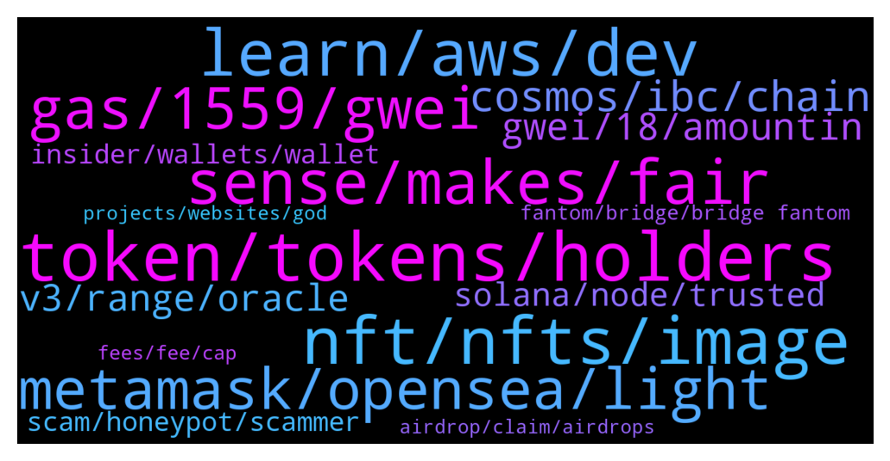

# **@lobsters_chat**
 ## Analysis for **2022-01-09** - **2022-01-16**.

---

## 📊 **Basic Stats**

**n_messages_sent**: 2334

---

---

## 🔝 **Top keywords and related messages**

1. **token, tokens, holders**

    @PmRiviere --- *to be fair after a quick check it looked legit + no token. @Cryptocamel you can probably repost if there s something constructive to say about this* **--->** [TG Discussion](https://t.me/lobsters_chat/312138)

    @Miinhh --- *I dont think that mechanic makes any sense, unless your token has any utility* **--->** [TG Discussion](https://t.me/lobsters_chat/315643)

    @vasilysumanov --- *Maybe people need to prove it first with models?  If you want to say that tokenomics is cool please share model & calculations* **--->** [TG Discussion](https://t.me/lobsters_chat/312322)

    @yic_alex --- *Prime example of something that should never have gotten a token. fees.wtf was perfectly fine in the simple way it originally got released. Turning it into a ponzi is kind lazy / greedy on the part of the creators imho. (I know its not cool to point this out these days but eventually people have to calm down with this airdrop/staking/ponzi stuff. There must be better ways to monetize a brand.)* **--->** [TG Discussion](https://t.me/lobsters_chat/315794)

    @SilkCE --- *Legit question @andrecronje Will the tokens only be sellable to a treasury or something hence why no one can buy it only earn it?* **--->** [TG Discussion](https://t.me/lobsters_chat/313235)

    @litlife4 --- *Do they wish to burn all their tokens to zero* **--->** [TG Discussion](https://t.me/lobsters_chat/313957)

2. **nft, nfts, image**

    @PythiaPythia --- *Hey guys, I have 0 experience with erc721. I am wondering if NFTs could be used to take several separte positions for example on Aave. Say with one I deposit some wbtc and take out a loan and, with another NFT i deposit some eth. This would prevend an eventual liquidation to sell also my eth. My assumption is that NFTs have an address. If not, what would the best approach be? Create some contracts and make each deposit with a different contract.* **--->** [TG Discussion](https://t.me/lobsters_chat/315952)

    @HatuSSS --- *NFTrade.com by a significant margin  https://dappradar.com/avalanche/marketplaces/nftrade* **--->** [TG Discussion](https://t.me/lobsters_chat/315873)

    @MiguelPim --- *hello, whats the best NFT marketplace in avax?* **--->** [TG Discussion](https://t.me/lobsters_chat/315870)

    @anishagnihotri --- *His concern was:  - You have some NFT with some metadata that says (name: Lobster Dao NFT, description: Some description) - This NFT is often stored at a centralized endpoint like lobsterdaowebsite.xyz/nft/1.json - There is no hash of what is stored at lobsterdaowebsite.xyz/nft/1.json  This means, you (1) lose your NFT if lobsterdaowebsite.xyz goes down, and (2) if in the future, someone else buys lobsterdaowebsite.xyz (say when the domain expires), they can freely change the metadata to whatever they want. In which case, your NFT might then return (name: Other NFT Name, description: ...).  Alternatively, if you hash the metadata+image, users can verify that the content returned from lobsterdaowebsite.xyz/nft/1.json is, in fact, what was intended. This solves problem (2).* **--->** [TG Discussion](https://t.me/lobsters_chat/314714)

    @Crypto_cow_boy --- *what the hell is The Doge NFT?* **--->** [TG Discussion](https://t.me/lobsters_chat/314843)

    @xecordoteth --- *the project is basically fractionalized ultrarare NFTs* **--->** [TG Discussion](https://t.me/lobsters_chat/315062)

3. **learn, aws, dev**

    @Light --- *Hey guys, I'm a web2 software engineer, and unfortunately the past 2 years i was isolated from technology, so I wanted to ask, how can I catch up with everything? I have the coingecko how to defi books.. how can I learn the technicals of blockchain development and l1s and l2s chains and stuff... sorry for the beginner and kinda general question, any guidance in any direction is highly appreacited 🙏* **--->** [TG Discussion](https://t.me/lobsters_chat/313684)

    @emobludd --- *https://synaps.io/#manager mb who knows how to connect it* **--->** [TG Discussion](https://t.me/lobsters_chat/312283)

    @tatai_007 --- *Basically want to get familiar with the concepts and terms* **--->** [TG Discussion](https://t.me/lobsters_chat/312972)

    @Nicolas_A --- *Would recommend checking https://youtube.com/playlist?list=PLjrTIwaNiTwn39tg3sR_bPBWGHoznv47D if you are trying to get familiar with the basic concepts* **--->** [TG Discussion](https://t.me/lobsters_chat/312994)

    @MorriganIV --- *Lately I suggest https://www.web3.university/ for beginners as it has updated and organized info* **--->** [TG Discussion](https://t.me/lobsters_chat/313690)

    @Darrenlautf --- *https://thedailyape.notion.site/Coding-e6389ca272154727bc5b1a06b6e4e312 its a bit of a mess i'll need to reorg this notion but heres some guides* **--->** [TG Discussion](https://t.me/lobsters_chat/313699)

4. **sense, makes, fair**

    @anisopteran --- *Like you ask questions and then don’t appear to have the mental capacity to understand the answers* **--->** [TG Discussion](https://t.me/lobsters_chat/313730)

    @ivangbi --- *Thanks gotcha, seems fair and clean then to me* **--->** [TG Discussion](https://t.me/lobsters_chat/314898)

    @Walkadbout --- *For reference I'm talking about that: https://docs.ethos.wiki/ethereansos-docs/guilds/guilds-documentation/organizations/modular-components/fixed-inflation-manager* **--->** [TG Discussion](https://t.me/lobsters_chat/314419)

    @ivangbi --- *Ah ok this makes more sense then thx* **--->** [TG Discussion](https://t.me/lobsters_chat/315066)

    @kapur_sanat --- *Ah fair enough the stability’s perspective makes a lot of sense and I didn’t know that - thanks @samkazemian* **--->** [TG Discussion](https://t.me/lobsters_chat/314457)

    @xecordoteth --- *Ah, makes perfect sense. Thank you so much for the explanation!* **--->** [TG Discussion](https://t.me/lobsters_chat/314715)

5. **gas, 1559, gwei**

    @coine_r --- *There is this: https://twitter.com/jadler0/status/1427627499983343633?s=20  Personally, I miss my cheap gas weekends but I limit my Ethereum interactions to every other blue moon to make it hurt less lol* **--->** [TG Discussion](https://t.me/lobsters_chat/314059)

    @PmRiviere --- *More tx more profit more difficulty right?* **--->** [TG Discussion](https://t.me/lobsters_chat/315143)

    @JellyF --- *Wtf is going on on Matic? The gas is still 500+... Still those shitgame bots?* **--->** [TG Discussion](https://t.me/lobsters_chat/313666)

    @Cryptoaq --- *Fees wtf helped some of us to realice the value of gas* **--->** [TG Discussion](https://t.me/lobsters_chat/315300)

    @Joel_john --- *this has the same logic of - we should stop using literal gas in our vehicles and go fully electric..* **--->** [TG Discussion](https://t.me/lobsters_chat/315129)

    @PmRiviere --- *at some point the community will have to gather around the idea we shall not trigger gas war on Ethereum for game / meme / pseudo-meme token anymore. This is serious energy waste when you think gas-fee in terms of monthly utility bill.  And harming the crypro community and web3 as a whole too.  Don't want to start a debate so blz don't reply to this, but we should start switching our views on this.* **--->** [TG Discussion](https://t.me/lobsters_chat/315128)

6. **metamask, opensea, light**

    @nutz3r123 --- *you saw this? vampire attack on Opensea https://looksrare.org/* **--->** [TG Discussion](https://t.me/lobsters_chat/314220)

    @JonathanDoe --- *Good read! Now the question is how do we change things?   For me, not being a software engineer, Web3 means that I am able to access dApps without having to create an username and a password, just with my private keys stored on a local “wallet” app.   But it is troublesome that MetaMask has the possibility to link my otherwise totally separated addresses, sending my privacy to shit. Or that OpenSea provides the API for viewing my jpeg NFTs, and that once they are removed from OpenSea, they cannot be viewed from my “wallet” app as well.   What is the solution? Does anyone of the leading devs in this space even care about these things? Or we’re all just chasing dough under the pretext of decentralized finance (no pun intended for our members here)?* **--->** [TG Discussion](https://t.me/lobsters_chat/313669)

    @anisopteran --- *and light clients are inherently not trustless* **--->** [TG Discussion](https://t.me/lobsters_chat/314722)

    @anisopteran --- *Metamask isn’t the only wallet in existence, and if you’re concerned that loading all of your keys into the same instance of an app allows them to be linked together, then don’t do that. Load them into separate instances of the app or different apps.* **--->** [TG Discussion](https://t.me/lobsters_chat/313723)

    @JonathanDoe --- *You don’t get it, do you? Average Joe uses MetaMask and OpenSea by default thinking they’re private and decentralized…* **--->** [TG Discussion](https://t.me/lobsters_chat/313729)

    @anisopteran --- *the point is that you don't need metamask or opensea or anyone.* **--->** [TG Discussion](https://t.me/lobsters_chat/313686)

7. **cosmos, ibc, chain**

    @sir_integra_hellsing --- *UST is Terra. Terra doesn't use IBC, just uses the Cosmos SDK. Kinda like how Binance Chain works (not BSC, the one before that, the BEP2 one)* **--->** [TG Discussion](https://t.me/lobsters_chat/314539)

    @Siimmoonn --- *ATOM can currently be used for governance + staking with validators. New zones in cosmos can incentivize current validators of the Cosmos HUB to also secure their chain/zone. This could have an impact on the price of ATOM but in general the ATOM token is isolated from things happening on zones like secret network or sifchain. Please correct me if I  have missed any new development on ATOM utility* **--->** [TG Discussion](https://t.me/lobsters_chat/314553)

    @Siimmoonn --- *Also to split a few hairs: IBC is part of Cosmos SDK.* **--->** [TG Discussion](https://t.me/lobsters_chat/314543)

    @jackzampolin --- *JS smart contract + IBC + gigabrain team = great* **--->** [TG Discussion](https://t.me/lobsters_chat/313343)

    @PmRiviere --- *Does Cosmos directly profit from usage of their tech or public good?* **--->** [TG Discussion](https://t.me/lobsters_chat/314973)

    @Cat_Graphy --- *How does ATOM have any relations to IBC when it’s a Cosmos SDK. They are using the SDK, doesn’t imply adoption of IBC will affect ATOM anyway right?* **--->** [TG Discussion](https://t.me/lobsters_chat/314550)

8. **gwei, 18, amountin**

    @JonathanDoe --- *I could also calculate Bitcoin hash by hand. But that doesn’t really answer my question, does it?* **--->** [TG Discussion](https://t.me/lobsters_chat/313713)

    @gryphusito --- *but when making a transaction, I need to know how much it could increase* **--->** [TG Discussion](https://t.me/lobsters_chat/312450)

    @syed_jafri --- *amountIn put WTF amount and then click + 10^18 amountOut put ETH amount and then click + 10^18* **--->** [TG Discussion](https://t.me/lobsters_chat/315425)

    @stevenhq --- *11 gwei as it replaces the 10 gwei one* **--->** [TG Discussion](https://t.me/lobsters_chat/312817)

    @RobAnon --- *USDC is a 6 decimal token* **--->** [TG Discussion](https://t.me/lobsters_chat/314438)

    @memer999 --- *what do i put for amountOutMin and amountIn?* **--->** [TG Discussion](https://t.me/lobsters_chat/315423)

9. **v3, range, oracle**

    @fozzysbo --- *So listened to the common core with the stark ware guy. Am I missing something or is it the same vaporware of everything else. Just moving computation to a centralized source then confirming on L1. Am I missing something?* **--->** [TG Discussion](https://t.me/lobsters_chat/313284)

    @ga3b_node --- *anyone who can explain better what the issues with v3 are re: bootstrapping liquidity and LMing? or any good sources discussing this?* **--->** [TG Discussion](https://t.me/lobsters_chat/313570)

    @statelayer --- *zef was making a turn-v3-full-range-into-erc20-LP thingie, we might use it for sudo pool2* **--->** [TG Discussion](https://t.me/lobsters_chat/314807)

    @statelayer --- *but honestly pool2 on uniswap v2 + v3 works well* **--->** [TG Discussion](https://t.me/lobsters_chat/314808)

    @AngelaGilhotra --- *yes, oh boi, i think this was the error all along. i’ll try making the changes in the script again and try v3 Pool contract - since that’s essentially what I want* **--->** [TG Discussion](https://t.me/lobsters_chat/314442)

    @danrobinson010 --- *And people use v2 rather than full-range v3 because it’s currently easier to implement liquidity mining for the former?* **--->** [TG Discussion](https://t.me/lobsters_chat/314793)

10. **solana, node, trusted**

    @LilMoonLamboX3 --- *near is what everyone thought solana was gonna be* **--->** [TG Discussion](https://t.me/lobsters_chat/315681)

    @rishabh_narang --- *anyone here building on top of solana? would love to get a high level on problems facing in implementation, I'm building sharpe.ai building multi-strategy asset management products onchain, looking at potentially building on top of polygon as an alternative.* **--->** [TG Discussion](https://t.me/lobsters_chat/312630)

    @anisopteran --- *Ethereum isn't Solana, you can run a node yourself without paying through the nose* **--->** [TG Discussion](https://t.me/lobsters_chat/314728)

    @william_s_4 --- *(even Solana is looking (through Neon) at getting a Solidity transpiler, but I'll believe when it actually works)* **--->** [TG Discussion](https://t.me/lobsters_chat/312639)

    @anisopteran --- *(or i guess hardhat does that now, but that just contributes to my point - ethereum's ecosystem has thrown away more of these tools than solana has in production)* **--->** [TG Discussion](https://t.me/lobsters_chat/312645)

    @anisopteran --- *Not that these are problems unsolvable by throwing huge amounts of cash at them, which solana definitely has* **--->** [TG Discussion](https://t.me/lobsters_chat/312646)

11. **scam, honeypot, scammer**

    @tesslerc --- *They are geniuses, it's a pretty smart scam model.  Make public scam, dismiss all community warnings as fud, launch and scam many people, write post mortem about how sad you are, keep scammed funds.* **--->** [TG Discussion](https://t.me/lobsters_chat/315797)

    @Walkadbout --- *How is that a scam honeypot? They decided the tokenomics of their token, that's an arbitrary decision you can pinpoint but calling it straight a "honeypot scam" is misleading at least* **--->** [TG Discussion](https://t.me/lobsters_chat/315177)

    @ivangbi --- *Like actually in the territory of a scam honeypot* **--->** [TG Discussion](https://t.me/lobsters_chat/315165)

    @TheKimonoOfBithumb --- *We’re all responsible for “the narrative”, and it’s very valuable that we don’t spread misinformation (especially in this strict “fact or fuck off” group). This is why I’m lashing back at you a little bit. No one gets their wallet drained by signing a message. No one gets their wallet drained by connecting to a dapp. There ARE a bunch of attack vectors/risks, such as getting someone to 1) share their seed phrase, 2) approve spending of one or more tokens to a rogue contract, 3) use a “faulty”/buggy contract that is later exploited and 4) getting tricked into sending tokens.  This is why it’s important to be vigilant whenever you use your wallet. Read and (preferably) understand what you are asked to do.  The distinction between someone falling for a phishing scam and getting their wallet drained because they signed a message is so fundamental that if the latter was possible this group wouldn’t exist, because crypto wouldn’t exist.* **--->** [TG Discussion](https://t.me/lobsters_chat/313602)

    @svenblockchain --- *7. Scammer gets on a discord call with target. Eventually gets target to screen share. Tells target to open inspect element by pressing ctrl+shift+i. I feel that's not really a hack, unless you count social engineering as a hack.* **--->** [TG Discussion](https://t.me/lobsters_chat/312292)

    @svenblockchain --- *You think that bug is proof of it being a honeypot?* **--->** [TG Discussion](https://t.me/lobsters_chat/313816)

12. **insider, wallets, wallet**

    @alexandomega --- *I wouldn't be so sure that he's tracking insider wallets (and whether there are any "insider wallets" to begin with). Did a thorough analysis of wallet transactions prior to all listings in Nov/Dec and found nothing at all (and doing this retrospectively should be easy, shouldn't it).* **--->** [TG Discussion](https://t.me/lobsters_chat/315012)

    @JoeHav --- *Not the point, that account clearly is tracking some insider wallets buying up coins planned to be listed on coinbase* **--->** [TG Discussion](https://t.me/lobsters_chat/315002)

    @ivangbi --- *Andre has previously said that is not HIS wallet though. Affiliated or not, can’t know. If he doesn’t wanna say, his business. But he said “not mine".* **--->** [TG Discussion](https://t.me/lobsters_chat/312439)

    @SujiSultan --- *Can confirm that there are "insider wallets".* **--->** [TG Discussion](https://t.me/lobsters_chat/315016)

    @zoomeroracle --- *@ivangbi @andrecronje I dont want to be rude but is it really not your wallet? Lots of twitter replies saying its the first yfi farmer* **--->** [TG Discussion](https://t.me/lobsters_chat/312589)

    @vPEPO --- *it was where I pulled a lot of data on CB insiders https://twitter.com/0xPEPO/status/1407800185774874624?s=20* **--->** [TG Discussion](https://t.me/lobsters_chat/314478)

13. **fantom, bridge, bridge fantom**

    @nutz3r123 --- *@andrecronje I have a question. Please dont feel offended by it, I am just curious: Why you build on fantom? Why not build something on L2 or eth itself? Or substrate, cosmos?  Because the fantom people are your friends? Or you really see some positive things there? Isnt it at the end a more centralized eth copy?* **--->** [TG Discussion](https://t.me/lobsters_chat/314636)

    @SilkCE --- *What if gas war on fantom and the blockchain breaks? 😅* **--->** [TG Discussion](https://t.me/lobsters_chat/313121)

    @Sp33dyTT --- *anyone know whats wrong with fantom now? Increased gas by 500 gwei and transactions keeps failing. Any solution?* **--->** [TG Discussion](https://t.me/lobsters_chat/313671)

    @Xeke65 --- *@ivangbi do u think by '22 Q2, that Fantom can be second ecosystem in terms of TVL? I'd like your opinion on Fantom, if u don't mind sharing.* **--->** [TG Discussion](https://t.me/lobsters_chat/315534)

    @sneg55 --- *any dex aggregator supporting Fantom, eg https://dex.guru/token/0x82f0b8b456c1a451378467398982d4834b6829c1-fantom* **--->** [TG Discussion](https://t.me/lobsters_chat/313862)

    @fiskantes --- *I am not looking for fake assurance nor industry wide caveats…not my first day here, I am avoiding rugs quite well 🙂  just asking if you guys have any assesment about Fantom bridge and validators specifically* **--->** [TG Discussion](https://t.me/lobsters_chat/315226)

14. **fees, fee, cap**

    @hugeshoe --- *Why do we need a pro version of fees.wtf* **--->** [TG Discussion](https://t.me/lobsters_chat/314863)

    @JellyF --- *Maybe the bots can be rate limited somehow? 😂 However, the chain itself probably benefits from high fees.* **--->** [TG Discussion](https://t.me/lobsters_chat/313051)

    @midgetwhale --- *CAP copied the custom DON from Gains Network. Gains Network has been using a DON for many months. CAP only since November 17th as said in the letter. See this Chainlink tweet dated July 27th.* **--->** [TG Discussion](https://t.me/lobsters_chat/312565)

    @devilinmiami --- *0.009 of the fee goes to this address https://etherscan.io/address/0x5cb7880035bd592a66aad803ce1cdf6aa385e2a1 already almost 14eth in there* **--->** [TG Discussion](https://t.me/lobsters_chat/315196)

    @Pantani0x --- *One gotta keep in mind the 0.5% burning fee too though.* **--->** [TG Discussion](https://t.me/lobsters_chat/312202)

    @syed_jafri --- *Their fees are pretty clear though* **--->** [TG Discussion](https://t.me/lobsters_chat/312620)

15. **projects, websites, god**

    @vincentweisser --- *great checklist on crypto legal by silke, gc at gnosis  https://docs.google.com/document/d/1GRNrmyuX1Wrs5dOpCeWhz6DdQteouAEMPzRqMFjbjYo/edit* **--->** [TG Discussion](https://t.me/lobsters_chat/315025)

    @Justin --- *how do you know about this. I guess crypto has grown more than I know to be this complex* **--->** [TG Discussion](https://t.me/lobsters_chat/312558)

    @PmRiviere --- *Yes i get your point about the ethos of the community. Also might be wrong to differentiate good vs. bad projects. My point is people should be conscious of the damages created, and maybe the crypto community should start to think seriously about the problem. Be it for institutional adoption / public opinion, which maybe is more in line with said ethos* **--->** [TG Discussion](https://t.me/lobsters_chat/315138)

    @tatai_007 --- *What are some good sources to follow crypto in general? Not just the market, but technical news about projects, what the are working on, etc.* **--->** [TG Discussion](https://t.me/lobsters_chat/314510)

    @phil_muhbags --- *>cryptocurrencies are not currencies >Websites are allowing users to pay via crypto   Well...Which one is it?  Why is that people who hate something so much barely do any sort of research. You know if I want to talk shit about something I really dig deep into it.* **--->** [TG Discussion](https://t.me/lobsters_chat/312963)

    @PmRiviere --- *Good to see coop between crypto-native startups and payment rails OGs. The two won an important competition in CBDC space recently, and I think consensys even got recognize for two different projects. Bit salty cos my team didn’t make it first but lots of good things going on and heavily influenced by crypto natives. Projects are described here if anyone want to check https://www.mas.gov.sg/-/media/MAS-Media-Library/development/fintech/CBDC/Global-CBDC-Challenge-Report-2021.pdf* **--->** [TG Discussion](https://t.me/lobsters_chat/315325)

