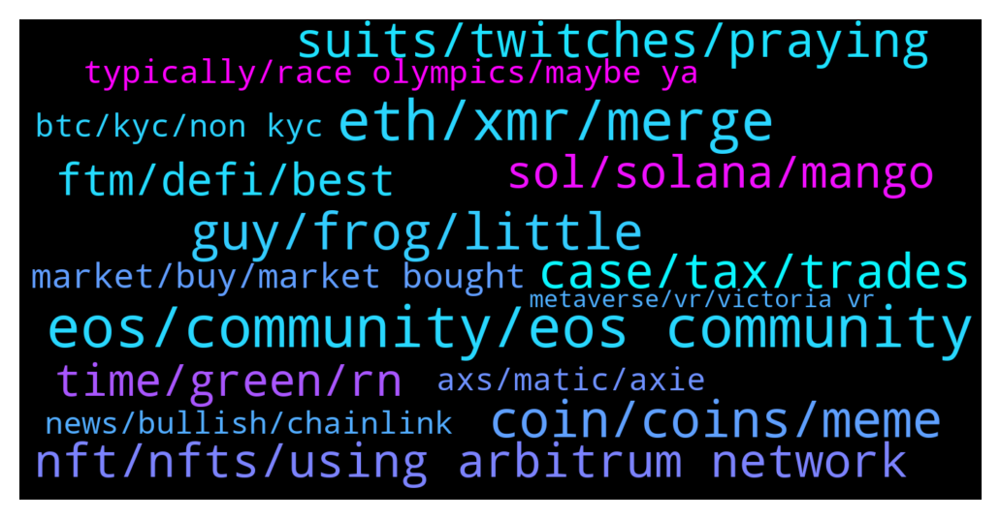

# **@shitpool**
 ## Analysis for **2022-01-09** - **2022-01-16**.

---

## 📊 **Basic Stats**

**n_messages_sent**: 1476

---

---

## 🔝 **Top keywords and related messages**

1. **eos, community, eos community**

    @wojackdegreate --- *Dot and eos battling for the biggest loser claim* **--->** [TG Discussion](https://t.me/shitpool/716158)

    @ddcsov --- *Right so EOS is not a scam, B1 is a scam* **--->** [TG Discussion](https://t.me/shitpool/714275)

    @kekurikekukaka --- *Take care of XRP and EOS, please kind sir.* **--->** [TG Discussion](https://t.me/shitpool/717177)

    @michael_ssss --- *B1 is the entity that collected 4 billion dollars. EOS is the “community” with the scraps* **--->** [TG Discussion](https://t.me/shitpool/714271)

    @Adnanzzz --- *GET is up like x5-6 year to year while EOS is down I guess? 😆* **--->** [TG Discussion](https://t.me/shitpool/716031)

    @rmw_90 --- *ahhh dude, we've had plenty of eos fan bois in here and one by one they got blown out and left* **--->** [TG Discussion](https://t.me/shitpool/714279)

2. **eth, xmr, merge**

    @oneblink --- *What happens to polygon after ETH 2.0?* **--->** [TG Discussion](https://t.me/shitpool/716299)

    @sumtemm --- *That ethbtc daily close was sweet* **--->** [TG Discussion](https://t.me/shitpool/713651)

    @NovapaX --- *Still? I only managed to bridge the one item I actually staked on eth over to arbitrym. The rest is stuck on eth and feels quite useless actually* **--->** [TG Discussion](https://t.me/shitpool/714493)

    @cobaltmdn --- *I'm mining RVN for a long time already. It was way better profit than ETC till a few days ago.* **--->** [TG Discussion](https://t.me/shitpool/716750)

    @da0man --- *What happens to ETC after ETH Merge?* **--->** [TG Discussion](https://t.me/shitpool/716284)

    @da0man --- *So are miners gonna exit pump ETC again this  year for the merge so they can distribute again over 1-2 years?* **--->** [TG Discussion](https://t.me/shitpool/716353)

3. **guy, frog, little**

    @Blazmeen --- *I'm sorry if anyone here likes him but what a load of cringable twaddle.  I seriously doubt that guy could care less about the little man unless they're filling his bags.* **--->** [TG Discussion](https://t.me/shitpool/714323)

    @michael_ssss --- *He’s at the Heart Attack Grill. They make you wear a hospital gown when you eat there. Also anyone that weighs more than 350 lb eats for free* **--->** [TG Discussion](https://t.me/shitpool/715246)

    @Horselorde --- *How do you know if he’s a strange little man? He could weigh 500lbs and be the life of the party* **--->** [TG Discussion](https://t.me/shitpool/715114)

    @rocket_fuel --- *why is he wearing a hospital gown* **--->** [TG Discussion](https://t.me/shitpool/715073)

    @CharliePolite --- *Yup… He is getting mega cringe* **--->** [TG Discussion](https://t.me/shitpool/714324)

    @AsianFever --- *its a pablo escobar robin hood, apparently lol* **--->** [TG Discussion](https://t.me/shitpool/714322)

4. **coin, coins, meme**

    @monkey993 --- *Imagine not buying a coin that expressly tells you in its name that it will be beamed to the moon* **--->** [TG Discussion](https://t.me/shitpool/716745)

    @CharliePolite --- *Man… Everytime you mention a coin I’m impressed. It’s always bottom of the barrel* **--->** [TG Discussion](https://t.me/shitpool/715142)

    @da0man --- *You should be. You should not be holding coins long term end of the cycle* **--->** [TG Discussion](https://t.me/shitpool/715942)

    @AsianFever --- *As richard heart would say: picking pennies on a train track, never know when get slammed* **--->** [TG Discussion](https://t.me/shitpool/714424)

    @AsianFever --- *Is fantom a danny coin now @yesbutalsono ? :)* **--->** [TG Discussion](https://t.me/shitpool/713781)

    @Rjknew --- *Anyone has the Jpowel printer meme?* **--->** [TG Discussion](https://t.me/shitpool/714872)

5. **suits, twitches, praying**

    @OppositeRevolution --- *He doesn't understand traditional finance as much as everyone thinks* **--->** [TG Discussion](https://t.me/shitpool/714851)

    @grammi --- *Every buy he’s made since borrowing money or issuing new shares has been horrid* **--->** [TG Discussion](https://t.me/shitpool/714786)

    @fololomololo --- *I.e he doesnt need to bootstrap them anymore due to demand for price feeds and services* **--->** [TG Discussion](https://t.me/shitpool/713826)

    @grammi --- *But his bonds and share price will suffer* **--->** [TG Discussion](https://t.me/shitpool/715193)

    @da0man --- *from dumping all the shares he could* **--->** [TG Discussion](https://t.me/shitpool/716408)

    @grammi --- *I have no clue why, other than ignorance, the reasoning behind him plowing thru every raise or debt sell immediately after his announcement s* **--->** [TG Discussion](https://t.me/shitpool/714792)

6. **case, tax, trades**

    @da0man --- *one year in crypto is like 10 years on wall st.* **--->** [TG Discussion](https://t.me/shitpool/715177)

    @MoneroPal --- *These uneducated clueless clowns blathering how crypto is some sort of messah that will topple world governments and the financial system just don’t get it...* **--->** [TG Discussion](https://t.me/shitpool/715587)

    @SupreemKai --- *its quite scary what crypto can do to investors reasoning faculties* **--->** [TG Discussion](https://t.me/shitpool/715080)

    @swapman --- *for stonks yes, for crypto no* **--->** [TG Discussion](https://t.me/shitpool/715926)

    @gonubie --- *look at that - the FT has 3 crypto articles.. on the front page!* **--->** [TG Discussion](https://t.me/shitpool/714545)

    @luckycat --- *get daily crypto of the day follow @ RSI_Crypto* **--->** [TG Discussion](https://t.me/shitpool/715076)

7. **nft, nfts, using arbitrum network**

    @Buena_Fiesta --- *who actually makes money with nfts* **--->** [TG Discussion](https://t.me/shitpool/715125)

    @wojackdegreate --- *NFTs are doing quite well right now* **--->** [TG Discussion](https://t.me/shitpool/715200)

    @Buena_Fiesta --- *i feel like 99% is not making money with buying nfts* **--->** [TG Discussion](https://t.me/shitpool/715126)

    @wojackdegreate --- *There was a time when it was almost impossible to lose if you minted the NFTs and sold the next day but that’s over now* **--->** [TG Discussion](https://t.me/shitpool/715201)

    @criptix --- *Samsung announces 3 TVs for 2022 with NFT trading capability — link* **--->** [TG Discussion](https://t.me/shitpool/713672)

    @criptix --- *Volumes on Ethereum-based NFT markets broke a four-month downward trend in December — link* **--->** [TG Discussion](https://t.me/shitpool/713766)

8. **sol, solana, mango**

    @MoneroPal --- *Avalanche is dog shit, nothing there beside Joe and Wonderland. SOL at least has dozens of defi derivatives platforms with real fundamentals.* **--->** [TG Discussion](https://t.me/shitpool/713872)

    @kevvy_wevvy --- *thats like 1 SOl failure a month each of the last 6 months* **--->** [TG Discussion](https://t.me/shitpool/713880)

    @IndianTonic --- *Sol is omega now , oh me gone* **--->** [TG Discussion](https://t.me/shitpool/714811)

    @kevvy_wevvy --- *that said i think the next rotation might be into SOL* **--->** [TG Discussion](https://t.me/shitpool/713892)

    @kevvy_wevvy --- *SOL... has been trash for like half a year. good marketing to be associated i guess* **--->** [TG Discussion](https://t.me/shitpool/713869)

    @Mayvune --- *@swapman is mango the worst thing that exists right now? worse than bitmex at its worst ....* **--->** [TG Discussion](https://t.me/shitpool/714238)

9. **time, green, rn**

    @grammi --- *Life can come at you fast* **--->** [TG Discussion](https://t.me/shitpool/714697)

    @Mayvune --- *sooo many good arb situations 😩* **--->** [TG Discussion](https://t.me/shitpool/714242)

    @kentkadewell --- *TIME still have a skitz apy probably why* **--->** [TG Discussion](https://t.me/shitpool/715819)

    @kuntpuncher --- *Dunno man, you are the one here 24 hrs a day hehehe.* **--->** [TG Discussion](https://t.me/shitpool/716614)

    @Gregoranus --- *When times are hard, reading this helps.  https://t.me/rektplebs* **--->** [TG Discussion](https://t.me/shitpool/716593)

    @da0man --- *know that if you think things are bad, they can always get 10 times worse!* **--->** [TG Discussion](https://t.me/shitpool/716294)

10. **ftm, defi, best**

    @MoneroPal --- *Why is FTM even on the map what is it doing that Avalanche, ETH, SOL, Cardano, Terrra, and others are not?* **--->** [TG Discussion](https://t.me/shitpool/713875)

    @yesbutalsono --- *FTM ecosystem will flourish this week. Harmony too* **--->** [TG Discussion](https://t.me/shitpool/713873)

    @kentkadewell --- *I like FTM ETH HEC KOINOS VRA and my fave EMAX* **--->** [TG Discussion](https://t.me/shitpool/715815)

    @gonubie --- *and will it be distributed to ftm holders.. hence le pump* **--->** [TG Discussion](https://t.me/shitpool/713749)

    @Bigjoeyf --- *Like near ftm is around ath* **--->** [TG Discussion](https://t.me/shitpool/716946)

    @MoneroPal --- *Hope it’s not amm, never considered ftm as the best at anything, but we shall see, I prefer the dexs on ftm like spirit swap over Avax, not a big fan of joe* **--->** [TG Discussion](https://t.me/shitpool/714100)

11. **market, buy, market bought**

    @da0man --- *in general, u are certainly not buying it cheap here* **--->** [TG Discussion](https://t.me/shitpool/716106)

    @R0mster --- *Take profit. Nothing organically 10 xs in a week without some kind of pull back.* **--->** [TG Discussion](https://t.me/shitpool/713810)

    @grammi --- *One thing that always mystified me is why are people only good at “trading” or “investing” if number go up?* **--->** [TG Discussion](https://t.me/shitpool/715184)

    @Breddao --- *Not fun not profitable not productive, great buy* **--->** [TG Discussion](https://t.me/shitpool/715180)

    @brendanplayford --- *when everyone is screaming death I am probably buying lol* **--->** [TG Discussion](https://t.me/shitpool/717104)

    @ddcsov --- *And I hope you all got buys in the $2’s* **--->** [TG Discussion](https://t.me/shitpool/714212)

12. **typically, race olympics, maybe ya**

    @sumtemm --- *@NovapaX you might have one too* **--->** [TG Discussion](https://t.me/shitpool/714507)

    @illuminati --- *well i got wrecked idk about you guys haha* **--->** [TG Discussion](https://t.me/shitpool/716290)

    @SupreemKai --- *I don’t understand why you’re coming for me you strange little man* **--->** [TG Discussion](https://t.me/shitpool/715106)

    @Lingling --- *You mean I am a robot?* **--->** [TG Discussion](https://t.me/shitpool/714131)

    @SupreemKai --- *Irrelevant either way. You’re pugnacious for no reason* **--->** [TG Discussion](https://t.me/shitpool/715113)

    @Horselorde --- *You got in on that huh lol* **--->** [TG Discussion](https://t.me/shitpool/715296)

13. **axs, matic, axie**

    @da0man --- *AXS will sell breakeven it was a FOMO buy* **--->** [TG Discussion](https://t.me/shitpool/714938)

    @da0man --- *Axs is good coin people will regret selling* **--->** [TG Discussion](https://t.me/shitpool/715139)

    @da0man --- *I’m holding my axie. It will go back up. Not listening to FUDer* **--->** [TG Discussion](https://t.me/shitpool/715148)

    @da0man --- *bottom in imo. Only 40% down in AXS. breakeven soon tho* **--->** [TG Discussion](https://t.me/shitpool/715220)

    @da0man --- *Looks like I sold AXS at the bottom.* **--->** [TG Discussion](https://t.me/shitpool/715416)

    @da0man --- *My alt portfolio is 60% AXS and 40% XRD* **--->** [TG Discussion](https://t.me/shitpool/714936)

14. **btc, kyc, non kyc**

    @czglory --- *1bn btc reserve being redacted would be dissapointing since it's been pretty known about for while* **--->** [TG Discussion](https://t.me/shitpool/716274)

    @tooolazzy --- *BTC reserve.   Nothing to do with kash’s startup program* **--->** [TG Discussion](https://t.me/shitpool/716272)

    @da0man --- *Arthur in 2018 said bitcoin go 50k. is this latest 20k call like that or honest?* **--->** [TG Discussion](https://t.me/shitpool/715360)

    @grammi --- *Btc is like 5% of their balance sheet* **--->** [TG Discussion](https://t.me/shitpool/715188)

    @Bigjoeyf --- *It was like 0.04 btc daily non kyc or smth* **--->** [TG Discussion](https://t.me/shitpool/716935)

    @AsianFever --- *For making money and btc for sure, at least to me* **--->** [TG Discussion](https://t.me/shitpool/716151)

15. **news, bullish, chainlink**

    @da0man --- *I trust this man. Stay bullish. Stay strong.* **--->** [TG Discussion](https://t.me/shitpool/715212)

    @BeAMightyKing --- *Here's how I'd play Chainlink today, as I'd found much more consistent levels on the BTC pair back when I'd traded it from its mainnet (April 2019) thru late 2020. It might see trouble around the 0.618 fib retracement from ATH in sats, ~0.0012. That's around $51 - $52 according to BTC's current price, coincidentally at prior USD ATH @brendanplayford   LINK-BTC:  https://www.tradingview.com/x/YQa455vt/* **--->** [TG Discussion](https://t.me/shitpool/715473)

    @luckycat --- *info 1 day before tesla news 👆🚀* **--->** [TG Discussion](https://t.me/shitpool/716969)

    @Antonioalcantara --- *bullish news if this shit is true* **--->** [TG Discussion](https://t.me/shitpool/713816)

    @wanker007 --- *Dump the news in this case was the ultimate "news" hype bs looool* **--->** [TG Discussion](https://t.me/shitpool/715415)

    @Gregoranus --- *I’m in another channel that only posts bullish news, there used to be posts almost every day. Nothing since September the 17th.* **--->** [TG Discussion](https://t.me/shitpool/715348)

