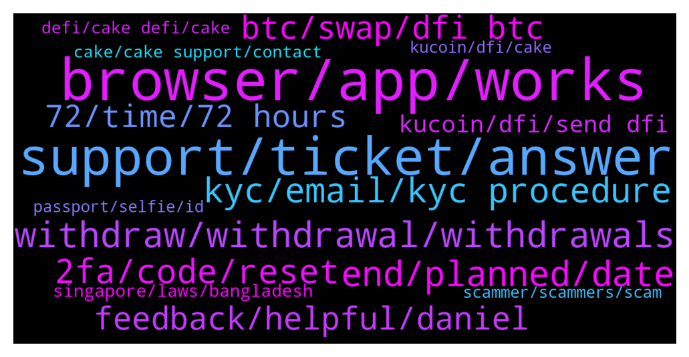

# **@CakeDeFi_EN**
 ## Analysis for **2022-01-16** - **2022-01-23**.

---

## 📊 **Basic Stats**

**n_messages_sent**: 1389

---

---

## 🔝 **Top keywords and related messages**

1. **browser, app, works**

    @DmgBautista --- *Hi! No, everything working fine, just entered to try it. Have you tried other browsers? Try and clear your cache, sometimes it may help. Also, maintenances are announced in our announcement channel. Join it to be up to date with the latest news! 🙂* **--->** [TG Discussion](https://t.me/CakeDeFi_EN/166889)

    @Declan999 --- *Yes, I have tried both Chrome and FireFox and cleared caches in both cases.* **--->** [TG Discussion](https://t.me/CakeDeFi_EN/165128)

    @yeahright22 --- *Im not the only one who has this kind of error, sais completed, but not even exist on chain.Please forward it.Missing 10k$ for 10hours* **--->** [TG Discussion](https://t.me/CakeDeFi_EN/163440)

    @Declan999 --- *Switched phone to 5G, separately cleared caches of both browsers used on desktops.   For now I will leave this overnight and see if the problem still exists on both my phone and desktop.  Thanks for your help 👍* **--->** [TG Discussion](https://t.me/CakeDeFi_EN/165133)

    @DmgBautista --- *Sometimes a different browser its all that it's needed* **--->** [TG Discussion](https://t.me/CakeDeFi_EN/162644)

    @mm_phoenix --- *then pls try another browser :)* **--->** [TG Discussion](https://t.me/CakeDeFi_EN/166426)

2. **support, ticket, answer**

    @fabioandreatta --- *There is no other way than going through support. And i am 100% sure they will attend your issue if you submit your request in a friendly way 😉* **--->** [TG Discussion](https://t.me/CakeDeFi_EN/164011)

    @yeahright22 --- *Ticket 59434, if u could speed up the process, or check whats the status. THANKX.* **--->** [TG Discussion](https://t.me/CakeDeFi_EN/163605)

    @mm_phoenix --- *!Support no the money is not lost. please create a ticket* **--->** [TG Discussion](https://t.me/CakeDeFi_EN/164313)

    @yeahright22 --- *i already did, but no answer for 1 day, that is why i have some fear, can i give u the ticket nr to speed up the process?!* **--->** [TG Discussion](https://t.me/CakeDeFi_EN/163852)

    @fabioandreatta --- *You can just contact our Support and they will fix that for you* **--->** [TG Discussion](https://t.me/CakeDeFi_EN/163849)

    @fabioandreatta --- *Forwarding a request to 2nd level is a proper answer my friend, they are solving your issue as we speak* **--->** [TG Discussion](https://t.me/CakeDeFi_EN/164013)

3. **withdraw, withdrawal, withdrawals**

    @Michael_Schredl --- *90% of the Withdrawals take less than 1 hour* **--->** [TG Discussion](https://t.me/CakeDeFi_EN/163183)

    @fabioandreatta --- *A withdrawal can take up to 72-hours* **--->** [TG Discussion](https://t.me/CakeDeFi_EN/164664)

    @chreeestho --- *I see that withdrawals have been paused but I don’t see how to perform a withdrawal.* **--->** [TG Discussion](https://t.me/CakeDeFi_EN/163690)

    @DmgBautista --- *@yeahright22 hi! Did you had feedback already with regards to your withdrawals? Just checking in 🙂 Best regards!* **--->** [TG Discussion](https://t.me/CakeDeFi_EN/163981)

    @mikelfilko --- *How long do withdrawals usually take?* **--->** [TG Discussion](https://t.me/CakeDeFi_EN/163182)

    @GOS13 --- *Wow if I withdraw my eth now, I get it by Tuesday ?* **--->** [TG Discussion](https://t.me/CakeDeFi_EN/164870)

4. **end, planned, date**

    @fabioandreatta --- *Coming soon, probably in Q1 this year* **--->** [TG Discussion](https://t.me/CakeDeFi_EN/167226)

    @Cryptogems05 --- *I see the $20 was already removed? Will there be a new event/campaign for referring?* **--->** [TG Discussion](https://t.me/CakeDeFi_EN/165299)

    @DmgBautista --- *Hi! Currently, there are no such plans* **--->** [TG Discussion](https://t.me/CakeDeFi_EN/166350)

    @Kassius84 --- *Probably the end of this week* **--->** [TG Discussion](https://t.me/CakeDeFi_EN/163450)

    @fabioandreatta --- *Yes, planned for this year 😉* **--->** [TG Discussion](https://t.me/CakeDeFi_EN/165689)

    @danielklaiber --- *Its planned by end of Jan* **--->** [TG Discussion](https://t.me/CakeDeFi_EN/165339)

5. **kyc, email, kyc procedure**

    @springle0514 --- *Hello I just signed up for cake And I submitted all my documents for KYC and then the next day I got a message saying that I was banned for violating the terms and conditions. Is there an admin here who can help me with this and tell me exactly what I did to violate the terms?  Thanks* **--->** [TG Discussion](https://t.me/CakeDeFi_EN/165777)

    @DmgBautista --- *Hi! Do you still continue facing issues with your KYC procedure? Honestly dont know what you may be facing. If you wish you can DM me with a  printscreen of (only!) the name you submitted in the several support documents as well as the email you received.   Dont know if I will be able to point you in the correct direction but we can try. Best regards!* **--->** [TG Discussion](https://t.me/CakeDeFi_EN/163940)

    @zachgax --- *Did you receive an email from Cake yet? If you have, that email will tell you if your kyc was successful or not. If it’s rejected, it will tell you the reasons so you can try to fix it, and resubmit your kyc.  If you haven’t received any email, then I would say be a little patient. These things can take some time even though they say ‘usually within 24hours’  If you can’t wait any longer, you can contact support through this form https://support.cakedefi.com/hc/en-us/requests/new* **--->** [TG Discussion](https://t.me/CakeDeFi_EN/166628)

    @larry7860 --- *My kyc pending Since 2 days 😑😑  Please do fast kyc system   People can't wait 😠* **--->** [TG Discussion](https://t.me/CakeDeFi_EN/164988)

    @onur_yz --- *I done KYC and earn. I didn't do anything else* **--->** [TG Discussion](https://t.me/CakeDeFi_EN/162710)

    @Axcel22 --- *I applied for KYC at 2 PM UTC yesterday. How long would it take to get approved? 😭* **--->** [TG Discussion](https://t.me/CakeDeFi_EN/164833)

6. **2fa, code, reset**

    @cemal --- *I gave my account's email and password to someone else, I want to recover my account.help me* **--->** [TG Discussion](https://t.me/CakeDeFi_EN/162651)

    @springle0514 --- *This is what it’s giving me when I tired to log in. I never got an email.* **--->** [TG Discussion](https://t.me/CakeDeFi_EN/165783)

    @Neil --- *This is where it gets tricky, I can't log in because it wants an authy code.* **--->** [TG Discussion](https://t.me/CakeDeFi_EN/165887)

    @YyeapY --- *curious question abt 2fa, does anyone stored their key in case the authenticator apps gone?  Or simply just request from support to disable when authenticator missing? (to re-enable back)* **--->** [TG Discussion](https://t.me/CakeDeFi_EN/164566)

    @coronal --- *I lost my 2fa code please help me* **--->** [TG Discussion](https://t.me/CakeDeFi_EN/165546)

    @springle0514 --- *I didn’t get an email. I just tried to log in and it wouldn’t let me log in giving me that message* **--->** [TG Discussion](https://t.me/CakeDeFi_EN/165782)

7. **feedback, helpful, daniel**

    @yeahright22 --- *Anyway, thank you for your help, im a bit in fear, that is why im askin.🙂* **--->** [TG Discussion](https://t.me/CakeDeFi_EN/163611)

    @Roxxiej --- *Oh ok sorry and thank you* **--->** [TG Discussion](https://t.me/CakeDeFi_EN/166140)

    @cemal --- *thank you daniel ,I will share the process with you.* **--->** [TG Discussion](https://t.me/CakeDeFi_EN/162653)

    @yeahright22 --- *I have answer like 10 hours ago* **--->** [TG Discussion](https://t.me/CakeDeFi_EN/163604)

    @DmgBautista --- *No problem! If you are interested however in knowing more, just check the below information! Best regards! 🙂  https://support.cakedefi.com/hc/en-us/articles/900003427506-Cake-Service-simply-explained* **--->** [TG Discussion](https://t.me/CakeDeFi_EN/164903)

    @Cammy2904 --- *Thank you Michael. I was a little bit hasty 😂. I received my Doge. Thank you for the swift reply* **--->** [TG Discussion](https://t.me/CakeDeFi_EN/162919)

8. **btc, swap, dfi btc**

    @Siva --- *I only have DFI at the moment. But it will not allow me to swap my DFI for BTC to enter the pool.* **--->** [TG Discussion](https://t.me/CakeDeFi_EN/164419)

    @syahirmustaffa --- *I dont have any of those. I only have huobi. How bout swapping DFI - BTC and then transfer to other wallet. Would that work?* **--->** [TG Discussion](https://t.me/CakeDeFi_EN/163869)

    @George --- *easiest way to swap DFI back to BTC?* **--->** [TG Discussion](https://t.me/CakeDeFi_EN/166725)

    @Marvin --- *In Germany swapping DFI to BTC still isn‘t working. I deleted the cache in the chrome browser and logged out and in, but it does not work. What do I have to do?* **--->** [TG Discussion](https://t.me/CakeDeFi_EN/164098)

    @Siva --- *So in order to enter the BTC - DFI pool, if I only have DFI right now, I’d have to send my DFI to an exchange and swap for BTC?* **--->** [TG Discussion](https://t.me/CakeDeFi_EN/164407)

    @ObiWayne --- *When can we swap btc to dfi again?* **--->** [TG Discussion](https://t.me/CakeDeFi_EN/163318)

9. **72, time, 72 hours**

    @Michael_Schredl --- *It can take up to 72 hours* **--->** [TG Discussion](https://t.me/CakeDeFi_EN/163185)

    @Pharamond --- *Yes, but It usually never takes so long* **--->** [TG Discussion](https://t.me/CakeDeFi_EN/163187)

    @Josiiiiiiiiiiii --- *do I have to wait 3 working days for it to transact?* **--->** [TG Discussion](https://t.me/CakeDeFi_EN/164630)

    @fadfunky --- *But its should be in 1 hour to wait ya?* **--->** [TG Discussion](https://t.me/CakeDeFi_EN/165364)

    @mm_phoenix --- *it can last up to 72h mostly within 1h* **--->** [TG Discussion](https://t.me/CakeDeFi_EN/164871)

    @fabioandreatta --- *For some users it arrives later* **--->** [TG Discussion](https://t.me/CakeDeFi_EN/163045)

10. **kucoin, dfi, send dfi**

    @YSL --- *Dfi 🚀 on KuCoin.. thought many ll rush to exit but instead all rush to buy* **--->** [TG Discussion](https://t.me/CakeDeFi_EN/163732)

    @Reggie --- *Kucoin Deposits and withdrawals are back online 🔥* **--->** [TG Discussion](https://t.me/CakeDeFi_EN/164099)

    @Brayan Coleman --- *The Kucoin network is under maintainence so u cant send out dfi coins for now I’m sorry* **--->** [TG Discussion](https://t.me/CakeDeFi_EN/162692)

    @Michael_Schredl --- *If the DFI are on the correct address you have to talk to Kucoin* **--->** [TG Discussion](https://t.me/CakeDeFi_EN/163922)

    @mm_phoenix --- *send dfi to kucoin and trade the dfi-btc pair :)* **--->** [TG Discussion](https://t.me/CakeDeFi_EN/166726)

    @Javixo --- *Can we send DFi to Kucoin?* **--->** [TG Discussion](https://t.me/CakeDeFi_EN/165008)

11. **singapore, laws, bangladesh**

    @mm_phoenix --- *Cake Pte Ltd, registered in Singapore 201918368M https://www.cakedefi.com/imprint/* **--->** [TG Discussion](https://t.me/CakeDeFi_EN/167197)

    @gottagrabthere --- *I’m very sure Luno was developed in singapore and thus uses those laws* **--->** [TG Discussion](https://t.me/CakeDeFi_EN/166469)

    @mm_phoenix --- *that we are dealing with the laws in singapore.* **--->** [TG Discussion](https://t.me/CakeDeFi_EN/164357)

    @Michael_Schredl --- *Maybe you can requests a change of your passport, but there is nothing Cake can do about it - they are just following singapore rules 😕* **--->** [TG Discussion](https://t.me/CakeDeFi_EN/166941)

    @mm_phoenix --- *CAKE DeFi – Countries NOT available https://support.cakedefi.com/hc/en-us/articles/360040335072-Which-countries-are-currently-not-able-to-use-the-Cake-Services-* **--->** [TG Discussion](https://t.me/CakeDeFi_EN/164354)

    @kramredaol84 --- *So it's due to Singapore law that you won't accept UK Driving Licence? Shame as every other crypto site will. I'll just have to keep using your competitors then.* **--->** [TG Discussion](https://t.me/CakeDeFi_EN/163414)

12. **cake, cake support, contact**

    @Dionis --- *Я к вам обращаюсь за помощью с верефикацией на cake I am asking you for help with cake verification* **--->** [TG Discussion](https://t.me/CakeDeFi_EN/165400)

    @DmgBautista --- *You can contact support if you wish to speed up the process. By Cake website or if more directly, you can contact the below email  https://cake.zendesk.com/hc/en-us/requests/new* **--->** [TG Discussion](https://t.me/CakeDeFi_EN/163422)

    @DmgBautista --- *That is allowed, under my best knowledge. I guess you will need to contact Cake support and expose your situation, to try and understand what might have happened. You can find the link below  https://cake.zendesk.com/hc/en-us/requests/new* **--->** [TG Discussion](https://t.me/CakeDeFi_EN/165790)

    @enalettin --- *Cake's baking take some time so got some tips to make baking a little faster here it goes  https://www.thekitchn.com/10-tips-to-help-you-cook-faster-tips-from-the-kitchn-219379* **--->** [TG Discussion](https://t.me/CakeDeFi_EN/164879)

    @zcpmv --- *I got a link from a guy who is suppose to be an official support memener of CAKE but he want me to fill the seed* **--->** [TG Discussion](https://t.me/CakeDeFi_EN/162740)

    @Danielmustermn --- *Best way is to ask the cake Support* **--->** [TG Discussion](https://t.me/CakeDeFi_EN/166162)

13. **defi, cake defi, cake**

    @ExPwr --- *Guys, what is currently the cheapest, most recommended route to bring more assets into cake.defi? Would like to stay away from ERC20.* **--->** [TG Discussion](https://t.me/CakeDeFi_EN/166361)

    @Chigo1991 --- *I have not understand dis cake defl en i need explaintion* **--->** [TG Discussion](https://t.me/CakeDeFi_EN/167317)

    @Nazhadi57 --- *Ah okay. What’s the advantage of cake DeFi over using the DeFi chain DEX itself? They offer similar services right* **--->** [TG Discussion](https://t.me/CakeDeFi_EN/165306)

    @Kassius84 --- *Start your DeFi Journey Here: Cake  DeFi Services Simply Explained https://support.cakedefi.com/hc/en-us/articles/900003427506-Cake-Service-simply-explained* **--->** [TG Discussion](https://t.me/CakeDeFi_EN/167319)

    @ExPwr --- *Team, what is the current TVL of cake.defi?* **--->** [TG Discussion](https://t.me/CakeDeFi_EN/167347)

    @Michael_Schredl --- *Start your DeFi Journey Here: Cake  DeFi Services Simply Explained https://support.cakedefi.com/hc/en-us/articles/900003427506-Cake-Service-simply-explained* **--->** [TG Discussion](https://t.me/CakeDeFi_EN/167331)

14. **passport, selfie, id**

    @gottagrabthere --- *From uk how can I use my driving license to do my verification as don’t own a passport.* **--->** [TG Discussion](https://t.me/CakeDeFi_EN/166463)

    @kramredaol84 --- *Hey Admins/Mods, why is it only passport for ID verification?* **--->** [TG Discussion](https://t.me/CakeDeFi_EN/163412)

    @gottagrabthere --- *If there could be a way of making it possible to verify our identity through driving license that would be high un demand for surely ?* **--->** [TG Discussion](https://t.me/CakeDeFi_EN/166465)

    @Rahatox --- *But you have to understand ,Not every people dont stay at their hometown,as i provide my passport and other documents .it should better be verified* **--->** [TG Discussion](https://t.me/CakeDeFi_EN/166937)

    @kisundamotekar --- *I cant verify my identity, cause I only have National Identity Card not Passport* **--->** [TG Discussion](https://t.me/CakeDeFi_EN/165956)

    @random43210 --- *How can I re-verify my residence if I move to another country?* **--->** [TG Discussion](https://t.me/CakeDeFi_EN/167075)

15. **scammer, scammers, scam**

    @Serenity --- *there's a scammer who has joined this channel, beware.* **--->** [TG Discussion](https://t.me/CakeDeFi_EN/166049)

    @Kassius84 --- *Watch out for scammers which sends you a direct message.* **--->** [TG Discussion](https://t.me/CakeDeFi_EN/165152)

    @Javier --- *It is. Thank you. By the way, I was contacted presumably by a scammer because of this issue* **--->** [TG Discussion](https://t.me/CakeDeFi_EN/164237)

    @NuckFut --- *The number of scammer's watching this chat and pouncing on anyone with questions is too damn high* **--->** [TG Discussion](https://t.me/CakeDeFi_EN/164553)

    @BerndMack --- *Watch out for scammers. Do not klick any links or put in your seed or password in any page they send to you!* **--->** [TG Discussion](https://t.me/CakeDeFi_EN/164046)

    @ferhat_lorem_ipsum --- *I did the same and now they are on fire. I usually got 1-2 scammers daily, but today I blocked already almost 20 of them. I might have landed on a scammer list 🤷🏻‍♂️* **--->** [TG Discussion](https://t.me/CakeDeFi_EN/165605)

