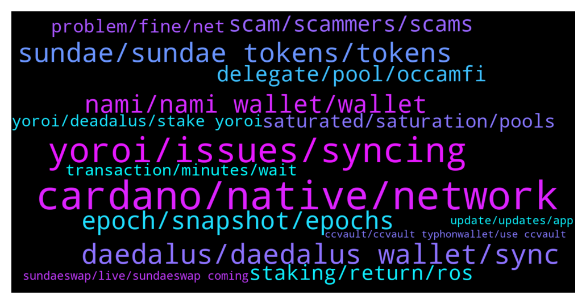

# **@Cardano**
 ## Analysis for **2022-01-16** - **2022-01-23**.

---

## 📊 **Basic Stats**

**n_messages_sent**: 1510

---

---

## 🔝 **Top keywords and related messages**

1. **cardano, native, network**

    @missmaster81 --- *Hi everyone! Noob here to staking cardano.  Can someone help me understand the shelly era wallet?   I was given some instructions to join a staking pool that indicated creating one.  However, I had already created a new wallet and transferred my ada in.  not sure if i need to transfer from my wallet to this shelly era wallet before delegating??? hope this doesn't sound like a stupid question.* **--->** [TG Discussion](https://t.me/Cardano/772890)

    @GioLoop --- *Cardano is increasingly green and ready for recovery https://en.cryptonomist.ch/2022/01/12/cardano-green-ready-to-restart/?utm_source=CryptoMarketCap&utm_medium=app* **--->** [TG Discussion](https://t.me/Cardano/768381)

    @invivekworld --- *Thanks, can we stake cardano or its better to stake at binance?* **--->** [TG Discussion](https://t.me/Cardano/767946)

    @MrBrinker --- *Bep20 is not ADA the native currency of Cardano blockchain, it is a token o  Binance Chain. If you want to stake or use any other native Cardano Dapp you need to have native ADA* **--->** [TG Discussion](https://t.me/Cardano/770262)

    @matt_artano --- *I would argue it's pretty relevant if we're talking about permissionless and decentralization. We have a branch of Cardano essentially curating reddit in the direction they like, whether it's stiftung, emurgo or whoever, they're still tied to Cardano.* **--->** [TG Discussion](https://t.me/Cardano/767340)

    @apex_pool_spo --- *I hope they will have a good launch, it will be good for Cardano.* **--->** [TG Discussion](https://t.me/Cardano/772102)

2. **yoroi, issues, syncing**

    @Heather --- *Thank you so much for that confirmation. I think yproi has had an upgrade so, just soring tbis now..* **--->** [TG Discussion](https://t.me/Cardano/770488)

    @lassikem --- *lol all of my Yoroi wallets have become basically unusable in the past few days.* **--->** [TG Discussion](https://t.me/Cardano/770556)

    @awilliams_8 --- *Yeah, I just get an error message saying "Error received from server".. I have contacted Yoroi support and waiting for a reply* **--->** [TG Discussion](https://t.me/Cardano/769961)

    @gauthamnag --- *Any issue Yorio web wallet not syncing at all , trying since 3 hours it keeps rotating simply* **--->** [TG Discussion](https://t.me/Cardano/769675)

    @mostudio --- *I personally use Yoroi with no problems, but i tend to be more mobile user.* **--->** [TG Discussion](https://t.me/Cardano/771332)

    @glitch04 --- *Yoroi is having syncing issues with their backend servers so it would be an extended wait* **--->** [TG Discussion](https://t.me/Cardano/771135)

3. **daedalus, daedalus wallet, sync**

    @ExInfernis --- *I am using daedalus from 2 years without any problems. Maybe it is too heavy for your system* **--->** [TG Discussion](https://t.me/Cardano/772418)

    @The Watcher --- *Will daedalus Support other coins in the future (Cardano Blockchain based coins, erg, coti...)?* **--->** [TG Discussion](https://t.me/Cardano/771792)

    @yefrou73 --- *I want that, but first I have to getinto my daedalus wallet🙃* **--->** [TG Discussion](https://t.me/Cardano/771738)

    @Angeri8 --- *Question on wallet: I tried to install Daedalus but by pc has some restrictions so I cannot do it.   I've read about Yoroi on Cardano page and It seems they say "you better don't".. so I'm a bit scared* **--->** [TG Discussion](https://t.me/Cardano/770756)

    @The Watcher --- *Hello everybody, can i hodl Coti on Daedalus?* **--->** [TG Discussion](https://t.me/Cardano/771781)

    @The Watcher --- *So i can send Ergo and Coti to a Daedalus Adress???* **--->** [TG Discussion](https://t.me/Cardano/771798)

4. **sundae, sundae tokens, tokens**

    @Agilmore77 --- *Can we still earn the sundaeswap rewards for staking to their iso scoopers?* **--->** [TG Discussion](https://t.me/Cardano/773414)

    @Sailesh --- *hi is it too late to changes taking  pools to get Sundae tokens?* **--->** [TG Discussion](https://t.me/Cardano/771806)

    @TheC --- *To acquire Sundae through ISO participation, can we delegate ADA on Daedalus?* **--->** [TG Discussion](https://t.me/Cardano/769846)

    @mostudio --- *If you stake using one of the Ada wallets mentioned and add your ada to an official sundaeswap scooper pool, you will also receive sundae tokens.* **--->** [TG Discussion](https://t.me/Cardano/767986)

    @KurdCobain --- *Hey guys new here, new to staking ADA… getting ready for tomorrow (Sundae) anyone have a good youtube tutorial/article/walkthrough I can start with? Thanks in advance guys ✌🏼* **--->** [TG Discussion](https://t.me/Cardano/772223)

    @HenryFarq --- *With this sundaeswap iso, there is no allocation published showing how much you would get if you delegated your Ada to the scoopers. You might get a lot or little.* **--->** [TG Discussion](https://t.me/Cardano/770184)

5. **nami, nami wallet, wallet**

    @Agarta --- *DO NOT USE NAMI WALLET!! It’s not allowing people to withdraw their ADA. The wallet might be stealing your ADA!!   Share so we can stop them. And try your self so you know that am not lying. Ur Ada is really stuck!!* **--->** [TG Discussion](https://t.me/Cardano/773536)

    @apex_pool_spo --- *you still have time until 25th of January to delegate.  and you did not have to move your funds. you can delegate from Yoroi and you can restore the same wallet in Nami (or better in ccvault) to interact with the DApp.* **--->** [TG Discussion](https://t.me/Cardano/772410)

    @Niro01 --- *Hello, I have sent some ADA from nami wallet to another account within the same wallet. I got the green banner sayng transaction submitted but it does not show up on cardano scan.It has been more than 15 hours. Will it go through eventually? Or I need to send my ADA again?* **--->** [TG Discussion](https://t.me/Cardano/773817)

    @mihhai0 --- *but it's sad that nami wallet doesn't have a support part, and i have tried severl times to send my money into another wallet but did not succed and they succeded so easely* **--->** [TG Discussion](https://t.me/Cardano/773779)

    @apex_pool_spo --- *you did not need to move funds. you can use multiple "Wallets" like Yoroi, Daedalus, Nami, ccvault, typhoon, Flint, Gerowallet in the same to access your wallet, just like you access a website with multiple browsers.* **--->** [TG Discussion](https://t.me/Cardano/772424)

    @ExInfernis --- *In nami wallet is stated that it is prefered to create new wallet and transfer to it* **--->** [TG Discussion](https://t.me/Cardano/773121)

6. **epoch, snapshot, epochs**

    @apex_pool_spo --- *when you delegate to another stake pool, the current epoch and the next epoch you still delegate to the old stake pool, the epoch after that you delegate to the new stake pool.* **--->** [TG Discussion](https://t.me/Cardano/771554)

    @glitch04 --- *you have until the 25th so no if you move before the epoch, any further help you will need to ask in their support channel* **--->** [TG Discussion](https://t.me/Cardano/771809)

    @frenske1 --- *Not just talking about the epoch Transition time tho, unfortunately.* **--->** [TG Discussion](https://t.me/Cardano/769452)

    @Michael --- *If your wallet is already staked and earning rewards, then yes, the next epoch* **--->** [TG Discussion](https://t.me/Cardano/773975)

    @glitch04 --- *You just have to have the funds staked before the snapshot window each epoch* **--->** [TG Discussion](https://t.me/Cardano/773430)

    @apex_pool_spo --- *you won't need, nothing will happen in 5 epochs (25 days).* **--->** [TG Discussion](https://t.me/Cardano/771766)

7. **scam, scammers, scams**

    @yogidan --- *me too. this is scam right? https://sundaeswap.finance/posts/wen-sundae* **--->** [TG Discussion](https://t.me/Cardano/772189)

    @apex_pool_spo --- *no, verify at least before saying it's a scam, or don't say anything.* **--->** [TG Discussion](https://t.me/Cardano/767335)

    @avishai4791 --- *Some stupid guy with your name Fabian called me  Stipid scam* **--->** [TG Discussion](https://t.me/Cardano/771685)

    @apex_pool_spo --- *it is not, and you should not say about everything that it is a scam if you don't know what you are talking about.* **--->** [TG Discussion](https://t.me/Cardano/767332)

    @Freddie --- *Omfg... There's an live scam as we speak on youtube* **--->** [TG Discussion](https://t.me/Cardano/769196)

    @yosweetmama --- *Honestly i didnt even check the link, but links are mostly scam so i said this, sorry if its not a scam😂* **--->** [TG Discussion](https://t.me/Cardano/767327)

8. **delegate, pool, occamfi**

    @peeved82 --- *How do I know it is changed, nothing on my Yoroi wallet shows the new Delegated Pool, no new transactions.* **--->** [TG Discussion](https://t.me/Cardano/771918)

    @missmaster81 --- *Thanks for being responsive!  Got it.  when i noticed the claim/transfer tab had the whole shelly/byron thing, i became confused.  OK!  Great. Going to delegate.* **--->** [TG Discussion](https://t.me/Cardano/772904)

    @peeved82 --- *There is no acknowledgement of switching Delegators, and no error message.  Just me pushing the Delegate button and getting no response .* **--->** [TG Discussion](https://t.me/Cardano/772301)

    @peeved82 --- *Still not able to delegate to another stake pool than OccamFi . I go through the process of delegating to another stake pool but I cannot seem to leave OccamFi.  Is the Occamfi pool special and has additional process’s to follow? When I check Cardanoscan I am still Delegated to Occamfi pool.* **--->** [TG Discussion](https://t.me/Cardano/771553)

    @peeved82 --- *The only Delegation History is from 3 months ago where I staked to Occamfi.* **--->** [TG Discussion](https://t.me/Cardano/771930)

    @peeved82 --- *Resyncd the wallet, I still cannot change my delegation pool.* **--->** [TG Discussion](https://t.me/Cardano/771953)

9. **staking, return, ros**

    @jaymeyer --- *Hi I need help for staking* **--->** [TG Discussion](https://t.me/Cardano/768584)

    @glitch04 --- *No trust required for staking as your funds remain in your control, you are just delegating the "balance" total for use in the network security of block creation* **--->** [TG Discussion](https://t.me/Cardano/771967)

    @Bernard --- *I just want to make sure I can get in by staking instead of just sitting there doing nothing.* **--->** [TG Discussion](https://t.me/Cardano/771948)

    @Angeri8 --- *Wow! to get access to this chat has been harder than staking on polkadot* **--->** [TG Discussion](https://t.me/Cardano/770755)

    @frankclientele --- *Anyone have a recommendation for safest and highest yield for staking ADA ?* **--->** [TG Discussion](https://t.me/Cardano/770105)

    @Trey --- *And what's a good percent for staking?* **--->** [TG Discussion](https://t.me/Cardano/772910)

10. **saturated, saturation, pools**

    @Tustyrusty --- *I've gone through the 30 participating pools ALL (bar1) are OVER 100% saturation. No-one seems to be concerned/ bothered.* **--->** [TG Discussion](https://t.me/Cardano/774343)

    @LionelG1995 --- *Awesome cheers, and are there disadvantages for a lower pool saturation %* **--->** [TG Discussion](https://t.me/Cardano/771877)

    @DrNo8910 --- *Lower pool sat % pools has a less likely chance to get a block. But this is a simple explanation of it. It gets complicated.* **--->** [TG Discussion](https://t.me/Cardano/771878)

    @LionelG1995 --- *What are the disadvantages of pool saturation?* **--->** [TG Discussion](https://t.me/Cardano/771875)

    @glitch04 --- *It decreases by how much the pool goes over the saturation level* **--->** [TG Discussion](https://t.me/Cardano/772581)

    @CrypticPisang --- *what's the current stakepool saturation limit now?  If I stake in a pool BEFORE it gets saturated, will I still get rewards when it DOES get saturated?* **--->** [TG Discussion](https://t.me/Cardano/772569)

11. **problem, fine, net**

    @Gr33nSun --- *Not working for me , Any suggestions?* **--->** [TG Discussion](https://t.me/Cardano/773079)

    @Sexy_Stacie --- *I have done the same.  I just wasn't sure if it was my system or not.* **--->** [TG Discussion](https://t.me/Cardano/769967)

    @glitch04 --- *Did you check the error ?* **--->** [TG Discussion](https://t.me/Cardano/768319)

    @RobertKi --- *Thanks for helping. I solved the problem. I found out that it was the Browser on my Mac that caused the problem. Safari doesn't do the trick, but Chrome worked!* **--->** [TG Discussion](https://t.me/Cardano/773519)

    @awilliams_8 --- *Same here, I thought it might have been my systems, but if your having issues as well hen maybe it's a bigger problem* **--->** [TG Discussion](https://t.me/Cardano/769969)

    @FlamingElim --- *Can you pls help what is happening ?* **--->** [TG Discussion](https://t.me/Cardano/773469)

12. **yoroi, deadalus, stake yoroi**

    @cryptoshaun --- *Hello I’m in a pool for sundeaswap tokens but I use yoroi wallet does that mean I won’t get them* **--->** [TG Discussion](https://t.me/Cardano/771373)

    @Joshua --- *I dont mind holding sundade until yoroi web app is compatible with sundadeswap* **--->** [TG Discussion](https://t.me/Cardano/774061)

    @Agilmore77 --- *Does sundaeswap not support the yoroi wallet?* **--->** [TG Discussion](https://t.me/Cardano/773408)

    @AyodeleFaiyetole --- *Yes, you can't. But you can't yet interact Yoroi with SundaeSwap* **--->** [TG Discussion](https://t.me/Cardano/772977)

    @Agarta --- *The one wallet we use to login on sundaswap* **--->** [TG Discussion](https://t.me/Cardano/773304)

    @ExInfernis --- *I have seen it as test wallet before several days on sundae swap so maybe it already has it 😉. Or it is in final testing* **--->** [TG Discussion](https://t.me/Cardano/773139)

13. **transaction, minutes, wait**

    @brzi987 --- *also ... waited few minutes and failed* **--->** [TG Discussion](https://t.me/Cardano/773169)

    @JacobSmile --- *Thx, but no time is given* **--->** [TG Discussion](https://t.me/Cardano/772293)

    @TJSP2024 --- *How long does it take during an extended wait? Its been days. I could've just loaded up daedalus it takes days also 😔* **--->** [TG Discussion](https://t.me/Cardano/771901)

    @yosweetmama --- *It's ridiculous that you're still continuing this discussion. I said something and I apologized for it, if you have a talent for turning back time, tell me your secret, maybe I'll make it up* **--->** [TG Discussion](https://t.me/Cardano/767337)

    @glitch04 --- *if it completed you just wait for the backlog to clear and the tx to complete, that is not something we control* **--->** [TG Discussion](https://t.me/Cardano/773473)

    @glitch04 --- *You can close it however the longer left closed the longer it will take to resync later when you reopen it* **--->** [TG Discussion](https://t.me/Cardano/768898)

14. **sundaeswap, live, sundaeswap coming**

    @UleC0 --- *SUNDAESWAP is coming 20th, on this month!* **--->** [TG Discussion](https://t.me/Cardano/769896)

    @atc1235 --- *Guys are you worried about sundaeswap's launch?  I'm a bit worried because they said some hogging is expected, but the vast majority of the people isn't aware of that, and i think this will cause a lot of FUD. Thoughts?* **--->** [TG Discussion](https://t.me/Cardano/772258)

    @David --- *Can anyone explain what SundaeSwap is?* **--->** [TG Discussion](https://t.me/Cardano/772225)

    @Dandimatt --- *Hello is this the right place for a question about sundaswap?* **--->** [TG Discussion](https://t.me/Cardano/770037)

    @Sasamihajlov --- *So,i can,wright? Where will i get sundae then?* **--->** [TG Discussion](https://t.me/Cardano/772979)

    @tim_207 --- *When its posible tu buy sundaeswap?* **--->** [TG Discussion](https://t.me/Cardano/772704)

15. **update, updates, app**

    @glitch04 --- *Have not seen any estimate other than they are working to resolve connectivity issues.* **--->** [TG Discussion](https://t.me/Cardano/771907)

    @lassikem --- *I hope they fix this issue as soon as possible.* **--->** [TG Discussion](https://t.me/Cardano/770561)

    @RobertKi --- *Ledger Live is fully updated, how can I tell if the device is?* **--->** [TG Discussion](https://t.me/Cardano/773499)

    @cryptoustt --- *They should cancel the launch. It would totally block the whole chain.* **--->** [TG Discussion](https://t.me/Cardano/770018)

    @glitch04 --- *Several have reported issues they have issued multiple fixes to address the issue but some are still reporting localized outages* **--->** [TG Discussion](https://t.me/Cardano/771903)

    @JonSmith007 --- *I expect a better business decision. If this was a known result then the owner of the project is a clown. Why not launch in 6-8 months rather than create a load of FUD on your project* **--->** [TG Discussion](https://t.me/Cardano/773860)

