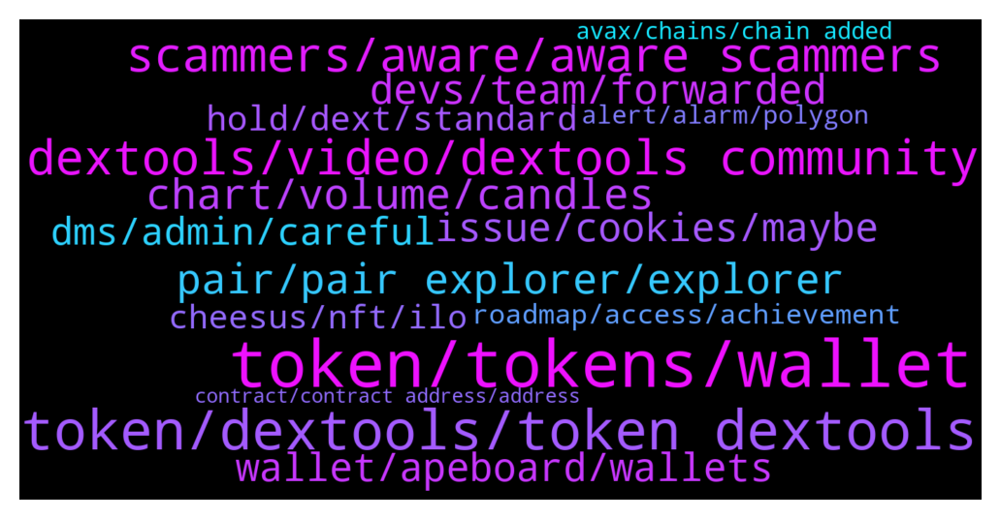

# **@DEXToolsCommunity**
 ## Analysis for **2022-01-16** - **2022-01-23**.

---

## 📊 **Basic Stats**

**n_messages_sent**: 1034

---

---

## 🔝 **Top keywords and related messages**

1. **token, tokens, wallet**

    @stanes --- *The first 31pt is the socials.  About social Information for your token, please update etherscan.io or bscscan.com or coingecko.com  We pull info from there.* **--->** [TG Discussion](https://t.me/DEXToolsCommunity/323447)

    @jellyfinf --- *Admin please I want to to trend my token on your website* **--->** [TG Discussion](https://t.me/DEXToolsCommunity/325066)

    @Cathy7717 --- *Hello, I would like to ask how to apply for the token's social networking software.* **--->** [TG Discussion](https://t.me/DEXToolsCommunity/327414)

    @KP --- *How can I check if smart contract is such it send token else where not to my wallet. But still shows a qty in my wallet ? Please. Dont we all want to out smart the scammers.* **--->** [TG Discussion](https://t.me/DEXToolsCommunity/325425)

    @bastardganpunk --- *About social Information for your token, please update etherscan.io, bscscan.com or the blockchain explorer from the chain your coin is built on or coingecko.com/ coinmarketcap We pull info from there.* **--->** [TG Discussion](https://t.me/DEXToolsCommunity/327333)

    @grathius --- *Guys, do you know any sites/platforms/applications/scripts/bots/portfolio trackers, etc., where you can watch tokens in this format? if there are resources with changes over the last 2, 3, 4, 5 hours, then it’s generally ideal* **--->** [TG Discussion](https://t.me/DEXToolsCommunity/325346)

2. **token, dextools, token dextools**

    @DEXTOOLS34 --- *I want to trend my token on dextools who can I pm* **--->** [TG Discussion](https://t.me/DEXToolsCommunity/324559)

    @Yokamox --- *How to submit request for update regarding my token ( Jacy ) in dextools?* **--->** [TG Discussion](https://t.me/DEXToolsCommunity/324451)

    @vucky084 --- *Thanks. How I can find our token on dextool as there are lot of fake tokens there* **--->** [TG Discussion](https://t.me/DEXToolsCommunity/323958)

    @MoonstellarMoe --- *I mean how can I get to have folks go on the dextools. io and view my token on there sir?* **--->** [TG Discussion](https://t.me/DEXToolsCommunity/327795)

    @tehkosongpeng --- *hi, can i check whats the process for getting a token listed on dextools?* **--->** [TG Discussion](https://t.me/DEXToolsCommunity/327087)

    @Ri_maxy --- *Hello. I need assistance with retrieving dext token into my wallet* **--->** [TG Discussion](https://t.me/DEXToolsCommunity/325869)

3. **dextools, video, dextools community**

    @bastardganpunk --- *Thank you! If you want to learn more about how to use it, feel free to watch the video which explains the dextools app https://www.youtube.com/watch?v=WFQRJUnPwH8* **--->** [TG Discussion](https://t.me/DEXToolsCommunity/324088)

    @stanes --- *You are probably thinking about what was called Dextshare. But this program ended months ago: https://dextools.medium.com/dextshare-update-6c2a2b87c73b* **--->** [TG Discussion](https://t.me/DEXToolsCommunity/327695)

    @bastardganpunk --- *this video shows, how to use dextools. i recommend you watching it https://youtu.be/WFQRJUnPwH8* **--->** [TG Discussion](https://t.me/DEXToolsCommunity/324831)

    @bastardganpunk --- *For more info about the dextools functionality you can watch the video https://www.youtube.com/watch?v=WFQRJUnPwH8* **--->** [TG Discussion](https://t.me/DEXToolsCommunity/323788)

    @gumbercules --- *Can you explain please? What DEXTv2?* **--->** [TG Discussion](https://t.me/DEXToolsCommunity/327346)

    @bastardganpunk --- *Check the video for learning how to use dextools 🙂 https://www.youtube.com/watch?v=WFQRJUnPwH8* **--->** [TG Discussion](https://t.me/DEXToolsCommunity/323497)

4. **scammers, aware, aware scammers**

    @MoonstellarMoe --- *Also I have been scammed a lot by people claiming to be your workers really so I decided to come here and DYOR 😔* **--->** [TG Discussion](https://t.me/DEXToolsCommunity/327798)

    @stanes --- *I don't have any message from you. Be aware of scammers.* **--->** [TG Discussion](https://t.me/DEXToolsCommunity/327696)

    @creatstep --- *Guys, there are so much scammers out there who trying to pretend you . My gosh 🤦‍♂️* **--->** [TG Discussion](https://t.me/DEXToolsCommunity/323599)

    @resn0ta --- *I already sent one scam guy dirty picture for asking me about promo...* **--->** [TG Discussion](https://t.me/DEXToolsCommunity/326906)

    @stanes --- *Please DM @guillermorodriguez78 he is the person-in-charge.  Be aware of scammers, HE WILL NEVER DM YOU FIRST.* **--->** [TG Discussion](https://t.me/DEXToolsCommunity/325532)

    @stanes --- *Please be aware we can't avoid scams being created. We also can't stop smartcontracts doing what they are programmed to do.  We have some ways to alert people of a scam like the "contract details" and the community votes. Can we do more? Yes, we are working on adding more tools to reduce the risk for our users to fall into scams. But be sure there is no way to be secure if you don't DYOR.* **--->** [TG Discussion](https://t.me/DEXToolsCommunity/325424)

5. **chart, volume, candles**

    @nate102 --- *Normally it’s okay but at times like that it makes it look like chart is at all time high when it’s not even close* **--->** [TG Discussion](https://t.me/DEXToolsCommunity/327403)

    @nate102 --- *this is the dextools verison, you can see theres candles where it stays flat, and the prices are completely off (although current price is now current), you can also see the green line above the chart making it look like its currently above all the time high when its not even half of it* **--->** [TG Discussion](https://t.me/DEXToolsCommunity/327366)

    @TBGOATOFFICIAL --- *Whenever you try go on the chart* **--->** [TG Discussion](https://t.me/DEXToolsCommunity/327497)

    @nate102 --- *https://www.dextools.io/app/ether/pair-explorer/0x98858a67b3975903b0e77ced4831105262aa7aa0 same story with this one also, however only third and fourth 1 minute candles. (About 200k volume in those 2 candles total and chart makes it appear like theres been 0 volume haha)* **--->** [TG Discussion](https://t.me/DEXToolsCommunity/324627)

    @Undine1 --- *Hi, is there any way to use the 12 hours chart instead? on the price bot* **--->** [TG Discussion](https://t.me/DEXToolsCommunity/324573)

    @Undine1 --- *The chart the bot is displaying for my token pair looks ugly. The 12 hour chart would look better* **--->** [TG Discussion](https://t.me/DEXToolsCommunity/324576)

6. **pair, pair explorer, explorer**

    @AbdoMelody --- *This pair is down can you chec plz https://www.dextools.io/app/bsc/pair-explorer/0xcdf0ae9dcdcadb4949338feb7ea7684ddc47c130* **--->** [TG Discussion](https://t.me/DEXToolsCommunity/327753)

    @bastardganpunk --- *this pair has just not been traded* **--->** [TG Discussion](https://t.me/DEXToolsCommunity/324631)

    @ConsiderChaos --- *Are you having issues? At least on of your pairs is about 3 hours behind right now (0xb2ba36ee6ba6113a914f3e8812a0df094dec5994)* **--->** [TG Discussion](https://t.me/DEXToolsCommunity/324546)

    @stanes --- *Can you give me the pair address having this issue please?* **--->** [TG Discussion](https://t.me/DEXToolsCommunity/323672)

    @stanes --- *Ok, thanks, any specific pair? I don't see any pb with some random ones.* **--->** [TG Discussion](https://t.me/DEXToolsCommunity/324803)

    @rpoole69 --- *Last time @napascual said they had to restart a backend server and it was updating, bsc/pair-explorer/0x88c9bf5e334e2591c6a866d5e20683e31226be3d and https://www.dextools.io/app/bsc/pair-explorer/0x1c183b23e8d7a8d287606364f741ddbdafec28de were the 2 I was monitoring* **--->** [TG Discussion](https://t.me/DEXToolsCommunity/324808)

7. **devs, team, forwarded**

    @bastardganpunk --- *devs are checking… something is not correct here 😄* **--->** [TG Discussion](https://t.me/DEXToolsCommunity/324612)

    @bastardganpunk --- *thank you, the devs are on it 🙂* **--->** [TG Discussion](https://t.me/DEXToolsCommunity/324634)

    @cactusjimm --- *Hi, did the dev's come back on this one?* **--->** [TG Discussion](https://t.me/DEXToolsCommunity/323774)

    @FredericDEXT --- *We will check, but it should be the same* **--->** [TG Discussion](https://t.me/DEXToolsCommunity/326560)

    @FredericDEXT --- *Ok, thanks for confirming ,it's already reported to the devs* **--->** [TG Discussion](https://t.me/DEXToolsCommunity/326562)

    @bastardganpunk --- *yes, any bugs are great if you report them, that the devs can fix them* **--->** [TG Discussion](https://t.me/DEXToolsCommunity/324624)

8. **issue, cookies, maybe**

    @wo62gg --- *it said No data to display* **--->** [TG Discussion](https://t.me/DEXToolsCommunity/325128)

    @bastardganpunk --- *there have been server problems, but it’s being fixed atm 🙂* **--->** [TG Discussion](https://t.me/DEXToolsCommunity/324551)

    @hmk18990 --- *nope, you should check your browser settings (may be browser cleaning up cookies on exit) or you should check your antivirus (some antiviruses have settings to cleanup cookies) or you should cleanup cookies manually and try again* **--->** [TG Discussion](https://t.me/DEXToolsCommunity/324988)

    @Monolithof --- *Ok the issue has been solved. Im back to standard account again* **--->** [TG Discussion](https://t.me/DEXToolsCommunity/325826)

    @rpoole69 --- *It got me again this morning, then I remembered the issue and just wanted to remind you all* **--->** [TG Discussion](https://t.me/DEXToolsCommunity/324227)

    @KP --- *Please call again. I pressed wrong button. Thank you* **--->** [TG Discussion](https://t.me/DEXToolsCommunity/325438)

9. **wallet, apeboard, wallets**

    @stanes --- *Did you connect your wallet? https://www.dextools.io/app/user/account* **--->** [TG Discussion](https://t.me/DEXToolsCommunity/323454)

    @chavitochicho --- *I cant connect my wallet, is there any maintenance ongoing or something?* **--->** [TG Discussion](https://t.me/DEXToolsCommunity/323507)

    @bastardganpunk --- *you got the new coin airdropped into your wallet. you just need to add the contract address and you'll be able to see it 🙂* **--->** [TG Discussion](https://t.me/DEXToolsCommunity/325044)

    @bastardganpunk --- *you need to connect then with the new wallet and your favourites etc get lost* **--->** [TG Discussion](https://t.me/DEXToolsCommunity/327895)

    @bastardganpunk --- *correct, then you will be able to get the standard version just connecting your wallet* **--->** [TG Discussion](https://t.me/DEXToolsCommunity/327891)

    @Olliver --- *Thank you for anwsering, dont know what roc is so i have not haha, is it another wallet or whats rpc?* **--->** [TG Discussion](https://t.me/DEXToolsCommunity/325641)

10. **dms, admin, careful**

    @DiamondHandDaniel --- *You have read my DMs @pablojan but have given me no response  It's been weeks, please be professional and help us get this done* **--->** [TG Discussion](https://t.me/DEXToolsCommunity/325903)

    @creatstep --- *Could you check DM? I hope its not too late :)* **--->** [TG Discussion](https://t.me/DEXToolsCommunity/323593)

    @CryptoCrumbs --- *Got a few dms now from a couple people.* **--->** [TG Discussion](https://t.me/DEXToolsCommunity/323757)

    @Ford_Probe1 --- *Hi can i dm you regarding a question?* **--->** [TG Discussion](https://t.me/DEXToolsCommunity/326410)

    @JoanJunior --- *Hi, can i send you a DM* **--->** [TG Discussion](https://t.me/DEXToolsCommunity/327665)

    @bastardganpunk --- *please dm @FredericDEXT in this case 🙂* **--->** [TG Discussion](https://t.me/DEXToolsCommunity/324036)

11. **hold, dext, standard**

    @stanes --- *You can hold 1k DEXT or pay the monthly membership. For that, connect your wallet to the app and follow instructions: https://www.dextools.io/app/user/account* **--->** [TG Discussion](https://t.me/DEXToolsCommunity/325005)

    @zhengshui1977 --- *OK, thanks. This tool is pretty easy to use. If I only need to hold 1000, I am willing to buy it. I probably wouldn't consider it if it had to be paid monthly, thanks for the help* **--->** [TG Discussion](https://t.me/DEXToolsCommunity/323441)

    @zhengshui1977 --- *I already hold 1010 DEXT but I'm still on the free plan, what else do I need to do?* **--->** [TG Discussion](https://t.me/DEXToolsCommunity/323452)

    @Asaprox --- *Guys, to become "standard" do I have to send 1000 DEX to the indicated wallet? real?* **--->** [TG Discussion](https://t.me/DEXToolsCommunity/328036)

    @stanes --- *No. You just need to hold them. Or send the monthly subscription which is 100$/month paid in DEXT.* **--->** [TG Discussion](https://t.me/DEXToolsCommunity/328038)

    @zhengshui1977 --- *I don't have to pay a monthly fee for holding 1000 dexts, does that mean? thanks* **--->** [TG Discussion](https://t.me/DEXToolsCommunity/323438)

12. **cheesus, nft, ilo**

    @xbtwael --- *I saw Cheesus launched  https://cheesus.ai/en/main can you share what that is?* **--->** [TG Discussion](https://t.me/DEXToolsCommunity/326058)

    @Natalia_Ave --- *Cheesus provides pure data and objective metrics to give you onchain truth, but we don't give you any financial advices or fully ensure security of any project  So metrics for every project includes: - project profit and loss  - different types of holders e.g. traders, who bring life by selling and buying tokens, holders, who just hold tokens, do nothing with them, freeloaders who receive tokens by airdrop or any free distribution. Moreover we can track bots and fake wallets who pump prices and increase trading volume.  These data show how active the project are and you can conclude whether the project is worth investing in.  done* **--->** [TG Discussion](https://t.me/DEXToolsCommunity/326087)

    @xbtwael --- *After the succesful fundraise, a common challenge for DeFi protocols seem to be adoption. What are some of the plans to stimulate adoption and build out the ecosystem around Cheesus?* **--->** [TG Discussion](https://t.me/DEXToolsCommunity/326098)

    @xbtwael --- *The Cheesus token is launching soon! Very exciting stuff, what kind of utility does it offer?* **--->** [TG Discussion](https://t.me/DEXToolsCommunity/326062)

    @Natalia_Ave --- *Cheesus is a multi-chain DeFi analyzer that helps users find real gems without getting caught in any mouse traps focused on NFT Metaverses.   We scan blockchains like google scan the internet, where you can find anything and besides open, easy to find and easy to use info we give inside information like real movements of token, amount of bots, fake and insiders wallets. After all this data helps you to decide whether the project is worth investing in or not.  Our main goal is to give onchain truth to users including all DeFi segments like NFT Metaverses, Trading, token movements, insiders info about token holders, flippers & diamond hands. done* **--->** [TG Discussion](https://t.me/DEXToolsCommunity/326056)

    @xbtwael --- *Can you explain what Cheesus is? and what you guys are hoping to achieve?* **--->** [TG Discussion](https://t.me/DEXToolsCommunity/326054)

13. **roadmap, access, achievement**

    @FredericDEXT --- *It's amazing to be there with those huge quality projects.* **--->** [TG Discussion](https://t.me/DEXToolsCommunity/324480)

    @stanes --- *New roadmap will be out soon, stay tuned!* **--->** [TG Discussion](https://t.me/DEXToolsCommunity/327527)

    @nimrod620 --- *Just curious what the plan is for 2022 and what the team is working on to get us to the next level* **--->** [TG Discussion](https://t.me/DEXToolsCommunity/327525)

    @JoeyDieleman --- *Team is working on an update of the roadmap* **--->** [TG Discussion](https://t.me/DEXToolsCommunity/327503)

    @nimrod620 --- *Hey do we have a roadmap or something* **--->** [TG Discussion](https://t.me/DEXToolsCommunity/327500)

    @stanes --- *That's what you will know thanks to the roadmap 😄 + some surprises because team likes keeping secrets 😉* **--->** [TG Discussion](https://t.me/DEXToolsCommunity/327537)

14. **alert, alarm, polygon**

    @rpoole69 --- *Just an FYI, the price alert bug hasn't been corrected yet, unless you prefix the alert price with 0. (for amounts under 1$) it will not save, @bastardganpunk could you please let the devs know, thanks!* **--->** [TG Discussion](https://t.me/DEXToolsCommunity/324219)

    @bastardganpunk --- *which alert exactly are you talking about? i’m getting alerts under 1$* **--->** [TG Discussion](https://t.me/DEXToolsCommunity/324221)

    @stanes --- *Was reported few days ago: if you try to set the  alert without the 0 it doesn't save.* **--->** [TG Discussion](https://t.me/DEXToolsCommunity/324225)

    @DogecointotheMoon --- *please add % change price alerts!!* **--->** [TG Discussion](https://t.me/DEXToolsCommunity/323563)

    @Uturn --- *One more question, regards to the price alert feature, is there a way that Dev team can create a one reactivate button to reactivate all the price alert within one token? It’s really a hassle to reactivate one by one for just one token.* **--->** [TG Discussion](https://t.me/DEXToolsCommunity/325572)

    @zhengshui1977 --- *Thanks a lot, it's all set. Just a question, can the alarm only use USD as the trigger price? I think: 1. Alarm when btrfly/eth >1.1 2. Alarm when btrfly/eth < 1 How to set it up?* **--->** [TG Discussion](https://t.me/DEXToolsCommunity/323473)

15. **avax, chains, chain added**

    @gumbercules --- *They have AVAX now as well 😉* **--->** [TG Discussion](https://t.me/DEXToolsCommunity/325818)

    @dogeGFsancho69420 --- *Is there a roadmap that shows the upcoming chains you will be supporting? Harmony and AVAX would be great!* **--->** [TG Discussion](https://t.me/DEXToolsCommunity/323883)

    @kemosabemontoya --- *Avax New Pair listings have been popping off* **--->** [TG Discussion](https://t.me/DEXToolsCommunity/326168)

    @gumbercules --- *Just added AVAX so probably some focus on getting that running smoothly right now* **--->** [TG Discussion](https://t.me/DEXToolsCommunity/325243)

    @nate102 --- *Haha awesome, I literally asked Idk 15 hours ago if avax will be added 😂* **--->** [TG Discussion](https://t.me/DEXToolsCommunity/324979)

    @gumbercules --- *Avax is on the list and next up I believe! Not sure if there's on official updated road map regarding chains atm* **--->** [TG Discussion](https://t.me/DEXToolsCommunity/323885)

