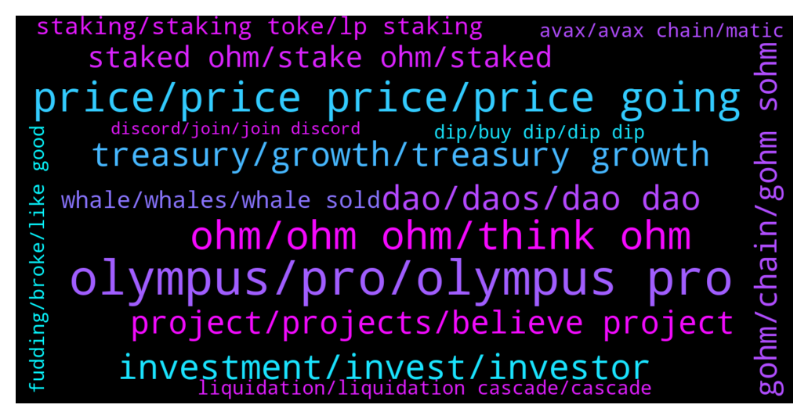

# **@OlympusTG**
 ## Analysis for **2022-01-16** - **2022-01-23**.

---

## 📊 **Basic Stats**

**n_messages_sent**: 10417

---

---

## 🔝 **Top keywords and related messages**

1. **olympus, pro, olympus pro**

    @prashantmasih --- *I was on another olympus dao telegram group and i was told that I need to sync my wallet and it took me to a website where it was asking my wallet recovery phrase. I am afraid I entered the recovery phrase. My wallet may have been compromised. What can I do now to protect my funds?* **--->** [TG Discussion](https://t.me/OlympusTG/148934)

    @Chris --- *For any new players out there, if you're keen to learn how to use Olympus DAO, how their business model works, how to stake and unstake and wrap - you can check out my tutorial here too: https://youtu.be/OnpVN_wx6wk* **--->** [TG Discussion](https://t.me/OlympusTG/155865)

    @Drugsmatt --- *is an Olympus fork! So same "ponzenomics" dude* **--->** [TG Discussion](https://t.me/OlympusTG/149543)

    @Leny --- *is olympus tg support a real group* **--->** [TG Discussion](https://t.me/OlympusTG/149623)

    @Leny --- *ok so you say get a avx wallet - buy avax on exchange - put avax in wallet - swap for g-ohm - connect to olympusdao with avax wallet - stake gohm - get rich :)* **--->** [TG Discussion](https://t.me/OlympusTG/149698)

    @alfredojpontara --- *hallo, i want to withdraw all my olympus from olympus staking. i unstake gohm from staking and now i can see my ohm in te website olympus but not in my wallet. how can i switch my olympus from site to my wallet? thanks* **--->** [TG Discussion](https://t.me/OlympusTG/152097)

2. **price, price price, price going**

    @xGod3 --- *Why those massive Price drops? I went all in when it was on 1.1k USD$* **--->** [TG Discussion](https://t.me/OlympusTG/145390)

    @JP --- *Why did the price just nuke… again* **--->** [TG Discussion](https://t.me/OlympusTG/153316)

    @chitangxxx --- *jesus $142 - wtf is happening? it's going to test the backing price i guess - isn't slowmode a kind of censorship? so people will sell more! should keep the conversations going at critical times like this - censorship only increases the suspicions* **--->** [TG Discussion](https://t.me/OlympusTG/153022)

    @Mother fudder --- *ok I need PRICE TO GO UP. I cant take this anymore. every day I am checking price and its dipping. every day, check price, bad price. I cant take this anymore, I have over invested, by a lot. it is what it is. but I need price to GO UP ALREADY. can devs DO SOMETHING* **--->** [TG Discussion](https://t.me/OlympusTG/146405)

    @korvuxx --- *This is senseless, if this is the case I do not want to hear you when prices are up either* **--->** [TG Discussion](https://t.me/OlympusTG/154970)

    @Zhang --- *No , I just to say why they don’t adopt some methods to stop the price descending.* **--->** [TG Discussion](https://t.me/OlympusTG/145513)

3. **ohm, ohm ohm, think ohm**

    @Reg --- *Fair question. I'm not an OHM expert by any means. From what I can gather OHM was created by some very smart people and has a decent shot at success. One big factor that I'm not sure about is the community. I don't see people building network/ youtube followings around OHM the way I do around some other successful projects. OHM could really benefit from that as it's future success depends on onboarding new users.* **--->** [TG Discussion](https://t.me/OlympusTG/147738)

    @whcheong2008 --- *im only saying this because i think ohm is a great project, could be done better that's all. i'll rest my case here, say whatever you will* **--->** [TG Discussion](https://t.me/OlympusTG/155054)

    @nfwaple --- *it is so mind blowing the numbers of fudders we have today, if I am not an Ohmie I wouldn't even be here in the first place, if I am an Ohmie I won't be making comments that don't do anything for the community* **--->** [TG Discussion](https://t.me/OlympusTG/154879)

    @fairwinds --- *What is the purpose of OHM ? No idea what it does or is trying to do ?* **--->** [TG Discussion](https://t.me/OlympusTG/155932)

    @nfwaple --- *that's not the purpose of OHM 😂😂* **--->** [TG Discussion](https://t.me/OlympusTG/155940)

    @Freedom_Now1 --- *Nice to see OHM moving up* **--->** [TG Discussion](https://t.me/OlympusTG/148808)

4. **investment, invest, investor**

    @bike4peace --- *you are just a bad investor, as you buy something, where you have NO fucking idea what you invest your money* **--->** [TG Discussion](https://t.me/OlympusTG/154916)

    @Ap0l1o --- *It seems to me that many still don’t really understand how things work and get over invested and get disappointed when they are not millionaires after a week or month.* **--->** [TG Discussion](https://t.me/OlympusTG/148812)

    @nfwaple --- *you didn't read everything before investing? I read the docs 5 x before buying* **--->** [TG Discussion](https://t.me/OlympusTG/163890)

    @Flower --- *yes I am, if you leave it for a full year and we are still at a 1000% your investment will 10x in sOHM* **--->** [TG Discussion](https://t.me/OlympusTG/150815)

    @DaandiS --- *My honest opinion don't invest in if not invested yet* **--->** [TG Discussion](https://t.me/OlympusTG/152805)

    @DaandiS --- *You are interested in for getting huge shit  or grow your invested capital* **--->** [TG Discussion](https://t.me/OlympusTG/152821)

5. **treasury, growth, treasury growth**

    @nfwaple --- *Dear Community,  Today we witnessed extreme sell pressure which led to another liquidation cascade.  However, we would like to make a few points clear to our community.     1. The treasury is as healthy as it has ever been:     Assets: LUSD     - $76,638,347.97 DAI      - $73,643,337.60 FRAX     - $40,015,181.80 WETH     - $33,863,695.17 vlCVX    - $33,438,030.47 Aave DAI - $10,634,851.31 tToke    - $7,152,010.46 veFXS    - $6,575,471.22 xSUSHI   - $1,790,874.49 inSpirit - $1,173,942.71 KP3R     - $1,029,489.34 ALCX     - $917,212.22 BCT      - $447,758.73 FXS      - $309,013.29 CRV      - $289,569.56 BTRFLY   - $250,754.86 pBTRFLY  - $40,000,000.00 or 10% of total supply pKLIMA   - $8,680,412.16 or 3.5% of total supply   Liquidity: OHM / DAI  - $157,882,507.88 OHM / ETH  - $57,113,080.66 OHM / LUSD - $39,163,186.37 OHM / FRAX - $22,198,175.88    2. The DAO is still on track to release many projects in the coming weeks and months:   Incubator/Grants Agora News Network Odyssey Olympus Pro: permissionless OP bonds Give/Tyche  Cross chain      - Proteus: gOHM partnerships and liquidity deployed on Ethereum, Avalanche, Arbitrum, Polygon, Fantom, Moonriver      - Cross chain: fully implemented Olympus branches with native tokens on all chains Bonds      -V2 bond deployment      -Hermes: tokenized bond market and yield curves  Liquidity      -Atlantis      -OHM Debtor function: Treasury asset + liquidity unlocked      -OHM V3 concentrated liquidity   3. We are committed to expand the utility for OHM in the near future together with our partners    Core-Partners :  Frax, Klima DAO, Redacted Cartel, Lobis, Alchemix, Dopex, Inverse, Tokemak, Umami Finance, Debt DAO, Vesta, Volt, Exodia, Liquity, Phantom DAO, Prime DAO, Spirit Swap, Fiat DAO        Olympus Pro Partners:   Ethereum Angle Protocol BanklessDAO BarnBridge Botto BlackPool DivineDAO Everipedia FiatDAO Float Protocol Gro Protocol Ichi Inverse Keep3r Network KeeperDAO mStable Pendle PoolTogether Premia Sandclock ShapeShift Synapse THORSwap Unslashed Finance   Avalanche  BenQi Growth DeFi Pangolin YieldYak   Fantom  LiquidDriver Scream SpiritSwap Spooky Swap   Arbitrum   GMX Treasure  4. Our revenue streams are growing daily:  Current Annualised Revenue:  OP - 20 million LP fees - 75 million Yield Farming + Staking - 110 million (and growing soon) Fee sharing agreements - 50 million   As seen today, leverage can be very dangerous and we strongly encourage caution when using it. We will hold a call tomorrow evening at UTC 8pm with the entire community to answer any questions you all might have.    As always, we appreciate all the support for Olympus and we close with a video Zeus made when we got started as a 10 million dollar protocol back in March. We believe a lot of it is still very relevant today!* **--->** [TG Discussion](https://t.me/OlympusTG/154650)

    @King_alts --- *Lol thats risk free treasury,  but even the treasury is declining so money being moved...* **--->** [TG Discussion](https://t.me/OlympusTG/158943)

    @Removsk --- *What use is the treasury of it can't help us right now, I wonder!* **--->** [TG Discussion](https://t.me/OlympusTG/164799)

    @Cixex --- *I thought that when price goes down, devs mop up coin , when price is up, devs sell to boost treasury.* **--->** [TG Discussion](https://t.me/OlympusTG/152607)

    @vdt153 --- *lets see if the treasury is really going to be distributed as you say. no point selling at these prices* **--->** [TG Discussion](https://t.me/OlympusTG/165109)

    @Shane (4,4) (🍉,🍉) --- *While I agree with what you were saying about treasury.....I would say if the market maker gets gohm on a couple of good CEXs then you may regret this post....😂😂😂  This is what I am waiting on because at this point we need price appreciation....not more bonds and more minting just so the treasury gets richer.....NFA....just my opinion....😂😂😂* **--->** [TG Discussion](https://t.me/OlympusTG/148332)

6. **dao, daos, dao dao**

    @bodMIX --- *I have already invested on more than 20 daos and 5 of them already returned my investment* **--->** [TG Discussion](https://t.me/OlympusTG/160955)

    @Mike_Wrekt --- *Why all daos are at - 70 to - 90% down? All scam?* **--->** [TG Discussion](https://t.me/OlympusTG/155498)

    @B --- *This might be the reaosn for this last drop but the trend is dwonwards and there is no sign of turning so %1 a day is not enticing enough for new investors to come, and soemhow DAO is not moving as well* **--->** [TG Discussion](https://t.me/OlympusTG/146768)

    @bike4peace --- *you can always make something better, but we are human, the DAO is human, its not AI doing all this, its people like you and me* **--->** [TG Discussion](https://t.me/OlympusTG/155078)

    @Cixex --- *It’s the root cause of multiple cascade across DAO tokens* **--->** [TG Discussion](https://t.me/OlympusTG/161165)

    @Cixex --- *All DAO coins, about 20 of them are nose diving at the same time,* **--->** [TG Discussion](https://t.me/OlympusTG/156582)

7. **project, projects, believe project**

    @Valihora --- *I know a lot about this project. I'm here from the beginning. And even contributing and donate. But I'm not happy with result. Seriously.* **--->** [TG Discussion](https://t.me/OlympusTG/154911)

    @abe1738384 --- *clear sign of strength in a project. the insta ban stage* **--->** [TG Discussion](https://t.me/OlympusTG/158526)

    @Shane (4,4) (🍉,🍉) --- *As I said earlier to someone....I have been 3,3 since late June so definitely believe in the project....simply frustrated because there have been definite problems with people fleeing over the past 2.5 months and it hasn't shown any signs of bottoming out other than a couple of short lived rallies over that time* **--->** [TG Discussion](https://t.me/OlympusTG/145927)

    @Richie1968 --- *Are people jumping ship to better projects 🤷🏻‍♂️* **--->** [TG Discussion](https://t.me/OlympusTG/145974)

    @Keegan --- *Anybody curious as to why no one knows who is behind this project other than some mythical figures?  This is what I said* **--->** [TG Discussion](https://t.me/OlympusTG/152923)

    @praxistechnologies --- *This project is done and you people are toxic af* **--->** [TG Discussion](https://t.me/OlympusTG/156080)

8. **gohm, chain, gohm sohm**

    @crypto1Q --- *Got you, just trying to figure out which one is better. I’ll go for gOHM, thanks once again* **--->** [TG Discussion](https://t.me/OlympusTG/147620)

    @Jack --- *Does that mean Gohm is better?* **--->** [TG Discussion](https://t.me/OlympusTG/150198)

    @mario_99990 --- *What is ath of gohm ?* **--->** [TG Discussion](https://t.me/OlympusTG/145751)

    @Mine --- *So I ensure I go for gOHM as a newbie right* **--->** [TG Discussion](https://t.me/OlympusTG/150425)

    @Nabil --- *but transaction confirmed from metamask for both sohm and gohm* **--->** [TG Discussion](https://t.me/OlympusTG/152381)

    @ccryii --- *gOhm is designed to be multichain . If you want to use another network. It’s the same thing but with different app* **--->** [TG Discussion](https://t.me/OlympusTG/155040)

9. **staked ohm, stake ohm, staked**

    @crypto_dois --- *Which ohm do u have to buy to stake* **--->** [TG Discussion](https://t.me/OlympusTG/147159)

    @DestinedForMoon3 --- *Hey how to buy or stake more ohm without using sushiswap or any eth based blockchain swap. Cus i don't wanna waste 100-150$ on fee like last time.* **--->** [TG Discussion](https://t.me/OlympusTG/155750)

    @Crypto --- *I want OHM and to be staked on coinbase wallet* **--->** [TG Discussion](https://t.me/OlympusTG/145566)

    @D_P0007 --- *i can get ohm from uniswap and stake directly on website correct?* **--->** [TG Discussion](https://t.me/OlympusTG/147743)

    @safuking --- *any tutorial on how to buy ohm on matic and stake on official page after buying ?* **--->** [TG Discussion](https://t.me/OlympusTG/149911)

    @SecuriTech24 --- *Is this only for OHM? I borrowed mim using receipt from staked Fantom on Yearn* **--->** [TG Discussion](https://t.me/OlympusTG/163053)

10. **staking, staking toke, lp staking**

    @A. --- *I just joined the group, can someone explain to me what's happening 😐 with the price, I'm staking since September* **--->** [TG Discussion](https://t.me/OlympusTG/157808)

    @Max --- *I mean, Why staking if minting is better?* **--->** [TG Discussion](https://t.me/OlympusTG/145317)

    @dakirby --- *its over, i'm buying and staking hex* **--->** [TG Discussion](https://t.me/OlympusTG/155493)

    @Kng3000 --- *I watch couple interviews with the team they seem smart. Before I made up my mind. If you plan doing this for long time lp staking might be good idea and less gas* **--->** [TG Discussion](https://t.me/OlympusTG/160683)

    @maks_dii --- *Then what was the sens of staking ? To loose ? 😂* **--->** [TG Discussion](https://t.me/OlympusTG/147731)

    @cdp279 --- *Sure. But I thought he meant for staking* **--->** [TG Discussion](https://t.me/OlympusTG/157482)

11. **whale, whales, whale sold**

    @mikelg1 --- *Is this whale control time as well?* **--->** [TG Discussion](https://t.me/OlympusTG/153339)

    @Cixex --- *Let me clear my understandings. This is a very very long term investment. If you get lucky to have a whale pump the token, you would benefit. But if there is none, the model requires you to wait until your reward + token surpassed the initial investment cost. Do the math.* **--->** [TG Discussion](https://t.me/OlympusTG/161338)

    @mikelg1 --- *How time is related to this whale?* **--->** [TG Discussion](https://t.me/OlympusTG/154380)

    @PE4M0 --- *liqudations of whales that took on leverage* **--->** [TG Discussion](https://t.me/OlympusTG/146214)

    @nfwaple --- *post transactions here so we can look into the whales wallets* **--->** [TG Discussion](https://t.me/OlympusTG/151633)

    @timon_k --- *the whales are the ones that keep f’ing us haha, if they would just hodl* **--->** [TG Discussion](https://t.me/OlympusTG/155316)

12. **liquidation, liquidation cascade, cascade**

    @VincentStatic --- *I am fine but the Word Liquidation makes me mad* **--->** [TG Discussion](https://t.me/OlympusTG/164745)

    @ihorkoko --- *stop these liquidation stories, let it rip to 0$ to liquidate everyone then* **--->** [TG Discussion](https://t.me/OlympusTG/153165)

    @VincentStatic --- *When will this stop? Liquidation is the excuse for everything* **--->** [TG Discussion](https://t.me/OlympusTG/164735)

    @nfwaple --- *manipulate what? the scale of manipulation wouldn't have been that big, it was amplified by liquidation. If you're going to speculate a theory at least have something to back it up, if you can post transactions we would be interested to see too* **--->** [TG Discussion](https://t.me/OlympusTG/151647)

    @nfwaple --- *liquidation. do your own research and make your own investment decision* **--->** [TG Discussion](https://t.me/OlympusTG/147524)

    @nfwaple --- *yea I watched the liquidation and after 10 mins without anyone liquidating, I thought it was a good time* **--->** [TG Discussion](https://t.me/OlympusTG/153858)

13. **avax, avax chain, matic**

    @Colonelgaddafi --- *Don't just buy using avax instead of eth* **--->** [TG Discussion](https://t.me/OlympusTG/154986)

    @Ninihills --- *That’s fine. Yes can withdraw avax to c chain* **--->** [TG Discussion](https://t.me/OlympusTG/146470)

    @Ap0l1o --- *Can you withdraw avax to c-chain?* **--->** [TG Discussion](https://t.me/OlympusTG/146449)

    @SMNFT7 --- *Is 0.2 ETH for 7.3 AVAX a good swap? (Binance)* **--->** [TG Discussion](https://t.me/OlympusTG/153700)

    @Ahmad --- *Is AVAX cheaper or MATIC cheaper?* **--->** [TG Discussion](https://t.me/OlympusTG/162850)

    @Leny --- *Ok cool ..I buy avax on bitfinex then swap for dao with avax wallet ?* **--->** [TG Discussion](https://t.me/OlympusTG/149654)

14. **fudding, broke, like good**

    @MaradoCrypto --- *Ya Solana was taken off line twice now . It's centralized with a company behind it that can take it offline . Not what crypto is about .* **--->** [TG Discussion](https://t.me/OlympusTG/155346)

    @Arthur_0102 --- *^^ most people complaining don't quite understand how crypto works lol* **--->** [TG Discussion](https://t.me/OlympusTG/159929)

    @Willow --- *I’ve never been more bullish on any crypto.* **--->** [TG Discussion](https://t.me/OlympusTG/157532)

    @Arthur_0102 --- *im super active in another crypto community and there's this wave of bots that are sooo weird* **--->** [TG Discussion](https://t.me/OlympusTG/159969)

    @forumetautre --- *a friend told me that crypto only go up* **--->** [TG Discussion](https://t.me/OlympusTG/146634)

    @mario_99990 --- *Crypto also have good interest so I don’t think so* **--->** [TG Discussion](https://t.me/OlympusTG/159793)

15. **dip, buy dip, dip dip**

    @Colin --- *Sooo... when should one wait to buy the dip...* **--->** [TG Discussion](https://t.me/OlympusTG/158587)

    @joaoeca --- *time to buy the dip! let's go ohmies!* **--->** [TG Discussion](https://t.me/OlympusTG/146306)

    @Epp330 --- *Sorry man. Waiting for another dip gonna buy more* **--->** [TG Discussion](https://t.me/OlympusTG/148148)

    @HolyFkcu --- *We going back up! Someone buying the dip!!!* **--->** [TG Discussion](https://t.me/OlympusTG/153553)

    @CardanoADAMike --- *Buying the dip now. See you all on the moon!* **--->** [TG Discussion](https://t.me/OlympusTG/158494)

    @Ig - BATATAK1NG --- *Looks like I fojnd an opportunity to buy the dip and help y’all out 😂* **--->** [TG Discussion](https://t.me/OlympusTG/154686)

