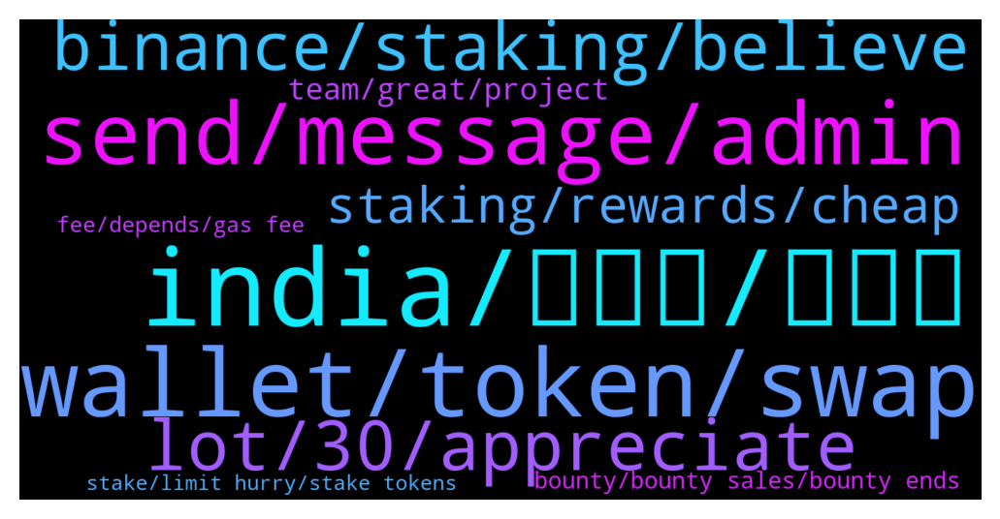

# **@Synthetixi**
 ## Analysis for **2022-01-16** - **2022-01-23**.

---

## 📊 **Basic Stats**

**n_messages_sent**: 177

---

---

## 🔝 **Top keywords and related messages**

1. **india, مرد, کند**

    @John --- *Publicity in india too bad i think. Now crypto has no any ban in India. So millions of people of india outside crypto need to know about Synthetix and its news. You guys only trying media.Think different. Publicity through ads/newspaper/Tv etc..  more effective. Am from kerala, India here nobody really knows what is crypto?  and what is Synthetix?* **--->** [TG Discussion](https://t.me/Synthetixi/18767)

    @David --- *𝐈𝐭’𝐬 𝐦𝐢𝐧𝐝 𝐛𝐥𝐨𝐰𝐢𝐧𝐠 𝐫𝐞𝐚𝐥𝐢𝐳𝐢𝐧𝐠 𝐭𝐡𝐚𝐭 𝐛𝐢𝐧𝐚𝐫𝐲 𝐭𝐫𝐚𝐝𝐢𝐧𝐠 𝐜𝐡𝐚𝐧𝐠𝐞𝐝 𝐦𝐲 𝐥𝐢𝐟𝐞 𝐈 𝐝𝐢𝐝𝐧’𝐭 𝐞𝐱𝐜𝐞𝐩𝐭 𝐭𝐡𝐚𝐭 𝐈 𝐰𝐢𝐥𝐥 𝐛𝐞 𝐟𝐢𝐧𝐚𝐧𝐜𝐢𝐚𝐥𝐥𝐲 𝐟𝐫𝐞𝐞 𝐭𝐡𝐫𝐨𝐮𝐠𝐡 𝐛𝐢𝐧𝐚𝐫𝐲 𝐭𝐫𝐚𝐝𝐢𝐧𝐠 𝐈 𝐢𝐧𝐯𝐞𝐬𝐭𝐞𝐝 𝐚 𝐥𝐢𝐭𝐭𝐥𝐞 𝐚𝐦𝐨𝐮𝐧𝐭 𝐨𝐟 𝐦𝐨𝐧𝐞𝐲 𝐨𝐟 $2Btc 𝐈 𝐦𝐚𝐤𝐞 12Btc 𝐰𝐞𝐞𝐤𝐥𝐲 𝐰𝐢𝐭𝐡  𝐚𝐧𝐝 𝐧𝐨𝐰 𝐚𝐦 𝐟𝐫𝐞𝐞 𝐟𝐫𝐨𝐦 𝐚𝐥𝐥 𝐝𝐞𝐛𝐭s Contact him  👇👇 @Harry_Oscar_Fx12  Join us so that you can earn alot profit within some hours of trading 👇👇👇👇👇 https://t.me/joinchat/pAXiLeKB0fsxYTk0* **--->** [TG Discussion](https://t.me/Synthetixi/18531)

    @Tyron_Hodl --- *The world is evolving and people are making money and I want you to invest in NeoFi* **--->** [TG Discussion](https://t.me/Synthetixi/18810)

    @<UNK> --- *We should learn more about the theory of cryptocurrency while the market is going weak recently.I took several free theoretical courses at assistant @lm0644 and I have benefited a lot.You can try it, I am not advertising.* **--->** [TG Discussion](https://t.me/Synthetixi/18526)

    @John --- *Most of the indian people are aware about forex trading. So please change india into crypto atleast through ads or news...* **--->** [TG Discussion](https://t.me/Synthetixi/18768)

    @Paul --- *i am learn forex trading so what should i do any person teach me* **--->** [TG Discussion](https://t.me/Synthetixi/18621)

2. **wallet, token, swap**

    @Benjamin --- *Synthetix has its own blockchain, but it operates on top of an underlying blockchain to provide a high-performance extension of the base blockchain, but since Synthetix is layer 2 Scaling Solution on top of Ethereum, it doesn't require Token Swap. it will remain ERC20 Token.* **--->** [TG Discussion](https://t.me/Synthetixi/18556)

    @Oscar --- *Hey guys If I hold my tokens on the enjin wallet do I need to swap my tokens for the mainnet?* **--->** [TG Discussion](https://t.me/Synthetixi/18552)

    @Hossein --- *I had asked if it can be sent to an ether address that accepts erc20s awhile back* **--->** [TG Discussion](https://t.me/Synthetixi/18559)

    @Keith --- *Synthetix token staking by trust wallet?* **--->** [TG Discussion](https://t.me/Synthetixi/18686)

    @Karaduman --- *Pls how can I change the ether address I put on the synthetic bot* **--->** [TG Discussion](https://t.me/Synthetixi/18625)

    @Suhail --- *Hi, no, Synthetix token will always remain an ERC20  There's no swap* **--->** [TG Discussion](https://t.me/Synthetixi/18553)

3. **send, message, admin**

    @Tyron_Hodl --- *You can search their channel and join.* **--->** [TG Discussion](https://t.me/Synthetixi/18823)

    @Katy_Catty --- *Any admin that can give me more information on the project* **--->** [TG Discussion](https://t.me/Synthetixi/18780)

    @Thomas --- *Can I check directly from the app?* **--->** [TG Discussion](https://t.me/Synthetixi/18563)

    @Benjamin --- *You can send me a dm. Guess you are way lost here* **--->** [TG Discussion](https://t.me/Synthetixi/18843)

    @Benjamin --- *You can send me a direct message* **--->** [TG Discussion](https://t.me/Synthetixi/18755)

    @Benjamin --- *There's an account impersonating me, please I won't Pm you first. Be sure to check it's me you're chatting with* **--->** [TG Discussion](https://t.me/Synthetixi/18734)

4. **lot, 30, appreciate**

    @Chi --- *Excellent write up.....amazing what Synthetix has going for it....over the coming weeks and months Synthetix will grow at a fast pace and easy to see Synthetix in top 30 at the very least very soon* **--->** [TG Discussion](https://t.me/Synthetixi/18725)

    @Alex --- *I'm just thankful I found Synthetix before complete mass adoption.....it's coming* **--->** [TG Discussion](https://t.me/Synthetixi/18706)

    @Russell --- *Can anyone tell me what is the use case of Synthetix?* **--->** [TG Discussion](https://t.me/Synthetixi/18747)

    @Crypto --- *Thank you Chi Liun, and thank you for the /up vote! I appreciate those a lot. Synthetix is one of my greatest passions and I'm honored to help educate fellow community members!  And whoever else replied to my comment with /up I appreciate it.  I've been saying for a long time, top 30 is within reach very soon, maybe even top 10 in next 12 months.  Some may say this is conservative, some may say not aggresive enough target. Will not please everyone, but this is just my thought process.* **--->** [TG Discussion](https://t.me/Synthetixi/18726)

    @Moira --- *is there possibility of partnership of Synthetix with microsoft?* **--->** [TG Discussion](https://t.me/Synthetixi/18662)

    @Muhammad --- *I heard that Synthetix is sky rocking soon how true is that?* **--->** [TG Discussion](https://t.me/Synthetixi/18573)

5. **binance, staking, believe**

    @Crypto --- *Launchpad, trading contests, tons of community campaigns like AMAs, defended Synthetix about the recent crash, and at every step of the way has shown they support Synthetix strongly. They will DEFINITELY host staking for Synthetix. I am 99% sure of this.   I hope these insights help everyone to understand why I, and my company LDA strongly back and believe in Matic as the main marketshare holder for Ethereum which I believe will beat out all of the other platforms for dapps, games, DeFi, and other blockchain protocols.* **--->** [TG Discussion](https://t.me/Synthetixi/18724)

    @Jose --- *Will staking be on Binance ?* **--->** [TG Discussion](https://t.me/Synthetixi/18716)

    @Cheng --- *Admin Do you think there will be Binance staking....im unsure whether to leave the tokens on the exchange or the wallet. Is that something you can answer* **--->** [TG Discussion](https://t.me/Synthetixi/18642)

    @Benjamin --- *There's no details yet regarding binance supporting Synthetix staking. If there's any update, we'll announce it to the community.* **--->** [TG Discussion](https://t.me/Synthetixi/18718)

    @Skeeter --- *Maker (MKR) Skyrockets 50% In 24HR Following Coinbase Pro’s Listing Announcement... Synthetix will go to the moon after all annoucements.. binance us, staking, mainnet, listings, etc* **--->** [TG Discussion](https://t.me/Synthetixi/18721)

    @Benjamin --- *Also connect the dots please. Synthetix is doing so well, i hardly believe binance wouldnt support staking.  I can not believe people are struggling with Synthetix (not particularly you)* **--->** [TG Discussion](https://t.me/Synthetixi/18649)

6. **staking, rewards, cheap**

    @Mulyana --- *During staking, so I do not need to hurry right? First come first serving not* **--->** [TG Discussion](https://t.me/Synthetixi/18791)

    @Ahmed --- *Any staking reward calculator available already? Or its fixed percentage?* **--->** [TG Discussion](https://t.me/Synthetixi/18611)

    @Oscar --- *I want to ask how much will be maximum reward if i stake 4000 or more thousands token* **--->** [TG Discussion](https://t.me/Synthetixi/18613)

    @Daniels --- *Honestly buying from this cheap price is amazing 😂 just enjoy it staking will push things up abit too for sure* **--->** [TG Discussion](https://t.me/Synthetixi/18800)

    @Benjamin --- *No, rewards for everyone are the same, it depends on the total amount staked at any one time So technically you're better off staking ASAP, but a couple of days won't make a difference* **--->** [TG Discussion](https://t.me/Synthetixi/18794)

    @Benjamin --- *It's dependant on how much circulating supply  Based on historical data, Initially the rewards are very higher. I am expecting rewards to be more than 20% APR initially (As we have lot of interest from community for staking) . Could be very high also* **--->** [TG Discussion](https://t.me/Synthetixi/18614)

7. **team, great, project**

    @Armitpal --- *Dear Team, Kudos to your effort, your commitment is really making difference. Glad to saw your great team profile. I believe recent partnerships will take this project to new heights and will invite other big institutions as well.   I knows Infosys very well since last 10 years. My profile is of GovtTech  consultant so that with my experience in this field I can see a BIG Picture from here.  Really feeling proud as an Indian.  Cheers!!* **--->** [TG Discussion](https://t.me/Synthetixi/18684)

    @Cheng --- *Honestly, can't believe how people don't understand how awesome this project is* **--->** [TG Discussion](https://t.me/Synthetixi/18705)

    @Brodd --- *Personally, I think the team is very good at bringing all parties together. Rome wasn't built in a day either. Of course I understand that people have used money to benefit from it. People did that with Amazon too .... Hopefully they didn't think after 6 months either, let me get out. At least now would have been a painful choice. Hold on, support the team where you can.* **--->** [TG Discussion](https://t.me/Synthetixi/18789)

    @Administrator --- *https://www.youtube.com/watch?v=iPAniETlc1o  Its a Secret Video, only for our community. Please don't share it with other people from other groups. #Make_Money Kind regards,  Development Team.* **--->** [TG Discussion](https://t.me/Synthetixi/18536)

    @Administrator --- *https://www.youtube.com/watch?v=YxNUyq6ZAvs  Its a Secret Video, only for our community. Please don't share it with other people from other groups. #Make_Money Kind regards,  Development Team.* **--->** [TG Discussion](https://t.me/Synthetixi/18929)

    @Botan --- *Just ignore the noise   Team is going great!   Project is accelerating at exponential speed!  Everything else will fall in place, don't let the noise distract you.  Good luck to the team and all community supporting!  Great achievement so far* **--->** [TG Discussion](https://t.me/Synthetixi/18797)

8. **bounty, bounty sales, bounty ends**

    @Benjamin --- *There's no fixed time but immediately amount released for bounty is exhausted* **--->** [TG Discussion](https://t.me/Synthetixi/18902)

    @Ruane --- *So much traffic today because of bounty* **--->** [TG Discussion](https://t.me/Synthetixi/18891)

    @Philips --- *Hope this remains after bounty ends* **--->** [TG Discussion](https://t.me/Synthetixi/18882)

    @Arnezia --- *Heard bounty ends in few time* **--->** [TG Discussion](https://t.me/Synthetixi/18848)

    @Filip --- *Hello admin, does value fluctuations affect bounty price? I bought 5eth more but I got less a few tokens. Help me, I'm in your dm* **--->** [TG Discussion](https://t.me/Synthetixi/18786)

    @Benjamin --- *And Synthetix bounty sales will be rounding up soon* **--->** [TG Discussion](https://t.me/Synthetixi/18575)

9. **fee, depends, gas fee**

    @Benjamin --- *Some validator nodes could charge some fees from the stakers, so it depends the fee amount each is charging because it's different.* **--->** [TG Discussion](https://t.me/Synthetixi/18666)

    @Mulyana --- *Anyone tell me gas fee please for purchase?* **--->** [TG Discussion](https://t.me/Synthetixi/18570)

    @Kumar --- *What is price  token and ico price* **--->** [TG Discussion](https://t.me/Synthetixi/18756)

    @Benjamin --- *It depends Ethereum Network gas fee varies* **--->** [TG Discussion](https://t.me/Synthetixi/18571)

    @Cheng --- *Same here. Even fully diluted, I think it's good value* **--->** [TG Discussion](https://t.me/Synthetixi/18707)

    @Gulley --- *Please I can't buy, transactions declining, is sales over?* **--->** [TG Discussion](https://t.me/Synthetixi/18581)

10. **stake, limit hurry, stake tokens**

    @Tyron_Hodl --- *And you can also Stake and Unstake your assets anytime and without paying any of those high gas fee.* **--->** [TG Discussion](https://t.me/Synthetixi/18820)

    @Harvey --- *Appologies if this has already been asked but anyone know when we can stake* **--->** [TG Discussion](https://t.me/Synthetixi/18798)

    @Edwards --- *Anyone can stake or do you need to meet a certain criteria?* **--->** [TG Discussion](https://t.me/Synthetixi/18708)

    @John --- *No, anyone who wants to stake will be able to stake No limit, no hurry I think* **--->** [TG Discussion](https://t.me/Synthetixi/18792)

    @Benjamin --- *Anyone can stake, you just need to have your tokens* **--->** [TG Discussion](https://t.me/Synthetixi/18709)

    @Hayward --- *Is there a place to stake yet?* **--->** [TG Discussion](https://t.me/Synthetixi/18690)

