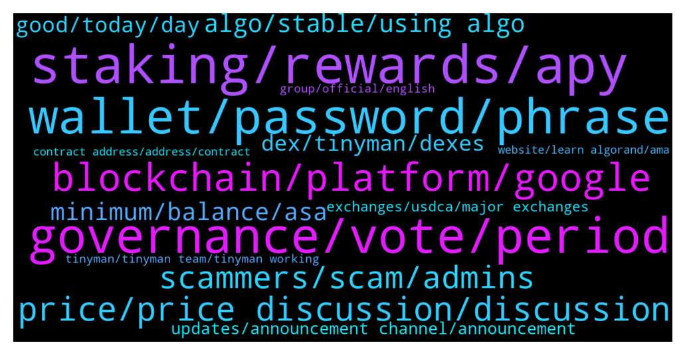

# **@algorand**
 ## Analysis for **2022-01-16** - **2022-01-23**.

---

## 📊 **Basic Stats**

**n_messages_sent**: 1247

---

---

## 🔝 **Top keywords and related messages**

1. **staking, rewards, apy**

    @iamaturtle123 --- *Hi guys, programmer here new to the Blockchain. I am thinking of creating a tax preparation app for yieldly where I put in an address and it spits out a list of interactions with the yieldly staking app along with the price of yieldly on the day of the transaction. My question is how should I query the blockchain? It looks like the algo explorer api would do what I want, but I also see that is deprecated and frowned upon. Would I have to run my own algo node to do this, or is there another api I should use?* **--->** [TG Discussion](https://t.me/algorand/332161)

    @mikamika1987 --- *Hi, where can we stake Algo for best rewards* **--->** [TG Discussion](https://t.me/algorand/331588)

    @MackDenver --- *Hello there, you can simply hold Algo in official wallets to get staking rewards.* **--->** [TG Discussion](https://t.me/algorand/332547)

    @KeepItRealBro --- *Hi, guys. Can you recommend safe ways for multipliying my algos. Wanted to put them into staking on binance, but apy is so low, around 1%. I'm a newbie, sorry for noob question* **--->** [TG Discussion](https://t.me/algorand/332914)

    @maze --- *Hello there I'm from Germany and got a question.  Heard about staking rewards automatically if you hold algorand.  In Germany you need to pay about 10 years taxes if you sell a staking coin.  Can I deactivate staking function?* **--->** [TG Discussion](https://t.me/algorand/333544)

    @max219912 --- *Hey can anyone tell me where to store algo for staking ?* **--->** [TG Discussion](https://t.me/algorand/331930)

2. **governance, vote, period**

    @abovyanv --- *isn't it weird for you that someone made some decisions for you and giving to you options A and B for voting. And this is freedom and Decentralization?  Does this remind you of politics, where we have two presidential candidates and we need to choose one of them... think about it* **--->** [TG Discussion](https://t.me/algorand/331943)

    @MackDenver --- *So how do you think we should progress going forward? The governance was added to the Algorand ecosystem to move a more decentralized model* **--->** [TG Discussion](https://t.me/algorand/331753)

    @MackDenver --- *Hello Ces, The signup period of the second governance period has over. Please check more at: https://algorand.foundation/governance* **--->** [TG Discussion](https://t.me/algorand/332897)

    @MackDenver --- *Hello Vladimir, Everything about the governance and governance related information is available in our website. Here is the details about the governance rewards system: https://algorand.foundation/news/algorand-governance-rewards-period-2* **--->** [TG Discussion](https://t.me/algorand/331577)

    @NightAlgorand --- *Are you refer to the participation rewards? it was changed for the governance reward. https://algorand.foundation/news/algorand-governance-rewards-period-2 for more information* **--->** [TG Discussion](https://t.me/algorand/331847)

    @khunpon --- *Decentralize, and democracy. This is Algorand give us. BTC also decentralize, but these miner aren't. Algorand is much more decentralize. Why you don't want to vote/participate?  https://youtu.be/NykZ-ZSKkxM  Silvio said in this video, if you don't want to do anything/participate. You should find the other project* **--->** [TG Discussion](https://t.me/algorand/331894)

3. **wallet, password, phrase**

    @KENVO749 --- *Here is my wallet address: VYYBORB7TB6RZV2C2XAL2LOZN3QLZBSEFAAVRO7GD7LGCF5SXXDCWTSEU4 I choose Option B* **--->** [TG Discussion](https://t.me/algorand/331668)

    @JKasiino --- *is there metamask plugin for wallet.myalgo* **--->** [TG Discussion](https://t.me/algorand/332582)

    @Ricky --- *I moved all of my algo into my algo wallet from Coinbase. Does anyone have a source on the actual myalgo wallet APY?* **--->** [TG Discussion](https://t.me/algorand/333366)

    @Happy --- *How to buy micro tesla in algo wallet?* **--->** [TG Discussion](https://t.me/algorand/331512)

    @MackDenver --- *A wallet phrase is usually English and 24-25 words long. Not sure if I can help you with this* **--->** [TG Discussion](https://t.me/algorand/334281)

    @namhuycp --- *i think wallet.myalgo has some problem* **--->** [TG Discussion](https://t.me/algorand/333526)

4. **blockchain, platform, google**

    @traderbrew --- *I just wanted to talk to some algorand developers to discover if this is the right crypto for me to develop on.* **--->** [TG Discussion](https://t.me/algorand/334661)

    @Vytek --- *Algorand Italia 🇮🇹 Algorand fondato da Silvio Micali insieme a un rinomato team di luminari accademici. Algorand sta costruendo un futuro senza confini e definendo lo standard per la tecnologia blockchain. algorand.com  #algo #ita #algoita #algoitalia #algoranditalia https://t.me/AlgorandItalia* **--->** [TG Discussion](https://t.me/algorand/332757)

    @Rb_71dex --- *haha just saying mate I'm a true algo supporter and investor forever I'm a dev too and i really like the principal of the algorand so yeah it good to be a part of this ecosystem🔥👍* **--->** [TG Discussion](https://t.me/algorand/333448)

    @daffyduck91 --- *Biden speak about this blockchain and speak good words about* **--->** [TG Discussion](https://t.me/algorand/334712)

    @callq --- *What do you want? %10 price increases every day? It doesn't work like that. The world does not care about Algorand. It's a tiny little blockchain. Competing with many many many other crypto-currencies and Layer-1 solutions.* **--->** [TG Discussion](https://t.me/algorand/333403)

    @abovyanv --- *here is not the question. If Algorand is not a decentralized blockchain, then let it not be stated in the media.* **--->** [TG Discussion](https://t.me/algorand/331779)

5. **price, price discussion, discussion**

    @MackDenver --- *You can use the following group for price discussion  @algorand_price* **--->** [TG Discussion](https://t.me/algorand/331175)

    @NightAlgorand --- *Here is the price discussion group-   https://t.me/algorand_price* **--->** [TG Discussion](https://t.me/algorand/333783)

    @NightAlgorand --- *Please refrain from price discussion here. There is a price discussion group Here is the price discussion group-   https://t.me/algorand_price* **--->** [TG Discussion](https://t.me/algorand/332326)

    @NightAlgorand --- *Hi everyone, please refer to https://t.me/algorand_price for price discussion 🙂* **--->** [TG Discussion](https://t.me/algorand/334244)

    @MackDenver --- *Please join the price chat for price speculation  @algorand_price* **--->** [TG Discussion](https://t.me/algorand/331160)

    @MackDenver --- *Hi creptotronox, We don't talk about the market or price prediction on this chat. Please join the price chat to discuss about this @algorand_price* **--->** [TG Discussion](https://t.me/algorand/334517)

6. **scammers, scam, admins**

    @A_Striker2k20 --- *i send u the ss . dam he wants to scam me* **--->** [TG Discussion](https://t.me/algorand/331347)

    @Bhavnasatish --- *It's a lie. I understand the admins of this group have two accounts here , one with the group logo and they are using it to scam people* **--->** [TG Discussion](https://t.me/algorand/333933)

    @xM3Dx --- *So many scammers in this channel, you send a message and receive 5 DMs from scams 🤢* **--->** [TG Discussion](https://t.me/algorand/332097)

    @splatter --- *Is this not a scammer ?* **--->** [TG Discussion](https://t.me/algorand/332013)

    @Hkkrhnli --- *There are those who write to help me. Is there anyone who sends a special massage? or is it a scammer?* **--->** [TG Discussion](https://t.me/algorand/334159)

    @NightAlgorand --- *No it is a scam, please beware. Admins will never DM you first. Please refrain from posting the scam message here. If you do it repeatedly after warning, you would be banned* **--->** [TG Discussion](https://t.me/algorand/332773)

7. **algo, stable, using algo**

    @Happy --- *Ive been 2 years jump in algo...* **--->** [TG Discussion](https://t.me/algorand/333404)

    @Todd_cr --- *So I’m new into this whole algo thing* **--->** [TG Discussion](https://t.me/algorand/331401)

    @Rb_71dex --- *guess not good mate seeing algo going too dip been while week now 😃* **--->** [TG Discussion](https://t.me/algorand/333446)

    @Happy --- *Will be the same like stable* **--->** [TG Discussion](https://t.me/algorand/334045)

    @Cryptothefuture2022 --- *Can i a question...is algo bot connected  on this coin* **--->** [TG Discussion](https://t.me/algorand/334692)

    @callq --- *I bought at $2 $20,000 of ALGO. Terrible decision.* **--->** [TG Discussion](https://t.me/algorand/333059)

8. **minimum, balance, asa**

    @MackDenver --- *Your minimum balance depends on how many ASA you added to your wallet* **--->** [TG Discussion](https://t.me/algorand/331170)

    @MackDenver --- *If you are asking for the minimum balance requirements, it depends on the amount of ASA you added in your wallet* **--->** [TG Discussion](https://t.me/algorand/332525)

    @MeemBhai --- *Is there a minimum amount of ALGOs required to be  maintained in the wallet corresponding to the number of ASA present?* **--->** [TG Discussion](https://t.me/algorand/334547)

    @MackDenver --- *If you add ASA to your wallet, your minimum ALGO requirement increases. If you want to remove ASA, you can do it from the wallet you are using* **--->** [TG Discussion](https://t.me/algorand/333707)

    @MackDenver --- *You likely have added multiple ASA, each ASA in your account increases the minimum balance that you need to maintain* **--->** [TG Discussion](https://t.me/algorand/331152)

    @Haobui0305 --- *sir, I can't withdraw all my algo, when I press max it goes like this Failed transaction, try again later and when I adjust it lower so that the balance in the wallet is above 0.1 algo, it stays like this Remaining balance below minimum required* **--->** [TG Discussion](https://t.me/algorand/331166)

9. **dex, tinyman, dexes**

    @vbncrypto --- *hey guys, is there any other DEX in Algo ecosystem* **--->** [TG Discussion](https://t.me/algorand/332947)

    @MackDenver --- *Hi there, There is already tinyman DEX and other DEXes will be available soon.* **--->** [TG Discussion](https://t.me/algorand/331602)

    @kriptonk --- *we have no dex... Algorand inc should build a dex...* **--->** [TG Discussion](https://t.me/algorand/333463)

    @ragnaroks157 --- *tinyman has been compromise . hence, im looking for alternative DEX to trade . thanks* **--->** [TG Discussion](https://t.me/algorand/331318)

    @MackDenver --- *There is Timyman however, Tinyman is currently in the repair phase. You will need to wait for it to be fixed. A few other DEXs are already in the works* **--->** [TG Discussion](https://t.me/algorand/332739)

    @jason11169 --- *what dexes can we use on algo now tinyman has no liquidity?* **--->** [TG Discussion](https://t.me/algorand/332283)

10. **good, today, day**

    @Irene --- *good afternoon. Friends, how are you doing today?* **--->** [TG Discussion](https://t.me/algorand/331549)

    @MackDenver --- *Hey Maxim,  Glad to see you today. How are you doing?* **--->** [TG Discussion](https://t.me/algorand/332661)

    @na --- *Hello everyone, today is another beautiful day* **--->** [TG Discussion](https://t.me/algorand/331653)

    @Irene --- *good evening friends, i just finished my dinner here* **--->** [TG Discussion](https://t.me/algorand/331378)

    @lixiaoman005 --- *Hello everyone, good afternoon everyone. 🥰* **--->** [TG Discussion](https://t.me/algorand/333325)

    @Irene --- *Good evening, friends. It's me who just finished dinner🤣* **--->** [TG Discussion](https://t.me/algorand/331624)

11. **updates, announcement channel, announcement**

    @MackDenver --- *You can find all the latest news on our announcement channel  https://t.me/algorand_announcements* **--->** [TG Discussion](https://t.me/algorand/331150)

    @O --- *yaa us is suffering from huge covid cases* **--->** [TG Discussion](https://t.me/algorand/332319)

    @nana8869 --- *Hey, any recent news or upcoming events?* **--->** [TG Discussion](https://t.me/algorand/331149)

    @Nelsonok --- *What about now the ones working now?* **--->** [TG Discussion](https://t.me/algorand/333192)

    @S --- *If they are working to try to do that, it’s disappointing. If they are, I’m wondering what it’s going to take to make to happen.* **--->** [TG Discussion](https://t.me/algorand/332955)

    @abovyanv --- *when? can you give me any links about it* **--->** [TG Discussion](https://t.me/algorand/331587)

12. **group, official, english**

    @Dillon Anna --- *Who can tell me what group this is* **--->** [TG Discussion](https://t.me/algorand/332067)

    @Jewman --- *Is this the official algo group? There are so many* **--->** [TG Discussion](https://t.me/algorand/331831)

    @Foxstot --- *is this the right group for algorand testnet quries* **--->** [TG Discussion](https://t.me/algorand/334569)

    @Alice --- *Who can tell me what group this is* **--->** [TG Discussion](https://t.me/algorand/332075)

    @NightAlgorand --- *Yes, it can be, that is the unofficial group run by community.* **--->** [TG Discussion](https://t.me/algorand/331566)

    @MackDenver --- *No, there is no German group atm.* **--->** [TG Discussion](https://t.me/algorand/331649)

13. **exchanges, usdca, major exchanges**

    @TheRealGiulio --- *Fully agree. USDCa and USDta on big exchanges would be huge!* **--->** [TG Discussion](https://t.me/algorand/332977)

    @S --- *I’m not trying to find it for myself, My point is that I hope it’s a priority for the foundation to get USDCa listed on the top tier exchanges. That would be worth more than any marketing deal they could make for expanding exposure to the ecosystem.* **--->** [TG Discussion](https://t.me/algorand/332954)

    @S --- *Going to try asking again… Is the foundation working on getting USDCa and USDCt added to the major exchanges? Coinbase, Binance, etc? If so, what does this process look like? Is it up to the Algorand foundation to pay a listing fee and facilitate building it the infrastructure? Are Coinbase and there like deliberately disallowing USDCa on their platform due to their partnership with Ethereum products? It would be great to know why tors hasn’t happened yet…* **--->** [TG Discussion](https://t.me/algorand/332944)

    @S --- *Is the foundation working on getting USDCa and USDCt added to the major exchanges? Coinbase, Binance, etc?* **--->** [TG Discussion](https://t.me/algorand/332789)

    @tfv_algo --- *And where can we sell aside from that two* **--->** [TG Discussion](https://t.me/algorand/332850)

    @S --- *Do you know what that process looks like and a possible timeline? Is it simply a matter of paying a fee to the exchange and helping them build out the infrastructure or does it require convincing the exchange to make the listing?* **--->** [TG Discussion](https://t.me/algorand/332793)

14. **tinyman, tinyman team, tinyman working**

    @iamaturtle123 --- *Tinyman should be back up with new pools before the end of the month* **--->** [TG Discussion](https://t.me/algorand/331320)

    @MackDenver --- *Please contact the tinyman team about this  https://t.me/tinymanofficial* **--->** [TG Discussion](https://t.me/algorand/332746)

    @Adrian --- *When tinyman will be back on mainnet? 🧐* **--->** [TG Discussion](https://t.me/algorand/333505)

    @deadlypuppy --- *Did you get this info from a Tinyman announcement?* **--->** [TG Discussion](https://t.me/algorand/331321)

    @NightAlgorand --- *Hi there, Tinyman will live soon, please stay tuned 🙂* **--->** [TG Discussion](https://t.me/algorand/333590)

    @MackDenver --- *Tinyman is currently in the repair phase. You will need to wait for it to be fixed* **--->** [TG Discussion](https://t.me/algorand/332009)

15. **contract address, address, contract**

    @NightAlgorand --- *Algorand does not have Contract address as it is not ERC. Did you send your funds to the wrong address? If so, there is nothing we can do to retrieve my funds unfortunately.* **--->** [TG Discussion](https://t.me/algorand/334139)

    @deadlypuppy --- *"Its a new contract, you have to opt in again"* **--->** [TG Discussion](https://t.me/algorand/333758)

    @jumpfetus --- *There is no contract address for Algorand because it is not ERC* **--->** [TG Discussion](https://t.me/algorand/334409)

    @angelo9007 --- *Algorand has no contract address as it is not ERC* **--->** [TG Discussion](https://t.me/algorand/332657)

    @NightAlgorand --- *there is no contract address as Algorand is not ERC* **--->** [TG Discussion](https://t.me/algorand/332972)

    @Philonous15 --- *Could I get a contract address?* **--->** [TG Discussion](https://t.me/algorand/332838)

