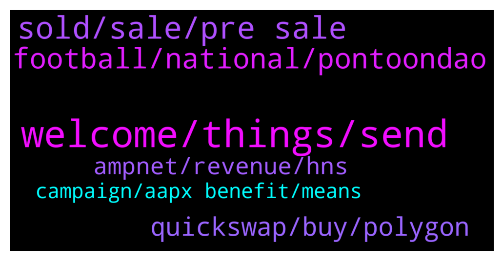

# **@ampnetapxchat**
 ## Analysis for **2022-01-16** - **2022-01-23**.

---

## 📊 **Basic Stats**

**n_messages_sent**: 129

---

---

## 🔝 **Top keywords and related messages**

1. **welcome, things, send**

    @TroopSep --- *Hi @jakovtradingmentor! Thanks for taking care of us! Welcome! 😊* **--->** [TG Discussion](https://t.me/ampnetapxchat/36423)

    @tradingjo98 --- *Maybe you wanna tell us some things about you?* **--->** [TG Discussion](https://t.me/ampnetapxchat/36422)

    @mislavjavor --- *Yes - details still being panned out, don’t want to rush with announcement* **--->** [TG Discussion](https://t.me/ampnetapxchat/36388)

    @jakovtradingmentor --- *Hey, welcome to the group Sera* **--->** [TG Discussion](https://t.me/ampnetapxchat/36441)

    @jakovtradingmentor --- *Thanks for the warm welcome :D* **--->** [TG Discussion](https://t.me/ampnetapxchat/36421)

    @panos_dim --- *all good mate, just cooking right now* **--->** [TG Discussion](https://t.me/ampnetapxchat/36525)

2. **sold, sale, pre sale**

    @Hydayashi --- *Will the foobal token be sold for crypto or only for fiat? it doesnt say anywhere...* **--->** [TG Discussion](https://t.me/ampnetapxchat/36382)

    @matejmz --- *How many tokens are going to be sold during this ICO? I only found total supply info.* **--->** [TG Discussion](https://t.me/ampnetapxchat/36373)

    @Cy --- *how does it compare to other fan token ? Psg for exemple ?* **--->** [TG Discussion](https://t.me/ampnetapxchat/36392)

    @matejmz --- *Is this token first of its kind in region?* **--->** [TG Discussion](https://t.me/ampnetapxchat/36389)

    @Hydayashi --- *Stop selling people...let it grow. This guys will make it in the end. Mark my words.* **--->** [TG Discussion](https://t.me/ampnetapxchat/36294)

    @North --- *That answers partially, thanks. And the fees from VATRENI are collected on each token transaction or some other way?* **--->** [TG Discussion](https://t.me/ampnetapxchat/36384)

3. **football, national, pontoondao**

    @mislavjavor --- *Yes - players will directly marekt* **--->** [TG Discussion](https://t.me/ampnetapxchat/36385)

    @Cy --- *Great... but could you say The Croatian National Selection :D That would be a lot clearer for non croatians ˆˆˆ* **--->** [TG Discussion](https://t.me/ampnetapxchat/36304)

    @tradingjo98 --- *partnership with a national football team, oh god this must be kinda bullish* **--->** [TG Discussion](https://t.me/ampnetapxchat/36338)

    @T --- *They just had Croatian national football team partnership and Vatreni token launch. Next comes PontoonDao (Q1) on Near protocol (which is damn hot atm). Then later this year licensing whole product to "reputable and large" brand (ongoing talks).  All this and 3.72m total marketcap. Upside is tremendous* **--->** [TG Discussion](https://t.me/ampnetapxchat/36757)

    @North --- *Thanks. Do you think there may be potential for AmpNet to do on an international stage what Chiliz is doing with professional football teams? Chiliz work with a lot of big clubs like Juventus, Atheltico Madrid etc. Their platform and token really took off from this* **--->** [TG Discussion](https://t.me/ampnetapxchat/36391)

    @North --- *For the sports token take a look at Chiliz. Like a $1.2bn market cap project vs a $2m market cap here. Huge room for growth if AmpNet can capitalise on the Croatia deal and make some gains in that space* **--->** [TG Discussion](https://t.me/ampnetapxchat/36548)

4. **quickswap, buy, polygon**

    @adhamalkhaja --- *I think polymath does something similar* **--->** [TG Discussion](https://t.me/ampnetapxchat/36545)

    @mislavjavor --- *Agreed, for low fees at this time, though - I can recommend the Polygon network* **--->** [TG Discussion](https://t.me/ampnetapxchat/36387)

    @<UNK> --- *You kinda answered to this already, but I'd like to recommend atleast some CEX since ETH is congested all the time. I understand that something like Kucoin is now "pointless" until there is enough progression from this "new start", but there is some smaller CEXes like MEXC or AscendEX where you can get listed quite easily and can have decent userbase & volume* **--->** [TG Discussion](https://t.me/ampnetapxchat/36383)

    @panos_dim --- *Cool, lowcap, do you guys have any competitors in other chains?* **--->** [TG Discussion](https://t.me/ampnetapxchat/36544)

    @T --- *It's a microcap yes, and with microcaps you need to accept certain things like huge price fluctuations, but it doesnt make this project a waste.* **--->** [TG Discussion](https://t.me/ampnetapxchat/36758)

    @Darkofmadness --- *So, the "problem" is coming from quickswap* **--->** [TG Discussion](https://t.me/ampnetapxchat/36478)

5. **ampnet, revenue, hns**

    @mislavjavor --- *If you culd clarify what you mean by sharing revenue I could elaborate. AMPnet charges a fee to all its clients, that is our revenue model, the fee is used to buyback aapx tokens and put them to the treasury* **--->** [TG Discussion](https://t.me/ampnetapxchat/36380)

    @Cy --- *what will Biznisport do in this partnership ? I believe they were already involved on previous deals with ampnet.* **--->** [TG Discussion](https://t.me/ampnetapxchat/36377)

    @mislavjavor --- *When there is a chargeable event on AMPnet* **--->** [TG Discussion](https://t.me/ampnetapxchat/36374)

    @Cy --- *how long will the partnership last ? (visuals on HNS materials) ? Does it have a cost for Ampnet ? Is it linked to any restrictions ?* **--->** [TG Discussion](https://t.me/ampnetapxchat/36390)

    @mislavjavor --- *As always, there will be buybacks - the revenue for those, however, will not be coming only from the successfull collection of funds to the campaign, but also continuously - since AMPnet has several other fees included in the loyalty token business model. As for visibility - AMPnet has been assigned as the main sponsor for the HNS-CFF season and will be featured prominently on all football federation materials.* **--->** [TG Discussion](https://t.me/ampnetapxchat/36371)

    @mislavjavor --- *Due to legal reasons of AMPnet not being the issuer, I can only refer you to the publically available information* **--->** [TG Discussion](https://t.me/ampnetapxchat/36376)

6. **campaign, aapx benefit, means**

    @North --- *I really hope so. There are no details on how it benefits AAPX holders yet though which is unfortunate, but at least we have a great partner and some exposure now* **--->** [TG Discussion](https://t.me/ampnetapxchat/36339)

    @scemodonore --- *guess aapx will benefit from buybacks but let's wait for the ama later* **--->** [TG Discussion](https://t.me/ampnetapxchat/36341)

    @Tenken34 --- *none of the big influencers that used to be invested in $AAPX are tweeting about this huge news* **--->** [TG Discussion](https://t.me/ampnetapxchat/36352)

    @PFCBLic --- *Maybe we can have some basic function to understand impact on aapx in correlation with complete campaign  For example:  "If total volume of Vatreni campaign is fullfilled we expect N revenues that will be directed to buyback in volume of N or will be put for staking in volume of N and so on"?  I would say this is ok start regarding presales* **--->** [TG Discussion](https://t.me/ampnetapxchat/36744)

    @tradingjo98 --- *tbh I‘m still here for $AAPX, was sad to see all the way down, but I still see the future of it* **--->** [TG Discussion](https://t.me/ampnetapxchat/36269)

    @matejmz --- *What utility role will $AAPX have in this partnership?* **--->** [TG Discussion](https://t.me/ampnetapxchat/36370)

