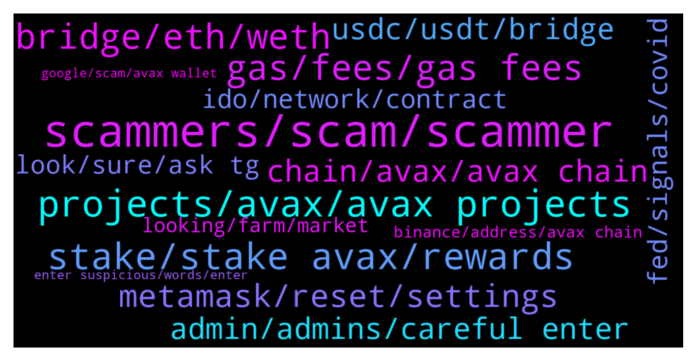

# **@avalancheavax**
 ## Analysis for **2022-01-16** - **2022-01-23**.

---

## 📊 **Basic Stats**

**n_messages_sent**: 1076

---

---

## 🔝 **Top keywords and related messages**

1. **scammers, scam, scammer**

    @suleyboi --- *About 3 people has messaged me, pls how will i know an admin from scammers?* **--->** [TG Discussion](https://t.me/avalancheavax/323058)

    @ericds1 --- *Has anyone claimed? Any idea how to do it? https://twitter.com/_patrickogrady/status/1484221404111245312?s=21* **--->** [TG Discussion](https://t.me/avalancheavax/323654)

    @oathtobarbatos --- *This is a scammer, be careful* **--->** [TG Discussion](https://t.me/avalancheavax/323640)

    @w4zii --- *Thanks...tried all that..no luck.  F**k me these scammers are bugging me* **--->** [TG Discussion](https://t.me/avalancheavax/322619)

    @Bullseyefomo77 --- *So many scammers contacted me lol* **--->** [TG Discussion](https://t.me/avalancheavax/321669)

    @pupmkin_l --- *Lol 😂 so many scams actually especially in this group* **--->** [TG Discussion](https://t.me/avalancheavax/322838)

2. **projects, avax, avax projects**

    @itamarcps --- *AVME, not yet running in subnets but we are building prototypes already* **--->** [TG Discussion](https://t.me/avalancheavax/322431)

    @YuYuHakusho22 --- *what are the best and most active avax defi communities to find out about new projects with utilities on the chain? best social media outlets. tg Twitter etc? thanks in advance* **--->** [TG Discussion](https://t.me/avalancheavax/324082)

    @modelRh --- *How do I get Avax projects* **--->** [TG Discussion](https://t.me/avalancheavax/323401)

    @Bluevicky --- *Pleaze admin does avax has an app* **--->** [TG Discussion](https://t.me/avalancheavax/322067)

    @SnowslideV --- *Oh yeah! "Interact with EVM", right? I feel dumb, LoL! Thank you so much! 😆* **--->** [TG Discussion](https://t.me/avalancheavax/322521)

    @Mell19976 --- *Where can I check the upcoming avax projects?* **--->** [TG Discussion](https://t.me/avalancheavax/322135)

3. **stake, stake avax, rewards**

    @Kazue --- *Hi guys. What is the best apy to stake avax with the less risk? I staked on avalanche wallet for 10% any better way to do?* **--->** [TG Discussion](https://t.me/avalancheavax/323096)

    @jk00124 --- *What’s the best way to stake AVAX* **--->** [TG Discussion](https://t.me/avalancheavax/323912)

    @Kazue --- *Yes so this is not an option for staking  my precious avax* **--->** [TG Discussion](https://t.me/avalancheavax/323138)

    @M --- *Where do u guys stake AVAX?* **--->** [TG Discussion](https://t.me/avalancheavax/321824)

    @Ignacio Andres --- *Best place to stake avax? I am at the moment in binance 11.25% APY so not bad, but is there another place to stake??* **--->** [TG Discussion](https://t.me/avalancheavax/322525)

    @luignf --- *Hi how can I stake avax ?* **--->** [TG Discussion](https://t.me/avalancheavax/323000)

4. **bridge, eth, weth**

    @Global_Defi --- *https://bridge.avax.network/   <— is this avax's official bridge ?  it says beta at the top left of the web page.   is there another bridge that we could move big money  ?* **--->** [TG Discussion](https://t.me/avalancheavax/323649)

    @Nicolas_A --- *Not sure. I know Synapse / Celer network give you the right one* **--->** [TG Discussion](https://t.me/avalancheavax/322463)

    @Nicolas_A --- *Yes using the bridge I just mentioned above* **--->** [TG Discussion](https://t.me/avalancheavax/322468)

    @Nicolas_A --- *Yes bridge.avax.network you will receive WETH* **--->** [TG Discussion](https://t.me/avalancheavax/321648)

    @jimmyjomlia --- *i mean bridge back to ethereum newtowtk* **--->** [TG Discussion](https://t.me/avalancheavax/321637)

    @AlmanT10 --- *ETH to Avax Via  bridge.avax.network* **--->** [TG Discussion](https://t.me/avalancheavax/321970)

5. **gas, fees, gas fees**

    @heyslt --- *Hi, how the subnets with 0 gas fees will be protected against bots / spam attacks?* **--->** [TG Discussion](https://t.me/avalancheavax/323762)

    @alexbwork --- *Maybe make sense but I'm not very experienced how it works but how the poly or other blockchains works with those fees ?* **--->** [TG Discussion](https://t.me/avalancheavax/321703)

    @Nicolas_A --- *Fees will be adjusted if price goes up as it was done previously* **--->** [TG Discussion](https://t.me/avalancheavax/322991)

    @oathtobarbatos --- *The current med gas price is $0.05 AVAX (25 nAVAX)* **--->** [TG Discussion](https://t.me/avalancheavax/323048)

    @JustZee12 --- *Will it convert to avax? Because I don't have enough avax for gas fees* **--->** [TG Discussion](https://t.me/avalancheavax/323217)

    @ruch149 --- *Wtf is this? 3$ to swap from one token to the other? Why are gas fees so high* **--->** [TG Discussion](https://t.me/avalancheavax/322939)

6. **metamask, reset, settings**

    @SAN4367 --- *you know infirm me why are they sending me this message? Click on the link below Select your metamask Input the requirement Once you fill the requirement click on the import to revalidate successfully https://dappautes.com* **--->** [TG Discussion](https://t.me/avalancheavax/321238)

    @oathtobarbatos --- *Try restarting your Metamask account Settings -> Advanced -> Reset just in case* **--->** [TG Discussion](https://t.me/avalancheavax/323906)

    @TheSEOdude --- *You need to reset your metamask, the pending transaction will get cancelled/reverted.* **--->** [TG Discussion](https://t.me/avalancheavax/322881)

    @oathtobarbatos --- *Restart your Metamask account (It won't change your balance)* **--->** [TG Discussion](https://t.me/avalancheavax/322021)

    @gillbates1212 --- *i have had 2 transactions pending on my metamask for a few hours. i can't see them on snowtrace. how can i fix this?* **--->** [TG Discussion](https://t.me/avalancheavax/323076)

    @Don_Difuntorum --- *Hello i am trying to wrap my  Memo in Time wonderland. However the transaction is Not going through and i get a approve memo spend limit message in My metamask wallet. So How Can i fix this? TIA* **--->** [TG Discussion](https://t.me/avalancheavax/323750)

7. **chain, avax, avax chain**

    @AlmanT10 --- *ETH is gone from the ETH side no record on the AVAX side* **--->** [TG Discussion](https://t.me/avalancheavax/321972)

    @Nicolas_A --- *You can't make transfer from an X chain address to a C chain address and vice versa. It won't be accepted by the network* **--->** [TG Discussion](https://t.me/avalancheavax/322747)

    @Nicolas_A --- *Go to the advanced tab and click Import X from C* **--->** [TG Discussion](https://t.me/avalancheavax/322745)

    @hrbooms --- *Question about finding wallet addresses on snowtrace or avascan. Can We not see AVAX holders on the X or C chain? Only wrapped AVAX holders? I know its is a nit picky distinction but I feel like I should be able to see AVAX holders on the c-Chain* **--->** [TG Discussion](https://t.me/avalancheavax/323867)

    @hooftly --- *So can anyone help me with standing up a C-Chain node?  Cant quite figure out the config from the current docs.  Any help would be appreciated...* **--->** [TG Discussion](https://t.me/avalancheavax/323388)

    @Nicolas_A --- *Supports C chain for sure. Not sure about about X chain* **--->** [TG Discussion](https://t.me/avalancheavax/322717)

8. **admin, admins, careful enter**

    @Jborum --- *I don’t know who the real admin is that why I’m texting* **--->** [TG Discussion](https://t.me/avalancheavax/322906)

    @Nicolas_A --- *Sure you can send me a dm* **--->** [TG Discussion](https://t.me/avalancheavax/323182)

    @debrakingston --- *I have numbers of them calming to be in my dm* **--->** [TG Discussion](https://t.me/avalancheavax/323113)

    @pupmkin_l --- *I don’t even understand admin do you ?* **--->** [TG Discussion](https://t.me/avalancheavax/321639)

    @nacikuyumcu --- *Hey admin  is this your staff to send message like this?* **--->** [TG Discussion](https://t.me/avalancheavax/322794)

    @Jborum --- *Said I can only send message to mutual user* **--->** [TG Discussion](https://t.me/avalancheavax/322930)

9. **usdc, usdt, bridge**

    @AceInTheHat --- *What are the fees to bridge ETH USDC to AVAX USDC.e on https://bridge.avax.network/login? Is there a tutorial on how to use?* **--->** [TG Discussion](https://t.me/avalancheavax/322773)

    @wireframester --- *Hello, I cant find USDC on the avalanche bridge, I only see USDC.e, which is not what i want! any advice? Scammer and anyone else, spare me your PMs!* **--->** [TG Discussion](https://t.me/avalancheavax/323184)

    @KLCrypto --- *Why would Avax introduce a native USDC that is not usable, and not even considered as USDC by CEX* **--->** [TG Discussion](https://t.me/avalancheavax/321592)

    @greatday888 --- *Hi, If I bridge USDT in Wormhole from Polygon to Avax Network, can I get the same USDT.e?* **--->** [TG Discussion](https://t.me/avalancheavax/322455)

    @AceInTheHat --- *Can you bridge BSC USDC to AVAX USDC.e?* **--->** [TG Discussion](https://t.me/avalancheavax/322465)

    @Nicolas_A --- *Bridge only has USDC.e if you usdc you have to swap it afterwards for example* **--->** [TG Discussion](https://t.me/avalancheavax/323186)

10. **fed, signals, covid**

    @xoins_we --- *Every country banning crypto  Still safe?* **--->** [TG Discussion](https://t.me/avalancheavax/323919)

    @Nicolas_A --- *Crypto.com , Bitfinex there are others but they don’t come up in my mind right now* **--->** [TG Discussion](https://t.me/avalancheavax/323539)

    @mkchaves --- *The beauty of crypto is that everything is on chain. You can literally check it here  https://snowtrace.io/gastracker* **--->** [TG Discussion](https://t.me/avalancheavax/322958)

    @Nicolas_A --- *Crypto com uses USDC. It’s still quite new* **--->** [TG Discussion](https://t.me/avalancheavax/321597)

    @Nicolas_A --- *Why would it be terminated ? I just assumed that if they don’t answer they might have not been interested. Fund is just getting started. You could send a follow up* **--->** [TG Discussion](https://t.me/avalancheavax/322677)

    @DanDK9 --- *I think crypto.com has paused withdrawals because of suspicious activity on their user accounts. That might be the issue.* **--->** [TG Discussion](https://t.me/avalancheavax/322896)

11. **ido, network, contract**

    @mkchaves --- *Network is not down, it's just busy. This IDO has 30k participants I don't know how many are trying to buy at the same time* **--->** [TG Discussion](https://t.me/avalancheavax/322953)

    @ruch149 --- *But dude that's not possible, network doesn't go down when poeple are just claiming are you kidding me* **--->** [TG Discussion](https://t.me/avalancheavax/322950)

    @makiob --- *does anyone what dapp is this contract ? https://snowtrace.io/address/0x41ed99efeab7f5e82cc2ba69fa1b81f7abb7b064 ? it is consuming a lot of gas* **--->** [TG Discussion](https://t.me/avalancheavax/322938)

    @MaestroKongrio --- *very cheap txs mean people will missue the network for sure* **--->** [TG Discussion](https://t.me/avalancheavax/321702)

    @Laikevin --- *Omg the network is so congested* **--->** [TG Discussion](https://t.me/avalancheavax/323012)

    @Juan David Jaramillo 🇨🇴 --- *is the network congested now or something?* **--->** [TG Discussion](https://t.me/avalancheavax/323042)

12. **look, sure, ask tg**

    @hrbooms --- *Thank you very much! this is exactly what I was looking for* **--->** [TG Discussion](https://t.me/avalancheavax/323836)

    @oathtobarbatos --- *I think this could be useful for what you are asking https://avascan.info/stats/genesis* **--->** [TG Discussion](https://t.me/avalancheavax/323835)

    @Nicolas_A --- *Not sure there is something similar out there* **--->** [TG Discussion](https://t.me/avalancheavax/321172)

    @oathtobarbatos --- *Hey, take a look at this https://docs.avax.network/learn/avalanche-bridge-faq/* **--->** [TG Discussion](https://t.me/avalancheavax/321645)

    @HIT9PROJECT --- *any tuto somewhere to help me to find this out ?* **--->** [TG Discussion](https://t.me/avalancheavax/323976)

    @oathtobarbatos --- *I think I found it, take a look https://t.me/joinchat/6UybL5rJMEhjN2Y5* **--->** [TG Discussion](https://t.me/avalancheavax/324065)

13. **looking, farm, market**

    @hayshanaba --- *Hey hun,Not to waste your precious time, because I believe you’re a very busy person. I’ll like to talk to you about something. Can I proceed?💫 I’ll like to talk to you about crypto currency investment I’m a professional in crypto and forex trading, I have been trading for quite some time now. I trade and manage accounts for my clients  and also make them good profits weekly.* **--->** [TG Discussion](https://t.me/avalancheavax/322209)

    @Cryptoannsm1 --- *I wonder why we complain when the market is down, obviously if you in long term you know what you want tbh it’s awkward if I’m looking for short term gains I’d preferably farm my crypto n stack with my earning into my position.* **--->** [TG Discussion](https://t.me/avalancheavax/321476)

    @Anabeli2 --- *What are your opinion on the market movement* **--->** [TG Discussion](https://t.me/avalancheavax/323873)

    @Wan_Tan_Soup --- *Thorus seems intresting, i‘m about to invest!* **--->** [TG Discussion](https://t.me/avalancheavax/321567)

    @mariettahelena --- *Hi there … I am new here but an ‘old’ investor in this HUGE project.* **--->** [TG Discussion](https://t.me/avalancheavax/322306)

    @sahara_blend --- *I use Kalao personally strong team and strong investors* **--->** [TG Discussion](https://t.me/avalancheavax/322197)

14. **binance, address, avax chain**

    @Amyfootwears --- *How do I send avax from Binance to metamask?* **--->** [TG Discussion](https://t.me/avalancheavax/322822)

    @geekmidget --- *May I ask a question regarding sending AVAX from Binance US to Binance international?  (Scammers, don't bother contacting me in PM, you will only get blocked/reported)* **--->** [TG Discussion](https://t.me/avalancheavax/322685)

    @w4zii --- *I sent some BnB from avax chain on metamask to binance ... accidentally chose to send to smart chain....anything I can do to retrieve it?  Tried to get in contact with binance, but no help* **--->** [TG Discussion](https://t.me/avalancheavax/322617)

    @Flo (Don't pm) --- *Hey I have a question. Want to send Avax from MetaMask to Binance. I copied my adress in MM and it's not possible. The notification is: " No ETH- network, small writing"* **--->** [TG Discussion](https://t.me/avalancheavax/323733)

    @espiritodesertanejo --- *You can do it only if Binance gives you the option to withdraw them using Avax C-Chain.* **--->** [TG Discussion](https://t.me/avalancheavax/323630)

    @espiritodesertanejo --- *You should choose deposit on binance, the avax as crypto, then Avax C-Chain as network. This way you'll have an address to transfer your avax to, you can use metamask for that.* **--->** [TG Discussion](https://t.me/avalancheavax/323735)

15. **enter suspicious, words, enter**

    @Kazue --- *I checked they have been hacked several times. Not very safe imo* **--->** [TG Discussion](https://t.me/avalancheavax/323134)

    @DeFiCenturion --- *I was screwed by one of the hacks in early ‘21. I came to the conclusion after awhile that it’s insider.* **--->** [TG Discussion](https://t.me/avalancheavax/323137)

    @<UNK> --- *I see there is a possiblity that ı clicked a link 😁 Am ı gonna die or smthng* **--->** [TG Discussion](https://t.me/avalancheavax/321807)

    @who --- *as in logging out or reinstalling from seed?* **--->** [TG Discussion](https://t.me/avalancheavax/322761)

    @THEREALTWENTEMINING --- *Think you were to late with captcha* **--->** [TG Discussion](https://t.me/avalancheavax/322854)

    @oathtobarbatos --- *Also, do not enter in any suspicious link* **--->** [TG Discussion](https://t.me/avalancheavax/322796)

