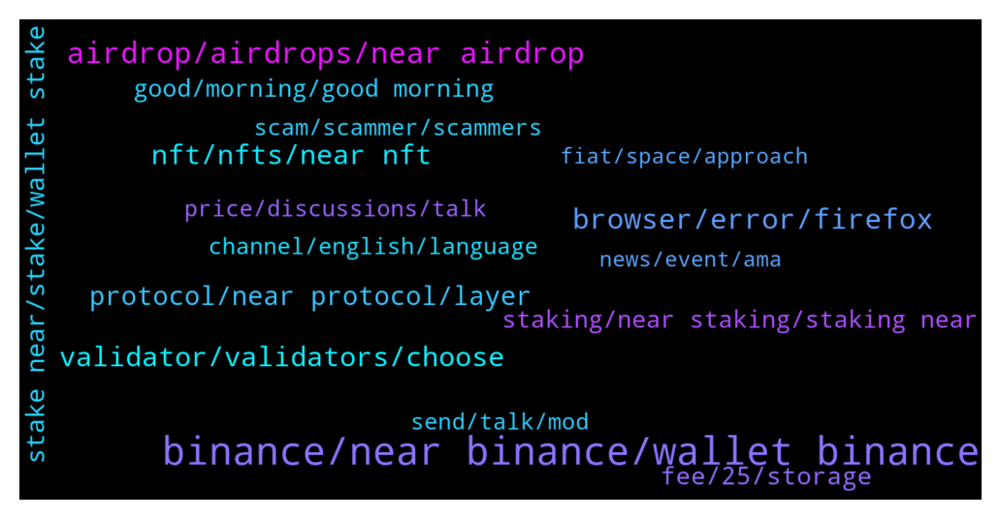

# **@cryptonear**
 ## Analysis for **2022-01-16** - **2022-01-23**.

---

## 📊 **Basic Stats**

**n_messages_sent**: 5022

---

---

## 🔝 **Top keywords and related messages**

1. **binance, near binance, wallet binance**

    @MayorKillah --- *Guys I bought some Near on Binance but didn’t allow me to send them to Near Wallet (suspended network). Any tip on where to buy/move easily ?* **--->** [TG Discussion](https://t.me/cryptonear/287207)

    @kv9990 --- *Wow Binance US lists NEAR Protocol! It's definitely huge!!  https://support.binance.us/hc/en-us/articles/4419537277847-Binance-US-Will-List-NEAR-Protocol-NEAR-Deposits-Now-Open* **--->** [TG Discussion](https://t.me/cryptonear/291673)

    @masstahcoiner --- *don't have bank anymore, don't have $ on acc anymore  money is scam   ALL IN near wallet and on shitty centralized binance    must withdraw all to privat wallet* **--->** [TG Discussion](https://t.me/cryptonear/284505)

    @kv9990 --- *Deposit it to 64 digits deposit address from binance/kucoin on "NEAR NETWORK" only!* **--->** [TG Discussion](https://t.me/cryptonear/284980)

    @PlatypusPunk --- *Now Near is suspended on Binance why* **--->** [TG Discussion](https://t.me/cryptonear/282295)

    @WallsOflife --- *I bought near on Binance. How do I transfer to near Wallet to stake ? I don’t have a wallet yet .* **--->** [TG Discussion](https://t.me/cryptonear/292353)

2. **airdrop, airdrops, near airdrop**

    @iamkemoo --- *I know a trick:  You create a Testnet wallet and then you go to https://testnet.burrow.cash/portfolio (Near Testnet) and test the DApp. With a little luck you get Airdroped some $BRRR when they go live. Then you swap those to $NEAR and et voila..* **--->** [TG Discussion](https://t.me/cryptonear/284794)

    @bailey_12 --- *Hey gangz,  This is a little side project of mine. If you looking for some quality time, and maybe wining some airdrop. Do not miss this  https://twitter.com/BaileyVu12/status/1484084138240245762* **--->** [TG Discussion](https://t.me/cryptonear/294553)

    @noval_2233 --- *Is NEAR doing an airdop ? cause i found one* **--->** [TG Discussion](https://t.me/cryptonear/285842)

    @JAbioye1 --- *Hey guys quick one, does staking with a validator give me acces to airdrops?* **--->** [TG Discussion](https://t.me/cryptonear/290863)

    @jeditobe --- *could you tell me pleas are the any real or active airdrops of NEAR?* **--->** [TG Discussion](https://t.me/cryptonear/281009)

    @tundeajibulu --- *Are you guys running any Airdrop now, because I'm seeing near AIRDROP* **--->** [TG Discussion](https://t.me/cryptonear/296164)

3. **browser, error, firefox**

    @rupesh2025 --- *Hi Bailey, getting this error when I am trying to start the Node. Kindly check.* **--->** [TG Discussion](https://t.me/cryptonear/282240)

    @KO888 --- *it seems open first then comes up white page,my friend told me the same* **--->** [TG Discussion](https://t.me/cryptonear/288789)

    @TheGo1denBull --- *Try a different device? Are you using laptop or phone?* **--->** [TG Discussion](https://t.me/cryptonear/291316)

    @rahulgoel007 --- *Can you please try firefox once.* **--->** [TG Discussion](https://t.me/cryptonear/295442)

    @salihkite --- *ok, i will go with browser one too, it looks clean* **--->** [TG Discussion](https://t.me/cryptonear/292543)

    @Ann03948 --- *Everything goes fine in my page* **--->** [TG Discussion](https://t.me/cryptonear/289254)

4. **nft, nfts, near nft**

    @iamkemoo --- *There are still Tiger NFTs left from the Near Tiger Academy: https://neartiger.academy/* **--->** [TG Discussion](https://t.me/cryptonear/284353)

    @vsx007 --- *@TheGo1denBull I like the expensive NFT in your profile btw ☺️* **--->** [TG Discussion](https://t.me/cryptonear/284700)

    @vsx007 --- *I would love to have my own NFT store on near* **--->** [TG Discussion](https://t.me/cryptonear/284746)

    @cryptomidas6 --- *I dont have experience in nfts* **--->** [TG Discussion](https://t.me/cryptonear/283418)

    @oppzsmoKe --- *Is there any NFTs On NEAR* **--->** [TG Discussion](https://t.me/cryptonear/293803)

    @Attaulhadisindhu --- *I mistakenly bought a stolen NFT with ur tip on paras 🙈🙈* **--->** [TG Discussion](https://t.me/cryptonear/291685)

5. **validator, validators, choose**

    @a1sunny --- *Whats is ment by 100% fee or 5% or 10% of validator? + In how much time we see rewards of staking.   I stake my Near to a validator 100% and it has been 3 to 4 days i rewards balance is 0* **--->** [TG Discussion](https://t.me/cryptonear/291241)

    @rahulgoel007 --- *You can choose that validator who are active and have a low unstaking fee. We have a smart, astro validator which have a fee of 1%( just an example). You can check the list of validators here: https://wallet.near.org/staking/validators* **--->** [TG Discussion](https://t.me/cryptonear/282195)

    @masstahcoiner --- *why validator is inactive and what means that for staking active?   1.3k people staking there in this validator?* **--->** [TG Discussion](https://t.me/cryptonear/289342)

    @kv9990 --- *Check if it's a active validator from https://near-staking.com/ and choose the ones with low fees :)* **--->** [TG Discussion](https://t.me/cryptonear/290675)

    @cryptoheitzii --- *What I have to do as a validator?* **--->** [TG Discussion](https://t.me/cryptonear/286171)

    @Hnefatafl --- *Where can i find legal recommended NEAR validators?* **--->** [TG Discussion](https://t.me/cryptonear/282739)

6. **protocol, near protocol, layer**

    @iamkemoo --- *but take care that you choose the right network, only send to "Near Protocol" network* **--->** [TG Discussion](https://t.me/cryptonear/285373)

    @rahulgoel007 --- *Check the roadmap to get more idea about the goal  Protocol Development Roadmap-- :- https://gov.near.org/t/protocol-development-roadmap/2903?u=hiimhuyhai* **--->** [TG Discussion](https://t.me/cryptonear/295003)

    @Dadastev --- *Pls I want to import near protocol to my meta mask how I’m I gonna do that pls admin* **--->** [TG Discussion](https://t.me/cryptonear/287329)

    @norshia --- *whats the best way to get into try near protocol from polygon?* **--->** [TG Discussion](https://t.me/cryptonear/287141)

    @honesty_is_my_bio --- *So Near protocol minimizes the transaction fees rather than common fees charged on etherium blockchain network right?* **--->** [TG Discussion](https://t.me/cryptonear/282633)

    @CryptoBloc365 --- *Hello is any private feature will be available on the near network like Zk-Snark?* **--->** [TG Discussion](https://t.me/cryptonear/286769)

7. **stake near, stake, wallet stake**

    @rahulgoel007 --- *You can stake via metapool or near wallet Check below links https://t.me/cryptonear/289255* **--->** [TG Discussion](https://t.me/cryptonear/295482)

    @MoioMoon --- *How do I stake? Newbie to crypto. (Scammers, dont dm me)* **--->** [TG Discussion](https://t.me/cryptonear/293735)

    @Please Dont --- *Keep getting this error when trying to stake my Near. Can't see a minimum anywhere so I don't get why it isn't working* **--->** [TG Discussion](https://t.me/cryptonear/289861)

    @Taurus990 --- *Where can i stake my NEAR ?* **--->** [TG Discussion](https://t.me/cryptonear/295481)

    @Mehdislyy --- *If i stake 1 near can i buy 15near jumbo?* **--->** [TG Discussion](https://t.me/cryptonear/282433)

    @Shnc88 --- *Where are you guys staking your near?* **--->** [TG Discussion](https://t.me/cryptonear/284034)

8. **fee, 25, storage**

    @Taurus990 --- *So it’s gonna be deducted from my account ? And wdym storage ?* **--->** [TG Discussion](https://t.me/cryptonear/281078)

    @baniagui --- *Thanks. The fee is just too high. 😅* **--->** [TG Discussion](https://t.me/cryptonear/288294)

    @Aflatoon123 --- *Not at all true😅 Fees has a different issue.  And its so bad.* **--->** [TG Discussion](https://t.me/cryptonear/285521)

    @bailey_12 --- *use the ones with 9% fee since 100% fee is a private ones* **--->** [TG Discussion](https://t.me/cryptonear/286754)

    @larry_lang --- *nope, it's giving the site permission to spend up to 0.25, but it wont charge 0.25N* **--->** [TG Discussion](https://t.me/cryptonear/283290)

    @a1sunny --- *Ops... Instead of earning.🙈   When i connecting my wallet to this website they charging me 0.25 Near as a networkfee...* **--->** [TG Discussion](https://t.me/cryptonear/284223)

9. **staking, near staking, staking near**

    @Please Dont --- *I'm staking so much crypto it's hard to keep track 😵* **--->** [TG Discussion](https://t.me/cryptonear/289652)

    @a1sunny --- *Any minimum or maximum quantity and date for staking? When will be we get awards/meta* **--->** [TG Discussion](https://t.me/cryptonear/284142)

    @Diederiek --- *Hey, hope you re OK. I have a question. I can accès my near wallet again since yesterday, but the balance still ain't ok. I mean 17 January I deposited NEAR from binance into my wallet, this I can see in recent activity, then I staked the amount with a validator (same day), but I cannot see these in staking panel. Instead when I go to near-staking.com I find them there (with my other delegated validators) with the rewards accumulated.* **--->** [TG Discussion](https://t.me/cryptonear/291945)

    @iamkemoo --- *[NOW LIVE] Earn More $PARAS by $PARAS & NFT Staking! 🎊  https://twitter.com/ParasHQ/status/1484175987755872257?s=20* **--->** [TG Discussion](https://t.me/cryptonear/293787)

    @Kripto_Raptor --- *but I don't think we can see them on staking tab. maybe they will deliver them upon unstaking request. for further information let's ask https://t.me/auroraisnear* **--->** [TG Discussion](https://t.me/cryptonear/289995)

    @FritzWagner --- *For staking take a look here:  https://medium.com/nearprotocol/a-starters-guide-to-the-near-wallet-and-staking-process-d2c8f3b61f43* **--->** [TG Discussion](https://t.me/cryptonear/286369)

10. **good, morning, good morning**

    @iamkemoo --- *You too partner! I hope your doing well! 🙏* **--->** [TG Discussion](https://t.me/cryptonear/295661)

    @iamkemoo --- *good mate, i hope you too! 🙌* **--->** [TG Discussion](https://t.me/cryptonear/290960)

    @thanano46 --- *I guess it's morning in Vietnam right now* **--->** [TG Discussion](https://t.me/cryptonear/281124)

    @choc0707 --- *How is everything going on today* **--->** [TG Discussion](https://t.me/cryptonear/294649)

    @TheGo1denBull --- *Good night guys. Time to get more rest to fight this virus* **--->** [TG Discussion](https://t.me/cryptonear/281160)

    @FritzWagner --- *Good morning chief, just passing by. ✌* **--->** [TG Discussion](https://t.me/cryptonear/281616)

11. **send, talk, mod**

    @kv9990 --- *Yeah :) Dm me if need help with that* **--->** [TG Discussion](https://t.me/cryptonear/294975)

    @mv_the_realone --- *I can dm you and send details* **--->** [TG Discussion](https://t.me/cryptonear/285543)

    @NearFritz --- *Thanks you can DM me, let's talk it privately.* **--->** [TG Discussion](https://t.me/cryptonear/293932)

    @iamkemoo --- *yeah you can DM one of us @larry_lang* **--->** [TG Discussion](https://t.me/cryptonear/285549)

    @larry_lang --- *i though u have send a DM to @Kripto_Raptor* **--->** [TG Discussion](https://t.me/cryptonear/284210)

    @iamkemoo --- *send me a DM please i will look into* **--->** [TG Discussion](https://t.me/cryptonear/291182)

12. **scam, scammer, scammers**

    @cuongdcc --- *guys, this is scam group, please beware and report: https://t.me/NearProtoc0l* **--->** [TG Discussion](https://t.me/cryptonear/283399)

    @JC --- *Its clean here, no scammer texting me after joining* **--->** [TG Discussion](https://t.me/cryptonear/294376)

    @joelsf --- *be carefull there is a scammer on this group trying to steal wallets: "FritzWagner "* **--->** [TG Discussion](https://t.me/cryptonear/286366)

    @larry_lang --- *i think, it look like scam, currently, we dont have any* **--->** [TG Discussion](https://t.me/cryptonear/296169)

    @RYTHM_ISMYGOAL --- *Attention.    Attention  This ID 👇👇👇 @Near_protocol1 👆👆👆  Is a Scammer* **--->** [TG Discussion](https://t.me/cryptonear/295078)

    @SultanOfStock --- *guys be careful @cryotodev appears to be scammer* **--->** [TG Discussion](https://t.me/cryptonear/282668)

13. **channel, english, language**

    @stay_hungry --- *Hello. Do you have Japanese chat?* **--->** [TG Discussion](https://t.me/cryptonear/283867)

    @fire_d_legend --- *I don't know English bro thatsby I used Google translator* **--->** [TG Discussion](https://t.me/cryptonear/285988)

    @larry_lang --- *lol cult alike channel huh.... red flag* **--->** [TG Discussion](https://t.me/cryptonear/283301)

    @onequestion_1 --- *Could you give me a link on near anouncment channels* **--->** [TG Discussion](https://t.me/cryptonear/284217)

    @zenkert --- *Is that translated from Boogle? I really don't understand at all.* **--->** [TG Discussion](https://t.me/cryptonear/285987)

    @happyeveryday2368 --- *what do u mean by soga 😆* **--->** [TG Discussion](https://t.me/cryptonear/293238)

14. **price, discussions, talk**

    @TheGo1denBull --- *You can have price discussions here https://t.me/merchantsofnear* **--->** [TG Discussion](https://t.me/cryptonear/291466)

    @Kripto_Raptor --- *and please use https://t.me/merchantsofnear or https://t.me/nearforce for price discussions 😍* **--->** [TG Discussion](https://t.me/cryptonear/289853)

    @iamkemoo --- *Zoom out. But let's not talk about prices here please. Thx* **--->** [TG Discussion](https://t.me/cryptonear/280796)

    @Kripto_Raptor --- *i think we already told you many times that we dont talk about the price here. please respect the community rules 😉* **--->** [TG Discussion](https://t.me/cryptonear/286615)

    @TheGo1denBull --- *Any price talk...any 10x ect is forbidden* **--->** [TG Discussion](https://t.me/cryptonear/291494)

    @iamkemoo --- *Hey mate, please move price related dicussions to our unofficial price chat https://t.me/merchantsofnear thank you 🙏* **--->** [TG Discussion](https://t.me/cryptonear/293711)

15. **fiat, space, approach**

    @kimeez01 --- *I've only been in crypto for a year. One thing I have learned is that prices fluctuate. What does not fluctuate is the quality. Good things come to those who wait!* **--->** [TG Discussion](https://t.me/cryptonear/281010)

    @masstahcoiner --- *just a chat about new world order with crypto blockchain and ecosystem* **--->** [TG Discussion](https://t.me/cryptonear/295072)

    @sanjukesi --- *🇮🇳 India’s Prime Minister calls for uniform approach to crypto regulation👍  Prime Minister Narendra Modi urged other countries to come up with a uniform approach to regulating cryptocurrencies while speaking via videoconference at the World Economic Forum's Davos Agenda event earlier this Monday✈️* **--->** [TG Discussion](https://t.me/cryptonear/290265)

    @Taurus990 --- *Sorry i am new to crypto and I’m going to asks lots of questions, just gotta understand the basics I’ll do my own research later* **--->** [TG Discussion](https://t.me/cryptonear/291416)

    @JonD26 --- *I haven't. i'll take a look. Sorry but i approach anything in the crypto space with distrust until proven otherwise.* **--->** [TG Discussion](https://t.me/cryptonear/287879)

    @JC --- *I just join crypto end Dec, i thought it was a good time.. should have hold longer* **--->** [TG Discussion](https://t.me/cryptonear/294379)

