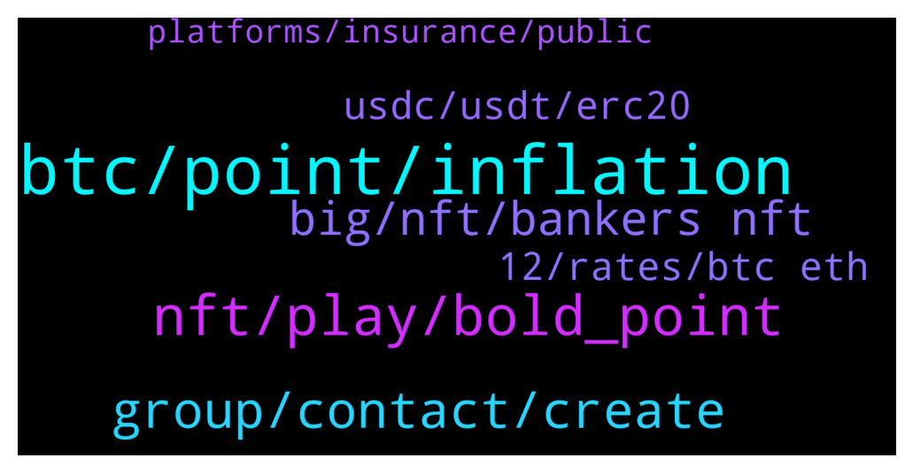

# **@de_fi**
 ## Analysis for **2022-01-16** - **2022-01-23**.

---

## 📊 **Basic Stats**

**n_messages_sent**: 159

---

---

## 🔝 **Top keywords and related messages**

1. **btc, point, inflation**

    @polnyrazyob --- *Can someone explain what is happening with market? I’m holding from 2021 January, I invested 2k in 10 different coins, I have only made 100$ from ETH everything else is like 60% loss.. after a year of holding how come NOTHING has grown* **--->** [TG Discussion](https://t.me/de_fi/233766)

    @MarioOz1 --- *How can I buy if I don't have money to buy anymore 😁* **--->** [TG Discussion](https://t.me/de_fi/234244)

    @Nader --- *How Many Think That BTC Will Hit $100k This Year? 🤔* **--->** [TG Discussion](https://t.me/de_fi/233913)

    @SamAlgo1 --- *Selling what? Bitcoin? I'm never selling my bitcoin. No matter what, just accumulate more.* **--->** [TG Discussion](https://t.me/de_fi/234243)

    @SamAlgo1 --- *It would be green next week but we need to retest 40k then 53k and finally new ATH.* **--->** [TG Discussion](https://t.me/de_fi/234241)

    @Mark --- *Buy BTC and wait for 100KUSD this year😂* **--->** [TG Discussion](https://t.me/de_fi/233938)

2. **nft, play, bold_point**

    @Bernard --- *Heyya! Looking for NFT games to play. Got any suggestions?* **--->** [TG Discussion](https://t.me/de_fi/234169)

    @Bernard --- *Ohhh. Sounds fun. Where do I play it?* **--->** [TG Discussion](https://t.me/de_fi/234173)

    @voyker997 --- *i think each one is tired of p2e card games now and projects like NFT Craft, with completely different mechanics, will be in the spotlight!* **--->** [TG Discussion](https://t.me/de_fi/235070)

    @never_sold_a_decimal --- *Hey guys is it ok to share a project I’ve come across* **--->** [TG Discussion](https://t.me/de_fi/233991)

    @CryptoSwimmerX --- *Hmmm, it is also a play2earn game which is very nice! Haha* **--->** [TG Discussion](https://t.me/de_fi/233686)

    @CryptoSwimmerX --- *It has multiple tournaments where u can win pool prizes* **--->** [TG Discussion](https://t.me/de_fi/233687)

3. **group, contact, create**

    @dereksilva --- *Did you try visiting the company’s website?  https://www.superhi.com/about* **--->** [TG Discussion](https://t.me/de_fi/234879)

    @<UNK> --- *Hello, who can I contact for marketing proposal?* **--->** [TG Discussion](https://t.me/de_fi/234462)

    @<UNK> --- *Hello owner/admins, please i need a response on this🌹, I am a promoter of crypto and NFT, i would like to offer you my services, would you like to see my prices and promote your coin with me? Waiting your response !* **--->** [TG Discussion](https://t.me/de_fi/234432)

    @vanilla_ic --- *Hi Lisa, this group openly resists and refuses to obey.* **--->** [TG Discussion](https://t.me/de_fi/234019)

    @RicchCrypto --- *Is there an admin to contact for AMA sessions* **--->** [TG Discussion](https://t.me/de_fi/233942)

    @dereksilva --- *This is a volunteer driven, general purpose group. There’s no product or service to promote.* **--->** [TG Discussion](https://t.me/de_fi/234433)

4. **big, nft, bankers nft**

    @joshperry123 --- *Don’t miss your chance of getting these perks that come with a “Bankers NFT”. Get your own “Bankers NFT” now! Join the drop which is happening on January 31.  Check here: https://lnkd.in/gxdrY9nq  Get more details on “Bankers NFT” by checking the Unbanked website at https://lnkd.in/g-wYx7Xy  #Unbanked #BankersNFT #NFT #Defi #Crypto #Blockchain* **--->** [TG Discussion](https://t.me/de_fi/234484)

    @xjaffex --- *https://form.typeform.com/to/ijGaZq4D could people please help me out with some user research 😀 just collecting data on people’s thoughts on Perp Swaps - will do a raffle to compensate best responses, only takes 3 minutes* **--->** [TG Discussion](https://t.me/de_fi/233990)

    @antonvu97 --- *I, i have found a Hybrid Exchange, which don't require KYC, and will have Lauchpad and NFT soon.   You can check on: https://trustkeys.exchange/* **--->** [TG Discussion](https://t.me/de_fi/233839)

    @PierreKabet --- *Hi guys, I just found an early NFT project with real utility, owning one of their NFTs gives you access to a community of experienced traders. I think there is a big potential, what do you think?  I'll leave you the discord link so you can check it out https://discord.gg/u4NyfZKHme* **--->** [TG Discussion](https://t.me/de_fi/234274)

    @liamconward --- *ioen is a strong project. they already made countless partnerships with big capital ventures out there* **--->** [TG Discussion](https://t.me/de_fi/234499)

    @bitergosum --- *defi security token, bond stocks on Bitcoin ,  rsk RGB amp blockstream, mintlayer, which projects do you find interesting?  do you think they can be successful?  you know other projects to keep an eye on* **--->** [TG Discussion](https://t.me/de_fi/234375)

5. **usdc, usdt, erc20**

    @xnatasx --- *Yeah, don't think it has to do with gas, but liquidity.* **--->** [TG Discussion](https://t.me/de_fi/233962)

    @xnatasx --- *Oh, no. I talked about how Strike utilize usdt  https://twitter.com/jackmallers/status/1480964599768059905* **--->** [TG Discussion](https://t.me/de_fi/233968)

    @dereksilva --- *The token contract is the only thing that matters there, right? USDC supposedly has gasless transfers, but the wallet app also has to support it.* **--->** [TG Discussion](https://t.me/de_fi/233964)

    @xnatasx --- *USDC seems safer than usdt. But lower volume.* **--->** [TG Discussion](https://t.me/de_fi/233954)

    @xnatasx --- *Why? Gas optimization? I don't think send erc20 though* **--->** [TG Discussion](https://t.me/de_fi/233959)

    @rocket_fuel --- *i guess so, but apparently its an ERC20.* **--->** [TG Discussion](https://t.me/de_fi/233956)

6. **12, rates, btc eth**

    @MarioOz1 --- *Hodlnaut offer good rates 12.73% for stables. 6.2% for BTC 5.2% for ETH* **--->** [TG Discussion](https://t.me/de_fi/234270)

    @MariaGaller --- *What are the best rates? Which platform?* **--->** [TG Discussion](https://t.me/de_fi/234253)

    @Nader --- *SHO —  Fantom Maker   Fantom Maker is designed to be the strongest yield product on #Fantom blockchain.  Research Page👇 https://t.co/ac946DAEkc  Merit Round👇  Start: 13th of January 12:00 UTC Finish: 14th of January 12:00 UTC Platform Raise: $95,000  Individual Allocation: $200 https://t.co/S8FnWBHmfU* **--->** [TG Discussion](https://t.me/de_fi/233908)

    @dereksilva --- *Has anyone tried Tempus’ fiex rate yield platform yet?  https://app.tempus.finance/* **--->** [TG Discussion](https://t.me/de_fi/234954)

    @LeadMeNow --- *Hodlnaut offer good rates 12.73% for stables. 6.2% for BTC 5.2% for ETH* **--->** [TG Discussion](https://t.me/de_fi/234262)

    @SamAlgo1 --- *Defi rates are ridiculously low for BTC or ETH. In aave, you can get less than 1%* **--->** [TG Discussion](https://t.me/de_fi/234247)

7. **platforms, insurance, public**

    @SamAlgo1 --- *Well, be a holder. It's easy and low risk.* **--->** [TG Discussion](https://t.me/de_fi/234245)

    @mtronfi --- *With no audits, public testing, bug bounty or public access controls, it is hard to evaluate the security and safety of Wonderland. Their in-depth dApp documentation is to be commended, but substantial work needs to be done to get this protocol to the standard the Frog Nation should demand of their ecosystem.  https://www.defisafety.com/pqrs/143* **--->** [TG Discussion](https://t.me/de_fi/234609)

    @MarioOz1 --- *Yeah, in Singapore with all the licenses* **--->** [TG Discussion](https://t.me/de_fi/234267)

    @LeadMeNow --- *Also, you will have an option to buy loss insurance* **--->** [TG Discussion](https://t.me/de_fi/234255)

    @LeadMeNow --- *If you find authorized platforms you will reduce your risk.* **--->** [TG Discussion](https://t.me/de_fi/234254)

    @SamAlgo1 --- *Projects like Nexus Mutual offer insurance for Defi and cefi platforms. They will cover your losses in case of a hack or anything like that. Hodlnaut support this?* **--->** [TG Discussion](https://t.me/de_fi/234263)

