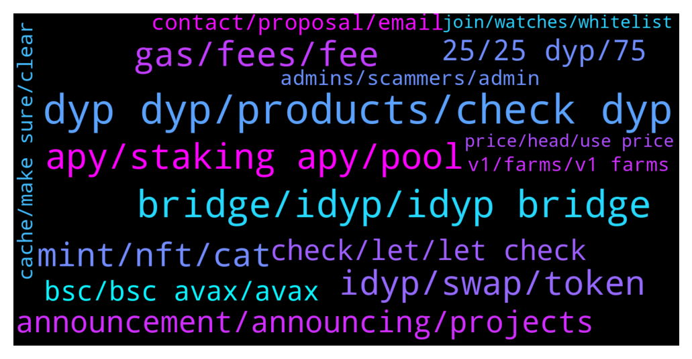

# **@dypfinance**
 ## Analysis for **2022-01-16** - **2022-01-23**.

---

## 📊 **Basic Stats**

**n_messages_sent**: 1144

---

---

## 🔝 **Top keywords and related messages**

1. **dyp dyp, products, check dyp**

    @WatermelonNoia --- *Hey DYP, is a DYP credit card still on the horizon?  I saw this and thought id share:  https://twitter.com/HathorNetwork/status/1480839575190880256?t=Atq8SXuux0NrguIR_9SGHg&s=19* **--->** [TG Discussion](https://t.me/dypfinance/239313)

    @trader_broi --- *Dyp should coduct a meme contest in Twitter... So it will be also a promo* **--->** [TG Discussion](https://t.me/dypfinance/238758)

    @H --- *Is it using to buy dyp only* **--->** [TG Discussion](https://t.me/dypfinance/240170)

    @Drake --- *Is DYP considered a web 3.0 player?  Thanks for the link I'll read it* **--->** [TG Discussion](https://t.me/dypfinance/240357)

    @Richcal --- *guys sorry to ask here, but i cant find any clue about What company behind of dypfinance? or where is the dypfinance registered? is dypfinance is a registered company? if yes, in which country? thank you* **--->** [TG Discussion](https://t.me/dypfinance/241958)

    @CryptoWilliam --- *Have Dyp team thought of implementing IL protection/insurance kinda like thorrune has? I just saw read abit about thorrune and i think thats a supergreat feature that Dyp should deffiently have also* **--->** [TG Discussion](https://t.me/dypfinance/240703)

2. **bridge, idyp, idyp bridge**

    @timdyp --- *We need your vote regarding the #iDYP Bridge Launch. Bellow you will find the #iDYP Bridge proposal details and the reasons why the decision should belong to our community👇 https://gov.dyp.finance/proposals/15* **--->** [TG Discussion](https://t.me/dypfinance/238836)

    @timdyp --- *The #iDYP bridge is LIVE. The Bridge will help you swap iDYP tokens between Ethereum Network, Binance Smart Chain, and Avalanche Network. Please note that the maximum amount that you can swap per wallet every 24 hours is maximum 50,000 iDYP tokens. https://dyp.finance/bridge   ETH V2 Farming Pools APY BEFORE iDYP price rebalance:  No Lock - 405% APY  3 Days - 326% APY 30 Days - 290% APY 60 Days - 372% APY 90 Days - 387% APY  ETH V2 Farming Pools APY AFTER iDYP price rebalance:  No Lock - 1064% APY  3 Days - 850% APY 30 Days - 750% APY 60 Days - 966% APY 90 Days - 1000% APY* **--->** [TG Discussion](https://t.me/dypfinance/241563)

    @timdyp --- *We love to listen to our community so the Governance proposal for the launch of the iDYP Bridge is now available multi-chain for all the users.  Binance Smart Chain Proposal https://gov-bsc.dyp.finance/proposals/7  Ethereum Chain Proposal https://gov.dyp.finance/proposals/15  Avalanche Chain Proposal https://gov-avax.dyp.finance/proposals/3  At the end of the vote, we will sum up all the votes across all the chains. Don't forget, that we need your vote regarding the #iDYP Bridge Launch!* **--->** [TG Discussion](https://t.me/dypfinance/238889)

    @tamtamkanto --- *What are the plans for the bridge if the vote is approved? Will the bridge be available immediately?* **--->** [TG Discussion](https://t.me/dypfinance/238881)

    @Cimmy_revenger --- *Where we can bridge iDYP ? last weeks , I know announcement from twitter DYP about this.* **--->** [TG Discussion](https://t.me/dypfinance/240680)

    @Disguy125 --- *Can't ready for a IDYP pump on the BSC chain boy buy now for a 5x pump with the bridge!!!!!! Coming this week!!!!!!* **--->** [TG Discussion](https://t.me/dypfinance/238355)

3. **apy, staking apy, pool**

    @Disguy125 --- *I'm curious what the apy is adjust to?   Would the team be will to airdrop locked LP wallets compensation to help minaret the 85%IL in iDYP.* **--->** [TG Discussion](https://t.me/dypfinance/239123)

    @Paulus --- *How can i check the APY for DYP in farming?* **--->** [TG Discussion](https://t.me/dypfinance/239687)

    @iamJubi --- *Decrease of the price of tokens involved on the pool, the more users deposit the lesser the APY.* **--->** [TG Discussion](https://t.me/dypfinance/242151)

    @Tryitontriton --- *Well now the APY is so high that the difference can be made up in only about 2 weeks of rewards, and then every day afterwards is exponentially better. So if the rebalance did this to the LP value, it seems to make up for it assuming that the Return Calculator is accurate* **--->** [TG Discussion](https://t.me/dypfinance/241571)

    @shinigamikami --- *You can’t be getting $4 usd daily with the current apy @DhoniMSD516 check his pool too thanks* **--->** [TG Discussion](https://t.me/dypfinance/239021)

    @Disguy125 --- *Imagine the apy went up to 5000% or something lol* **--->** [TG Discussion](https://t.me/dypfinance/239129)

4. **idyp, swap, token**

    @nkemboxoffice --- *Good day admin Pls how do this help the growth of Dyp tokens? It’s alway confusing to me* **--->** [TG Discussion](https://t.me/dypfinance/241564)

    @billybobofficial --- *i mean for my launch of my token , all good was just wondering* **--->** [TG Discussion](https://t.me/dypfinance/239791)

    @error_500 --- *FYI for the community awareness on iDYP price* **--->** [TG Discussion](https://t.me/dypfinance/241514)

    @dulceazucar --- *Hi there , time to buy more and more DYP and iDYP. really cheap price now. Will not see that price anymore in the near future. Bright future for only 24 116 899 DYP max* **--->** [TG Discussion](https://t.me/dypfinance/241520)

    @Jabirbobo001 --- *Please explain the iDYP, i hve DYP tokens, does that mean iDYP price can go up and DYP price wont go, since its not the same token* **--->** [TG Discussion](https://t.me/dypfinance/240079)

    @trader_broi --- *Yeah these people are now back of idyp... If there was no idyp then we see the pump only in dyp token* **--->** [TG Discussion](https://t.me/dypfinance/238370)

5. **gas, fees, fee**

    @Twittsbets --- *Now the gas is 3 times more that my reward 😁😁😁* **--->** [TG Discussion](https://t.me/dypfinance/239437)

    @hemanrock --- *No it wont be that high gas fees. please check back when less network congestion.  also, please make sure to check https://etherscan.io/gastracker* **--->** [TG Discussion](https://t.me/dypfinance/241679)

    @Twittsbets --- *Why is it caliming the reward in ETH the gas is ridiculously insanely high?  I know Eth gas fees is high but like 3 times high here.* **--->** [TG Discussion](https://t.me/dypfinance/239428)

    @Twittsbets --- *Thanks.  Checked wETH claim gas is around $120 but claiming the DYP token is $800.  Let me wait then and do what Jay Jay mentioned in his comment* **--->** [TG Discussion](https://t.me/dypfinance/239447)

    @Twittsbets --- *I notice even the Gwei is below 100 it doesn't correlate to claiming the DYP token in ETH.  We all know its not in your hand about the gas but it has something you have the control to check why is it getting high gas all the time.* **--->** [TG Discussion](https://t.me/dypfinance/240010)

    @Twittsbets --- *my claim is only $200 and the gas is $1000 geez!* **--->** [TG Discussion](https://t.me/dypfinance/239432)

6. **mint, nft, cat**

    @Jabirbobo001 --- *2. If i mint a cat can i put it on other nft market place like opensea and sell?? Or only dyp nftmarket place ?* **--->** [TG Discussion](https://t.me/dypfinance/240687)

    @DhoniMSD516 --- *If there in any issues like such in first case we will never do that so you are safe to mint* **--->** [TG Discussion](https://t.me/dypfinance/242076)

    @DhoniMSD516 --- *I didn't get what you mean But yes you can mint a cat for 250$* **--->** [TG Discussion](https://t.me/dypfinance/240657)

    @jscrib5050 --- *How much are the cat nfts* **--->** [TG Discussion](https://t.me/dypfinance/241197)

    @cgrkaracan --- *I can mint my money for 250 dollars* **--->** [TG Discussion](https://t.me/dypfinance/240656)

    @komratkajtek --- *Is nft mint option available? Can't find it* **--->** [TG Discussion](https://t.me/dypfinance/240671)

7. **announcement, announcing, projects**

    @timdyp --- *Not sure Tyler, maybe Monday or Wednesday the latest.* **--->** [TG Discussion](https://t.me/dypfinance/238228)

    @cgrkaracan --- *Will it be announced today at 17:00?* **--->** [TG Discussion](https://t.me/dypfinance/240668)

    @tamtamkanto --- *By next week, do you mean the 16th-22nd?* **--->** [TG Discussion](https://t.me/dypfinance/238378)

    @alvindrajw --- *Can we expect listing before jan 31...* **--->** [TG Discussion](https://t.me/dypfinance/239578)

    @DhoniMSD516 --- *At this moment I can only say wait for official announcements :)  https://t.me/dypannouncements* **--->** [TG Discussion](https://t.me/dypfinance/240236)

    @Disguy125 --- *What day do you expect ?* **--->** [TG Discussion](https://t.me/dypfinance/238222)

8. **25, 25 dyp, 75**

    @DhoniMSD516 --- *Ok in Farming you can deposit assets like ETH, BNB, USDT, AVAX etc, and these asset you deposited is converted 75% to LP pair on which you earn rewards WBNB/WETH/WAVAXX and 25% is converted to DYP on which you earn DYP as rewards https://dyp.finance/farmv2 Farming is available on ETH, BSC and AVAXX chains* **--->** [TG Discussion](https://t.me/dypfinance/239672)

    @Paulus --- *In farming, the % share just base on the asset we farm or include Dyp.* **--->** [TG Discussion](https://t.me/dypfinance/238469)

    @John --- *Hi, I am in Eth 90 day stake pool. My dyp rewards have gone from over 800 to 760 today. Would be grateful if you could tell me the reason for this* **--->** [TG Discussion](https://t.me/dypfinance/239472)

    @Paulus --- *I know but what the APR for DYP? equal with LP* **--->** [TG Discussion](https://t.me/dypfinance/238477)

    @Paulus --- *So what would it mean when we add more LP and it still slit 25% to dyp* **--->** [TG Discussion](https://t.me/dypfinance/241057)

    @Paulus --- *Yes and it auto switch about 25% to DYP. i mean what if we withdraw the DYP, does it affect the share* **--->** [TG Discussion](https://t.me/dypfinance/238471)

9. **check, let, let check**

    @DhoniMSD516 --- *Yes for this I explained please read here https://t.me/dypfinance/231546* **--->** [TG Discussion](https://t.me/dypfinance/238957)

    @DhoniMSD516 --- *Sure you can head here https://t.me/dypfinance/229271 this message include all our products and explains how they work* **--->** [TG Discussion](https://t.me/dypfinance/239666)

    @hemanrock --- *please make sure you are checking right   https://www.coingecko.com/en/coins/defi-yield-protocol  https://www.coingecko.com/en/coins/idefiyieldprotocol* **--->** [TG Discussion](https://t.me/dypfinance/241901)

    @DhoniMSD516 --- *It is ok to use traits we are not copyrighting anything here, I think you asked same questions before and also got answers 😀* **--->** [TG Discussion](https://t.me/dypfinance/242072)

    @Tyler --- *sound fun bro, let me check a little bit* **--->** [TG Discussion](https://t.me/dypfinance/241133)

    @hemanrock --- *please check more from here https://dyp.finance/about* **--->** [TG Discussion](https://t.me/dypfinance/240698)

10. **bsc, bsc avax, avax**

    @v1ruzz --- *You guys have completely ignored, BSC, only promote/increase apy on eth and avax!* **--->** [TG Discussion](https://t.me/dypfinance/242100)

    @captain_protein --- *But you're including the votes of bsc and avax idyp holder* **--->** [TG Discussion](https://t.me/dypfinance/239089)

    @H --- *If there is 65% on bsc for one address dose this mean there is only 35% on eth and all chains* **--->** [TG Discussion](https://t.me/dypfinance/240162)

    @DhoniMSD516 --- *Nope you are wrong our supply is divided to different chains 65% in BSC in 100% from BSC and not from overall* **--->** [TG Discussion](https://t.me/dypfinance/240164)

    @Snakedancer --- *On BSC and still not working* **--->** [TG Discussion](https://t.me/dypfinance/238533)

    @F --- *What is the price on all chain and what is the target it must be reach on BSC ?* **--->** [TG Discussion](https://t.me/dypfinance/240634)

11. **contact, proposal, email**

    @makeitrainhaku --- *Hello, who may i contact for a partnership proposal?* **--->** [TG Discussion](https://t.me/dypfinance/240714)

    @DhoniMSD516 --- *Please email your proposal to contact@dyp.finance* **--->** [TG Discussion](https://t.me/dypfinance/241239)

    @PapaAis --- *Hi, marketing team. I would like to offer  you trading proposal.  Are you interested to doing with us? Please dm me* **--->** [TG Discussion](https://t.me/dypfinance/240182)

    @iamJubi --- *Hello. Please email your proposal to contact@dyp.finance* **--->** [TG Discussion](https://t.me/dypfinance/239232)

    @DhoniMSD516 --- *Hey send your resume to contact@dyp.finance* **--->** [TG Discussion](https://t.me/dypfinance/238283)

    @hemanrock --- *Hello. Please email your proposal to contact@dyp.finance* **--->** [TG Discussion](https://t.me/dypfinance/239183)

12. **admins, scammers, admin**

    @DhoniMSD516 --- *Hey firstly we don't have a wallet, if your friends got scammed ask them to check google on how to avoid further loss, we always keep on saying never accept dm's claiming who are admins and never click links* **--->** [TG Discussion](https://t.me/dypfinance/239808)

    @felipe_griffith --- *I have some friends with yours wallets scammed, how can a allowance(revoke token) protect they?* **--->** [TG Discussion](https://t.me/dypfinance/239807)

    @appliepietrade --- *admin, can you answer this? sorry i am not that good at this now* **--->** [TG Discussion](https://t.me/dypfinance/240063)

    @JaySea99 --- *Better not reveal that you are new....invitation for scammers to target you* **--->** [TG Discussion](https://t.me/dypfinance/238460)

    @bogdantzr --- *2 of them and one os moderator here* **--->** [TG Discussion](https://t.me/dypfinance/238702)

    @DhoniMSD516 --- *Only this usernames are real admins* **--->** [TG Discussion](https://t.me/dypfinance/238716)

13. **cache, make sure, clear**

    @timdyp --- *Clear your cookie & cache and try again.* **--->** [TG Discussion](https://t.me/dypfinance/238534)

    @DhoniMSD516 --- *Loads perfectly fine on my end, please make sure you are on AVAX chain and try by clearing cache https://app-avax.dyp.finance/farming-new-2* **--->** [TG Discussion](https://t.me/dypfinance/239659)

    @TaylorSwift360rekt --- *Tried to. Is dapp not working properly?* **--->** [TG Discussion](https://t.me/dypfinance/241207)

    @shinigamikami --- *Alright but kindly check to be certain, have noticed it for awhile but I never timed it perfectly till yesterday* **--->** [TG Discussion](https://t.me/dypfinance/239015)

    @DhoniMSD516 --- *It should https://app-bsc.dyp.finance/staking-bnb-30 try clearing cache and retry* **--->** [TG Discussion](https://t.me/dypfinance/241208)

    @Bodo --- *sent again.. maybe it worked this time :)* **--->** [TG Discussion](https://t.me/dypfinance/238741)

14. **v1, farms, v1 farms**

    @BeachLifeX --- *So provide me with the last date to make a deposit in the V1 farms* **--->** [TG Discussion](https://t.me/dypfinance/240432)

    @BeachLifeX --- *Bro I asked for the exact date the last deposits into the V1 farms were allowed* **--->** [TG Discussion](https://t.me/dypfinance/240440)

    @BeachLifeX --- *When was the last date to deposit on the V1 farms?* **--->** [TG Discussion](https://t.me/dypfinance/240425)

    @BeachLifeX --- *It feels like you guys want me to withdraw  And you’re not telling me the date the last deposit into the V1 farms was allowed* **--->** [TG Discussion](https://t.me/dypfinance/240449)

    @DhoniMSD516 --- *This is V1 farms and this is the link to access this farm https://app.dyp.finance/staking-eth-30* **--->** [TG Discussion](https://t.me/dypfinance/238694)

    @DhoniMSD516 --- *Hey if you are looking at V1 farms, they are no longer available for deposits you can check our V2 farms https://dyp.finance/earnv2* **--->** [TG Discussion](https://t.me/dypfinance/238827)

15. **join, watches, whitelist**

    @timdyp --- *🔥Join Cats and Watches Society #NFTs Whitelist 🎉One Brand New Rolex Daytona Ceramic 116500LN worth $40k Giveaway  To win the watch: ✅Join dyp.finance/whitelist ✅Mint one #NFT once available ✅Like & Retweet this post ✅Join discord.gg/dypcaws ✅Tag 3 friends  👉https://twitter.com/dypfinance/status/1480623073208549380* **--->** [TG Discussion](https://t.me/dypfinance/238523)

    @timdyp --- *Good morning #DYPians😼  Don't forget to join the whitelist for our upcoming #NFTs collection https://dyp.finance/whitelist  👉https://twitter.com/dypfinance/status/1480822527354101760* **--->** [TG Discussion](https://t.me/dypfinance/238688)

    @iamJubi --- *🔥Join Cats and Watches Society #NFTs Whitelist 🎉One Brand New Rolex Daytona Ceramic 116500LN worth $40k Giveaway  To win the watch: ✅Join dyp.finance/whitelist ✅Mint one #NFT once available ✅Like & Retweet this post ✅Join discord.gg/dypcaws ✅Tag 3 friends  👉https://twitter.com/dypfinance/status/1480623073208549380* **--->** [TG Discussion](https://t.me/dypfinance/242018)

    @timdyp --- *Enter the #Metaverse with Cats and Watches Society #NFTs 💨  Join the Discord to learn more👇 https://discord.gg/dypcaws  👉https://twitter.com/dypfinance/status/1480540581671710729* **--->** [TG Discussion](https://t.me/dypfinance/238447)

    @appliepietrade --- *FireJoin Cats and Watches Society #NFTs Whitelist Party popperOne Brand New Rolex Daytona Ceramic 116500LN worth $40k Giveaway  To win the watch: White heavy check markJoin http://dyp.finance/whitelist White heavy check markMint one #NFT once available White heavy check markLike & Retweet this post White heavy check markJoin http://discord.gg/dypcaws White heavy check markTag 3 friends* **--->** [TG Discussion](https://t.me/dypfinance/240046)

    @DhoniMSD516 --- *🔥Join Cats and Watches Society #NFTs Whitelist 🎉One Brand New Rolex Daytona Ceramic 116500LN worth $40k Giveaway  To win the watch: ✅Join dyp.finance/whitelist ✅Mint one #NFT once available ✅Like & Retweet this post ✅Join discord.gg/dypcaws ✅Tag 3 friends  👉https://twitter.com/dypfinance/status/1480623073208549380* **--->** [TG Discussion](https://t.me/dypfinance/238725)

