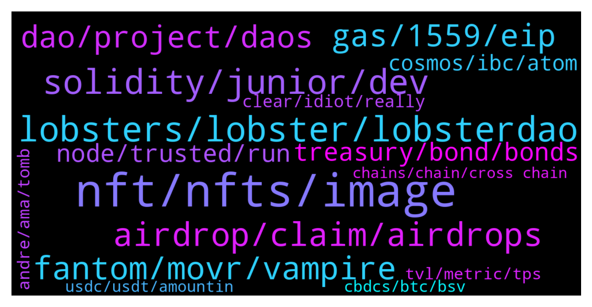

# **@lobsters_chat**
 ## Analysis for **2022-01-16** - **2022-01-23**.

---

## 📊 **Basic Stats**

**n_messages_sent**: 2402

---

---

## 🔝 **Top keywords and related messages**

1. **nft, nfts, image**

    @basmag0x --- *do you have horse in race ser? if so disclosure could be good  anyway here is difference…  farm-to-get-NFT: zero-sum game. I get more TVL, you get NFT with less veSOLID. I get NFT with more veSOLID.  grapes: we don’t have a horse in race. the more veSOLID NFTs work with us, the more power all those who come get. this is positive sum. Your NFT does not become less worth than mine. Make sense?* **--->** [TG Discussion](https://t.me/lobsters_chat/317160)

    @alekseipu --- *There is a nice book about NFTs from CG  https://landing.coingecko.com/how-to-nft/  (but WTF I can't buy it as an NFT???)* **--->** [TG Discussion](https://t.me/lobsters_chat/314549)

    @basmag0x --- *1. gib us NFT 2. we merge all NFT into one giant NFT, store in contract 3. voting of giant NFT contract is controlled by GRP token* **--->** [TG Discussion](https://t.me/lobsters_chat/316789)

    @adrianleb --- *who would've thought that nft avenue is the future of the future of france* **--->** [TG Discussion](https://t.me/lobsters_chat/317213)

    @alexinlife --- *i dont think there's anything good or bad, moral or immoral about trying to get the nft. if anything, that projects are doing this implies the design choice of andre to reward top 20 defi protocols on ftm was arbitrary and new projects are having to rush through to have an equal playing ground in the future* **--->** [TG Discussion](https://t.me/lobsters_chat/317149)

    @xecordoteth --- *the project is basically fractionalized ultrarare NFTs* **--->** [TG Discussion](https://t.me/lobsters_chat/315062)

2. **lobsters, lobster, lobsterdao**

    @Chris_hodl --- *No way not in the lobsters group 🙃* **--->** [TG Discussion](https://t.me/lobsters_chat/317224)

    @ivangbi --- *Idk anything about that ecosystem or devs, except that lobsters r still yet to get $* **--->** [TG Discussion](https://t.me/lobsters_chat/314361)

    @ivangbi --- *Jeff s semi-lobster, he has been here for a while* **--->** [TG Discussion](https://t.me/lobsters_chat/317072)

    @Pantani0x --- *So is there a lobsters' consensus on Radial? It's supposed to launch in 30mins but there aren't any smart contracts released among other suspicious things.* **--->** [TG Discussion](https://t.me/lobsters_chat/316849)

    @fozzysbo --- *is radial a lobster person project?* **--->** [TG Discussion](https://t.me/lobsters_chat/317067)

    @xjaffex --- *Was epic to meet you invangbi thanks for the call and Intro to the Lobsters* **--->** [TG Discussion](https://t.me/lobsters_chat/315108)

3. **solidity, junior, dev**

    @rocketdev --- *i did some pet projects and worked with one startup , integrating swaps and another defi projects, it went okay, tech stack like hardhat/react/typechain blabla , everything with tests, is it still junior level?* **--->** [TG Discussion](https://t.me/lobsters_chat/317516)

    @rocketdev --- *can anyone describe difference between junior solidity developer and middle solidity developer for example?* **--->** [TG Discussion](https://t.me/lobsters_chat/317445)

    @joehquak --- *I would classify that as junior dev for sure* **--->** [TG Discussion](https://t.me/lobsters_chat/317524)

    @rocketdev --- *maybe someone can interview me for detect if im senior or junior solidity dev? 😕* **--->** [TG Discussion](https://t.me/lobsters_chat/317487)

    @yic_alex --- *There is just an insane demand right now. The industry exploded and there were not that many people who bothered to learn solidity before 2021. The market is kind of getting flooded with low quality copy&paste devs, I would not even call junior, as a result. So people who somewhat know what they are doing and have some experience shouldnt have an issue finding a job.* **--->** [TG Discussion](https://t.me/lobsters_chat/317549)

    @yic_alex --- *The general concept is pretty shaky. The whole junior/senior concept was basically created by HR to determine salaries and rests entirely on the faulty assumption that more time spent working somehow makes a better developer. While that is generally true I have seen the opposite quite a few times.  So what people really mean when they talk about senior and junior developers is depth of understanding of the underlying technology and the ability produce robust and maintainable code.* **--->** [TG Discussion](https://t.me/lobsters_chat/317457)

4. **airdrop, claim, airdrops**

    @ivangbi --- *It’s 3,3. If u don’t deposit or deposit too late, it will lose the snapshot, so ur airdrop will be worthless* **--->** [TG Discussion](https://t.me/lobsters_chat/316908)

    @Matt --- *Here is a Dune Analytics dashboard that's tracking the claim process of the $LOOKS airdrop: https://dune.xyz/hildobby/LOOKS-Airdrop* **--->** [TG Discussion](https://t.me/lobsters_chat/314250)

    @gryphusito --- *any thoughts of the fees.wtf airdrop? I saw they deployed contracts already and will open them for claims tonight* **--->** [TG Discussion](https://t.me/lobsters_chat/315119)

    @ivangbi --- *Does it read to you like “not just an airdrop?” to me it kinda reads worse than that or maybe I am lazy to understand… sers blz explain* **--->** [TG Discussion](https://t.me/lobsters_chat/314870)

    @phil_muhbags --- *Don't ask questions just claim airdrop and then get excited for next airdrop* **--->** [TG Discussion](https://t.me/lobsters_chat/315284)

    @cooper3456 --- *can someone help me understand if i remove liquidity from $RDL does i still qualify for airdrop considering i provided liquidly day 1* **--->** [TG Discussion](https://t.me/lobsters_chat/317604)

5. **fantom, movr, vampire**

    @nutz3r123 --- *@andrecronje I have a question. Please dont feel offended by it, I am just curious: Why you build on fantom? Why not build something on L2 or eth itself? Or substrate, cosmos?  Because the fantom people are your friends? Or you really see some positive things there? Isnt it at the end a more centralized eth copy?* **--->** [TG Discussion](https://t.me/lobsters_chat/314636)

    @XekFukOff --- *@ivangbi do u think by '22 Q2, that Fantom can be second ecosystem in terms of TVL? I'd like your opinion on Fantom, if u don't mind sharing.* **--->** [TG Discussion](https://t.me/lobsters_chat/315534)

    @vires_numeris --- *Btw. is there any good reason (besides Andre's bags) to build this on Fantom and not on Arbitrum/Optimism?* **--->** [TG Discussion](https://t.me/lobsters_chat/317468)

    @juju1234534 --- *Do you happen to know if high congestion translates to fast block time on Fantom? Or what is the origin of the variable block times on Fantom?* **--->** [TG Discussion](https://t.me/lobsters_chat/316548)

    @melinoe0x --- *Yes! I help builders on Fantom, my DMs are open for projects who are interested in launching or have questions* **--->** [TG Discussion](https://t.me/lobsters_chat/316512)

    @changsteve --- *Worked for Fantom, must have some alloc, need to pumps those bags PS: Nothing wrong with that* **--->** [TG Discussion](https://t.me/lobsters_chat/314644)

6. **gas, 1559, eip**

    @batduck73 --- *« Transaction fees being burned due to EIP 1559 (estimate ~10k ETH/year initially while usage is still low, ramping up to hopefully hundreds of thousands of ETH/year eventually) »* **--->** [TG Discussion](https://t.me/lobsters_chat/314104)

    @coine_r --- *Because the only thing that "upgrade" improved is giving certain bagholders one more rationalization to excuse Ethereum's ridiculous gas fees* **--->** [TG Discussion](https://t.me/lobsters_chat/314046)

    @coine_r --- *There is this: https://twitter.com/jadler0/status/1427627499983343633?s=20  Personally, I miss my cheap gas weekends but I limit my Ethereum interactions to every other blue moon to make it hurt less lol* **--->** [TG Discussion](https://t.me/lobsters_chat/314059)

    @adrianleb --- *I guess only data to back claims can change our minds here, I’m personally happier using ethereum after 1559 than I was before 🤷‍♂️* **--->** [TG Discussion](https://t.me/lobsters_chat/314056)

    @zhongfu --- *so it seems like the first EIP-1559 block on polygon was ~2h ago, but validators still have their target block gas limit set to 15M* **--->** [TG Discussion](https://t.me/lobsters_chat/316350)

    @Cryptoaq --- *Fees wtf helped some of us to realice the value of gas* **--->** [TG Discussion](https://t.me/lobsters_chat/315300)

7. **dao, project, daos**

    @nickbtts --- *Are those projects actually ‘DAOs’ though, or is it going to just be random devs deciding what to do with their veDRE* **--->** [TG Discussion](https://t.me/lobsters_chat/314360)

    @nickbtts --- *for sure, this is an ongoing discussion right now, as usual there are differing opinions within a DAO. FWIW I agree with you, things just went a bit...a lot...quicker than expected* **--->** [TG Discussion](https://t.me/lobsters_chat/316498)

    @rahemanAli --- *Founder ex-head of research crypto.com   I had a conversation with these guys when they were raising, almost got into the round for NIOX DAO, but bigger better meaner VCs and angels stepped in 🥲  The deck I have is not that technical, but it seemed cool and they were adamant on not being a curve fork* **--->** [TG Discussion](https://t.me/lobsters_chat/316001)

    @alexinlife --- *where can i find info abou daofi? the website isnt opening for me and github link is empty* **--->** [TG Discussion](https://t.me/lobsters_chat/316681)

    @unchainedoneawoken --- *Also involved in MGH DAO lately, another DAO project.  Making moves in the metaverse with sandbox and decentraland* **--->** [TG Discussion](https://t.me/lobsters_chat/317664)

    @ivangbi --- *Working DAO decided to leave it to the project, so we all cant sybil by knwoign their approach* **--->** [TG Discussion](https://t.me/lobsters_chat/316914)

8. **treasury, bond, bonds**

    @ivangbi --- *Can one of the angels / participants explain the logic of this distribution please? What was the logic behind leaving 0 treasury - to mint later in case the DAO wants or no such plans even? If yes to mint, then as state said it makes sense to keep the FDV meme low, and mint as required. ps: am not shitting on it, I am just puzzled on the rationale of such a table* **--->** [TG Discussion](https://t.me/lobsters_chat/315053)

    @ivangbi --- *Ser me no supporter and no simp for this, but if we take away the past and view it just as a "big treasury" since IV now - almost the FDV, then it becomes o-k? Then it needs to make products and use that liquidity well, like what Dani does w "his" bags? Imho, kill the staking APYs (it's not token dilution for no reason, just let it go at the big dip, let people exit). There is no point innit since bonds can't really bring that much anymore: likely token dilution % will be larger than $ of treasury accrual. And... just pivot 100%* **--->** [TG Discussion](https://t.me/lobsters_chat/316123)

    @ivangbi --- *Treasury here is in real assets and it’s almost 1:1 so it’s fine. The question is whether they will keep sticking to their bond narrative or pivot. @fiskantes seems to be still behind the bond model and “original vision” while Dani turned south and is now admitting to having done continuous ICO, ready to turn it into a VC fund* **--->** [TG Discussion](https://t.me/lobsters_chat/316406)

    @ivangbi --- *But those are printing brr, so bonds* **--->** [TG Discussion](https://t.me/lobsters_chat/314412)

    @tongnk --- *It's going to be big. Ribbon got treasury vaults soon. Solv has debt structuring* **--->** [TG Discussion](https://t.me/lobsters_chat/316435)

    @ivangbi --- *Basically, forget about bonds and all that, after some growth point you likely can't even use it well anymore (too tight slippage, too efficient the market idk?) - and do a different thing althogether. Reserve currency = find new ways to grow treasury. Or just become an index* **--->** [TG Discussion](https://t.me/lobsters_chat/316130)

9. **node, trusted, run**

    @xecordoteth --- *Moxie talks about how node services like Infura don't provide cryptographic proofs that the outputs they provide are correct. How hard would it be to build a node service that does provide authenticated responses?* **--->** [TG Discussion](https://t.me/lobsters_chat/314719)

    @easeev --- *You can try Chainstack, we provide pretty much direct access to nodes without pre-processing* **--->** [TG Discussion](https://t.me/lobsters_chat/315336)

    @sambacha --- *there is already a trusted checkpoint oracle implemented in all clients. this is what light clients als can use. Currently the trie root is part of the trusted syncing checkpoint but trustless validation of the BloomBits trie is part of the development plans.  read more about the checkpoint oracle system here: https://github.com/ethereum/go-ethereum/tree/master/cmd/checkpoint-admin* **--->** [TG Discussion](https://t.me/lobsters_chat/314839)

    @xecordoteth --- *This is about applications that query nodes. They just get a JSON response without proof its correct, so they trust the node provider.* **--->** [TG Discussion](https://t.me/lobsters_chat/314842)

    @anisopteran --- *as ever, if you care about third parties being able to link your queries in some way, then don't use third parties. Run a node.* **--->** [TG Discussion](https://t.me/lobsters_chat/314727)

    @xecordoteth --- *if they are not running their own node* **--->** [TG Discussion](https://t.me/lobsters_chat/315856)

10. **cosmos, ibc, atom**

    @sir_integra_hellsing --- *UST is Terra. Terra doesn't use IBC, just uses the Cosmos SDK. Kinda like how Binance Chain works (not BSC, the one before that, the BEP2 one)* **--->** [TG Discussion](https://t.me/lobsters_chat/314539)

    @Siimmoonn --- *ATOM can currently be used for governance + staking with validators. New zones in cosmos can incentivize current validators of the Cosmos HUB to also secure their chain/zone. This could have an impact on the price of ATOM but in general the ATOM token is isolated from things happening on zones like secret network or sifchain. Please correct me if I  have missed any new development on ATOM utility* **--->** [TG Discussion](https://t.me/lobsters_chat/314553)

    @Siimmoonn --- *Also to split a few hairs: IBC is part of Cosmos SDK.* **--->** [TG Discussion](https://t.me/lobsters_chat/314543)

    @Cat_Graphy --- *How does ATOM have any relations to IBC when it’s a Cosmos SDK. They are using the SDK, doesn’t imply adoption of IBC will affect ATOM anyway right?* **--->** [TG Discussion](https://t.me/lobsters_chat/314550)

    @robzerizi --- *running on provenance blockchain, which seems to be yet another cosmos sdk based bc* **--->** [TG Discussion](https://t.me/lobsters_chat/314972)

    @PmRiviere --- *Does Cosmos directly profit from usage of their tech or public good?* **--->** [TG Discussion](https://t.me/lobsters_chat/314973)

11. **clear, idiot, really**

    @Sergelove --- *thank you Alex. now its all clear. 😭* **--->** [TG Discussion](https://t.me/lobsters_chat/317123)

    @Sp33dyTT --- *Haha you seems new to this. Ofc it can.* **--->** [TG Discussion](https://t.me/lobsters_chat/315977)

    @Joel_john --- *thank you kind sir, im an idiot* **--->** [TG Discussion](https://t.me/lobsters_chat/314256)

    @WSFLotus --- *As a Synapse guy you must be really enjoyed the show👀* **--->** [TG Discussion](https://t.me/lobsters_chat/316398)

    @calchulus --- *hahhaa you are not an idiot* **--->** [TG Discussion](https://t.me/lobsters_chat/314258)

    @xecordoteth --- *You're a clear thinker sir, ht* **--->** [TG Discussion](https://t.me/lobsters_chat/314716)

12. **andre, ama, tomb**

    @ivangbi --- *OMG ANDRE ALREADY SAY THE WORDS AND TICKERS WHAT IS THIS BLABLA* **--->** [TG Discussion](https://t.me/lobsters_chat/316830)

    @ivangbi --- *When was andre snapshot going to happen to the top 20, what date?* **--->** [TG Discussion](https://t.me/lobsters_chat/316138)

    @ivangbi --- *He was, but we kinda shat on him, while I still believe it was rightfully done ://* **--->** [TG Discussion](https://t.me/lobsters_chat/317223)

    @SpikeSpiege1 --- *Will be curious to see how it all plays out. Here's the ama/interview details  https://mobile.twitter.com/_FrogRadio/status/1483119288173182978* **--->** [TG Discussion](https://t.me/lobsters_chat/316371)

    @xylophonez --- *aha thanks. makes sense. and did the whole 'Tomb being excluded' thing get addressed?* **--->** [TG Discussion](https://t.me/lobsters_chat/317386)

    @ivangbi --- *Andre shilling veDao lol and then got disconnected lmao* **--->** [TG Discussion](https://t.me/lobsters_chat/316837)

13. **tvl, metric, tps**

    @andrecronje --- *TVL is a more commonly accepted metric I believe, but I'm a defillama fanboy, so I'm bias* **--->** [TG Discussion](https://t.me/lobsters_chat/314290)

    @ivangbi --- *I believe just TVL based, so whatever u deposit* **--->** [TG Discussion](https://t.me/lobsters_chat/316912)

    @fozzysbo --- *What’s the minimal TVL needed rn?* **--->** [TG Discussion](https://t.me/lobsters_chat/316934)

    @alexinlife --- *will the toggles (staking, treasury etc) on defillama count towards the tvl? or is the ranking without the toggles?* **--->** [TG Discussion](https://t.me/lobsters_chat/318061)

    @t1mur --- *When we compare performance of blockchains, the main metric is max transactions per second, right? But exactly what type of transactions is meant and do blockchain developers tend to mean the same thing?* **--->** [TG Discussion](https://t.me/lobsters_chat/314289)

    @t1mur --- *TVL is more a measure of "success" than performance, imo* **--->** [TG Discussion](https://t.me/lobsters_chat/314294)

14. **cbdcs, btc, bsv**

    @SuperMassiveONE --- *but in so doing also falling behind emerging nations that are just buying CBDCs off the shelf and banking the unspanked* **--->** [TG Discussion](https://t.me/lobsters_chat/315239)

    @PmRiviere --- *Wow. Is the mayor a populist clown like Bukele or a serious dude? feels much more disrutive of a news than El Salvador adopting BTC https://twitter.com/zhusu/status/1481943572203012096* **--->** [TG Discussion](https://t.me/lobsters_chat/315567)

    @JBate7 --- *Guys im a totally naive fool when it comes to the Bitcoin wars. I once did a podcast with Kurt Wuckert (one of BSV's lead marketing guys) and he pretty convincingly told me the stories of the Block Wars and how BSV is a viable product.   However most of the people in this space that i respect tell me BSV is nothingsauce. What's the real truth?* **--->** [TG Discussion](https://t.me/lobsters_chat/316721)

    @alexn911 --- *very similar to Salvador's president swingtrading country's funds from his mobile* **--->** [TG Discussion](https://t.me/lobsters_chat/316625)

    @ivangbi --- *Also no retroactive shitcoins it seems @banteg correct?* **--->** [TG Discussion](https://t.me/lobsters_chat/314888)

    @cactushoes --- *Still nowhere near as "murky" as banks. Hah. Its actually completely transparent, just more complexity...* **--->** [TG Discussion](https://t.me/lobsters_chat/317436)

15. **usdc, usdt, amountin**

    @redrose2 --- *what if this happened with usdc usdt* **--->** [TG Discussion](https://t.me/lobsters_chat/316383)

    @jefftt --- *i know, i said "i'm assuming"  no other good reason for 160mil of USDT to be frozen at the request of law enforcement* **--->** [TG Discussion](https://t.me/lobsters_chat/315383)

    @RobAnon --- *USDC is a 6 decimal token* **--->** [TG Discussion](https://t.me/lobsters_chat/314438)

    @syed_jafri --- *amountIn put WTF amount and then click + 10^18 amountOut put ETH amount and then click + 10^18* **--->** [TG Discussion](https://t.me/lobsters_chat/315425)

    @memer999 --- *what do i put for amountOutMin and amountIn?* **--->** [TG Discussion](https://t.me/lobsters_chat/315423)

    @ivangbi --- *You need to properly fractionalize it, because if you just buy a piece it doesn’t do anything* **--->** [TG Discussion](https://t.me/lobsters_chat/316781)

