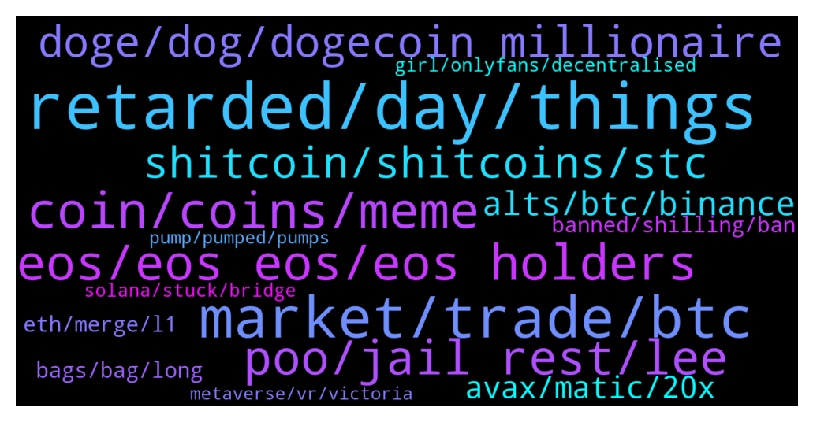

# **@shitpool**
 ## Analysis for **2022-01-16** - **2022-01-23**.

---

## 📊 **Basic Stats**

**n_messages_sent**: 1500

---

---

## 🔝 **Top keywords and related messages**

1. **retarded, day, things**

    @p3mvH --- *hey cunts whats the next youtube* **--->** [TG Discussion](https://t.me/shitpool/716224)

    @Rjknew --- *not sure if you really want help or just acting retarded with the last comment* **--->** [TG Discussion](https://t.me/shitpool/718212)

    @kuntpuncher --- *Dunno man, you are the one here 24 hrs a day hehehe.* **--->** [TG Discussion](https://t.me/shitpool/716614)

    @Horselorde --- *I’m still watching to see what they do because apparently they have some cool things coming* **--->** [TG Discussion](https://t.me/shitpool/718433)

    @nuckingfutzzzz --- *thats ok. some people just wont admit it and will hodl their tokenized dreams* **--->** [TG Discussion](https://t.me/shitpool/718234)

    @Horselorde --- *I was gifted my TIME so technically I’m…. Still way up considering all the rebases lol* **--->** [TG Discussion](https://t.me/shitpool/718268)

2. **market, trade, btc**

    @CookieSlayer --- *Any LTC maxi's here? I have... A lot... And felt everything was FUD being spread for several years, but then someone actually shared real data: https://www.cftc.gov/PressRoom/PressReleases/8369-21  So Charlie did wash trade LTC!? Ugh. Just waiting for a better exit 😔 such good fundamentals. Why couldn't he just let the coin speak for itself.* **--->** [TG Discussion](https://t.me/shitpool/716548)

    @Zuhaib0095 --- *Powell Says Fed Report on Crypto and Central Bank Digital Currency Is 'Ready to Go' https://decrypt.co/90189/powell-fed-report-crypto-cbdcs-ready* **--->** [TG Discussion](https://t.me/shitpool/715991)

    @MoneroPal --- *These uneducated clueless clowns blathering how crypto is some sort of messah that will topple world governments and the financial system just don’t get it...* **--->** [TG Discussion](https://t.me/shitpool/715587)

    @huntersthompson101 --- *The last bastion of crypto anarchists with NO kyc ...hail tradeogre!* **--->** [TG Discussion](https://t.me/shitpool/718751)

    @da0man --- *I heard in Germany if you make profit in crypto, then lose all of it in stocks, you still have to pay tax on the crypto from the money u don’t have anymore as they are treated separately* **--->** [TG Discussion](https://t.me/shitpool/715698)

    @MoneroPal --- *none of that shit matters, if you’re bringing up the fiat to crypto comparison it’s a lost cause already lol* **--->** [TG Discussion](https://t.me/shitpool/717826)

3. **coin, coins, meme**

    @AsianFever --- *cool cool it was just a general one, idk much about ogre. not your keys not your coins, dont keep a stash of shit in the bear on a dodgy chinese cex* **--->** [TG Discussion](https://t.me/shitpool/718759)

    @da0man --- *You should be. You should not be holding coins long term end of the cycle* **--->** [TG Discussion](https://t.me/shitpool/715942)

    @monkey993 --- *Imagine not buying a coin that expressly tells you in its name that it will be beamed to the moon* **--->** [TG Discussion](https://t.me/shitpool/716745)

    @Breddao --- *If Sam finds another chain to mint new coins cheaply, it's toast* **--->** [TG Discussion](https://t.me/shitpool/718636)

    @wonderwarraior --- *Foget about ATH value of portfolio, save whatever you can now. Maybe buy some Bitcoins or keep in fiat. Risk taking should be minimal now* **--->** [TG Discussion](https://t.me/shitpool/718124)

    @onchainjoe --- *What coins have outperformed NEAR this last month besides ATOM?* **--->** [TG Discussion](https://t.me/shitpool/716519)

4. **eos, eos eos, eos holders**

    @wojackdegreate --- *Dot and eos battling for the biggest loser claim* **--->** [TG Discussion](https://t.me/shitpool/716158)

    @nuckingfutzzzz --- *Thanks for eos I can always go back to it to milk* **--->** [TG Discussion](https://t.me/shitpool/717728)

    @hatworthy --- *For anybody who doesn't know, this Horselorde dude lost 200 bucks in EOS and spent the next two years crying about it.   Check his comment history. He literally lost $200 😄* **--->** [TG Discussion](https://t.me/shitpool/717603)

    @Horselorde --- *I actually lost a lot more than that but who tf cares anymore, I’m not rekt like 99% of eos holders so that’s win to me.* **--->** [TG Discussion](https://t.me/shitpool/717657)

    @Horselorde --- *You’re just mad you’re still rekt from holding eos* **--->** [TG Discussion](https://t.me/shitpool/716619)

    @illuminati --- *i used to be a big eos guy* **--->** [TG Discussion](https://t.me/shitpool/716349)

5. **poo, jail rest, lee**

    @monkey993 --- *You think this Wonder Warrior is one of them?* **--->** [TG Discussion](https://t.me/shitpool/718181)

    @Horselorde --- *He looks like he hasn’t slept in a year* **--->** [TG Discussion](https://t.me/shitpool/717351)

    @MoneroPal --- *are in the wonderland discord? “joeblow” just literally brought that up* **--->** [TG Discussion](https://t.me/shitpool/717779)

    @MoneroPal --- *Daniel’s clown bubble is truely remarkable* **--->** [TG Discussion](https://t.me/shitpool/715628)

    @da0man --- *Guys, I’m not xuv. I’m just a stoner for Colorado* **--->** [TG Discussion](https://t.me/shitpool/715988)

    @da0man --- *why all the polka trash has “moon” in their name?* **--->** [TG Discussion](https://t.me/shitpool/716077)

6. **doge, dog, dogecoin millionaire**

    @wonderwarraior --- *Wow, so you didn't sell even at 0.8$!? It will be very difficult for DOGE to ever go back there now* **--->** [TG Discussion](https://t.me/shitpool/717136)

    @wanker007 --- *I set all my doge sells from 50c to 1usd the weeks leading up to Elon on snl* **--->** [TG Discussion](https://t.me/shitpool/715408)

    @brendanplayford --- *I do have very long term DOGE from 2013 first blocks hahah* **--->** [TG Discussion](https://t.me/shitpool/717135)

    @grammi --- *We should check in on the dogecoin millionaire* **--->** [TG Discussion](https://t.me/shitpool/718561)

    @Gregoranus --- *3rd most searched for on CoinGecko for two days apparently. After Doge & Dogebonk.* **--->** [TG Discussion](https://t.me/shitpool/716749)

    @Antonioalcantara --- *are you seriously holding doge since 2013 brendan?* **--->** [TG Discussion](https://t.me/shitpool/717140)

7. **shitcoin, shitcoins, stc**

    @arbullz --- *guys, how come youre discussing shitcoin "fundamentals"* **--->** [TG Discussion](https://t.me/shitpool/718510)

    @wonderwarraior --- *You will make a shitcoin and dump on us sir? This is the good that you will do?* **--->** [TG Discussion](https://t.me/shitpool/717172)

    @kuntpuncher --- *Guys why have people stopped buying shitcoins? How get money back?* **--->** [TG Discussion](https://t.me/shitpool/718463)

    @illuminati --- *why on god's green earth would you have deleted analysis of an actual premium shitcoin in shitpool* **--->** [TG Discussion](https://t.me/shitpool/716060)

    @pizza_dog --- *I’m ready for my 60 bucks of a random shitcoin* **--->** [TG Discussion](https://t.me/shitpool/715767)

    @ptsolorid --- *Why ask you seem to have a high level understanding of the shitcoin game* **--->** [TG Discussion](https://t.me/shitpool/718586)

8. **alts, btc, binance**

    @MoneroPal --- *Much less then you’d think none of the prop shops really trade alts for there are no derivative products* **--->** [TG Discussion](https://t.me/shitpool/718160)

    @BearishWhale --- *everyone knows Feb is gonna be magical for alts circulating supply addups, utiutiu* **--->** [TG Discussion](https://t.me/shitpool/717966)

    @besselBeat --- *Dominance of Alts excluding ETH update: https://www.tradingview.com/x/Wvw0tc8o/* **--->** [TG Discussion](https://t.me/shitpool/717261)

    @MoneroPal --- *It’s not that complicated, fiat is king always has always will be. The institutions that trade billions per day of BTC are leveraged. They need to repay these loans with fiat so they take profits. This causes sell pressure on BTC which causes liquidations of mostly retail traders. Additionally, there is a lot of derivatives interset in the market from professional traders hedging. This causes further sell pressure. It’s all correlated to the macro market. Alt’s are wholly irrelevent, low liquidity, low volume, all worthless trash…* **--->** [TG Discussion](https://t.me/shitpool/718155)

    @besselBeat --- *Dominance of Alts excluding ETH: https://www.tradingview.com/x/koStx2UX/* **--->** [TG Discussion](https://t.me/shitpool/716698)

    @BeAMightyKing --- *I'm thinking similarly, as it's hard for me to see most top 20 L1s seeing significantly more upside without BTC 1st clearing $69k, past $100k & beyond.  But maybe this is old skool thinking and perhaps we've transitioned to a market where BTC & alts move up together without a surge in BTC dominance* **--->** [TG Discussion](https://t.me/shitpool/717142)

9. **avax, matic, 20x**

    @MoneroPal --- *AVAX is dog shit, literally has one good project on it, and one DEX, nothing else, just another EVM, all this shit is truly worthless and is nothing more then exit liquidity for whales dumping on peasant commoners that thought they’d get rich with a couple thousand dollars* **--->** [TG Discussion](https://t.me/shitpool/717798)

    @brendanplayford --- *or development or liquidity program in the way lets say AVAX really, really, nailed* **--->** [TG Discussion](https://t.me/shitpool/717131)

    @Bigjoeyf --- *Avax itself wasn't really the play but the eco coins* **--->** [TG Discussion](https://t.me/shitpool/716941)

    @zkguler --- *pangolin made me very sad on avax* **--->** [TG Discussion](https://t.me/shitpool/718753)

    @superfishe --- *was not avax supposed to be a top chain ?>* **--->** [TG Discussion](https://t.me/shitpool/717624)

    @S_rank --- *Tixl is down on the month ?* **--->** [TG Discussion](https://t.me/shitpool/716531)

10. **banned, shilling, ban**

    @gr1mst0n1 --- *People already came in here shilling it and got banned* **--->** [TG Discussion](https://t.me/shitpool/718607)

    @SupreemKai --- *bro thank you so much for your TIME shill. im up about 15x in a month. youre a fucking gangster man, i love you* **--->** [TG Discussion](https://t.me/shitpool/715599)

    @Antonioalcantara --- *blazeit was banned if i remember well* **--->** [TG Discussion](https://t.me/shitpool/718863)

    @trollkotze --- *it not possible to talk to ppl when they blocked you* **--->** [TG Discussion](https://t.me/shitpool/718728)

    @p3mvH --- *Hey keku. Have u heard the latest fud? Pakistan is gona ban cypto soon. How does that make u feels?* **--->** [TG Discussion](https://t.me/shitpool/716334)

    @arbullz --- *sorry dude, i get dms from random people all the time just block right away* **--->** [TG Discussion](https://t.me/shitpool/718721)

11. **bags, bag, long**

    @brendanplayford --- *I have been in the space since 2013 and have long term bags - I enjoy day trading as well* **--->** [TG Discussion](https://t.me/shitpool/717120)

    @nuckingfutzzzz --- *Wow I guess I'm famous. I'm broke AF though. I wish I had bags that could move the market. I'm flattered AF.* **--->** [TG Discussion](https://t.me/shitpool/717742)

    @Horselorde --- *Been taking profits here and there, still have about 1/4 my original bag* **--->** [TG Discussion](https://t.me/shitpool/717128)

    @gonubie --- *Yea looks like thats the one, i am not expecting as much from aca really, didnt go as much for the auctions but will have a nice bag* **--->** [TG Discussion](https://t.me/shitpool/716316)

    @MoneroPal --- *amazing volume ser, certaintly so much opportunity to cash out big bag* **--->** [TG Discussion](https://t.me/shitpool/715970)

    @wonderwarraior --- *Currently Near and FTM. Added some DOGE too on the recent dump + long term Avax bags* **--->** [TG Discussion](https://t.me/shitpool/717127)

12. **eth, merge, l1**

    @wonderwarraior --- *I don't think it can outperform buying early in L1s and holding for many multiples but maybe it works for you. thanks for sharing anyways* **--->** [TG Discussion](https://t.me/shitpool/717117)

    @oneblink --- *What happens to polygon after ETH 2.0?* **--->** [TG Discussion](https://t.me/shitpool/716299)

    @BeAMightyKing --- *I'm not sure. Corn could also go sideways here as L1's further bleed* **--->** [TG Discussion](https://t.me/shitpool/719273)

    @da0man --- *What happens to ETC after ETH Merge?* **--->** [TG Discussion](https://t.me/shitpool/716284)

    @da0man --- *So are miners gonna exit pump ETC again this  year for the merge so they can distribute again over 1-2 years?* **--->** [TG Discussion](https://t.me/shitpool/716353)

    @Finita_est --- *That would be terrific, but this is likely the bottom day for eth* **--->** [TG Discussion](https://t.me/shitpool/718848)

13. **girl, onlyfans, decentralised**

    @BigBombo --- *It's a $10m market cap bet on decentralized onlyfans/Patreon/twitch/discord by top 3 overall and top growth crypto girl influencer* **--->** [TG Discussion](https://t.me/shitpool/717566)

    @MoneroPal --- *It’s not about being a fan, it’s a scam, lots of people are getting hurt, I don’t feel bad for them, but they should be exposed, they have far too much power in their vertically integrated community* **--->** [TG Discussion](https://t.me/shitpool/718487)

    @rogerredis --- *I kinda think that too, that man is behind this girl nfts. Either boyfriend or smth  Literally get a model and split the profits* **--->** [TG Discussion](https://t.me/shitpool/717455)

    @tonygmm --- *Whitelist for the first Fantom maker ido:  https://wn.nr/YMWp9V* **--->** [TG Discussion](https://t.me/shitpool/718024)

    @chatwithgera --- *girls thinking the dao will make them do anal when really it's shoe on head* **--->** [TG Discussion](https://t.me/shitpool/716820)

    @BigBombo --- *bruh its a giant need absolutely crying out for a solution.  onlyfans literally banned explicit content recently and no crypto / decentralised contender has popped up* **--->** [TG Discussion](https://t.me/shitpool/717309)

14. **solana, stuck, bridge**

    @da0man --- *SOL really drilling a hole today* **--->** [TG Discussion](https://t.me/shitpool/719123)

    @wojackdegreate --- *I’m good, been in stables forever but I have a stupid amount of ust stuck in the wormhole bridge almost for 24 hours because Solana is pretty much down… stuck at 400 tps and I guess this thing needs 2000+ tps for a tx to be successful smh* **--->** [TG Discussion](https://t.me/shitpool/719054)

    @Breddao --- *wormhole is also down for retrieving, even if you managed to send to it?* **--->** [TG Discussion](https://t.me/shitpool/719112)

    @wojackdegreate --- *My ust still stuck in the bridge, can’t claim. Send it to zero.* **--->** [TG Discussion](https://t.me/shitpool/719111)

    @wojackdegreate --- *Finally got my ust on sol. “24 hours later”* **--->** [TG Discussion](https://t.me/shitpool/719152)

    @Rjknew --- *Solana should be happy if it can do 10 transactions without having 5 fail* **--->** [TG Discussion](https://t.me/shitpool/716344)

15. **metaverse, vr, victoria**

    @MoneroPal --- *Can someone explain how variosu cities around the world are being added to the metaverse, what is stopping another project using another chain from just recreating those said cities in their own metaverse or version of it? It seems extremely stupid at this point...* **--->** [TG Discussion](https://t.me/shitpool/715489)

    @Blazmeen --- *Tbh I'm surprised ppl don't generally consider the market audience for metaverses. Assuming we're talking about gamers - are they really going to dole out $100k-$2.5M to buy land off an investor? Or $XXX to rent it?* **--->** [TG Discussion](https://t.me/shitpool/715527)

    @MoneroPal --- *So it’s a good play to buy and rent out the metaverse to players?* **--->** [TG Discussion](https://t.me/shitpool/715529)

    @mrlurah --- *Metaverse coming to cardano. So that's why* **--->** [TG Discussion](https://t.me/shitpool/717245)

    @pizza_dog --- *Imagine going to someone and saying “I own your home in the metaverse”* **--->** [TG Discussion](https://t.me/shitpool/715498)

    @wojackdegreate --- *I think metaverse plays are running on borrowed time… but who knows* **--->** [TG Discussion](https://t.me/shitpool/715532)

