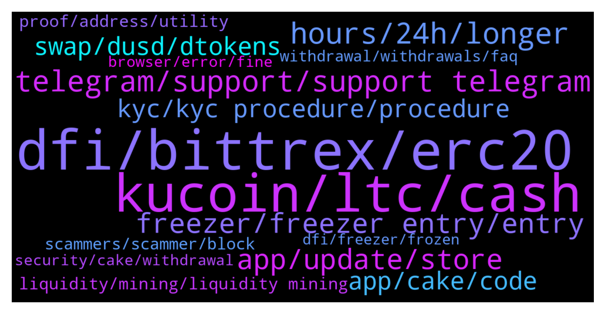

# **@CakeDeFi_EN**
 ## Analysis for **2022-01-23** - **2022-01-30**.

---

## 📊 **Basic Stats**

**n_messages_sent**: 1362

---

---

## 🔝 **Top keywords and related messages**

1. **dfi, bittrex, erc20**

    @Kenneth --- *Hi. As a fellow Malaysian, I would like to ask does anyone knows the best way to buy DFI?* **--->** [TG Discussion](https://t.me/CakeDeFi_EN/167697)

    @GK --- *Hi, I've set up a DFI wallet on my desktop. I've also set up a receive address and given it a label. I know this is probably obvious, but if I want to add DFI tokens can I confirm that I now simply use the new receive address for a withdrawal from my cake dfi wallet?* **--->** [TG Discussion](https://t.me/CakeDeFi_EN/165526)

    @Bald --- *How come I can't swap DFI to BTC?* **--->** [TG Discussion](https://t.me/CakeDeFi_EN/167868)

    @TJone$ --- *Still trapped. Uniswap took the gas fee but didn’t complete the swap. Not your problem I know but still can’t do anything with the ERC20 DefiChain  Kucoin don’t seem to support it either 🤷🏼‍♂️* **--->** [TG Discussion](https://t.me/CakeDeFi_EN/169354)

    @DmgBautista --- *What do you mean no direct transfer or withdrawal? That is literally the most basic function on the platform and works fine.  Just send your DFI through the defichain network to a supported exchange (kukoin, bittrex, hotbit, bitrue, and many others) and cash out if you wish so.  If you are speaking of frozen coins given as welcome bonus, those you cannot withdraw before the 180 freezer days elapse, in order to give you time to understand the platform and not attract users that are only after free money.  Best regards! 👍* **--->** [TG Discussion](https://t.me/CakeDeFi_EN/169260)

    @mm_phoenix --- *but no one has ever said that you should pay out the dfi via erc20. If you want to pay out dfi, you send it to an exchange and not to your own wallet, and most exchanges only accept dfi via the defichain but as @DmgBautista said try it via HOO* **--->** [TG Discussion](https://t.me/CakeDeFi_EN/169229)

2. **kucoin, ltc, cash**

    @ExPwr --- *So LTC will be better than BTC in terms of the fees?* **--->** [TG Discussion](https://t.me/CakeDeFi_EN/166376)

    @ExPwr --- *My favourite ones are XLM, TRX, ALGO* **--->** [TG Discussion](https://t.me/CakeDeFi_EN/166364)

    @ExPwr --- *I guess I'll have to buy some LTC for the first time in my life 😉* **--->** [TG Discussion](https://t.me/CakeDeFi_EN/166367)

    @BerndMack --- *if you sent BTC it is the bitcoin blockchain, for ethereum it is the ethereum blockchain.* **--->** [TG Discussion](https://t.me/CakeDeFi_EN/165448)

    @Admin Support --- *I have problem with my BTC* **--->** [TG Discussion](https://t.me/CakeDeFi_EN/165366)

    @ExPwr --- *Fabio, on your UI, when you want to deposit BCH it gives you two options: 'CASH' or 'LEGACY'. Please read my question and confirm what is the correct type to withdraw from KuCoin.* **--->** [TG Discussion](https://t.me/CakeDeFi_EN/166497)

3. **telegram, support, support telegram**

    @Roxxiej --- *I have and they gave me the option to use telegram* **--->** [TG Discussion](https://t.me/CakeDeFi_EN/166098)

    @DmgBautista --- *Please understand that when support says a wallet, they are speaking in general, they do not know what you are trying to do or your specific situation, unless you are very specific about the subject maybe. They would be surelly speaking of your DFI listed exchange wallet, from which you can cash out, its the only way to off ramp. And those, with exception of HOO, always have native DFI listed.  Please consider in future interaction and when in doubt, to double check here, we will always try our best to help 🙂 Better ask twice than being in a less confortable position, especially when you have a community that can back you up. Surelly other members may have passed by the same, and that's why we must use and empower this collective user knowledge base 🙂   Tell us how that go in uniswapp and if not able, we'll obviously in the community try to think on how to help you 👍  As always, just one important information. Your issue is a general good catch for scammers and less honest people to try and take advantage. Please remember that no mod will ever DM or call you! Also, there is no support on telegram.   If you receive any DM or call saying they are support and want to help you, or even from someone that looks like a mod, just block and report. Keep communication in this official channel.  Stay safe and hope you can solve the issue! 😊* **--->** [TG Discussion](https://t.me/CakeDeFi_EN/169237)

    @DmgBautista --- *Hi! There is no direct number to call to solve such subjects.   Everything must be solved by our official support. You can find the link below. Please consider that there is no official support in telegram.   Anyone DM you or calling you claiming to be support or a mod, must be immediatelly blocked and reported.  Mods will never DM a user neither call. Any unsolicited DM or call must always be considered a scam attempt!  You can contact support by the below link. Please allow them at least 24h to answer, maybe a bit more on weekends  https://cake.zendesk.com/hc/en-us/requests/new* **--->** [TG Discussion](https://t.me/CakeDeFi_EN/169076)

    @DmgBautista --- *Could you be a bit more clear? Please have in mind that there is no official support in telegram. Block and report any DM or call from anyone claiming to be a mod or a fictional support. No Mod will ever DM or call you and there is no support in telegram. Only this channel or Cake official contacts must be considered. Other than that, boa tarde!  Any issue can be adressed to   https://cake.zendesk.com/hc/en-us/requests/new  But if you could be more specific, we can better direct you 🙂* **--->** [TG Discussion](https://t.me/CakeDeFi_EN/165671)

    @DmgBautista --- *That's strange. Never heard that from any user, if there was any problem with the IOS app, more than garanteed that half of the telegram group would have been making quite a fuss on that. Maybe some update that went less well? I am sorry, but if you could not use the app since like forever, that is really strange, and to my best knowledge, quite unique 😕* **--->** [TG Discussion](https://t.me/CakeDeFi_EN/166894)

    @DmgBautista --- *Also, tale care with scammers, as this is a public chat. No mod will DM or call you directly, as well as there is also not support in telegram, so also block and report any fictional support that might DM or call you. Only the Cake official channels are the way to go. Stay safe! 👍* **--->** [TG Discussion](https://t.me/CakeDeFi_EN/165791)

4. **hours, 24h, longer**

    @BerndMack --- *24h is mentioned there or? 2h is pretty ok 😁* **--->** [TG Discussion](https://t.me/CakeDeFi_EN/167476)

    @StarGazerTM --- *hah i know i wait from saturday morning* **--->** [TG Discussion](https://t.me/CakeDeFi_EN/167837)

    @fabioandreatta --- *Yes hodlnaut has a very similar system to ours. around 48-hours  Take a look at this article: https://www.publish0x.com/cryptosensei/after-cryptocoms-hack-i-found-out-more-about-hodlnauts-and-c-xznxzrl* **--->** [TG Discussion](https://t.me/CakeDeFi_EN/168034)

    @JL --- *Duh! U didnt read ? I mentioned 72 hours already* **--->** [TG Discussion](https://t.me/CakeDeFi_EN/167993)

    @fadfunky --- *But its should be in 1 hour to wait ya?* **--->** [TG Discussion](https://t.me/CakeDeFi_EN/165364)

    @Gilbz --- *Simple mode is taking almost an hour* **--->** [TG Discussion](https://t.me/CakeDeFi_EN/166305)

5. **app, update, store**

    @adghuunb --- *The aop has not be update since one month so may be we need nee update for it* **--->** [TG Discussion](https://t.me/CakeDeFi_EN/165862)

    @JetFuelGenius --- *When I opened up the app earlier today, it told me it was out of date and needed to be updated. I was directed to the App Store, but no update was available. It is available now.* **--->** [TG Discussion](https://t.me/CakeDeFi_EN/167805)

    @JetFuelGenius --- *When you release an update, it would be nice if you would make sure it’s live and actually available before blocking the old version.* **--->** [TG Discussion](https://t.me/CakeDeFi_EN/167803)

    @Bald --- *Yes. Using Samsung. Downloaded the app from playstore. But was told the app was outdated. Problem is Playstore do not have any update* **--->** [TG Discussion](https://t.me/CakeDeFi_EN/167755)

    @adghuunb --- *@fabioandreatta  please check app bug staking rewards are not show in dollers .. and it showing blank.. please talk to developer for the update in app . I hope to have the bounty for this.* **--->** [TG Discussion](https://t.me/CakeDeFi_EN/165857)

    @Bald --- *I tried on my mobile and laptop. Both unable to* **--->** [TG Discussion](https://t.me/CakeDeFi_EN/167753)

6. **kyc, kyc procedure, procedure**

    @StarGazerTM --- *im still waiting for my kyc to be aproved 😂* **--->** [TG Discussion](https://t.me/CakeDeFi_EN/167835)

    @SirVictorXY --- *More than 24hrs and my KYC status is still pending* **--->** [TG Discussion](https://t.me/CakeDeFi_EN/168843)

    @Arzuhsnv --- *Hi. There is no sms to the phone number to make KYC. Can you help me?* **--->** [TG Discussion](https://t.me/CakeDeFi_EN/169520)

    @DLR988 --- *KYC was done on 18th. My KYC is not completed yet. Whereas there was a time of 24 hours.* **--->** [TG Discussion](https://t.me/CakeDeFi_EN/166620)

    @StarGazerTM --- *Hi i need help i didnt pass Kyc from last week* **--->** [TG Discussion](https://t.me/CakeDeFi_EN/168263)

    @badassnomad --- *Can I undergo KYC via Android?* **--->** [TG Discussion](https://t.me/CakeDeFi_EN/169795)

7. **freezer, freezer entry, entry**

    @xavier_pwm --- *Sigh.. just froze mine yesterday only* **--->** [TG Discussion](https://t.me/CakeDeFi_EN/168943)

    @YSL --- *I just did that few days ago .. 🤦🏻‍♀️ will still entitle ? I freeze 5 yrs few days ago* **--->** [TG Discussion](https://t.me/CakeDeFi_EN/168707)

    @zachgax --- *I also got an edm for this promo, and the wording in the email is different from the site link. Here it says says that freezer extensions are counted as well as long as 12 months or more.* **--->** [TG Discussion](https://t.me/CakeDeFi_EN/168687)

    @krcnugr --- *how do i get it out of the freezer* **--->** [TG Discussion](https://t.me/CakeDeFi_EN/166249)

    @mm_phoenix --- *you should have received them by now. These are then in the freezer for 6 months* **--->** [TG Discussion](https://t.me/CakeDeFi_EN/169208)

    @Michael_Schredl --- *Yes, if you extend your freezer entry you will also get the bonus* **--->** [TG Discussion](https://t.me/CakeDeFi_EN/168756)

8. **swap, dusd, dtokens**

    @Dorian R. 1204 --- *The thing i can’t even select the dtoken from the drop down menu when i click on swap* **--->** [TG Discussion](https://t.me/CakeDeFi_EN/166832)

    @Michael_Schredl --- *That should work - Just go to dUSD -> swap* **--->** [TG Discussion](https://t.me/CakeDeFi_EN/167796)

    @CuteLovingMomo --- *0.00000133 dTSLA 😅 I feel so wasted that why i want do swapping* **--->** [TG Discussion](https://t.me/CakeDeFi_EN/167936)

    @Dorian R. 1204 --- *Can you try from dtesla to dusd?you will see that dtokens are not part of the currencies available in the drop down menu. @DmgBautista* **--->** [TG Discussion](https://t.me/CakeDeFi_EN/166846)

    @DmgBautista --- *Indeed you are correct! Tried with dTSLA and dBABA. Nothing appears to even allow the swap into DUSD. I'll report this and see what is happening!* **--->** [TG Discussion](https://t.me/CakeDeFi_EN/166855)

    @Dorian R. 1204 --- *Are you sure it is not a swap from dusd to dtoken that you are trying to do?* **--->** [TG Discussion](https://t.me/CakeDeFi_EN/166844)

9. **app, cake, code**

    @Larry --- *How do I change my two-factor authentication device for my Cake account?* **--->** [TG Discussion](https://t.me/CakeDeFi_EN/168486)

    @Neil --- *I did have it enabled but authy has forgotten that I had a cake account. So cake isn't recognising the code I generate* **--->** [TG Discussion](https://t.me/CakeDeFi_EN/165885)

    @Neil --- *Thanks, im not looking to disable it but when I updated authy it seems to.have lost cake as an account. So not sure how to re add without a qr code* **--->** [TG Discussion](https://t.me/CakeDeFi_EN/165882)

    @Brian --- *Funny thing is I couldn’t login using the cake defi app since forever.. I am using IOS* **--->** [TG Discussion](https://t.me/CakeDeFi_EN/166893)

    @Michael_Schredl --- *You can only enable it in your Cake Profile Settings :)* **--->** [TG Discussion](https://t.me/CakeDeFi_EN/165883)

    @DorianMroczek --- *Hello I have a problem with log in to my Cake Defi account* **--->** [TG Discussion](https://t.me/CakeDeFi_EN/168140)

10. **liquidity, mining, liquidity mining**

    @TaosBE --- *Hello, anyone got trouble when he wants to add liquidity ? I always got 'price expired' right after confirmation page pops up 😥* **--->** [TG Discussion](https://t.me/CakeDeFi_EN/165487)

    @<UNK> --- *My liquidity mining is still losing money too 😭😭  rewards canot cover the loss🥴* **--->** [TG Discussion](https://t.me/CakeDeFi_EN/168099)

    @fadfunky --- *Helo why i dont see my btc at liquidity mining* **--->** [TG Discussion](https://t.me/CakeDeFi_EN/165354)

    @Michael_Schredl --- *https://www.defichain-analytics.com/liquidityMining?entry=liquidityToken  Take a look at the Liquidity Token - that went extremly up on the 14.1* **--->** [TG Discussion](https://t.me/CakeDeFi_EN/167031)

    @DmgBautista --- *I guess you should take not much to see liquidity shares, the rewards however will take up to something between 12 to 24h kicking in* **--->** [TG Discussion](https://t.me/CakeDeFi_EN/165371)

    @mm_phoenix --- *you also see your liquidity under the balance, are you aware of that?* **--->** [TG Discussion](https://t.me/CakeDeFi_EN/169856)

11. **proof, address, utility**

    @Roxxiej --- *Ok thank you, im battling with my proof of address on my bank statement my physical address is on there and defi keeps rejecting it* **--->** [TG Discussion](https://t.me/CakeDeFi_EN/166092)

    @Rahatox --- *Yest .but they are wanting the utility bill also .Please dont offend ,But what shoul i do* **--->** [TG Discussion](https://t.me/CakeDeFi_EN/166940)

    @krcnugr --- *Is my address paper accepted for government-approved account verification? color black white* **--->** [TG Discussion](https://t.me/CakeDeFi_EN/166156)

    @Rahatox --- *I tried to verify my id but they rejected it .My passport address is my hometown address ..and i also submitted the utility bill of my present address ..is it okay* **--->** [TG Discussion](https://t.me/CakeDeFi_EN/166933)

    @papai699 --- *Thank you i have submitted a request as the adress proof was again rejected, the income tax return file is the last government adress proof available now.. And it is of year 2021-22* **--->** [TG Discussion](https://t.me/CakeDeFi_EN/169791)

    @AkiraPL --- *what if I only rent a room and I cant proof of address?* **--->** [TG Discussion](https://t.me/CakeDeFi_EN/169391)

12. **scammers, scammer, block**

    @Serenity --- *there's a scammer who has joined this channel, beware.* **--->** [TG Discussion](https://t.me/CakeDeFi_EN/166049)

    @enalettin --- *Someone asalem Lya ga sending unsolicited messages promoting a trading company* **--->** [TG Discussion](https://t.me/CakeDeFi_EN/166762)

    @Sunny02 --- *ok thank you. BTW I am constantly getting PMd by you and "Michael" via DM since we startet chatting here 🙂 Probably scammers?* **--->** [TG Discussion](https://t.me/CakeDeFi_EN/169526)

    @YSL --- *😂 scammers work 24 / 7 … the moment we posted a question here and the next second ll received DM from them* **--->** [TG Discussion](https://t.me/CakeDeFi_EN/167877)

    @DmgBautista --- *Will delete this post, as print screens of scammers or possible suspicious individuals are not endorsed. Lets not give scammers nore attention than the one they deserve :)  If you wish to help making a faster ban on a scammer, just DM a mod with the print screen of such conversation so the mod can ban them.  Showing the printscreen here allows the scammers to run away if they are seeing, just to return a few minutes later impersonating anyone else or another mod. Lets not make their life easy 😉* **--->** [TG Discussion](https://t.me/CakeDeFi_EN/167891)

    @DmgBautista --- *I would block and report, with all due respect, not knowing who it may be, do not engage in DM's. DM other users is also against the community policy in order to avoid any risks.  Also, the person in question is not even in the group, so another reason to suspicion, enter and jump out is a clear scammer sign.  Always take care, you will be approached by many DM or even calls claiming to be what they are not. Block and report them. Only the official channels are to be considered.   Anyone with questions will ask here. Anyone wanting to help, will do the same here, not hidding behind a DM 😉* **--->** [TG Discussion](https://t.me/CakeDeFi_EN/167887)

13. **withdrawal, withdrawals, faq**

    @BerndMack --- *Please check out the link to the FAQ and the withdrawal times, 🙏* **--->** [TG Discussion](https://t.me/CakeDeFi_EN/169915)

    @CPT Cool --- *Every single withdrawal delays at least 1-2 days. This is ridiculous* **--->** [TG Discussion](https://t.me/CakeDeFi_EN/169911)

    @CPT Cool --- *Few more days can finally take out. Free money though long wait* **--->** [TG Discussion](https://t.me/CakeDeFi_EN/169146)

    @CPT Cool --- *What is this? So you cunt  withdraw for 10 years* **--->** [TG Discussion](https://t.me/CakeDeFi_EN/168846)

    @fabioandreatta --- *90% of our withdrawals are processed within 60 Minutes, for more information please read the FAQ* **--->** [TG Discussion](https://t.me/CakeDeFi_EN/168004)

    @fabioandreatta --- *We are measuring this internally. Let’s keep communication here in chat friendly. Expect all bigger withdrawals to take up to 72 hours, this is stated/communicated very clearly for more information please take a look at our FAQ* **--->** [TG Discussion](https://t.me/CakeDeFi_EN/168021)

14. **security, cake, withdrawal**

    @JL --- *Bigger platforms have no problems withdrawing within minutes, why cake so special? Because it's successful ? I doubt so, cake and defichain is full of bugs since day 1. A whitelist should NOT be needed to be checked further, period. This is utterly counter-productive.* **--->** [TG Discussion](https://t.me/CakeDeFi_EN/168026)

    @Shankar3275 --- *How mach time it will take to deposit coin in cakedefi??20min ago deposited but not still come amount* **--->** [TG Discussion](https://t.me/CakeDeFi_EN/168975)

    @fabioandreatta --- *It has nothing to do with your individual security. It has to do with ALL customer assets. For fully automated withdrawals a hot wallet is need, which is a big security risk. Cake keeps funds in cold-storage & signed by multisig, meaning every bigger withdrawal needs to be signed by multiple employees. There is no silly practice here. But the highest standard of security* **--->** [TG Discussion](https://t.me/CakeDeFi_EN/168049)

    @weng --- *Ignorant people like you will never understand. This is not about hating or believing in Cake. Its about how  inefficient the deposit and withdrawal system is.* **--->** [TG Discussion](https://t.me/CakeDeFi_EN/168031)

    @fabioandreatta --- *It has nothing to do with your individual security. It has to do with ALL customer assets. For fully automated withdrawals a hot wallet is need, which is a big security risk. Cake keeps funds in cold-storage & signed by multisig, meaning every bigger withdrawal needs to be signed by multiple employees. There is no non-sense practice here. But the highest standard of security* **--->** [TG Discussion](https://t.me/CakeDeFi_EN/168018)

    @JL --- *My 1k withdrawal is also taking ages! Why does cake have to check up to 72 hours while other renowned platforms can just process it right away? Cake is much much worse than fiat and banks!* **--->** [TG Discussion](https://t.me/CakeDeFi_EN/167988)

15. **browser, error, fine**

    @DmgBautista --- *Hi! No, everything working fine, just entered to try it. Have you tried other browsers? Try and clear your cache, sometimes it may help. Also, maintenances are announced in our announcement channel. Join it to be up to date with the latest news! 🙂* **--->** [TG Discussion](https://t.me/CakeDeFi_EN/166889)

    @DmgBautista --- *Thats strange, everything seems to be working. Do you have another browser in which you can try?* **--->** [TG Discussion](https://t.me/CakeDeFi_EN/167656)

    @Sunny02 --- *I get this with Chrome, the Cake App (a red dot instead of the error message) and Safari* **--->** [TG Discussion](https://t.me/CakeDeFi_EN/169519)

    @sunilpnwr --- *It shows the same error in a different browser.* **--->** [TG Discussion](https://t.me/CakeDeFi_EN/167657)

    @Chigo1991 --- *The site is not opening on my phone why please i need help* **--->** [TG Discussion](https://t.me/CakeDeFi_EN/167432)

    @TaosBE --- *Error on app and on chrome on cellphone* **--->** [TG Discussion](https://t.me/CakeDeFi_EN/165489)

