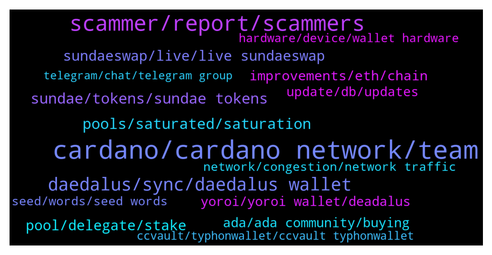

# **@Cardano**
 ## Analysis for **2022-01-23** - **2022-01-30**.

---

## 📊 **Basic Stats**

**n_messages_sent**: 1550

---

---

## 🔝 **Top keywords and related messages**

1. **cardano, cardano network, team**

    @Lgbeano --- *You have made 5 comments in this channel, none productive or of any value, every comment is complaining.   The roadmap has been set out since the start of cardano, not changed. We are in the basho era now which is scalability.   Did you watch yesterday product update from the iog team?   Also, don't use daedalus, that is a full node wallet, as a standard end user there is no reason to use it really, light wallets have better user experience and designed for such.   If you were around in cardano when staking was implemented you will remember that the experience with that was very frustrating and clunky. But now no one talks about that, it is forgotten. It won't be long before parameters are changed on layer 1 and all this will be forgotten.  Welcome to innovation and never achieved before development.   It's early days, if the experience is too bad then maybe come back in a few months, there is no rush to use the system, why do something that is causing you such frustration?   There is so much development and innovation going on at the moment beyond the standard dexes or crypto audience targeted products. Why not get yourself stuck into something more productive and positive than simply moaning with no value.* **--->** [TG Discussion](https://t.me/Cardano/776415)

    @Lgbeano --- *This is a great community built map which shows just some of what's happening on Cardano   https://www.cardanocube.io/cardano-ecosystem-interactive-map* **--->** [TG Discussion](https://t.me/Cardano/776637)

    @missmaster81 --- *Hi everyone! Noob here to staking cardano.  Can someone help me understand the shelly era wallet?   I was given some instructions to join a staking pool that indicated creating one.  However, I had already created a new wallet and transferred my ada in.  not sure if i need to transfer from my wallet to this shelly era wallet before delegating??? hope this doesn't sound like a stupid question.* **--->** [TG Discussion](https://t.me/Cardano/772890)

    @ExInfernis --- *Just make wallet that is not part of exchange. E.g for cardano: daedalus, yoroi, nami, ccvault, gero. They dont ask for info who you are.* **--->** [TG Discussion](https://t.me/Cardano/771702)

    @colombos1991 --- *I think is more trusted to use cardano wallet that was made by cardano and not other company..* **--->** [TG Discussion](https://t.me/Cardano/771283)

    @dstrategies --- *with the dex launching there will be a lot more transactions ... so very good for cardano, but not so great for user experience until scaling is added. But this is a good problem to have, rather this than not having transactions* **--->** [TG Discussion](https://t.me/Cardano/772279)

2. **scammer, report, scammers**

    @yogidan --- *me too. this is scam right? https://sundaeswap.finance/posts/wen-sundae* **--->** [TG Discussion](https://t.me/Cardano/772189)

    @glitch04 --- *Don't respond to anyone that dm's you acting as support use the channel listed above* **--->** [TG Discussion](https://t.me/Cardano/770562)

    @Magi --- *You need a platform scammer free  Without this   Nothing is possible* **--->** [TG Discussion](https://t.me/Cardano/775590)

    @glitch04 --- *Look at the dm they just sent not even in the group* **--->** [TG Discussion](https://t.me/Cardano/775595)

    @Bernard --- *Off to DMOR.  Thanks again.  Best wishes to all.* **--->** [TG Discussion](https://t.me/Cardano/771981)

    @glitch04 --- *Remember nobody that dm's you is support or admins they are scammers the only support is available in the channel above* **--->** [TG Discussion](https://t.me/Cardano/774141)

3. **daedalus, sync, daedalus wallet**

    @ExInfernis --- *I am using daedalus from 2 years without any problems. Maybe it is too heavy for your system* **--->** [TG Discussion](https://t.me/Cardano/772418)

    @Rambod20 --- *any one else having issues with their Daedalus wallet NOT ONLY syncing/connecting with the node? (I'm not referring to the node taking long time to reach 100% sync. it simply doesn't connect.)* **--->** [TG Discussion](https://t.me/Cardano/775730)

    @The Watcher --- *Will daedalus Support other coins in the future (Cardano Blockchain based coins, erg, coti...)?* **--->** [TG Discussion](https://t.me/Cardano/771792)

    @nonsub --- *I don't get what's so good about blockchain lol. After 2 hrs my ADA transfer from Crypto.com to my daed wallet is still pending* **--->** [TG Discussion](https://t.me/Cardano/771169)

    @TJSP2024 --- *How long does it take during an extended wait? Its been days. I could've just loaded up daedalus it takes days also 😔* **--->** [TG Discussion](https://t.me/Cardano/771901)

    @RealMano --- *Daedalus wallet is taking days to sync with the Blockchain? This is outrageous* **--->** [TG Discussion](https://t.me/Cardano/773359)

4. **pools, saturated, saturation**

    @Tustyrusty --- *I've gone through the 30 participating pools ALL (bar1) are OVER 100% saturation. No-one seems to be concerned/ bothered.* **--->** [TG Discussion](https://t.me/Cardano/774343)

    @DrNo8910 --- *Lower pool sat % pools has a less likely chance to get a block. But this is a simple explanation of it. It gets complicated.* **--->** [TG Discussion](https://t.me/Cardano/771878)

    @LionelG1995 --- *What are the disadvantages of pool saturation?* **--->** [TG Discussion](https://t.me/Cardano/771875)

    @LionelG1995 --- *Awesome cheers, and are there disadvantages for a lower pool saturation %* **--->** [TG Discussion](https://t.me/Cardano/771877)

    @infwonder --- *Hi.. can anyone point me to official document that explains how the pool saturation is calculated please? Thanks!* **--->** [TG Discussion](https://t.me/Cardano/776005)

    @glitch04 --- *It decreases by how much the pool goes over the saturation level* **--->** [TG Discussion](https://t.me/Cardano/772581)

5. **sundae, tokens, sundae tokens**

    @MikeAlano --- *hello, just checking if anybody started receiving Sundae tokens from the stakepools?  thanks* **--->** [TG Discussion](https://t.me/Cardano/776672)

    @Agilmore77 --- *Can we still earn the sundaeswap rewards for staking to their iso scoopers?* **--->** [TG Discussion](https://t.me/Cardano/773414)

    @Eddie --- *Is there a wallet I can get on my phone to stake and get sundae? My laptop just cooked it* **--->** [TG Discussion](https://t.me/Cardano/772765)

    @KurdCobain --- *Hey guys new here, new to staking ADA… getting ready for tomorrow (Sundae) anyone have a good youtube tutorial/article/walkthrough I can start with? Thanks in advance guys ✌🏼* **--->** [TG Discussion](https://t.me/Cardano/772223)

    @Henokappan --- *You will get $SUNDAE from Round 1 since they are looking at the live stake.* **--->** [TG Discussion](https://t.me/Cardano/773627)

    @KimAnna --- *Where can I see my earned staking of sundaeswap?* **--->** [TG Discussion](https://t.me/Cardano/775701)

6. **pool, delegate, stake**

    @peeved82 --- *Still not able to delegate to another stake pool than OccamFi . I go through the process of delegating to another stake pool but I cannot seem to leave OccamFi.  Is the Occamfi pool special and has additional process’s to follow? When I check Cardanoscan I am still Delegated to Occamfi pool.* **--->** [TG Discussion](https://t.me/Cardano/771553)

    @peeved82 --- *There is no acknowledgement of switching Delegators, and no error message.  Just me pushing the Delegate button and getting no response .* **--->** [TG Discussion](https://t.me/Cardano/772301)

    @peeved82 --- *How do I know it is changed, nothing on my Yoroi wallet shows the new Delegated Pool, no new transactions.* **--->** [TG Discussion](https://t.me/Cardano/771918)

    @missmaster81 --- *Thanks for being responsive!  Got it.  when i noticed the claim/transfer tab had the whole shelly/byron thing, i became confused.  OK!  Great. Going to delegate.* **--->** [TG Discussion](https://t.me/Cardano/772904)

    @JR --- *question... how can I determine which stake pool I've stake my ADA with? I don't remember, and having sync issues with Daedalus to check.  Looking for an alternate way to see which pool my ADA is staked with to see if I qualify for Sundae Swap drop on Tuesday.  Thanks* **--->** [TG Discussion](https://t.me/Cardano/774026)

    @peeved82 --- *The only Delegation History is from 3 months ago where I staked to Occamfi.* **--->** [TG Discussion](https://t.me/Cardano/771930)

7. **sundaeswap, live, live sundaeswap**

    @dstrategies --- *sundaswap has not launched yet (on the main net)* **--->** [TG Discussion](https://t.me/Cardano/772298)

    @bongs.btc --- *I'm sorry  to ask this question here . can we swipe    on sundaeswap  already  ?* **--->** [TG Discussion](https://t.me/Cardano/773481)

    @notPoetEnough --- *I'm a little late to the party but just want to confirm that Sundaeswap is pretty much completely unusuable right now, correct?* **--->** [TG Discussion](https://t.me/Cardano/774918)

    @David --- *Can anyone explain what SundaeSwap is?* **--->** [TG Discussion](https://t.me/Cardano/772225)

    @Dandimatt --- *Hello is this the right place for a question about sundaswap?* **--->** [TG Discussion](https://t.me/Cardano/770037)

    @atc1235 --- *Guys are you worried about sundaeswap's launch?  I'm a bit worried because they said some hogging is expected, but the vast majority of the people isn't aware of that, and i think this will cause a lot of FUD. Thoughts?* **--->** [TG Discussion](https://t.me/Cardano/772258)

8. **improvements, eth, chain**

    @CalusB --- *What embarrassment ? Chain is running great. It’s literally at max and I can send and receive transactions in minutes still. Even sundae swap transactions are reasonable still. And all at decent cost. Considering this is all done with almost no improvements it’s quite impressive* **--->** [TG Discussion](https://t.me/Cardano/774798)

    @Mrck --- *I hope someone at iohk can read this. Changing parameters twice in less than a month is a big f up and now the sentiment is rather bad from a lot of users as a consequence of that. You guys formally test everything, these changes should have been done in q3 2021 when the congestion kicked off frequently &  spiking non stop. It was noticeable & a lot more community was involved with the chain releasing artifacts. As a person who's released software pieces in several countries I have never had to pass from tier to tier in sizes this often to overcome saturation in usage to play with the boundaries. The team at sundaeswap warned about this saturation issue with time in advanced yet the reaction was rather naive and poor. It's said many times that there are 200 dapps in the making. The colapse in the network will continue if some perhaps the  Infrastructure leader inside iohk does not put on a firm year plan to retain. All the best with next epochs script size allocation.* **--->** [TG Discussion](https://t.me/Cardano/774018)

    @apex_pool_spo --- *no, where did you get that impression from? it is actually going to be worse for a period, when other DEXes will also lunch, but in a few months (my expectation) we will see some big improvements. there is also a hard fork schedules for February (theoretically), I am not sure if the CIP31, CIP32 and CIP33 will be included or not. If yes, we will see the improvements much sooner.* **--->** [TG Discussion](https://t.me/Cardano/775810)

    @Lgbeano --- *@CalusB : Once these improvements come in we can be sure even higher transaction volumes will at most be a mild inconvenience and not break the chain like Sol or the ridiculous fees in eth I have eth positions on chain I literally can’t unwind because it would cost more then it’s worth* **--->** [TG Discussion](https://t.me/Cardano/774805)

    @CalusB --- *Wow this auto bot is kinda insane. Both our competitors have issues with super high volume either completely rendering the chain unusable or fees so high that it’s virtually unusable for regular transactions* **--->** [TG Discussion](https://t.me/Cardano/774802)

    @CalusB --- *Are you serious? Have you been living under a rock they have launched like 3 blog posts multiple videos and there are improvements coming in both the February hard fork and June hard fork as well as improvements in node and block size in the coming weeks* **--->** [TG Discussion](https://t.me/Cardano/774794)

9. **ada, ada community, buying**

    @Angel --- *I have a question. What are the benefits of holding a huge amount of ada?. If over time the transactions fees will be lower than 0.17ADA. It's very unlikely that we need 5k ada or more. Realistically we will never transact that much. Due to the extreme volatility of ada It's not a practical medium of exchange. We will likely use Djed or other stable coins so it'd be better to just buy djed instead. There is more utility in using tokens developed in the cardano blockchain than to have ada itself* **--->** [TG Discussion](https://t.me/Cardano/776604)

    @crnicripto81 --- *it could be good for Ada .....* **--->** [TG Discussion](https://t.me/Cardano/776987)

    @BabyImReckless --- *hey, I'm just wanting to know what the difference between Bep20 and just your standard ADA?  it all benefits ADA?* **--->** [TG Discussion](https://t.me/Cardano/770260)

    @Paradigm7 --- *Is this for ADA? Exodus apply?* **--->** [TG Discussion](https://t.me/Cardano/772596)

    @Braine --- *What’s the community doing to ensure ADA is back up in a few days?* **--->** [TG Discussion](https://t.me/Cardano/773420)

    @Investinme2019 --- *Realizing that the ada community moved from twitter. I used to get answers in seconds, but anymore.* **--->** [TG Discussion](https://t.me/Cardano/775173)

10. **yoroi, yoroi wallet, deadalus**

    @cryptoshaun --- *Hello I’m in a pool for sundeaswap tokens but I use yoroi wallet does that mean I won’t get them* **--->** [TG Discussion](https://t.me/Cardano/771373)

    @Agilmore77 --- *Does sundaeswap not support the yoroi wallet?* **--->** [TG Discussion](https://t.me/Cardano/773408)

    @glitch04 --- *if exodus supports native assets in their wallet you would need to verify that with exodus/Sundae* **--->** [TG Discussion](https://t.me/Cardano/772599)

    @Joshua --- *I dont mind holding sundade until yoroi web app is compatible with sundadeswap* **--->** [TG Discussion](https://t.me/Cardano/774061)

    @CryptoM22 --- *where do the SundaeSwap tokens end up?  which wallet do you need, I work with yoroi en ledger.* **--->** [TG Discussion](https://t.me/Cardano/771013)

    @cryptoshaun --- *@Zyroxa Hello I’m in a pool for sundeaswap tokens but I use yoroi wallet does that mean I won’t get them* **--->** [TG Discussion](https://t.me/Cardano/771376)

11. **update, db, updates**

    @glitch04 --- *only available update that I am aware of https://sundaeswap.finance/posts/wen-sundae* **--->** [TG Discussion](https://t.me/Cardano/776382)

    @shoemafia --- *Ok, so I’m guessing it’s normal for now.. so reckon we just wait for an update? Or* **--->** [TG Discussion](https://t.me/Cardano/770557)

    @glitch04 --- *Nope, for updates stay tuned to their projects channels for the latest information* **--->** [TG Discussion](https://t.me/Cardano/776681)

    @lassikem --- *I hope they fix this issue as soon as possible.* **--->** [TG Discussion](https://t.me/Cardano/770561)

    @Zyroxa --- *definitly but as far as i know this wont be changed* **--->** [TG Discussion](https://t.me/Cardano/776410)

    @apex_pool_spo --- *there was a parameter change, but it was something minor, we won't see noticeable improvements from that (my personal guess).* **--->** [TG Discussion](https://t.me/Cardano/775812)

12. **network, congestion, network traffic**

    @mostudio --- *was always working. network traffic was slow* **--->** [TG Discussion](https://t.me/Cardano/771358)

    @glitch04 --- *That means the network is under high load but there is nothing can be done but wait for a place in line* **--->** [TG Discussion](https://t.me/Cardano/774129)

    @Zyroxa --- *The network is currently under heavy load.* **--->** [TG Discussion](https://t.me/Cardano/776986)

    @gmark --- *Well were getting heat, like ppl mocking this network, and Im just looking for what we know to also relay this feedback.* **--->** [TG Discussion](https://t.me/Cardano/774804)

    @Mets432 --- *Is this due to congestion? Should i just wait?* **--->** [TG Discussion](https://t.me/Cardano/773116)

    @FlamingElim --- *Can you pls help what is happening ?* **--->** [TG Discussion](https://t.me/Cardano/773469)

13. **seed, words, seed words**

    @TJSP2024 --- *So just to be sure, any restored wallet can be deleted and restored again with the original seed words used right? Not only the new seed words for the new restored wallet right?* **--->** [TG Discussion](https://t.me/Cardano/772616)

    @glitch04 --- *The seedwords you have are the master key to the wallets anyone that controls them is able to control the wallet and restore yes* **--->** [TG Discussion](https://t.me/Cardano/772617)

    @glitch04 --- *it's safe as long as you keep those recovery seed words safe that's why the scammers try to get them* **--->** [TG Discussion](https://t.me/Cardano/770578)

    @Go_Blue --- *Hi 👋……Anyway to track down the clown that stole my seed phrase and wiped out all of my Cardano?* **--->** [TG Discussion](https://t.me/Cardano/770168)

    @Lgbeano --- *Have you recently entered your seed words into a website looking like nami wallet website?* **--->** [TG Discussion](https://t.me/Cardano/773768)

    @cryptoustt --- *testing if I can type word "muesli" here* **--->** [TG Discussion](https://t.me/Cardano/775887)

14. **hardware, device, wallet hardware**

    @glitch04 --- *You would need to create a wallet with the device and transfer everything over to that new hardware secured wallet* **--->** [TG Discussion](https://t.me/Cardano/771819)

    @colombos1991 --- *So you can say that to use hardware wallet with Adalite os better than to use deadalus without hardware wallet?* **--->** [TG Discussion](https://t.me/Cardano/771277)

    @glitch04 --- *No need to transfer the data is on the block chain not the wallet interface just be careful where you enter those recovery seeds as they are the master key to your wallet* **--->** [TG Discussion](https://t.me/Cardano/770575)

    @colombos1991 --- *What you mean is light version? Is less safe?* **--->** [TG Discussion](https://t.me/Cardano/771266)

    @Naheem --- *Thanks for the info dont know how these wallets work lol* **--->** [TG Discussion](https://t.me/Cardano/770618)

    @glitch04 --- *Hardware devices can't be used to sign the transactions currently* **--->** [TG Discussion](https://t.me/Cardano/776167)

15. **ccvault, typhonwallet, ccvault typhonwallet**

    @MattyIce2100 --- *if you have yoroi shelly key you can use it in ccvault* **--->** [TG Discussion](https://t.me/Cardano/770923)

    @apex_pool_spo --- *you can always switch to ccvault.* **--->** [TG Discussion](https://t.me/Cardano/773822)

    @Niro01 --- *I hope with ccwallet I dont face the same issue.* **--->** [TG Discussion](https://t.me/Cardano/773833)

    @Alentype --- *try cc vault worked for me* **--->** [TG Discussion](https://t.me/Cardano/773337)

    @apex_pool_spo --- *(not the website version of ccvault.io)* **--->** [TG Discussion](https://t.me/Cardano/773137)

    @myholosma --- *i know but i cant even take it out now to sent it to cc vault* **--->** [TG Discussion](https://t.me/Cardano/773341)

