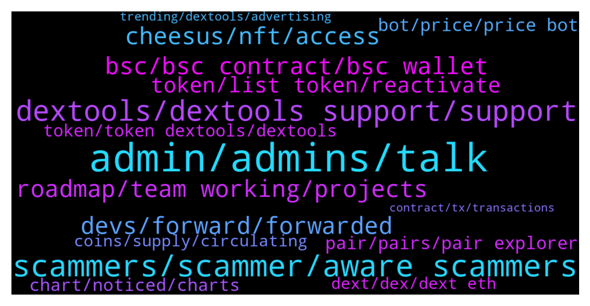

# **@DEXToolsCommunity**
 ## Analysis for **2022-01-23** - **2022-01-30**.

---

## 📊 **Basic Stats**

**n_messages_sent**: 868

---

---

## 🔝 **Top keywords and related messages**

1. **admin, admins, talk**

    @hmk18990 --- *For the news, advertisements, sponsorships please DM @guillermorodriguez78 he's the only in charge (and he'll never DM you first)* **--->** [TG Discussion](https://t.me/DEXToolsCommunity/326896)

    @NikoDikooo --- *No worries. Take your time. I will provide a screenshot via DM if needed for accurate numbers et cetera. Going to sleep now since I live in Sweden. We’ll be in touch 🙏* **--->** [TG Discussion](https://t.me/DEXToolsCommunity/328186)

    @kingkhalil --- *Sorry, I only talk to admins 🤐* **--->** [TG Discussion](https://t.me/DEXToolsCommunity/329663)

    @hmk18990 --- *as I said before. he's the only one. so no other admin can help you about this.* **--->** [TG Discussion](https://t.me/DEXToolsCommunity/326905)

    @napascual --- *Sure, just remember admins never dm first* **--->** [TG Discussion](https://t.me/DEXToolsCommunity/326413)

    @bastardganpunk --- *For ads and marketing please send a DM to @guillermorodriguez78  Admins NEVER DM FIRST* **--->** [TG Discussion](https://t.me/DEXToolsCommunity/329400)

2. **scammers, scammer, aware scammers**

    @bastardganpunk --- *That means a scammer DMed you! Careful please, no admin will ever DM you first!* **--->** [TG Discussion](https://t.me/DEXToolsCommunity/329668)

    @JoeyDieleman --- *Also no calls, watch out for scammers!* **--->** [TG Discussion](https://t.me/DEXToolsCommunity/326620)

    @bastardganpunk --- *no, he can’t, he’s a scammer* **--->** [TG Discussion](https://t.me/DEXToolsCommunity/327660)

    @stanes --- *I don't have any message from you. Be aware of scammers.* **--->** [TG Discussion](https://t.me/DEXToolsCommunity/327696)

    @jointhefuture4_0 --- *ah no, its a scammer indeed, with your username in his bio* **--->** [TG Discussion](https://t.me/DEXToolsCommunity/326683)

    @stanes --- *This is a support channel, I prefer people here being aware scammers are around.* **--->** [TG Discussion](https://t.me/DEXToolsCommunity/328582)

3. **dextools, dextools support, support**

    @badrfardane --- *I just thought that if it still possible to do it on Dextools App so it still available* **--->** [TG Discussion](https://t.me/DEXToolsCommunity/328678)

    @Cryptojosu563 --- *I want to learn Dextools work* **--->** [TG Discussion](https://t.me/DEXToolsCommunity/329109)

    @bastardganpunk --- *This video explains you how to use dextools https://youtu.be/WFQRJUnPwH8* **--->** [TG Discussion](https://t.me/DEXToolsCommunity/329351)

    @gumbercules --- *Can you explain please? What DEXTv2?* **--->** [TG Discussion](https://t.me/DEXToolsCommunity/327346)

    @bastardganpunk --- *you can do to dextools.io and buy directly on the dextools platform (see links)  Here is a video about how to use dextools 🙂 https://youtu.be/WFQRJUnPwH8* **--->** [TG Discussion](https://t.me/DEXToolsCommunity/327908)

    @hani_disclosed --- *How come? The dex launch yesterday* **--->** [TG Discussion](https://t.me/DEXToolsCommunity/327473)

4. **devs, forward, forwarded**

    @bastardganpunk --- *I will forward it to the devs. Please be a bit patient, they will fix it asap 🙂* **--->** [TG Discussion](https://t.me/DEXToolsCommunity/328185)

    @FredericDEXT --- *Ok, thanks for confirming ,it's already reported to the devs* **--->** [TG Discussion](https://t.me/DEXToolsCommunity/326562)

    @Monolithof --- *Ok the issue has been solved. Im back to standard account again* **--->** [TG Discussion](https://t.me/DEXToolsCommunity/325826)

    @FredericDEXT --- *We will check, but it should be the same* **--->** [TG Discussion](https://t.me/DEXToolsCommunity/326560)

    @kemosabemontoya --- *I see you have Fantom and Cronos live! Great Updates team!* **--->** [TG Discussion](https://t.me/DEXToolsCommunity/325812)

    @bastardganpunk --- *The green line is strange though… I will forward it to the devs* **--->** [TG Discussion](https://t.me/DEXToolsCommunity/327388)

5. **roadmap, team working, projects**

    @JoeyDieleman --- *Team is working on an update of the roadmap* **--->** [TG Discussion](https://t.me/DEXToolsCommunity/327503)

    @stanes --- *That's what you will know thanks to the roadmap 😄 + some surprises because team likes keeping secrets 😉* **--->** [TG Discussion](https://t.me/DEXToolsCommunity/327537)

    @nimrod620 --- *Hey do we have a roadmap or something* **--->** [TG Discussion](https://t.me/DEXToolsCommunity/327500)

    @nimrod620 --- *Just curious what the plan is for 2022 and what the team is working on to get us to the next level* **--->** [TG Discussion](https://t.me/DEXToolsCommunity/327525)

    @stanes --- *New roadmap will be out soon, stay tuned!* **--->** [TG Discussion](https://t.me/DEXToolsCommunity/327527)

    @xbtwael --- *What aresome features that set you apart from other projects and what competitive advantage do you have?* **--->** [TG Discussion](https://t.me/DEXToolsCommunity/326067)

6. **bsc, bsc contract, bsc wallet**

    @gumbercules --- *lower fees on BSC but less decentralized chain* **--->** [TG Discussion](https://t.me/DEXToolsCommunity/327928)

    @eou2020 --- *how does the total supply of 150M work with both networks ethereum and bsc* **--->** [TG Discussion](https://t.me/DEXToolsCommunity/325885)

    @NikoDikooo --- *Hey Mooncat :) I have had questions from our community regarding this chart:  https://www.dextools.io/app/ether/pair-explorer/0xe7396f3210e93ba146468babf081141511ce2ef3  The current MCAP is actually around 7 million at the moment since all tokens aren’t in circulating supply. Can this be corrected/added to the Shiburai chart?* **--->** [TG Discussion](https://t.me/DEXToolsCommunity/328184)

    @bitmart255 --- *Any update about BSC token newly listed* **--->** [TG Discussion](https://t.me/DEXToolsCommunity/326854)

    @MOONLIGGHTTT --- *i didnt check before puting in 1 bnb* **--->** [TG Discussion](https://t.me/DEXToolsCommunity/327219)

    @rpoole69 --- *Good morning, BSC contract 0xF2A92BC1Cf798fF4De14502a9C6FdA58865e8D5d Thorium V2 on DEXTools shows 6,810 Holders and 2,660 TX, yet in BSCScan, 15,344 Holders and 29,526 TX* **--->** [TG Discussion](https://t.me/DEXToolsCommunity/329265)

7. **cheesus, nft, access**

    @xbtwael --- *I saw Cheesus launched  https://cheesus.ai/en/main can you share what that is?* **--->** [TG Discussion](https://t.me/DEXToolsCommunity/326058)

    @xbtwael --- *I saw the ILO is currently live right now! Can you share where people can get involved with the Cheesus IDO?* **--->** [TG Discussion](https://t.me/DEXToolsCommunity/326090)

    @xbtwael --- *Can you explain what Cheesus is? and what you guys are hoping to achieve?* **--->** [TG Discussion](https://t.me/DEXToolsCommunity/326054)

    @Natalia_Ave --- *Cheesus is a multi-chain DeFi analyzer that helps users find real gems without getting caught in any mouse traps focused on NFT Metaverses.   We scan blockchains like google scan the internet, where you can find anything and besides open, easy to find and easy to use info we give inside information like real movements of token, amount of bots, fake and insiders wallets. After all this data helps you to decide whether the project is worth investing in or not.  Our main goal is to give onchain truth to users including all DeFi segments like NFT Metaverses, Trading, token movements, insiders info about token holders, flippers & diamond hands. done* **--->** [TG Discussion](https://t.me/DEXToolsCommunity/326056)

    @xbtwael --- *As you mentioned Cheesus is Multichain, how do you guys choose and or prioritize different networks to add to your platform?* **--->** [TG Discussion](https://t.me/DEXToolsCommunity/326075)

    @xbtwael --- *After the succesful fundraise, a common challenge for DeFi protocols seem to be adoption. What are some of the plans to stimulate adoption and build out the ecosystem around Cheesus?* **--->** [TG Discussion](https://t.me/DEXToolsCommunity/326098)

8. **token, list token, reactivate**

    @Uturn --- *One more question, regards to the price alert feature, is there a way that Dev team can create a one reactivate button to reactivate all the price alert within one token? It’s really a hassle to reactivate one by one for just one token.* **--->** [TG Discussion](https://t.me/DEXToolsCommunity/325572)

    @MoonstellarMoe --- *@admins can I list my token on your official website???* **--->** [TG Discussion](https://t.me/DEXToolsCommunity/327791)

    @MasterCryptoHolic --- *Else for previously bought token that's not possible automatically ?* **--->** [TG Discussion](https://t.me/DEXToolsCommunity/329560)

    @MasterCryptoHolic --- *In "my position" doesn't it auto track where I bought in and where I am currently for a token ?* **--->** [TG Discussion](https://t.me/DEXToolsCommunity/329556)

    @DODZILLA_CN --- *How do I add my token information?* **--->** [TG Discussion](https://t.me/DEXToolsCommunity/325702)

    @JoeyDieleman --- *Please give the contract of the token.* **--->** [TG Discussion](https://t.me/DEXToolsCommunity/325986)

9. **pair, pairs, pair explorer**

    @NoOne19944991 --- *Hi BSC hot pairs has issue Not show all of them* **--->** [TG Discussion](https://t.me/DEXToolsCommunity/329116)

    @AbdoMelody --- *This pair is down can you chec plz https://www.dextools.io/app/bsc/pair-explorer/0xcdf0ae9dcdcadb4949338feb7ea7684ddc47c130* **--->** [TG Discussion](https://t.me/DEXToolsCommunity/327753)

    @rpoole69 --- *This pair is acting very strange, displaying duplicates, pauses for 30s then shows a bunch, etc bsc/pair-explorer/0x1ce76390dd210b9c9ae28373fdf79714206ecb73* **--->** [TG Discussion](https://t.me/DEXToolsCommunity/326530)

    @gumbercules --- *There's no one to contact for hot pairs/trending sir. It's data from the blockchains* **--->** [TG Discussion](https://t.me/DEXToolsCommunity/327466)

    @stanes --- *Please be aware we show all the pairs available on the blockchain. Old pairs, scams,... we add warnings but never remove a pair.* **--->** [TG Discussion](https://t.me/DEXToolsCommunity/328682)

    @napascual --- *Hot Pairs depends on a custom algorithm which is undisclosed, so please don't ask about it  We don't accept payments for trending / hot pairs, you can pay scammers for this but it won't work!* **--->** [TG Discussion](https://t.me/DEXToolsCommunity/327579)

10. **bot, price, price bot**

    @kingkhalil --- *The issue is that I have set the price bot in the group but it does not let us know about the price* **--->** [TG Discussion](https://t.me/DEXToolsCommunity/329670)

    @JoeyDieleman --- *You don't pay for that  if you mean to let the price bot show charts it has to be available in dextools. Remember to set the PAIR contract, not the contract itself.  See this: https://link.medium.com/rvhhUpbSSmb* **--->** [TG Discussion](https://t.me/DEXToolsCommunity/325877)

    @Jack_the_Crypto --- *Got some issue by adding dex price bot. Setted pair, but after adking price its shows no pair found 😂  Used command to set price /set_pair 1 bsc 0xfbd57367524b389425c4adfb5a6f97b0e7ad3690* **--->** [TG Discussion](https://t.me/DEXToolsCommunity/329253)

    @louisparallel --- *How can i config the Price Bot showing Marketcap ?* **--->** [TG Discussion](https://t.me/DEXToolsCommunity/327681)

    @Asaprox --- *as for "bots", are there any pre-set bots?* **--->** [TG Discussion](https://t.me/DEXToolsCommunity/328039)

    @kingkhalil --- *What does it mean I have set DexScreener price bot to the group but it gives this message??????????* **--->** [TG Discussion](https://t.me/DEXToolsCommunity/329664)

11. **chart, noticed, charts**

    @nate102 --- *Normally it’s okay but at times like that it makes it look like chart is at all time high when it’s not even close* **--->** [TG Discussion](https://t.me/DEXToolsCommunity/327403)

    @TBGOATOFFICIAL --- *Whenever you try go on the chart* **--->** [TG Discussion](https://t.me/DEXToolsCommunity/327497)

    @nate102 --- *It’s just the launch of tokens doesn’t sync correctly to the chart* **--->** [TG Discussion](https://t.me/DEXToolsCommunity/327397)

    @Mojomagick --- *Can you add monthly time frame to you charts please* **--->** [TG Discussion](https://t.me/DEXToolsCommunity/327024)

    @nate102 --- *You can see the charts are the same after the first 5-8 mins* **--->** [TG Discussion](https://t.me/DEXToolsCommunity/327396)

    @bastardganpunk --- *Yes this is correct, it’s the chart, you noticed well 👍🏻* **--->** [TG Discussion](https://t.me/DEXToolsCommunity/327406)

12. **token, token dextools, dextools**

    @MoonstellarMoe --- *I mean how can I get to have folks go on the dextools. io and view my token on there sir?* **--->** [TG Discussion](https://t.me/DEXToolsCommunity/327795)

    @tehkosongpeng --- *hi, can i check whats the process for getting a token listed on dextools?* **--->** [TG Discussion](https://t.me/DEXToolsCommunity/327087)

    @big_wolf_bad --- *hello, quick question. how does DexTools calculate token volume number that is displayed on the token page? Does it include only trades with DEX, or all the transfers made (all Transfer events)?* **--->** [TG Discussion](https://t.me/DEXToolsCommunity/327296)

    @Astromooner --- *Hi how does a token update their details that are not showing on dextool eg website address* **--->** [TG Discussion](https://t.me/DEXToolsCommunity/329402)

    @Ri_maxy --- *Hello. I need assistance with retrieving dext token into my wallet* **--->** [TG Discussion](https://t.me/DEXToolsCommunity/325869)

    @ryadav707 --- *Hey Admin can i sell our Metawar token from Dextools ..?* **--->** [TG Discussion](https://t.me/DEXToolsCommunity/327169)

13. **coins, supply, circulating**

    @trojantechltd --- *Says no activity , but it’s at 5 cents not 1 cent* **--->** [TG Discussion](https://t.me/DEXToolsCommunity/326504)

    @bastardganpunk --- *yes you’re right. if you noticed more coins which are not updated, don’t hestitate to paste the links here. i forwarded it to the devs* **--->** [TG Discussion](https://t.me/DEXToolsCommunity/325567)

    @badrfardane --- *I lost this coins then ?* **--->** [TG Discussion](https://t.me/DEXToolsCommunity/328652)

    @MrWhale01 --- *Hey guys, how to add project's circulating supply to info? Shows only total supply* **--->** [TG Discussion](https://t.me/DEXToolsCommunity/328804)

    @Alexrvt --- *+, I can confirm that the price alert in binance is not working* **--->** [TG Discussion](https://t.me/DEXToolsCommunity/326561)

    @DrBrickFlair --- *Where it displays every block, poocoin has a slider up top…it’s great for scalping 0 tax coins… Wasn’t sure if you had it under a different name* **--->** [TG Discussion](https://t.me/DEXToolsCommunity/326704)

14. **dext, dex, dext eth**

    @MOONLIGGHTTT --- *CAN DEXT SUPPORT DO ANYTHING ABOUT IT* **--->** [TG Discussion](https://t.me/DEXToolsCommunity/327258)

    @thorex30 --- *DEXT is available on matic too?* **--->** [TG Discussion](https://t.me/DEXToolsCommunity/328094)

    @Snodes88 --- *So if I buy 1000 dext via bsc I can use dextools?* **--->** [TG Discussion](https://t.me/DEXToolsCommunity/327890)

    @badrfardane --- *I have Eth, Mana and DEXT* **--->** [TG Discussion](https://t.me/DEXToolsCommunity/328613)

    @leech_dev --- *Oh, I see... So it means there's no way to get "Dext score" like Dextools, right?* **--->** [TG Discussion](https://t.me/DEXToolsCommunity/329207)

    @JoeyDieleman --- *Ok, if proto isn't on a supported dext it won't show. If you want your dex to be supported you xan request it. But there is alist already and dexes are choosen by its usage.* **--->** [TG Discussion](https://t.me/DEXToolsCommunity/328403)

15. **trending, dextools, advertising**

    @Godsonisstilldamademan --- *When is Saitama paid ad for trending will runs out? Asking for a friend* **--->** [TG Discussion](https://t.me/DEXToolsCommunity/327524)

    @wikkibikki --- *Is the price for Dextool advertisement* **--->** [TG Discussion](https://t.me/DEXToolsCommunity/328480)

    @mohammad721372 --- *Who should i contact with for advertising my project on DEXTools?* **--->** [TG Discussion](https://t.me/DEXToolsCommunity/327585)

    @Dannie970 --- *How do I apply for dextool trending?* **--->** [TG Discussion](https://t.me/DEXToolsCommunity/327922)

    @MoonstellarMoe --- *Whom can I talk about promoting and listings? @admins* **--->** [TG Discussion](https://t.me/DEXToolsCommunity/327790)

    @xxxxxxxqe --- *Hey all, how to do marketing on dextools* **--->** [TG Discussion](https://t.me/DEXToolsCommunity/326196)

