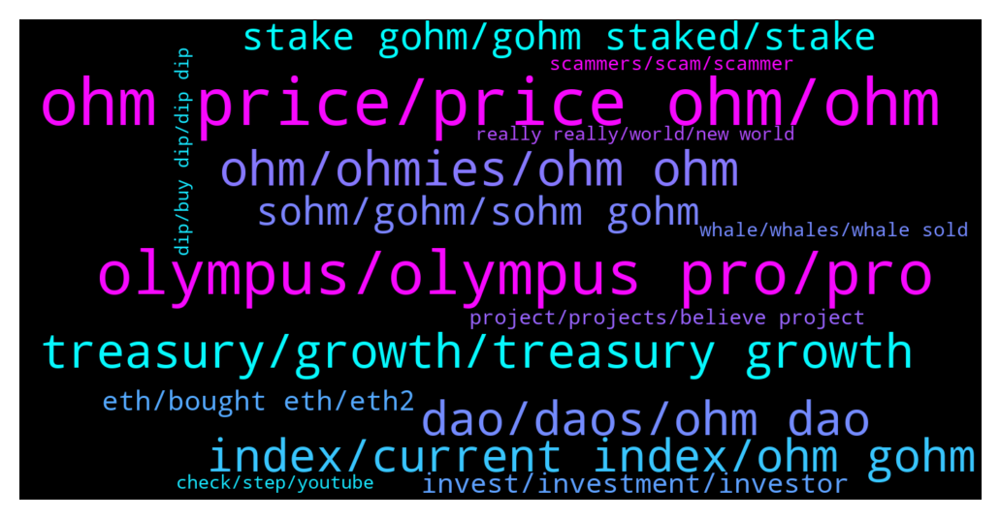

# **@OlympusTG**
 ## Analysis for **2022-01-23** - **2022-01-30**.

---

## 📊 **Basic Stats**

**n_messages_sent**: 10906

---

---

## 🔝 **Top keywords and related messages**

1. **ohm price, price ohm, ohm**

    @Sebastian --- *There is no hope for OHM with mathematicians like you... loosing 90% means he bought OHM for about 700$* **--->** [TG Discussion](https://t.me/OlympusTG/168025)

    @Psycho_ward --- *Mate the $$ is more important then the amount of OHM,thats what u cash out with in the end* **--->** [TG Discussion](https://t.me/OlympusTG/154259)

    @Decothegreat --- *ohm has left me with no money to afford steak* **--->** [TG Discussion](https://t.me/OlympusTG/165226)

    @Ahmad --- *Not trying to be negative but the price of Ohm is worrying me a bit. I know Ohm team got plans and all but I am just worried about the price drop.* **--->** [TG Discussion](https://t.me/OlympusTG/153256)

    @Jay --- *If you love ohm at $800 you should love it with everything at $100* **--->** [TG Discussion](https://t.me/OlympusTG/158309)

    @will108 --- *Wat happened to ohm price? Havent been checking for a month* **--->** [TG Discussion](https://t.me/OlympusTG/171808)

2. **olympus, olympus pro, pro**

    @vipdent --- *I bought on Friday at $70  Totally newbie with Ohm and staking etc  ( I have some other cryptos but all in wallet ).   Very easy - once you have done it :-)  Transfer money to an exchange ( I use Binance but any big exchange will do).   Open a MetaMask account.  ( chrome extension or phone app).  Write down your 12 words.  ( do not share with anyone - ever).   In your exchange buy ETH with your currency.  Withdraw all the ETH to the address from MetaMask  ( the blue long address).   After 2-3 minutes the ETH appear in MetaMask.   Go to Olympus.finance  Click ( tap) enter app Then click wallet.  Then get on sushiswap or get on uniswap.  ( sushiswap didn’t work for me.  Transaction timed out 3 times.  So I used uniswap).   In uniswap, tap on connect wallet.   Go back to MetaMask.  It should ask you if you want to connect.  There is a small gas fee.  Click accept.  ( in my case nothing happened.  I had to close MetaMask.  Open it again - and then the window appeared)  Now uniswap ( or sushiswap) can see your wallet.  Select “from “ ETH.  It will show you your ETH balance.  Select “TO” ohm v2  Do not select MAX.  I did this mistake.  Leave £15 ( $20) for gas fees.  I had to transfer again.  I didn’t have enough for the bloody gas fees.   And convert to ohm v2.   Now import the token ohm.  Address of ohm can be found on their DOCs. Their website.   https://docs.olympusdao.finance/main/contracts/tokens  You need ohm v2.  Somewhere in the middle.   Add this token in MetaMask.  Your balance will appear.  I also added sohm and gohm in MetaMask wallet.  All addresses from their website above.   Then go to Olympus.  Tap wallet.  Connect.  Go back to MetaMask to approve the connection.  ( in my case didn’t work again. Close MetaMask. Open it again.  The window appears.  Approve connection. )  Now you can stake.  Max.  I chose sOHM.   Again you need to approve it in MetaMask.  There are again gas fees :(  That’s it.   Good luck.   It took me 4-5 hours to do it.  I feel you.   If any issues, reply here.* **--->** [TG Discussion](https://t.me/OlympusTG/168905)

    @Keegan --- *If you work for Olympus you should care about my money!* **--->** [TG Discussion](https://t.me/OlympusTG/153056)

    @alfredojpontara --- *hallo, i want to withdraw all my olympus from olympus staking. i unstake gohm from staking and now i can see my ohm in te website olympus but not in my wallet. how can i switch my olympus from site to my wallet? thanks* **--->** [TG Discussion](https://t.me/OlympusTG/152097)

    @Derrick --- *Hello I am new to the group but wanted to share something that may help save on Gas fees. Not sure if many of you are aware but you can buy OHM on hotbit exchange with usdt for minimum trading fees, then send to metamask and stake on Olympus. This way you can avoid high swamping fees, and only have to pay the staking fee. Also since the market is down, its a great time to buy!* **--->** [TG Discussion](https://t.me/OlympusTG/160654)

    @D --- *I guess this experiment of Olympus really didnt result in the way I expected for me. They did say only invest what ur willing to loose and so I did. This was a well spent and well learnt lesson with DAO's for me. Good luck to u all and I genuinely wish you all the best with your financial crypto pursuits. Peace out, 1 love ✌* **--->** [TG Discussion](https://t.me/OlympusTG/156995)

    @lars900 --- *What really shocks me, is that the olympus price is even under the low from may* **--->** [TG Discussion](https://t.me/OlympusTG/159213)

3. **ohm, ohmies, ohm ohm**

    @whcheong2008 --- *im only saying this because i think ohm is a great project, could be done better that's all. i'll rest my case here, say whatever you will* **--->** [TG Discussion](https://t.me/OlympusTG/155054)

    @Rory --- *Whoa! Had Ohm for a long time hold. Deserve to bitch about it* **--->** [TG Discussion](https://t.me/OlympusTG/152624)

    @nfwaple --- *it is so mind blowing the numbers of fudders we have today, if I am not an Ohmie I wouldn't even be here in the first place, if I am an Ohmie I won't be making comments that don't do anything for the community* **--->** [TG Discussion](https://t.me/OlympusTG/154879)

    @VincentStatic --- *No. I still love Ohm. But its not perfect* **--->** [TG Discussion](https://t.me/OlympusTG/167288)

    @fairwinds --- *What is the purpose of OHM ? No idea what it does or is trying to do ?* **--->** [TG Discussion](https://t.me/OlympusTG/155932)

    @fairwinds --- *Just found this OHM medium article. It’s a very long read : https://medium.com/@game_theorizing/of-smoke-and-mirrors-part-2-the-godsfather-cd24ff7476da* **--->** [TG Discussion](https://t.me/OlympusTG/158117)

4. **treasury, growth, treasury growth**

    @Cixex --- *I thought that when price goes down, devs mop up coin , when price is up, devs sell to boost treasury.* **--->** [TG Discussion](https://t.me/OlympusTG/152607)

    @Removsk --- *What use is the treasury of it can't help us right now, I wonder!* **--->** [TG Discussion](https://t.me/OlympusTG/164799)

    @vdt153 --- *lets see if the treasury is really going to be distributed as you say. no point selling at these prices* **--->** [TG Discussion](https://t.me/OlympusTG/165109)

    @Pepe --- *When price touch 70 treasury will be 30* **--->** [TG Discussion](https://t.me/OlympusTG/158697)

    @King_alts --- *Lol thats risk free treasury,  but even the treasury is declining so money being moved...* **--->** [TG Discussion](https://t.me/OlympusTG/158943)

    @Device --- *Anyone know the current treasury amount at the moment? How does one find this info?* **--->** [TG Discussion](https://t.me/OlympusTG/172447)

5. **dao, daos, ohm dao**

    @Mike_Wrekt --- *Why all daos are at - 70 to - 90% down? All scam?* **--->** [TG Discussion](https://t.me/OlympusTG/155498)

    @wokenot --- *Was it them?.. I saw someone say the Daos would take a hit, but couldn't remember who.* **--->** [TG Discussion](https://t.me/OlympusTG/156799)

    @bike4peace --- *go into the DAO and contribute, then you will see what is going on 😉* **--->** [TG Discussion](https://t.me/OlympusTG/154866)

    @nfwaple --- *they're not even a DAO 😂😂* **--->** [TG Discussion](https://t.me/OlympusTG/157579)

    @Cixex --- *There is a reason all DAO coins are tanking at the same time.* **--->** [TG Discussion](https://t.me/OlympusTG/152311)

    @dibio444 --- *why are all DAOs dumping so hard? is there a bug? its not just OHM* **--->** [TG Discussion](https://t.me/OlympusTG/156649)

6. **index, current index, ohm gohm**

    @theseedoflife --- *How many ohm = 1 gohm?* **--->** [TG Discussion](https://t.me/OlympusTG/159019)

    @EdNgo --- *I wondered, if everyone buy gohm, who gets incentive to buy OHM?* **--->** [TG Discussion](https://t.me/OlympusTG/155027)

    @DIVIdoc --- *Calculator math for those in despair.  If you have 75 sOHM or gOhm equivalent now and we average 750% APY for the next 24 months your bag will be worth $500,000 usd if ohm is just $100.   Let’s quit talking about $1000 ohm (it was too premium).  Let’s focus on sustainability bc if we 3,3 and chill WGMI.* **--->** [TG Discussion](https://t.me/OlympusTG/160886)

    @EdNgo --- *so if gohm goes up the mechanism will make ohm up? Something like that?* **--->** [TG Discussion](https://t.me/OlympusTG/155060)

    @nfwaple --- *as I said OHM at 10 doesn't mean gOHM price is fooked, depending on the timeline* **--->** [TG Discussion](https://t.me/OlympusTG/166890)

    @Palancapa --- *But i dont understand why 1 gOhm continues to gain/include more ohm over time* **--->** [TG Discussion](https://t.me/OlympusTG/173211)

7. **sohm, gohm, sohm gohm**

    @nfwaple --- *gOHM is like a box, sOHM increases inside the box* **--->** [TG Discussion](https://t.me/OlympusTG/165419)

    @Flower --- *gOHM, can you check yours please* **--->** [TG Discussion](https://t.me/OlympusTG/157913)

    @RecoDedon --- *What's the difference to getting the gOHM instead?!* **--->** [TG Discussion](https://t.me/OlympusTG/169287)

    @Ap0l1o --- *You probably don’t have any sOhm, just your gOhm is shown as sOhm as well* **--->** [TG Discussion](https://t.me/OlympusTG/152389)

    @Palancapa --- *gohm and sohm is the same* **--->** [TG Discussion](https://t.me/OlympusTG/170295)

    @cdp279 --- *Why are you not keen sir? Gohm is the future* **--->** [TG Discussion](https://t.me/OlympusTG/162962)

8. **stake gohm, gohm staked, stake**

    @Esomo96 --- *Does that mean I don’t have to stake gohm, will it just be in my wallet or what?* **--->** [TG Discussion](https://t.me/OlympusTG/171122)

    @Damar --- *Can I stake gohm for long time* **--->** [TG Discussion](https://t.me/OlympusTG/170513)

    @Ap0l1o --- *You don’t have to stake gOhm* **--->** [TG Discussion](https://t.me/OlympusTG/160550)

    @SinisterCyclops --- *If I stake my gOHM on toke, won't it leave my wallet?* **--->** [TG Discussion](https://t.me/OlympusTG/162590)

    @nfwaple --- *yes, you can go to the stake page and see your gOHM staked there afterward, you can also get gOHM from another chain* **--->** [TG Discussion](https://t.me/OlympusTG/167819)

    @nfwaple --- *gOHM is already staked, no need to stake it* **--->** [TG Discussion](https://t.me/OlympusTG/165405)

9. **invest, investment, investor**

    @bike4peace --- *you are just a bad investor, as you buy something, where you have NO fucking idea what you invest your money* **--->** [TG Discussion](https://t.me/OlympusTG/154916)

    @DaandiS --- *My honest opinion don't invest in if not invested yet* **--->** [TG Discussion](https://t.me/OlympusTG/152805)

    @rektinsats --- *But I'm not invested in this yet so please keep the negative sentiment going* **--->** [TG Discussion](https://t.me/OlympusTG/158433)

    @bodMIX --- *Please accept my concerns but Im considered an investor* **--->** [TG Discussion](https://t.me/OlympusTG/160961)

    @Ap0l1o --- *You enter, follow them and see if they are worth it to invest or not* **--->** [TG Discussion](https://t.me/OlympusTG/169788)

    @ceFarzin --- *I have been waiting for investing like 5 months  And everyday i got negative news* **--->** [TG Discussion](https://t.me/OlympusTG/155635)

10. **eth, bought eth, eth2**

    @ccchhrei --- *=) really, just think about it. currently everybopd is using eth, becuase it has the bigger network.. but there are better chains* **--->** [TG Discussion](https://t.me/OlympusTG/155297)

    @Flower --- *Vitalik makes all the decisions. stay with Ethereum Classic if you want truly decentralised Eth.* **--->** [TG Discussion](https://t.me/OlympusTG/159586)

    @Palancapa --- *what happened to your 180dollar eth trade* **--->** [TG Discussion](https://t.me/OlympusTG/171679)

    @Marco --- *I bought eth at 4k, BTC at 60k* **--->** [TG Discussion](https://t.me/OlympusTG/166852)

    @nfwaple --- *still a big decrease, but the whole market is the same, people bought ETH at 4.8k is down 50% too* **--->** [TG Discussion](https://t.me/OlympusTG/164095)

    @cdp279 --- *I haven’t bought eth in 4 years. Like 4k is insane lol* **--->** [TG Discussion](https://t.me/OlympusTG/160400)

11. **project, projects, believe project**

    @crypticcrypto_0 --- *If its a strong project it wont matter what people fud* **--->** [TG Discussion](https://t.me/OlympusTG/155023)

    @Jon --- *I’m a fan of these projects, but really there is a sweet spot to get out otherwise the future is cloudy* **--->** [TG Discussion](https://t.me/OlympusTG/152761)

    @Neil_Warnock --- *Crazy, there have been many amazing projects over the years* **--->** [TG Discussion](https://t.me/OlympusTG/157537)

    @. --- *Ohm might be a great project, but ppl like u can keep on dreaming* **--->** [TG Discussion](https://t.me/OlympusTG/169400)

    @praxistechnologies --- *This project is done and you people are toxic af* **--->** [TG Discussion](https://t.me/OlympusTG/156080)

    @WTShogun --- *What is the creation date of this project?* **--->** [TG Discussion](https://t.me/OlympusTG/155589)

12. **scammers, scam, scammer**

    @CarcodilDundur --- *I bet this is happening because of the partnership with a scam. Its just Karma.  https://www.cryptovigilante.news/emmanuel-goldste-the-face-of-railgun-scam/* **--->** [TG Discussion](https://t.me/OlympusTG/153654)

    @Arthur_0102 --- *yeah 😂 I don't understand how they're gonna scam people* **--->** [TG Discussion](https://t.me/OlympusTG/159974)

    @cdp279 --- *I think there used to be an issue long ago. Not sure now. Please ignore the scammers. You’re probably getting hammered by then* **--->** [TG Discussion](https://t.me/OlympusTG/160032)

    @Host_Matt --- *hopefully we didn't go out of our way to help a scammer lol* **--->** [TG Discussion](https://t.me/OlympusTG/157503)

    @cdp279 --- *How can you just claim scam bro. You clearly didn’t read those words and graphs properly or understand any of it* **--->** [TG Discussion](https://t.me/OlympusTG/167121)

    @onehundredsh0tz --- *Careful scam announcements group going around* **--->** [TG Discussion](https://t.me/OlympusTG/161064)

13. **whale, whales, whale sold**

    @mikelg1 --- *Is this whale control time as well?* **--->** [TG Discussion](https://t.me/OlympusTG/153339)

    @Cixex --- *Let me clear my understandings. This is a very very long term investment. If you get lucky to have a whale pump the token, you would benefit. But if there is none, the model requires you to wait until your reward + token surpassed the initial investment cost. Do the math.* **--->** [TG Discussion](https://t.me/OlympusTG/161338)

    @Ahmad --- *A whale sold. So that's it....now I know I guess. Well can't be angry at him. He is just doing what whales supposed to do.* **--->** [TG Discussion](https://t.me/OlympusTG/153289)

    @PE4M0 --- *whales keep dumping so why should i buy* **--->** [TG Discussion](https://t.me/OlympusTG/152997)

    @nfwaple --- *the whale also confessed about selling on twitter, so it's not a secret* **--->** [TG Discussion](https://t.me/OlympusTG/153280)

    @mikelg1 --- *How time is related to this whale?* **--->** [TG Discussion](https://t.me/OlympusTG/154380)

14. **really really, world, new world**

    @hootie1233 --- *If your still holding all your crypto through this you have been here before. Most would have bailed.* **--->** [TG Discussion](https://t.me/OlympusTG/164697)

    @Arthur_0102 --- *^^ most people complaining don't quite understand how crypto works lol* **--->** [TG Discussion](https://t.me/OlympusTG/159929)

    @Willow --- *I’ve never been more bullish on any crypto.* **--->** [TG Discussion](https://t.me/OlympusTG/157532)

    @Palancapa --- *oh shit, how much are you down if I may ask? and, when did you decide to enter the crypto space?* **--->** [TG Discussion](https://t.me/OlympusTG/171659)

    @chitangxxx --- *It takes me 5 seconds to send fiat from one country's bank account to another... With crypto it will take me 30 mins just working out the cross chain and then wait for the system to do the confirmations... Bitcoin or whatever.... No crypto will ever be accepted as the main store of value* **--->** [TG Discussion](https://t.me/OlympusTG/172023)

    @Palancapa --- *i really understand like half of all of this, gonna watch the whiteboard crypto video once again* **--->** [TG Discussion](https://t.me/OlympusTG/170287)

15. **check, step, youtube**

    @rasputen1 --- *Basically needs to do a x15 from here* **--->** [TG Discussion](https://t.me/OlympusTG/167483)

    @nfwaple --- *yea you can google how to do that* **--->** [TG Discussion](https://t.me/OlympusTG/162659)

    @nfwaple --- *not sure you need to check with mexc* **--->** [TG Discussion](https://t.me/OlympusTG/165597)

    @SantoryuuOugi --- *Yep,but i got error when try to compile the Smart contract ser 😭* **--->** [TG Discussion](https://t.me/OlympusTG/159275)

    @klaas192732 --- *I have no idea is there anywhere i can check* **--->** [TG Discussion](https://t.me/OlympusTG/160244)

    @nfwaple --- *not sure you might need to check it yourself* **--->** [TG Discussion](https://t.me/OlympusTG/154678)

