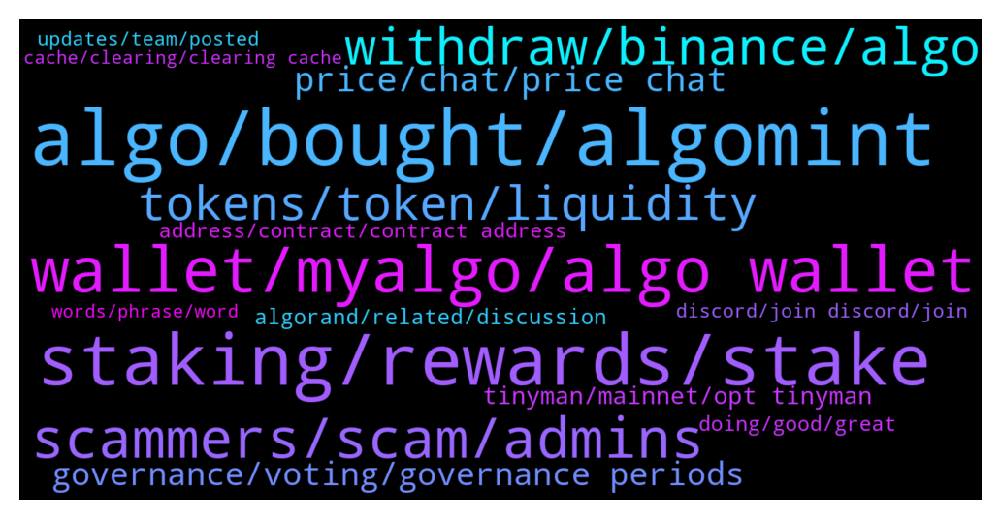

# **@algorand**
 ## Analysis for **2022-01-23** - **2022-01-30**.

---

## 📊 **Basic Stats**

**n_messages_sent**: 1016

---

---

## 🔝 **Top keywords and related messages**

1. **algo, bought, algomint**

    @callq --- *I bought at $2 $20,000 of ALGO. Terrible decision.* **--->** [TG Discussion](https://t.me/algorand/333059)

    @acrachael --- *Like this morning sold @ 0.9550 bought back at 0.8480 I increase the quantity of my ALGO* **--->** [TG Discussion](https://t.me/algorand/334971)

    @** --- *can anyone tell me when algo to the moon* **--->** [TG Discussion](https://t.me/algorand/333323)

    @Happy --- *Ive been 2 years jump in algo...* **--->** [TG Discussion](https://t.me/algorand/333404)

    @Happy --- *Will be the same like stable* **--->** [TG Discussion](https://t.me/algorand/334045)

    @Lacika666 --- *What's the skybridge (the mooch) ? 🤔* **--->** [TG Discussion](https://t.me/algorand/334187)

2. **staking, rewards, stake**

    @MMulder432 --- *I'm using it. And i stake my algo in the Algo prize game and the yieldly i'm getting, i'm staking in the staking pools* **--->** [TG Discussion](https://t.me/algorand/335610)

    @monerowhale --- *Is this better than staking from your ledger Nano c* **--->** [TG Discussion](https://t.me/algorand/335395)

    @MackDenver --- *Sure, actually every week you will automatically receive YLDY from your stake, as well as have the chance to win a big ALGO prize. Check more here: https://yieldly.finance/no-loss-prize-game/* **--->** [TG Discussion](https://t.me/algorand/335589)

    @KeepItRealBro --- *Hi, guys. Can you recommend safe ways for multipliying my algos. Wanted to put them into staking on binance, but apy is so low, around 1%. I'm a newbie, sorry for noob question* **--->** [TG Discussion](https://t.me/algorand/332914)

    @LoLo3PK2 --- *Regarding staking: 1. How to delegate/stake? 2. Is it possible to do it through any of the wallets? 3. Estimate APR/APY 4. Is it autocompund? 5. How long does unstake take? 6. While unstaking, do I still receive rewards?  Thabks again!!!* **--->** [TG Discussion](https://t.me/algorand/334733)

    @domioo911 --- *Staking algo on ledger. Its good ?* **--->** [TG Discussion](https://t.me/algorand/335340)

3. **wallet, myalgo, algo wallet**

    @MackDenver --- *1. https://www.algorand.com/ecosystem/use-cases  2. Mobile Wallet: https://algorandwallet.com/support/  Web wallet: https://wallet.myalgo.com/  Extension: https://chrome.google.com/webstore/detail/algosigner/kmmolakhbgdlpkjkcjkebenjheonagdm   3. We don't have an L2 right now.* **--->** [TG Discussion](https://t.me/algorand/334726)

    @NightAlgorand --- *You can download Algorand Wallet here https://algorandwallet.com/* **--->** [TG Discussion](https://t.me/algorand/335745)

    @NightAlgorand --- *Hi there, you can download Algorand Wallet here https://algorandwallet.com/* **--->** [TG Discussion](https://t.me/algorand/335394)

    @Ricky --- *I moved all of my algo into my algo wallet from Coinbase. Does anyone have a source on the actual myalgo wallet APY?* **--->** [TG Discussion](https://t.me/algorand/333366)

    @namhuycp --- *i think wallet.myalgo has some problem* **--->** [TG Discussion](https://t.me/algorand/333526)

    @BranTaco --- *these are my AlgoWorld city cards* **--->** [TG Discussion](https://t.me/algorand/333640)

4. **scammers, scam, admins**

    @Bhavnasatish --- *It's a lie. I understand the admins of this group have two accounts here , one with the group logo and they are using it to scam people* **--->** [TG Discussion](https://t.me/algorand/333933)

    @Kendalljazz --- *I’ve gotten like 6 scam messages in last 30 minutes* **--->** [TG Discussion](https://t.me/algorand/335295)

    @Pablo_cast --- *before you must be mostly a legally established business. Now they are verifing some easy to sigh scams* **--->** [TG Discussion](https://t.me/algorand/335681)

    @CryptoSLP --- *Thanks. I never do. Bunch of scammers thinking I'm some noob* **--->** [TG Discussion](https://t.me/algorand/335149)

    @MackDenver --- *If you receive such a dm, report them too* **--->** [TG Discussion](https://t.me/algorand/335270)

    @auronsan --- *they fight for their life from money scam* **--->** [TG Discussion](https://t.me/algorand/335274)

5. **withdraw, binance, algo**

    @jumpfetus --- *that's not exactly right. You deposit USD to Coinbase, then on Coinbase Pro you "deposit" the USD from your Coinbase account, THEN buy Algo on Pro and you can send it immediately* **--->** [TG Discussion](https://t.me/algorand/335313)

    @MackDenver --- *Hey Crypto Bearzz, You can buy from exchange. ALGO withdrawal fee is quite small.* **--->** [TG Discussion](https://t.me/algorand/335234)

    @martibro --- *you can swap on binance and sent it to algo wallet* **--->** [TG Discussion](https://t.me/algorand/334129)

    @crypto_bearzz --- *i just need 1 ALGO sir ☺️🙏 Binance Exchange withdrawal min 10ALGO 😁* **--->** [TG Discussion](https://t.me/algorand/335235)

    @Kendalljazz --- *Binance allows to you to instantly withdraw algo if I buy it today?* **--->** [TG Discussion](https://t.me/algorand/335246)

    @MackDenver --- *You can find it on Kucoin, gate and at a few other exchanges. I don't have enough information about Binance and Coinbase.* **--->** [TG Discussion](https://t.me/algorand/332950)

6. **tokens, token, liquidity**

    @NightAlgorand --- *Hey, our tokenomics is here if that is what you are looking for https://algorand.foundation/the-algo/algo-dynamics* **--->** [TG Discussion](https://t.me/algorand/335699)

    @hrbooms --- *Oh hey checking back in, thanks for sending this but I’m looking for information on the private sales, dates they occurred, the amount of tokens sold, the price they were sold at. Stuff like that* **--->** [TG Discussion](https://t.me/algorand/335710)

    @fatherAbraham1 --- *How then do we verify if the tokens they hold are vested?* **--->** [TG Discussion](https://t.me/algorand/333968)

    @Awesome --- *To make sure they don't try to steal tokens?* **--->** [TG Discussion](https://t.me/algorand/335267)

    @MackDenver --- *It was reduced as per our tokenomic schedule* **--->** [TG Discussion](https://t.me/algorand/333286)

    @Owl321 --- *Is there a list of algorand tokens?* **--->** [TG Discussion](https://t.me/algorand/333320)

7. **price, chat, price chat**

    @MackDenver --- *Hi creptotronox, We don't talk about the market or price prediction on this chat. Please join the price chat to discuss about this @algorand_price* **--->** [TG Discussion](https://t.me/algorand/334517)

    @MackDenver --- *Guys, gentle reminder to take price chat to https://t.me/algorand_price* **--->** [TG Discussion](https://t.me/algorand/335015)

    @NightAlgorand --- *Price discussion to https://t.me/algorand_price, thank you 😄* **--->** [TG Discussion](https://t.me/algorand/334424)

    @NightAlgorand --- *Hi everyone, please refer to https://t.me/algorand_price for price discussion 🙂* **--->** [TG Discussion](https://t.me/algorand/334244)

    @NightAlgorand --- *Gentle reminder that we have a price channel https://t.me/algorand_price* **--->** [TG Discussion](https://t.me/algorand/334356)

    @khunpon --- *for price and meme, come here guys https://t.me/algorand_price* **--->** [TG Discussion](https://t.me/algorand/334494)

8. **governance, voting, governance periods**

    @dspios --- *When is voting for governance period 2 going to begin? Does one receive a notification inside algowallet for the same?* **--->** [TG Discussion](https://t.me/algorand/333501)

    @kramercrypto --- *Can you point me in the right direction Mack? I can see that rewards are planned to 2029, is that the expected length of Governance periods?* **--->** [TG Discussion](https://t.me/algorand/334894)

    @SavoryMonkey --- *This sessions governance voting is set to begin February 1st but their is still nothing to vote on?  Am I missing the proposals?  It just says coming soon on the governance page.* **--->** [TG Discussion](https://t.me/algorand/334972)

    @juquinbu --- *All rewards will all be based on Governance voting now. Check “Governance”* **--->** [TG Discussion](https://t.me/algorand/334719)

    @MackDenver --- *Voting will begin on February 1* **--->** [TG Discussion](https://t.me/algorand/333502)

    @kramercrypto --- *Is there a currently known cap on how many governance periods there will be?* **--->** [TG Discussion](https://t.me/algorand/334891)

9. **tinyman, mainnet, opt tinyman**

    @Franklinsmooth --- *Not sure tinyman is working at the moment* **--->** [TG Discussion](https://t.me/algorand/333737)

    @NightAlgorand --- *Hi there, Tinyman will live soon, please stay tuned 🙂* **--->** [TG Discussion](https://t.me/algorand/333590)

    @Dave --- *Hey guys make don’t investe Any project on tinyman because Algorand verified. Soon verified they are pooling rugs on people* **--->** [TG Discussion](https://t.me/algorand/335657)

    @Adrian --- *When tinyman will be back on mainnet? 🧐* **--->** [TG Discussion](https://t.me/algorand/333505)

    @fabio1515k --- *Sorry I’m not familiar w any other than tinyman which has been exploited* **--->** [TG Discussion](https://t.me/algorand/333098)

    @Pablo_cast --- *with tinyman down they are not working properly* **--->** [TG Discussion](https://t.me/algorand/333206)

10. **algorand, related, discussion**

    @DiederickJacobs --- *Can I PM you, about Algorand? :)* **--->** [TG Discussion](https://t.me/algorand/335912)

    @NightAlgorand --- *check out this link for all project built on Algorand https://www.algorand.com/ecosystem/use-cases* **--->** [TG Discussion](https://t.me/algorand/333326)

    @Dennis --- *Is there any news, update, what’s juicy in Algorand these days* **--->** [TG Discussion](https://t.me/algorand/334453)

    @angelo9007 --- *Here is the chat for Algorand* **--->** [TG Discussion](https://t.me/algorand/334451)

    @NightAlgorand --- *Hi there, please keep your discussion in line with Algorand 🙂* **--->** [TG Discussion](https://t.me/algorand/335190)

    @Erdinc --- *Hello can somebody help me with my algorand* **--->** [TG Discussion](https://t.me/algorand/334095)

11. **address, contract, contract address**

    @karlos1878 --- *Does it not have an address sorry for the newby question* **--->** [TG Discussion](https://t.me/algorand/333185)

    @MackDenver --- *Hello there,  In Algorand, there is asset ID which is quite similar like contracts. You can check the creator address in Algoscan.* **--->** [TG Discussion](https://t.me/algorand/333956)

    @NightAlgorand --- *Algorand does not have Contract address as it is not ERC. Did you send your funds to the wrong address? If so, there is nothing we can do to retrieve my funds unfortunately.* **--->** [TG Discussion](https://t.me/algorand/334139)

    @NightAlgorand --- *there is no contract address as Algorand is not ERC* **--->** [TG Discussion](https://t.me/algorand/332972)

    @NightAlgorand --- *There is no contract address for Algorand. We are not a ERC20 token.* **--->** [TG Discussion](https://t.me/algorand/334838)

    @MackDenver --- *In the Algo, you don't need a contract address like ERC-20.* **--->** [TG Discussion](https://t.me/algorand/333195)

12. **doing, good, great**

    @MackDenver --- *Good morning, everyone! Hope everyone is doing well.* **--->** [TG Discussion](https://t.me/algorand/335421)

    @MackDenver --- *Good day, Algorand Community! How is everyone doing today?* **--->** [TG Discussion](https://t.me/algorand/333445)

    @mcmaxims --- *Yes, @NightAlgorand and @MackDenver doing a great job :)* **--->** [TG Discussion](https://t.me/algorand/335219)

    @MackDenver --- *You have a great day too, Luca!* **--->** [TG Discussion](https://t.me/algorand/336007)

    @lixiaoman005 --- *Hello everyone, good afternoon everyone. 🥰* **--->** [TG Discussion](https://t.me/algorand/333325)

    @Monica241 --- *Good morning and i hope we all have a beautiful day ahead* **--->** [TG Discussion](https://t.me/algorand/335597)

13. **updates, team, posted**

    @NightAlgorand --- *We will let you guys know as soon as there is any updates regarding this* **--->** [TG Discussion](https://t.me/algorand/335341)

    @MackDenver --- *I will check it with the team for confirmation. Thanks for the heads up.* **--->** [TG Discussion](https://t.me/algorand/333983)

    @Tiny_Philosopher_784 --- *Some good news, if anyone is interested.  https://twitter.com/headline_crypto/status/1484741732696739840?s=20* **--->** [TG Discussion](https://t.me/algorand/334447)

    @NightAlgorand --- *Sorry I misunderstood the question, we will keep you posted once there is any updates on this.* **--->** [TG Discussion](https://t.me/algorand/335939)

    @angelo9007 --- *We will let you guys know as soon as there is any updates regarding this* **--->** [TG Discussion](https://t.me/algorand/334434)

    @NightAlgorand --- *Hi there, there no update yet, please stay tuned 🙂* **--->** [TG Discussion](https://t.me/algorand/334247)

14. **discord, join discord, join**

    @MackDenver --- *You should post about it in our discord  https://discord.gg/84AActu3at* **--->** [TG Discussion](https://t.me/algorand/333722)

    @Adders28 --- *There are some here but you would be better on discord* **--->** [TG Discussion](https://t.me/algorand/334668)

    @NightAlgorand --- *You might get better clarity on nodes in our Discord 🙂* **--->** [TG Discussion](https://t.me/algorand/334770)

    @MeritRichard --- *I was unable to join the discord* **--->** [TG Discussion](https://t.me/algorand/334386)

    @angelo9007 --- *You can find better clarity on our discord* **--->** [TG Discussion](https://t.me/algorand/334669)

    @Robert --- *Looking for people to join a discord anyone interested?* **--->** [TG Discussion](https://t.me/algorand/333693)

15. **cache, clearing, clearing cache**

    @MackDenver --- *Can you try clearing your cache and try again?* **--->** [TG Discussion](https://t.me/algorand/335474)

    @namhuycp --- *i know, but request too many time. in 1 minutes, every step requests me to input password* **--->** [TG Discussion](https://t.me/algorand/333519)

    @BBeniek --- *Hmm interesting, when I'm using LTE this error doesn't appear* **--->** [TG Discussion](https://t.me/algorand/335439)

    @MackDenver --- *Hello Beniek, Please make sure you are properly connected to the internet.* **--->** [TG Discussion](https://t.me/algorand/335435)

    @BBeniek --- *Do you happen to know why I'm receiving this error all the time?* **--->** [TG Discussion](https://t.me/algorand/335434)

    @NightAlgorand --- *It works for me, have you tried clearing cache?* **--->** [TG Discussion](https://t.me/algorand/333831)

