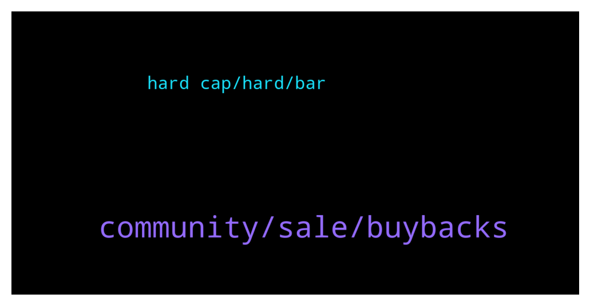

# **@ampnetapxchat**
 ## Analysis for **2022-01-23** - **2022-01-30**.

---

## 📊 **Basic Stats**

**n_messages_sent**: 65

---

---

## 🔝 **Top keywords and related messages**

1. **community, sale, buybacks**

    @PFCBLic --- *Cool. Thanks for answer! So setup fee will be generating buybacks? Will this be visible as  public event?  I think validating that buyback actualy works is very important for future of this token  I understand that price cant be fixation for the team but some focus is to be expected since this community also supported this financial stabilty team has in upcomming period* **--->** [TG Discussion](https://t.me/ampnetapxchat/36622)

    @PFCBLic --- *Hey chat chief,  Any info on current business model? I mean about possible changes in it? If we dont generate income than buyback mechanism wont live. Paying for using your solution only upon successful funding is maybe questionable. Risk of failed campaign is on you instead on client side. Especially if you claim to be technology/solution provider.  I am here from beggining and i like vision for this project but are we going to see any adaptability on this road?  I support great efforts regarding onboarding of new clients and i like enthusiasm.  Stay safe!* **--->** [TG Discussion](https://t.me/ampnetapxchat/36619)

    @Braam --- *I see the Vatreni token is 80% funded. However it's only until the 2 feb.  Jakov please explain what happens if the 2nd comes and goes when the funding has reached $500000. And then conversely what happens if it does fulfill the total amount? Thanks* **--->** [TG Discussion](https://t.me/ampnetapxchat/36856)

    @North --- *Are we as the community allowed to talk about it here even or will posts be deleted? I had no idea it was even running yet, I thought you guys were still working on tokenomics and going to release more info* **--->** [TG Discussion](https://t.me/ampnetapxchat/36740)

    @North --- *@jakovtradingmentor what do you think about timing of any shilling to Chiliz community? They obviously have aligned interests and so would probably be interested here too, but we should take care to not get ahead of ourselves* **--->** [TG Discussion](https://t.me/ampnetapxchat/36775)

    @jakovtradingmentor --- *well i'm told we as ampnet cant really go around and shill the projects on our platform, something about the legality around it doesnt allow us to do so* **--->** [TG Discussion](https://t.me/ampnetapxchat/36779)

2. **hard cap, hard, bar**

    @mislavjavor --- *Hey all, the bar counts until hard cap is reached, the percentage until the hard cap i* **--->** [TG Discussion](https://t.me/ampnetapxchat/36808)

    @Tinus_Tussengas_1984 --- *thanks m8. that loading bar is looking strange btw... i assume its to see the progress in time to the deadline instead of the percentage of funding 😋* **--->** [TG Discussion](https://t.me/ampnetapxchat/36806)

    @jakovtradingmentor --- *i'm not a 100% sure as I haven't been told so maybe one of the devs can answer this* **--->** [TG Discussion](https://t.me/ampnetapxchat/36859)

    @mislavjavor --- *there should be a dot like this, where the soft cap is* **--->** [TG Discussion](https://t.me/ampnetapxchat/36812)

    @matejmz --- *Yeah, it is bugged apparently. (Time would be at 50%, so this is not the case)  @mislavjavor* **--->** [TG Discussion](https://t.me/ampnetapxchat/36807)

    @mislavjavor --- *so the percentage can be 130%, 150%, etc...* **--->** [TG Discussion](https://t.me/ampnetapxchat/36810)

